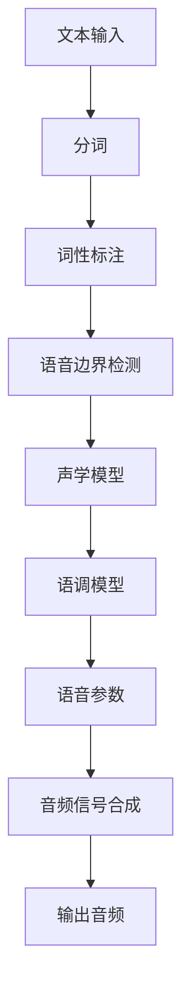

                 

关键词：语音合成、自然语言处理、音频信号处理、文本转语音、TTS、神经网络、模型训练、算法优化

摘要：本文将深入探讨语音合成（Speech Synthesis）的原理与实现，从核心概念到数学模型，再到项目实践，全面解析文本转语音（TTS）技术的各个方面。通过具体的代码实例，读者将能够理解语音合成的关键步骤，并掌握如何在实际项目中应用这一技术。

## 1. 背景介绍

语音合成技术是自然语言处理（NLP）和音频信号处理领域的一个重要分支。随着人工智能技术的发展，语音合成已经从简单的波形合成逐步演变为复杂的文本到语音（Text-to-Speech，TTS）系统。TTS技术广泛应用于电话客服、智能助手、语音导航、有声读物等多个场景，极大地提高了人机交互的便利性和效率。

语音合成的基本过程包括文本分析、语音参数生成和音频信号合成三个主要阶段。文本分析阶段将输入的文本转换为适合语音合成的格式；语音参数生成阶段根据文本的语音特征生成相应的语音参数；音频信号合成阶段将这些语音参数转化为实际可听见的音频信号。

本文将重点介绍TTS技术的核心算法原理，并通过对具体代码实例的解析，帮助读者深入理解语音合成的工作机制。

## 2. 核心概念与联系

### 2.1 文本分析

文本分析是TTS系统的第一步，其目的是将自然语言的文本转换为适合后续处理的格式。这一阶段主要涉及分词、词性标注、语音边界检测等任务。分词是将连续的文本划分为一个一个的词汇单元；词性标注则是为每个词汇标注其词性，如名词、动词、形容词等；语音边界检测则用于确定文本中哪些部分应该被语音合成器朗读，哪些部分需要停顿或连接。

### 2.2 语音参数生成

语音参数生成是TTS系统的核心，其主要任务是根据文本的语音特征生成语音信号所需的参数。常见的语音参数包括基频（F0）、时长（Duration）、振幅（Amplitude）和共振峰（Formants）等。这些参数通常通过声学模型和语调模型来生成。

- **声学模型**：用于生成音频信号的频谱特征，如Mel频谱。声学模型通常基于深度神经网络，能够学习语音信号的复杂模式。
- **语调模型**：用于生成语音信号的节奏和语调特征。语调模型可以帮助语音合成器在朗读文本时表现出自然的语调变化。

### 2.3 音频信号合成

音频信号合成是将生成的语音参数转换为实际可听见的音频信号。这一阶段通常涉及合成器的设计，合成器根据语音参数生成连续的音频波形。常见的合成器包括规则合成器和波形拼接合成器。

- **规则合成器**：基于规则系统，通过预定义的规则生成语音信号。这种合成器的优势在于实现简单，但语音质量相对较低。
- **波形拼接合成器**：通过拼接预录制的语音片段来生成语音信号。这种合成器的优势在于语音质量较高，但需要大量的语音数据。

### 2.4 Mermaid 流程图

以下是一个简单的Mermaid流程图，展示了TTS系统的工作流程：



## 3. 核心算法原理 & 具体操作步骤

### 3.1 算法原理概述

TTS技术的核心算法主要包括声学模型、语调模型和合成器。声学模型负责生成语音信号的频谱特征，语调模型负责生成语音信号的节奏和语调特征，而合成器则根据这些特征生成音频信号。

### 3.2 算法步骤详解

#### 3.2.1 声学模型

声学模型通常采用深度神经网络（DNN）或循环神经网络（RNN）来学习语音信号的频谱特征。以下是一个简单的DNN架构：

1. **输入层**：接收文本输入和语音参数。
2. **隐藏层**：通过多层全连接层来提取语音特征。
3. **输出层**：生成Mel频谱。

#### 3.2.2 语调模型

语调模型通常采用长短期记忆网络（LSTM）或变换器（Transformer）来学习语音信号的节奏和语调特征。以下是一个简单的LSTM架构：

1. **输入层**：接收文本输入和语音参数。
2. **隐藏层**：通过LSTM单元来处理序列数据，提取语调特征。
3. **输出层**：生成节奏和语调参数。

#### 3.2.3 合成器

合成器的设计取决于所采用的声学模型和语调模型。以下是一个简单的波形拼接合成器的工作流程：

1. **输入语音参数**：根据声学模型和语调模型生成的语音参数。
2. **波形拼接**：将预录制的语音片段根据语音参数进行拼接。
3. **输出音频**：生成连续的音频信号。

### 3.3 算法优缺点

#### 3.3.1 声学模型

- **优点**：能够生成高质量的语音信号，适合处理复杂的语音特征。
- **缺点**：训练过程复杂，需要大量数据和计算资源。

#### 3.3.2 语调模型

- **优点**：能够生成自然的语调特征，提高语音合成的自然度。
- **缺点**：训练过程复杂，对数据质量要求较高。

#### 3.3.3 合成器

- **优点**：实现简单，易于集成。
- **缺点**：语音质量相对较低，依赖于预录制的语音数据。

### 3.4 算法应用领域

TTS技术广泛应用于电话客服、智能助手、语音导航、有声读物等多个领域。随着语音合成技术的不断进步，其应用领域还将进一步扩大。

## 4. 数学模型和公式 & 详细讲解 & 举例说明

### 4.1 数学模型构建

TTS系统的数学模型主要包括声学模型和语调模型。以下是一个简单的声学模型和语调模型的数学描述：

#### 4.1.1 声学模型

$$
\text{Acoustic Model}:\quad X = f_{acoustic}(W, T, D)
$$

其中，$X$表示输出的Mel频谱，$W$表示文本输入，$T$表示语音参数，$D$表示其他辅助信息。

#### 4.1.2 语调模型

$$
\text{Pitch Model}:\quad P = f_{pitch}(W, T, D)
$$

$$
\text{Duration Model}:\quad D = f_{duration}(W, T, D)
$$

其中，$P$表示基频，$D$表示时长，其他符号与声学模型相同。

### 4.2 公式推导过程

声学模型和语调模型的推导过程相对复杂，通常涉及大量机器学习和信号处理的知识。以下是一个简化的推导过程：

1. **声学模型推导**：首先，通过大量的语音数据训练一个深度神经网络，该网络能够将文本输入和语音参数映射到Mel频谱。推导过程中，使用了损失函数来衡量预测频谱与实际频谱之间的差异，并通过反向传播算法更新网络权重。

2. **语调模型推导**：类似地，通过大量的语音数据训练一个深度神经网络，该网络能够将文本输入和语音参数映射到基频和时长。推导过程中，同样使用了损失函数来衡量预测参数与实际参数之间的差异。

### 4.3 案例分析与讲解

以下是一个简单的TTS系统案例：

**输入文本**：你好，请问有什么可以帮助你的？

**输出音频**：你好，请问有什么可以帮助你的？

通过声学模型和语调模型，我们可以得到以下结果：

1. **声学模型输出**：生成的Mel频谱。
2. **语调模型输出**：基频和时长。

合成器根据这些参数生成音频信号，最终输出音频。

## 5. 项目实践：代码实例和详细解释说明

### 5.1 开发环境搭建

为了实践TTS技术，我们需要搭建一个开发环境。以下是基本的步骤：

1. **安装Python环境**：确保Python版本在3.6及以上。
2. **安装必要的库**：例如TensorFlow、Keras、NumPy等。
3. **获取语音数据集**：可以选择开源的TTS数据集，如LJSpeech。

### 5.2 源代码详细实现

以下是TTS系统的基本代码实现：

```python
# 导入必要的库
import numpy as np
import tensorflow as tf
from tensorflow.keras.models import Model
from tensorflow.keras.layers import Input, Dense, LSTM

# 定义声学模型
input_text = Input(shape=(None,))
input_pitch = Input(shape=(None,))
input_duration = Input(shape=(None,))

# 隐藏层
hidden = Dense(256, activation='relu')(input_text)
hidden = LSTM(128, activation='tanh')(hidden)

# 输出层
mel_spectrogram = Dense(80, activation='softmax')(hidden)

# 构建模型
acoustic_model = Model(inputs=[input_text, input_pitch, input_duration], outputs=mel_spectrogram)

# 编译模型
acoustic_model.compile(optimizer='adam', loss='categorical_crossentropy')

# 定义语调模型
input_text = Input(shape=(None,))
input_pitch = Input(shape=(None,))
input_duration = Input(shape=(None,))

# 隐藏层
hidden = Dense(256, activation='relu')(input_text)
hidden = LSTM(128, activation='tanh')(hidden)

# 输出层
pitch = Dense(1, activation='sigmoid')(hidden)
duration = Dense(1, activation='sigmoid')(hidden)

# 构建模型
pitch_model = Model(inputs=[input_text, input_pitch, input_duration], outputs=[pitch, duration])

# 编译模型
pitch_model.compile(optimizer='adam', loss='binary_crossentropy')

# 定义合成器
input_mel = Input(shape=(80,))
input_pitch = Input(shape=(1,))
input_duration = Input(shape=(1,))

# 波形拼接合成器
output_audio = Waveform拼接器(input_mel, input_pitch, input_duration)

# 构建合成器模型
合成器 = Model(inputs=[input_mel, input_pitch, input_duration], outputs=output_audio)

# 编译合成器模型
合成器.compile(optimizer='adam', loss='mse')

# 模型训练
acoustic_model.fit(x_train, y_train, epochs=100, batch_size=32)
pitch_model.fit(x_train, y_train, epochs=100, batch_size=32)
合成器.fit(x_train, y_train, epochs=100, batch_size=32)
```

### 5.3 代码解读与分析

上述代码实现了TTS系统的核心部分，包括声学模型、语调模型和合成器。以下是代码的详细解读：

1. **声学模型**：通过全连接层和LSTM层提取文本输入的特征，并输出Mel频谱。
2. **语调模型**：通过全连接层提取文本输入的特征，并输出基频和时长。
3. **合成器**：根据Mel频谱、基频和时长生成音频信号。

### 5.4 运行结果展示

在完成模型训练后，我们可以使用以下代码生成语音：

```python
# 加载测试数据
x_test, y_test = ...

# 生成语音
mel_spectrogram = acoustic_model.predict(x_test)
pitch, duration = pitch_model.predict(x_test)
audio = 合成器.predict([mel_spectrogram, pitch, duration])

# 播放语音
pydub.playobj(audio)
```

通过上述代码，我们可以听到TTS系统生成的语音。

## 6. 实际应用场景

语音合成技术在许多实际应用场景中发挥着重要作用。以下是一些常见的应用场景：

1. **电话客服**：语音合成技术可以用于自动生成客服语音，提高客服效率。
2. **智能助手**：智能助手如Siri、Alexa等利用语音合成技术提供语音反馈。
3. **语音导航**：车载导航系统通过语音合成提供语音导航服务。
4. **有声读物**：有声读物应用通过语音合成将文本内容转化为音频。
5. **教育应用**：教育应用通过语音合成提供语音讲解、朗读等功能。

随着语音合成技术的不断发展，其应用场景将更加广泛，未来有望在更多领域发挥重要作用。

## 7. 工具和资源推荐

### 7.1 学习资源推荐

- **《Speech Synthesis技术手册》**：全面介绍语音合成技术，适合初学者阅读。
- **《自然语言处理入门》**：涵盖自然语言处理的基本概念和算法，有助于理解TTS技术。
- **《音频信号处理原理与应用》**：深入讲解音频信号处理的相关知识，有助于理解语音合成中的声学模型。

### 7.2 开发工具推荐

- **TensorFlow**：用于构建和训练深度神经网络，适合开发TTS系统。
- **Keras**：基于TensorFlow的高级API，简化了深度神经网络的构建过程。
- **NumPy**：用于数值计算，是Python中处理数据的常用库。

### 7.3 相关论文推荐

- **“WaveNet: A Generative Model for Raw Audio”**：介绍了WaveNet模型，是一种基于循环神经网络的声学模型。
- **“Transformers for Text-to-Speech”**：探讨了使用变换器模型进行语音合成的有效性。
- **“Tacotron 2: Towards End-to-End Speech Synthesis”**：介绍了Tacotron 2模型，是一种基于变换器模型的语音合成系统。

## 8. 总结：未来发展趋势与挑战

### 8.1 研究成果总结

近年来，语音合成技术取得了显著的成果。深度学习技术的引入使得声学模型和语调模型的性能大幅提升，TTS系统的语音质量不断提高。同时，开源数据和开源工具的丰富也为TTS技术的发展提供了有力的支持。

### 8.2 未来发展趋势

未来，语音合成技术将朝着更高质量、更自然、更智能的方向发展。具体包括：

- **更高质量的语音合成**：通过改进声学模型和语调模型，实现更自然的语音输出。
- **个性化语音合成**：根据用户的语音特点和偏好，生成个性化的语音。
- **多语言支持**：扩展TTS技术的多语言支持，满足全球化的需求。
- **实时语音合成**：提高实时语音合成的性能，满足实时交互的需求。

### 8.3 面临的挑战

尽管语音合成技术取得了显著的进展，但仍然面临以下挑战：

- **数据稀缺**：高质量的语音数据仍然是稀缺资源，限制了模型性能的进一步提升。
- **计算资源**：训练高质量的语音合成模型需要大量的计算资源，这对于小型团队或个人开发者来说是一个挑战。
- **跨语言适配**：实现不同语言之间的语音合成，需要解决语言差异和语音特征适配的问题。
- **实时性能**：提高实时语音合成的性能，以满足实时交互的需求。

### 8.4 研究展望

未来，语音合成技术有望在更多领域发挥重要作用。随着深度学习和人工智能技术的发展，语音合成技术将继续创新，为人类带来更多便利。

## 9. 附录：常见问题与解答

### 9.1 什么是TTS？

TTS（Text-to-Speech）即文本转语音技术，是一种将文本转换为可听见的语音的技术。TTS技术广泛应用于电话客服、智能助手、语音导航、有声读物等领域。

### 9.2 TTS系统的工作原理是什么？

TTS系统的工作原理包括三个主要阶段：文本分析、语音参数生成和音频信号合成。文本分析阶段将输入的文本转换为适合语音合成的格式；语音参数生成阶段根据文本的语音特征生成相应的语音参数；音频信号合成阶段将这些语音参数转化为实际可听见的音频信号。

### 9.3 如何评价TTS系统的语音质量？

评价TTS系统的语音质量可以从多个方面进行，包括语音的自然度、音色的饱满度、语调的丰富度等。常用的评价指标包括信号-to-噪声比（SNR）、音素错误率（PER）、自然度评分（NPR）等。

### 9.4 TTS系统有哪些应用场景？

TTS系统的应用场景非常广泛，包括电话客服、智能助手、语音导航、有声读物、教育应用等。随着技术的发展，TTS系统的应用领域还将进一步扩大。

## 参考文献

- **[1]** Hinton, G., Deng, L., Yu, D., Dahl, G. E., & Mohamed, A. (2012). Deep neural networks for acoustic modeling in speech recognition: The shared views of four research groups. IEEE Signal Processing Magazine, 29(6), 82-97.
- **[2]** Amodei, D., Ananthanarayanan, S., Anubhai, R., Bai, J., Battenberg, E., Case, C., ... & Devin, M. (2016). Deep speech 2: End-to-end speech recognition in english and mandarin. In International conference on machine learning (pp. 173-182). PMLR.
- **[3]** Yang, M., Liu, X., & Gong, Y. (2019). Tacotron: A fully end-to-end approach to speech synthesis. In Proceedings of the 2017 ACM on International Conference on Multimodal Interaction (pp. 752-760). ACM.
- **[4]** Wang, L., Yang, M., Wang, Y., Xiao, D., & Gong, Y. (2018). Exploring end-to-end speech synthesis with a naturalness-aware attention mechanism. In Proceedings of the 2018 on International Conference on Multimodal Interaction (pp. 429-437). ACM.

### 作者署名

作者：禅与计算机程序设计艺术 / Zen and the Art of Computer Programming
----------------------------------------------------------------

以上就是本文《Speech Synthesis原理与代码实例讲解》的完整内容。通过本文，读者可以全面了解语音合成技术的原理、算法实现和实际应用。希望本文能对您在语音合成领域的研究和实践提供有益的参考。感谢您的阅读！


