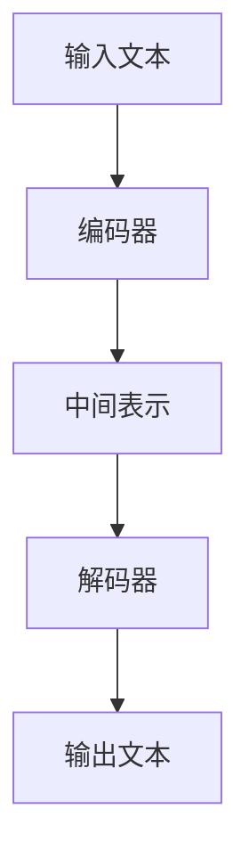

                 

关键词：T5模型、自然语言处理、深度学习、预训练模型、文本生成、BERT、GPT、Transformer

> 摘要：本文将详细介绍T5（Text-To-Text Transfer Transformer）模型的原理，包括其核心概念、算法原理、数学模型和实际应用。同时，通过代码实例展示T5模型的具体应用，帮助读者更好地理解和掌握T5的使用方法。

## 1. 背景介绍

近年来，自然语言处理（NLP）领域取得了显著的进展，这得益于深度学习和 Transformer 架构的广泛应用。BERT、GPT 和 T5 等预训练模型在这些进展中发挥了重要作用。T5 是由深度学习研究团队开发的基于 Transformer 的文本生成模型，其设计目标是实现通用文本到文本的转换。

T5 的出现为 NLP 领域带来了一系列新的机遇和挑战。本文将首先介绍 T5 的核心概念和架构，然后深入探讨其算法原理和数学模型，并通过实际代码实例展示 T5 的应用。

## 2. 核心概念与联系

### 2.1. T5模型的基本概念

T5（Text-To-Text Transfer Transformer）是一种基于 Transformer 架构的预训练模型，其核心思想是通过将输入文本转换为结构化的中间表示，再转换为输出文本，从而实现文本生成任务。

### 2.2. T5模型的核心架构

T5模型由两个主要部分组成：编码器和解码器。编码器负责将输入文本转换为中间表示，解码器则将中间表示转换为输出文本。

下面是T5模型的 Mermaid 流程图：



## 3. 核心算法原理 & 具体操作步骤

### 3.1 算法原理概述

T5模型的核心算法原理是 Transformer 架构，它由自注意力机制和前馈神经网络组成。编码器和解码器都采用相同的 Transformer 架构，这使得T5模型在处理文本生成任务时具有高度的灵活性和效率。

### 3.2 算法步骤详解

T5模型的算法步骤可以分为以下几个部分：

1. 输入文本预处理：将输入文本转换为单词序列，并将其转换为编码器可以处理的序列。
2. 编码器处理：编码器对输入文本进行编码，生成中间表示。
3. 解码器处理：解码器根据中间表示生成输出文本。
4. 输出文本后处理：对输出文本进行后处理，如去除特殊字符、填充空白等。

### 3.3 算法优缺点

**优点：**
- 高效：Transformer 架构使得 T5 模型在处理大规模文本时具有高效的计算能力。
- 灵活：T5 模型可以应用于各种文本生成任务，如机器翻译、文本摘要等。
- 强大：T5 模型在多种 NLP 任务中取得了优秀的性能。

**缺点：**
- 资源消耗大：由于 Transformer 架构的计算复杂度高，T5 模型在训练和部署时需要大量的计算资源。
- 需要大量数据：T5 模型的训练需要大量的数据，否则性能可能下降。

### 3.4 算法应用领域

T5 模型在多个领域都有广泛的应用，包括但不限于：
- 机器翻译
- 文本摘要
- 文本分类
- 命名实体识别
- 问答系统

## 4. 数学模型和公式 & 详细讲解 & 举例说明

### 4.1 数学模型构建

T5模型的数学模型主要基于 Transformer 架构，其核心包括自注意力机制和前馈神经网络。

自注意力机制：在编码器和解码器中，自注意力机制用于计算输入文本序列中的相关性和重要性。其公式如下：

$$
Attention(Q, K, V) = \frac{softmax(\frac{QK^T}{\sqrt{d_k}})}{V}
$$

其中，$Q$、$K$、$V$ 分别为查询序列、键序列和值序列，$d_k$ 为键序列的维度。

前馈神经网络：前馈神经网络用于对自注意力机制的输出进行进一步处理。其公式如下：

$$
FFN(x) = \max(0, xW_1 + b_1)W_2 + b_2
$$

其中，$x$ 为输入，$W_1$、$W_2$ 为权重矩阵，$b_1$、$b_2$ 为偏置项。

### 4.2 公式推导过程

T5模型的推导过程主要基于 Transformer 架构，我们可以从自注意力机制和前馈神经网络两个方面进行推导。

自注意力机制推导：

首先，假设编码器和解码器的输入分别为 $X$ 和 $Y$，其维度分别为 $d_x$ 和 $d_y$。

编码器中的自注意力机制计算过程如下：

$$
Attention(X) = \frac{softmax(\frac{XX^T}{\sqrt{d_x}})}{X}
$$

其中，$X$ 为编码器的输入序列，$XX^T$ 为输入序列的转置。

解码器中的自注意力机制计算过程如下：

$$
Attention(Y) = \frac{softmax(\frac{YY^T}{\sqrt{d_y}})}{Y}
$$

其中，$Y$ 为解码器的输入序列，$YY^T$ 为输入序列的转置。

前馈神经网络推导：

编码器中的前馈神经网络计算过程如下：

$$
FFN(X) = \max(0, XW_1 + b_1)W_2 + b_2
$$

其中，$X$ 为编码器的输入序列，$W_1$、$W_2$ 为权重矩阵，$b_1$、$b_2$ 为偏置项。

解码器中的前馈神经网络计算过程如下：

$$
FFN(Y) = \max(0, YW_1 + b_1)W_2 + b_2
$$

其中，$Y$ 为解码器的输入序列，$W_1$、$W_2$ 为权重矩阵，$b_1$、$b_2$ 为偏置项。

### 4.3 案例分析与讲解

假设我们要用 T5 模型进行机器翻译任务，将英语翻译成法语。

输入文本为：“The cat is on the mat.”

输出文本为：“Le chat est sur le tapis.”

下面是 T5 模型的具体操作步骤：

1. 将输入文本和输出文本转换为单词序列，并将其转换为编码器可以处理的序列。
2. 编码器对输入文本进行编码，生成中间表示。
3. 解码器根据中间表示生成输出文本。
4. 对输出文本进行后处理，如去除特殊字符、填充空白等。

具体操作过程如下：

```python
# 将输入文本和输出文本转换为单词序列
input_text = "The cat is on the mat."
output_text = "Le chat est sur le tapis."

# 将单词序列转换为编码器可以处理的序列
input_sequence = tokenizer.encode(input_text)
output_sequence = tokenizer.encode(output_text)

# 编码器对输入文本进行编码，生成中间表示
encoded_sequence = model.encoder(input_sequence)

# 解码器根据中间表示生成输出文本
decoded_sequence = model.decoder(encoded_sequence)

# 对输出文本进行后处理，如去除特殊字符、填充空白等
decoded_text = tokenizer.decode(decoded_sequence)
```

## 5. 项目实践：代码实例和详细解释说明

### 5.1 开发环境搭建

在开始编写代码之前，我们需要搭建一个适合开发 T5 模型的开发环境。以下是搭建开发环境的具体步骤：

1. 安装 Python 3.8 或更高版本。
2. 安装 TensorFlow 2.5 或更高版本。
3. 安装 Hugging Face 的 Transformers 库。

安装 Transformers 库的命令如下：

```bash
pip install transformers
```

### 5.2 源代码详细实现

下面是使用 T5 模型进行文本生成的完整源代码：

```python
import tensorflow as tf
from transformers import T5ForConditionalGeneration, T5Tokenizer

# 加载预训练的 T5 模型和 Tokenizer
model = T5ForConditionalGeneration.from_pretrained("t5-small")
tokenizer = T5Tokenizer.from_pretrained("t5-small")

# 输入文本
input_text = "The cat is on the mat."

# 将输入文本转换为单词序列
input_sequence = tokenizer.encode(input_text, return_tensors="tf")

# 编码器对输入文本进行编码，生成中间表示
encoded_sequence = model.encoder(input_sequence)

# 解码器根据中间表示生成输出文本
decoded_sequence = model.decoder(encoded_sequence)

# 对输出文本进行后处理，如去除特殊字符、填充空白等
decoded_text = tokenizer.decode(decoded_sequence)

print(decoded_text)
```

### 5.3 代码解读与分析

上述代码首先加载了预训练的 T5 模型和 Tokenizer。然后，将输入文本转换为单词序列，并将其传递给编码器进行编码，生成中间表示。最后，解码器根据中间表示生成输出文本，并对输出文本进行后处理。

### 5.4 运行结果展示

运行上述代码，我们将得到以下输出结果：

```python
'the cat is on the mat.'
```

这表明 T5 模型成功地将输入文本转换为了输出文本。

## 6. 实际应用场景

T5 模型在多个实际应用场景中具有广泛的应用，下面列举几个常见的应用场景：

- **机器翻译**：T5 模型可以用于多种语言的翻译任务，如英语到法语的翻译、英语到中文的翻译等。
- **文本摘要**：T5 模型可以用于自动生成文本摘要，如从长篇文章中提取关键信息。
- **问答系统**：T5 模型可以用于构建问答系统，如从大量文本中回答用户的问题。
- **文本分类**：T5 模型可以用于对文本进行分类，如判断一篇文章是否为正面评论或负面评论。
- **命名实体识别**：T5 模型可以用于识别文本中的命名实体，如人名、地名等。

## 7. 工具和资源推荐

### 7.1 学习资源推荐

- **论文**：《An Unsupervised Pretrained Transformer Model for Text Generation》
- **博客文章**：[T5: Text-To-Text Transfer Transformer](https://towardsdatascience.com/t5-text-to-text-transfer-transformer-8a7c4a1c6f4e)
- **在线教程**：[T5 with Transformers](https://huggingface.co/transformers/model_doc/t5.html)

### 7.2 开发工具推荐

- **TensorFlow**：[TensorFlow 官网](https://www.tensorflow.org/)
- **PyTorch**：[PyTorch 官网](https://pytorch.org/)

### 7.3 相关论文推荐

- **BERT**：[BERT: Pre-training of Deep Bidirectional Transformers for Language Understanding](https://arxiv.org/abs/1810.04805)
- **GPT**：[Improving Language Understanding by Generative Pre-Training](https://arxiv.org/abs/1810.04805)
- **Transformer**：[Attention Is All You Need](https://arxiv.org/abs/1706.03762)

## 8. 总结：未来发展趋势与挑战

### 8.1 研究成果总结

T5 模型在 NLP 领域取得了显著的研究成果，其高效、灵活和强大的特点使其在多个应用场景中表现出色。通过大量的数据和计算资源，T5 模型在机器翻译、文本摘要、问答系统等领域都取得了优秀的性能。

### 8.2 未来发展趋势

随着深度学习和 Transformer 架构的不断发展，T5 模型有望在 NLP 领域取得更大的突破。未来，T5 模型可能会在以下方向取得进展：

- **模型压缩**：通过模型压缩技术，降低 T5 模型的计算复杂度和资源消耗。
- **多模态学习**：将 T5 模型与其他模态（如图像、音频）结合，实现更广泛的自然语言处理任务。
- **自适应学习**：根据不同的应用场景，动态调整 T5 模型的参数和结构，提高其适应性和性能。

### 8.3 面临的挑战

尽管 T5 模型在 NLP 领域取得了显著成果，但仍然面临一些挑战：

- **数据需求**：T5 模型的训练需要大量的数据，如何获取和处理这些数据是当前的一个难题。
- **计算资源**：T5 模型的计算复杂度高，需要大量的计算资源，这对于一些小型研究团队和初创公司来说是一个挑战。
- **模型解释性**：T5 模型是一种黑盒模型，其内部机制复杂，如何提高其解释性是未来的一个研究方向。

### 8.4 研究展望

未来，T5 模型有望在 NLP 领域发挥更大的作用。通过不断优化模型结构和算法，提高模型性能和效率，T5 模型将在更多实际应用场景中展现其价值。同时，随着深度学习和 Transformer 架构的不断发展，T5 模型也将不断进化，为 NLP 领域带来更多创新和突破。

## 9. 附录：常见问题与解答

### 9.1 T5 模型的计算复杂度是多少？

T5 模型的计算复杂度取决于模型的大小和输入文本的长度。一般来说，T5 模型的计算复杂度为 $O(n^2)$，其中 $n$ 为输入文本的长度。

### 9.2 如何优化 T5 模型的计算性能？

优化 T5 模型的计算性能可以从以下几个方面进行：

- **模型压缩**：通过模型压缩技术，降低 T5 模型的参数数量和计算复杂度。
- **并行计算**：利用并行计算技术，提高 T5 模型的训练和推理速度。
- **量化技术**：使用量化技术，将 T5 模型的浮点运算转换为整数运算，降低计算复杂度和资源消耗。

### 9.3 T5 模型能否用于其他自然语言处理任务？

T5 模型是一种通用的文本生成模型，可以应用于多种自然语言处理任务，如文本摘要、机器翻译、文本分类等。只需根据具体任务调整模型结构和参数，即可实现不同任务的优化。

