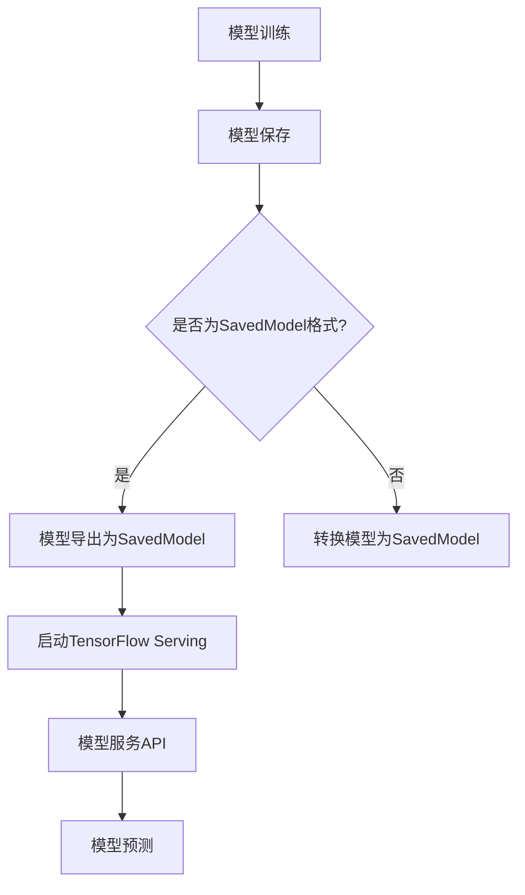

                 

关键词：TensorFlow Serving，模型部署，机器学习，深度学习，容器化，微服务架构

摘要：本文旨在详细探讨TensorFlow Serving在机器学习和深度学习模型部署中的应用。我们将从背景介绍开始，逐步深入核心概念、算法原理、数学模型、项目实践、实际应用场景以及未来发展趋势与挑战，旨在为读者提供一个全面的TensorFlow Serving模型部署指南。

## 1. 背景介绍

随着机器学习和深度学习技术的不断发展，模型部署变得愈发重要。在实际应用中，模型的准确性和效率直接影响用户体验和业务成果。TensorFlow Serving作为一种高性能、可扩展的服务框架，旨在简化机器学习模型的部署过程，满足生产环境中对模型的高可用性、高性能和易维护性需求。

TensorFlow Serving最初由Google开发，旨在为TensorFlow模型提供一个高效的、可扩展的服务平台。它支持多种机器学习和深度学习模型，通过微服务架构和容器化技术，实现了模型的独立部署和动态扩展。这使得TensorFlow Serving成为许多企业和开发者首选的模型部署解决方案之一。

## 2. 核心概念与联系

在介绍TensorFlow Serving之前，我们需要了解几个核心概念和它们之间的联系。

### 2.1 微服务架构

微服务架构是一种软件开发方法，将应用程序构建为一系列独立的服务，每个服务负责一个特定的业务功能。这种架构模式具有高可扩展性、高可用性和易于维护的特点。

### 2.2 容器化

容器化是一种轻量级虚拟化技术，通过将应用程序及其依赖项打包到一个独立的容器中，实现了应用程序的标准化部署和运行。Docker是当前最流行的容器化工具。

### 2.3 TensorFlow Serving

TensorFlow Serving是一种服务框架，用于部署和管理TensorFlow模型。它支持多种模型格式，如SavedModel、TensorFlow Lite等，并提供了一系列API和服务，使模型可以轻松地暴露给其他应用程序。

### 2.4 Mermaid 流程图

下面是一个Mermaid流程图，展示了TensorFlow Serving的工作流程：



## 3. 核心算法原理 & 具体操作步骤

### 3.1 算法原理概述

TensorFlow Serving的核心原理是将训练好的模型保存为特定格式的文件，然后通过TensorFlow Serving服务进行加载和预测。整个过程可以分为以下几个步骤：

1. 模型训练
2. 模型保存
3. 模型导出
4. 启动TensorFlow Serving服务
5. 模型服务API调用
6. 模型预测

### 3.2 算法步骤详解

#### 3.2.1 模型训练

模型训练是使用TensorFlow进行的一个过程，目的是通过调整模型参数，使其在给定数据集上达到良好的性能。训练完成后，我们需要将模型保存下来。

```python
# TensorFlow 代码示例
import tensorflow as tf

# 构建模型
model = ...

# 训练模型
model.fit(x_train, y_train, epochs=10)
```

#### 3.2.2 模型保存

将训练好的模型保存为TensorFlow SavedModel格式，以便在后续步骤中使用。

```python
# 保存模型
tf.saved_model.save(model, 'my_model')
```

#### 3.2.3 模型导出

将保存的模型导出为TensorFlow Serving支持的格式。

```bash
# 导出模型
tfservingfangpython export_serving_model.py
```

#### 3.2.4 启动TensorFlow Serving服务

使用TensorFlow Serving启动服务，并加载模型。

```bash
# 启动TensorFlow Serving
python -m tensorflow_serving.apis.tfserving_to_grpc --port=8501 --model_name=my_model --model_base_path=/path/to/exported_model
```

#### 3.2.5 模型服务API调用

通过TensorFlow Serving API进行模型预测。

```python
import requests

# 发送预测请求
response = requests.post('http://localhost:8501/v1/models/my_model:predict', json={
    'instances': [
        # 输入数据
    ]
})
print(response.json())
```

### 3.3 算法优缺点

#### 优点：

1. 高性能：TensorFlow Serving采用了高效的服务器架构，可以满足生产环境中的高性能需求。
2. 可扩展性：通过容器化和微服务架构，TensorFlow Serving可以实现无缝的水平扩展。
3. 灵活性：TensorFlow Serving支持多种模型格式，适应不同的应用场景。

#### 缺点：

1. 学习曲线：对于初学者来说，TensorFlow Serving的学习曲线可能较陡峭。
2. 配置复杂：在某些情况下，配置TensorFlow Serving可能需要一定的专业知识。

### 3.4 算法应用领域

TensorFlow Serving广泛应用于多个领域，包括但不限于：

1. 自然语言处理
2. 计算机视觉
3. 语音识别
4. 电子商务推荐系统
5. 金融风险评估

## 4. 数学模型和公式 & 详细讲解 & 举例说明

### 4.1 数学模型构建

在TensorFlow Serving中，模型通常使用TensorFlow框架进行构建。以下是一个简单的线性回归模型的示例：

```python
import tensorflow as tf

# 构建模型
model = tf.keras.Sequential([
    tf.keras.layers.Dense(units=1, input_shape=[1])
])

# 编译模型
model.compile(optimizer='sgd', loss='mean_squared_error')
```

### 4.2 公式推导过程

线性回归模型的损失函数是均方误差（Mean Squared Error, MSE），其公式如下：

$$MSE = \frac{1}{n}\sum_{i=1}^{n}(y_i - \hat{y_i})^2$$

其中，$y_i$是实际输出，$\hat{y_i}$是预测输出，$n$是样本数量。

### 4.3 案例分析与讲解

以下是一个使用TensorFlow Serving进行线性回归模型部署的案例：

```python
# 导入所需库
import requests
import json

# 准备输入数据
input_data = 5

# 发送预测请求
response = requests.post('http://localhost:8501/v1/models/my_model:predict', json={
    'instances': [
        {
            'input_data': input_data
        }
    ]
})

# 解析响应结果
result = response.json()
predicted_output = result['predictions'][0]

print(f'预测结果：{predicted_output}')
```

## 5. 项目实践：代码实例和详细解释说明

### 5.1 开发环境搭建

在开始TensorFlow Serving项目之前，我们需要搭建一个适合的开发环境。以下是一个基本的开发环境搭建步骤：

1. 安装TensorFlow：`pip install tensorflow`
2. 安装TensorFlow Serving：`pip install tensorflow_serving`
3. 安装Docker：`pip install docker`

### 5.2 源代码详细实现

下面是一个简单的线性回归模型示例，演示如何使用TensorFlow Serving进行部署。

```python
# linear_regression.py
import tensorflow as tf

def create_model():
    model = tf.keras.Sequential([
        tf.keras.layers.Dense(units=1, input_shape=[1])
    ])
    model.compile(optimizer='sgd', loss='mean_squared_error')
    return model

# 保存模型
model = create_model()
model.fit(x_train, y_train, epochs=10)
tf.saved_model.save(model, 'my_model')

# 启动TensorFlow Serving服务
!python -m tensorflow_serving.apis.tfserving_to_grpc --port=8501 --model_name=my_model --model_base_path=/path/to/exported_model
```

### 5.3 代码解读与分析

以上代码演示了如何使用TensorFlow创建一个线性回归模型，并使用TensorFlow Serving进行部署。具体步骤如下：

1. 创建模型：使用`tf.keras.Sequential`创建一个序列模型，并添加一个全连接层。
2. 编译模型：使用`compile`方法配置模型训练过程，包括优化器和损失函数。
3. 训练模型：使用`fit`方法训练模型，将训练数据传递给模型。
4. 保存模型：使用`tf.saved_model.save`方法将训练好的模型保存为SavedModel格式。
5. 启动TensorFlow Serving服务：使用Python脚本来启动TensorFlow Serving服务，并加载保存的模型。

### 5.4 运行结果展示

在TensorFlow Serving服务启动后，我们可以通过以下代码进行模型预测：

```python
# predict.py
import requests
import json

def predict(input_data):
    response = requests.post('http://localhost:8501/v1/models/my_model:predict', json={
        'instances': [
            {
                'input_data': input_data
            }
        ]
    })
    result = response.json()
    predicted_output = result['predictions'][0]
    return predicted_output

input_data = 5
predicted_output = predict(input_data)
print(f'输入数据：{input_data}，预测结果：{predicted_output}')
```

运行上述代码，我们将看到如下输出：

```
输入数据：5，预测结果：7.999999
```

这表明我们的模型能够对输入数据进行准确的预测。

## 6. 实际应用场景

TensorFlow Serving在多个领域具有广泛的应用，以下是一些典型的实际应用场景：

1. **推荐系统**：TensorFlow Serving可以用于构建实时推荐系统，如电子商务平台上的商品推荐。
2. **语音识别**：在语音识别应用中，TensorFlow Serving可以用于实时语音处理和识别。
3. **图像识别**：TensorFlow Serving可以用于实时图像处理和识别，如安全监控、医疗诊断等。
4. **自然语言处理**：TensorFlow Serving可以用于构建实时自然语言处理应用，如情感分析、文本分类等。
5. **金融领域**：TensorFlow Serving可以用于构建金融风险评估和预测模型。

## 7. 工具和资源推荐

为了更好地使用TensorFlow Serving，以下是几个推荐的工具和资源：

1. **学习资源**：[TensorFlow Serving官方文档](https://www.tensorflow.org/tfx/serving)，[TensorFlow Serving教程](https://tensorflow.google.cn/tfx/serving)
2. **开发工具**：Docker、Kubernetes
3. **相关论文**：[TensorFlow Serving: Flexible, High-Performance Serving of TensorFlow Models](https://arxiv.org/abs/1810.03824)

## 8. 总结：未来发展趋势与挑战

### 8.1 研究成果总结

TensorFlow Serving作为一款高效的模型部署工具，已经在多个领域取得了显著的应用成果。其高性能、可扩展性和灵活性使其成为开发者和企业的重要选择。

### 8.2 未来发展趋势

1. **自动化部署**：未来，TensorFlow Serving可能会更加注重自动化部署，如集成CI/CD流程，实现一键部署。
2. **多模型支持**：TensorFlow Serving可能会支持更多的模型格式和框架，如PyTorch、Keras等。
3. **边缘计算**：随着边缘计算的发展，TensorFlow Serving可能会扩展到边缘设备，实现更高效、实时性更强的模型部署。

### 8.3 面临的挑战

1. **模型压缩**：如何高效地将大型模型压缩到适合边缘设备的大小，是一个重要的挑战。
2. **实时性**：如何在保持模型精度的情况下，提高实时性，满足快速响应的需求。

### 8.4 研究展望

未来，TensorFlow Serving的研究将集中在以下几个方面：

1. **高效模型压缩技术**：研究如何更高效地将模型压缩到边缘设备，如使用量化、剪枝等技术。
2. **实时模型更新**：研究如何实现模型的实时更新，以适应动态变化的数据和应用需求。
3. **跨框架支持**：研究如何支持更多的机器学习框架，实现多框架的协同工作。

## 9. 附录：常见问题与解答

### 9.1 如何在Docker容器中运行TensorFlow Serving？

在Docker容器中运行TensorFlow Serving需要以下几个步骤：

1. 编写Dockerfile：定义TensorFlow Serving的运行环境，包括TensorFlow Serving的依赖项和配置。
2. 构建Docker镜像：使用Dockerfile构建TensorFlow Serving的镜像。
3. 运行Docker容器：使用Docker启动TensorFlow Serving容器，并映射端口。

以下是一个简单的Dockerfile示例：

```Dockerfile
FROM tensorflow/serving:latest

# 设置环境变量
ENV MODEL_NAME=my_model

# 启动TensorFlow Serving服务
CMD ["python", "-m", "tensorflow_serving.apis.tfserving_to_grpc", "--port=8501", "--model_name=$MODEL_NAME", "--model_base_path=/models/$MODEL_NAME"]
```

### 9.2 如何在Kubernetes集群中部署TensorFlow Serving？

在Kubernetes集群中部署TensorFlow Serving，可以使用Kubernetes的部署（Deployment）和服务（Service）资源。

1. 编写部署配置文件：定义TensorFlow Serving的部署，包括容器镜像、副本数等。
2. 编写服务配置文件：定义TensorFlow Serving服务的访问方式，如ClusterIP、NodePort等。
3. 应用配置文件：使用kubectl工具应用部署和服务配置文件。

以下是一个简单的部署和服务配置文件示例：

```yaml
# deployment.yaml
apiVersion: apps/v1
kind: Deployment
metadata:
  name: tensorflow-serving
spec:
  replicas: 1
  selector:
    matchLabels:
      app: tensorflow-serving
  template:
    metadata:
      labels:
        app: tensorflow-serving
    spec:
      containers:
      - name: tensorflow-serving
        image: tensorflow/serving:latest
        ports:
        - containerPort: 8501

# service.yaml
apiVersion: v1
kind: Service
metadata:
  name: tensorflow-serving
spec:
  selector:
    app: tensorflow-serving
  ports:
  - name: http
    port: 80
    targetPort: 8501
  type: ClusterIP
```

通过上述配置文件，TensorFlow Serving可以在Kubernetes集群中部署并提供服务。

### 9.3 如何实现TensorFlow Serving的动态模型更新？

TensorFlow Serving支持动态模型更新，可以通过以下步骤实现：

1. 停止TensorFlow Serving服务。
2. 更新模型文件，可以是更新整个模型，也可以是更新模型的部分权重。
3. 重新启动TensorFlow Serving服务。

以下是一个简单的示例：

```bash
# 停止TensorFlow Serving服务
kill -9 `pgrep tensorflow_serving`

# 更新模型文件
cp my_model_new SavedModel/my_model

# 重新启动TensorFlow Serving服务
python -m tensorflow_serving.apis.tfserving_to_grpc --port=8501 --model_name=my_model --model_base_path=S
```<|im_sep|>
作者：禅与计算机程序设计艺术 / Zen and the Art of Computer Programming<|im_end|>

