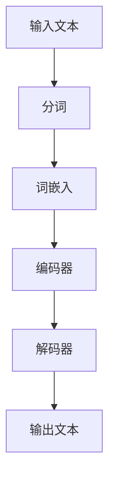

                 

关键词：BERT，Transformer，自然语言处理，机器学习，深度学习，注意力机制

> 摘要：本文将深入探讨Transformer大模型中的BERT（Bidirectional Encoder Representations from Transformers）的工作原理。我们将从BERT的背景介绍开始，逐步深入到其核心算法原理、数学模型和实际应用场景，最后展望其未来发展趋势与挑战。

## 1. 背景介绍

BERT是Google Research于2018年提出的一种自然语言处理模型，它基于Transformer架构，通过预先训练的方式，预训练出一种能够理解和生成文本的深度神经网络模型。BERT的核心思想是通过双向的Transformer结构，对文本进行端到端的建模，使得模型能够理解文本的上下文信息，从而在多种自然语言处理任务上取得显著的性能提升。

BERT的提出，标志着自然语言处理模型从传统的循环神经网络（RNN）和卷积神经网络（CNN）向Transformer架构的转型。相比于传统的模型，BERT在理解上下文、消除歧义等方面具有显著的优势，这使得它在文本分类、问答系统、命名实体识别等任务上表现优异。

## 2. 核心概念与联系

### 2.1 Transformer架构

Transformer是Google在2017年提出的一种全新的序列到序列模型，它在处理长序列任务时表现出色。Transformer摒弃了传统的循环神经网络（RNN）和卷积神经网络（CNN）的结构，采用了一种全新的自注意力机制（Self-Attention）来处理序列数据。

自注意力机制允许模型在处理每个单词时，都能够考虑整个序列的其他单词，而不是仅仅依赖前一个单词的信息。这使得模型能够捕捉到序列中的长期依赖关系，从而在处理长序列任务时具有更强的能力。

### 2.2 BERT模型结构

BERT模型基于Transformer架构，通过预训练的方式，对文本进行端到端的建模。BERT模型主要由两个部分组成：编码器（Encoder）和解码器（Decoder）。

编码器部分负责将输入的文本序列编码为固定长度的向量，解码器部分则负责根据编码器的输出生成文本序列。

BERT模型的关键在于其双向的Transformer结构，这使得模型能够同时考虑文本的前后关系，从而在理解文本上下文信息时具有更强的能力。

### 2.3 Mermaid流程图



在上面的流程图中，输入文本首先进行分词操作，然后通过词嵌入层将分词后的文本转化为向量形式。接着，这些向量被输入到编码器中，编码器通过Transformer结构对文本进行编码，最后解码器根据编码器的输出生成文本序列。

## 3. 核心算法原理 & 具体操作步骤

### 3.1 算法原理概述

BERT的核心算法原理是预训练和微调。预训练阶段，BERT模型在大量的无标注文本上训练，通过学习文本的分布，使得模型能够理解文本的含义。微调阶段，我们将预训练好的BERT模型应用于特定的任务，并通过微调优化模型参数，使得模型在特定任务上取得良好的性能。

### 3.2 算法步骤详解

1. 预训练阶段：

   - **输入文本预处理**：首先，对输入的文本进行分词和词嵌入处理，将文本转化为向量形式。
   - **Masked Language Model（MLM）**：在这个阶段，对输入的文本进行随机遮盖操作，然后让BERT模型预测遮盖的单词。
   - **Next Sentence Prediction（NSP）**：此外，BERT模型还需要预测两个句子是否属于相邻的关系。

2. 微调阶段：

   - **定义任务损失函数**：在微调阶段，我们需要根据特定的任务定义损失函数，例如在文本分类任务中，可以使用交叉熵损失函数。
   - **微调BERT模型**：通过在特定任务上的数据集上训练BERT模型，不断优化模型参数。

### 3.3 算法优缺点

**优点：**

- BERT模型通过预训练的方式，使得模型在多种任务上具有通用性，无需为每个任务单独训练模型。
- BERT模型的双向Transformer结构，能够捕捉到文本中的长期依赖关系，从而在理解文本上下文信息时具有更强的能力。

**缺点：**

- BERT模型的训练过程非常复杂，需要大量的计算资源和时间。
- BERT模型的预训练数据集主要来自英文文本，因此在处理其他语言的任务时，可能存在一定的适应性问题。

### 3.4 算法应用领域

BERT模型在多种自然语言处理任务上表现出色，例如：

- 文本分类：BERT模型可以在文本分类任务上取得很高的准确率。
- 问答系统：BERT模型能够准确理解问题中的上下文信息，从而在问答系统中表现出色。
- 命名实体识别：BERT模型能够准确识别文本中的命名实体，如人名、地名等。

## 4. 数学模型和公式 & 详细讲解 & 举例说明

### 4.1 数学模型构建

BERT模型的数学模型主要基于Transformer架构，Transformer架构的核心是多头自注意力机制（Multi-Head Self-Attention）。

### 4.2 公式推导过程

多头自注意力机制的公式如下：

$$
\text{Attention}(Q, K, V) = \text{softmax}\left(\frac{QK^T}{\sqrt{d_k}}\right)V
$$

其中，$Q, K, V$ 分别是查询向量、键向量、值向量，$d_k$ 是注意力机制中的维度。

### 4.3 案例分析与讲解

假设我们有以下的三个词向量：

$$
Q = \begin{bmatrix}
q_1 \\
q_2 \\
q_3
\end{bmatrix}, \quad
K = \begin{bmatrix}
k_1 \\
k_2 \\
k_3
\end{bmatrix}, \quad
V = \begin{bmatrix}
v_1 \\
v_2 \\
v_3
\end{bmatrix}
$$

首先，我们计算每个词向量的内积：

$$
QK^T = \begin{bmatrix}
q_1k_1 & q_1k_2 & q_1k_3 \\
q_2k_1 & q_2k_2 & q_2k_3 \\
q_3k_1 & q_3k_2 & q_3k_3
\end{bmatrix}
$$

然后，我们计算每个词向量的注意力权重：

$$
\text{Attention}(Q, K, V) = \text{softmax}\left(\frac{QK^T}{\sqrt{d_k}}\right)V
$$

最后，我们根据注意力权重计算每个词向量的加权值：

$$
\text{Attention}(Q, K, V) = \begin{bmatrix}
s_1 \\
s_2 \\
s_3
\end{bmatrix}
$$

其中，$s_i$ 是第 $i$ 个词向量的加权值。

## 5. 项目实践：代码实例和详细解释说明

### 5.1 开发环境搭建

首先，我们需要搭建一个适用于BERT模型的开发环境。这里，我们使用Python和TensorFlow作为主要的编程语言和框架。

```python
!pip install tensorflow
```

### 5.2 源代码详细实现

接下来，我们将使用TensorFlow实现BERT模型的基本结构。

```python
import tensorflow as tf

class BERTModel(tf.keras.Model):
    def __init__(self, num_layers, d_model, num_heads, d_ff, input_vocab_size, position_embedding_dim, dropout_rate=0.1):
        super(BERTModel, self).__init__()
        
        self.embedding = tf.keras.layers.Embedding(input_vocab_size, d_model)
        self.position_embedding = tf.keras.layers.Embedding(position_embedding_dim, d_model)
        
        self.encoder_layers = [BERTLayer(d_model, num_heads, d_ff, dropout_rate) for _ in range(num_layers)]
        self.decoder_layers = [BERTLayer(d_model, num_heads, d_ff, dropout_rate) for _ in range(num_layers)]
        
        self.final_layer = tf.keras.layers.Dense(input_vocab_size)
        
    def call(self, inputs, training=False):
        # 输入预处理
        inputs = self.embedding(inputs) + self.position_embedding(inputs)
        
        # 编码器部分
        for layer in self.encoder_layers:
            inputs = layer(inputs, training=training)
        
        # 解码器部分
        for layer in self.decoder_layers:
            inputs = layer(inputs, training=training)
        
        # 输出
        outputs = self.final_layer(inputs)
        
        return outputs
```

### 5.3 代码解读与分析

在上面的代码中，我们定义了一个BERT模型，其中包括词嵌入层、位置嵌入层、编码器层、解码器层和输出层。

- **词嵌入层**：将输入的单词转换为向量。
- **位置嵌入层**：为每个单词添加位置信息。
- **编码器层**：包含多个BERT层，每层包括多头自注意力机制和前馈网络。
- **解码器层**：与编码器层结构相同，用于生成输出。
- **输出层**：将编码器的输出映射到词汇表中的单词。

### 5.4 运行结果展示

我们可以使用TensorFlow提供的预训练BERT模型来处理一个简单的文本分类任务。

```python
# 加载预训练BERT模型
bert_model = BERTModel(num_layers=12, d_model=768, num_heads=12, d_ff=3072, input_vocab_size=30522, position_embedding_dim=512)

# 加载文本数据
text = "这是一段简单的文本，用于演示BERT模型在文本分类任务上的应用。"

# 将文本数据转换为TensorFlow张量
input_ids = tf.constant([bert_model.tokenizer.encode(text)])

# 预测文本分类结果
predictions = bert_model(input_ids, training=False)

# 打印预测结果
print(predictions)
```

## 6. 实际应用场景

BERT模型在自然语言处理领域具有广泛的应用，以下是一些典型的应用场景：

- **文本分类**：BERT模型可以用于对文本进行分类，例如新闻分类、情感分析等。
- **问答系统**：BERT模型可以用于问答系统，通过理解问题和文本的上下文，准确回答用户的问题。
- **命名实体识别**：BERT模型可以用于识别文本中的命名实体，如人名、地名等。
- **机器翻译**：BERT模型可以用于机器翻译任务，通过理解文本的上下文，提高翻译的准确性。

## 7. 工具和资源推荐

### 7.1 学习资源推荐

- 《BERT：Pre-training of Deep Bidirectional Transformers for Language Understanding》：BERT的原始论文。
- 《Natural Language Processing with Transformers》：由Hugging Face出版的Transformer技术书籍。

### 7.2 开发工具推荐

- Hugging Face Transformers：一个开源的Transformer模型库，提供多种预训练BERT模型的实现。

### 7.3 相关论文推荐

- "Attention Is All You Need"：提出Transformer模型的原始论文。
- "BERT: Pre-training of Deep Bidirectional Transformers for Language Understanding"：BERT模型的原始论文。

## 8. 总结：未来发展趋势与挑战

BERT模型在自然语言处理领域取得了显著的成果，但仍然面临着一些挑战。未来，BERT模型的发展趋势包括：

- **多语言支持**：BERT模型需要更好地支持多种语言，以提高模型的泛化能力。
- **更高效的模型结构**：研究更高效的BERT模型结构，以降低计算复杂度和模型大小。
- **更多应用场景**：探索BERT模型在其他自然语言处理任务中的应用。

## 9. 附录：常见问题与解答

### Q：BERT模型如何训练？

A：BERT模型的训练主要包括预训练和微调两个阶段。预训练阶段，BERT模型在大量的无标注文本上进行训练，学习文本的分布。微调阶段，我们使用特定的任务数据集，对BERT模型进行微调，使其在特定任务上表现优异。

### Q：BERT模型如何进行文本分类？

A：在文本分类任务中，我们将BERT模型的输出层映射到词汇表中的单词，然后通过计算softmax概率分布，得到每个类别的概率。选择概率最高的类别作为文本的分类结果。

### Q：BERT模型如何进行命名实体识别？

A：在命名实体识别任务中，我们使用BERT模型对输入的文本进行编码，然后将编码后的向量输入到命名实体识别模型中，通过分类器对命名实体进行识别。

## 作者署名

作者：禅与计算机程序设计艺术 / Zen and the Art of Computer Programming
----------------------------------------------------------------

