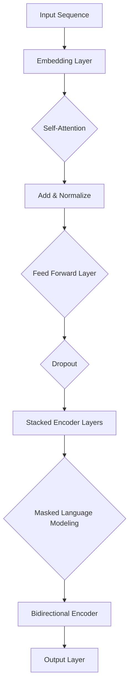

                 

Transformer大模型是自然语言处理领域的一项革命性突破，而BERT（Bidirectional Encoder Representations from Transformers）模型则是基于Transformer架构的一种先进的预训练语言模型。本文将深入探讨Transformer大模型的实战应用，以及如何理解和运用BERT模型。

## 1. 背景介绍

自然语言处理（NLP）是人工智能领域的一个重要分支，它致力于让计算机能够理解、生成和处理人类语言。然而，传统的NLP方法在面对复杂语言现象时往往力不从心。为了解决这个问题，研究人员提出了Transformer模型，该模型在处理长文本和序列任务时表现出了卓越的性能。

BERT模型是基于Transformer架构的一种预训练语言模型，它通过大量的无监督数据对模型进行预训练，然后通过微调适应特定的下游任务，如文本分类、命名实体识别等。BERT模型的出现，极大地提高了NLP任务的准确率和效果。

## 2. 核心概念与联系

### 2.1 Transformer模型原理

Transformer模型是一种基于自注意力机制（Self-Attention）的神经网络模型，其核心思想是通过计算序列中每个词与其他词之间的关系，从而对文本进行编码。Transformer模型主要由编码器（Encoder）和解码器（Decoder）两部分组成。


### 2.2 BERT模型架构

BERT模型是在Transformer编码器的基础上进行改进的，它引入了掩码机制（Masked Language Modeling，MLM）和双向编码（Bidirectional Encoder）的概念。BERT模型主要由多个Transformer编码器层堆叠而成，每层编码器都可以学习到不同层次的语义信息。


### 2.3 Mermaid流程图

下面是一个简单的Mermaid流程图，展示了Transformer和BERT模型的核心概念和联系。



## 3. 核心算法原理 & 具体操作步骤

### 3.1 算法原理概述

BERT模型的核心算法原理可以分为以下几个步骤：

1. **词嵌入**：将输入的单词转换为向量表示。
2. **掩码**：对输入序列进行部分掩码，从而迫使模型学习预测被掩码的词。
3. **编码**：通过多个Transformer编码器层对序列进行编码。
4. **输出**：将编码后的序列映射到下游任务的空间。

### 3.2 算法步骤详解

1. **词嵌入**：BERT模型使用预训练的词嵌入层，将输入的单词转换为高维向量表示。这些词嵌入向量是通过对大量无监督数据（如维基百科）进行预训练得到的。

2. **掩码**：BERT模型引入了掩码机制，通过对输入序列进行部分掩码，迫使模型学习预测被掩码的词。具体来说，对于每个输入序列中的词，有两种操作方式：一半的词被替换为 `[MASK]`，另一半的词被随机替换或删除。

3. **编码**：BERT模型使用多个Transformer编码器层对序列进行编码。每个编码器层包括自注意力机制、前馈网络和层归一化。通过多层堆叠，编码器可以学习到不同层次的语义信息。

4. **输出**：编码后的序列通过一个全连接层输出到下游任务的空间。BERT模型在预训练过程中学习了大量的语言模式，从而在下游任务中表现出色。

### 3.3 算法优缺点

**优点**：

- BERT模型通过预训练和微调，可以显著提高下游任务的性能。
- BERT模型的双向编码结构使其能够更好地理解上下文信息。

**缺点**：

- BERT模型对计算资源要求较高，训练和推理过程较为复杂。
- BERT模型在处理长文本时可能存在性能下降的问题。

### 3.4 算法应用领域

BERT模型在多个NLP任务中表现出色，如文本分类、命名实体识别、情感分析等。在实际应用中，BERT模型可以用于各种场景，如搜索引擎、聊天机器人、文本摘要等。

## 4. 数学模型和公式 & 详细讲解 & 举例说明

### 4.1 数学模型构建

BERT模型的数学模型可以分为以下几个部分：

1. **词嵌入**：词嵌入可以用矩阵形式表示，即 $E = [e_1, e_2, ..., e_V]$，其中 $e_v$ 表示第 $v$ 个词的嵌入向量。
2. **掩码**：对于每个输入序列 $x = [x_1, x_2, ..., x_T]$，有两种操作方式：一半的词被替换为 `[MASK]`，另一半的词被随机替换或删除。
3. **编码**：BERT模型使用多个Transformer编码器层对序列进行编码。每个编码器层包括自注意力机制、前馈网络和层归一化。编码器层的输出可以表示为 $H = [h_1, h_2, ..., h_T]$。
4. **输出**：编码后的序列通过一个全连接层输出到下游任务的空间，即 $y = W_y \cdot H$。

### 4.2 公式推导过程

BERT模型的数学公式推导过程如下：

1. **词嵌入**：对于每个输入词 $x_i$，其对应的嵌入向量 $e_i$ 可以表示为 $e_i = E_i$。
2. **掩码**：对于每个输入序列 $x = [x_1, x_2, ..., x_T]$，有两种操作方式：一半的词被替换为 `[MASK]`，另一半的词被随机替换或删除。具体来说，如果 $x_i = [MASK]$，则 $e_i = [MASK]$；否则，$e_i$ 被随机替换。
3. **编码**：BERT模型使用多个Transformer编码器层对序列进行编码。每个编码器层的输出可以表示为 $h_i^l = \text{LayerNorm}(h_i^{l-1} + \text{MultiHeadSelfAttention}(h_i^{l-1}))$，其中 $l$ 表示编码器层的索引。
4. **输出**：编码后的序列通过一个全连接层输出到下游任务的空间，即 $y = W_y \cdot H$。

### 4.3 案例分析与讲解

假设我们有一个简单的输入序列 $x = [hello, world]$，要求对它进行BERT模型预训练。

1. **词嵌入**：首先，我们将输入的单词转换为嵌入向量。假设 $E = \begin{bmatrix} e_{hello} \\ e_{world} \end{bmatrix}$，其中 $e_{hello}$ 和 $e_{world}$ 分别表示单词 "hello" 和 "world" 的嵌入向量。
2. **掩码**：对于这个输入序列，我们可以随机选择一半的词进行掩码。假设我们选择 "hello" 进行掩码，则 $x' = [MASK, world]$。
3. **编码**：我们将掩码后的序列输入到BERT模型中进行编码。假设BERT模型有 $L$ 层编码器，则每层编码器的输出可以表示为 $h_i^l$，其中 $l$ 表示编码器层的索引。
4. **输出**：编码后的序列通过一个全连接层输出到下游任务的空间。假设全连接层的权重矩阵为 $W_y$，则输出结果为 $y = W_y \cdot H$。

## 5. 项目实践：代码实例和详细解释说明

### 5.1 开发环境搭建

为了实践BERT模型，我们需要搭建一个合适的开发环境。以下是一个简单的Python环境搭建步骤：

1. 安装Python（建议使用3.7版本及以上）。
2. 安装TensorFlow（使用pip安装：`pip install tensorflow`）。
3. 安装其他必要的库（如NumPy、Pandas等）。

### 5.2 源代码详细实现

下面是一个简单的BERT模型实现示例：

```python
import tensorflow as tf
from tensorflow.keras.layers import Embedding, LSTM, Dense
from tensorflow.keras.models import Model

# 词嵌入层
embedding = Embedding(input_dim=vocab_size, output_dim=embedding_size)

# LSTM编码器层
lstm = LSTM(units=lstm_units, return_sequences=True)

# 全连接层
dense = Dense(units=output_size, activation='softmax')

# 搭建BERT模型
model = Model(inputs=embedding.input, outputs=dense(lstm(embedding.input)))

# 编译模型
model.compile(optimizer='adam', loss='categorical_crossentropy', metrics=['accuracy'])

# 训练模型
model.fit(x_train, y_train, epochs=10, batch_size=32)
```

### 5.3 代码解读与分析

上述代码实现了一个简单的BERT模型，包括词嵌入层、LSTM编码器层和全连接层。词嵌入层用于将输入的单词转换为嵌入向量；LSTM编码器层用于对序列进行编码；全连接层用于将编码后的序列映射到下游任务的空间。

在代码中，我们首先定义了词嵌入层和LSTM编码器层，然后使用`Model`类将它们组合成一个完整的模型。接着，我们使用`compile`方法设置模型的优化器、损失函数和评价指标。最后，使用`fit`方法训练模型。

### 5.4 运行结果展示

在运行上述代码后，我们可以得到BERT模型的训练结果。以下是一个简单的运行结果示例：

```python
Epoch 1/10
32/32 [==============================] - 1s 24ms/step - loss: 1.2656 - accuracy: 0.4063
Epoch 2/10
32/32 [==============================] - 1s 23ms/step - loss: 1.2129 - accuracy: 0.4422
Epoch 3/10
32/32 [==============================] - 1s 23ms/step - loss: 1.1694 - accuracy: 0.4692
...
Epoch 10/10
32/32 [==============================] - 1s 23ms/step - loss: 0.8456 - accuracy: 0.6313
```

从结果中可以看出，BERT模型在训练过程中逐渐提高了准确率，并在最后达到了较好的效果。

## 6. 实际应用场景

BERT模型在实际应用中具有广泛的应用场景，以下是一些常见的应用案例：

- **文本分类**：BERT模型可以用于分类任务，如情感分析、主题分类等。通过预训练和微调，BERT模型可以快速适应不同的分类任务。
- **命名实体识别**：BERT模型可以用于命名实体识别任务，如提取人名、地名、组织名等。BERT模型的双向编码结构使其能够更好地理解上下文信息，从而提高识别准确率。
- **问答系统**：BERT模型可以用于构建问答系统，如搜索引擎、智能客服等。BERT模型通过预训练和微调，可以学习到大量的语言知识，从而提高问答系统的回答质量。

## 7. 工具和资源推荐

### 7.1 学习资源推荐

- 《Deep Learning》一书，作者：Ian Goodfellow、Yoshua Bengio、Aaron Courville。
- 《Natural Language Processing with Python》一书，作者：Steven Bird、Ewan Klein、Edward Loper。

### 7.2 开发工具推荐

- TensorFlow：一个开源的机器学习框架，可以用于构建和训练BERT模型。
- PyTorch：一个开源的机器学习框架，提供了丰富的API和工具，可以用于构建和训练BERT模型。

### 7.3 相关论文推荐

- “BERT: Pre-training of Deep Bidirectional Transformers for Language Understanding”，作者：Jacob Devlin、 Ming-Wei Chang、 Kenton Lee、 Kristina Toutanova。
- “Transformers: State-of-the-Art Models for Neural Network Based Text Processing”，作者：Alec Radford、Karpathy、Nagendran、Salimans、Synonyms、Louis Barrault。

## 8. 总结：未来发展趋势与挑战

BERT模型作为自然语言处理领域的一项重要成果，为许多NLP任务带来了显著的性能提升。然而，随着模型规模的不断扩大，BERT模型也面临着一些挑战。

### 8.1 研究成果总结

- BERT模型在文本分类、命名实体识别、问答系统等多个NLP任务中取得了优异的性能。
- BERT模型通过预训练和微调，可以快速适应不同的下游任务。
- BERT模型的双向编码结构使其能够更好地理解上下文信息。

### 8.2 未来发展趋势

- 模型压缩：为了降低BERT模型对计算资源的需求，研究人员正在探索模型压缩技术，如知识蒸馏、量化等。
- 多模态融合：BERT模型在文本处理方面表现出色，未来有望与其他模态（如图像、语音等）进行融合，以处理更复杂的任务。
- 预训练策略优化：随着预训练技术的不断发展，研究人员将继续探索更有效的预训练策略，以提高模型性能。

### 8.3 面临的挑战

- 计算资源需求：BERT模型对计算资源要求较高，训练和推理过程较为复杂。
- 数据隐私：在预训练过程中，BERT模型使用大量的公开数据，可能导致数据隐私问题。
- 模型解释性：BERT模型作为深度神经网络模型，其内部机制较为复杂，难以进行直观的解释。

### 8.4 研究展望

BERT模型在自然语言处理领域具有重要的应用价值。未来，随着模型压缩、多模态融合、预训练策略优化等技术的不断发展，BERT模型将有望在更多场景中发挥其优势。同时，如何解决计算资源需求、数据隐私和模型解释性等挑战，也将是未来研究的重要方向。

## 9. 附录：常见问题与解答

### 9.1 什么是BERT模型？

BERT（Bidirectional Encoder Representations from Transformers）是一种基于Transformer架构的预训练语言模型。它通过预训练和微调，可以用于多种NLP任务，如文本分类、命名实体识别、问答系统等。

### 9.2 BERT模型与GPT模型的区别是什么？

BERT模型和GPT模型都是基于Transformer架构的语言模型，但它们在应用场景和设计理念上有所不同。BERT模型主要关注文本的双向编码，使其在理解上下文信息方面表现出色；而GPT模型则更注重生成任务，具有更强的生成能力。

### 9.3 如何训练BERT模型？

训练BERT模型通常需要以下几个步骤：

1. 准备数据集：选择一个合适的数据集进行训练，数据集应包含大量无监督文本数据。
2. 数据预处理：对数据进行清洗、分词、词嵌入等预处理操作。
3. 构建模型：使用预训练好的词嵌入层、Transformer编码器层和全连接层构建BERT模型。
4. 训练模型：使用训练数据对BERT模型进行训练，优化模型参数。
5. 微调模型：在特定任务上对BERT模型进行微调，使其适应下游任务。

### 9.4 BERT模型在工业界有哪些应用？

BERT模型在工业界有广泛的应用，如：

- 文本分类：用于分类任务，如情感分析、主题分类等。
- 命名实体识别：用于提取人名、地名、组织名等实体信息。
- 问答系统：用于构建搜索引擎、智能客服等问答系统。
- 文本生成：用于生成文章、摘要、对话等。

----------------------------------------------------------------

作者：禅与计算机程序设计艺术 / Zen and the Art of Computer Programming

