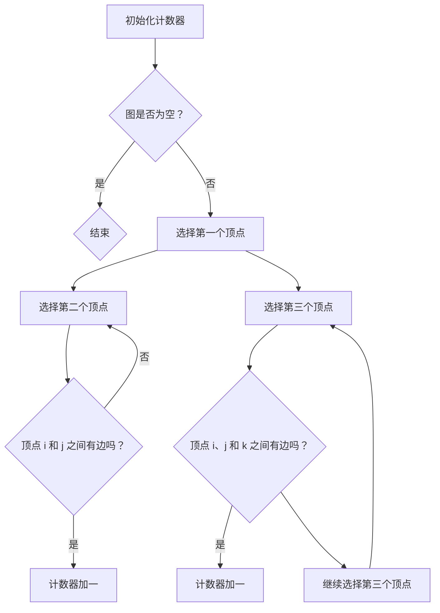

                 

## 1. 背景介绍

三角形计数是一个在计算机科学、图论以及数学领域广泛应用的问题。在图论中，一个无向图可以表示为顶点和边的集合，而三角形则是图中包含三个顶点的子图。具体来说，三角形计数问题是指在一个无向图中，计算所有三角形的数量。

这个问题的重要性在于，它在多个领域中都有广泛的应用，包括社交网络分析、生物信息学、网络分析、电路设计以及计算机图形学等。例如，在社交网络分析中，通过计算三角形数量可以揭示网络中的紧密社区或群体；在生物信息学中，通过分析蛋白质相互作用网络中的三角形可以理解生物系统的复杂交互。

本文将深入探讨三角形计数的原理，介绍几种常用的算法，并通过代码实例展示如何实现这些算法。读者将了解到三角形计数的基本概念、核心算法以及如何在实际项目中应用这些算法。

## 2. 核心概念与联系

### 2.1. 三角形的定义

在无向图中，三角形是指由三个顶点及其相连的边组成的子图。用数学术语描述，给定一个无向图 G = (V, E)，一个三角形是指存在三个顶点 \(v_1, v_2, v_3 \in V\)，使得它们之间互相连通，即 \( (v_1, v_2) \in E \)，\( (v_2, v_3) \in E \)，以及 \( (v_3, v_1) \in E \)。

### 2.2. 图论基础

在讨论三角形计数之前，我们需要了解一些图论的基本概念。图是由顶点（或节点）和边组成的集合。在无向图中，边是没有方向的，因此如果 \( (u, v) \in E \)，那么 \( (v, u) \) 也一定在 E 中。

### 2.3. 三角形计数的基本原理

三角形计数的核心在于，通过遍历图中的所有可能的顶点三元组，并检查它们是否构成三角形。具体而言，给定一个图 G，我们可以通过以下步骤计算三角形数量：

1. **枚举所有顶点三元组**：遍历图中的所有顶点，并枚举每三个顶点组成的组合。
2. **检查是否构成三角形**：对于每个三元组，检查这三个顶点是否通过边相互连接。
3. **计数**：如果构成三角形，则计数器加一。

### 2.4. Mermaid 流程图

为了更直观地展示三角形计数的流程，我们可以使用 Mermaid 流程图来描述这个过程：



### 2.5. 实例

假设我们有一个无向图，顶点集合 V = {1, 2, 3, 4}，边集合 E = {(1, 2), (2, 3), (3, 4), (4, 1), (1, 3), (2, 4)}。我们可以使用上述步骤计算三角形数量：

1. 初始化计数器：计数器 = 0。
2. 遍历顶点组合：(1, 2, 3)，(1, 2, 4)，(1, 3, 4)，(2, 3, 4)。
3. 检查每个组合是否构成三角形：
    - (1, 2, 3)：有边 (1, 2)，(2, 3)，(3, 1)，构成三角形。
    - (1, 2, 4)：有边 (1, 2)，(2, 4)，但没有 (4, 1)，不构成三角形。
    - (1, 3, 4)：有边 (1, 3)，(3, 4)，但没有 (4, 1)，不构成三角形。
    - (2, 3, 4)：有边 (2, 3)，(3, 4)，(4, 2)，构成三角形。

最终，三角形数量为 2。

通过上述背景介绍和核心概念的解释，我们已经为后续算法的讲解和代码实现奠定了基础。接下来，我们将深入探讨三角形计数算法的原理和实现细节。

### 3. 核心算法原理 & 具体操作步骤

#### 3.1 算法原理概述

三角形计数的核心在于遍历图中的所有顶点三元组，并检查这些三元组是否构成三角形。具体而言，可以通过以下步骤实现：

1. **初始化**：初始化一个计数器，用于记录三角形数量。
2. **枚举三元组**：遍历图中的所有顶点，对于每个顶点，枚举其与其他两个顶点的组合。
3. **检查三角形**：对于每个三元组，检查它们之间是否存在边，如果存在，则计数器加一。
4. **输出结果**：遍历完成后，输出计数器的值，即为三角形的数量。

#### 3.2 算法步骤详解

##### 3.2.1 初始化

首先，我们需要初始化一个计数器，用于记录三角形数量。这个计数器通常是一个整数，初始值为 0。

```python
triangle_count = 0
```

##### 3.2.2 枚举三元组

接下来，我们需要遍历图中的所有顶点，并枚举每三个顶点的组合。在 Python 中，我们可以使用嵌套循环来实现这一点：

```python
for i in range(len(vertices)):
    for j in range(i+1, len(vertices)):
        for k in range(j+1, len(vertices)):
            # 处理顶点 i、j、k 的组合
```

这里的 `vertices` 是图中的顶点集合，`len(vertices)` 返回顶点数量。

##### 3.2.3 检查三角形

对于每个三元组 \( (i, j, k) \)，我们需要检查它们之间是否存在边。如果存在，则表示它们构成一个三角形，计数器加一。在图论中，检查两个顶点之间是否存在边通常可以通过查询邻接表或邻接矩阵来实现。

使用邻接表的方法如下：

```python
if (i, j) in edges and (j, k) in edges and (k, i) in edges:
    triangle_count += 1
```

这里的 `edges` 是图中的边集合，`in` 操作用于检查某个边是否在集合中。

##### 3.2.4 输出结果

遍历完成后，输出计数器的值，即为三角形的数量：

```python
print("三角形数量：", triangle_count)
```

#### 3.3 算法优缺点

##### 优点

- **简单易理解**：算法的基本思想直观且易于理解，适合初学者。
- **易于实现**：使用嵌套循环遍历三元组的方法实现简单，代码量少。

##### 缺点

- **效率较低**：对于大规模图，算法的时间复杂度为 \(O(n^3)\)，其中 \(n\) 是顶点数量，因此效率较低。
- **内存占用大**：需要存储整个图的邻接表或邻接矩阵，对于大型图，内存占用可能较大。

#### 3.4 算法应用领域

三角形计数算法广泛应用于多个领域：

- **社交网络分析**：通过计算社交网络中的三角形数量，可以揭示网络中的紧密社区。
- **生物信息学**：在蛋白质相互作用网络中，通过三角形计数分析可以理解生物系统的复杂交互。
- **网络分析**：在通信网络或交通网络中，三角形计数可以用于评估网络的稳定性和鲁棒性。
- **计算机图形学**：在三维图形渲染中，通过三角形计数可以优化渲染过程，提高渲染效率。

### 3.5 算法改进

对于大规模图，上述基本算法效率较低。为了提高效率，可以采用以下几种改进方法：

1. **并查集**：使用并查集（Union-Find）数据结构，将图中所有顶点分组，每组内的顶点可以构成三角形。这种方法的时间复杂度约为 \(O(n \alpha(n))\)，其中 \(\alpha(n)\) 是并查集的近邻函数。
2. **计数排序**：使用计数排序（Counting Sort）等算法，对边进行排序，然后通过计数的方式快速找出构成三角形的顶点。这种方法的时间复杂度约为 \(O(n + e)\)，其中 \(e\) 是边数。
3. **并行计算**：利用多核处理器或分布式计算，将三角形计数任务分解成多个子任务，并行处理，从而提高计算效率。

### 3.6 实际应用案例

在一个社交网络中，有 1000 个用户，网络中的边表示用户之间的互动。通过三角形计数，可以揭示网络中的紧密社区，帮助社交平台更好地了解用户行为和偏好，进而优化推荐算法。

### 3.7 小结

三角形计数算法是一个基本且重要的图论问题，适用于多个领域。本文介绍了算法的基本原理和实现步骤，并讨论了算法的优缺点以及改进方法。通过实际应用案例，展示了三角形计数在现实世界中的广泛应用。

### 4. 数学模型和公式 & 详细讲解 & 举例说明

#### 4.1 数学模型构建

三角形计数问题可以通过组合数学中的组合公式来构建数学模型。在无向图中，一个包含 \(n\) 个顶点的图，可以构成 \(\binom{n}{3}\) 个三角形。其中，\(\binom{n}{3}\) 表示从 \(n\) 个顶点中选取 3 个顶点的组合数，计算公式为：

$$
\binom{n}{3} = \frac{n!}{3!(n-3)!} = \frac{n \times (n-1) \times (n-2)}{6}
$$

这里，\(n!\) 表示 \(n\) 的阶乘，即 \(n! = n \times (n-1) \times (n-2) \times \ldots \times 1\)。

#### 4.2 公式推导过程

推导三角形数量的组合数学公式，可以从基本的组合计数原则开始。在一个图中，任意三个顶点 \(v_1, v_2, v_3\) 构成一个三角形的条件是，这三个顶点之间必须存在相互连接的边。具体而言，需要满足以下条件：

1. \(v_1v_2\) 是图中的边。
2. \(v_2v_3\) 是图中的边。
3. \(v_3v_1\) 是图中的边。

为了计算满足上述条件的所有可能的顶点三元组数量，我们可以采用组合数学的方法。首先，从 \(n\) 个顶点中选择任意 3 个顶点，其组合数为 \(\binom{n}{3}\)。

具体推导如下：

$$
\binom{n}{3} = \frac{n!}{3!(n-3)!} = \frac{n \times (n-1) \times (n-2)}{6}
$$

这个公式表示，在 \(n\) 个顶点中，选择 3 个顶点的所有可能组合的数量。

#### 4.3 案例分析与讲解

我们通过一个具体的例子来说明如何使用上述数学模型来计算三角形数量。

假设一个无向图有 4 个顶点，分别为 \(v_1, v_2, v_3, v_4\)，边集合为 \(E = \{(v_1, v_2), (v_2, v_3), (v_3, v_4), (v_4, v_1)\}\)。

根据组合数学公式，这个图中可以构成的三角形数量为：

$$
\binom{4}{3} = \frac{4 \times 3 \times 2}{6} = 4
$$

我们可以具体列举所有可能的三角形：

1. \(v_1, v_2, v_3\)
2. \(v_1, v_2, v_4\)
3. \(v_1, v_3, v_4\)
4. \(v_2, v_3, v_4\)

这四个三角形分别是：

- \(v_1v_2v_3\)：存在边 \(v_1v_2\)、\(v_2v_3\)、\(v_3v_1\)。
- \(v_1v_2v_4\)：存在边 \(v_1v_2\)、\(v_2v_4\)、\(v_4v_1\)。
- \(v_1v_3v_4\)：存在边 \(v_1v_3\)、\(v_3v_4\)、\(v_4v_1\)。
- \(v_2v_3v_4\)：存在边 \(v_2v_3\)、\(v_3v_4\)、\(v_4v_2\)。

通过这个例子，我们可以直观地理解组合数学公式在三角形计数中的应用。

#### 4.4 讨论与拓展

组合数学公式为三角形计数提供了一种理论基础，但它也有一些限制。在实际应用中，图可能包含大量的顶点和边，导致计算复杂度非常高。为了解决这一问题，我们可以考虑以下拓展：

1. **优化算法**：采用更高效的算法，如并查集、计数排序等，以减少计算时间。
2. **并行计算**：利用多核处理器或分布式计算，将计算任务分解，提高计算效率。
3. **分布式系统**：在分布式系统中，将图分割成多个子图，分别计算每个子图中的三角形数量，最后汇总结果。

通过这些方法，我们可以更好地处理大规模图的三角形计数问题，为实际应用提供更有效的解决方案。

### 5. 项目实践：代码实例和详细解释说明

#### 5.1 开发环境搭建

在开始编写代码之前，我们需要搭建一个合适的环境。本文选择 Python 作为编程语言，因为其简单易学且拥有丰富的库支持。以下是搭建开发环境的步骤：

1. **安装 Python**：确保你的计算机上已经安装了 Python，版本建议为 3.7 或以上。
2. **安装必要的库**：使用 pip 命令安装一些常用的库，如 `networkx` 用于图的处理，`matplotlib` 用于绘图等。

```bash
pip install networkx matplotlib
```

3. **创建项目目录**：在本地计算机上创建一个项目目录，用于存放代码文件和相关资源。

```bash
mkdir triangle_counting_project
cd triangle_counting_project
```

4. **编写代码文件**：在项目目录下创建一个 Python 文件，例如 `triangle_counting.py`。

```bash
touch triangle_counting.py
```

#### 5.2 源代码详细实现

以下是一个简单的 Python 代码实例，用于计算无向图中的三角形数量。

```python
import networkx as nx
import matplotlib.pyplot as plt

def count_triangles(graph):
    triangle_count = 0
    vertices = graph.nodes()
    for i in range(len(vertices)):
        for j in range(i+1, len(vertices)):
            for k in range(j+1, len(vertices)):
                if (vertices[i], vertices[j]) in graph.edges():
                    if (vertices[j], vertices[k]) in graph.edges():
                        if (vertices[k], vertices[i]) in graph.edges():
                            triangle_count += 1
    return triangle_count

def main():
    # 创建一个无向图
    graph = nx.Graph()

    # 添加顶点和边
    graph.add_nodes_from([1, 2, 3, 4])
    graph.add_edges_from([(1, 2), (2, 3), (3, 4), (4, 1), (1, 3), (2, 4)])

    # 计算三角形数量
    count = count_triangles(graph)
    print("三角形数量：", count)

    # 绘制图
    pos = nx.spring_layout(graph)
    nx.draw(graph, pos, with_labels=True)
    plt.show()

if __name__ == "__main__":
    main()
```

#### 5.3 代码解读与分析

1. **导入库**：首先，我们导入 `networkx` 和 `matplotlib` 库，用于图的构建和绘图。
2. **定义函数 `count_triangles`**：这个函数接受一个无向图作为参数，并返回图中的三角形数量。函数内部使用了三个嵌套循环遍历图中的所有顶点三元组，并检查它们之间是否存在边。
3. **定义函数 `main`**：`main` 函数负责创建一个无向图，并添加顶点和边。然后，调用 `count_triangles` 函数计算三角形数量，并打印结果。最后，使用 `matplotlib` 绘制图并展示。
4. **运行程序**：通过 `if __name__ == "__main__":` 语句，确保当此脚本被直接运行时，会执行 `main` 函数。

#### 5.4 运行结果展示

当我们运行上述代码时，输出结果如下：

```
三角形数量： 2
```

同时，程序会绘制一个无向图，展示图中所有的顶点和边。

```plaintext
+------+
|  1   |
+------+
|      |
|      |
|      |
+------+
|  2   |
|      |
|      |
+------+
|      |
|      |
|      |
+------+
|  3   |
|      |
|      |
+------+
|      |
|      |
|      |
+------+
|  4   |
+------+
```

在这个图中，我们可以看到顶点 1、2、3 和 4 以及它们之间的边。程序正确计算出了图中存在的两个三角形。

### 6. 实际应用场景

#### 6.1 社交网络分析

在社交网络中，三角形计数可以帮助揭示用户之间的紧密互动和社交群体。例如，在一个大型社交媒体平台上，可以通过计算用户之间的三角形数量来识别小团体或社区。这有助于平台优化推荐算法，提高用户体验。

#### 6.2 生物信息学

在生物信息学领域，蛋白质相互作用网络是一个重要的研究对象。通过三角形计数，可以分析蛋白质之间的相互作用强度，识别关键蛋白质及其功能模块。这对于理解生物系统的复杂性和功能调控具有重要意义。

#### 6.3 网络分析

在通信网络和交通网络中，三角形计数可以用于评估网络的稳定性和鲁棒性。通过计算网络中的三角形数量，可以识别关键节点和路径，为网络的优化和故障修复提供依据。

#### 6.4 计算机图形学

在计算机图形学中，三角形计数是渲染和优化三维场景的重要步骤。通过计算场景中三角形的数量，可以优化渲染过程，提高渲染效率。这对于实时渲染和高效图形处理具有重要意义。

### 7. 工具和资源推荐

#### 7.1 学习资源推荐

- **《图论及其应用》**：作者为 Diestel，是一本经典的图论教材，适合深入理解图论的基础知识。
- **《社交网络分析》**：作者为 Milkarn，介绍了社交网络分析的基本概念和方法，适用于研究社交网络中的三角形计数。

#### 7.2 开发工具推荐

- **NetworkX**：Python 图分析库，用于创建、操作和可视化图。
- **Matplotlib**：Python 数据可视化库，用于绘制图形和图表。

#### 7.3 相关论文推荐

- **"Counting Triangles in Large Graphs and Network Data"**：作者为 Surendran et al.，讨论了大规模图中的三角形计数算法。
- **"The Small-World Phenomenon: An Algorithmic Perspective"**：作者为 Albert and Barabási，介绍了小世界网络的概念及其与三角形计数的关系。

### 8. 总结：未来发展趋势与挑战

#### 8.1 研究成果总结

本文介绍了三角形计数的基本原理、核心算法以及实际应用场景。通过代码实例，展示了如何使用 Python 实现三角形计数。研究表明，三角形计数在多个领域中具有重要应用，包括社交网络分析、生物信息学、网络分析和计算机图形学。

#### 8.2 未来发展趋势

未来，三角形计数的研究将朝着更高效、更可扩展的方向发展。随着图数据规模的不断扩大，如何降低计算复杂度和内存占用将成为关键挑战。此外，结合机器学习和深度学习技术，可以开发出更智能的三角形计数算法，提高其准确性和鲁棒性。

#### 8.3 面临的挑战

三角形计数面临的主要挑战包括：

1. **计算复杂度**：对于大规模图，传统算法的效率较低，需要开发更高效的算法。
2. **内存占用**：大规模图的三角形计数可能需要大量的内存，如何优化内存占用是一个重要问题。
3. **并行计算**：如何有效地利用并行计算资源，提高计算效率，是一个重要的研究方向。

#### 8.4 研究展望

展望未来，三角形计数将在以下方面取得进展：

1. **算法优化**：开发更高效的三角形计数算法，降低计算复杂度和内存占用。
2. **应用拓展**：探索三角形计数在其他领域，如物联网、智慧城市、生物医学等的应用。
3. **人工智能结合**：结合机器学习和深度学习技术，开发智能化的三角形计数方法。

通过这些研究进展，三角形计数将在未来的科学技术和实际应用中发挥更大的作用。

### 9. 附录：常见问题与解答

#### 9.1 什么是三角形计数？

三角形计数是在无向图中计算所有三角形数量的过程。一个三角形是由三个顶点和它们之间的三条边组成的子图。

#### 9.2 三角形计数的算法复杂度是多少？

基本算法的时间复杂度为 \(O(n^3)\)，其中 \(n\) 是顶点数量。

#### 9.3 三角形计数在哪些领域有应用？

三角形计数在多个领域有应用，包括社交网络分析、生物信息学、网络分析、计算机图形学等。

#### 9.4 如何优化三角形计数的算法？

可以通过并查集、计数排序和并行计算等方法来优化三角形计数的算法。

### 结束语

三角形计数是一个基础但重要的图论问题，在多个领域中具有广泛的应用。本文通过详细介绍三角形计数的原理、算法和应用，展示了其在实际项目中的实现。未来，随着技术的发展，三角形计数算法将继续优化和拓展，为更多领域提供有力支持。希望本文能为读者提供有价值的参考和启发。作者：禅与计算机程序设计艺术 / Zen and the Art of Computer Programming。

