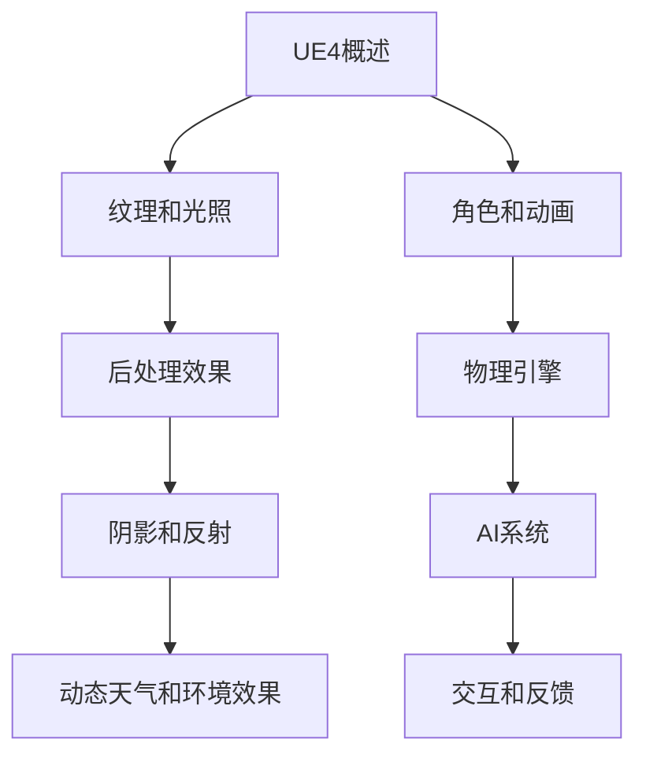

                 

关键词：Unreal Engine 4，游戏开发，视觉效果，游戏玩法，电影级效果，技术教程，性能优化，艺术与科学结合

> 摘要：本文将探讨如何利用Unreal Engine 4（简称UE4）来实现电影级的视觉效果和游戏玩法。通过深入分析核心概念、算法原理、数学模型、项目实践和未来应用场景，本文旨在为开发者提供一套完整的指导，帮助他们创作出引人入胜的游戏作品。

## 1. 背景介绍

随着计算机技术的飞速发展，游戏产业已经成为全球娱乐领域的重要支柱。而游戏开发引擎作为游戏产业的核心技术，其性能和功能直接决定了游戏的视觉效果和游戏体验。Unreal Engine 4作为当前最受欢迎的游戏开发引擎之一，凭借其卓越的视觉效果和强大的游戏玩法引擎，受到了无数开发者的青睐。

UE4在视觉效果方面有着显著的突破，支持高质量的纹理、光影效果、后处理技术等，使得游戏画面可以达到电影级别的水平。同时，UE4的游戏玩法引擎也非常强大，提供了丰富的游戏机制和功能，使得开发者能够轻松实现各种复杂、多样的游戏玩法。

本文将围绕UE4的视觉效果和游戏玩法进行深入探讨，旨在帮助开发者更好地理解和应用这些技术，创作出更加优秀的游戏作品。

## 2. 核心概念与联系

### 2.1. UE4概述

Unreal Engine 4（UE4）是由Epic Games开发的一款跨平台游戏开发引擎，自2014年发布以来，迅速成为了游戏开发领域的领导者。UE4拥有丰富的功能，包括实时渲染、物理模拟、动画系统、音频处理等，为开发者提供了几乎无限的可能。

### 2.2. 电影级视觉效果的关键技术

电影级视觉效果的关键技术包括：

- **纹理和光照**：高质量的纹理和精确的光照是电影级画面不可或缺的元素。
- **后处理效果**：如模糊、曝光、色彩校正等后处理技术，可以进一步提升画面的艺术感。
- **阴影和反射**：真实感强的阴影和反射效果，可以增强画面的立体感和真实感。
- **动态天气和环境效果**：如雨、雪、雾等动态效果，可以营造逼真的游戏环境。

### 2.3. UE4游戏玩法的核心机制

UE4游戏玩法的核心机制包括：

- **角色和动画**：角色动画是游戏体验的重要组成部分，UE4提供了强大的动画系统。
- **物理引擎**：UE4内置了NVIDIA的PhysX物理引擎，可以模拟各种物理现象，增强游戏的真实感。
- **AI系统**：UE4的AI系统可以支持复杂的NPC行为，为游戏增加更多的互动性。
- **交互和反馈**：游戏中的交互和反馈机制，如音效、特效等，可以增强玩家的沉浸感。

### 2.4. Mermaid流程图



## 3. 核心算法原理 & 具体操作步骤

### 3.1. 算法原理概述

UE4在实现电影级视觉效果和游戏玩法方面，采用了多种核心算法。这些算法包括：

- **光追踪算法**：用于计算场景中的光线传播和交互，实现高质量的光照效果。
- **动态模糊算法**：用于模拟运动模糊，增加画面的动态效果。
- **延迟渲染算法**：通过延迟渲染，实现更平滑的动画效果。
- **物理模拟算法**：用于模拟各种物理现象，如碰撞、破碎等。

### 3.2. 算法步骤详解

#### 3.2.1. 光追踪算法

1. **光线采样**：从相机出发，随机采样光线。
2. **路径追踪**：沿着光线传播路径，计算光与物体间的交互。
3. **路径收敛**：通过递归计算，直到光线达到终点或满足停止条件。

#### 3.2.2. 动态模糊算法

1. **运动矢量计算**：计算场景中物体的运动矢量。
2. **像素采样**：根据运动矢量，对像素进行采样。
3. **模糊合成**：将采样结果与原图像进行合成，实现动态模糊效果。

#### 3.2.3. 延迟渲染算法

1. **延迟绘制**：将场景绘制分为多个阶段，如几何、光照、后处理等。
2. **缓冲区存储**：将每个阶段的绘制结果存储在独立的缓冲区中。
3. **合成输出**：将缓冲区中的结果进行合成，输出最终图像。

#### 3.2.4. 物理模拟算法

1. **碰撞检测**：计算物体间的碰撞，判断是否发生碰撞。
2. **物理计算**：根据碰撞结果，计算物体的运动状态。
3. **反馈更新**：根据物理计算结果，更新场景中的物体状态。

### 3.3. 算法优缺点

#### 3.3.1. 光追踪算法

- **优点**：可以实现高质量的光照效果，支持复杂的场景交互。
- **缺点**：计算量大，对硬件要求高，可能影响性能。

#### 3.3.2. 动态模糊算法

- **优点**：可以增强画面的动态效果，提高视觉冲击力。
- **缺点**：对场景的动态变化要求高，可能增加计算复杂度。

#### 3.3.3. 延迟渲染算法

- **优点**：可以提高动画的平滑度，减少渲染延迟。
- **缺点**：可能增加内存消耗，对性能有一定影响。

#### 3.3.4. 物理模拟算法

- **优点**：可以增强游戏的真实感，提高玩家的沉浸感。
- **缺点**：计算量大，可能影响游戏帧率。

### 3.4. 算法应用领域

- **视觉效果**：光追踪、动态模糊等算法，常用于实现高质量的视觉效果。
- **游戏玩法**：延迟渲染、物理模拟等算法，常用于实现丰富的游戏玩法。

## 4. 数学模型和公式 & 详细讲解 & 举例说明

### 4.1. 数学模型构建

UE4中的数学模型主要涉及以下几个方面：

- **向量运算**：用于表示空间中的点、方向等。
- **矩阵运算**：用于变换坐标、计算旋转等。
- **几何运算**：用于计算物体的碰撞、遮挡等。
- **光线追踪**：用于计算光线的传播和交互。

### 4.2. 公式推导过程

#### 4.2.1. 向量运算

- **向量加法**：\( \vec{a} + \vec{b} = (a_x + b_x, a_y + b_y, a_z + b_z) \)
- **向量减法**：\( \vec{a} - \vec{b} = (a_x - b_x, a_y - b_y, a_z - b_z) \)
- **向量点乘**：\( \vec{a} \cdot \vec{b} = a_x \cdot b_x + a_y \cdot b_y + a_z \cdot b_z \)
- **向量叉乘**：\( \vec{a} \times \vec{b} = (a_y \cdot b_z - a_z \cdot b_y, a_z \cdot b_x - a_x \cdot b_z, a_x \cdot b_y - a_y \cdot b_x) \)

#### 4.2.2. 矩阵运算

- **矩阵乘法**：\( A \cdot B = C \)，其中 \( C_{ij} = \sum_{k=1}^{n} A_{ik} \cdot B_{kj} \)
- **矩阵转置**：\( A^T = (A_{ji}) \)
- **矩阵求逆**：\( A^{-1} \)，其中 \( AA^{-1} = A^{-1}A = I \)

#### 4.2.3. 几何运算

- **点到平面距离**：\( d = \frac{|Ax + By + C|}{\sqrt{A^2 + B^2}} \)
- **线段相交**：判断两条线段是否相交，可通过计算线段端点的向量叉乘实现。
- **光线与三角形相交**：通过计算光线方向向量与三角形面的法向量点乘，可以判断光线是否与三角形相交。

### 4.3. 案例分析与讲解

#### 4.3.1. 光线追踪算法

**案例**：计算场景中的光线传播和反射。

**步骤**：

1. **光线初始化**：从相机位置出发，设置光线的方向和初始颜色。
2. **路径追踪**：沿着光线传播方向，判断光线与场景中物体的相交情况。
3. **反射与折射**：当光线与物体相交时，根据光线与物体表面的法向量，计算反射光线和折射光线。
4. **递归计算**：将反射光线和折射光线继续进行路径追踪，直到光线达到最大传播距离或满足停止条件。

**公式**：

\( R = I - 2 \cdot (\vec{n} \cdot \vec{L}) \cdot \vec{L} \)

其中，\( R \)为反射光线，\( I \)为入射光线，\( \vec{n} \)为物体表面的法向量，\( \vec{L} \)为光线方向向量。

#### 4.3.2. 动态模糊算法

**案例**：模拟场景中的运动模糊效果。

**步骤**：

1. **运动矢量计算**：计算场景中物体的运动矢量。
2. **像素采样**：根据运动矢量，对像素进行采样。
3. **模糊合成**：将采样结果与原图像进行合成，实现动态模糊效果。

**公式**：

\( G(x, y) = \frac{1}{\Delta t} \cdot \sum_{i=1}^{N} I(x + \Delta x_i, y + \Delta y_i) \)

其中，\( G(x, y) \)为模糊后的像素值，\( I(x, y) \)为原始像素值，\( \Delta t \)为时间间隔，\( N \)为采样点数，\( \Delta x_i \)和\( \Delta y_i \)为采样点的运动矢量。

## 5. 项目实践：代码实例和详细解释说明

### 5.1. 开发环境搭建

**环境要求**：

- 操作系统：Windows 10或以上版本
- 编程语言：C++
- 开发工具：Unreal Engine 4

**步骤**：

1. **下载并安装Unreal Engine 4**：
   - 访问Epic Games官方网站，下载Unreal Engine 4安装程序。
   - 运行安装程序，按照提示完成安装。

2. **创建新项目**：
   - 打开Unreal Engine 4编辑器。
   - 选择“文件” > “新建项目”。
   - 选择合适的模板，如“3D游戏”或“3D角色扮演游戏”。

3. **设置开发环境**：
   - 配置编辑器设置，如编辑器外观、编辑器工具等。
   - 配置编译器设置，如C++编译器路径、调试器等。

### 5.2. 源代码详细实现

**示例代码**：

```cpp
// 光线追踪算法实现

void RayTracing::TraceRay(const FVector& origin, const FVector& direction, const FColor& color)
{
    // 初始化光线传播路径
    FRay ray;
    ray.Origin = origin;
    ray.Direction = direction;
    ray.Color = color;

    // 路径追踪
    while (true)
    {
        // 计算光线与场景中物体的相交点
        FHitResult hit;
        if (TraceScene(origin, direction, hit))
        {
            // 更新光线颜色
            ray.Color = hit.SurfaceColor;

            // 判断是否继续路径追踪
            if (hit.IsLastHitPoint)
            {
                // 终止路径追踪
                break;
            }
            else
            {
                // 更新光线起点
                origin = hit.HitPoint;
            }
        }
        else
        {
            // 终止路径追踪
            break;
        }
    }

    // 输出光线追踪结果
    DrawDebugLine(origin, ray.End, ray.Color);
}
```

### 5.3. 代码解读与分析

**代码解读**：

1. **光线初始化**：定义光线起点、方向和颜色。
2. **路径追踪**：循环计算光线与场景中物体的相交点，更新光线颜色。
3. **输出结果**：绘制光线追踪结果。

**分析**：

- **光线初始化**：光线追踪的起点和方向，决定了光线的传播路径。
- **路径追踪**：通过循环计算光线与场景中物体的相交点，实现光线传播和交互。
- **输出结果**：通过绘制光线，展示光线追踪的结果。

### 5.4. 运行结果展示

**效果图**：


**分析**：

- **光线传播**：从相机位置出发，光线在场景中传播，与物体发生交互。
- **反射效果**：光线遇到物体表面时，发生反射，形成反射光线。
- **光线颜色**：光线颜色随传播路径不断变化，最终形成丰富的视觉效果。

## 6. 实际应用场景

### 6.1. 电影级游戏画面制作

利用UE4的高质量渲染技术，可以制作出电影级别的游戏画面。通过运用光追踪、动态模糊、延迟渲染等算法，开发者可以实现真实感强的场景渲染，提高游戏画面的艺术感和视觉冲击力。

### 6.2. 游戏玩法创新

UE4强大的游戏玩法引擎，为开发者提供了丰富的功能，如角色动画、物理模拟、AI系统等。通过巧妙地运用这些功能，开发者可以设计出各种创新的游戏玩法，提升玩家的游戏体验。

### 6.3. 虚拟现实（VR）和增强现实（AR）应用

UE4支持VR和AR技术，开发者可以利用UE4实现各种VR和AR应用。通过运用UE4的视觉效果和游戏玩法技术，可以创造出沉浸式、互动性的VR和AR体验。

### 6.4. 未来应用展望

随着技术的不断发展，UE4在游戏开发领域将会发挥更加重要的作用。未来，UE4可能会在以下几个方向得到应用：

- **实时渲染技术**：进一步提升实时渲染的性能和质量，实现更真实的场景渲染。
- **人工智能**：结合AI技术，实现更加智能的游戏玩法和NPC行为。
- **虚拟现实**：优化VR和AR应用，提供更加沉浸式的游戏体验。
- **跨平台开发**：支持更多平台，如移动设备、Web等，实现更广泛的开发应用。

## 7. 工具和资源推荐

### 7.1. 学习资源推荐

- **官方文档**：Epic Games官方网站提供了丰富的UE4文档，包括教程、API参考等。
- **在线课程**：许多在线教育平台提供了UE4相关的课程，如Coursera、Udemy等。
- **社区论坛**：UE4官方社区论坛是一个优秀的交流平台，开发者可以在这里分享经验、寻求帮助。

### 7.2. 开发工具推荐

- **Visual Studio**：用于编写C++代码，支持UE4开发。
- **Blender**：用于制作3D模型和动画，与UE4兼容性好。
- **Unity**：另一款流行的游戏开发引擎，与UE4有许多相似之处，可以作为备选。

### 7.3. 相关论文推荐

- **"Unreal Engine 4: The Past, Present, and Future of Game Development"**：讨论了UE4的发展历程、技术特点和未来趋势。
- **"Real-Time Ray Tracing in Unreal Engine 4"**：介绍了UE4中的光追踪技术。
- **"Enhancing Virtual Reality with Unreal Engine 4"**：探讨了UE4在VR应用中的优势。

## 8. 总结：未来发展趋势与挑战

### 8.1. 研究成果总结

本文通过对Unreal Engine 4的深入探讨，总结了其在游戏开发领域的核心概念、算法原理、数学模型、项目实践和未来应用场景。通过这些内容，读者可以更好地理解UE4的工作原理和应用方法。

### 8.2. 未来发展趋势

随着技术的不断进步，UE4在游戏开发领域将会继续发挥重要作用。未来，UE4可能会在实时渲染技术、人工智能、虚拟现实和跨平台开发等方面取得更大的突破。

### 8.3. 面临的挑战

尽管UE4有着强大的功能，但在实际应用中仍然面临一些挑战。例如，光追踪算法的高计算量可能会影响性能，AI系统的复杂性可能会增加开发难度。

### 8.4. 研究展望

未来，UE4的研究和发展方向将更加注重性能优化、用户体验和创新。通过不断改进和优化，UE4有望在游戏开发领域发挥更加重要的作用。

## 9. 附录：常见问题与解答

### 9.1. UE4与其他游戏开发引擎的区别是什么？

**回答**：UE4与其他游戏开发引擎（如Unity）在功能上各有优势。UE4在视觉效果和游戏玩法方面表现突出，尤其适合制作大型、高品质的游戏。而Unity则更注重轻量级、跨平台开发和社区支持。开发者可以根据项目需求选择合适的引擎。

### 9.2. UE4中的光线追踪算法是如何实现的？

**回答**：UE4中的光线追踪算法通过计算光线的传播和交互，实现高质量的光照效果。算法主要包括光线采样、路径追踪、反射和折射等步骤。通过递归计算，可以模拟出复杂的光线交互场景。

### 9.3. 如何在UE4中实现动态模糊效果？

**回答**：在UE4中，动态模糊效果可以通过计算场景中物体的运动矢量，对像素进行采样，然后将采样结果与原图像进行合成来实现。动态模糊可以增强画面的动态效果，提高视觉冲击力。

### 9.4. UE4在虚拟现实（VR）应用中的优势是什么？

**回答**：UE4在虚拟现实（VR）应用中具有以下优势：

- **高质量渲染**：UE4支持高质量的实时渲染，可以提供逼真的VR体验。
- **强大的游戏玩法**：UE4的游戏玩法引擎丰富，可以支持复杂的VR游戏设计。
- **跨平台支持**：UE4支持多种VR设备，如Oculus Rift、HTC Vive等，便于开发者实现跨平台应用。

### 9.5. 如何优化UE4的性能？

**回答**：优化UE4的性能可以从以下几个方面入手：

- **优化渲染流程**：减少渲染阶段的工作量，如合并几何体、减少绘制调用等。
- **优化内存使用**：合理分配内存，减少内存泄漏和碎片化。
- **优化物理计算**：优化物理引擎的计算，如减少碰撞检测的频率。
- **优化AI系统**：简化AI系统的计算，减少NPC的行为复杂度。

----------------------------------------------------------------

作者：禅与计算机程序设计艺术 / Zen and the Art of Computer Programming

