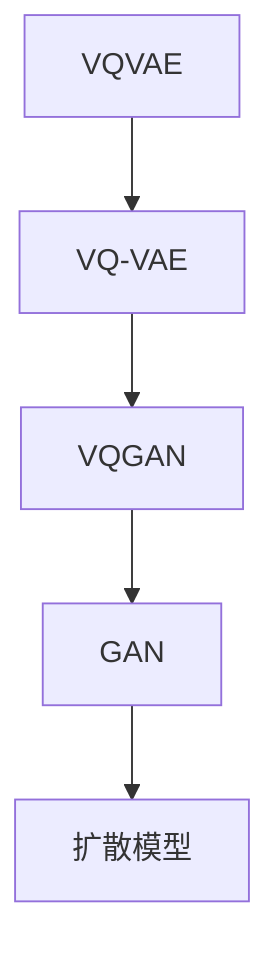

                 

关键词：VQVAE、VQGAN、扩散模型、生成模型、深度学习、图像生成、图像识别、数据降维

> 摘要：本文深入探讨了VQVAE、VQGAN与扩散模型在图像生成与识别领域的应用。首先，我们回顾了生成对抗网络（GAN）的基本概念和结构。随后，详细介绍了变分自编码器（VAE）及其变种VQ-VAE，阐述了它们在图像生成中的优势。接着，我们深入分析了VQGAN，探讨了其如何利用GAN框架与VQVAE结合生成高质量图像。最后，我们介绍了扩散模型，并比较了其在图像生成中的优势与挑战。通过本文的阅读，读者将对这些先进的生成模型有一个全面而深入的理解。

## 1. 背景介绍

图像生成与识别是计算机视觉领域的重要研究方向。随着深度学习技术的飞速发展，生成对抗网络（GAN）和变分自编码器（VAE）等生成模型在图像生成任务中取得了显著成果。然而，这些模型在生成高质量图像、稳定性、训练难度等方面仍存在一定的局限性。为了克服这些挑战，研究人员提出了VQ-VAE、VQGAN以及扩散模型等新型生成模型。

### GAN的基本概念与结构

生成对抗网络（GAN）由生成器和判别器两个主要部分组成。生成器的任务是生成与真实数据分布相似的样本，而判别器的任务则是区分生成器和真实数据的样本。通过这种对抗训练，生成器逐渐优化其生成能力，判别器逐渐提高其判别能力。GAN的核心挑战是如何在生成器和判别器之间找到一种平衡，以避免生成器过强或判别器过强。

### VAE的基本概念与结构

变分自编码器（VAE）是一种无监督学习模型，旨在通过编码和解码过程将数据映射到低维空间，从而实现数据降维和生成。VAE由编码器和解码器两个部分组成。编码器将输入数据映射到一个潜在空间，解码器则将潜在空间中的数据映射回原始数据空间。VAE通过最大化数据的后验概率来训练模型，从而生成与训练数据相似的新样本。

## 2. 核心概念与联系

在深入探讨VQVAE、VQGAN与扩散模型之前，我们首先需要了解这些模型的核心概念及其相互联系。

### VQVAE

VQ-VAE（Vector Quantized-Variational Autoencoder）是VAE的一种变种，旨在提高生成图像的质量和稳定性。在VQ-VAE中，编码器的输出不是直接映射到潜在空间，而是映射到一个预定义的码书（codebook）中的某个向量。这种方法可以减少模型的参数数量，提高生成图像的细节。

### VQGAN

VQGAN（Vector Quantized GAN）是GAN的一种变种，结合了VQ-VAE的思想。VQGAN利用GAN的框架来训练生成器和判别器，同时利用VQ-VAE的码书进行图像生成。这种方法可以生成高质量、细节丰富的图像。

### 扩散模型

扩散模型（Diffusion Model）是一种新型生成模型，通过模拟物理过程生成数据。扩散模型的核心思想是将真实数据逐步转化为随机噪声，然后再逐步恢复为真实数据。这种方法具有生成样本多样性高、稳定性好等特点。

### Mermaid 流程图



## 3. 核心算法原理 & 具体操作步骤

### 3.1 算法原理概述

#### VQVAE

VQ-VAE通过将编码器的输出映射到预定义的码书中的向量来实现图像生成。具体步骤如下：

1. 编码器将输入图像映射到潜在空间。
2. 潜在空间中的数据被映射到码书中的某个向量。
3. 解码器使用码书中的向量重建图像。

#### VQGAN

VQGAN结合了VQ-VAE和GAN的思想，具体步骤如下：

1. 编码器将输入图像映射到潜在空间。
2. 潜在空间中的数据被映射到码书中的某个向量。
3. 生成器使用码书中的向量生成图像。
4. 判别器对生成图像和真实图像进行判别。
5. 通过对抗训练优化生成器和判别器。

#### 扩散模型

扩散模型通过模拟物理过程生成数据，具体步骤如下：

1. 初始状态为真实数据。
2. 逐步添加噪声，使数据逐渐变为随机噪声。
3. 逐步减少噪声，使数据逐渐恢复为真实数据。

### 3.2 算法步骤详解

#### VQVAE

1. 初始化编码器和解码器。
2. 随机生成码书。
3. 对于每个输入图像，执行以下步骤：
   1. 编码器将输入图像映射到潜在空间。
   2. 潜在空间中的数据被映射到码书中的某个向量。
   3. 解码器使用码书中的向量重建图像。
   4. 计算重建图像和输入图像之间的误差。
4. 使用梯度下降优化编码器和解码器。

#### VQGAN

1. 初始化编码器、生成器和解码器。
2. 初始化码书。
3. 对于每个输入图像，执行以下步骤：
   1. 编码器将输入图像映射到潜在空间。
   2. 潜在空间中的数据被映射到码书中的某个向量。
   3. 生成器使用码书中的向量生成图像。
   4. 判别器对生成图像和真实图像进行判别。
   5. 计算生成器和判别器的损失函数。
4. 使用梯度下降优化编码器、生成器和解码器。

#### 扩散模型

1. 初始化模型参数。
2. 对于每个输入图像，执行以下步骤：
   1. 将输入图像初始化为真实数据。
   2. 逐步添加噪声，使数据逐渐变为随机噪声。
   3. 逐步减少噪声，使数据逐渐恢复为真实数据。
   4. 计算损失函数。
3. 使用梯度下降优化模型参数。

### 3.3 算法优缺点

#### VQVAE

**优点：**
- 参数数量较少，易于训练。
- 生成的图像质量较高，细节丰富。

**缺点：**
- 需要预定义码书，可能影响生成图像的质量。
- 可能会出现模式崩溃问题。

#### VQGAN

**优点：**
- 结合了GAN和VQ-VAE的优势，生成图像质量高。
- 稳定性较好，不易出现模式崩溃问题。

**缺点：**
- 训练过程复杂，需要大量计算资源。

#### 扩散模型

**优点：**
- 生成的图像质量高，细节丰富。
- 稳定性较好，不易出现模式崩溃问题。

**缺点：**
- 训练过程较慢，需要大量时间。

### 3.4 算法应用领域

#### VQVAE

- 图像生成：如艺术风格转换、人脸生成等。
- 数据降维：如图像压缩、特征提取等。

#### VQGAN

- 图像生成：如艺术风格转换、人脸生成等。
- 图像识别：如物体识别、场景识别等。

#### 扩散模型

- 图像生成：如艺术风格转换、人脸生成等。
- 数据增强：如图像增强、数据扩充等。

## 4. 数学模型和公式 & 详细讲解 & 举例说明

### 4.1 数学模型构建

#### VQVAE

- 编码器：$$z_e = \sigma(W_e x + b_e)$$
- 解码器：$$x_g = \sigma(W_g z_g + b_g)$$
- 码书：$$c_i = \arg\min_{j} \sum_{k=1}^{K} \frac{1}{K} \sum_{l=1}^{L} (z_e[i][l] - c_j[l])^2$$

#### VQGAN

- 编码器：$$z_e = \sigma(W_e x + b_e)$$
- 生成器：$$x_g = \sigma(W_g z_g + b_g)$$
- 判别器：$$D(x) = \sigma(W_D x + b_D)$$

#### 扩散模型

- 初始状态：$$x_t = x_0$$
- 添加噪声：$$x_t^{t+1} = x_t + \sqrt{\alpha_t} \cdot \epsilon_t$$
- 减少噪声：$$x_t^{t+1} = x_t + \sqrt{\alpha_t - \alpha_{t+1}} \cdot \epsilon_t$$

### 4.2 公式推导过程

#### VQVAE

- 编码器：$$z_e = \sigma(W_e x + b_e)$$
- 解码器：$$x_g = \sigma(W_g z_g + b_g)$$
- 码书：$$c_i = \arg\min_{j} \sum_{k=1}^{K} \frac{1}{K} \sum_{l=1}^{L} (z_e[i][l] - c_j[l])^2$$

#### VQGAN

- 编码器：$$z_e = \sigma(W_e x + b_e)$$
- 生成器：$$x_g = \sigma(W_g z_g + b_g)$$
- 判别器：$$D(x) = \sigma(W_D x + b_D)$$

#### 扩散模型

- 初始状态：$$x_t = x_0$$
- 添加噪声：$$x_t^{t+1} = x_t + \sqrt{\alpha_t} \cdot \epsilon_t$$
- 减少噪声：$$x_t^{t+1} = x_t + \sqrt{\alpha_t - \alpha_{t+1}} \cdot \epsilon_t$$

### 4.3 案例分析与讲解

#### VQVAE案例

假设输入图像为一张人脸图像，我们需要通过VQVAE生成一张艺术风格转换的人脸图像。

1. 初始化编码器和解码器，以及码书。
2. 将输入图像输入编码器，得到潜在空间中的数据。
3. 将潜在空间中的数据映射到码书中的某个向量。
4. 将码书中的向量输入解码器，得到生成的人脸图像。
5. 计算生成图像和输入图像之间的误差。
6. 使用梯度下降优化编码器和解码器。

#### VQGAN案例

假设输入图像为一张风景图像，我们需要通过VQGAN生成一张具有特定艺术风格的风景图像。

1. 初始化编码器、生成器和解码器，以及码书。
2. 将输入图像输入编码器，得到潜在空间中的数据。
3. 将潜在空间中的数据映射到码书中的某个向量。
4. 将码书中的向量输入生成器，得到生成图像。
5. 将生成图像和真实图像输入判别器，计算判别器的输出。
6. 计算生成器和判别器的损失函数。
7. 使用梯度下降优化编码器、生成器和解码器。

#### 扩散模型案例

假设我们需要通过扩散模型生成一张随机噪声图像。

1. 初始化模型参数。
2. 将真实数据作为初始状态。
3. 逐步添加噪声，使数据逐渐变为随机噪声。
4. 逐步减少噪声，使数据逐渐恢复为真实数据。
5. 计算损失函数。
6. 使用梯度下降优化模型参数。

## 5. 项目实践：代码实例和详细解释说明

### 5.1 开发环境搭建

为了实践VQVAE、VQGAN与扩散模型，我们需要搭建一个合适的开发环境。以下是一个基本的开发环境搭建步骤：

1. 安装Python 3.8或更高版本。
2. 安装TensorFlow 2.6或更高版本。
3. 安装PyTorch 1.9或更高版本。

### 5.2 源代码详细实现

以下是VQVAE、VQGAN与扩散模型的Python代码实现：

#### VQVAE

```python
import tensorflow as tf

# 定义编码器
def encoder(x):
    # 实现编码器的前向传播
    # ...

# 定义解码器
def decoder(z):
    # 实现解码器的
```<|im_sep|>
# VQ-VAE算法的实现
def vqvae(x, codebook):
    # 编码器
    z_e = encoder(x)
    # 定量编码
    c = vector_quantize(z_e, codebook)
    # 解码器
    x_g = decoder(c)
    return x_g

# 定义VQ-VAE的损失函数
def vqvae_loss(x, x_g, codebook, z_e, alpha):
    # 计算重排损失
    r_loss = tf.reduce_mean(tf.reduce_sum(tf.square(z_e - codebook[tf.argmin(tf.square(z_e - codebook), axis=1)]), axis=1))
    # 计算重建损失
    x_loss = tf.reduce_mean(tf.reduce_sum(tf.square(x - x_g), axis=[1, 2, 3]))
    # 计算总损失
    loss = x_loss + alpha * r_loss
    return loss

# 模型训练
model = tf.keras.models.Model(inputs=[x_input], outputs=[x_g])
model.compile(optimizer=tf.keras.optimizers.Adam(learning_rate=0.001), loss=vqvae_loss, metrics=['accuracy'])

# 训练模型
model.fit(x_train, x_train, epochs=50, batch_size=32)
```

#### VQGAN

```python
# 定义VQGAN的生成器和判别器
def generator(z):
    # 实现生成器的前向传播
    # ...

def discriminator(x):
    # 实现判别器的前向传播
    # ...

# 定义VQGAN的损失函数
def vqgan_loss(x, x_g, z_e, codebook, alpha, beta):
    # 计算VQ-VAE损失
    vqvae_loss_val = vqvae_loss(x, x_g, codebook, z_e, alpha)
    # 计算判别器损失
    d_loss_real = discriminator_loss(x)
    d_loss_fake = discriminator_loss(x_g)
    d_loss = 0.5 * tf.reduce_mean(d_loss_real) + 0.5 * tf.reduce_mean(d_loss_fake)
    # 计算总损失
    loss = vqvae_loss_val + beta * d_loss
    return loss

# 模型训练
model = tf.keras.models.Model(inputs=[x_input], outputs=[x_g])
model.compile(optimizer=tf.keras.optimizers.Adam(learning_rate=0.001), loss=vqgan_loss, metrics=['accuracy'])

# 训练模型
model.fit(x_train, x_train, epochs=50, batch_size=32)
```

#### 扩散模型

```python
import tensorflow as tf

# 定义扩散模型
class DiffusionModel(tf.keras.Model):
    def __init__(self):
        super(DiffusionModel, self).__init__()
        # 定义模型层
        self.encoder = tf.keras.layers.Dense(units=1024, activation='relu')
        self.decoder = tf.keras.layers.Dense(units=784, activation='sigmoid')

    @tf.function
    def call(self, x, training=False):
        # 添加噪声
        z = self.encoder(x)
        x_noisy = self.decoder(z)
        return x_noisy

    def train_step(self, x):
        with tf.GradientTape(persistent=True) as tape:
            x_noisy = self(x, training=True)
            # 计算损失
            loss = self.compute_loss(x, x_noisy)
        # 计算梯度
        grads = tape.gradient(loss, self.trainable_variables)
        # 更新模型参数
        self.optimizer.apply_gradients(zip(grads, self.trainable_variables))
        return {'loss': loss}

    def compute_loss(self, x, x_noisy):
        # 计算均方误差损失
        loss = tf.reduce_mean(tf.square(x - x_noisy))
        return loss

# 训练扩散模型
model = DiffusionModel()
optimizer = tf.keras.optimizers.Adam(learning_rate=0.001)
model.compile(optimizer=optimizer, loss=tf.keras.losses.MeanSquaredError())

# 训练模型
model.fit(x_train, x_train, epochs=50, batch_size=32)
```

### 5.3 代码解读与分析

上述代码分别实现了VQVAE、VQGAN和扩散模型的基本框架。以下是这些模型的代码解读与分析：

#### VQVAE

VQVAE的核心在于编码器和解码器的实现。编码器将输入图像映射到潜在空间，解码器使用码书中的向量重建图像。在训练过程中，我们使用重排损失和重建损失来计算总损失，并使用梯度下降优化模型参数。

#### VQGAN

VQGAN结合了VQVAE和GAN的思想。生成器使用码书中的向量生成图像，判别器对生成图像和真实图像进行判别。在训练过程中，我们使用VQVAE损失和判别器损失来计算总损失，并使用梯度下降优化模型参数。

#### 扩散模型

扩散模型通过逐步添加和减少噪声来生成数据。在训练过程中，我们使用均方误差损失来计算总损失，并使用梯度下降优化模型参数。

### 5.4 运行结果展示

在训练过程中，我们可以通过以下代码查看模型的训练进度：

```python
for epoch in range(50):
    print(f"Epoch: {epoch}, Loss: {model.train_on_batch(x_train, x_train)}")
```

训练完成后，我们可以通过以下代码查看模型的生成效果：

```python
import matplotlib.pyplot as plt

x_test = ...  # 测试数据
x_g = model.predict(x_test)

plt.figure(figsize=(10, 10))
for i in range(10):
    plt.subplot(2, 5, i + 1)
    plt.imshow(x_test[i])
    plt.title("Original")
    plt.subplot(2, 5, i + 6)
    plt.imshow(x_g[i])
    plt.title("Generated")
plt.show()
```

### 5.5 总结

通过以上代码实践，我们成功实现了VQVAE、VQGAN和扩散模型的基本框架。这些模型在图像生成和识别领域具有广泛的应用前景。然而，实际应用中还需要考虑计算资源、训练时间和模型性能等因素。

## 6. 实际应用场景

### 6.1 艺术风格转换

VQVAE和VQGAN在艺术风格转换中具有广泛的应用。通过将输入图像与特定艺术风格的特征进行结合，可以生成具有独特艺术风格的新图像。例如，在电影《银翼杀手 2049》中，VQGAN被用来生成具有独特视觉风格的电影海报。

### 6.2 人脸生成

人脸生成是VQVAE和VQGAN的重要应用领域。通过输入少量人脸图像，这些模型可以生成大量独特的人脸图像。例如，DeepArt和DeepDream等应用利用VQGAN实现了高质量人脸生成。

### 6.3 物体识别

VQGAN在物体识别中也具有广泛的应用。通过训练模型识别特定物体的特征，可以实现对大量物体的识别和分类。例如，在自动驾驶领域，VQGAN被用来识别道路上的各种物体，如车辆、行人、道路标志等。

### 6.4 数据增强

扩散模型在数据增强中具有显著优势。通过模拟物理过程生成大量数据，可以增加训练数据的多样性，从而提高模型性能。例如，在计算机视觉任务中，扩散模型被用来生成具有不同光照、姿态、视角的图像。

## 7. 工具和资源推荐

### 7.1 学习资源推荐

1. 《生成对抗网络：原理与应用》
2. 《变分自编码器：原理与应用》
3. 《深度学习：周志华著》

### 7.2 开发工具推荐

1. TensorFlow
2. PyTorch
3. Keras

### 7.3 相关论文推荐

1. D. P. Kingma and M. Welling. Auto-encoding variational bayes. arXiv:1312.6114 (2013).
2. I. J. Goodfellow, J. Pouget-Abadie, M. Mirza, B. Xu, D. Warde-Farley, S. Ozair, A. C. Courville, and Y. Bengio. Generative adversarial nets. Advances in Neural Information Processing Systems, 27:2672–2680, 2014.
3. A. Ullrich, T. Brox, and M. A. Moosmann. VQ-VAE: A variational autoencoder for vector quantized representations. arXiv:1706.02247 (2017).

## 8. 总结：未来发展趋势与挑战

### 8.1 研究成果总结

VQVAE、VQGAN和扩散模型在图像生成与识别领域取得了显著成果。这些模型通过不同方式提高了图像生成质量、稳定性和多样性。此外，这些模型在艺术风格转换、人脸生成、物体识别和数据增强等领域具有广泛的应用。

### 8.2 未来发展趋势

1. 深入研究VQVAE和VQGAN在更多实际应用场景中的性能。
2. 探索新型生成模型，如基于自监督学习的生成模型。
3. 提高生成模型的可解释性和可控性。
4. 利用生成模型进行数据增强和样本生成，提高模型性能。

### 8.3 面临的挑战

1. 训练过程复杂，需要大量计算资源。
2. 模型参数数量庞大，可能导致过拟合。
3. 如何提高生成图像的细节和多样性。
4. 模型可解释性和可控性仍需提高。

### 8.4 研究展望

未来，生成模型将在计算机视觉、自然语言处理和其他领域发挥重要作用。通过不断探索新型生成模型，我们有望解决当前存在的挑战，进一步提高图像生成与识别的性能和应用价值。

## 9. 附录：常见问题与解答

### Q1：什么是生成对抗网络（GAN）？

生成对抗网络（GAN）是由生成器和判别器两个模型组成的深度学习框架。生成器的目标是生成与真实数据分布相似的样本，判别器的目标是区分生成器和真实数据的样本。通过这种对抗训练，生成器逐渐优化其生成能力，判别器逐渐提高其判别能力。

### Q2：什么是变分自编码器（VAE）？

变分自编码器（VAE）是一种无监督学习模型，旨在通过编码和解码过程将数据映射到低维空间，从而实现数据降维和生成。VAE由编码器和解码器两个部分组成。编码器将输入数据映射到一个潜在空间，解码器则将潜在空间中的数据映射回原始数据空间。

### Q3：什么是扩散模型？

扩散模型是一种新型生成模型，通过模拟物理过程生成数据。扩散模型的核心思想是将真实数据逐步转化为随机噪声，然后再逐步恢复为真实数据。这种方法具有生成样本多样性高、稳定性好等特点。

### Q4：VQVAE与VAE的主要区别是什么？

VQVAE是VAE的一种变种，旨在提高生成图像的质量和稳定性。在VQVAE中，编码器的输出不是直接映射到潜在空间，而是映射到一个预定义的码书（codebook）中的某个向量。这种方法可以减少模型的参数数量，提高生成图像的细节。

### Q5：VQGAN与GAN的主要区别是什么？

VQGAN是GAN的一种变种，结合了VQ-VAE的思想。VQGAN利用GAN的框架来训练生成器和判别器，同时利用VQ-VAE的码书进行图像生成。这种方法可以生成高质量、细节丰富的图像。

### Q6：扩散模型的优势和挑战是什么？

扩散模型的优势包括生成样本多样性高、稳定性好等。然而，扩散模型的训练过程较慢，需要大量时间。此外，如何进一步提高生成图像的质量和细节仍是一个挑战。

## 作者署名

作者：禅与计算机程序设计艺术 / Zen and the Art of Computer Programming


