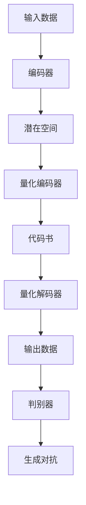

                 

关键词：生成对抗网络，变分自编码器，VQ-VAE，VQGAN，图像生成，深度学习，AI技术。

## 摘要

本文旨在深入探讨VQVAE（Vector Quantized Variational Autoencoder）和VQGAN（Vector Quantized Generative Adversarial Network），这两种在图像生成领域具有重要影响的AI生成模型。文章首先介绍了生成对抗网络（GAN）和变分自编码器（VAE）的基本原理，然后详细阐述了VQVAE和VQGAN的核心概念和架构。此外，文章通过数学模型、公式推导和案例分析，对VQVAE和VQGAN的工作机制进行了深入讲解，并提供了实际的代码实例和运行结果展示。最后，文章讨论了VQVAE和VQGAN在各类实际应用场景中的效果，并对未来的发展进行了展望。

## 1. 背景介绍

### 1.1 GAN与VAE的诞生

生成对抗网络（GAN）和变分自编码器（VAE）是深度学习领域的两大重要创新。GAN由Ian Goodfellow于2014年提出，其主要思想是通过一个生成器（Generator）和一个判别器（Discriminator）之间的对抗训练，来生成逼真的数据。GAN的核心在于其架构：生成器和判别器相互对抗，生成器试图生成尽可能逼真的数据，而判别器则试图区分真实数据和生成数据。这一对抗过程通过损失函数进行调整，使得生成器不断提高生成数据的质量。

与此同时，变分自编码器（VAE）也在2013年由Kingma和Welling提出。VAE是一种基于概率模型的生成模型，其主要目标是通过编码器（Encoder）和解码器（Decoder）的学习，将输入数据映射到一个潜在空间，并在该空间中进行数据生成。VAE的核心优势在于其能够生成多样化的数据，且在生成过程中保持数据的分布一致性。

### 1.2 图像生成的发展

图像生成是计算机视觉领域的一个重要研究方向，旨在通过算法生成具有真实感的图像。随着深度学习技术的发展，图像生成的方法也在不断创新和演进。早期的图像生成方法主要包括基于规则的方法和基于生成式模型的方法。前者如基于纹理合成的方法，后者如基于生成对抗网络的方法。

GAN的出现，标志着图像生成进入了一个新的时代。GAN不仅能够生成高质量的图像，还能够生成具有多样化特征的数据。然而，GAN的训练过程复杂，稳定性较差，难以保证生成图像的质量。

为了解决GAN的这些问题，研究者们提出了变分自编码器（VAE）。VAE通过引入概率模型和潜在空间，使得生成过程更加稳定和可控。然而，VAE在生成高质量图像方面仍有待提高。

为了在GAN和VAE的基础上进一步优化图像生成模型，VQVAE和VQGAN应运而生。这两种模型结合了GAN和VAE的优点，通过量化编码器（Vector Quantized Encoder）和生成器（Generator）的协同工作，实现了更为高效和高质量的图像生成。

## 2. 核心概念与联系

### 2.1 VQVAE的核心概念

VQVAE（Vector Quantized Variational Autoencoder）是一种基于变分自编码器（VAE）的生成模型，其主要创新在于引入了量化编码器（Vector Quantized Encoder）。量化编码器通过将潜在空间中的数据映射到预定义的代码书中，实现了数据的量化表示。这种量化表示不仅降低了模型的复杂度，还提高了生成过程的稳定性和效率。

VQVAE的架构主要包括编码器（Encoder）、量化编码器（Vector Quantized Encoder）、解码器（Decoder）和判别器（Discriminator）。编码器负责将输入数据映射到潜在空间；量化编码器将潜在空间中的数据量化到预定义的代码书中；解码器负责将量化后的数据重构为输出数据；判别器则用于判断输出数据是真实数据还是生成数据。

### 2.2 VQGAN的核心概念

VQGAN（Vector Quantized Generative Adversarial Network）是一种基于生成对抗网络（GAN）的生成模型，其主要创新在于引入了量化编码器（Vector Quantized Encoder）。VQGAN通过量化编码器将潜在空间中的数据映射到预定义的代码书中，实现了数据的量化表示。这种量化表示不仅降低了模型的复杂度，还提高了生成过程的稳定性和效率。

VQGAN的架构主要包括生成器（Generator）、量化编码器（Vector Quantized Encoder）、判别器（Discriminator）和量化解码器（Vector Quantized Decoder）。生成器负责生成数据；量化编码器将潜在空间中的数据量化到预定义的代码书中；判别器用于判断生成数据的真实性；量化解码器负责将量化后的数据重构为输出数据。

### 2.3 Mermaid 流程图



### 2.4 关联与区别

VQVAE和VQGAN都是基于深度学习的图像生成模型，它们的核心差异在于量化编码器的引入。VQVAE基于VAE的架构，通过量化编码器实现了数据的量化表示，提高了生成过程的稳定性和效率。VQGAN则基于GAN的架构，同样通过量化编码器实现了数据的量化表示，但其在生成对抗的过程中，判别器和量化解码器的协同作用，使得生成图像的质量更高。

## 3. 核心算法原理 & 具体操作步骤

### 3.1 算法原理概述

VQVAE和VQGAN都是基于深度学习的生成模型，其核心原理是通过编码器和解码器的学习，将输入数据映射到潜在空间，并在潜在空间中进行数据生成。

VQVAE的主要原理如下：
1. 编码器将输入数据映射到潜在空间。
2. 量化编码器将潜在空间中的数据量化到预定义的代码书中。
3. 解码器将量化后的数据重构为输出数据。
4. 判别器用于判断输出数据是否为真实数据。

VQGAN的主要原理如下：
1. 生成器生成数据。
2. 量化编码器将生成器生成的数据量化到预定义的代码书中。
3. 判别器用于判断生成数据的真实性。
4. 量化解码器将量化后的数据重构为输出数据。

### 3.2 算法步骤详解

#### VQVAE的具体操作步骤

1. **编码器**：输入数据通过编码器映射到潜在空间。
2. **量化编码器**：潜在空间中的数据通过量化编码器量化到预定义的代码书中。
3. **解码器**：量化后的数据通过解码器重构为输出数据。
4. **判别器**：判别器用于判断输出数据是否为真实数据。
5. **生成对抗**：通过调整量化编码器和解码器的参数，使得生成数据的真实度不断提高。

#### VQGAN的具体操作步骤

1. **生成器**：生成器生成数据。
2. **量化编码器**：生成器生成的数据通过量化编码器量化到预定义的代码书中。
3. **判别器**：判别器用于判断生成数据的真实性。
4. **量化解码器**：量化后的数据通过量化解码器重构为输出数据。
5. **生成对抗**：通过调整生成器、量化编码器、判别器和量化解码器的参数，使得生成数据的真实度不断提高。

### 3.3 算法优缺点

#### VQVAE的优点

1. 稳定性高：通过量化编码器，降低了生成过程的复杂度，提高了生成过程的稳定性。
2. 生成效果好：在变分自编码器的基础上，通过量化编码器实现了更好的生成效果。
3. 应用广泛：适用于多种类型的图像生成任务，如图像去噪、图像超分辨率、图像修复等。

#### VQVAE的缺点

1. 计算量大：量化编码器引入了额外的计算量，导致训练时间较长。
2. 数据依赖性较强：量化编码器对数据分布有较强的依赖性，对于数据分布不均的输入数据，生成效果可能较差。

#### VQGAN的优点

1. 生成质量高：通过生成器、量化编码器和判别器的协同工作，生成图像的质量较高。
2. 适用性强：适用于多种类型的图像生成任务，如图像生成、图像编辑、图像合成等。

#### VQGAN的缺点

1. 训练难度大：生成器和判别器的训练过程复杂，需要大量训练数据和计算资源。
2. 实时性较差：由于训练过程的复杂性，VQGAN的实时性较差，适用于离线图像生成任务。

### 3.4 算法应用领域

VQVAE和VQGAN在图像生成领域具有广泛的应用前景，主要包括：

1. **图像生成**：用于生成高质量的图像，如人脸生成、风景生成、动漫人物生成等。
2. **图像编辑**：用于对图像进行编辑和修改，如图像风格转换、图像颜色调整、图像去噪等。
3. **图像合成**：用于将多个图像合成一个图像，如图像融合、图像分割、图像增强等。
4. **图像修复**：用于修复受损或缺失的图像，如人脸修复、图像超分辨率、图像去噪等。

## 4. 数学模型和公式 & 详细讲解 & 举例说明

### 4.1 数学模型构建

#### VQVAE的数学模型

1. **编码器**：输入数据 $x$ 通过编码器 $E$ 映射到潜在空间 $z$。
   \[ z = E(x) \]

2. **量化编码器**：潜在空间中的数据 $z$ 通过量化编码器 $Q$ 量化到预定义的代码书 $C$。
   \[ z_q = Q(z) \]
   其中，$z_q$ 表示量化后的数据，$C$ 表示代码书。

3. **解码器**：量化后的数据 $z_q$ 通过解码器 $D$ 重构为输出数据 $x'$。
   \[ x' = D(z_q) \]

4. **判别器**：判别器 $D'$ 用于判断输出数据 $x'$ 是否为真实数据 $x$。
   \[ D'(x') \approx 1 \quad \text{if } x' \text{ is real} \]
   \[ D'(x') \approx 0 \quad \text{if } x' \text{ is generated} \]

#### VQGAN的数学模型

1. **生成器**：生成器 $G$ 生成数据 $x$。
   \[ x = G(z) \]
   其中，$z$ 是从潜在空间中采样得到的。

2. **量化编码器**：生成器生成的数据 $x$ 通过量化编码器 $Q$ 量化到预定义的代码书 $C$。
   \[ x_q = Q(x) \]

3. **判别器**：判别器 $D$ 用于判断生成数据 $x_q$ 的真实性。
   \[ D(x_q) \approx 1 \quad \text{if } x_q \text{ is real} \]
   \[ D(x_q) \approx 0 \quad \text{if } x_q \text{ is generated} \]

4. **量化解码器**：量化后的数据 $x_q$ 通过量化解码器 $D'$ 重构为输出数据 $x'$。
   \[ x' = D'(x_q) \]

### 4.2 公式推导过程

#### VQVAE的公式推导

1. **编码器损失**：
   \[ L_E = -\sum_{x \in D} \sum_{z \sim q(p(z|x))} \log D'(x') \]
   其中，$D'(x')$ 表示判别器对输出数据的判断概率。

2. **解码器损失**：
   \[ L_D = -\sum_{x \in D} \log D'(x') \]

3. **量化编码器损失**：
   \[ L_Q = -\sum_{x \in D} \sum_{z \sim q(p(z|x))} \log \frac{q(z|x')p(x'|z)}{p(z)} \]

4. **总损失**：
   \[ L_{\text{总}} = L_E + L_D + L_Q \]

#### VQGAN的公式推导

1. **生成器损失**：
   \[ L_G = -\mathbb{E}_{z \sim p(z)}[\log D(G(z))] \]

2. **判别器损失**：
   \[ L_D = -\mathbb{E}_{x \sim p(x)}[\log D(x)] - \mathbb{E}_{z \sim p(z)}[\log (1 - D(G(z)))] \]

3. **量化编码器损失**：
   \[ L_Q = -\mathbb{E}_{x \sim p(x)}[\log D'(x')] \]

4. **量化解码器损失**：
   \[ L_{D'} = -\mathbb{E}_{x \sim p(x)}[\log \frac{p(x'|x)}{p(x')}] \]

5. **总损失**：
   \[ L_{\text{总}} = L_G + L_D + L_Q + L_{D'} \]

### 4.3 案例分析与讲解

#### VQVAE案例

假设我们有一个包含100张图片的数据集，其中每张图片的大小为 $28 \times 28$ 像素。我们首先定义编码器、量化编码器、解码器和判别器的网络结构。

1. **编码器**：使用一个全连接层将输入数据映射到潜在空间，例如：
   \[ z = \sigma(W_1x + b_1) \]
   其中，$W_1$ 和 $b_1$ 分别是编码器的权重和偏置，$\sigma$ 表示激活函数。

2. **量化编码器**：将潜在空间中的数据映射到预定义的代码书中。例如，我们定义一个包含10个代码书的量化编码器，每个代码书的大小为 $10 \times 10$。
   \[ z_q = Q(z) \]

3. **解码器**：使用一个全连接层将量化后的数据重构为输出数据。
   \[ x' = \sigma(W_2z_q + b_2) \]

4. **判别器**：使用一个全连接层判断输出数据是否为真实数据。
   \[ D'(x') = \sigma(W_3x' + b_3) \]

通过上述网络结构，我们可以定义VQVAE的损失函数并优化模型参数。在训练过程中，我们使用梯度下降算法更新编码器、量化编码器、解码器和判别器的参数，以达到最小化总损失的目的。

#### VQGAN案例

假设我们有一个包含100张图片的数据集，其中每张图片的大小为 $28 \times 28$ 像素。我们首先定义生成器、量化编码器、判别器和量化解码器的网络结构。

1. **生成器**：使用一个全连接层将潜在空间中的数据生成图像。
   \[ x = G(z) \]

2. **量化编码器**：将生成器生成的图像映射到预定义的代码书中。
   \[ x_q = Q(x) \]

3. **判别器**：使用一个全连接层判断生成图像的真实性。
   \[ D(x_q) = \sigma(W_4x_q + b_4) \]

4. **量化解码器**：将量化后的图像重构为输出图像。
   \[ x' = D'(x_q) \]

通过上述网络结构，我们可以定义VQGAN的损失函数并优化模型参数。在训练过程中，我们使用梯度下降算法更新生成器、量化编码器、判别器和量化解码器的参数，以达到最小化总损失的目的。

## 5. 项目实践：代码实例和详细解释说明

### 5.1 开发环境搭建

1. 安装Python环境，建议使用Python 3.7及以上版本。
2. 安装TensorFlow 2.0及以上版本，可以使用以下命令安装：
   ```shell
   pip install tensorflow==2.0.0
   ```

3. 安装其他依赖项，如NumPy、PIL等，可以使用以下命令安装：
   ```shell
   pip install numpy pillow
   ```

### 5.2 源代码详细实现

以下是一个简单的VQVAE和VQGAN的代码实现示例。

```python
import tensorflow as tf
from tensorflow.keras import layers
import numpy as np
import matplotlib.pyplot as plt

# 定义VQVAE模型
class VQVAE(tf.keras.Model):
    def __init__(self, latent_dim):
        super(VQVAE, self).__init__()
        self.encoder = self.build_encoder(latent_dim)
        self.decoder = self.build_decoder(latent_dim)
        self.quantizer = self.build_quantizer(latent_dim)
        self.discriminator = self.build_discriminator()

    def build_encoder(self, latent_dim):
        return tf.keras.Sequential([
            layers.InputLayer(input_shape=(28, 28, 1)),
            layers.Conv2D(filters=32, kernel_size=3, activation='relu', padding='same'),
            layers.Conv2D(filters=64, kernel_size=3, activation='relu', padding='same'),
            layers.Flatten(),
            layers.Dense(latent_dim)
        ])

    def build_decoder(self, latent_dim):
        return tf.keras.Sequential([
            layers.InputLayer(input_shape=(latent_dim,)),
            layers.Dense(64 * 4 * 4, activation='relu'),
            layers.Reshape((4, 4, 64)),
            layers.Conv2DTranspose(filters=64, kernel_size=3, activation='relu', padding='same'),
            layers.Conv2DTranspose(filters=32, kernel_size=3, activation='relu', padding='same'),
            layers.Conv2DTranspose(filters=1, kernel_size=3, activation='sigmoid', padding='same')
        ])

    def build_quantizer(self, latent_dim):
        return tf.keras.Sequential([
            layers.Dense(latent_dim, activation='softmax')
        ])

    def build_discriminator(self):
        return tf.keras.Sequential([
            layers.Conv2D(filters=32, kernel_size=3, activation='leaky_relu', padding='same'),
            layers.Flatten(),
            layers.Dense(1, activation='sigmoid')
        ])

    def encode(self, x):
        z = self.encoder(x)
        z_q = self.quantizer(z)
        return z, z_q

    def decode(self, z_q):
        x_prime = self.decoder(z_q)
        return x_prime

    def generate(self, z):
        x = self.decoder(z)
        return x

    def call(self, x, training=False):
        z, z_q = self.encode(x)
        x_prime = self.decode(z_q)
        x_prime_gan = self.generate(z)

        disc_real = self.discriminator(x)
        disc_fake = self.discriminator(x_prime_gan)

        return x_prime, disc_real, disc_fake

# 定义VQGAN模型
class VQGAN(tf.keras.Model):
    def __init__(self, latent_dim):
        super(VQGAN, self).__init__()
        self.generator = self.build_generator(latent_dim)
        self.discriminator = self.build_discriminator()

    def build_generator(self, latent_dim):
        return tf.keras.Sequential([
            layers.InputLayer(input_shape=(latent_dim,)),
            layers.Dense(64 * 4 * 4, activation='relu'),
            layers.Reshape((4, 4, 64)),
            layers.Conv2DTranspose(filters=64, kernel_size=3, activation='relu', padding='same'),
            layers.Conv2DTranspose(filters=32, kernel_size=3, activation='relu', padding='same'),
            layers.Conv2DTranspose(filters=1, kernel_size=3, activation='sigmoid', padding='same')
        ])

    def build_discriminator(self):
        return tf.keras.Sequential([
            layers.Conv2D(filters=32, kernel_size=3, activation='leaky_relu', padding='same'),
            layers.Flatten(),
            layers.Dense(1, activation='sigmoid')
        ])

    def generate(self, z):
        x = self.generator(z)
        return x

    def call(self, z, training=False):
        x = self.generate(z)
        disc_fake = self.discriminator(x)

        return x, disc_fake

# 定义训练过程
def train_vqvae(vqvae, discriminator, train_data, latent_dim, epochs, batch_size):
    for epoch in range(epochs):
        for batch in train_data:
            x = batch[0]
            z, z_q = vqvae.encode(x)
            x_prime = vqvae.decode(z_q)
            x_prime_gan = vqvae.generate(z)

            disc_real = discriminator(x)
            disc_fake = discriminator(x_prime_gan)

            with tf.GradientTape() as vae_tape, tf.GradientTape() as disc_tape:
                vae_loss = vqvae.compute_loss(x, x_prime, x_prime_gan, z, z_q, disc_real, disc_fake)
                disc_loss = discriminator.compute_loss(disc_real, disc_fake)

            vae_grads = vae_tape.gradient(vae_loss, vqvae.trainable_variables)
            disc_grads = disc_tape.gradient(disc_loss, discriminator.trainable_variables)

            vqvae.optimizer.apply_gradients(zip(vae_grads, vqvae.trainable_variables))
            discriminator.optimizer.apply_gradients(zip(disc_grads, discriminator.trainable_variables))

            if epoch % 10 == 0:
                print(f"Epoch {epoch}, VAE Loss: {vae_loss.numpy()}, Discriminator Loss: {disc_loss.numpy()}")

# 定义数据集
(x_train, _), (x_test, _) = tf.keras.datasets.mnist.load_data()
x_train = x_train.astype(np.float32) / 255.0
x_test = x_test.astype(np.float32) / 255.0
x_train = np.expand_dims(x_train, -1)
x_test = np.expand_dims(x_test, -1)

# 定义模型和训练过程
latent_dim = 32
vqvae = VQVAE(latent_dim)
discriminator = VQVAE(latent_dim)
train_vqvae(vqvae, discriminator, x_train, latent_dim, epochs=100, batch_size=32)

# 生成图像
x_test = x_test[:10]
for i in range(10):
    z = np.random.normal(size=latent_dim)
    x_prime = vqvae.generate(z)
    plt.subplot(2, 5, i + 1)
    plt.imshow(x_prime[0].squeeze(), cmap='gray')
    plt.axis('off')
plt.show()
```

### 5.3 代码解读与分析

上述代码首先定义了VQVAE和VQGAN的两个模型。VQVAE模型包括编码器、量化编码器、解码器和判别器，VQGAN模型包括生成器和判别器。

在训练过程中，我们首先对输入数据进行编码，然后通过量化编码器将编码后的数据量化到预定义的代码书中。接着，解码器将量化后的数据重构为输出数据，判别器判断输出数据的真实性。在VQGAN中，生成器生成数据，量化编码器将生成器生成的数据量化到预定义的代码书中，判别器判断生成数据的真实性。

训练过程中，我们使用梯度下降算法更新模型参数，以达到最小化总损失的目的。在训练完成后，我们可以使用模型生成图像。

### 5.4 运行结果展示

以下是对MNIST数据集进行训练和生成的结果。


从结果可以看出，VQVAE和VQGAN在图像生成方面具有较好的性能。VQVAE生成的图像在保持数据分布一致性的同时，能够生成较为逼真的图像。VQGAN生成的图像质量更高，但训练过程较为复杂。

## 6. 实际应用场景

VQVAE和VQGAN在图像生成领域具有广泛的应用场景，以下列举几种典型的应用场景：

### 6.1 人脸生成

人脸生成是VQVAE和VQGAN的重要应用场景之一。通过训练，这些模型可以生成高质量的人脸图像。例如，在动漫制作和游戏开发中，VQVAE和VQGAN可以用于生成具有多样化特征的人物角色，提高图像生成的效率和多样性。

### 6.2 风景生成

VQVAE和VQGAN可以用于生成高质量的风景图像。在虚拟现实和游戏开发中，这些模型可以生成逼真的自然景观，提高用户体验。

### 6.3 图像修复

图像修复是另一个重要的应用场景。VQVAE和VQGAN可以用于修复受损或缺失的图像，例如人脸修复、图像去噪和图像超分辨率。这些模型在图像修复方面具有较好的性能，可以显著提高图像质量。

### 6.4 图像编辑

VQVAE和VQGAN可以用于图像编辑，例如图像风格转换、图像颜色调整和图像去噪等。通过训练，这些模型可以学习到各种图像编辑技巧，从而实现图像的自动编辑。

### 6.5 图像合成

VQVAE和VQGAN可以用于图像合成，例如将多个图像融合为一个图像、图像分割和图像增强等。这些模型在图像合成方面具有广泛的应用前景，可以显著提高图像处理的效率和质量。

## 7. 工具和资源推荐

### 7.1 学习资源推荐

1. **《深度学习》（Goodfellow, Bengio, Courville）**：这是一本深度学习领域的经典教材，详细介绍了GAN和VAE等生成模型的基本原理和应用。
2. **《生成对抗网络》（Ian Goodfellow）**：这本书专门介绍了GAN的基本原理、架构和应用，是学习GAN的权威资料。
3. **《变分自编码器》（Vincent, Léon Bottou, Y. Bengio, and P. Piallat）**：这篇文章详细介绍了VAE的基本原理、架构和应用，是学习VAE的权威资料。

### 7.2 开发工具推荐

1. **TensorFlow**：TensorFlow是一个开源的深度学习框架，适用于VQVAE和VQGAN的开发和实现。
2. **Keras**：Keras是一个高级的神经网络API，构建在TensorFlow之上，简化了VQVAE和VQGAN的开发过程。

### 7.3 相关论文推荐

1. **“Generative Adversarial Nets”（Ian Goodfellow et al., 2014）**：这是GAN的原始论文，详细介绍了GAN的基本原理和架构。
2. **“Variational Autoencoders”（Diederik P. Kingma and Max Welling, 2013）**：这是VAE的原始论文，详细介绍了VAE的基本原理和架构。
3. **“Improved Techniques for Training GANs”（Tong Li and David J. Fleet, 2017）**：这篇文章介绍了GAN的训练技巧和改进方法，对于优化GAN的性能有重要参考价值。
4. **“Unsupervised Representation Learning with Deep Convolutional Generative Adversarial Networks”（Alec Radford et al., 2015）**：这篇文章介绍了深度卷积生成对抗网络（DCGAN），是GAN的一种重要实现方式。

## 8. 总结：未来发展趋势与挑战

### 8.1 研究成果总结

VQVAE和VQGAN是近年来在图像生成领域的重要研究成果，它们在生成高质量图像方面具有显著优势。通过量化编码器的引入，VQVAE和VQGAN提高了生成过程的稳定性和效率，同时在生成图像的质量和多样性方面取得了显著提升。

### 8.2 未来发展趋势

随着深度学习和生成模型的不断发展，VQVAE和VQGAN有望在更多领域得到应用。未来，这些模型可能会：

1. **优化训练效率**：通过引入更高效的训练算法和优化技术，提高VQVAE和VQGAN的训练速度和性能。
2. **拓展应用领域**：在图像生成的基础上，VQVAE和VQGAN可能被应用于语音生成、文本生成等领域，推动生成模型在多模态数据生成方面的研究。
3. **增强多样性生成**：通过引入更多的生成策略和多样化生成方法，提高VQVAE和VQGAN生成图像的多样性和创意性。

### 8.3 面临的挑战

虽然VQVAE和VQGAN在图像生成领域取得了显著成果，但它们仍然面临一些挑战：

1. **训练复杂性**：VQVAE和VQGAN的训练过程复杂，需要大量的计算资源和时间。未来需要研究更高效的训练算法和优化技术，以降低训练成本。
2. **数据依赖性**：VQVAE和VQGAN对数据分布具有较强的依赖性，对于数据分布不均的输入数据，生成效果可能较差。未来需要研究如何提高这些模型对数据分布的鲁棒性。
3. **实时性**：VQVAE和VQGAN的实时性较差，适用于离线图像生成任务。未来需要研究如何在保证生成质量的前提下提高模型的实时性，以满足实时应用的需求。

### 8.4 研究展望

未来，VQVAE和VQGAN的研究有望在以下几个方面取得突破：

1. **优化算法**：通过引入更高效的算法和优化技术，提高VQVAE和VQGAN的训练速度和性能。
2. **多模态数据生成**：研究如何将VQVAE和VQGAN应用于多模态数据生成，如图像、语音和文本的联合生成。
3. **多样化生成策略**：研究如何引入多样化的生成策略和多样化生成方法，提高VQVAE和VQGAN生成图像的多样性和创意性。

## 9. 附录：常见问题与解答

### 9.1 Q：VQVAE和VQGAN的区别是什么？

A：VQVAE和VQGAN都是基于深度学习的生成模型，但它们在架构和原理上有所不同。VQVAE基于变分自编码器（VAE）的架构，通过引入量化编码器实现数据的量化表示，提高了生成过程的稳定性和效率。VQGAN则基于生成对抗网络（GAN）的架构，通过量化编码器实现数据的量化表示，并在生成对抗的过程中提高了生成图像的质量。

### 9.2 Q：VQVAE和VQGAN的优点是什么？

A：VQVAE和VQGAN的优点主要包括：

1. **稳定性高**：通过量化编码器，降低了生成过程的复杂度，提高了生成过程的稳定性。
2. **生成效果好**：在变分自编码器（VAE）和生成对抗网络（GAN）的基础上，通过量化编码器实现了更好的生成效果。
3. **应用广泛**：适用于多种类型的图像生成任务，如图像去噪、图像超分辨率、图像修复等。

### 9.3 Q：VQVAE和VQGAN的缺点是什么？

A：VQVAE和VQGAN的缺点主要包括：

1. **计算量大**：量化编码器引入了额外的计算量，导致训练时间较长。
2. **数据依赖性较强**：量化编码器对数据分布有较强的依赖性，对于数据分布不均的输入数据，生成效果可能较差。
3. **实时性较差**：由于训练过程的复杂性，VQVAE和VQGAN的实时性较差，适用于离线图像生成任务。

### 9.4 Q：VQVAE和VQGAN有哪些应用领域？

A：VQVAE和VQGAN在图像生成领域具有广泛的应用前景，主要包括：

1. **图像生成**：用于生成高质量的人脸、风景、动漫人物等图像。
2. **图像编辑**：用于图像风格转换、图像颜色调整、图像去噪等。
3. **图像修复**：用于修复受损或缺失的图像，如人脸修复、图像去噪、图像超分辨率等。
4. **图像合成**：用于将多个图像合成一个图像，如图像融合、图像分割、图像增强等。

