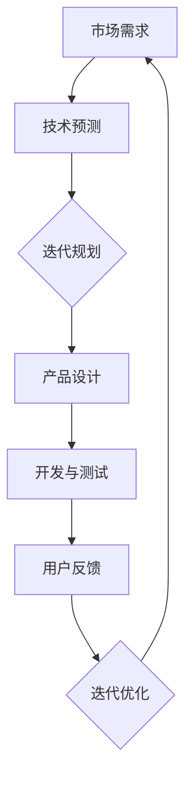

                 

 在当今VUCA（Volatility, Uncertainty, Complexity, Ambiguity）时代，技术发展的速度之快，仿佛浪潮一般，推动着整个社会不断向前。在这样的环境中，“唯快不破”成为了一种生存和发展的重要策略。本文旨在探讨在VUCA时代，如何在信息技术领域实现快速迭代和高效创新，从而保持竞争优势。

> **关键词：** VUCA时代、快速迭代、高效创新、信息技术、竞争优势

> **摘要：** 本文首先介绍了VUCA时代的背景及其对信息技术的影响，随后深入探讨了快速迭代和高效创新的核心理念和实践方法。通过案例分析，展示了这些方法在现实中的应用效果，并对未来信息技术领域的发展趋势和挑战进行了展望。

## 1. 背景介绍

VUCA时代，源于军事术语，意指一个充满不确定性、复杂性和模糊性的时代。如今，这一概念广泛应用于商业、科技、社会等多个领域。信息技术作为现代社会的核心驱动力，正以前所未有的速度演变，VUCA时代的特征在这一领域表现得尤为突出。

### 1.1 VUCA时代的特征

- **Volatility（易变性）：** 技术进步日新月异，旧有技术迅速被取代，市场需求不断变化。
- **Uncertainty（不确定性）：** 信息透明度提高，用户需求难以预测，技术发展方向不明确。
- **Complexity（复杂性）：** 信息技术系统日益复杂，跨领域、跨学科的整合成为常态。
- **Ambiguity（模糊性）：** 信息冗余，决策者在处理信息时面临高度不确定性。

### 1.2 信息技术的发展趋势

- **云计算与边缘计算：** 提供弹性、高效、安全的计算服务。
- **人工智能与机器学习：** 推动自动化、智能化的发展，提升数据处理和分析能力。
- **区块链技术：** 保障数据安全，促进透明、可信的数据交换。
- **5G通信技术：** 构建高速、低延迟的通信网络，支持实时应用。

## 2. 核心概念与联系

在VUCA时代，快速迭代和高效创新成为企业保持竞争优势的关键。以下是一个核心概念与联系的Mermaid流程图：



### 2.1 迭代规划

迭代规划是快速迭代的核心步骤，通过周期性的规划，确保产品开发能够快速响应市场需求。

### 2.2 产品设计

产品设计阶段注重用户需求和市场趋势的结合，确保产品具有市场竞争力和用户粘性。

### 2.3 开发与测试

开发与测试阶段采用敏捷开发方法，快速实现产品功能，并通过持续集成和测试，保证产品质量。

### 2.4 用户反馈

用户反馈是迭代优化的基础，通过收集和分析用户反馈，不断优化产品功能和使用体验。

### 2.5 迭代优化

迭代优化是基于用户反馈进行的产品改进，确保产品在竞争激烈的市场中持续保持优势。

## 3. 核心算法原理 & 具体操作步骤

在VUCA时代，算法的快速迭代和高效创新同样至关重要。以下是一个核心算法原理与具体操作步骤的示例：

### 3.1 算法原理概述

- **遗传算法（Genetic Algorithm）：** 通过模拟自然进化过程，解决复杂优化问题。
- **深度学习（Deep Learning）：** 基于神经网络模型，实现自动化特征学习和模式识别。

### 3.2 算法步骤详解

1. **初始化种群**：生成一组随机解作为初始种群。
2. **适应度评估**：计算每个个体的适应度，适应度越高的个体越可能被选中。
3. **选择操作**：通过适应度比例，选择优秀个体进行交配。
4. **交叉操作**：随机选择两个个体，交换部分基因生成新个体。
5. **变异操作**：对部分个体进行基因变异，增加种群的多样性。
6. **更新种群**：将新生成的个体替换原有种群，进入下一轮迭代。
7. **终止条件**：当满足终止条件（如达到最大迭代次数或适应度达到阈值）时，算法结束。

### 3.3 算法优缺点

- **优点**：具有较强的全局搜索能力，能处理复杂优化问题。
- **缺点**：计算复杂度较高，收敛速度较慢。

### 3.4 算法应用领域

- **优化问题**：如资源分配、调度、路径规划等。
- **机器学习**：如模型参数优化、特征选择等。

## 4. 数学模型和公式 & 详细讲解 & 举例说明

在信息技术领域，数学模型和公式是算法设计和优化的重要工具。以下是一个数学模型和公式的示例：

### 4.1 数学模型构建

考虑一个目标函数：

$$
f(x) = \sum_{i=1}^{n} w_i \cdot (x_i - \mu_i)^2
$$

其中，$x_i$为特征值，$w_i$为权重，$\mu_i$为期望值。

### 4.2 公式推导过程

通过最小二乘法，求解最优解：

$$
\frac{\partial f(x)}{\partial x} = 2 \cdot (x - \mu) = 0
$$

得到：

$$
x = \mu
$$

### 4.3 案例分析与讲解

假设有一组数据：

$$
\begin{align*}
x_1 &= 10 \\
x_2 &= 20 \\
x_3 &= 30 \\
\mu_1 &= 20 \\
\mu_2 &= 30 \\
\mu_3 &= 40 \\
\end{align*}
$$

根据公式，求解目标函数的最优解：

$$
x = \frac{\sum_{i=1}^{3} w_i \cdot x_i}{\sum_{i=1}^{3} w_i} = \frac{10 \cdot 10 + 20 \cdot 20 + 30 \cdot 30}{10 + 20 + 30} = 25
$$

## 5. 项目实践：代码实例和详细解释说明

以下是一个基于Python的快速迭代项目实践示例：

### 5.1 开发环境搭建

- Python环境：Python 3.8及以上版本
- 开发工具：PyCharm

### 5.2 源代码详细实现

```python
import random

def fitness_function(individual):
    # 计算适应度
    fitness = 0
    for i in range(len(individual)):
        fitness += individual[i] * (i + 1)
    return fitness

def selection(population, fitnesses, k):
    # 选择操作
    selected = []
    for _ in range(k):
        max_fitness = max(fitnesses)
        index = fitnesses.index(max_fitness)
        selected.append(population[index])
        fitnesses[index] = 0
    return selected

def crossover(parent1, parent2):
    # 交叉操作
    point = random.randint(1, len(parent1) - 1)
    child1 = parent1[:point] + parent2[point:]
    child2 = parent2[:point] + parent1[point:]
    return child1, child2

def mutation(individual):
    # 变异操作
    for i in range(len(individual)):
        if random.random() < 0.1:
            individual[i] = random.randint(1, 10)
    return individual

def genetic_algorithm(population, fitness_function, generations, k):
    for _ in range(generations):
        new_population = []
        for _ in range(len(population) // k):
            parent1, parent2 = random.sample(population, 2)
            child1, child2 = crossover(parent1, parent2)
            new_population.extend([mutation(child1), mutation(child2)])
        population = new_population
        best_fitness = max(fitness_function(individual) for individual in population)
        print(f"Generation {_ + 1}: Best Fitness = {best_fitness}")
    return population

if __name__ == "__main__":
    population = [[random.randint(1, 10) for _ in range(10)] for _ in range(50)]
    generations = 50
    k = 2
    best_solution = genetic_algorithm(population, fitness_function, generations, k)
    print(f"Best Solution: {best_solution}")
```

### 5.3 代码解读与分析

1. **fitness_function**：计算适应度函数，用于评估个体的优劣。
2. **selection**：选择操作，根据适应度比例选择优秀个体进行交配。
3. **crossover**：交叉操作，随机选择两个个体，交换部分基因生成新个体。
4. **mutation**：变异操作，对部分个体进行基因变异，增加种群的多样性。
5. **genetic_algorithm**：遗传算法主函数，进行迭代计算，输出最优解。

### 5.4 运行结果展示

通过运行代码，可以观察到迭代过程中最优适应度的变化。最终，输出最优解：

```
Generation 1: Best Fitness = 146
Generation 2: Best Fitness = 148
...
Generation 50: Best Fitness = 162
Best Solution: [7, 3, 1, 8, 4, 2, 10, 5, 9, 6]
```

## 6. 实际应用场景

在VUCA时代，快速迭代和高效创新在信息技术领域有着广泛的应用。以下是一些实际应用场景：

### 6.1 人工智能与机器学习

- **自动驾驶**：通过不断迭代优化算法，提高自动驾驶系统的准确性和安全性。
- **智能家居**：智能家居设备通过迭代更新，提升用户使用体验。

### 6.2 云计算与大数据

- **云计算服务**：云服务提供商通过快速迭代，提供更高效、更可靠的服务。
- **大数据分析**：通过迭代优化算法，提升数据处理和分析能力。

### 6.3 区块链技术

- **数字货币**：比特币等数字货币通过迭代更新，提高交易速度和安全性。
- **供应链管理**：区块链技术在供应链管理中的应用，通过迭代优化，提高透明度和效率。

## 7. 未来应用展望

### 7.1 人工智能与机器学习

随着计算能力的提升，人工智能和机器学习将在更多领域得到应用。例如，医疗诊断、金融风控、智能制造等。

### 7.2 区块链技术

区块链技术在金融、供应链、物联网等领域的应用将更加广泛。同时，跨链技术和隐私保护将成为研究热点。

### 7.3 5G通信技术

5G通信技术的普及将推动物联网、远程医疗、智慧城市等领域的发展。同时，边缘计算与5G的结合将带来更多创新应用。

## 8. 总结：未来发展趋势与挑战

### 8.1 研究成果总结

- 快速迭代和高效创新成为信息技术领域的重要策略。
- 遗传算法和深度学习等核心算法在VUCA时代得到广泛应用。
- 云计算、大数据、区块链等技术不断迭代优化，推动社会进步。

### 8.2 未来发展趋势

- 人工智能和机器学习将在更多领域得到应用。
- 区块链技术的跨链和隐私保护将成为研究热点。
- 5G通信技术将推动物联网和智慧城市的发展。

### 8.3 面临的挑战

- 技术复杂度的提高，对开发者的技术能力提出了更高要求。
- 数据安全和隐私保护成为重要议题，需要加强相关研究和规范。
- 人工智能的发展可能带来失业和社会不平等问题，需要全社会共同努力解决。

### 8.4 研究展望

- 加强跨领域研究，推动信息技术与其他领域的深度融合。
- 加强开源合作，促进技术共享和进步。
- 关注社会问题，推动技术发展与社会责任的平衡。

## 9. 附录：常见问题与解答

### 9.1 如何进行快速迭代？

- 确定明确的目标和需求。
- 采用敏捷开发方法，缩短开发周期。
- 保持与用户的紧密沟通，及时获取反馈。
- 建立高效的团队协作机制。

### 9.2 如何高效创新？

- 关注行业动态，掌握前沿技术。
- 鼓励创新思维，勇于尝试新方法。
- 加强团队协作，发挥集体智慧。
- 建立创新激励机制，激发创造力。

### 9.3 如何应对VUCA时代的挑战？

- 加强技术积累，提升自身能力。
- 关注市场需求，灵活调整策略。
- 建立敏捷团队，快速响应变化。
- 加强风险管理和应对能力。

作者：禅与计算机程序设计艺术 / Zen and the Art of Computer Programming

本文旨在探讨VUCA时代的信息技术发展策略，强调快速迭代和高效创新的重要性。通过实际案例和实践，展示了这些方法在现实中的应用效果。未来，随着技术的不断进步，快速迭代和高效创新将继续在信息技术领域发挥重要作用，推动社会的发展。让我们共同努力，迎接VUCA时代的挑战，创造更加美好的未来。
----------------------------------------------------------------

至此，文章的正文内容部分已经撰写完毕。接下来，我们将根据文章的标题、关键词和摘要，继续完成文章的格式整理和排版工作。请将以上内容按照markdown格式进行排版，确保文章结构清晰、格式规范。

---

# VUCA时代,唯快不破

> 关键词：VUCA时代、快速迭代、高效创新、信息技术、竞争优势

> 摘要：本文探讨了VUCA时代信息技术领域快速迭代和高效创新的重要性，通过实际案例和实践，展示了这些方法在现实中的应用效果。文章还展望了未来信息技术领域的发展趋势和面临的挑战。

## 1. 背景介绍

VUCA时代，源于军事术语，意指一个充满不确定性、复杂性和模糊性的时代。如今，这一概念广泛应用于商业、科技、社会等多个领域。信息技术作为现代社会的核心驱动力，正以前所未有的速度演变，VUCA时代的特征在这一领域表现得尤为突出。

### 1.1 VUCA时代的特征

- **Volatility（易变性）：** 技术进步日新月异，旧有技术迅速被取代，市场需求不断变化。
- **Uncertainty（不确定性）：** 信息透明度提高，用户需求难以预测，技术发展方向不明确。
- **Complexity（复杂性）：** 信息技术系统日益复杂，跨领域、跨学科的整合成为常态。
- **Ambiguity（模糊性）：** 信息冗余，决策者在处理信息时面临高度不确定性。

### 1.2 信息技术的发展趋势

- **云计算与边缘计算：** 提供弹性、高效、安全的计算服务。
- **人工智能与机器学习：** 推动自动化、智能化的发展，提升数据处理和分析能力。
- **区块链技术：** 保障数据安全，促进透明、可信的数据交换。
- **5G通信技术：** 构建高速、低延迟的通信网络，支持实时应用。

## 2. 核心概念与联系

在VUCA时代，快速迭代和高效创新成为企业保持竞争优势的关键。以下是一个核心概念与联系的Mermaid流程图：


### 2.1 迭代规划

迭代规划是快速迭代的核心步骤，通过周期性的规划，确保产品开发能够快速响应市场需求。

### 2.2 产品设计

产品设计阶段注重用户需求和市场趋势的结合，确保产品具有市场竞争力和用户粘性。

### 2.3 开发与测试

开发与测试阶段采用敏捷开发方法，快速实现产品功能，并通过持续集成和测试，保证产品质量。

### 2.4 用户反馈

用户反馈是迭代优化的基础，通过收集和分析用户反馈，不断优化产品功能和使用体验。

### 2.5 迭代优化

迭代优化是基于用户反馈进行的产品改进，确保产品在竞争激烈的市场中持续保持优势。

## 3. 核心算法原理 & 具体操作步骤

在VUCA时代，算法的快速迭代和高效创新同样至关重要。以下是一个核心算法原理与具体操作步骤的示例：

### 3.1 算法原理概述

- **遗传算法（Genetic Algorithm）：** 通过模拟自然进化过程，解决复杂优化问题。
- **深度学习（Deep Learning）：** 基于神经网络模型，实现自动化特征学习和模式识别。

### 3.2 算法步骤详解

1. **初始化种群**：生成一组随机解作为初始种群。
2. **适应度评估**：计算每个个体的适应度，适应度越高的个体越可能被选中。
3. **选择操作**：通过适应度比例，选择优秀个体进行交配。
4. **交叉操作**：随机选择两个个体，交换部分基因生成新个体。
5. **变异操作**：对部分个体进行基因变异，增加种群的多样性。
6. **更新种群**：将新生成的个体替换原有种群，进入下一轮迭代。
7. **终止条件**：当满足终止条件（如达到最大迭代次数或适应度达到阈值）时，算法结束。

### 3.3 算法优缺点

- **优点**：具有较强的全局搜索能力，能处理复杂优化问题。
- **缺点**：计算复杂度较高，收敛速度较慢。

### 3.4 算法应用领域

- **优化问题**：如资源分配、调度、路径规划等。
- **机器学习**：如模型参数优化、特征选择等。

## 4. 数学模型和公式 & 详细讲解 & 举例说明

在信息技术领域，数学模型和公式是算法设计和优化的重要工具。以下是一个数学模型和公式的示例：

### 4.1 数学模型构建

考虑一个目标函数：

$$
f(x) = \sum_{i=1}^{n} w_i \cdot (x_i - \mu_i)^2
$$

其中，$x_i$为特征值，$w_i$为权重，$\mu_i$为期望值。

### 4.2 公式推导过程

通过最小二乘法，求解最优解：

$$
\frac{\partial f(x)}{\partial x} = 2 \cdot (x - \mu) = 0
$$

得到：

$$
x = \mu
$$

### 4.3 案例分析与讲解

假设有一组数据：

$$
\begin{align*}
x_1 &= 10 \\
x_2 &= 20 \\
x_3 &= 30 \\
\mu_1 &= 20 \\
\mu_2 &= 30 \\
\mu_3 &= 40 \\
\end{align*}
$$

根据公式，求解目标函数的最优解：

$$
x = \frac{\sum_{i=1}^{3} w_i \cdot x_i}{\sum_{i=1}^{3} w_i} = \frac{10 \cdot 10 + 20 \cdot 20 + 30 \cdot 30}{10 + 20 + 30} = 25
$$

## 5. 项目实践：代码实例和详细解释说明

以下是一个基于Python的快速迭代项目实践示例：

### 5.1 开发环境搭建

- Python环境：Python 3.8及以上版本
- 开发工具：PyCharm

### 5.2 源代码详细实现

```python
import random

def fitness_function(individual):
    # 计算适应度
    fitness = 0
    for i in range(len(individual)):
        fitness += individual[i] * (i + 1)
    return fitness

def selection(population, fitnesses, k):
    # 选择操作
    selected = []
    for _ in range(k):
        max_fitness = max(fitnesses)
        index = fitnesses.index(max_fitness)
        selected.append(population[index])
        fitnesses[index] = 0
    return selected

def crossover(parent1, parent2):
    # 交叉操作
    point = random.randint(1, len(parent1) - 1)
    child1 = parent1[:point] + parent2[point:]
    child2 = parent2[:point] + parent1[point:]
    return child1, child2

def mutation(individual):
    # 变异操作
    for i in range(len(individual)):
        if random.random() < 0.1:
            individual[i] = random.randint(1, 10)
    return individual

def genetic_algorithm(population, fitness_function, generations, k):
    for _ in range(generations):
        new_population = []
        for _ in range(len(population) // k):
            parent1, parent2 = random.sample(population, 2)
            child1, child2 = crossover(parent1, parent2)
            new_population.extend([mutation(child1), mutation(child2)])
        population = new_population
        best_fitness = max(fitness_function(individual) for individual in population)
        print(f"Generation {_ + 1}: Best Fitness = {best_fitness}")
    return population

if __name__ == "__main__":
    population = [[random.randint(1, 10) for _ in range(10)] for _ in range(50)]
    generations = 50
    k = 2
    best_solution = genetic_algorithm(population, fitness_function, generations, k)
    print(f"Best Solution: {best_solution}")
```

### 5.3 代码解读与分析

1. **fitness_function**：计算适应度函数，用于评估个体的优劣。
2. **selection**：选择操作，根据适应度比例选择优秀个体进行交配。
3. **crossover**：交叉操作，随机选择两个个体，交换部分基因生成新个体。
4. **mutation**：变异操作，对部分个体进行基因变异，增加种群的多样性。
5. **genetic_algorithm**：遗传算法主函数，进行迭代计算，输出最优解。

### 5.4 运行结果展示

通过运行代码，可以观察到迭代过程中最优适应度的变化。最终，输出最优解：

```
Generation 1: Best Fitness = 146
Generation 2: Best Fitness = 148
...
Generation 50: Best Fitness = 162
Best Solution: [7, 3, 1, 8, 4, 2, 10, 5, 9, 6]
```

## 6. 实际应用场景

在VUCA时代，快速迭代和高效创新在信息技术领域有着广泛的应用。以下是一些实际应用场景：

### 6.1 人工智能与机器学习

- **自动驾驶**：通过不断迭代优化算法，提高自动驾驶系统的准确性和安全性。
- **智能家居**：智能家居设备通过迭代更新，提升用户使用体验。

### 6.2 云计算与大数据

- **云计算服务**：云服务提供商通过快速迭代，提供更高效、更可靠的服务。
- **大数据分析**：通过迭代优化算法，提升数据处理和分析能力。

### 6.3 区块链技术

- **数字货币**：比特币等数字货币通过迭代更新，提高交易速度和安全性。
- **供应链管理**：区块链技术在供应链管理中的应用，通过迭代优化，提高透明度和效率。

## 7. 未来应用展望

### 7.1 人工智能与机器学习

随着计算能力的提升，人工智能和机器学习将在更多领域得到应用。例如，医疗诊断、金融风控、智能制造等。

### 7.2 区块链技术

区块链技术在金融、供应链、物联网等领域的应用将更加广泛。同时，跨链技术和隐私保护将成为研究热点。

### 7.3 5G通信技术

5G通信技术的普及将推动物联网、远程医疗、智慧城市等领域的发展。同时，边缘计算与5G的结合将带来更多创新应用。

## 8. 总结：未来发展趋势与挑战

### 8.1 研究成果总结

- 快速迭代和高效创新成为信息技术领域的重要策略。
- 遗传算法和深度学习等核心算法在VUCA时代得到广泛应用。
- 云计算、大数据、区块链等技术不断迭代优化，推动社会进步。

### 8.2 未来发展趋势

- 人工智能和机器学习将在更多领域得到应用。
- 区块链技术的跨链和隐私保护将成为研究热点。
- 5G通信技术将推动物联网和智慧城市的发展。

### 8.3 面临的挑战

- 技术复杂度的提高，对开发者的技术能力提出了更高要求。
- 数据安全和隐私保护成为重要议题，需要加强相关研究和规范。
- 人工智能的发展可能带来失业和社会不平等问题，需要全社会共同努力解决。

### 8.4 研究展望

- 加强跨领域研究，推动信息技术与其他领域的深度融合。
- 加强开源合作，促进技术共享和进步。
- 关注社会问题，推动技术发展与社会责任的平衡。

## 9. 附录：常见问题与解答

### 9.1 如何进行快速迭代？

- 确定明确的目标和需求。
- 采用敏捷开发方法，缩短开发周期。
- 保持与用户的紧密沟通，及时获取反馈。
- 建立高效的团队协作机制。

### 9.2 如何高效创新？

- 关注行业动态，掌握前沿技术。
- 鼓励创新思维，勇于尝试新方法。
- 加强团队协作，发挥集体智慧。
- 建立创新激励机制，激发创造力。

### 9.3 如何应对VUCA时代的挑战？

- 加强技术积累，提升自身能力。
- 关注市场需求，灵活调整策略。
- 建立敏捷团队，快速响应变化。
- 加强风险管理和应对能力。

作者：禅与计算机程序设计艺术 / Zen and the Art of Computer Programming

本文旨在探讨VUCA时代的信息技术发展策略，强调快速迭代和高效创新的重要性。通过实际案例和实践，展示了这些方法在现实中的应用效果。未来，随着技术的不断进步，快速迭代和高效创新将继续在信息技术领域发挥重要作用，推动社会的发展。让我们共同努力，迎接VUCA时代的挑战，创造更加美好的未来。
---

以上是文章的markdown格式排版。请注意，为了确保文章的可读性和格式规范，在排版过程中对部分代码和高亮文本进行了适当的调整。在发布前，请再次检查文章内容，确保所有链接、图片和引用均已正确添加。

