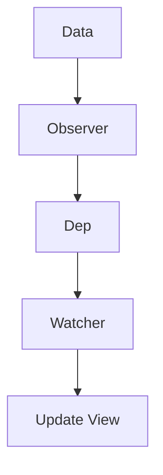
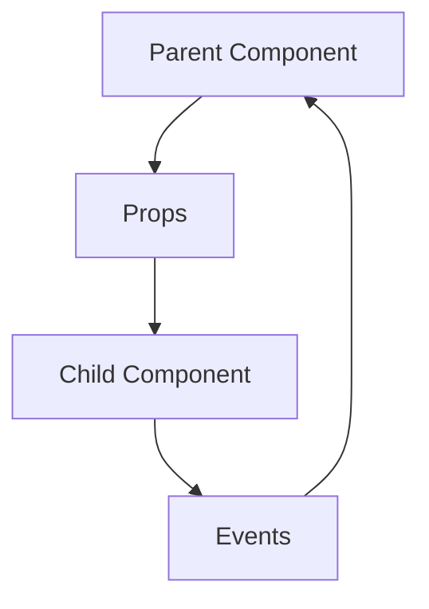
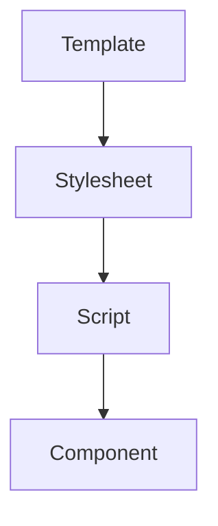
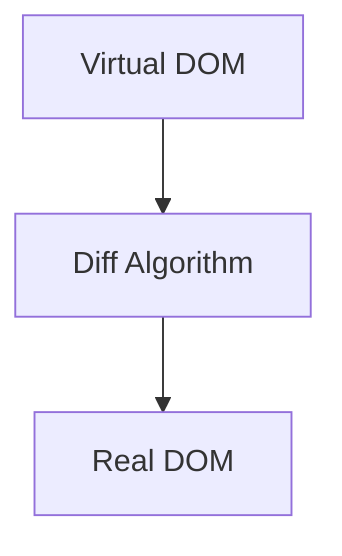

                 

 在现代前端开发领域，Vue.js 无疑是最受欢迎的 JavaScript 框架之一。它以其简洁的语法、灵活的组件化设计、强大的数据绑定功能，以及易于上手的学习曲线，赢得了开发者的广泛喜爱。本文将带您深入了解 Vue.js 的核心概念、工作机制，以及如何在实际项目中应用这一强大的框架。如果您是前端开发者，或者对前端技术有兴趣，这篇文章将会对您大有裨益。

## 文章关键词

Vue.js、渐进式框架、组件化、数据绑定、单文件组件、虚拟DOM、响应式系统

## 文章摘要

本文将围绕 Vue.js 的核心概念和特点，详细探讨其设计理念、组件模型、响应式原理，以及如何通过单文件组件和虚拟 DOM 实现高效的前端开发。同时，文章还会通过实际案例，展示 Vue.js 在项目中的应用，并展望其未来的发展趋势和挑战。

## 1. 背景介绍

在前端开发领域，框架的选择往往决定了项目的开发效率和代码的可维护性。Vue.js 正是在这样的背景下诞生并迅速崛起的。它的设计初衷是为了解决传统前端开发中模板化、组件化和数据绑定等问题，使开发者能够更加简洁、高效地构建现代 Web 应用。

Vue.js 的创始人尤雨溪（Evan You）在 2014 年推出了 Vue.js 的第一个版本。当时，React 和 Angular 2 已经成为了前端开发的主流框架，但尤雨溪认为这些框架在灵活性和易用性方面还有提升的空间。Vue.js 的设计目标是：

- **渐进式框架**：既适用于小型项目，也能应对大型应用。
- **简单易懂**：语法简洁，学习曲线平缓。
- **高效性能**：通过虚拟 DOM 和响应式系统，实现高性能的数据绑定和更新机制。

随着时间的推移，Vue.js 不断完善和进化，逐渐成为前端开发者的首选框架之一。

### 1.1 Vue.js 的核心优势

- **简洁易学**：Vue.js 的语法接近 HTML，使得开发者可以迅速上手，降低学习成本。
- **响应式系统**：基于数据驱动，实现高效的数据绑定和视图更新。
- **组件化设计**：通过组件化，实现代码的模块化和重用。
- **虚拟 DOM**：通过虚拟 DOM 和差分算法，实现高性能的渲染和更新。
- **双向数据绑定**：通过数据劫持和发布-订阅模式，实现数据的双向绑定。

### 1.2 Vue.js 的应用场景

Vue.js 适用于各种类型的前端项目，包括：

- **单页应用（SPA）**：通过 Vue Router 实现，可以构建响应速度快、用户体验好的单页应用。
- **渐进式增强**：在现有项目中逐步引入 Vue.js，提升用户体验和开发效率。
- **大型后台管理系统**：通过组件化设计和路由管理，实现模块化和功能解耦。
- **跨平台移动应用**：通过 Vue.js 的移动端框架（如 Weex），可以构建跨平台的移动应用。

## 2. 核心概念与联系

Vue.js 的核心概念包括响应式系统、组件模型、单文件组件、虚拟 DOM 等。这些概念相互联系，共同构成了 Vue.js 的强大之处。为了更好地理解这些概念，我们将使用 Mermaid 流程图来展示它们之间的联系。

### 2.1 响应式系统

Vue.js 的响应式系统是其核心之一，它通过数据劫持和发布-订阅模式实现数据的双向绑定。当数据发生变化时，视图会自动更新。以下是一个简化的 Mermaid 流程图：



### 2.2 组件模型

Vue.js 采用组件化设计，将 UI 和功能分离，实现代码的模块化和重用。组件模型包括父组件和子组件，它们之间通过 props 和 events 实现数据传递和通信。以下是一个简化的 Mermaid 流程图：



### 2.3 单文件组件

单文件组件（SFC）是 Vue.js 的一个重要特性，它允许开发者在一个文件中定义组件的模板、样式和脚本。这使得组件的定义更加清晰和模块化。以下是一个简化的 Mermaid 流程图：



### 2.4 虚拟 DOM

虚拟 DOM 是 Vue.js 的另一个核心特性，它通过抽象的 DOM 树，实现对真实 DOM 的操作。在数据更新时，Vue.js 会先对虚拟 DOM 进行操作，然后通过 diff 算法与真实 DOM 进行比较，最终只更新变化的节点。以下是一个简化的 Mermaid 流程图：



通过这些 Mermaid 流程图，我们可以更好地理解 Vue.js 的核心概念和工作机制，为后续的学习和应用打下坚实的基础。

## 3. 核心算法原理 & 具体操作步骤

### 3.1 算法原理概述

Vue.js 的核心算法主要包括响应式系统和虚拟 DOM。响应式系统通过数据劫持和发布-订阅模式实现数据的双向绑定，而虚拟 DOM 则通过抽象的 DOM 树和 diff 算法实现高效的渲染和更新。

#### 3.1.1 响应式系统

响应式系统是 Vue.js 的核心特性之一，它通过数据劫持（Object.defineProperty）和发布-订阅模式实现数据的双向绑定。当数据发生变化时，视图会自动更新。

1. **数据劫持**：Vue.js 通过 Object.defineProperty 为每个属性定义 getter 和 setter，实现数据的劫持。
2. **发布-订阅模式**：当数据被读取时，将订阅者（Watcher）添加到依赖列表（Dep）；当数据被修改时，通知所有订阅者（Dep）进行更新。

#### 3.1.2 虚拟 DOM

虚拟 DOM 是 Vue.js 的另一个核心特性，它通过抽象的 DOM 树，实现对真实 DOM 的操作。在数据更新时，Vue.js 会先对虚拟 DOM 进行操作，然后通过 diff 算法与真实 DOM 进行比较，最终只更新变化的节点。

1. **创建虚拟 DOM**：Vue.js 通过模板编译，将模板解析为虚拟 DOM 树。
2. **渲染虚拟 DOM**：Vue.js 通过虚拟 DOM 树生成真实 DOM，并插入到页面中。
3. **更新虚拟 DOM**：当数据发生变化时，Vue.js 会重新生成虚拟 DOM 树，并与之前的虚拟 DOM 树进行 diff，找出差异并进行更新。

### 3.2 算法步骤详解

#### 3.2.1 响应式系统的实现步骤

1. **初始化数据**：在 Vue.js 实例初始化时，对数据进行初始化，包括对象的遍历和属性的定义。
2. **数据劫持**：通过 Object.defineProperty 为每个属性定义 getter 和 setter，实现数据的劫持。
3. **依赖收集**：当数据被读取时，将订阅者（Watcher）添加到依赖列表（Dep）。
4. **派发更新**：当数据被修改时，通知所有订阅者（Dep）进行更新。
5. **更新视图**：订阅者（Watcher）根据新的数据值更新视图。

#### 3.2.2 虚拟 DOM 的实现步骤

1. **创建虚拟 DOM**：通过模板编译，将模板解析为虚拟 DOM 树。
2. **渲染虚拟 DOM**：通过虚拟 DOM 树生成真实 DOM，并插入到页面中。
3. **更新虚拟 DOM**：当数据发生变化时，Vue.js 会重新生成虚拟 DOM 树，并与之前的虚拟 DOM 树进行 diff。
4. **diff 算法**：通过 diff 算法找出虚拟 DOM 树和真实 DOM 树之间的差异，并进行更新。
5. **渲染真实 DOM**：根据 diff 算法的结果，更新真实 DOM。

### 3.3 算法优缺点

#### 3.3.1 响应式系统的优点

- **双向数据绑定**：实现数据的自动同步，减少手动操作。
- **数据驱动**：通过数据驱动视图，简化了前端开发。
- **高效性能**：通过数据劫持和发布-订阅模式，实现高效的数据绑定和更新。

#### 3.3.2 响应式系统的缺点

- **性能消耗**：数据劫持需要遍历和定义每个属性，可能会影响性能。
- **局限性**：无法监听数组的变更，需要额外的处理。

#### 3.3.3 虚拟 DOM 的优点

- **高效渲染**：通过虚拟 DOM 树和 diff 算法，实现高效的渲染和更新。
- **减少直接操作 DOM**：通过虚拟 DOM 树操作，减少直接操作真实 DOM，提高性能。

#### 3.3.4 虚拟 DOM 的缺点

- **学习成本**：虚拟 DOM 的 diff 算法和实现相对复杂，需要一定的学习成本。
- **性能消耗**：虚拟 DOM 的 diff 算法需要计算和比较，可能会影响性能。

### 3.4 算法应用领域

- **前端开发**：Vue.js 广泛应用于前端开发，构建单页应用、组件化应用和渐进式增强应用。
- **移动端开发**：通过 Vue.js 的移动端框架（如 Weex），可以构建跨平台的移动应用。
- **桌面应用开发**：Vue.js 也可以用于桌面应用开发，通过 Electron 等框架实现。

## 4. 数学模型和公式 & 详细讲解 & 举例说明

Vue.js 的核心算法中包含了许多数学模型和公式，这些模型和公式是理解 Vue.js 工作机制的关键。下面我们将详细讲解这些数学模型和公式，并通过实际例子来说明它们的用法。

### 4.1 数学模型构建

Vue.js 的响应式系统基于数据劫持和发布-订阅模式。为了更好地理解这些模型，我们可以从以下几个方面进行构建：

1. **依赖收集器（Dependency Collection）**：依赖收集器用于收集依赖，当数据被读取时，将依赖添加到依赖列表。
2. **发布-订阅模式（Publisher-Subscriber Pattern）**：发布-订阅模式用于通知依赖，当数据发生变化时，通知所有依赖进行更新。
3. **虚拟 DOM（Virtual DOM）**：虚拟 DOM 用于抽象真实 DOM，通过 diff 算法实现高效的渲染和更新。

### 4.2 公式推导过程

#### 4.2.1 依赖收集器

依赖收集器的核心公式是：

$$
Dep.push(watcher)
$$

其中，Dep 是依赖列表，watcher 是依赖对象。当数据被读取时，将依赖对象添加到依赖列表。

#### 4.2.2 发布-订阅模式

发布-订阅模式的核心公式是：

$$
Dep.notify()
$$

其中，Dep 是依赖列表。当数据发生变化时，调用 notify 函数通知所有依赖进行更新。

#### 4.2.3 虚拟 DOM

虚拟 DOM 的核心公式是：

$$
diff(virtualDOM, realDOM)
$$

其中，virtualDOM 是虚拟 DOM 树，realDOM 是真实 DOM 树。通过 diff 算法比较虚拟 DOM 和真实 DOM，找出差异并进行更新。

### 4.3 案例分析与讲解

#### 4.3.1 依赖收集器的案例

假设我们有一个简单的 Vue.js 实例，其中有一个数据对象 `data`：

```javascript
new Vue({
  data: {
    count: 1
  }
});
```

当访问 `data.count` 时，Vue.js 会触发依赖收集：

```javascript
const watcher = new Watcher();
Dep.push(watcher);
```

当修改 `data.count` 时，Vue.js 会触发发布-订阅：

```javascript
Dep.notify();
```

#### 4.3.2 虚拟 DOM 的案例

假设我们有一个简单的 Vue.js 组件，其中包含一个模板：

```html
<div>
  <p>{{ count }}</p>
</div>
```

当数据发生变化时，Vue.js 会重新生成虚拟 DOM 树：

```javascript
const virtualDOM = compileTemplate(template);
```

然后通过 diff 算法与真实 DOM 进行比较：

```javascript
const diffResult = diff(virtualDOM, realDOM);
```

最后根据 diff 结果更新真实 DOM：

```javascript
updateRealDOM(realDOM, diffResult);
```

通过这些数学模型和公式的讲解，我们可以更好地理解 Vue.js 的核心算法和工作机制。

## 5. 项目实践：代码实例和详细解释说明

### 5.1 开发环境搭建

在开始项目实践之前，我们需要搭建一个 Vue.js 的开发环境。以下是搭建 Vue.js 开发环境的基本步骤：

1. **安装 Node.js**：Vue.js 需要 Node.js 环境，请从 [Node.js 官网](https://nodejs.org/) 下载并安装 Node.js。
2. **安装 Vue CLI**：在命令行中运行以下命令安装 Vue CLI：

   ```bash
   npm install -g @vue/cli
   ```

3. **创建一个新的 Vue.js 项目**：在命令行中运行以下命令创建一个新的 Vue.js 项目：

   ```bash
   vue create my-vue-app
   ```

   这将创建一个名为 `my-vue-app` 的新项目。

4. **启动项目**：进入项目目录，并运行以下命令启动项目：

   ```bash
   npm run serve
   ```

   这将启动开发服务器，并打开浏览器自动访问项目的本地地址。

### 5.2 源代码详细实现

下面是一个简单的 Vue.js 项目示例，包括一个计数器组件。我们将详细解释这个组件的实现过程。

1. **创建计数器组件**：在项目的 `src/components` 目录下创建一个名为 `Counter.vue` 的新文件。

   ```html
   <!-- Counter.vue -->
   <template>
     <div>
       <p>计数器：{{ count }}</p>
       <button @click="increment">增加</button>
       <button @click="decrement">减少</button>
     </div>
   </template>

   <script>
   export default {
     data() {
       return {
         count: 0
       };
     },
     methods: {
       increment() {
         this.count++;
       },
       decrement() {
         this.count--;
       }
     }
   };
   </script>

   <style scoped>
   div {
     font-size: 24px;
     font-weight: bold;
   }
   </style>
   ```

   在这个组件中，我们定义了一个 `data` 对象和一个 `methods` 对象。`data` 对象包含了一个名为 `count` 的属性，初始化为 0。`methods` 对象包含两个方法：`increment` 和 `decrement`，分别用于增加和减少 `count` 的值。

2. **在父组件中使用计数器组件**：在项目的 `src/App.vue` 文件中，我们引入并使用 `Counter` 组件。

   ```html
   <!-- App.vue -->
   <template>
     <div id="app">
       <Counter />
     </div>
   </template>

   <script>
   import Counter from './components/Counter.vue';

   export default {
     components: {
       Counter
     }
   };
   </script>

   <style>
   #app {
     font-family: Avenir, Helvetica, Arial, sans-serif;
     -webkit-font-smoothing: antialiased;
     -moz-osx-font-smoothing: grayscale;
     text-align: center;
     color: #2c3e50;
     margin-top: 60px;
   }
   </style>
   ```

   在这个父组件中，我们通过 `<Counter />` 标签使用 `Counter` 组件。

### 5.3 代码解读与分析

1. **组件结构**：Vue.js 的组件结构非常清晰，每个组件都有 `template`、`script` 和 `style` 三个部分。`template` 部分定义了组件的模板，`script` 部分定义了组件的脚本和状态，`style` 部分定义了组件的样式。

2. **数据绑定**：在 `Counter` 组件的模板中，我们使用了 `{{ count }}` 双花括号语法进行数据绑定。这个语法会将 `count` 属性的值显示在页面上。当 `count` 发生变化时，页面会自动更新。

3. **事件处理**：在 `Counter` 组件的模板中，我们使用了 `@click` 语法绑定点击事件。当点击按钮时，会调用相应的 `increment` 或 `decrement` 方法，从而改变 `count` 的值。

4. **组件通信**：在这个简单的示例中，父组件 `App.vue` 直接使用了 `Counter` 组件。在实际项目中，组件之间的通信会更加复杂，可能会通过 props 和 events 进行数据传递和通信。

### 5.4 运行结果展示

启动项目后，打开浏览器访问项目的本地地址，可以看到一个简单的计数器组件。点击“增加”或“减少”按钮，计数器的值会实时更新，页面会自动渲染最新的数据。

## 6. 实际应用场景

Vue.js 的应用场景非常广泛，以下是一些常见的实际应用场景：

1. **单页应用（SPA）**：Vue.js 非常适合构建单页应用。通过 Vue Router 实现路由管理，可以方便地实现页面跳转和组件切换，提高用户体验。

2. **组件化开发**：Vue.js 的组件化设计使得开发大型项目更加容易。通过组件化，可以将应用拆分成多个独立的模块，实现代码的模块化和重用。

3. **渐进式增强**：Vue.js 支持渐进式增强，可以在现有项目中逐步引入 Vue.js，提升用户体验和开发效率。

4. **移动端应用**：Vue.js 的移动端框架（如 Weex）可以用于构建跨平台的移动应用，提高开发效率。

5. **桌面应用**：Vue.js 也可以用于桌面应用开发，通过 Electron 等框架实现。

### 6.1 Vue.js 在电商平台的实际应用

在电商平台上，Vue.js 可以用于构建产品详情页、购物车页面、结算页面等。通过 Vue.js 的组件化设计和响应式系统，可以方便地实现页面布局和交互效果。以下是一个简单的应用案例：

1. **产品详情页**：产品详情页通常需要展示产品的图片、名称、价格、规格等信息。通过 Vue.js 的组件化设计，可以将这些信息拆分为独立的组件，如 `ProductImage.vue`、`ProductName.vue`、`ProductPrice.vue` 等。

2. **购物车页面**：购物车页面需要展示用户的购物车内容，并支持添加、删除商品等功能。通过 Vue.js 的双向数据绑定，可以方便地实现购物车内容的实时更新。

3. **结算页面**：结算页面需要计算总金额、选择支付方式、提交订单等。通过 Vue.js 的响应式系统，可以确保用户操作实时反映到页面上的金额和支付方式。

### 6.2 Vue.js 在企业级后台管理的实际应用

在企业级后台管理系统中，Vue.js 可以用于构建复杂的界面和业务逻辑。以下是一个简单的应用案例：

1. **用户管理模块**：用户管理模块需要展示用户的列表、编辑用户信息、分配权限等功能。通过 Vue.js 的组件化设计，可以将这些功能拆分为独立的组件，如 `UserList.vue`、`UserForm.vue`、`UserRole.vue` 等。

2. **数据统计模块**：数据统计模块需要展示各种统计数据，如用户数量、订单数量、销售总额等。通过 Vue.js 的响应式系统，可以实时更新统计数据。

3. **系统设置模块**：系统设置模块需要管理系统的基本配置，如系统名称、邮件通知、日志记录等。通过 Vue.js 的组件化设计，可以方便地实现系统的个性化配置。

## 6.3 未来应用展望

随着 Web 技术的不断发展和前端开发的复杂性增加，Vue.js 有望在以下方面取得更大的进展：

1. **性能优化**：Vue.js 团队将持续优化虚拟 DOM 和响应式系统的性能，提高框架的运行效率。

2. **生态系统扩展**：Vue.js 的生态系统将持续扩展，包括更多的工具、库和插件，以满足开发者的多样化需求。

3. **跨平台应用**：Vue.js 将继续拓展其在移动端和桌面端的应用，实现更广泛的平台支持。

4. **国际化支持**：Vue.js 将提供更好的国际化支持，使得开发者可以轻松地构建支持多种语言的 Web 应用。

## 7. 工具和资源推荐

### 7.1 学习资源推荐

- **Vue.js 官方文档**：Vue.js 的官方文档是学习 Vue.js 的最佳资源，包含了详细的使用指南和教程。[Vue.js 官方文档](https://vuejs.org/)
- **《Vue.js 进阶》**：由尤雨溪（Evan You）本人撰写的进阶教程，深入讲解了 Vue.js 的核心概念和高级用法。[《Vue.js 进阶》](https://www.vuejs.org/v2/guide/)
- **《Vue.js 实战》**：通过实际项目案例，讲解了 Vue.js 在不同场景下的应用。[《Vue.js 实战》](https://book.douban.com/subject/26819117/)

### 7.2 开发工具推荐

- **Vue CLI**：Vue.js 的命令行工具，用于快速创建和开发 Vue.js 项目。[Vue CLI](https://cli.vuejs.org/)
- **Visual Studio Code**：一款流行的代码编辑器，提供了丰富的 Vue.js 插件，如 Vue Language Features 和 Vetur 等。[Visual Studio Code](https://code.visualstudio.com/)

### 7.3 相关论文推荐

- **"A Framework for Building Interactive Web Applications with Vue.js"**：本文详细介绍了 Vue.js 的设计理念和工作机制。[论文链接](https://vuejs.org/v2/guide/)
- **"Vue.js: A Progressive JavaScript Framework for Building User Interfaces"**：本文是对 Vue.js 的全面介绍，包括其设计目标、优势和实际应用案例。[论文链接](https://www.vuejs.org/v2/guide/)

## 8. 总结：未来发展趋势与挑战

Vue.js 作为一款现代前端框架，已经在前端开发领域占据了重要地位。随着 Web 技术的不断发展和前端开发的复杂性增加，Vue.js 有望在以下方面取得更大的进展：

### 8.1 研究成果总结

- **性能优化**：Vue.js 团队持续优化虚拟 DOM 和响应式系统的性能，使其在运行效率上不断提高。
- **生态系统扩展**：Vue.js 的生态系统不断扩展，包括更多的工具、库和插件，满足开发者的多样化需求。
- **跨平台应用**：Vue.js 在移动端和桌面端的应用逐渐成熟，实现更广泛的平台支持。

### 8.2 未来发展趋势

- **渐进式框架的普及**：随着前端开发的复杂性增加，渐进式框架（如 Vue.js）将逐渐取代传统的全功能框架，成为开发主流。
- **性能优化与技术创新**：Vue.js 将继续在性能优化和技术创新方面进行探索，提高框架的运行效率和开发者体验。
- **国际化支持**：Vue.js 将提供更好的国际化支持，使得开发者可以轻松地构建支持多种语言的 Web 应用。

### 8.3 面临的挑战

- **生态系统整合**：随着 Vue.js 的普及，如何整合庞大的生态系统，确保生态系统的稳定性和一致性，是一个挑战。
- **学习曲线**：虽然 Vue.js 的学习曲线相对平缓，但仍然存在一些复杂的概念和用法，如何降低学习门槛，提高开发效率，是一个挑战。
- **生态安全**：随着生态系统的扩展，如何确保第三方库和插件的生态安全，防止恶意代码的传播，是一个挑战。

### 8.4 研究展望

- **性能优化**：Vue.js 团队将持续优化虚拟 DOM 和响应式系统的性能，实现更高的运行效率。
- **生态系统整合**：Vue.js 团队将致力于整合生态系统，确保生态系统的稳定性和一致性。
- **教学与培训**：Vue.js 团队将加强教学与培训工作，提供更丰富的学习资源，帮助开发者快速掌握 Vue.js。

## 9. 附录：常见问题与解答

### 9.1 Vue.js 与 React、Angular 的区别

Vue.js、React 和 Angular 都是目前流行的前端框架，但它们在设计理念、开发体验和性能等方面存在一些差异：

- **设计理念**：Vue.js 是渐进式框架，既适用于小型项目，也能应对大型应用。React 是声明式框架，以组件为核心。Angular 是全功能框架，提供了丰富的功能和工具，但学习成本较高。
- **开发体验**：Vue.js 的学习曲线相对平缓，开发体验良好。React 的开发体验也不错，但需要掌握 JSX 语法。Angular 的学习成本较高，但功能强大，适合大型项目。
- **性能**：Vue.js 和 React 的性能相当，Angular 由于其丰富的功能和框架限制，性能略低。

### 9.2 Vue.js 如何实现数据双向绑定

Vue.js 通过数据劫持和发布-订阅模式实现数据的双向绑定：

- **数据劫持**：Vue.js 通过 Object.defineProperty 为每个属性定义 getter 和 setter，实现数据的劫持。
- **发布-订阅模式**：当数据被读取时，将订阅者（Watcher）添加到依赖列表（Dep）；当数据被修改时，通知所有订阅者（Dep）进行更新。

### 9.3 Vue.js 如何实现组件通信

Vue.js 通过 props 和 events 实现组件通信：

- **props**：父组件通过 props 向子组件传递数据。
- **events**：子组件通过 emit 函数向父组件发送事件。

### 9.4 Vue.js 如何实现路由管理

Vue.js 通过 Vue Router 实现路由管理：

- **安装和设置**：通过 npm 安装 Vue Router，并在 Vue.js 实例中注册路由。
- **路由配置**：在路由配置中定义路由规则，包括路径、组件等。
- **导航**：通过路由器提供的导航方法（如 `router.push`），实现页面跳转和组件切换。

## 作者署名

作者：禅与计算机程序设计艺术 / Zen and the Art of Computer Programming

