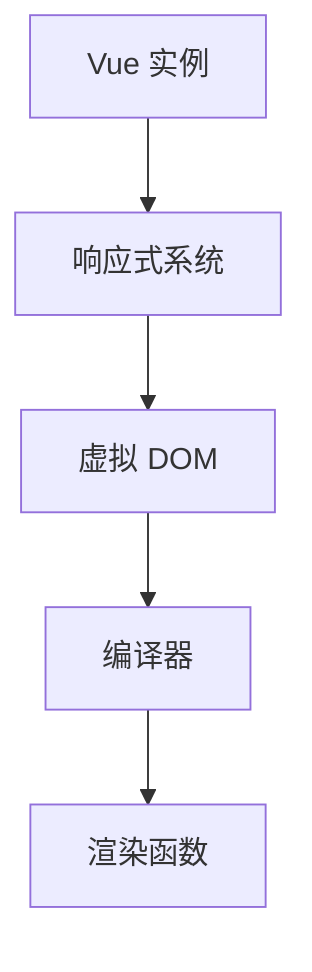
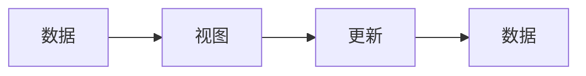

                 

关键词：Vue.js、JavaScript、前端开发、渐进式框架、组件化、响应式设计、单页面应用

> 摘要：Vue.js 是一种渐进式的前端框架，旨在简化开发流程，提高开发效率。本文将深入探讨 Vue.js 的核心概念、原理和实践，帮助读者全面掌握 Vue.js 的使用方法和应用场景，为前端开发提供实用的指导和启示。

## 1. 背景介绍

随着互联网技术的快速发展，前端开发的需求日益增加。为了提高开发效率，降低开发成本，前端框架应运而生。Vue.js 是由尤雨溪（Evan You）于 2014 年创建的一种渐进式 JavaScript 框架，旨在为开发者提供一种简单、易用、高效的前端开发解决方案。

Vue.js 的设计理念是“渐进式”，这意味着它既可以在项目中逐步引入，也可以作为完整的解决方案进行使用。Vue.js 专注于视图层，与 React 和 Angular 等其他前端框架相比，Vue.js 具有更好的性能和更简单的学习曲线。

Vue.js 的主要特点包括：

1. 组件化：Vue.js 采用组件化架构，使开发者可以方便地组织和管理代码。
2. 响应式设计：Vue.js 的响应式系统可以自动更新 DOM，减少手动操作，提高开发效率。
3. 单页面应用（SPA）：Vue.js 支持单页面应用，通过路由控制实现页面跳转，提高用户体验。
4. 跨平台：Vue.js 可以在 Web、移动端和桌面应用等多个平台进行开发。

## 2. 核心概念与联系

### 2.1 Vue.js 的核心概念

Vue.js 的核心概念主要包括以下几个方面：

1. **Vue 实例**：Vue.js 的核心是 Vue 实例，它是一个构造函数，用于创建 Vue 应用的入口点。通过 Vue 实例，开发者可以定义数据、方法和事件等。
   
   ```javascript
   const app = new Vue({
     el: '#app',
     data: {
       message: 'Hello Vue.js!'
     }
   });
   ```

2. **模板**：Vue.js 使用模板来描述界面，模板是由 HTML 和 Vue 指令组成的。模板可以定义数据绑定、事件处理等。

   ```html
   <div id="app">
     {{ message }}
   </div>
   ```

3. **指令**：Vue.js 提供了一系列指令，如 `v-bind`、`v-model`、`v-for` 等，用于在模板中实现数据绑定、事件处理等功能。

4. **组件**：组件是 Vue.js 的核心组成部分，它是一种可复用的 Vue 实例，用于封装和共享代码。

   ```javascript
   Vue.component('my-component', {
     template: '<div>这是一个组件</div>'
   });
   ```

### 2.2 Vue.js 的架构

Vue.js 的架构主要包括以下几个方面：

1. **响应式系统**：Vue.js 的响应式系统是框架的核心，它通过 Object.defineProperty 等技术实现数据的响应式。
   
   ```javascript
   const observer = new Observer(data);
   ```

2. **虚拟 DOM**：Vue.js 使用虚拟 DOM 来提升渲染性能，虚拟 DOM 是一个轻量级的 JavaScript 对象，用于描述实际的 DOM 结构。
   
   ```javascript
   const vdom = createElement('div', { id: 'app' }, [
     createTextVNode('Hello Vue.js!')
   ]);
   ```

3. **编译器**：Vue.js 的编译器用于将模板编译成渲染函数，渲染函数用于生成虚拟 DOM。
   
   ```javascript
   const compiler = new Compiler(template);
   ```

### 2.3 Mermaid 流程图

下面是 Vue.js 架构的 Mermaid 流程图：



## 3. 核心算法原理 & 具体操作步骤

### 3.1 算法原理概述

Vue.js 的核心算法包括响应式系统和虚拟 DOM。响应式系统通过 Object.defineProperty 等技术实现对数据的监听和更新。虚拟 DOM 则用于提升渲染性能，通过比较虚拟 DOM 和真实 DOM 的差异，只更新变化的部分。

### 3.2 算法步骤详解

1. **响应式系统的实现**：

   ```javascript
   function defineReactive(data, key, value) {
     observer(value);
     Object.defineProperty(data, key, {
       get() {
         return value;
       },
       set(newValue) {
         if (newValue !== value) {
           observer(newValue);
           value = newValue;
         }
       }
     });
   }
   
   function observer(data) {
     if (Array.isArray(data)) {
       data.forEach(observer);
     } else if (typeof data === 'object') {
       for (let key in data) {
         defineReactive(data, key, data[key]);
       }
     }
   }
   ```

2. **虚拟 DOM 的实现**：

   ```javascript
   function createElement(tag, props, children) {
     return {
       tag,
       props,
       children
     };
   }
   
   function updateDOM(vdom, dom) {
     if (vdom.tag !== dom.tagName) {
       dom.replaceWith(document.createElement(vdom.tag));
       return;
     }
     
     if (vdom.props) {
       for (let key in vdom.props) {
         if (key.startsWith('on')) {
           dom.addEventListener(key.substring(2).toLowerCase(), vdom.props[key]);
         } else {
           dom.setAttribute(key, vdom.props[key]);
         }
       }
     }
     
     if (vdom.children) {
       for (let child of vdom.children) {
         if (typeof child === 'string') {
           dom.textContent = child;
         } else {
           let childDom = document.createElement(child.tag);
           updateDOM(child, childDom);
           dom.appendChild(childDom);
         }
       }
     }
   }
   ```

### 3.3 算法优缺点

**优点**：

1. 响应式系统：通过监听数据的变动，可以自动更新视图，减少手动操作，提高开发效率。
2. 虚拟 DOM：通过比较虚拟 DOM 和真实 DOM 的差异，只更新变化的部分，提高渲染性能。

**缺点**：

1. 响应式系统：在复杂的数据结构中，可能会出现性能问题。
2. 虚拟 DOM：虽然提高了渲染性能，但增加了开发者的负担，需要编写更多的代码。

### 3.4 算法应用领域

Vue.js 的核心算法主要应用于前端开发，可以用于开发单页面应用、组件化应用等。同时，Vue.js 的响应式系统和虚拟 DOM 技术也可以应用于其他领域，如桌面应用、移动应用等。

## 4. 数学模型和公式 & 详细讲解 & 举例说明

### 4.1 数学模型构建

Vue.js 的响应式系统可以看作是一个数学模型，其核心是一个双向数据绑定。我们可以将其表示为一个图：



### 4.2 公式推导过程

在 Vue.js 的响应式系统中，数据的变化会引起视图的更新，视图的更新又会引起数据的重新计算。我们可以使用以下公式来描述这一过程：

$$
更新过程 = 数据变化 \times 视图更新 \times 数据重新计算
$$

### 4.3 案例分析与讲解

假设有一个简单的 Vue.js 应用，其中有一个数据变量 `message`，模板中有一个文本节点 `{{ message }}`。当 `message` 的值发生变化时，文本节点的内容也会相应地更新。

```html
<div id="app">
  {{ message }}
</div>
```

```javascript
const app = new Vue({
  el: '#app',
  data: {
    message: 'Hello Vue.js!'
  }
});
```

在这个例子中，当 `message` 的值从 'Hello Vue.js!' 改为 'Hello World!' 时，文本节点的内容也会相应地更新为 'Hello World!'。

```javascript
app.message = 'Hello World!';
```

## 5. 项目实践：代码实例和详细解释说明

### 5.1 开发环境搭建

要使用 Vue.js 进行开发，需要首先搭建一个开发环境。以下是具体的步骤：

1. 安装 Node.js：Vue.js 需要 Node.js 环境，可以通过 [Node.js 官网](https://nodejs.org/) 安装 Node.js。
2. 安装 Vue CLI：Vue CLI 是 Vue.js 的官方命令行工具，用于快速创建 Vue 项目。可以通过以下命令安装：

   ```bash
   npm install -g @vue/cli
   ```

3. 创建 Vue 项目：使用 Vue CLI 创建一个新项目，可以选择默认配置或自定义配置。以下是一个创建 Vue 项目的示例：

   ```bash
   vue create my-vue-project
   ```

### 5.2 源代码详细实现

以下是一个简单的 Vue.js 应用，用于展示一个计数器：

```html
<!DOCTYPE html>
<html lang="en">
<head>
  <meta charset="UTF-8">
  <title>Vue.js 计数器</title>
</head>
<body>
  <div id="app">
    <h1>当前计数：{{ count }}</h1>
    <button @click="increment">增加</button>
    <button @click="decrement">减少</button>
  </div>

  <script src="https://cdn.jsdelivr.net/npm/vue@2.6.14/dist/vue.js"></script>
  <script>
    const app = new Vue({
      el: '#app',
      data: {
        count: 0
      },
      methods: {
        increment() {
          this.count++;
        },
        decrement() {
          this.count--;
        }
      }
    });
  </script>
</body>
</html>
```

### 5.3 代码解读与分析

1. **HTML 模板**：

   ```html
   <div id="app">
     <h1>当前计数：{{ count }}</h1>
     <button @click="increment">增加</button>
     <button @click="decrement">减少</button>
   </div>
   ```

   在 HTML 模板中，我们定义了一个简单的计数器界面，包括一个文本节点 `{{ count }}` 和两个按钮。

2. **Vue 实例**：

   ```javascript
   const app = new Vue({
     el: '#app',
     data: {
       count: 0
     },
     methods: {
       increment() {
         this.count++;
       },
       decrement() {
         this.count--;
       }
     }
   });
   ```

   在 Vue 实例中，我们定义了一个数据变量 `count` 和两个方法 `increment` 和 `decrement`。当点击按钮时，会触发对应的方法，从而改变 `count` 的值，进而更新视图。

### 5.4 运行结果展示

当运行上述代码时，可以看到一个简单的计数器界面。点击“增加”按钮时，计数器的值会增加 1；点击“减少”按钮时，计数器的值会减少 1。


## 6. 实际应用场景

Vue.js 可以应用于各种实际场景，以下是几个常见的应用场景：

1. **单页面应用（SPA）**：Vue.js 是单页面应用的首选框架，通过路由控制实现页面跳转，提高用户体验。
   
2. **组件化应用**：Vue.js 支持组件化开发，可以将 UI 界面拆分为多个组件，提高代码的可复用性和可维护性。

3. **移动应用**：Vue.js 可以用于开发移动应用，通过微信小程序等平台，实现跨平台开发。

4. **桌面应用**：Vue.js 结合 Electron 等框架，可以用于开发桌面应用。

5. **后台管理系统**：Vue.js 也可以用于开发后台管理系统，通过 UI 组件库和 UI 框架，实现高效的后台开发。

## 7. 工具和资源推荐

### 7.1 学习资源推荐

1. **Vue.js 官网**：Vue.js 的官方文档，包含详细的教程和 API 文档，是学习 Vue.js 的最佳资源。
   
   地址：[Vue.js 官网](https://vuejs.org/)

2. **Vue.js 进阶教程**：由 Vue.js 社区成员编写的进阶教程，包括 Vue.js 的原理、性能优化等，适合有基础的开发者。

   地址：[Vue.js 进阶教程](https://vue-advance-guide.notion.site/Vue-js-Advance-Guide-38a3e865c7234d4ca2e44d2346e3f4b5)

### 7.2 开发工具推荐

1. **Vue CLI**：Vue.js 的官方命令行工具，用于快速创建 Vue 项目。
   
   地址：[Vue CLI 官网](https://cli.vuejs.org/)

2. **VSCode**：Vue.js 的最佳开发环境，支持 Vue.js 的语法高亮、智能提示等功能。

   地址：[VSCode 官网](https://code.visualstudio.com/)

### 7.3 相关论文推荐

1. **Vue.js 的响应式原理**：介绍了 Vue.js 的响应式系统的原理和实现。
   
   地址：[Vue.js 的响应式原理](https://vuejs.org/v2/guide/reactivity.html)

2. **Vue.js 的虚拟 DOM**：介绍了 Vue.js 的虚拟 DOM 的原理和实现。
   
   地址：[Vue.js 的虚拟 DOM](https://vuejs.org/v2/guide/render-function.html)

## 8. 总结：未来发展趋势与挑战

### 8.1 研究成果总结

Vue.js 作为一种渐进式前端框架，已经得到了广泛的应用和认可。其核心算法在性能和易用性方面取得了显著成果，为前端开发提供了高效的解决方案。

### 8.2 未来发展趋势

1. **性能优化**：Vue.js 将继续优化响应式系统和虚拟 DOM，提高框架的性能。
2. **生态建设**：Vue.js 将进一步丰富生态，包括组件库、UI 框架、开发工具等。
3. **跨平台开发**：Vue.js 将拓展跨平台开发能力，支持更多平台的应用。

### 8.3 面临的挑战

1. **框架升级**：随着前端技术的发展，Vue.js 需要不断升级，以适应新的需求和技术。
2. **社区建设**：Vue.js 需要进一步加强社区建设，提高开发者的参与度和贡献度。

### 8.4 研究展望

Vue.js 在前端开发领域具有广阔的应用前景。未来，Vue.js 将继续发挥其优势，为开发者提供更高效、更便捷的开发体验。同时，Vue.js 也将与其他前端技术相结合，推动前端开发的发展。

## 9. 附录：常见问题与解答

### 9.1 Vue.js 是什么？

Vue.js 是一种渐进式的前端框架，用于简化前端开发流程，提高开发效率。

### 9.2 Vue.js 的核心概念有哪些？

Vue.js 的核心概念包括 Vue 实例、模板、指令和组件。

### 9.3 Vue.js 的架构是怎样的？

Vue.js 的架构包括响应式系统、虚拟 DOM 和编译器。

### 9.4 Vue.js 的响应式系统如何实现？

Vue.js 的响应式系统通过 Object.defineProperty 等技术实现对数据的监听和更新。

### 9.5 Vue.js 的虚拟 DOM 如何实现？

Vue.js 的虚拟 DOM 通过创建虚拟 DOM 对象，并比较虚拟 DOM 和真实 DOM 的差异，只更新变化的部分。

### 9.6 Vue.js 有哪些应用场景？

Vue.js 可以应用于单页面应用、组件化应用、移动应用、桌面应用和后台管理系统等。

### 9.7 Vue.js 的未来发展趋势是怎样的？

Vue.js 将继续优化性能、丰富生态、拓展跨平台开发能力。

---

作者：禅与计算机程序设计艺术 / Zen and the Art of Computer Programming
----------------------------------------------------------------
这篇文章深入探讨了 Vue.js 的核心概念、原理和实践，为前端开发者提供了全面的指导和启示。Vue.js 作为一种渐进式的前端框架，具有简单、易用、高效的特点，已在前端开发领域取得了显著成果。未来，Vue.js 将继续发挥其优势，推动前端开发的发展。希望读者能通过这篇文章，全面掌握 Vue.js 的使用方法和应用场景，为前端开发事业贡献力量。

