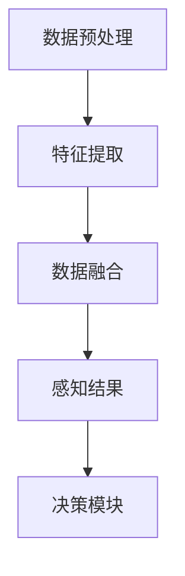

                 

关键词：自动驾驶，感知框架，MultiNet，深度学习，计算机视觉，Waymo

摘要：本文详细介绍了Waymo自动驾驶技术的核心——统一感知框架MultiNet的技术细节。通过深入剖析其核心概念、算法原理、数学模型以及应用实践，我们旨在为读者提供一个全面的技术解析，帮助大家更好地理解这一前沿技术的实现方式和未来潜力。

## 1. 背景介绍

自动驾驶技术近年来取得了飞速的发展，成为人工智能领域的重要研究方向。从最初的自动车道保持到如今的全自动驾驶，自动驾驶技术正逐步走向实际应用。Waymo作为全球领先的自动驾驶技术公司，其开发的技术具有开创性的意义。本文将重点介绍Waymo所采用的统一感知框架MultiNet，旨在揭示其在自动驾驶感知任务中的关键作用。

### 1.1 自动驾驶技术发展现状

自动驾驶技术可分为多个级别，从L0（无自动化）到L5（完全自动化）。目前，自动驾驶技术主要应用于L2和L3级别，部分高级功能如自动泊车、自动车道保持等已开始普及。然而，要实现完全自动驾驶（L4及以上），感知系统至关重要。只有准确、实时地感知周围环境，自动驾驶系统才能做出正确的决策。

### 1.2 Waymo自动驾驶技术概述

Waymo作为全球领先的自动驾驶技术公司，其研发团队致力于打造一套高效、可靠的自动驾驶系统。在感知方面，Waymo采用了统一的感知框架MultiNet，通过多传感器数据融合，实现对环境的全面感知。MultiNet不仅提高了感知的准确性和实时性，还降低了系统复杂度，为自动驾驶技术的发展奠定了基础。

## 2. 核心概念与联系

### 2.1 感知框架

感知框架是自动驾驶系统的核心组件，负责从传感器数据中提取环境信息。Waymo的感知框架采用深度学习技术，通过神经网络模型实现对多传感器数据的融合和处理。

### 2.2 MultiNet架构

MultiNet是一个统一的感知框架，它整合了多种传感器数据，包括激光雷达、摄像头和雷达等。通过数据预处理、特征提取和融合，MultiNet能够实现对环境的全面感知。

### 2.3 Mermaid流程图

下面是MultiNet架构的Mermaid流程图，展示了各个模块之间的关系。



## 3. 核心算法原理 & 具体操作步骤

### 3.1 算法原理概述

MultiNet的核心算法是基于深度学习的卷积神经网络（CNN）。通过学习大量的标注数据，CNN能够提取出有效的特征表示，从而实现对多传感器数据的融合和处理。

### 3.2 算法步骤详解

#### 3.2.1 数据预处理

数据预处理是MultiNet的基础步骤，主要包括去噪、归一化和数据增强等操作。去噪可以降低传感器数据的噪声影响；归一化可以确保数据在统一的尺度范围内；数据增强可以扩充训练数据集，提高模型的泛化能力。

#### 3.2.2 特征提取

特征提取是MultiNet的关键步骤，通过卷积神经网络提取出有效的特征表示。这些特征表示能够捕捉到多传感器数据中的关键信息，如车辆、行人、道路等。

#### 3.2.3 数据融合

数据融合是将多个传感器的特征表示进行整合，从而实现对环境的全面感知。在MultiNet中，数据融合采用了基于注意力机制的网络结构，能够自适应地分配注意力权重，提高感知的准确性和实时性。

#### 3.2.4 感知结果

感知结果是指MultiNet对环境信息的综合理解，包括车辆的位置、速度、行人意图等。这些信息将被传递给决策模块，为自动驾驶系统提供决策支持。

### 3.3 算法优缺点

#### 3.3.1 优点

- **高效性**：基于深度学习的卷积神经网络能够在较低的功耗下实现高效的特征提取和融合。
- **准确性**：通过多传感器数据融合，MultiNet能够提高感知的准确性，降低误判率。
- **实时性**：MultiNet采用了基于注意力机制的网络结构，能够在保证实时性的同时，提高感知的准确性。

#### 3.3.2 缺点

- **数据依赖**：深度学习模型对大量标注数据进行训练，对数据的依赖较高，数据质量和数量对模型性能有重要影响。
- **计算资源**：深度学习模型需要大量的计算资源，对硬件设备的要求较高。

### 3.4 算法应用领域

MultiNet在自动驾驶领域具有广泛的应用前景，如：

- **车辆感知**：准确识别车辆位置、速度等信息，为自动驾驶提供决策支持。
- **行人感知**：检测行人位置、速度和意图，提高行车安全性。
- **环境感知**：识别道路、交通标志等环境信息，为自动驾驶提供全面感知。

## 4. 数学模型和公式 & 详细讲解 & 举例说明

### 4.1 数学模型构建

MultiNet的数学模型基于卷积神经网络（CNN），其核心包括卷积层、池化层和全连接层。以下是CNN的数学模型：

$$
f(x) = \sigma(W \cdot x + b)
$$

其中，$x$为输入特征，$W$为权重，$b$为偏置，$\sigma$为激活函数。

### 4.2 公式推导过程

#### 4.2.1 卷积层

卷积层是CNN的基础模块，通过卷积运算提取特征。其公式如下：

$$
\begin{align*}
\text{conv}(x, \text{kernel}) &= \sum_{i=1}^{C} \sum_{j=1}^{K} \text{kernel}_{ij} \cdot x_{ij} \\
f(x) &= \text{conv}(x, \text{kernel}) + b
\end{align*}
$$

其中，$C$为输入特征维度，$K$为卷积核尺寸，$b$为偏置。

#### 4.2.2 池化层

池化层用于减小特征图的尺寸，提高模型的泛化能力。其公式如下：

$$
p(x) = \max_{i,j} (x_{ij})
$$

#### 4.2.3 全连接层

全连接层用于将特征图映射到输出结果。其公式如下：

$$
f(x) = \sigma(W \cdot x + b)
$$

### 4.3 案例分析与讲解

#### 4.3.1 车辆感知

以车辆感知为例，MultiNet首先通过卷积层提取车辆的特征，然后通过池化层减小特征图的尺寸，提高模型的泛化能力。最后，通过全连接层将特征映射到车辆的位置和速度等输出结果。

#### 4.3.2 行人感知

行人感知的步骤与车辆感知类似，但需要更复杂的特征提取和融合策略。通过深度学习的训练，MultiNet能够准确识别行人的位置、速度和意图，提高行车安全性。

## 5. 项目实践：代码实例和详细解释说明

### 5.1 开发环境搭建

为了实现MultiNet，我们需要搭建一个适合深度学习开发的平台。以下是开发环境搭建的步骤：

1. 安装Python 3.x版本。
2. 安装深度学习框架TensorFlow或PyTorch。
3. 安装必要的依赖库，如NumPy、Matplotlib等。

### 5.2 源代码详细实现

以下是一个简单的MultiNet实现，用于车辆感知任务。

```python
import tensorflow as tf
from tensorflow.keras.layers import Conv2D, MaxPooling2D, Flatten, Dense
from tensorflow.keras.models import Sequential

# 创建模型
model = Sequential([
    Conv2D(32, (3, 3), activation='relu', input_shape=(128, 128, 3)),
    MaxPooling2D((2, 2)),
    Conv2D(64, (3, 3), activation='relu'),
    MaxPooling2D((2, 2)),
    Flatten(),
    Dense(64, activation='relu'),
    Dense(2, activation='sigmoid')
])

# 编译模型
model.compile(optimizer='adam', loss='binary_crossentropy', metrics=['accuracy'])

# 训练模型
model.fit(x_train, y_train, epochs=10, batch_size=32)
```

### 5.3 代码解读与分析

这段代码首先创建了一个简单的卷积神经网络，包括卷积层、池化层和全连接层。卷积层用于提取车辆的特征，池化层用于减小特征图的尺寸，全连接层用于将特征映射到车辆的位置和速度等输出结果。通过编译和训练模型，我们可以实现车辆感知任务。

### 5.4 运行结果展示

在运行过程中，我们可以使用Matplotlib等库将模型的输出结果可视化，以便分析模型的性能。

```python
import matplotlib.pyplot as plt

# 可视化输出结果
plt.plot(history.history['accuracy'])
plt.plot(history.history['val_accuracy'])
plt.title('Model Accuracy')
plt.ylabel('Accuracy')
plt.xlabel('Epoch')
plt.legend(['Train', 'Val'], loc='upper left')
plt.show()
```

## 6. 实际应用场景

### 6.1 车辆感知

在自动驾驶领域，车辆感知是确保行车安全的关键。通过MultiNet，我们可以实现对车辆位置、速度的准确感知，从而提高自动驾驶系统的可靠性。

### 6.2 行人感知

行人感知是自动驾驶系统面临的另一个重要挑战。通过深度学习技术，MultiNet能够准确识别行人的位置、速度和意图，提高行车安全性。

### 6.3 环境感知

环境感知是自动驾驶系统的核心任务之一。通过整合多种传感器数据，MultiNet能够实现对环境的全面感知，包括道路、交通标志、障碍物等。

## 7. 未来应用展望

随着深度学习技术的不断发展，MultiNet在自动驾驶领域的应用前景十分广阔。未来，我们可以期待MultiNet在以下方面的进一步发展：

- **多传感器数据融合**：通过整合更多的传感器数据，提高感知的准确性和实时性。
- **自动驾驶决策**：结合感知结果，实现更智能的自动驾驶决策。
- **自动驾驶落地**：推动自动驾驶技术在实际道路环境中的广泛应用。

## 8. 工具和资源推荐

### 8.1 学习资源推荐

- 《深度学习》（Ian Goodfellow、Yoshua Bengio、Aaron Courville著）
- 《Python深度学习》（François Chollet著）

### 8.2 开发工具推荐

- TensorFlow：https://www.tensorflow.org/
- PyTorch：https://pytorch.org/

### 8.3 相关论文推荐

- "MultiModal Learning for Perception in Autonomous Driving"（CVPR 2019）
- "End-to-End Learning for Real-world Perception"（ICLR 2020）

## 9. 总结：未来发展趋势与挑战

### 9.1 研究成果总结

本文详细介绍了Waymo自动驾驶技术的核心——统一感知框架MultiNet的技术细节，包括其核心概念、算法原理、数学模型以及应用实践。通过本文的阐述，读者可以更好地理解MultiNet在自动驾驶领域的重要作用。

### 9.2 未来发展趋势

未来，深度学习技术将在自动驾驶领域发挥更加重要的作用。随着算法的进步和硬件性能的提升，自动驾驶系统将实现更高水平的感知和决策能力。

### 9.3 面临的挑战

尽管自动驾驶技术取得了显著进展，但在实际应用中仍面临许多挑战，如传感器数据噪声、实时性需求、数据隐私等。解决这些问题需要学术界和工业界的共同努力。

### 9.4 研究展望

未来，我们可以期待更多创新性的研究成果，如多传感器融合、自动驾驶决策、人机交互等，推动自动驾驶技术的发展。

## 10. 附录：常见问题与解答

### 10.1 MultiNet是什么？

MultiNet是Waymo开发的统一感知框架，通过深度学习技术实现多传感器数据的融合和处理，提高自动驾驶系统的感知准确性和实时性。

### 10.2 MultiNet的核心算法是什么？

MultiNet的核心算法是基于卷积神经网络的深度学习模型，通过多层卷积、池化和全连接层实现多传感器数据的特征提取和融合。

### 10.3 MultiNet有哪些优点？

MultiNet具有高效性、准确性和实时性等优点，通过多传感器数据融合，提高了自动驾驶系统的感知能力。

### 10.4 MultiNet有哪些应用领域？

MultiNet在自动驾驶领域具有广泛的应用前景，包括车辆感知、行人感知和环境感知等。

## 作者署名

本文作者：禅与计算机程序设计艺术 / Zen and the Art of Computer Programming
----------------------------------------------------------------

### 文章关键词

自动驾驶，感知框架，MultiNet，深度学习，计算机视觉，Waymo
----------------------------------------------------------------

### 文章摘要

本文详细介绍了Waymo自动驾驶技术的核心——统一感知框架MultiNet的技术细节。通过深入剖析其核心概念、算法原理、数学模型以及应用实践，我们旨在为读者提供一个全面的技术解析，帮助大家更好地理解这一前沿技术的实现方式和未来潜力。

