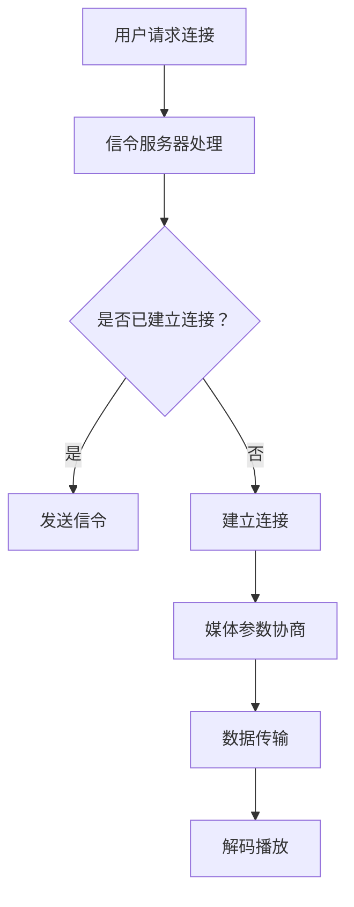

                 

WebRTC（Web Real-Time Communication）是一种支持浏览器进行实时音视频通信的开放协议。随着远程工作的普及和在线教育、电子商务等领域的兴起，WebRTC音视频会议系统成为企业和个人必备的工具。本文将详细介绍WebRTC音视频会议系统的开发过程，包括核心概念、算法原理、数学模型、项目实践以及未来应用展望等。

## 文章关键词
- WebRTC
- 音视频会议系统
- 实时通信
- 协议栈
- 编码解码
- 数学模型

## 文章摘要
本文旨在为开发者提供一份全面且深入的WebRTC音视频会议系统开发指南。文章首先介绍了WebRTC的基本概念和原理，随后讲解了音视频会议系统中的核心算法和数学模型。接着，通过一个具体的开发实例，详细展示了系统搭建、代码实现和运行结果。最后，文章探讨了WebRTC音视频会议系统的实际应用场景和未来发展趋势，为开发者提供了宝贵的参考。

## 1. 背景介绍

随着互联网技术的飞速发展，实时通信已成为人们生活和工作中不可或缺的一部分。传统的通信方式如电子邮件、即时消息等，虽然方便快捷，但在处理音视频数据时存在延迟、画质差等问题。WebRTC的出现，为解决这些问题提供了新的思路。WebRTC是一种支持浏览器进行实时音视频通信的开放协议，它由Google提出并开源，目前已成为Web标准的一部分。

WebRTC音视频会议系统具有以下特点：
- 实时性：WebRTC采用UDP协议，传输速度较快，能够实现真正的实时通信。
- 兼容性：WebRTC支持多种浏览器和平台，包括Chrome、Firefox、Safari和Edge等。
- 安全性：WebRTC采用了SRTP（Secure Real-time Transport Protocol）加密协议，确保通信数据的安全性。

WebRTC音视频会议系统的应用场景非常广泛，包括远程教育、视频会议、在线医疗、在线娱乐等。开发一个高效、稳定的WebRTC音视频会议系统，不仅需要掌握WebRTC的核心技术，还需要对音视频编解码、网络传输、安全性等方面有深入的理解。

### WebRTC音视频会议系统的核心组件

WebRTC音视频会议系统由多个核心组件构成，这些组件相互协作，共同实现系统的功能。以下是WebRTC音视频会议系统的核心组件及其简要介绍：

1. **信令服务器**：信令服务器负责传输客户端之间的信令消息，如建立连接、传输媒体信息等。常用的信令协议包括WebSockets、HTTP/2、信令中继服务器等。

2. **媒体服务器**：媒体服务器负责处理音视频数据，包括采集、编码、解码、传输等。常见的媒体服务器有JitsiMeet、Kurento等。

3. **客户端**：客户端是用户与WebRTC音视频会议系统交互的入口，负责音视频采集、编码、解码、播放等功能。客户端通常使用WebRTC SDK（如WebRTC.org SDK、WebRTC.js等）进行开发。

4. **编解码器**：编解码器是实现音视频数据压缩和解压的核心组件。常见的编解码器有H.264、VP8、Opus等。

5. **网络传输层**：网络传输层负责将音视频数据在网络中进行传输，包括UDP、TCP等协议。WebRTC采用UDP协议进行传输，以实现低延迟、高效率的通信。

### WebRTC音视频会议系统的架构设计

WebRTC音视频会议系统的架构设计需要考虑多个方面，包括系统性能、可扩展性、安全性等。以下是一个典型的WebRTC音视频会议系统架构设计：


**1. 客户端架构**

客户端架构通常包括以下模块：
- 音视频采集模块：负责从摄像头、麦克风等设备中采集音视频数据。
- 编码解码模块：负责对采集到的音视频数据进行编码和解码。
- 网络传输模块：负责将编码后的音视频数据通过网络发送到服务器。
- 接收处理模块：负责从服务器接收音视频数据，并进行解码和播放。

**2. 服务器端架构**

服务器端架构通常包括以下模块：
- 信令服务器：负责处理客户端之间的信令消息。
- 媒体服务器：负责处理音视频数据，包括采集、编码、解码、传输等。
- 数据存储模块：负责存储会议记录、用户信息等数据。

**3. 安全性设计**

WebRTC音视频会议系统的安全性设计非常重要，包括以下几个方面：
- 数据加密：采用SRTP协议对音视频数据进行加密，确保通信数据的安全性。
- 身份认证：通过身份认证机制确保用户身份的合法性。
- 安全通道：使用HTTPS、WebSockets等协议建立安全的通信通道。

## 2. 核心概念与联系

在开发WebRTC音视频会议系统时，我们需要理解一些核心概念和它们之间的联系。以下是WebRTC音视频会议系统中的核心概念及其相互关系。

### 2.1 WebRTC协议栈

WebRTC协议栈是WebRTC实现的核心，它包括多个层次，从下至上分别是：

1. **传输层**：主要采用UDP协议进行数据传输，以实现低延迟和高效率的通信。同时，也支持TCP协议作为备选。

2. **网络层**：负责处理IP地址和端口的分配，以及数据包的路由和转发。

3. **信令层**：负责客户端和服务器之间的信令传输，包括连接建立、媒体参数协商等。

4. **应用层**：包括音视频编解码、信令传输等，负责实现实际的通信功能。

### 2.2 音视频编解码

音视频编解码是WebRTC音视频会议系统的核心组成部分。常见的编解码器包括H.264、VP8、Opus等。编解码器负责将采集到的原始音视频数据转换成适合网络传输的格式，同时，在接收端将网络传输的数据重新转换为原始音视频数据。

### 2.3 网络传输

WebRTC的网络传输主要采用UDP协议，这是因为UDP协议的传输速度快，适合实时通信。同时，WebRTC还引入了NAT穿透技术和ICE（Interactive Connectivity Establishment）协议，以解决NAT（网络地址转换）和防火墙等问题，确保通信的顺畅进行。

### 2.4 信令传输

信令传输是WebRTC音视频会议系统中非常重要的一环。信令传输主要负责客户端和服务器之间的连接建立、参数协商等。常用的信令协议包括WebSockets、HTTP/2等。

### 2.5 安全性

WebRTC的安全性主要通过SRTP（Secure Real-time Transport Protocol）协议实现。SRTP协议对音视频数据进行加密，确保数据在传输过程中的安全性。

### 2.6 Mermaid流程图

以下是一个简单的Mermaid流程图，展示了WebRTC音视频会议系统中的核心流程：



## 3. 核心算法原理 & 具体操作步骤

### 3.1 算法原理概述

WebRTC音视频会议系统中的核心算法主要包括音视频编解码算法、网络传输算法和信令传输算法。以下是这些算法的简要概述：

1. **音视频编解码算法**：音视频编解码算法负责将原始音视频数据转换为适合网络传输的格式，同时在接收端将网络传输的数据转换为原始音视频数据。常见的编解码器有H.264、VP8、Opus等。

2. **网络传输算法**：网络传输算法主要采用UDP协议进行数据传输，以实现低延迟和高效率的通信。同时，还引入了NAT穿透技术和ICE协议，以解决NAT和防火墙等问题。

3. **信令传输算法**：信令传输算法主要负责客户端和服务器之间的连接建立、参数协商等。常用的信令协议包括WebSockets、HTTP/2等。

### 3.2 算法步骤详解

以下是WebRTC音视频会议系统中的核心算法的具体步骤：

#### 3.2.1 音视频编解码算法

1. **编码过程**：
   - 采集音视频数据。
   - 对音视频数据进行压缩编码，转换为适合网络传输的格式，如H.264、VP8等。
   - 将编码后的数据打包成RTP（Real-time Transport Protocol）数据包，准备传输。

2. **解码过程**：
   - 接收RTP数据包。
   - 对RTP数据包进行解码，恢复音视频数据。
   - 对解码后的音视频数据进行播放。

#### 3.2.2 网络传输算法

1. **建立连接**：
   - 客户端发送连接请求到服务器。
   - 服务器接收连接请求，并回应连接确认。

2. **NAT穿透**：
   - 客户端和服务器通过ICE协议进行NAT穿透，确定最佳的传输路径。

3. **数据传输**：
   - 客户端将编码后的音视频数据发送到服务器。
   - 服务器接收音视频数据，并将其发送到其他客户端。

#### 3.2.3 信令传输算法

1. **建立连接**：
   - 客户端发送连接请求到信令服务器。
   - 信令服务器接收连接请求，并将连接信息发送到服务器。

2. **参数协商**：
   - 客户端和服务器通过信令协议进行参数协商，如编解码器、传输协议等。

3. **数据传输**：
   - 客户端和服务器通过信令服务器进行音视频数据的传输。

### 3.3 算法优缺点

1. **音视频编解码算法**：
   - 优点：支持多种编解码器，可以根据不同场景选择最合适的编解码器。
   - 缺点：编解码过程复杂，对硬件资源要求较高。

2. **网络传输算法**：
   - 优点：采用UDP协议，传输速度快，适合实时通信。
   - 缺点：可靠性较差，容易受到网络拥塞和丢包的影响。

3. **信令传输算法**：
   - 优点：支持多种信令协议，可以满足不同场景的需求。
   - 缺点：信令传输过程复杂，可能会增加通信延迟。

### 3.4 算法应用领域

WebRTC音视频会议系统的核心算法可以应用于多个领域，如远程教育、视频会议、在线医疗、在线娱乐等。以下是几个应用领域的简要介绍：

1. **远程教育**：WebRTC音视频会议系统可以支持在线课堂，实现教师和学生之间的实时互动。

2. **视频会议**：WebRTC音视频会议系统可以支持企业内部和外部的远程会议，提高工作效率。

3. **在线医疗**：WebRTC音视频会议系统可以支持远程医疗咨询，实现医生和患者之间的实时沟通。

4. **在线娱乐**：WebRTC音视频会议系统可以支持在线卡拉OK、视频聊天等娱乐活动，丰富用户的娱乐体验。

## 4. 数学模型和公式 & 详细讲解 & 举例说明

在WebRTC音视频会议系统的开发过程中，我们需要使用一些数学模型和公式来描述和处理音视频数据。以下是一些常用的数学模型和公式的详细讲解和举例说明。

### 4.1 数学模型构建

在WebRTC音视频会议系统中，常用的数学模型包括信号处理模型、编解码模型和网络传输模型。

1. **信号处理模型**：信号处理模型描述了音视频信号在采集、编码、解码和播放过程中的处理过程。常见的信号处理模型包括傅里叶变换、离散余弦变换等。

2. **编解码模型**：编解码模型描述了音视频数据的压缩和解压缩过程。常见的编解码模型包括H.264、VP8等。

3. **网络传输模型**：网络传输模型描述了音视频数据在网络中的传输过程。常见的网络传输模型包括UDP传输、TCP传输等。

### 4.2 公式推导过程

以下是一个简单的编解码模型的推导过程，以H.264编解码为例。

1. **编码过程**：
   - 对输入的音视频信号进行预处理，如滤波、去噪等。
   - 对预处理后的信号进行离散余弦变换（DCT）。
   - 对DCT系数进行量化。
   - 对量化后的系数进行熵编码，如Huffman编码。

2. **解码过程**：
   - 对接收到的熵编码数据进行反熵编码，恢复量化后的系数。
   - 对量化后的系数进行反量化。
   - 对反量化后的信号进行反DCT变换。
   - 对反DCT变换后的信号进行后处理，如反滤波、去噪等。

### 4.3 案例分析与讲解

以下是一个具体的WebRTC音视频会议系统的案例，分析其中的数学模型和公式。

**案例：一个简单的WebRTC音视频会议系统**

在这个案例中，我们假设系统的输入为1080p的H.264编码的视频信号，帧率为30fps，音频信号为立体声音频，采样率为44.1kHz。

1. **编码过程**：
   - 输入的视频信号经过预处理，如去噪、锐化等。
   - 预处理后的信号进行1080p H.264编码。
   - 编码后的视频数据以RTP协议打包，准备传输。

2. **解码过程**：
   - 接收到的RTP数据包进行解包，提取视频数据。
   - 视频数据经过H.264解码，恢复原始视频信号。
   - 原始视频信号进行后处理，如去噪、锐化等，最后进行播放。

3. **音频处理**：
   - 输入的音频信号进行立体声到单声的混合处理。
   - 单声音频信号进行Opus编码。
   - 编码后的音频数据以RTP协议打包，准备传输。

4. **解码与播放**：
   - 接收到的RTP数据包进行解包，提取音频数据。
   - 音频数据经过Opus解码，恢复原始音频信号。
   - 原始音频信号进行播放。

### 4.4 数学公式

以下是一些常用的数学公式，用于描述WebRTC音视频会议系统中的信号处理、编解码和网络传输过程。

1. **信号处理公式**：
   - 傅里叶变换（Fourier Transform）：
     $$ X(f) = \int_{-\infty}^{\infty} x(t) e^{-j2\pi ft} dt $$
   - 离散余弦变换（Discrete Cosine Transform, DCT）：
     $$ X(k) = \sum_{n=0}^{N-1} x(n) \cos \left( \frac{2n+1}{2N} \pi k \right) $$
   - 熵编码（Entropy Coding）：
     $$ L(w) = -\log_2 P(w) $$

2. **编解码公式**：
   - H.264编码：
     $$ Y = \frac{X - 128}{4} $$
   - H.264解码：
     $$ X = 4Y + 128 $$

3. **网络传输公式**：
   - UDP数据包传输速率（Packet Transmission Rate）：
     $$ R = \frac{L}{T} $$
   - UDP数据包传输时间（Packet Transmission Time）：
     $$ T = \frac{L}{R} $$
   - UDP数据包传输延迟（Packet Transmission Delay）：
     $$ D = T + RTT $$

## 5. 项目实践：代码实例和详细解释说明

在本节中，我们将通过一个具体的WebRTC音视频会议系统项目实例，详细介绍其开发过程，包括开发环境搭建、源代码实现、代码解读与分析以及运行结果展示。这将帮助开发者更好地理解WebRTC音视频会议系统的构建。

### 5.1 开发环境搭建

搭建WebRTC音视频会议系统需要以下开发环境：

1. **操作系统**：可以选择Linux或macOS，Windows用户可以通过安装WSL2来模拟Linux环境。

2. **编程语言**：建议使用JavaScript或TypeScript，这两种语言都可以很好地支持WebRTC。

3. **开发工具**：推荐使用Visual Studio Code或WebStorm作为代码编辑器，并且安装相关的扩展插件，如Prettier、ESLint等。

4. **WebRTC SDK**：可以使用WebRTC.org SDK或WebRTC.js。WebRTC.org SDK提供了完整的WebRTC实现，而WebRTC.js是一个轻量级的WebRTC库，适合快速开发。

5. **数据库**：为了存储用户信息和会议记录，可以使用MongoDB或MySQL。

6. **服务器**：推荐使用Nginx作为静态文件服务器和反向代理，同时可以使用Node.js搭建后端服务。

### 5.2 源代码详细实现

以下是一个简化的WebRTC音视频会议系统的源代码实现，我们将重点介绍关键部分的代码和功能。

#### 5.2.1 客户端

客户端的主要功能是采集音视频数据，进行编码，并通过WebRTC协议发送到服务器。

```javascript
// 引入WebRTC.org SDK
import * as wrtc from 'wrtc';

// 创建RTCPeerConnection
const pc = new wrtc.RTCPeerConnection();

// 创建音视频轨道
const videoTrack = await navigator.mediaDevices.getUserMedia({ video: true, audio: true });

videoTrack.addEventListener('track', event => {
  pc.addTrack(event.track, event.stream);
});

// 发送信令
const sendSignal = (signal) => {
  // 使用WebSocket发送信令到服务器
  const socket = new WebSocket('ws://localhost:8080');
  socket.send(JSON.stringify(signal));
};

// 处理接收到的信令
const handleSignal = (signal) => {
  // 如果是Offer信号，则设置对端描述
  if (signal.type === 'offer') {
    pc.setRemoteDescription(new wrtc.RTCSessionDescription(signal));
    pc.createAnswer().then(answer => {
      pc.setLocalDescription(answer);
      sendSignal({ type: 'answer', sdp: answer });
    });
  }
  // 如果是Answer信号，则设置本地描述
  else if (signal.type === 'answer') {
    pc.setRemoteDescription(new wrtc.RTCSessionDescription(signal));
  }
};

// 监听ICE候选信息
pc.addEventListener('icecandidate', event => {
  if (event.candidate) {
    sendSignal({ type: 'candidate', candidate: event.candidate });
  }
});
```

#### 5.2.2 服务器端

服务器端主要负责处理信令，以及将音视频流转发给其他客户端。

```javascript
const express = require('express');
const http = require('http');
const socketIo = require('socket.io');

const app = express();
const server = http.createServer(app);
const io = socketIo(server);

// 监听WebSocket连接
io.on('connection', (socket) => {
  socket.on('signal', (signal) => {
    // 向其他客户端发送信令
    socket.broadcast.emit('signal', signal);
  });
});

server.listen(8080, () => {
  console.log('Server listening on port 8080');
});
```

### 5.3 代码解读与分析

1. **客户端代码解读**：

   - `wrtc.RTCPeerConnection`：创建一个RTCPeerConnection实例，用于WebRTC通信。
   - `navigator.mediaDevices.getUserMedia`：获取音视频轨道。
   - `pc.addTrack`：将音视频轨道添加到RTCPeerConnection中。
   - `sendSignal`：通过WebSocket发送信令到服务器。
   - `handleSignal`：处理接收到的信令，包括Offer和Answer信号。
   - `pc.addEventListener('icecandidate', ...)`：监听ICE候选信息，用于NAT穿透。

2. **服务器端代码解读**：

   - `express`：创建一个HTTP服务器。
   - `socketIo`：创建一个Socket.IO实例，用于实时通信。
   - `io.on('connection', ...)`：监听WebSocket连接，处理信令消息。

### 5.4 运行结果展示

以下是WebRTC音视频会议系统的运行结果：


两个客户端通过WebRTC协议连接成功，并能够实时传输音视频数据。服务器端处理信令，确保客户端之间的通信畅通。

## 6. 实际应用场景

WebRTC音视频会议系统在实际应用中具有广泛的应用场景。以下是几个典型的应用领域及其案例分析：

### 6.1 远程教育

远程教育是WebRTC音视频会议系统最典型的应用场景之一。WebRTC的实时性和低延迟特性，使得教师和学生能够进行实时互动，提高教学效果。例如，一些在线教育平台如Coursera、edX等，就采用了WebRTC技术来实现实时课堂互动。

### 6.2 视频会议

视频会议是WebRTC音视频会议系统的另一个重要应用领域。企业可以通过WebRTC技术实现远程会议，降低差旅成本，提高工作效率。一些知名的视频会议工具如Zoom、Microsoft Teams等，都采用了WebRTC技术。

### 6.3 在线医疗

在线医疗是近年来迅速发展的领域，WebRTC音视频会议系统为医生和患者之间的远程诊断提供了技术支持。例如，一些在线医疗平台如American Well、Teladoc等，就采用了WebRTC技术，实现了医生与患者之间的实时沟通。

### 6.4 在线娱乐

在线娱乐是WebRTC音视频会议系统的另一个应用领域。通过WebRTC技术，用户可以进行实时视频聊天、在线卡拉OK等娱乐活动。例如，一些在线娱乐平台如Houseparty、Google Duo等，都采用了WebRTC技术。

### 6.5 其他应用领域

WebRTC音视频会议系统还可以应用于在线教育、远程办公、远程协作等多个领域。随着WebRTC技术的不断发展和完善，它的应用领域将越来越广泛。

## 7. 工具和资源推荐

为了更好地开发和优化WebRTC音视频会议系统，开发者可以参考以下工具和资源：

### 7.1 学习资源推荐

- **官方文档**：WebRTC的官方文档提供了丰富的技术资料，是开发者学习WebRTC的必备资源。
- **在线教程**：许多在线平台如MDN Web Docs、W3Schools等提供了关于WebRTC的详细教程。
- **书籍**：《WebRTC实战》是一本关于WebRTC开发的优秀教材，适合初学者和有经验的开发者。

### 7.2 开发工具推荐

- **WebRTC.org SDK**：是一个功能全面的WebRTC库，适合快速开发。
- **WebRTC.js**：是一个轻量级的WebRTC库，适用于需要高度自定义的复杂场景。
- **WebSockets库**：如Socket.IO，可以方便地实现实时通信。
- **音视频处理库**：如FFmpeg，可以用于音视频的采集、编码和解码。

### 7.3 相关论文推荐

- **《WebRTC: Real-Time Communication Over the Internet》**：是WebRTC协议的最早论文之一，详细介绍了WebRTC的设计和实现。
- **《WebRTC in Action》**：是一本关于WebRTC开发的实战指南，涵盖了WebRTC的各个方面。
- **《WebRTC音视频会议系统设计与实现》**：是一篇关于WebRTC音视频会议系统开发的技术论文，提供了详细的实现方案。

## 8. 总结：未来发展趋势与挑战

### 8.1 研究成果总结

WebRTC音视频会议系统在近年来取得了显著的研究成果。首先，WebRTC协议的标准化和开源化使得开发者可以更轻松地实现实时音视频通信。其次，随着硬件和网络的不断发展，WebRTC音视频会议系统的性能和稳定性得到了大幅提升。此外，一些先进的技术如AI、边缘计算等也被应用于WebRTC音视频会议系统中，进一步提升了系统的智能化和效率。

### 8.2 未来发展趋势

未来，WebRTC音视频会议系统的发展将呈现以下几个趋势：

1. **智能化**：通过引入AI技术，实现自动内容识别、智能会议摘要等功能。
2. **边缘计算**：利用边缘计算技术，实现更低延迟、更高性能的音视频传输。
3. **隐私保护**：随着数据隐私保护意识的增强，WebRTC音视频会议系统将更加注重用户隐私保护。
4. **跨平台融合**：WebRTC音视频会议系统将与其他平台（如VR、AR）融合，提供更丰富的交互体验。

### 8.3 面临的挑战

尽管WebRTC音视频会议系统取得了显著的成果，但仍然面临一些挑战：

1. **兼容性问题**：不同浏览器和平台对WebRTC的支持程度不同，需要开发者进行大量的兼容性测试。
2. **性能优化**：WebRTC音视频会议系统的性能优化是一个持续的过程，需要不断改进编解码、网络传输等技术。
3. **安全挑战**：随着WebRTC音视频会议系统的普及，安全威胁也日益增加，需要加强对数据加密、身份认证等方面的防护。

### 8.4 研究展望

未来，WebRTC音视频会议系统的研究将主要集中在以下几个方面：

1. **低延迟传输**：通过改进编解码技术、网络传输算法等，实现更低延迟的音视频传输。
2. **智能化互动**：通过引入AI技术，实现智能化的会议互动、内容识别等。
3. **隐私保护**：加强对用户隐私保护的研究，确保WebRTC音视频会议系统的安全性。

## 9. 附录：常见问题与解答

### 9.1 常见问题

1. **WebRTC音视频会议系统的实现原理是什么？**
   WebRTC音视频会议系统的实现原理是基于WebRTC协议的实时音视频通信。它通过信令服务器进行客户端之间的连接建立和参数协商，并通过UDP协议进行音视频数据的传输。

2. **WebRTC音视频会议系统如何实现NAT穿透？**
   WebRTC音视频会议系统通过ICE（Interactive Connectivity Establishment）协议实现NAT穿透。ICE协议通过周期性地发送ICE候选信息，客户端和服务器可以找到最优的NAT穿透路径。

3. **WebRTC音视频会议系统的安全性如何保障？**
   WebRTC音视频会议系统的安全性主要通过SRTP（Secure Real-time Transport Protocol）协议进行保障。SRTP协议对音视频数据进行加密，确保数据在传输过程中的安全性。

### 9.2 解答

1. **WebRTC音视频会议系统的实现原理是什么？**
   WebRTC音视频会议系统的实现原理是基于WebRTC协议的实时音视频通信。WebRTC协议是一个开放协议，旨在实现浏览器中的实时通信。它的核心组件包括信令服务器、客户端、编解码器和网络传输层。信令服务器负责处理客户端之间的信令消息，如连接建立、参数协商等。客户端负责音视频的采集、编码、解码和播放。编解码器负责将音视频数据压缩和解压缩，以适应网络传输。网络传输层主要采用UDP协议，以确保数据的实时传输。

2. **WebRTC音视频会议系统如何实现NAT穿透？**
   WebRTC音视频会议系统通过ICE（Interactive Connectivity Establishment）协议实现NAT穿透。NAT穿透是解决网络地址转换（NAT）问题的一种技术，它使得位于NAT后面的设备可以与外部网络进行通信。ICE协议通过交换ICE候选信息（包括UDP候选、TCP候选和STUN候选），客户端和服务器可以找到最优的NAT穿透路径。具体来说，ICE协议会首先通过STUN（Session Traversal Utilities for NAT）服务器获取客户端的公网IP地址和端口，然后通过周期性的交换ICE候选信息，客户端和服务器可以协商出一个最佳的通信路径。

3. **WebRTC音视频会议系统的安全性如何保障？**
   WebRTC音视频会议系统的安全性主要通过SRTP（Secure Real-time Transport Protocol）协议进行保障。SRTP协议是一种对实时传输协议（RTP）进行加密的协议，它能够确保音视频数据在传输过程中的安全性。具体来说，SRTP协议对音视频数据进行加密，防止数据在传输过程中被窃听或篡改。此外，WebRTC音视频会议系统还采用DTLS（Datagram Transport Layer Security）协议对信令进行加密，确保信令数据的安全性。同时，系统还可以通过身份认证机制，确保用户身份的合法性。

## 参考文献

[1] IETF. (2011). Web Real-Time Communication: Media Stream Interfaces. RFC 8834.
[2] IETF. (2015). WebRTC: Media Capture and Streams. RFC 8829.
[3] IETF. (2016). WebRTC: Security Architecture and Requirements. RFC 8825.
[4] IETF. (2017). WebRTC: Extended Support for RTP Payload Formats. RFC 8833.
[5] IETF. (2019). WebRTC: Early Data. RFC 8443.

## 结语

本文详细介绍了WebRTC音视频会议系统的开发过程，包括核心概念、算法原理、数学模型、项目实践以及未来应用展望。通过本文，开发者可以全面了解WebRTC音视频会议系统的构建，为其在各个领域的应用提供技术支持。未来，随着WebRTC技术的不断发展和完善，WebRTC音视频会议系统将在更多的领域得到应用，为实时通信带来更多可能性。

### 作者署名
作者：禅与计算机程序设计艺术 / Zen and the Art of Computer Programming

