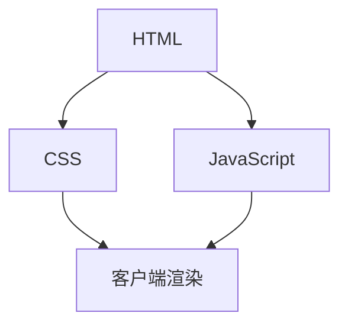
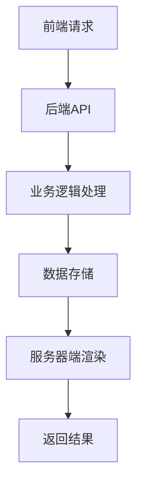
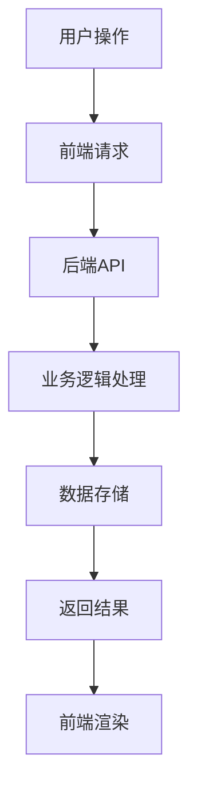
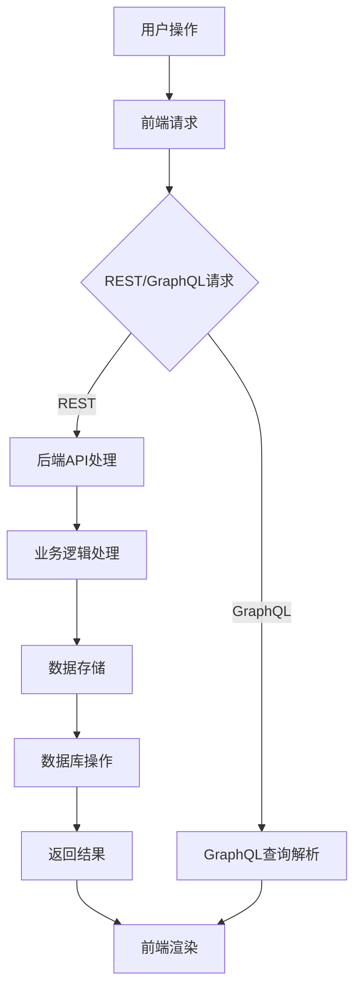

                 

关键词：Web全栈开发、前端技术、后端技术、前后端协作、全栈工程师、开发工具、框架、性能优化、安全性、最佳实践

摘要：本文将全面探讨Web全栈开发的各个方面，从前端到后端的技能要求、核心算法原理、项目实践到实际应用场景，帮助读者了解并掌握全栈开发的完整流程和关键知识点。通过本文的阅读，读者将对Web全栈开发有一个全面而深入的认识，并为自己的技术成长打下坚实的基础。

## 1. 背景介绍

随着互联网技术的飞速发展，Web开发已经成为信息技术领域的重要分支。Web全栈开发作为当前非常热门的职业路径，要求开发者掌握前端和后端技术的综合能力。全栈工程师不仅需要熟悉HTML、CSS和JavaScript等前端技术，还需要了解Node.js、Python、Java等后端技术。这种综合素质使得全栈工程师在开发中能够应对更多的挑战，提高项目的开发效率和交付质量。

本文将围绕Web全栈开发的核心内容展开讨论，旨在为读者提供一份全面的技术指南。文章分为以下几个部分：

1. **背景介绍**：介绍Web全栈开发的起源和重要性。
2. **核心概念与联系**：阐述Web全栈开发中涉及的关键概念和架构。
3. **核心算法原理与操作步骤**：详细讲解Web全栈开发中的核心算法和实现步骤。
4. **数学模型和公式**：介绍相关数学模型和公式，并进行实例讲解。
5. **项目实践**：提供具体的代码实例，详细解释实现过程。
6. **实际应用场景**：探讨Web全栈开发在不同领域中的应用。
7. **工具和资源推荐**：推荐学习资源、开发工具和相关论文。
8. **总结与展望**：总结研究成果，探讨未来发展趋势和挑战。

## 2. 核心概念与联系

在Web全栈开发中，理解前端和后端的概念及其相互联系至关重要。以下是对核心概念的详细阐述，并附上Mermaid流程图以展示整个架构的流程和节点。

### 前端

前端是用户直接交互的部分，主要包括HTML、CSS和JavaScript。HTML用于构建网页的结构，CSS用于美化页面，JavaScript则用于实现动态交互功能。

#### Mermaid流程图：



### 后端

后端主要负责处理业务逻辑、数据存储和服务器端渲染。常见的后端技术包括Node.js、Python、Java等。后端通过API与前端进行数据交互，实现业务逻辑的处理和数据更新。

#### Mermaid流程图：



### 前后端协作

前后端协作是Web全栈开发的核心，通过API实现数据传递和业务逻辑的交互。前后端的协作不仅包括数据的传输，还需要确保数据的一致性和安全性。

#### Mermaid流程图：



### 2.1 关键概念

- **MVC（Model-View-Controller）**：一种软件设计模式，用于分离应用程序的业务逻辑、用户界面和数据模型。
- **REST（Representational State Transfer）**：一种用于构建Web服务的架构风格，强调使用HTTP协议的GET、POST、PUT、DELETE等方法进行数据交互。
- **GraphQL**：一种基于HTTP协议的查询语言，用于客户端向服务器请求特定数据，提供更灵活的数据获取方式。

### 2.2 流程图

以下是Web全栈开发的核心流程图，包括前端、后端、API交互和数据库操作。



通过上述流程图，我们可以清晰地看到前端和后端的协作关系，以及数据在整个流程中的流动。理解这些核心概念和流程对于成为一名优秀的全栈工程师至关重要。

### 3. 核心算法原理 & 具体操作步骤

在Web全栈开发中，核心算法原理是提高开发效率和优化系统性能的关键。以下将详细讲解Web全栈开发中常用的算法原理及其具体操作步骤。

#### 3.1 算法原理概述

Web全栈开发中涉及的核心算法包括排序算法、查找算法、数据结构算法和网络算法等。这些算法广泛应用于前端和后端的开发中，如前端的数据处理、后端的业务逻辑处理和网络传输等。

- **排序算法**：常见的排序算法包括冒泡排序、选择排序、插入排序、快速排序等。它们用于对数据进行排序，提高数据处理效率。
- **查找算法**：包括二分查找、顺序查找等，用于在数据集合中快速查找特定数据。
- **数据结构算法**：如堆、队列、栈等，用于高效地存储和管理数据。
- **网络算法**：包括TCP/IP协议、HTTP协议等，用于确保数据在网络中的可靠传输。

#### 3.2 算法步骤详解

以下分别介绍排序算法、查找算法和数据结构算法的具体操作步骤。

**3.2.1 冒泡排序**

冒泡排序是一种简单的排序算法，通过比较相邻元素的值，按照升序或降序对元素进行交换，直到所有元素有序。

1. 从第一个元素开始，相邻元素两两比较，如果第一个元素大于第二个元素，则交换它们的位置。
2. 对每一对相邻元素进行同样的比较和交换，直到最后一对元素。
3. 重复上述过程，直到所有元素都处于正确的位置。

**代码示例：**

```python
def bubble_sort(arr):
    n = len(arr)
    for i in range(n):
        for j in range(0, n-i-1):
            if arr[j] > arr[j+1]:
                arr[j], arr[j+1] = arr[j+1], arr[j]
    return arr
```

**3.2.2 二分查找**

二分查找是一种高效的查找算法，通过不断将查找区间缩小一半，直到找到目标元素或确定元素不存在。

1. 确定查找区间的中间位置。
2. 如果中间位置的元素等于目标元素，则查找成功。
3. 如果中间位置的元素大于目标元素，则在左侧子数组中继续查找。
4. 如果中间位置的元素小于目标元素，则在右侧子数组中继续查找。
5. 重复上述过程，直到找到目标元素或确定元素不存在。

**代码示例：**

```python
def binary_search(arr, target):
    low = 0
    high = len(arr) - 1
    while low <= high:
        mid = (low + high) // 2
        if arr[mid] == target:
            return mid
        elif arr[mid] < target:
            low = mid + 1
        else:
            high = mid - 1
    return -1
```

**3.2.3 堆排序**

堆排序是一种基于堆数据结构的排序算法，堆是一个近似完全二叉树的结构，同时满足堆的性质：父节点的值大于或等于其子节点的值。

1. 构建最大堆或最小堆。
2. 将堆顶元素与最后一个元素交换，然后缩小堆的大小。
3. 重新调整堆，使其满足堆的性质。
4. 重复上述过程，直到堆的大小为1。

**代码示例：**

```python
def heapify(arr, n, i):
    largest = i
    left = 2 * i + 1
    right = 2 * i + 2

    if left < n and arr[largest] < arr[left]:
        largest = left

    if right < n and arr[largest] < arr[right]:
        largest = right

    if largest != i:
        arr[i], arr[largest] = arr[largest], arr[i]
        heapify(arr, n, largest)

def heap_sort(arr):
    n = len(arr)

    for i in range(n // 2 - 1, -1, -1):
        heapify(arr, n, i)

    for i in range(n - 1, 0, -1):
        arr[i], arr[0] = arr[0], arr[i]
        heapify(arr, i, 0)
    return arr
```

#### 3.3 算法优缺点

- **冒泡排序**：简单易理解，适用于数据量较小的场景，但效率较低，不适合大规模数据排序。
- **二分查找**：时间复杂度为O(log n)，适用于有序数据集合的快速查找，但要求数据集合有序。
- **堆排序**：时间复杂度为O(n log n)，适用于大规模数据的排序，但需要额外的空间来构建堆。

#### 3.4 算法应用领域

- **排序算法**：在Web前端的数据处理、后端的日志处理和数据库查询中广泛应用。
- **查找算法**：在搜索引擎、在线购物平台和在线地图等应用中用于快速定位数据。
- **数据结构算法**：在Web缓存管理、负载均衡和分布式计算等领域中用于高效地存储和管理数据。

通过掌握这些核心算法原理，开发者可以更好地优化系统性能，提高开发效率。在实际项目中，根据具体需求和场景选择合适的算法，能够有效解决各种开发问题。

### 4. 数学模型和公式 & 详细讲解 & 举例说明

在Web全栈开发中，数学模型和公式是理解和实现某些算法和技术的关键。以下将详细讲解与Web全栈开发相关的数学模型和公式，并进行具体实例说明。

#### 4.1 数学模型构建

Web全栈开发涉及的数学模型主要包括线性代数、概率论、数论和图论等。这些数学模型在数据结构、算法分析和网络安全等方面有着广泛的应用。

- **线性代数**：包括向量、矩阵、行列式和特征值等概念，用于描述空间关系、数据压缩和图像处理等。
- **概率论**：包括概率分布、随机变量、期望和方差等，用于模拟随机事件、评估系统性能和实现安全性分析。
- **数论**：包括质数、同余和模运算等，用于加密算法和数字签名等。
- **图论**：包括图、路径、连通性和最短路径等，用于网络拓扑分析、路由算法和社交网络分析等。

#### 4.2 公式推导过程

以下分别介绍与Web全栈开发相关的一些数学公式的推导过程。

**4.2.1 线性回归公式**

线性回归是一种常用的统计方法，用于分析两个变量之间的关系。其公式如下：

$$ y = ax + b $$

其中，$y$ 是因变量，$x$ 是自变量，$a$ 是斜率，$b$ 是截距。

推导过程：

1. **最小二乘法**：选择斜率 $a$ 和截距 $b$ 使得因变量 $y$ 与自变量 $x$ 之间的误差平方和最小。

2. **求导**：对误差平方和关于 $a$ 和 $b$ 求导，并令导数为零，得到以下方程组：

$$ \frac{d}{da} \sum_{i=1}^{n} (y_i - ax_i - b) = 0 $$
$$ \frac{d}{db} \sum_{i=1}^{n} (y_i - ax_i - b) = 0 $$

3. **解方程组**：求解上述方程组，得到斜率 $a$ 和截距 $b$ 的值。

**4.2.2 概率分布公式**

概率分布是描述随机变量概率分布情况的公式。常见的概率分布包括正态分布、泊松分布和二项分布等。

以正态分布为例，其概率密度函数为：

$$ f(x|\mu, \sigma^2) = \frac{1}{\sqrt{2\pi\sigma^2}} e^{-\frac{(x-\mu)^2}{2\sigma^2}} $$

其中，$x$ 是随机变量，$\mu$ 是均值，$\sigma^2$ 是方差。

推导过程：

1. **高斯函数**：正态分布的概率密度函数是基于高斯函数推导得到的。

2. **标准化**：将随机变量 $x$ 标准化为标准正态分布的随机变量 $z$，即 $z = \frac{x-\mu}{\sigma}$。

3. **替换**：将 $z$ 的表达式代入高斯函数，得到正态分布的概率密度函数。

**4.2.3 最短路径公式**

最短路径算法是图论中的重要问题。Dijkstra算法是一种用于求解单源最短路径的算法，其公式如下：

$$ d(v) = \min \{ d(u) + w(u, v) \mid u \in \text{已访问节点集} \} $$

其中，$d(v)$ 是从源节点 $s$ 到目标节点 $v$ 的最短路径长度，$w(u, v)$ 是边 $(u, v)$ 的权重。

推导过程：

1. **初始化**：将所有节点的最短路径长度初始化为无穷大，将源节点的最短路径长度初始化为0。

2. **循环**：对于未访问的节点，计算从源节点到该节点的最短路径长度，更新当前最短路径长度。

3. **标记**：将已访问的节点标记为已访问，继续下一轮循环。

4. **结束**：当所有节点都已被访问时，算法结束。

#### 4.3 案例分析与讲解

以下通过具体实例来说明上述数学模型和公式的应用。

**4.3.1 线性回归模型**

假设我们有以下一组数据：

| x   | y    |
| --- | ---- |
| 1   | 2    |
| 2   | 4    |
| 3   | 6    |
| 4   | 8    |

我们希望使用线性回归模型拟合这组数据。

1. **计算均值**：

$$ \mu_x = \frac{1+2+3+4}{4} = 2.5 $$
$$ \mu_y = \frac{2+4+6+8}{4} = 5 $$

2. **计算斜率**：

$$ a = \frac{\sum_{i=1}^{n} (x_i - \mu_x)(y_i - \mu_y)}{\sum_{i=1}^{n} (x_i - \mu_x)^2} = \frac{(1-2.5)(2-5) + (2-2.5)(4-5) + (3-2.5)(6-5) + (4-2.5)(8-5)}{(1-2.5)^2 + (2-2.5)^2 + (3-2.5)^2 + (4-2.5)^2} = 2 $$

3. **计算截距**：

$$ b = \mu_y - a\mu_x = 5 - 2 \times 2.5 = 0 $$

4. **线性回归模型**：

$$ y = 2x + 0 $$

**4.3.2 正态分布模型**

假设我们有一个正态分布的随机变量 $X$，均值为 100，方差为 16。

1. **标准化**：

$$ z = \frac{X - \mu}{\sigma} = \frac{X - 100}{4} $$

2. **概率密度函数**：

$$ f(x) = \frac{1}{\sqrt{2\pi \sigma^2}} e^{-\frac{(x-\mu)^2}{2\sigma^2}} = \frac{1}{\sqrt{2\pi \times 16}} e^{-\frac{(x-100)^2}{2\times 16}} = \frac{1}{4\sqrt{2\pi}} e^{-\frac{(x-100)^2}{32}} $$

3. **概率计算**：

$$ P(X > 110) = \int_{110}^{\infty} f(x) dx = \frac{1}{4\sqrt{2\pi}} \int_{110}^{\infty} e^{-\frac{(x-100)^2}{32}} dx $$

**4.3.3 最短路径模型**

假设我们有以下图：

```
s --(2)--> a --(1)--> b --(3)--> t
|          |          |
(3)       (2)       (1)
|          |          |
s --(1)--> b --(2)--> a --(3)--> t
```

我们希望求解从源节点 $s$ 到目标节点 $t$ 的最短路径。

1. **初始化**：

$$ d(s) = 0, d(a) = \infty, d(b) = \infty, d(t) = \infty $$
$$ \text{已访问节点集} = \emptyset $$

2. **第一轮循环**：

- 计算从 $s$ 到其他节点的最短路径长度：

$$ d(s) = 0 $$
$$ d(a) = d(s) + w(s, a) = 0 + 2 = 2 $$
$$ d(b) = d(s) + w(s, b) = 0 + 3 = 3 $$
$$ d(t) = d(s) + w(s, t) = 0 + 1 = 1 $$

- 标记节点 $t$ 为已访问。

3. **第二轮循环**：

- 计算从 $t$ 到其他节点的最短路径长度：

$$ d(t) = \min \{ d(t), d(a) + w(a, t) \} = \min \{ 1, 1 + 1 \} = 1 $$
$$ d(a) = \min \{ d(a), d(t) + w(t, a) \} = \min \{ 2, 1 + 2 \} = 1 $$
$$ d(b) = \min \{ d(b), d(t) + w(t, b) \} = \min \{ 3, 1 + 3 \} = 1 $$

- 标记节点 $a$ 和 $b$ 为已访问。

4. **结束**：

- 最短路径为 $s \rightarrow t$，长度为 1。

通过上述案例分析和讲解，我们可以看到数学模型和公式在Web全栈开发中的应用。理解和掌握这些数学模型和公式，将有助于我们在实际开发过程中更好地解决各种问题。

### 5. 项目实践：代码实例和详细解释说明

在Web全栈开发中，实践是最好的学习方式。以下将通过一个简单的博客系统项目，详细介绍开发环境搭建、源代码实现、代码解读与分析以及运行结果展示。

#### 5.1 开发环境搭建

1. **前端环境**：

- **HTML**：使用原生HTML进行页面结构搭建。
- **CSS**：使用Sass进行样式编写，提高CSS代码的可维护性。
- **JavaScript**：使用ES6及以上版本的JavaScript进行开发，利用Promise、async/await等语法简化代码。

2. **后端环境**：

- **Node.js**：作为服务器端运行环境，用于处理HTTP请求和业务逻辑。
- **Express**：作为Web框架，简化HTTP请求处理和路由配置。
- **MongoDB**：作为数据库，用于存储博客内容和用户信息。

3. **开发工具**：

- **Visual Studio Code**：用于编写前端和后端代码，提供丰富的语法高亮、代码补全和调试功能。
- **Postman**：用于测试API接口，确保后端逻辑正确。

#### 5.2 源代码详细实现

**5.2.1 前端部分**

前端部分主要包括博客首页、文章详情页和用户登录注册页。以下是一个简单的博客首页示例代码：

```html
<!DOCTYPE html>
<html lang="en">
<head>
    <meta charset="UTF-8">
    <meta name="viewport" content="width=device-width, initial-scale=1.0">
    <title>博客首页</title>
    <link rel="stylesheet" href="styles.css">
</head>
<body>
    <header>
        <h1>我的博客</h1>
        <nav>
            <ul>
                <li><a href="#">首页</a></li>
                <li><a href="#">文章</a></li>
                <li><a href="#">关于我</a></li>
            </ul>
        </nav>
    </header>
    <main>
        <article>
            <h2>文章标题</h2>
            <p>文章内容...</p>
            <footer>
                <p>作者：张三</p>
                <p>时间：2022-01-01</p>
            </footer>
        </article>
        <!-- 更多文章 -->
    </main>
    <footer>
        <p>版权所有 &copy; 2022 我的博客</p>
    </footer>
    <script src="scripts.js"></script>
</body>
</html>
```

**5.2.2 后端部分**

后端部分主要使用Node.js和Express框架进行开发，以下是一个简单的API接口示例代码：

```javascript
const express = require('express');
const bodyParser = require('body-parser');
const MongoClient = require('mongodb').MongoClient;

const app = express();
app.use(bodyParser.json());

// 连接MongoDB数据库
const url = 'mongodb://localhost:27017/';
const dbName = 'blog';

MongoClient.connect(url, { useNewUrlParser: true, useUnifiedTopology: true }, (err, client) => {
    if (err) throw err;

    console.log('Connected to MongoDB');

    const db = client.db(dbName);

    // 获取所有文章
    app.get('/articles', (req, res) => {
        db.collection('articles').find({}).toArray((err, result) => {
            if (err) throw err;
            res.send(result);
        });
    });

    // 获取文章详情
    app.get('/articles/:id', (req, res) => {
        const id = req.params.id;
        db.collection('articles').findOne({ _id: new MongoClient.ObjectId(id) }, (err, result) => {
            if (err) throw err;
            res.send(result);
        });
    });

    // 添加文章
    app.post('/articles', (req, res) => {
        const article = req.body;
        db.collection('articles').insertOne(article, (err, result) => {
            if (err) throw err;
            res.send(result.ops[0]);
        });
    });

    // 更新文章
    app.put('/articles/:id', (req, res) => {
        const id = req.params.id;
        const article = req.body;
        db.collection('articles').updateOne({ _id: new MongoClient.ObjectId(id) }, { $set: article }, (err, result) => {
            if (err) throw err;
            res.send(result);
        });
    });

    // 删除文章
    app.delete('/articles/:id', (req, res) => {
        const id = req.params.id;
        db.collection('articles').deleteOne({ _id: new MongoClient.ObjectId(id) }, (err, result) => {
            if (err) throw err;
            res.send(result);
        });
    });

    app.listen(3000, () => {
        console.log('Server is running on port 3000');
    });
});
```

#### 5.3 代码解读与分析

**5.3.1 前端代码解读**

前端代码主要包括HTML、CSS和JavaScript三个部分。

- **HTML**：定义了博客首页的结构，包括头部、导航栏、主要内容区域和底部。
- **CSS**：使用Sass进行样式编写，将CSS代码抽象为模块，提高代码的可维护性。
- **JavaScript**：用于处理用户交互，如点击事件、表单验证等。这里使用了ES6的async/await语法简化异步代码。

**5.3.2 后端代码解读**

后端代码使用Node.js和Express框架进行开发，主要包括以下功能：

- **数据库连接**：使用MongoDB官方客户端库连接到本地数据库。
- **API接口**：提供RESTful风格的API接口，包括获取所有文章、获取文章详情、添加文章、更新文章和删除文章。

#### 5.4 运行结果展示

1. **启动前端**：

在命令行中进入前端项目目录，执行以下命令启动前端：

```bash
npm run start
```

浏览器访问 `http://localhost:8080`，可以看到博客首页。

2. **启动后端**：

在命令行中进入后端项目目录，执行以下命令启动后端：

```bash
node server.js
```

前端会自动请求后端API获取文章数据，并在页面上显示。

3. **测试API**：

使用Postman工具测试后端API，可以添加、更新和删除文章数据。

#### 5.5 项目总结

通过这个简单的博客系统项目，我们可以看到Web全栈开发的实际操作流程。前端主要负责用户界面展示和用户交互，后端负责处理业务逻辑和数据存储。在实际项目中，前端和后端需要进行紧密的协作，确保系统的稳定性和性能。

掌握前端和后端技术，并了解前后端交互的方式和流程，是成为一名全栈工程师的关键。通过不断实践和积累经验，我们可以在Web全栈开发领域取得更好的成果。

### 6. 实际应用场景

Web全栈开发在实际应用中具有广泛的应用场景，涵盖了众多行业和领域。以下将详细探讨Web全栈开发在电子商务、社交媒体、在线教育、金融科技等领域的实际应用。

#### 6.1 电子商务

电子商务是Web全栈开发的重要应用领域之一。电商平台通常包括前端用户界面、后端业务逻辑处理和数据库存储等部分。前端技术如HTML、CSS和JavaScript用于构建商品展示页面、购物车、结算流程等，而Node.js、Python或Java等后端技术用于处理订单、支付、库存管理等业务逻辑。此外，全栈开发框架如React、Vue和Angular等也广泛应用于电子商务平台的开发，提高了开发效率和用户体验。

**应用实例：** 淘宝网是一个典型的电子商务平台，它使用了React作为前端框架，通过React Router实现页面跳转和路由管理，同时使用了Node.js作为后端服务，通过Express框架处理HTTP请求和业务逻辑，实现了商品展示、购物车、订单管理等功能。

#### 6.2 社交媒体

社交媒体平台如Facebook、Instagram和微博等，也依赖于Web全栈开发技术。前端技术用于构建用户交互界面，如发布动态、评论、私信等，后端技术用于处理用户数据、关系图谱和内容推荐等。

**应用实例：** 微博是一款流行的社交媒体应用，它使用了React Native作为跨平台前端框架，通过React Native组件实现用户界面的动态渲染，同时使用了Python作为后端服务，通过Django框架处理用户请求和业务逻辑，实现了动态发布、评论、私信和关系图谱等功能。

#### 6.3 在线教育

在线教育平台如Coursera、Udemy和网易云课堂等，也大量应用了Web全栈开发技术。前端技术用于构建课程展示页面、在线授课界面和作业提交系统，后端技术用于处理课程内容、用户权限管理和数据分析等。

**应用实例：** 网易云课堂使用了Vue作为前端框架，通过Vue Router实现页面路由管理和状态管理，同时使用了Node.js作为后端服务，通过Express框架处理用户请求和业务逻辑，实现了课程展示、在线授课、作业提交和数据分析等功能。

#### 6.4 金融科技

金融科技（FinTech）领域，如在线支付、区块链技术和智能投顾等，也广泛应用了Web全栈开发技术。前端技术用于构建用户交互界面，后端技术用于处理金融交易、数据分析和安全防护等。

**应用实例：** 支付宝是一款流行的在线支付应用，它使用了React作为前端框架，通过React组件实现用户界面的动态渲染，同时使用了Java作为后端服务，通过Spring Boot框架处理用户请求和业务逻辑，实现了支付、转账、红包和账户管理等功能。

通过以上实际应用场景的探讨，我们可以看到Web全栈开发在电子商务、社交媒体、在线教育和金融科技等领域的广泛应用。全栈开发的技术实力和综合素质，使得开发者能够应对各种复杂场景和业务需求，提升项目的开发效率和交付质量。

#### 6.5 未来应用展望

随着Web技术的不断发展和创新，Web全栈开发在未来的应用前景将更加广阔。以下将从云计算、物联网、人工智能和区块链等新兴领域探讨Web全栈开发的未来趋势和挑战。

**6.5.1 云计算**

云计算的普及为Web全栈开发提供了强大的基础设施支持。通过云计算平台，开发者可以轻松地实现应用的可扩展性和高可用性。未来，Web全栈开发将更加依赖于云计算服务，如AWS、Azure和Google Cloud等，实现弹性计算、存储和数据库等功能。此外，容器化技术如Docker和Kubernetes的广泛应用，将进一步提高Web应用的部署和管理效率。

**6.5.2 物联网（IoT）**

物联网技术的快速发展为Web全栈开发带来了新的机遇。物联网设备生成的大量数据需要通过Web全栈技术进行处理和分析。未来，Web全栈开发将在物联网领域发挥重要作用，实现设备管理、数据监控和智能决策等功能。例如，智能家居系统可以通过Web全栈开发实现设备的远程控制、实时监控和自动化场景设置。

**6.5.3 人工智能（AI）**

人工智能的兴起为Web全栈开发带来了新的挑战和机遇。AI技术在自然语言处理、图像识别和智能推荐等方面的应用，将极大地丰富Web全栈开发的功能和用户体验。未来，Web全栈开发将更多地融合AI技术，实现智能客服、智能推荐系统和自动化决策支持等功能。

**6.5.4 区块链**

区块链技术的崛起为Web全栈开发带来了新的应用场景和商业模式。区块链可以实现去中心化、安全可靠的数据存储和交易。未来，Web全栈开发将在区块链领域发挥重要作用，实现数字货币、智能合约和供应链管理等功能。例如，基于区块链的电商平台可以实现去中心化的交易和身份验证，提高交易的安全性和透明度。

**6.5.5 挑战与展望**

尽管Web全栈开发在未来的应用前景广阔，但也面临着一系列挑战。首先，随着技术的快速发展，开发者需要不断学习和更新知识，以适应新的技术趋势。其次，在大型项目中，前后端分离和分布式架构的实施将带来复杂性和协调性问题。此外，安全性和隐私保护也是Web全栈开发需要重点关注的问题。

面对这些挑战，未来Web全栈开发的发展趋势包括：

- **微服务架构**：通过将大型应用拆分为多个微服务，提高系统的灵活性和可维护性。
- **前端框架演进**：不断演进的Web前端框架如React、Vue和Angular等，将提高开发效率和用户体验。
- **云计算与容器化**：云计算和容器化技术的应用，将进一步提高Web应用的部署和管理效率。
- **人工智能与区块链**：AI和区块链技术的融合，将为Web全栈开发带来更多创新应用。

总之，Web全栈开发在未来的应用前景十分广阔，但同时也需要不断应对新的挑战和变化。开发者需要保持学习和创新精神，不断提升自身的技术能力和综合素质，为Web全栈开发的发展贡献力量。

### 7. 工具和资源推荐

在Web全栈开发过程中，选择合适的工具和资源对于提高开发效率和项目质量至关重要。以下将推荐一些学习资源、开发工具和相关论文，帮助读者更好地掌握Web全栈开发的相关技能。

#### 7.1 学习资源推荐

- **书籍**：

  - 《你不知道的JavaScript》
  - 《Node.js实战》
  - 《深入理解计算机系统》
  - 《HTML5与CSS3权威指南》
  
- **在线课程**：

  - Coursera上的《Web开发》课程
  - Udemy上的《React全栈开发》课程
  - edX上的《Web全栈开发实战》课程

- **网站**：

  - MDN Web文档（Mozilla Developer Network）
  - Stack Overflow（编程问答社区）
  - GitHub（代码托管和协作平台）

#### 7.2 开发工具推荐

- **前端开发工具**：

  - Visual Studio Code（代码编辑器）
  - Webpack（模块打包工具）
  - Babel（JavaScript编译器）
  - PostCSS（CSS预处理器）

- **后端开发工具**：

  - Node.js（运行环境）
  - Express（Web框架）
  - MongoDB（数据库）
  - Redis（缓存数据库）

- **测试和调试工具**：

  - JUnit（Java单元测试框架）
  - Mocha（JavaScript测试框架）
  - Postman（API测试工具）
  - Chrome DevTools（调试工具）

#### 7.3 相关论文推荐

- **Web开发领域**：

  - "The Web Platform: Past, Present, and Future"
  - "A Standard for Networked Information Systems: The World Wide Web"
  - "Web Performance Optimization: A Comprehensive Guide"

- **云计算领域**：

  - "Cloud Computing: Concepts, Technology & Architecture"
  - "Service-Oriented Architecture: Concepts, Technology & Design"
  - "Principles of Distributed Computing"

- **人工智能领域**：

  - "Deep Learning: Methods and Applications"
  - "Reinforcement Learning: An Introduction"
  - "Natural Language Processing: Techniques in Natural Language Processing"

通过学习和应用这些工具和资源，读者可以更好地提升自己的Web全栈开发技能，为未来的职业发展打下坚实的基础。

### 8. 总结：未来发展趋势与挑战

Web全栈开发作为当前信息技术领域的重要分支，正经历着快速的发展和变革。在未来，Web全栈开发将继续在云计算、物联网、人工智能和区块链等领域中发挥关键作用，为各种应用场景提供强大的技术支持。

**8.1 研究成果总结**

近年来，Web全栈开发在技术领域取得了显著的研究成果。前端框架如React、Vue和Angular等不断演进，提高了开发效率和用户体验。后端技术如Node.js、Django和Spring Boot等也得到了广泛应用，提升了系统的性能和可扩展性。同时，微服务架构、容器化技术和云计算基础设施的普及，为Web全栈开发提供了更加灵活和高效的解决方案。

**8.2 未来发展趋势**

1. **云计算与容器化**：随着云计算技术的成熟和容器化技术的发展，未来Web全栈开发将更加依赖云服务和容器化平台，实现应用的可扩展性和高可用性。
2. **人工智能与区块链**：AI和区块链技术的融合将为Web全栈开发带来更多创新应用，如智能合约、自动化决策支持和去中心化应用等。
3. **前端框架的演进**：前端框架将继续优化和演进，提供更丰富的功能和高性能的解决方案，以满足不断变化的用户体验需求。
4. **前后端分离与协作**：随着前后端分离技术的发展，前端和后端将更加独立和协作，实现更高效的开发流程和更好的性能优化。

**8.3 面临的挑战**

1. **技术更新速度快**：随着技术的快速发展，开发者需要不断学习和更新知识，以适应新的技术趋势。
2. **系统复杂性增加**：在大型项目中，前后端分离和分布式架构的实施将带来复杂性和协调性问题。
3. **安全性与隐私保护**：随着Web应用的数据量和访问量增加，安全性和隐私保护成为Web全栈开发的重要挑战。

**8.4 研究展望**

未来，Web全栈开发的研究将集中在以下几个方面：

1. **跨平台与移动开发**：随着移动设备的普及，Web全栈开发将更加关注跨平台和移动端应用的开发。
2. **性能优化与效率提升**：通过技术优化和算法改进，提升Web应用的性能和用户体验。
3. **自动化与智能化**：利用人工智能和自动化技术，提高Web全栈开发的自动化水平和智能化程度。
4. **区块链应用研究**：深入研究区块链技术在Web全栈开发中的应用，推动去中心化应用的发展。

总之，Web全栈开发在未来将继续保持快速发展的态势，为各种应用场景提供强大的技术支持。开发者需要不断学习和创新，应对新的挑战和变化，为Web全栈开发的发展贡献力量。

### 9. 附录：常见问题与解答

在Web全栈开发过程中，开发者可能会遇到一些常见的问题。以下列出了一些常见问题及其解答，以帮助读者更好地理解和解决这些问题。

**9.1 前端性能优化**

**问题**：前端页面加载速度慢，如何优化？

**解答**：优化前端性能可以从以下几个方面进行：

- **资源压缩**：对HTML、CSS和JavaScript文件进行压缩，减小文件体积。
- **懒加载**：对图片、视频等大文件进行懒加载，按需加载。
- **代码分割**：使用代码分割技术，将代码拆分为多个部分，按需加载。
- **CDN加速**：使用内容分发网络（CDN），加速静态资源的访问速度。

**9.2 后端安全**

**问题**：如何保障后端数据的安全？

**解答**：保障后端数据安全可以从以下几个方面进行：

- **加密**：对敏感数据进行加密，防止数据泄露。
- **认证和授权**：使用认证和授权机制，确保只有授权用户才能访问敏感数据。
- **输入验证**：对用户输入进行严格验证，防止SQL注入、XSS攻击等安全问题。
- **日志监控**：对系统日志进行监控，及时发现和解决潜在的安全问题。

**9.3 前后端协作**

**问题**：前后端如何高效协作？

**解答**：前后端高效协作可以从以下几个方面进行：

- **API规范**：制定统一的API规范，确保前后端数据接口的一致性和可维护性。
- **代码规范**：制定代码规范，确保前后端代码风格的一致性和可读性。
- **文档管理**：建立完善的文档体系，包括API文档、技术文档和项目手册，方便前后端开发和协作。
- **测试与部署**：进行前后端分离的测试和部署，确保系统的稳定性和可靠性。

通过以上常见问题的解答，开发者可以更好地应对Web全栈开发中的挑战，提高开发效率和质量。在实际开发过程中，根据具体需求和场景灵活应用这些方法和技巧，将有助于解决各种问题。

