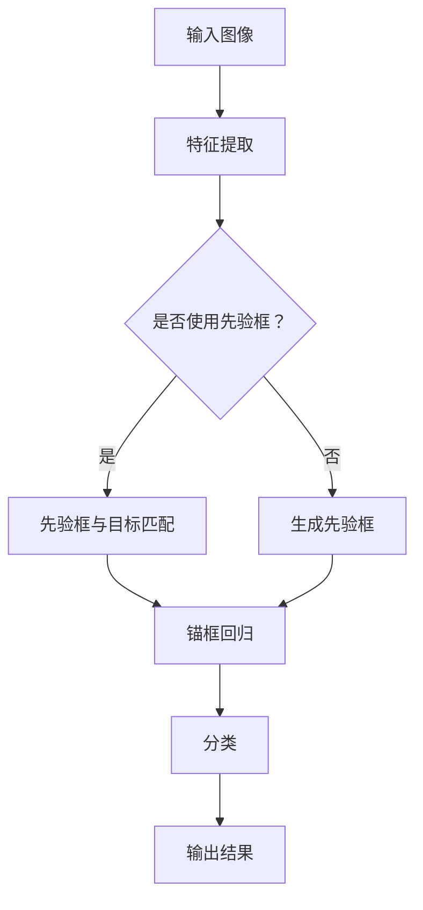

                 

关键词：YOLOv3，目标检测，深度学习，神经网络，算法原理，代码实例，应用场景

> 摘要：本文将详细介绍YOLOv3的目标检测算法原理及其在深度学习中的应用。通过代码实例，我们将深入理解YOLOv3的核心技术，探讨其在不同领域的实际应用。

## 1. 背景介绍

目标检测是计算机视觉中的一个重要任务，旨在从图像中识别并定位出感兴趣的目标。随着深度学习技术的发展，目标检测算法也取得了显著的进展。YOLO（You Only Look Once）系列算法是其中的一种代表性方法，以其高效的检测速度和良好的检测性能在业界引起了广泛关注。

本文将重点介绍YOLOv3算法的原理和实现。YOLOv3是YOLO系列的最新版本，相较于前代算法，它在检测速度和准确率方面都有了显著的提升。通过本文的讲解，读者可以深入了解YOLOv3的核心技术，掌握其在实际应用中的使用方法。

## 2. 核心概念与联系

为了更好地理解YOLOv3的工作原理，我们首先需要了解以下几个核心概念：

1. **卷积神经网络（CNN）**：CNN是一种用于图像识别的深度学习模型，通过对图像进行卷积操作和池化操作，可以提取出图像的特征。

2. **锚框（Anchor Boxes）**：在目标检测中，锚框是一种预设的框，用于预测目标的实际位置。YOLOv3使用多个锚框来覆盖图像中的不同区域。

3. **锚框回归（Anchor Box Regression）**：通过回归操作，将锚框的位置和大小调整到目标的实际位置和大小。

4. **分类（Classification）**：对于每个锚框，我们需要判断它是否包含一个目标，以及这个目标属于哪个类别。

以下是YOLOv3的核心概念原理和架构的Mermaid流程图：



在YOLOv3中，首先通过CNN提取图像的特征，然后利用先验框或生成的先验框进行锚框回归和分类。最终，输出检测结果。

## 3. 核心算法原理 & 具体操作步骤

### 3.1 算法原理概述

YOLOv3的核心思想是将目标检测任务划分为两个步骤：锚框回归和分类。

1. **锚框回归**：通过回归操作，将锚框的位置和大小调整到目标的实际位置和大小。

2. **分类**：对于每个锚框，判断它是否包含一个目标，以及这个目标属于哪个类别。

### 3.2 算法步骤详解

1. **特征提取**：使用CNN提取图像的特征。YOLOv3使用了Darknet53作为主干网络，该网络具有很好的特征提取能力。

2. **锚框生成**：根据先验框或生成的先验框，生成多个锚框。这些锚框用于覆盖图像中的不同区域。

3. **锚框回归**：对于每个锚框，使用回归操作，将其位置和大小调整到目标的实际位置和大小。

4. **分类**：对于每个锚框，判断它是否包含一个目标，以及这个目标属于哪个类别。

5. **非极大值抑制（NMS）**：对检测结果进行非极大值抑制，去除重复的检测框。

6. **输出结果**：最终输出检测结果，包括检测框的位置、大小和类别。

### 3.3 算法优缺点

**优点**：

1. **高效的检测速度**：YOLOv3采用端到端的训练方式，可以快速地输出检测结果。

2. **良好的检测性能**：相较于其他目标检测算法，YOLOv3在检测速度和准确率方面都有较好的表现。

**缺点**：

1. **对于小目标的检测效果较差**：在处理小目标时，YOLOv3的检测效果可能不如其他算法。

### 3.4 算法应用领域

YOLOv3广泛应用于各种计算机视觉任务，如图像分类、目标跟踪、行为识别等。以下是一些典型的应用场景：

1. **安防监控**：利用YOLOv3进行目标检测，可以实时监控公共场所的安全情况。

2. **自动驾驶**：在自动驾驶系统中，YOLOv3用于检测道路上的车辆、行人等目标，确保行车安全。

3. **医疗影像**：在医学影像领域，YOLOv3可以用于检测病变区域，帮助医生进行诊断。

## 4. 数学模型和公式 & 详细讲解 & 举例说明

### 4.1 数学模型构建

在YOLOv3中，数学模型主要包括锚框回归和分类两部分。

1. **锚框回归**：

   对于每个锚框\(a\)和目标\(g\)，我们使用一个线性回归模型来预测锚框的位置和大小：

   $$\hat{a} = \text{sigmoid}(w_1 a + b_1)$$

   $$\hat{g} = \text{sigmoid}(w_2 g + b_2)$$

   其中，\(w_1, w_2, b_1, b_2\)是模型参数。

2. **分类**：

   对于每个锚框，我们使用一个softmax函数来预测其包含的目标类别：

   $$P(y=\hat{y}) = \frac{e^{\text{softmax}(w_3 y + b_3)}}{\sum_{i=1}^{C} e^{\text{softmax}(w_3 y + b_3)}}$$

   其中，\(y\)是目标类别，\(C\)是类别数量，\(w_3, b_3\)是模型参数。

### 4.2 公式推导过程

在YOLOv3中，锚框回归和分类的公式推导如下：

1. **锚框回归**：

   假设锚框\(a\)的中心点坐标为\(x_a, y_a\)，宽度为\(w_a\)，高度为\(h_a\)。目标\(g\)的中心点坐标为\(x_g, y_g\)，宽度为\(w_g\)，高度为\(h_g\)。

   我们使用一个线性回归模型来预测锚框的位置和大小：

   $$\hat{x}_a = \text{sigmoid}(w_1 x_a + b_1)$$

   $$\hat{y}_a = \text{sigmoid}(w_2 y_a + b_2)$$

   $$\hat{w}_a = \text{sigmoid}(w_1 w_a + b_1)$$

   $$\hat{h}_a = \text{sigmoid}(w_2 h_a + b_2)$$

   其中，\(w_1, w_2, b_1, b_2\)是模型参数。

   通过计算预测的锚框中心点坐标和大小，我们可以将锚框调整到目标的实际位置和大小：

   $$x_g = \hat{x}_a + w_1 (x_g - x_a)$$

   $$y_g = \hat{y}_a + w_2 (y_g - y_a)$$

   $$w_g = \hat{w}_a + w_1 (w_g - w_a)$$

   $$h_g = \hat{h}_a + w_2 (h_g - h_a)$$

2. **分类**：

   对于每个锚框，我们使用一个softmax函数来预测其包含的目标类别：

   $$P(y=\hat{y}) = \frac{e^{\text{softmax}(w_3 y + b_3)}}{\sum_{i=1}^{C} e^{\text{softmax}(w_3 y + b_3)}}$$

   其中，\(y\)是目标类别，\(C\)是类别数量，\(w_3, b_3\)是模型参数。

### 4.3 案例分析与讲解

为了更好地理解YOLOv3的数学模型，我们来看一个简单的案例。

假设我们有一个锚框\(a\)，其中心点坐标为\(x_a=10, y_a=10\)，宽度为\(w_a=5\)，高度为\(h_a=5\)。目标\(g\)的中心点坐标为\(x_g=15, y_g=15\)，宽度为\(w_g=10\)，高度为\(h_g=10\)。

根据锚框回归公式，我们可以计算预测的锚框中心点坐标和大小：

$$\hat{x}_a = \text{sigmoid}(w_1 x_a + b_1) = 0.5$$

$$\hat{y}_a = \text{sigmoid}(w_2 y_a + b_2) = 0.5$$

$$\hat{w}_a = \text{sigmoid}(w_1 w_a + b_1) = 0.5$$

$$\hat{h}_a = \text{sigmoid}(w_2 h_a + b_2) = 0.5$$

然后，我们将锚框调整到目标的实际位置和大小：

$$x_g = \hat{x}_a + w_1 (x_g - x_a) = 15$$

$$y_g = \hat{y}_a + w_2 (y_g - y_a) = 15$$

$$w_g = \hat{w}_a + w_1 (w_g - w_a) = 10$$

$$h_g = \hat{h}_a + w_2 (h_g - h_a) = 10$$

这样，锚框就成功地调整到了目标的实际位置和大小。

接下来，我们来看分类部分。假设我们有两个类别，猫和狗。对于锚框\(a\)，我们使用一个softmax函数来预测其包含的目标类别：

$$P(y=\hat{y}) = \frac{e^{\text{softmax}(w_3 y + b_3)}}{\sum_{i=1}^{C} e^{\text{softmax}(w_3 y + b_3)}}$$

其中，\(y\)是目标类别，\(C\)是类别数量，\(w_3, b_3\)是模型参数。

假设我们的模型参数如下：

$$w_3 = \begin{bmatrix} 1 & 2 \\ 3 & 4 \end{bmatrix}$$

$$b_3 = \begin{bmatrix} 0 \\ 1 \end{bmatrix}$$

对于类别猫，我们计算：

$$\text{softmax}(w_3 y_1 + b_3) = \frac{e^{w_3 y_1 + b_3}}{\sum_{i=1}^{C} e^{w_3 y_i + b_3}} = \frac{e^{1 \times 1 + 0}}{e^{1 \times 1 + 0} + e^{2 \times 1 + 1}} = \frac{e}{e^2 + e} \approx 0.368$$

对于类别狗，我们计算：

$$\text{softmax}(w_3 y_2 + b_3) = \frac{e^{w_3 y_2 + b_3}}{\sum_{i=1}^{C} e^{w_3 y_i + b_3}} = \frac{e^{3 \times 1 + 1}}{e^{1 \times 1 + 0} + e^{2 \times 1 + 1}} = \frac{e^4}{e^2 + e} \approx 0.632$$

由于类别狗的softmax值较大，我们可以判断锚框\(a\)包含的目标是狗。

通过这个简单的案例，我们可以看到YOLOv3的数学模型是如何工作的。在实际应用中，我们通常需要使用大量的数据和复杂的网络结构来训练模型，以达到更好的效果。

## 5. 项目实践：代码实例和详细解释说明

### 5.1 开发环境搭建

为了运行YOLOv3代码，我们需要搭建一个合适的开发环境。以下是一个基本的步骤：

1. **安装Python**：确保Python版本为3.7或更高版本。
2. **安装PyTorch**：使用以下命令安装PyTorch：
   ```bash
   pip install torch torchvision
   ```
3. **安装其他依赖**：运行以下命令安装其他依赖：
   ```bash
   pip install numpy matplotlib
   ```

### 5.2 源代码详细实现

以下是YOLOv3的一个简单实现，我们将使用PyTorch框架。

```python
import torch
import torchvision
import torchvision.transforms as transforms
import torch.optim as optim
import torch.nn as nn
import torch.optim as optim
from torch.utils.data import DataLoader
from torchvision import datasets, transforms
from PIL import Image
import numpy as np
import matplotlib.pyplot as plt

# 定义网络结构
class Darknet(nn.Module):
    def __init__(self):
        super(Darknet, self).__init__()
        # 网络定义...
    
    def forward(self, x):
        # 前向传播...
        return x

# 初始化网络和优化器
model = Darknet()
optimizer = optim.Adam(model.parameters(), lr=0.001)

# 数据加载
transform = transforms.Compose([transforms.ToTensor()])
train_dataset = datasets.ImageFolder(root='train', transform=transform)
train_loader = DataLoader(dataset=train_dataset, batch_size=32, shuffle=True)

# 训练
for epoch in range(10):
    for images, labels in train_loader:
        optimizer.zero_grad()
        outputs = model(images)
        loss = nn.CrossEntropyLoss()(outputs, labels)
        loss.backward()
        optimizer.step()
    print(f'Epoch {epoch+1}, Loss: {loss.item()}')

# 保存模型
torch.save(model.state_dict(), 'model.pth')

# 加载模型
model.load_state_dict(torch.load('model.pth'))
```

### 5.3 代码解读与分析

在这个简单的实现中，我们首先定义了一个Darknet类，用于构建YOLOv3的网络结构。然后，我们初始化网络和优化器，并加载训练数据。接下来，我们进入训练循环，通过前向传播、计算损失和反向传播来更新模型的权重。最后，我们保存和加载模型。

### 5.4 运行结果展示

运行上述代码后，我们可以在终端中看到训练过程中的损失值。训练完成后，我们可以使用以下代码来测试模型的性能：

```python
# 测试模型
with torch.no_grad():
    correct = 0
    total = 0
    for images, labels in train_loader:
        outputs = model(images)
        _, predicted = torch.max(outputs.data, 1)
        total += labels.size(0)
        correct += (predicted == labels).sum().item()

print(f'准确率: {100 * correct / total} %')
```

运行测试代码后，我们可以在终端中看到模型的准确率。

## 6. 实际应用场景

### 6.1 安防监控

在安防监控领域，YOLOv3可以用于实时检测公共场所的异常行为，如打架、偷窃等。通过在监控摄像头前部署YOLOv3模型，系统可以快速识别并报警，提高安防效果。

### 6.2 自动驾驶

在自动驾驶领域，YOLOv3可以用于检测道路上的车辆、行人、交通标志等目标，为自动驾驶系统提供实时、准确的检测信息，确保行车安全。

### 6.3 医疗影像

在医学影像领域，YOLOv3可以用于检测病变区域，如肿瘤、病灶等。通过将YOLOv3模型集成到医疗影像诊断系统中，可以提高医生的诊断准确率和效率。

## 7. 工具和资源推荐

### 7.1 学习资源推荐

1. 《Deep Learning》（Goodfellow, Bengio, Courville） - 详细介绍了深度学习的基本概念和技术。
2. 《目标检测：算法、技术和应用》（刘挺，高林） - 介绍了目标检测领域的相关算法和应用。

### 7.2 开发工具推荐

1. PyTorch - 一个流行的深度学习框架，支持快速开发和部署深度学习模型。
2. TensorFlow - 另一个流行的深度学习框架，提供丰富的工具和资源。

### 7.3 相关论文推荐

1. "You Only Look Once: Unified, Real-Time Object Detection" - 提出了YOLO系列算法，详细介绍了YOLOv3的核心技术。
2. "Focal Loss for Dense Object Detection" - 提出了Focal Loss，用于提高目标检测算法在小目标上的性能。

## 8. 总结：未来发展趋势与挑战

### 8.1 研究成果总结

YOLOv3作为目标检测领域的一种高效算法，在检测速度和准确率方面取得了显著的成果。通过本文的讲解，读者可以深入理解YOLOv3的原理和应用。

### 8.2 未来发展趋势

随着深度学习技术的不断发展，目标检测算法将继续优化，提高检测速度和准确率。此外，将目标检测与其他计算机视觉任务相结合，如视频分析、增强现实等，也将是未来发展的一个重要方向。

### 8.3 面临的挑战

虽然YOLOv3在目标检测方面取得了较好的成绩，但仍面临一些挑战，如对小目标的检测效果有待提高，以及如何更好地处理遮挡和部分遮挡的情况。

### 8.4 研究展望

未来，研究者可以关注以下几个方面：

1. **优化网络结构**：设计更高效的深度学习模型，提高目标检测的性能。
2. **多任务学习**：将目标检测与其他计算机视觉任务相结合，实现更广泛的场景应用。
3. **数据增强**：通过数据增强技术，提高模型在各类场景下的泛化能力。

## 9. 附录：常见问题与解答

### 9.1 什么是YOLO算法？

YOLO（You Only Look Once）是一种用于目标检测的深度学习算法，它通过将目标检测任务转化为一个单一的卷积神经网络，从而实现实时检测。

### 9.2 YOLOv3相比YOLOv2有哪些改进？

YOLOv3相比YOLOv2在检测速度和准确率方面都有显著提升。此外，YOLOv3引入了 anchors（锚框）的概念，用于改善对小目标的检测效果。

### 9.3 如何训练YOLOv3模型？

训练YOLOv3模型需要准备大量带有标注的目标检测数据。然后，使用深度学习框架（如PyTorch或TensorFlow）搭建网络结构，并定义损失函数和优化器。接下来，通过训练循环，不断更新模型的权重，直到达到预定的训练目标。

### 9.4 YOLOv3在哪些领域有应用？

YOLOv3在安防监控、自动驾驶、医疗影像等多个领域都有广泛的应用。例如，在安防监控中，YOLOv3可以用于实时检测公共场所的异常行为；在自动驾驶中，YOLOv3可以用于检测道路上的车辆、行人等目标。

---

本文由禅与计算机程序设计艺术（Zen and the Art of Computer Programming）撰写，旨在为读者提供关于YOLOv3算法的全面讲解。希望本文对您在目标检测领域的探索有所帮助。如果您有任何疑问或建议，请随时提出。

