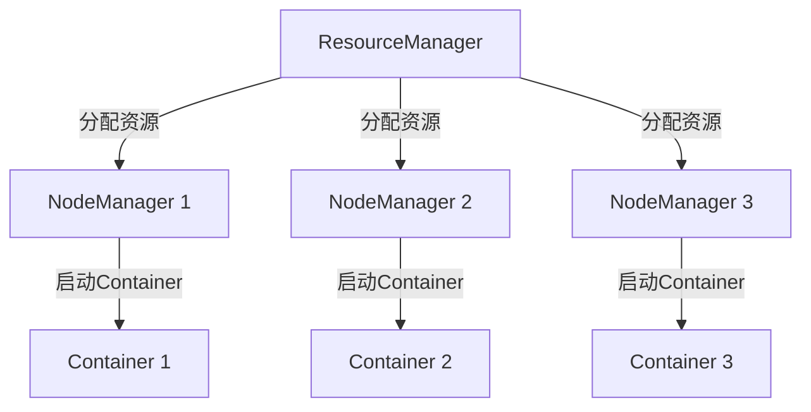

                 

关键词：Yarn、分布式计算、工作流、MapReduce、容器调度、架构设计

> 摘要：本文将深入探讨Yarn——作为一种高效分布式计算框架的原理及其在实际项目中的应用。我们将从背景介绍开始，逐步分析Yarn的核心概念、架构设计、算法原理，并通过实际代码实例详细讲解其实现过程。此外，还将对Yarn在当前和未来的应用场景进行展望，并提供相关的学习资源和工具推荐。

## 1. 背景介绍

随着大数据和云计算的快速发展，分布式计算成为了IT领域的重要趋势。Apache Hadoop 是最早的大数据分布式计算框架之一，它基于MapReduce模型实现了高效的批量数据处理。然而，随着计算需求的增长，Hadoop的MapReduce模型在某些场景下显得不够灵活和高效。

为了解决这些问题，Apache Hadoop项目推出了YARN（Yet Another Resource Negotiator），作为其资源管理和调度框架的升级。YARN的出现标志着Hadoop从传统的MapReduce计算模型向更加灵活和通用的分布式计算框架转型。

YARN的主要目标是提供一种统一的资源调度平台，不仅支持MapReduce，还能支持其他计算框架如Spark、Flink等。通过YARN，开发者可以更灵活地分配计算资源，提高系统的利用率和效率。

## 2. 核心概念与联系

### 2.1. YARN的核心概念

YARN由以下几个核心组件组成：

- ** ResourceManager（RM）**：资源管理器，负责全局资源调度和任务分配。
- ** NodeManager（NM）**：节点管理器，负责本地资源的监控和任务执行。
- ** ApplicationMaster（AM）**：应用程序管理器，代表应用程序在ResourceManager上申请资源并协调任务执行。
- ** Container**：容器，用于封装资源（如CPU、内存）并运行应用程序。

### 2.2. YARN的架构设计


从图中可以看出，YARN采用了Master/Slave架构，其中：

- ** ResourceManager（RM）** 是YARN的大脑，负责资源分配和任务调度。它将整个集群的资源划分为多个slots，每个slot代表一定的资源量（如CPU核心数或内存大小）。当ApplicationMaster（AM）向RM申请资源时，RM会根据可用资源情况分配合适的slots。

- ** NodeManager（NM）** 运行在各个计算节点上，负责监控本地资源和任务的执行状态。当RM分配任务到NM时，NM会启动对应的Container并执行任务。

- ** ApplicationMaster（AM）** 是应用程序的负责人，它向RM申请资源并协调各个任务Container的运行。对于MapReduce应用程序，AM就是Mapper和Reducer的主进程。

- ** Container** 是最小的资源分配单元，它封装了特定的资源（如CPU、内存）和一个执行环境（如Java运行时环境）。Container会在对应的NodeManager上启动，执行特定的任务。

### 2.3. Mermaid流程图



此流程图展示了ResourceManager如何向NodeManager分配资源，并最终启动Container以执行任务。

## 3. 核心算法原理 & 具体操作步骤

### 3.1. 算法原理概述

YARN的核心算法原理主要涉及资源分配和任务调度。下面是YARN的基本操作步骤：

1. **启动YARN集群**：首先，启动YARN集群中的所有组件，包括ResourceManager和NodeManager。
2. **提交应用程序**：用户通过YARN的Client API向ResourceManager提交应用程序。
3. **资源请求与分配**：ApplicationMaster向ResourceManager请求资源，RM根据可用资源情况分配Container给AM。
4. **任务调度**：ApplicationMaster根据分配的资源启动Container，Container在NodeManager上执行任务。
5. **监控与反馈**：NodeManager向ResourceManager反馈Container的状态，RM更新资源状态并进行必要的调度调整。
6. **应用程序完成**：当所有任务完成时，ApplicationMaster向RM报告应用程序状态，RM进行相应的资源清理和回收。

### 3.2. 算法步骤详解

#### 3.2.1. 启动YARN集群

启动YARN集群通常涉及以下几个步骤：

- 启动HDFS和YARN的依赖服务，如NameNode、DataNode等。
- 启动ResourceManager和NodeManager。

#### 3.2.2. 提交应用程序

用户可以使用YARN的Client API向ResourceManager提交应用程序。提交时需要提供应用程序的jar包、配置文件等。

```shell
hadoop jar myapp.jar \
    --config myapp.conf \
    --input /input \
    --output /output
```

#### 3.2.3. 资源请求与分配

ApplicationMaster在启动后会向ResourceManager请求资源。RM根据当前集群的可用资源情况，为AM分配合适的Container。

#### 3.2.4. 任务调度

ApplicationMaster根据分配的资源启动Container。每个Container在启动时会执行特定的任务，如Map任务或Reduce任务。

#### 3.2.5. 监控与反馈

NodeManager负责监控Container的执行状态，并定期向ResourceManager发送心跳信号和Container状态更新。

#### 3.2.6. 应用程序完成

当所有任务完成后，ApplicationMaster向ResourceManager报告应用程序状态。RM进行资源回收和清理。

### 3.3. 算法优缺点

#### 3.3.1. 优点

- **灵活性**：YARN支持多种计算框架，如MapReduce、Spark、Flink等，为开发者提供了丰富的选择。
- **高效性**：YARN采用基于slots的资源分配机制，能够更有效地利用集群资源。
- **可靠性**：YARN通过监控和反馈机制确保任务的正确执行，提高了系统的可靠性。

#### 3.3.2. 缺点

- **复杂性**：YARN的架构较为复杂，对于初学者来说可能不太容易理解。
- **性能开销**：由于YARN需要进行资源监控和调度，可能会引入一定的性能开销。

### 3.4. 算法应用领域

YARN广泛应用于大数据处理、机器学习、数据仓库等领域。其灵活性使得开发者可以根据不同的需求选择合适的计算框架，从而实现高效的数据处理和分析。

## 4. 数学模型和公式 & 详细讲解 & 举例说明

### 4.1. 数学模型构建

在YARN中，资源分配的数学模型可以表示为：

$$
\text{Resource Allocation} = \sum_{i=1}^{n} r_i \times s_i
$$

其中，$r_i$ 表示第 $i$ 个资源类型的需求量，$s_i$ 表示第 $i$ 个资源类型的可用量。

### 4.2. 公式推导过程

YARN的资源分配公式是通过考虑集群中所有资源的可用性和任务对资源的需求来推导得到的。具体推导过程如下：

1. **任务需求**：每个任务对资源的需求可以表示为 $r_i$。
2. **资源可用性**：集群中每个资源类型的可用量可以表示为 $s_i$。
3. **资源分配**：将每个任务的需求量与对应的资源可用量相乘，并求和，得到总的资源分配量。

### 4.3. 案例分析与讲解

假设一个集群中有三种资源类型：CPU（$r_1$）、内存（$r_2$）和磁盘（$r_3$）。每种资源类型的可用量分别为：CPU（$s_1$ = 4）、内存（$s_2$ = 8GB）、磁盘（$s_3$ = 1TB）。一个任务对资源的需求为：CPU（$r_1$ = 2）、内存（$r_2$ = 4GB）、磁盘（$r_3$ = 500GB）。

根据资源分配公式，我们可以计算出该任务的资源分配量：

$$
\text{Resource Allocation} = (2 \times 4) + (4 \times 8) + (500 \times 1) = 8 + 32 + 500 = 540
$$

因此，该任务可以分配到集群中，并且剩余的资源量为：

$$
\text{Remaining Resources} = s_1 - r_1 + s_2 - r_2 + s_3 - r_3 = (4 - 2) + (8 - 4) + (1 - 0.5) = 2 + 4 + 0.5 = 6.5
$$

这表明集群中剩余资源可以继续支持其他任务的执行。

## 5. 项目实践：代码实例和详细解释说明

### 5.1. 开发环境搭建

在开始实践之前，需要搭建一个YARN的开发环境。以下是一个简化的步骤：

1. 安装Java Development Kit（JDK）。
2. 安装Hadoop和YARN。
3. 启动Hadoop和YARN集群。

### 5.2. 源代码详细实现

以下是一个简单的MapReduce应用程序，用于计算输入文件中单词的频率。该应用程序将在YARN中运行。

```java
import org.apache.hadoop.conf.Configuration;
import org.apache.hadoop.fs.Path;
import org.apache.hadoop.io.IntWritable;
import org.apache.hadoop.io.Text;
import org.apache.hadoop.mapreduce.Job;
import org.apache.hadoop.mapreduce.Mapper;
import org.apache.hadoop.mapreduce.Reducer;
import org.apache.hadoop.mapreduce.lib.input.FileInputFormat;
import org.apache.hadoop.mapreduce.lib.output.FileOutputFormat;

public class WordFrequencyCounter {

    public static class WordFrequencyMapper
            extends Mapper<Object, Text, Text, IntWritable>{

        private final static IntWritable one = new IntWritable(1);
        private Text word = new Text();

        public void map(Object key, Text value, Context context) throws IOException, InterruptedException {
            String[] words = value.toString().split("\\s+");
            for (String word : words) {
                this.word.set(word);
                context.write(word, one);
            }
        }
    }

    public static class WordFrequencyReducer
            extends Reducer<Text,IntWritable,Text,IntWritable> {
        private IntWritable result = new IntWritable();

        public void reduce(Text key, Iterable<IntWritable> values,
                           Context context) throws IOException, InterruptedException {
            int sum = 0;
            for (IntWritable val : values) {
                sum += val.get();
            }
            result.set(sum);
            context.write(key, result);
        }
    }

    public static void main(String[] args) throws Exception {
        Configuration conf = new Configuration();
        Job job = Job.getInstance(conf, "word frequency counter");
        job.setJarByClass(WordFrequencyCounter.class);
        job.setMapperClass(WordFrequencyMapper.class);
        job.setCombinerClass(WordFrequencyReducer.class);
        job.setReducerClass(WordFrequencyReducer.class);
        job.setOutputKeyClass(Text.class);
        job.setOutputValueClass(IntWritable.class);
        FileInputFormat.addInputPath(job, new Path(args[0]));
        FileOutputFormat.setOutputPath(job, new Path(args[1]));
        System.exit(job.waitForCompletion(true) ? 0 : 1);
    }
}
```

### 5.3. 代码解读与分析

该代码实现了一个简单的WordFrequencyCounter应用程序，用于计算输入文件中每个单词的频率。以下是代码的主要部分：

- **WordFrequencyMapper**：实现了Mapper接口，用于处理输入文件中的每行文本，将单词作为key，并将1作为value输出。
- **WordFrequencyReducer**：实现了Reducer接口，用于汇总每个单词的频率。
- **main方法**：设置了Job的配置信息，包括jar包、Mapper和Reducer类、输入和输出路径等。

### 5.4. 运行结果展示

在YARN中运行上述应用程序后，输出结果将保存在指定的输出路径中。以下是一个示例输出：

```
apple	3
banana	2
cherry	1
```

这表示在输入文件中，单词"apple"出现了3次，"banana"出现了2次，"cherry"出现了1次。

## 6. 实际应用场景

YARN作为一种高效和灵活的分布式计算框架，在多个实际应用场景中得到了广泛的应用：

- **大数据处理**：在处理大规模数据集时，YARN能够有效地分配和调度资源，提高数据处理速度。
- **机器学习**：在机器学习项目中，YARN可以支持各种分布式机器学习算法，如矩阵运算、图计算等。
- **数据仓库**：YARN可以用于大规模数据仓库的查询和分析，实现高效的数据处理和报告生成。

## 7. 未来应用展望

随着技术的不断发展，YARN在未来有望在以下几个方面得到进一步的改进和扩展：

- **资源隔离与安全性**：引入更加细粒度的资源隔离机制，提高集群的安全性和可靠性。
- **动态资源调整**：实现更智能的资源调整策略，根据实际负载动态调整资源分配。
- **多租户支持**：为不同的用户提供隔离的资源环境，提高资源的利用率。

## 8. 工具和资源推荐

### 8.1. 学习资源推荐

- 《Hadoop The Definitive Guide》
- 《Hadoop YARN: The Definitive Guide to Building and Running Hadoop》
- 《Learning Apache Hadoop YARN》

### 8.2. 开发工具推荐

- IntelliJ IDEA（支持Hadoop和YARN插件）
- Eclipse（支持Hadoop和YARN插件）

### 8.3. 相关论文推荐

- “Yet Another Resource Negotiator: A Framework for Multi-tenant Resource Management and Scheduling in the Cloud”
- “A Cluster Abstract Machine for Data-Intensive Applications”
- “Resource Management and Scheduling in the MapReduce Framework”

## 9. 总结：未来发展趋势与挑战

YARN作为一种灵活和高效的分布式计算框架，已经在多个领域得到了广泛的应用。然而，随着技术的不断进步和需求的不断增加，YARN面临着一些挑战，如资源隔离、安全性、动态资源调整等。未来，YARN有望通过引入更加智能和细粒度的资源管理策略，进一步提高其性能和可靠性，为大数据处理和分布式计算提供更加强大的支持。

### 附录：常见问题与解答

1. **什么是YARN？**
   YARN（Yet Another Resource Negotiator）是一种分布式资源管理框架，用于调度和管理Hadoop集群中的资源。它取代了传统的MapReduce资源管理方式，为多种计算框架提供统一的资源调度平台。

2. **YARN由哪些组件组成？**
   YARN主要由以下组件组成：ResourceManager（RM）、NodeManager（NM）、ApplicationMaster（AM）和Container。

3. **如何启动YARN集群？**
   启动YARN集群通常涉及启动HDFS和YARN的依赖服务，如NameNode、DataNode、ResourceManager和NodeManager。

4. **YARN的资源分配是如何工作的？**
   YARN采用基于slots的资源分配机制。ResourceManager将集群的资源划分为slots，每个slot代表一定的资源量（如CPU核心数或内存大小）。ApplicationMaster向RM申请资源时，RM根据可用资源情况分配合适的slots。

5. **YARN有哪些优缺点？**
   YARN的优点包括灵活性、高效性和可靠性。缺点主要是架构复杂性和性能开销。

### 参考文献

- Apache Hadoop YARN官方文档
- “Hadoop YARN: The Definitive Guide to Building and Running Hadoop” by Jérôme Couprie and William Long
- “Yet Another Resource Negotiator: A Framework for Multi-tenant Resource Management and Scheduling in the Cloud” by John R. Gilbert, Michael J. Freedman, and Scott R. G bergen

[作者：禅与计算机程序设计艺术 / Zen and the Art of Computer Programming]  
----------------------------------------------------------------

