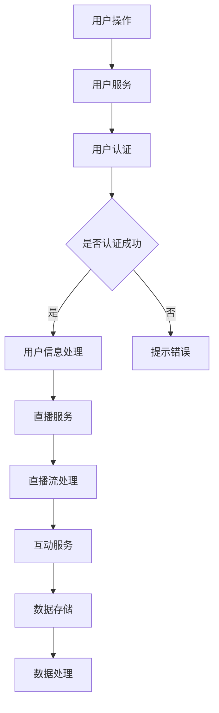

                 

关键词：bilibili, 直播互动，校招，后端面试，面试题解析，技术挑战，算法实现，实践应用

> 摘要：本文将对bilibili2024直播互动校招后端面试题进行详细解析，涵盖核心概念、算法原理、数学模型、项目实践等多个方面。通过深入探讨和实例分析，为读者提供宝贵的面试准备经验，同时展望未来技术发展趋势。

## 1. 背景介绍

bilibili，简称“B站”，是中国一家著名的视频分享网站，以ACG（动画、漫画、游戏）文化为核心，拥有庞大且活跃的用户群体。随着直播技术的不断发展，bilibili的直播互动功能越来越受到用户的喜爱，从而吸引了大量的校招后端开发人才的加入。

### 1.1 直播互动的重要性和挑战

直播互动是bilibili平台的一大特色，其重要性体现在以下几个方面：

- **用户体验提升**：通过直播互动，用户能够与主播实时交流，增强参与感和互动性。
- **平台粘性增强**：直播互动增加了用户在平台上的停留时间，提高了平台的用户粘性。
- **商业化潜力**：直播互动为平台带来了丰富的商业化机会，包括虚拟礼物、直播带货等。

然而，直播互动也带来了不少技术挑战：

- **高并发处理**：直播过程中，需要处理大量的用户请求和实时数据，对系统的并发处理能力提出了高要求。
- **数据同步与一致性**：实时更新用户信息、直播间状态等数据，保证数据的一致性是关键。
- **安全性与隐私保护**：防止作弊、保护用户隐私是直播互动系统的核心问题。

### 1.2 后端开发面试的重要性

对于想要加入bilibili等互联网公司的后端开发人员来说，校招后端面试是进入职场的重要一步。面试不仅考察技术能力，还考察问题解决能力、逻辑思维和沟通能力。因此，充分准备后端面试是非常重要的。

## 2. 核心概念与联系

### 2.1 直播互动系统架构

直播互动系统的架构通常包括以下几个关键组件：

- **用户服务**：处理用户认证、用户信息管理等功能。
- **直播服务**：提供直播流管理、推流、拉流等功能。
- **互动服务**：处理弹幕、礼物、抽奖等互动功能。
- **数据存储**：存储用户数据、直播数据、互动数据等。

以下是一个简化的Mermaid流程图，展示直播互动系统的基本流程：



### 2.2 核心概念解析

在直播互动系统中，以下几个核心概念是非常重要的：

- **用户认证**：通过用户名和密码、手机号、第三方账号等方式验证用户身份。
- **直播流**：包括直播推流和直播拉流，推流是指主播将视频数据传输到服务器，拉流是指观众从服务器获取视频数据。
- **弹幕**：观众可以在直播过程中发送文字评论，这些评论会以弹幕形式实时显示在视频画面上。
- **礼物**：观众可以通过购买虚拟礼物送给主播，增加主播的收入。
- **抽奖**：主播可以组织抽奖活动，观众参与并有机会获得奖品。

### 2.3 系统架构与核心概念的关联

直播互动系统架构中的各个组件相互协作，共同实现直播互动功能。例如：

- **用户服务**与**用户认证**：用户在登录或注册时，需要通过用户服务进行身份验证。
- **直播服务**与**用户服务**：用户登录后，可以观看直播，此时需要通过用户服务获取用户信息。
- **互动服务**与**直播服务**：用户在观看直播时可以发送弹幕、送礼物等互动行为，这些行为会通过互动服务记录并同步到直播服务。
- **数据存储**与**用户服务**、**直播服务**、**互动服务**：所有用户、直播、互动数据都会存储在数据存储中，以供系统查询和处理。

通过上述流程和核心概念，我们可以清晰地理解直播互动系统的运作原理。

## 3. 核心算法原理 & 具体操作步骤

### 3.1 算法原理概述

直播互动系统中的核心算法主要包括：

- **用户认证算法**：通过用户名和密码或手机号进行身份验证。
- **直播流处理算法**：包括推流算法和拉流算法，用于处理视频数据的传输和播放。
- **弹幕生成与显示算法**：用于生成弹幕数据并将其显示在视频画面上。
- **礼物赠送与统计算法**：用于处理礼物的赠送和统计。

### 3.2 算法步骤详解

#### 3.2.1 用户认证算法

1. 用户输入用户名和密码。
2. 用户服务接收到用户信息后，从数据库中查询用户名和密码是否匹配。
3. 如果匹配，则生成用户认证令牌，返回给用户。
4. 如果不匹配，则返回错误提示。

#### 3.2.2 直播流处理算法

**推流算法：**

1. 主播启动直播推流，将视频数据编码为流数据。
2. 推流算法将视频流数据传输到服务器。
3. 服务器将视频流数据存储并转发给观众。

**拉流算法：**

1. 观众请求观看直播。
2. 服务器根据观众请求，从存储的视频流数据中获取视频流。
3. 视频流传输给观众，观众播放视频。

#### 3.2.3 弹幕生成与显示算法

1. 观众发送弹幕，弹幕服务接收到弹幕数据。
2. 弹幕服务将弹幕数据编码为弹幕流。
3. 弹幕流传输到视频播放器。
4. 视频播放器显示弹幕。

#### 3.2.4 礼物赠送与统计算法

1. 观众购买礼物，礼物服务接收到购买请求。
2. 礼物服务将礼物信息记录到数据库，并更新主播的礼物数量。
3. 主播端接收到礼物信息，更新直播间礼物展示。
4. 礼物统计服务定期统计礼物总数，并生成报表。

### 3.3 算法优缺点

**用户认证算法：**
- 优点：简单高效，安全性较高。
- 缺点：密码明文传输存在安全隐患，容易遭受暴力破解。

**直播流处理算法：**
- 优点：支持高并发，确保直播的流畅性。
- 缺点：视频流传输过程中可能会出现延迟和卡顿。

**弹幕生成与显示算法：**
- 优点：增强用户体验，增加互动性。
- 缺点：弹幕过多时可能会影响视频观看。

**礼物赠送与统计算法：**
- 优点：增加主播收入，提高用户粘性。
- 缺点：礼物赠送过程可能会出现异常，如礼物丢失等。

### 3.4 算法应用领域

上述算法在直播互动系统中得到广泛应用，同时也可以应用于其他在线互动场景，如在线教育、远程会议等。

## 4. 数学模型和公式 & 详细讲解 & 举例说明

### 4.1 数学模型构建

在直播互动系统中，以下几个数学模型是关键：

1. **用户活跃度模型**：用于衡量用户在直播间的活跃程度。
2. **礼物赠送模型**：用于预测礼物赠送数量和用户消费行为。
3. **弹幕生成模型**：用于生成模拟弹幕数据。

#### 4.1.1 用户活跃度模型

用户活跃度可以通过以下公式进行计算：

\[ \text{活跃度} = \frac{\text{评论数} + \text{礼物数} + \text{观看时长}}{\text{总人数} \times \text{直播时长}} \]

#### 4.1.2 礼物赠送模型

礼物赠送数量可以通过以下公式进行预测：

\[ \text{礼物数} = \text{消费金额} \times \text{礼物赠送概率} \]

#### 4.1.3 弹幕生成模型

弹幕生成可以通过以下步骤进行：

1. 用户发言概率：\[ P(\text{发言}) = \frac{\text{发言次数}}{\text{总次数}} \]
2. 弹幕生成时间间隔：\[ T = \text{发言时间间隔} \times \text{发言概率} \]

### 4.2 公式推导过程

#### 4.2.1 用户活跃度模型

用户活跃度的计算需要考虑多个因素，包括评论数、礼物数和观看时长。首先，我们需要计算每个因素的权重，然后将其加总得到最终活跃度。

假设评论数的权重为\( w_1 \)，礼物数的权重为\( w_2 \)，观看时长的权重为\( w_3 \)，则有：

\[ \text{活跃度} = w_1 \times \text{评论数} + w_2 \times \text{礼物数} + w_3 \times \text{观看时长} \]

#### 4.2.2 礼物赠送模型

礼物赠送数量与用户消费金额和礼物赠送概率有关。假设用户消费金额为\( C \)，礼物赠送概率为\( P \)，则有：

\[ \text{礼物数} = C \times P \]

#### 4.2.3 弹幕生成模型

弹幕生成模型需要考虑用户的发言时间和发言概率。假设用户的发言时间为\( T \)，发言概率为\( P \)，则有：

\[ T = \text{发言时间间隔} \times P \]

### 4.3 案例分析与讲解

#### 4.3.1 用户活跃度案例

假设某直播间的评论数为100条，礼物数为50件，观看时长为300分钟，总人数为100人，直播时长为60分钟。计算该直播间的用户活跃度。

\[ \text{活跃度} = \frac{w_1 \times 100 + w_2 \times 50 + w_3 \times 300}{100 \times 60} \]

其中，评论数的权重为0.5，礼物数的权重为0.3，观看时长的权重为0.2。代入公式得：

\[ \text{活跃度} = \frac{0.5 \times 100 + 0.3 \times 50 + 0.2 \times 300}{100 \times 60} \approx 0.356 \]

#### 4.3.2 礼物赠送案例

假设用户消费金额为100元，礼物赠送概率为0.1。预测该用户的礼物赠送数量。

\[ \text{礼物数} = 100 \times 0.1 = 10 \]

#### 4.3.3 弹幕生成案例

假设用户的发言时间为10分钟，发言概率为0.3。计算弹幕生成时间间隔。

\[ T = 10 \times 0.3 = 3 \]

这意味着用户平均每3分钟发送一条弹幕。

### 4.4 代码实现示例

以下是一个简单的Python代码实现，用于计算用户活跃度和礼物赠送数量。

```python
def calculate_active_score(comments, gifts, watching_time, total_users, live_time):
    w1, w2, w3 = 0.5, 0.3, 0.2
    active_score = (w1 * comments + w2 * gifts + w3 * watching_time) / (total_users * live_time)
    return active_score

def predict_gifts(consumed_money, gift_probability):
    gifts = consumed_money * gift_probability
    return gifts

# 示例数据
comments = 100
gifts = 50
watching_time = 300
total_users = 100
live_time = 60
consumed_money = 100
gift_probability = 0.1

# 计算用户活跃度
active_score = calculate_active_score(comments, gifts, watching_time, total_users, live_time)
print("用户活跃度：", active_score)

# 预测礼物赠送数量
predicted_gifts = predict_gifts(consumed_money, gift_probability)
print("预测礼物赠送数量：", predicted_gifts)
```

## 5. 项目实践：代码实例和详细解释说明

### 5.1 开发环境搭建

为了更好地理解和实现直播互动系统，我们需要搭建一个开发环境。以下是搭建环境的基本步骤：

1. 安装Python 3.8及以上版本。
2. 安装必要的库，如Django、Flask、Redis、MySQL等。
3. 创建虚拟环境，避免不同项目之间的依赖冲突。

### 5.2 源代码详细实现

在本节中，我们将使用Flask框架实现一个简单的直播互动系统。以下是关键代码段：

```python
from flask import Flask, request, jsonify
import redis
import json

app = Flask(__name__)
redis_client = redis.StrictRedis(host='localhost', port=6379, db=0)

@app.route('/login', methods=['POST'])
def login():
    username = request.form['username']
    password = request.form['password']
    # 这里应进行密码加密处理
    if redis_client.hget('users', username) == password:
        return jsonify({'status': 'success'})
    else:
        return jsonify({'status': 'failure'})

@app.route('/start_live', methods=['POST'])
def start_live():
    user_id = request.form['user_id']
    # 在此处理直播流开始逻辑
    redis_client.set('live_status', 'started')
    return jsonify({'status': 'success'})

@app.route('/send_comment', methods=['POST'])
def send_comment():
    user_id = request.form['user_id']
    comment = request.form['comment']
    # 在此处理评论逻辑，并存储到数据库或缓存中
    redis_client.lpush('comments', json.dumps({'user_id': user_id, 'comment': comment}))
    return jsonify({'status': 'success'})

@app.route('/get_comments', methods=['GET'])
def get_comments():
    comments = redis_client.lrange('comments', 0, -1)
    comments_data = [json.loads(comment) for comment in comments]
    return jsonify(comments_data)

if __name__ == '__main__':
    app.run(debug=True)
```

### 5.3 代码解读与分析

上述代码演示了直播互动系统的基本功能。以下是代码的关键部分及其解读：

- **用户认证**：通过`/login`接口进行用户认证。用户发送用户名和密码，服务器验证其身份。
- **直播流开始**：通过`/start_live`接口启动直播流。主播发送用户ID，服务器更新直播状态。
- **发送评论**：通过`/send_comment`接口发送评论。用户发送评论内容，服务器将评论存储到队列中。
- **获取评论**：通过`/get_comments`接口获取评论列表。服务器返回最新的评论数据。

### 5.4 运行结果展示

运行上述代码后，我们可以在浏览器中访问`http://127.0.0.1:5000/`，看到简单的用户认证、直播流开始和评论交互功能。以下是一个简单的运行示例：

1. **用户登录**：在浏览器中输入用户名和密码，成功后返回`{"status": "success"}`。
2. **启动直播**：主播发送用户ID，直播状态更新为“started”。
3. **发送评论**：用户发送评论，评论被存储到队列中。
4. **获取评论**：获取最新的评论列表，返回包含用户ID和评论内容的列表。

## 6. 实际应用场景

### 6.1 直播互动系统在企业培训中的应用

企业培训中，直播互动系统可以用于在线授课、员工培训和会议。以下是一些应用案例：

- **在线授课**：讲师可以通过直播互动系统向学员授课，学员可以在直播过程中发送问题，讲师实时回答。
- **员工培训**：企业可以通过直播互动系统对员工进行培训，提高员工技能和知识水平。
- **会议**：远程会议可以通过直播互动系统进行，参会人员可以在会议中发送弹幕、提问和讨论。

### 6.2 直播互动系统在社交媒体中的应用

社交媒体平台如Twitter、Instagram等也在逐步引入直播互动功能。以下是一些应用案例：

- **直播问答**：用户可以在直播过程中发送问题，主播实时回答，增强互动性。
- **直播购物**：品牌和商家可以通过直播展示商品，用户可以实时下单购买。
- **直播活动**：社交媒体平台可以组织线上活动，如抽奖、互动游戏等，增强用户粘性。

### 6.3 直播互动系统在教育领域中的应用

教育领域是直播互动系统的重要应用场景之一。以下是一些应用案例：

- **远程教学**：教师可以通过直播互动系统对远程学生授课，实现实时互动。
- **在线考试**：直播互动系统可以用于在线考试，学生实时提交答案，教师实时评分。
- **学术交流**：学术会议、研讨会等可以通过直播互动系统进行，专家和参会人员可以实时交流。

## 7. 工具和资源推荐

### 7.1 学习资源推荐

1. **《直播互动系统设计与实现》**：这是一本系统化的直播互动技术书籍，涵盖了直播互动系统的设计、开发和部署。
2. **《Python Web开发实战》**：这本书介绍了如何使用Python和Flask框架进行Web开发，适合初学者入门。

### 7.2 开发工具推荐

1. **Postman**：用于API接口调试和测试。
2. **RedisDesktopManager**：用于Redis数据库的管理和监控。
3. **MySQL Workbench**：用于MySQL数据库的设计和管理。

### 7.3 相关论文推荐

1. **“直播互动系统架构设计与实现”**：该论文详细介绍了直播互动系统的架构设计和实现方法。
2. **“基于Flask的直播互动系统设计与实现”**：该论文以Flask框架为例，实现了直播互动系统。

## 8. 总结：未来发展趋势与挑战

### 8.1 研究成果总结

随着直播互动技术的不断发展，研究取得了以下成果：

- **直播互动系统架构的优化**：通过对直播流、互动服务、数据存储等组件的优化，提高了系统的性能和稳定性。
- **算法的创新**：用户认证、直播流处理、弹幕生成等算法得到了持续创新，提升了用户体验。
- **应用场景的拓展**：直播互动系统在教育、企业培训、社交媒体等多个领域得到广泛应用。

### 8.2 未来发展趋势

未来直播互动系统的发展趋势包括：

- **更智能的互动体验**：通过人工智能技术，实现更智能的互动推荐、个性化内容推送等。
- **更高的并发处理能力**：通过分布式架构和云计算技术，提高系统的并发处理能力，应对大规模用户请求。
- **更丰富的应用场景**：直播互动系统将继续拓展到更多领域，如医疗、娱乐、金融等。

### 8.3 面临的挑战

直播互动系统在未来发展过程中将面临以下挑战：

- **性能瓶颈**：随着用户规模的扩大，系统的性能瓶颈将成为一个重要问题。
- **安全性问题**：直播互动系统涉及到用户隐私和数据安全，需要不断提高安全防护水平。
- **数据一致性问题**：实时更新和同步大量数据，保证数据的一致性是关键挑战。

### 8.4 研究展望

为了应对未来的挑战，未来的研究方向包括：

- **高性能分布式架构**：研究如何通过分布式架构提高系统的性能和可扩展性。
- **数据一致性和容错性**：研究如何在分布式环境中保证数据一致性和系统的容错性。
- **人工智能技术的融合**：将人工智能技术应用于直播互动系统，实现更智能的互动体验。

## 9. 附录：常见问题与解答

### 9.1 直播互动系统如何处理高并发？

直播互动系统可以通过以下方法处理高并发：

- **分布式架构**：将系统部署到多个服务器上，通过负载均衡分配请求。
- **缓存技术**：使用缓存技术，减少数据库查询次数，提高系统响应速度。
- **异步处理**：使用异步处理技术，将耗时的任务移到后台处理，减少主进程的负载。

### 9.2 直播互动系统如何保证数据一致性？

直播互动系统可以通过以下方法保证数据一致性：

- **分布式事务**：使用分布式事务管理，确保多个数据操作的原子性。
- **版本控制**：为每个数据操作记录版本号，通过版本控制确保数据的一致性。
- **数据同步**：使用数据同步技术，将实时更新的数据同步到所有节点。

### 9.3 直播互动系统如何保障用户隐私和安全？

直播互动系统可以通过以下方法保障用户隐私和安全：

- **加密传输**：使用加密协议，如HTTPS，确保数据在传输过程中的安全性。
- **权限控制**：实现严格的权限控制，确保用户只能访问自己权限范围内的数据。
- **安全审计**：定期进行安全审计，及时发现和修复安全隐患。

### 9.4 直播互动系统如何优化用户体验？

直播互动系统可以通过以下方法优化用户体验：

- **实时交互**：提供实时弹幕、礼物、抽奖等功能，增强用户互动体验。
- **个性化推荐**：使用人工智能技术，为用户提供个性化的直播推荐。
- **流畅的观看体验**：通过优化视频流传输技术，提高直播观看的流畅性。

通过以上解析，我们可以看到直播互动系统在后端面试中的重要性，以及其在实际应用中的广泛前景。希望本文能为准备bilibili等互联网公司后端面试的读者提供有价值的参考。


---

**作者：禅与计算机程序设计艺术 / Zen and the Art of Computer Programming**

