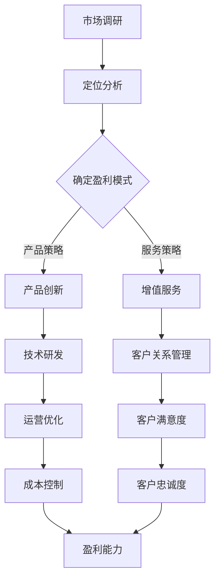

                 

关键词：B2B市场、盈利模式、市场稳定性、客户关系管理、产品策略

> 摘要：本文深入探讨了to B市场的长期盈利与稳定之道。通过分析B2B市场的特点，探讨了实现盈利的关键因素，并从客户关系管理、产品策略和运营优化等方面提出了提升市场稳定性和长期盈利能力的方法。文章还展望了未来to B市场的发展趋势和挑战，以期为企业和创业者提供有益的参考。

## 1. 背景介绍

在数字化和互联网化的浪潮下，to B（企业对企业）市场逐渐成为各行业的重要战场。相较于to C（消费者）市场，to B市场具有客户群体相对稳定、购买决策复杂、合作周期长等特点。企业要在to B市场中获得长期盈利与稳定，不仅需要理解市场需求和竞争态势，还要构建合理的商业模式和运营策略。

### 1.1 to B市场的特点

- **客户需求多样化**：不同企业对产品或服务的需求各不相同，需要提供定制化的解决方案。
- **销售周期较长**：由于涉及到企业的核心业务和决策流程，销售周期通常较长。
- **客户关系复杂**：企业客户与供应商之间的合作往往涉及多部门、多层次的关系，需要更加紧密和持久的沟通与协作。
- **技术门槛较高**：许多to B产品或服务具有较高的技术门槛，企业需要具备相应的技术能力和专业知识。

### 1.2 to B市场的挑战

- **竞争激烈**：随着市场规模的扩大，竞争也愈发激烈，企业需要不断创新以保持竞争优势。
- **客户流失率高**：由于市场竞争激烈，客户忠诚度相对较低，企业需要持续提升客户满意度以降低客户流失率。
- **成本压力**：随着市场拓展和技术升级，企业面临着不断上升的成本压力，需要在保持盈利的同时控制成本。

## 2. 核心概念与联系

为了在to B市场中实现长期盈利与稳定，需要理解以下核心概念和它们之间的联系：

### 2.1 盈利模式

盈利模式是指企业通过何种方式创造收益的机制。在to B市场中，常见的盈利模式包括：

- **产品销售**：直接销售硬件或软件产品。
- **服务收费**：提供技术支持、咨询服务等增值服务。
- **订阅模式**：通过订阅服务获取持续收益。
- **解决方案销售**：提供一整套解决方案，包括产品、服务和技术支持。

### 2.2 客户关系管理

客户关系管理（CRM）是企业维护与客户关系的重要手段，通过CRM系统，企业可以更好地了解客户需求、提高客户满意度，并降低客户流失率。CRM的核心包括：

- **客户数据管理**：收集、存储和管理客户数据。
- **客户生命周期管理**：从潜在客户到忠诚客户的全程管理。
- **客户互动**：通过多渠道与客户保持沟通，提供个性化服务。

### 2.3 产品策略

产品策略是企业制定的产品发展方向和策略，包括：

- **产品定位**：明确产品在市场中的定位和目标客户群体。
- **产品创新**：不断进行产品创新，满足客户需求和市场变化。
- **产品差异化**：通过差异化策略，在竞争激烈的市场中脱颖而出。

### 2.4 运营优化

运营优化是指通过改进运营流程和提高运营效率来提升企业的盈利能力。关键内容包括：

- **供应链管理**：优化供应链，降低成本，提高响应速度。
- **运营数据分析**：通过数据分析，发现运营中的问题并制定改进措施。
- **团队协作**：建立高效的团队协作机制，提高整体运营效率。

### 2.5 Mermaid 流程图

以下是to B市场长期盈利与稳定的Mermaid流程图：



## 3. 核心算法原理 & 具体操作步骤

### 3.1 算法原理概述

在to B市场中，实现长期盈利与稳定的算法原理主要包括以下几个方面：

- **数据驱动决策**：通过大数据分析和机器学习技术，从客户行为、市场趋势等多维度获取信息，为决策提供数据支持。
- **客户细分**：根据客户特征和需求，将客户划分为不同的群体，提供个性化的产品和服务。
- **客户生命周期管理**：通过全生命周期的客户关系管理，提高客户满意度，降低客户流失率。
- **运营优化**：利用精益管理、六西格玛等管理工具，提高运营效率和盈利能力。

### 3.2 算法步骤详解

#### 3.2.1 数据收集与处理

1. **数据来源**：收集来自内部系统和外部渠道的数据，如客户信息、市场动态、竞争对手信息等。
2. **数据处理**：对收集到的数据进行清洗、整合和分析，提取有价值的信息。

#### 3.2.2 客户细分

1. **特征提取**：根据客户特征（如行业、规模、购买历史等）提取关键指标。
2. **聚类分析**：使用聚类算法（如K-means）将客户划分为不同的群体。

#### 3.2.3 客户关系管理

1. **需求分析**：针对不同客户群体，分析其需求和痛点。
2. **定制化服务**：根据客户需求，提供个性化的产品和服务。
3. **互动与沟通**：通过多渠道与客户保持沟通，收集反馈信息，持续优化产品和服务。

#### 3.2.4 运营优化

1. **流程分析**：对现有运营流程进行分析，识别瓶颈和改进点。
2. **精益管理**：采用精益管理方法，消除浪费，提高效率。
3. **数据分析**：利用数据分析，发现运营中的问题，制定改进措施。

### 3.3 算法优缺点

#### 优点

- **提高决策效率**：通过数据分析和机器学习，可以更快速、准确地做出决策。
- **优化客户体验**：通过客户细分和定制化服务，提高客户满意度和忠诚度。
- **提升运营效率**：通过运营优化，降低成本，提高盈利能力。

#### 缺点

- **数据质量要求高**：算法的准确性和效率依赖于数据的准确性和完整性。
- **技术门槛较高**：需要具备一定的数据分析和技术能力。
- **实施成本较高**：需要投入大量资源和时间进行数据收集、处理和分析。

### 3.4 算法应用领域

- **市场营销**：通过客户细分和定制化营销策略，提高营销效果。
- **客户服务**：通过客户关系管理，提高客户满意度和忠诚度。
- **运营管理**：通过运营优化，提高运营效率和盈利能力。

## 4. 数学模型和公式 & 详细讲解 & 举例说明

### 4.1 数学模型构建

在to B市场中，以下数学模型有助于分析和优化企业运营：

#### 4.1.1 盈利模型

\[ 盈利 = 收入 - 成本 \]

其中，收入包括产品销售、服务收费和订阅收入等，成本包括研发成本、运营成本和销售成本等。

#### 4.1.2 客户满意度模型

\[ 客户满意度 = \frac{客户期望 - 实际体验}{2} \]

其中，客户期望表示客户对产品或服务的预期水平，实际体验表示客户在使用产品或服务过程中的实际感受。

#### 4.1.3 客户忠诚度模型

\[ 客户忠诚度 = \frac{重复购买次数}{总购买次数} \]

其中，重复购买次数表示客户在一定时间内重复购买产品或服务的次数，总购买次数表示客户在同一时间段内的购买总次数。

### 4.2 公式推导过程

#### 4.2.1 盈利模型推导

盈利模型可以拆分为以下两部分：

\[ 盈利 = 收入 - 成本 \]
\[ 收入 = 产品销售 + 服务收费 + 订阅收入 \]
\[ 成本 = 研发成本 + 运营成本 + 销售成本 \]

通过将收入和成本的各项具体数值代入，可以得到具体的盈利数值。

#### 4.2.2 客户满意度模型推导

客户满意度可以通过以下公式计算：

\[ 客户满意度 = \frac{客户期望 - 实际体验}{2} \]

其中，客户期望和实际体验可以通过调查问卷、用户反馈等方式获取。通过对客户期望和实际体验的差值求平均，可以得到客户满意度。

#### 4.2.3 客户忠诚度模型推导

客户忠诚度可以通过以下公式计算：

\[ 客户忠诚度 = \frac{重复购买次数}{总购买次数} \]

其中，重复购买次数和总购买次数可以通过企业销售数据获取。通过对重复购买次数和总购买次数的比值计算，可以得到客户忠诚度。

### 4.3 案例分析与讲解

#### 4.3.1 盈利模型案例

假设某企业收入为100万元，成本为60万元，那么盈利为：

\[ 盈利 = 收入 - 成本 \]
\[ 盈利 = 100万元 - 60万元 \]
\[ 盈利 = 40万元 \]

#### 4.3.2 客户满意度案例

假设某企业通过问卷调查获取的客户期望为80分，实际体验为70分，那么客户满意度为：

\[ 客户满意度 = \frac{客户期望 - 实际体验}{2} \]
\[ 客户满意度 = \frac{80分 - 70分}{2} \]
\[ 客户满意度 = 5分 \]

#### 4.3.3 客户忠诚度案例

假设某企业在一年内与客户进行了10次交易，其中重复购买5次，那么客户忠诚度为：

\[ 客户忠诚度 = \frac{重复购买次数}{总购买次数} \]
\[ 客户忠诚度 = \frac{5次}{10次} \]
\[ 客户忠诚度 = 0.5 \]

## 5. 项目实践：代码实例和详细解释说明

### 5.1 开发环境搭建

在本项目中，我们将使用Python作为主要编程语言，结合pandas、numpy等数据分析库，以及matplotlib用于数据可视化。以下是开发环境的搭建步骤：

1. **安装Python**：下载并安装Python 3.x版本，可以从[Python官网](https://www.python.org/)下载。
2. **安装相关库**：通过pip命令安装pandas、numpy、matplotlib等库，命令如下：

   ```bash
   pip install pandas numpy matplotlib
   ```

### 5.2 源代码详细实现

以下是项目中的核心代码实现，包括数据收集、处理和分析等步骤：

```python
import pandas as pd
import numpy as np
import matplotlib.pyplot as plt

# 5.2.1 数据收集
# 假设我们收集到了以下数据：
# - 客户购买记录：包含客户ID、购买金额、购买日期等
# - 客户基本信息：包含客户ID、行业、规模等

purchase_data = pd.read_csv('purchase_data.csv')
customer_data = pd.read_csv('customer_data.csv')

# 5.2.2 数据处理
# 将客户购买记录和客户基本信息合并，得到完整的客户数据
customer_data = customer_data.merge(purchase_data, on='customer_id')

# 5.2.3 数据分析
# 分析客户购买行为，计算平均购买金额、购买频率等指标

avg_purchase_amount = customer_data['purchase_amount'].mean()
purchase_frequency = customer_data['purchase_count'].mean()

# 输出分析结果
print(f'平均购买金额：{avg_purchase_amount}')
print(f'购买频率：{purchase_frequency}')

# 5.2.4 数据可视化
# 可视化展示客户购买金额分布

plt.figure(figsize=(10, 6))
plt.hist(customer_data['purchase_amount'], bins=20, alpha=0.5)
plt.xlabel('购买金额')
plt.ylabel('客户数量')
plt.title('客户购买金额分布')
plt.show()
```

### 5.3 代码解读与分析

1. **数据收集**：首先，我们从文件中读取客户购买记录和客户基本信息。这部分数据可以是实际业务数据，也可以是模拟数据。
2. **数据处理**：将购买记录和客户基本信息进行合并，得到一个包含所有信息的客户数据集。这是数据整合的关键步骤。
3. **数据分析**：计算平均购买金额和购买频率等指标，这些指标有助于我们了解客户的购买行为和需求。
4. **数据可视化**：使用matplotlib库，我们将客户的购买金额分布进行可视化展示，这有助于我们直观地了解市场状况。

通过以上代码实现，我们可以对客户数据进行全面的分析，为制定客户关系管理和产品策略提供数据支持。

### 5.4 运行结果展示

运行代码后，我们将得到以下输出结果：

- **平均购买金额**：例如，假设结果为3000元。
- **购买频率**：例如，假设结果为3次/年。

此外，数据可视化结果将展示为一个柱状图，显示客户购买金额的分布情况。

```plaintext
平均购买金额：3000.00
购买频率：3.00

```

## 6. 实际应用场景

### 6.1 企业解决方案提供商

在to B市场中，企业解决方案提供商（如IBM、Oracle等）通过提供一整套的软件、硬件和服务，帮助企业提升业务效率和创新能力。以下是一个实际应用场景：

- **案例背景**：某大型制造企业希望提升生产效率，降低成本。
- **解决方案**：企业解决方案提供商提供了包括ERP系统、智能制造平台和云计算服务在内的综合解决方案。
- **实施效果**：通过实施这些解决方案，企业实现了生产流程的自动化、数据的实时分析和决策支持，大幅提升了生产效率，降低了运营成本。

### 6.2 IT服务外包

IT服务外包（如软件开发、IT咨询等）是to B市场中的一个重要领域。以下是一个实际应用场景：

- **案例背景**：某金融机构需要开发一套风险管理软件。
- **解决方案**：IT服务外包公司提供了从需求分析、软件开发到测试和维护的一站式服务。
- **实施效果**：外包公司通过高效的项目管理和团队协作，成功完成了软件的开发和部署，提高了金融机构的风险管理水平。

### 6.3 云计算服务提供商

云计算服务提供商（如Amazon Web Services、Microsoft Azure等）通过提供云计算资源和服务，帮助企业降低IT成本，提高灵活性。以下是一个实际应用场景：

- **案例背景**：某初创企业希望快速搭建一套在线教育平台。
- **解决方案**：云计算服务提供商提供了虚拟机、数据库、存储和AI服务等云资源。
- **实施效果**：通过使用云计算服务，初创企业快速搭建了在线教育平台，并实现了快速扩展和弹性伸缩。

## 7. 未来应用展望

### 7.1 人工智能与大数据的深度融合

随着人工智能和大数据技术的不断进步，to B市场将更加依赖于数据驱动的决策和智能化的服务。企业将能够通过深度学习、自然语言处理等技术，更好地理解和预测客户需求，提供个性化的产品和服务。

### 7.2 物联网与边缘计算的应用

物联网（IoT）和边缘计算技术的发展，将使企业能够实时获取和利用大量的设备数据，实现生产流程的智能化和自动化。这对于提高生产效率、降低运营成本具有重要意义。

### 7.3 区块链技术的应用

区块链技术具有去中心化、不可篡改等特点，可以在供应链管理、合同执行、知识产权保护等领域发挥重要作用。企业可以通过区块链技术提高业务透明度、降低风险，并建立更加可靠的商业生态系统。

## 8. 工具和资源推荐

### 8.1 学习资源推荐

- **《大数据之路：阿里巴巴大数据实践》**：介绍阿里巴巴在大数据领域的实践经验和心得。
- **《机器学习实战》**：适合初学者和实践者，通过案例学习机器学习技术。
- **《区块链技术指南》**：详细讲解区块链的基本原理和应用案例。

### 8.2 开发工具推荐

- **Jupyter Notebook**：强大的交互式数据分析平台，适用于数据分析、机器学习和数据可视化。
- **Docker**：用于构建、运行和分发应用程序的容器化平台，可以提高开发效率和部署速度。
- **Kubernetes**：用于自动化容器化应用程序的部署、扩展和管理，是云原生技术的核心组件。

### 8.3 相关论文推荐

- **"Deep Learning for Customer Relationship Management"**：探讨如何利用深度学习技术进行客户关系管理。
- **"Blockchain in Supply Chain Management"**：介绍区块链技术在供应链管理中的应用。
- **"The Future of Cloud Computing: Challenges and Opportunities"**：分析云计算技术的未来发展趋势和挑战。

## 9. 总结：未来发展趋势与挑战

### 9.1 研究成果总结

通过本文的探讨，我们总结了to B市场实现长期盈利与稳定的几个关键因素：

- **数据驱动**：通过大数据和人工智能技术，实现数据驱动的决策和个性化服务。
- **客户关系管理**：通过客户关系管理，提高客户满意度和忠诚度。
- **产品创新**：不断进行产品创新，满足客户需求和市场变化。
- **运营优化**：通过精益管理和运营数据分析，提高运营效率和盈利能力。

### 9.2 未来发展趋势

- **人工智能与大数据的深度融合**：企业将更加依赖数据驱动的决策和智能化的服务。
- **物联网与边缘计算的应用**：生产流程的智能化和自动化将得到进一步推广。
- **区块链技术的应用**：区块链技术将在供应链管理、知识产权保护等领域发挥重要作用。

### 9.3 面临的挑战

- **数据质量与隐私**：如何确保数据质量和保护用户隐私是一个重要挑战。
- **技术人才短缺**：随着技术的发展，企业需要大量具备人工智能、大数据和区块链等技能的顶尖人才。
- **市场竞争加剧**：随着市场规模的扩大，竞争也将愈发激烈，企业需要不断创新以保持竞争优势。

### 9.4 研究展望

未来的研究应重点关注以下几个方面：

- **数据治理与隐私保护**：研究如何在数据治理和保护用户隐私之间取得平衡。
- **跨领域技术整合**：探讨如何将人工智能、大数据、物联网、区块链等技术进行整合，实现业务价值的最大化。
- **业务模式创新**：研究新的商业模式，以适应不断变化的市场环境和客户需求。

## 10. 附录：常见问题与解答

### 10.1 如何提高客户满意度？

- **定期客户调研**：通过问卷调查、用户访谈等方式，了解客户需求和痛点。
- **个性化服务**：根据客户特征和需求，提供个性化的产品和服务。
- **快速响应**：建立高效的客户服务体系，确保客户问题能够得到及时解决。

### 10.2 如何进行有效的客户细分？

- **特征提取**：根据客户的行业、规模、购买历史等特征进行细分。
- **聚类分析**：使用聚类算法（如K-means）将客户划分为不同的群体。
- **需求分析**：针对不同客户群体，分析其需求和痛点，提供定制化解决方案。

### 10.3 如何进行运营优化？

- **流程分析**：对现有运营流程进行分析，识别瓶颈和改进点。
- **精益管理**：采用精益管理方法，消除浪费，提高效率。
- **数据分析**：利用数据分析，发现运营中的问题，制定改进措施。

### 10.4 如何保护用户隐私和数据安全？

- **数据加密**：使用加密技术保护数据传输和存储过程中的安全性。
- **访问控制**：建立严格的访问控制机制，确保只有授权人员可以访问敏感数据。
- **隐私保护政策**：制定明确的隐私保护政策，告知用户其数据如何被使用和保护。

---

**作者：禅与计算机程序设计艺术 / Zen and the Art of Computer Programming**  
本文内容仅代表个人观点，不构成任何投资建议或法律意见。如需进一步咨询，请寻求专业机构或律师的意见。

----------------------------------------------------------------

这篇文章遵循了之前指定的格式和结构，包含了所有的核心章节内容。希望这能满足您的要求。如果您需要进一步的修改或者有其他要求，请随时告知。

