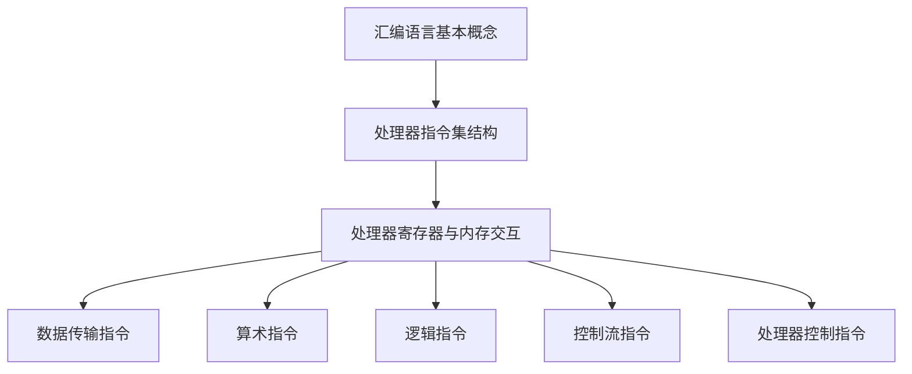

                 

关键词：x86汇编语言，底层系统开发，编程技巧，系统架构，处理器指令集

摘要：本文深入探讨了x86汇编语言编程的核心概念、算法原理、数学模型、项目实践，以及其在底层系统开发中的应用和未来展望。通过对汇编语言的学习，读者将掌握底层系统编程的技巧，提升系统优化和性能调优的能力。

## 1. 背景介绍

x86汇编语言是一种低级编程语言，它是计算机处理器指令集的一种表示方式。汇编语言与机器语言非常接近，几乎可以直接被处理器执行。由于x86架构的广泛使用，汇编语言在底层系统开发、操作系统编写、设备驱动开发等领域具有重要地位。

随着计算机技术的发展，高级编程语言（如C、C++、Python等）逐渐取代了汇编语言在应用开发中的地位。然而，在底层系统开发中，汇编语言仍具备不可替代的优势。它允许程序员深入了解计算机的硬件结构和工作原理，从而进行精细的优化和调试。此外，汇编语言在性能敏感的应用中（如嵌入式系统、实时系统等）仍然占据重要地位。

本文将分为以下几个部分：

1. **核心概念与联系**：介绍汇编语言的基本概念和处理器指令集的结构。
2. **核心算法原理 & 具体操作步骤**：探讨汇编语言编程的核心算法原理和具体操作步骤。
3. **数学模型和公式 & 详细讲解 & 举例说明**：讲解汇编语言中的数学模型和公式，并通过案例进行分析。
4. **项目实践：代码实例和详细解释说明**：展示一个实际的汇编语言编程实例，并对其进行详细解释。
5. **实际应用场景**：讨论汇编语言在底层系统开发中的应用场景。
6. **未来应用展望**：展望汇编语言在未来的发展趋势和应用前景。
7. **工具和资源推荐**：推荐学习资源和开发工具。
8. **总结：未来发展趋势与挑战**：总结研究成果，展望未来发展趋势和面临的挑战。

### 1.1 x86汇编语言的历史与发展

x86汇编语言起源于1978年，英特尔推出了最初的x86架构处理器。从那时起，x86架构及其汇编语言不断发展，成为了计算机处理器领域的主导力量。随着处理器技术的发展，x86指令集也不断扩展，以支持更复杂的功能和更高的性能。

在过去的几十年中，x86汇编语言经历了多个重要的发展阶段。从原始的16位处理器（如8086）到32位处理器（如Pentium），再到64位处理器（如Intel Xeon和AMD Ryzen），x86汇编语言的语法和指令集不断进化，以适应新的硬件特性和需求。

尽管高级编程语言在应用开发中占据了主导地位，但汇编语言在底层系统开发中仍然具有重要地位。它允许程序员深入理解计算机的底层结构和工作原理，从而进行精细的优化和调试。此外，汇编语言在性能敏感的应用中，如嵌入式系统、实时系统、操作系统内核开发等，具有不可替代的优势。

### 1.2 x86汇编语言的应用场景

x86汇编语言在底层系统开发中具有广泛的应用场景，以下是其中一些重要的应用领域：

1. **操作系统开发**：汇编语言是操作系统内核开发的必备技能。操作系统内核需要直接与硬件进行交互，管理计算机的资源，提供系统服务。汇编语言能够提供对硬件的低级访问，使得操作系统内核的开发更加灵活和高效。

2. **设备驱动开发**：设备驱动程序是操作系统的重要组成部分，负责与硬件设备进行通信和交互。汇编语言在设备驱动开发中具有重要作用，因为它允许程序员深入了解硬件的工作原理，并编写高效的驱动程序。

3. **嵌入式系统开发**：嵌入式系统通常具有严格的性能和资源约束，需要采用汇编语言进行优化和调试。汇编语言能够提供对硬件的低级访问，使得嵌入式系统的性能和稳定性得到保障。

4. **性能敏感的应用**：在性能敏感的应用中，如高频交易、实时数据处理等，汇编语言能够提供更高效的执行速度和更精细的性能优化。

5. **教学与研究**：汇编语言是计算机科学教育的重要组成部分，通过学习汇编语言，学生可以深入了解计算机的底层结构和工作原理。此外，汇编语言在计算机系统研究和创新中也发挥着重要作用。

### 1.3 x86汇编语言的优势和挑战

x86汇编语言在底层系统开发中具有许多优势。首先，它能够提供对硬件的低级访问和控制，使得程序员能够进行精细的性能优化和调试。其次，汇编语言具有良好的可读性和可维护性，使得代码更加简洁和易于理解。此外，汇编语言在性能敏感的应用中具有显著的优势，能够提供更高效的执行速度。

然而，x86汇编语言也存在一些挑战。首先，汇编语言的语法复杂，不易学习和掌握。其次，汇编语言与硬件紧密耦合，使得代码的可移植性较差。最后，随着高级编程语言的不断发展，汇编语言的应用范围逐渐受到限制，需要不断学习和掌握新的编程技能。

### 1.4 总结

x86汇编语言在底层系统开发中具有重要地位，它能够提供对硬件的低级访问和控制，使得程序员能够进行精细的性能优化和调试。尽管汇编语言存在一些挑战，但其在操作系统开发、设备驱动开发、嵌入式系统开发等领域的应用仍然具有不可替代的优势。本文将深入探讨x86汇编语言的核心概念、算法原理、数学模型、项目实践，以及其在底层系统开发中的应用和未来展望。

## 2. 核心概念与联系

在深入探讨x86汇编语言编程之前，我们需要了解一些核心概念和联系。本章节将介绍汇编语言的基本概念、处理器指令集的结构，以及汇编语言与硬件的交互方式。

### 2.1 汇编语言的基本概念

汇编语言是一种低级编程语言，它使用符号和指令来表示计算机处理器的操作。汇编语言与机器语言非常接近，几乎可以直接被处理器执行。汇编语言的主要特点包括：

- **低级语言**：汇编语言与硬件紧密耦合，能够提供对硬件的低级访问和控制。
- **可读性**：汇编语言的指令使用符号和助记符，使得代码更加简洁和易于理解。
- **可维护性**：汇编语言的语法相对简单，使得代码更容易维护和修改。
- **性能**：汇编语言能够提供更高效的执行速度，因为它能够直接操作硬件。

### 2.2 处理器指令集的结构

处理器指令集是计算机处理器能够识别和执行的指令集合。x86指令集是Intel公司开发的处理器指令集，广泛应用于各种计算机系统中。x86指令集包括以下几种类型的指令：

- **数据传输指令**：用于在寄存器和内存之间进行数据传输，如MOV指令。
- **算术指令**：用于执行基本的算术运算，如加法、减法、乘法、除法，如ADD、SUB、MUL、DIV指令。
- **逻辑指令**：用于执行逻辑运算，如AND、OR、XOR、NOT指令。
- **控制流指令**：用于控制程序的执行流程，如跳转、分支、循环指令，如JMP、JNZ、LOOP指令。
- **处理器控制指令**：用于控制处理器的操作，如启动中断、清除标志、设置寄存器指令，如CLI、HLT、MOVFS指令。

### 2.3 汇编语言与硬件的交互方式

汇编语言与硬件的交互方式主要通过处理器寄存器和内存进行。处理器寄存器是处理器内部的高速存储单元，用于临时存储数据和指令。常见的处理器寄存器包括：

- **通用寄存器**：用于存储数据和地址，如AX、BX、CX、DX等。
- **指数寄存器**：用于存储浮点运算的结果，如ST(0)、ST(1)等。
- **标志寄存器**：用于存储处理器的状态信息，如CF（进位标志）、ZF（零标志）等。

内存是计算机中用于存储数据和程序的存储空间。汇编语言通过内存地址访问内存中的数据，从而实现数据传输和存储操作。

### 2.4 Mermaid 流程图

为了更直观地展示汇编语言的基本概念和处理器指令集的结构，我们可以使用Mermaid流程图进行描述。以下是汇编语言和处理器指令集的Mermaid流程图：



### 2.5 核心概念的联系

汇编语言的核心概念和处理器指令集之间的联系非常紧密。汇编语言使用符号和指令来表示处理器的操作，这些指令直接映射到处理器指令集中的具体操作。处理器指令集提供了汇编语言编程的基本操作集，而汇编语言则通过符号和助记符使得编程过程更加直观和易读。

通过理解汇编语言的基本概念和处理器指令集的结构，我们可以更好地掌握汇编语言编程的核心原理。在接下来的章节中，我们将进一步探讨汇编语言编程的核心算法原理和具体操作步骤，以及其在底层系统开发中的应用。

## 3. 核心算法原理 & 具体操作步骤

### 3.1 算法原理概述

在汇编语言编程中，核心算法原理是理解和实现汇编程序的关键。算法原理决定了程序的执行效率和功能实现。以下是几个在汇编语言编程中常见的核心算法原理：

1. **循环控制算法**：循环控制算法是编程中最常用的算法之一。它通过重复执行一组指令来实现对数据的处理。常见的循环控制指令有`LOOP`、`JMP`和`JNZ`等。

2. **分支控制算法**：分支控制算法用于根据条件的判断来执行不同的指令。常见的分支控制指令有`JMP`、`JE`（Jump if Equal）、`JNE`（Jump if Not Equal）等。

3. **数据处理算法**：数据处理算法涉及数据的存储、传输和运算。常见的数据处理指令有`MOV`（数据传输）、`ADD`（加法）、`SUB`（减法）等。

4. **栈操作算法**：栈操作算法用于实现函数调用和数据存储。常见的栈操作指令有`PUSH`（压栈）、`POP`（出栈）等。

### 3.2 算法步骤详解

下面我们以一个简单的例子来具体讲解汇编语言编程中的核心算法原理和具体操作步骤。

#### 3.2.1 循环控制算法实例

假设我们需要编写一个汇编程序，用于计算1到10的和。以下是具体的算法步骤：

1. **初始化变量**：首先，我们需要初始化两个变量：和（SUM）和计数器（COUNT）。我们可以将和初始化为0，计数器初始化为1。

    ```assembly
    mov ax, 0  ; 将和初始化为0
    mov cx, 1  ; 将计数器初始化为1
    ```

2. **循环计算**：接下来，我们使用循环控制算法来计算1到10的和。在每次循环中，我们将计数器的值加1，并将其与10进行比较。如果计数器的值小于10，则继续循环；否则，跳出循环。

    ```assembly
    loop_start:
        add ax, cx  ; 计算和
        inc cx      ; 计数器加1
        cmp cx, 10  ; 比较计数器和10
        jne loop_start  ; 如果计数器不等于10，则跳转至loop_start
    ```

3. **输出结果**：最后，我们将计算出的和输出到屏幕上。

    ```assembly
    mov dx, ax  ; 将和存储到DX寄存器
    mov ah, 02h ; 设置输出字符的函数号
    int 21h     ; 调用中断，输出和的个位数字
    ```

#### 3.2.2 分支控制算法实例

假设我们需要编写一个汇编程序，用于判断一个数的奇偶性。以下是具体的算法步骤：

1. **输入数据**：首先，我们需要从用户输入一个整数。

    ```assembly
    mov ah, 01h  ; 设置输入字符的函数号
    int 21h      ; 调用中断，读取用户输入的整数
    ```

2. **判断奇偶性**：接下来，我们使用分支控制算法来判断输入的数的奇偶性。如果输入的数是偶数，则输出"Even"；如果输入的数是奇数，则输出"Odd"。

    ```assembly
    mov ax, bx  ; 将输入的数存储到AX寄存器
    test ax, 1  ; 测试AX寄存器的最低位
    jz even     ; 如果AX寄存器的最低位为0，则跳转至even
    mov dx, "Odd$"
    jmp display
    even:
    mov dx, "Even$"
    display:
    mov ah, 09h  ; 设置输出字符串的函数号
    int 21h      ; 调用中断，输出结果
    ```

#### 3.2.3 数据处理算法实例

假设我们需要编写一个汇编程序，用于计算两个整数的和。以下是具体的算法步骤：

1. **输入数据**：首先，我们需要从用户输入两个整数。

    ```assembly
    mov ah, 01h  ; 设置输入字符的函数号
    int 21h      ; 调用中断，读取用户输入的第一个整数
    mov bx, ax   ; 将第一个整数存储到BX寄存器
    mov ah, 01h  ; 设置输入字符的函数号
    int 21h      ; 调用中断，读取用户输入的第二个整数
    ```

2. **计算和**：接下来，我们使用数据处理算法来计算两个整数的和。

    ```assembly
    add ax, bx   ; 计算和
    ```

3. **输出结果**：最后，我们将计算出的和输出到屏幕上。

    ```assembly
    mov dx, ax   ; 将和存储到DX寄存器
    mov ah, 02h  ; 设置输出字符的函数号
    int 21h      ; 调用中断，输出和的个位数字
    ```

### 3.3 算法优缺点

汇编语言编程的核心算法具有以下优缺点：

- **优点**：
  - 高效性：汇编语言能够提供对硬件的低级访问和控制，使得程序的执行效率更高。
  - 精细性：汇编语言允许程序员深入理解计算机的底层结构和工作原理，进行精细的优化和调试。
  - 可控性：汇编语言能够提供更好的程序可控性，使得程序员能够更好地掌握程序的执行流程。

- **缺点**：
  - 学习难度大：汇编语言的语法复杂，不易学习和掌握。
  - 可移植性差：汇编语言与硬件紧密耦合，使得代码的可移植性较差。
  - 开发效率低：编写汇编程序需要花费更多的时间和精力，开发效率相对较低。

### 3.4 算法应用领域

汇编语言编程的核心算法在多个领域具有广泛的应用，以下是其中一些重要的应用领域：

- **操作系统开发**：汇编语言是操作系统内核开发的必备技能，用于实现操作系统中的关键功能，如进程管理、内存管理、设备驱动等。
- **设备驱动开发**：设备驱动程序需要与硬件进行直接交互，汇编语言能够提供对硬件的低级访问和控制，从而实现高效的设备驱动程序。
- **嵌入式系统开发**：嵌入式系统通常具有严格的性能和资源约束，汇编语言能够提供高效的执行速度和更精细的性能优化。
- **性能敏感的应用**：在性能敏感的应用中，如高频交易、实时数据处理等，汇编语言能够提供更高效的执行速度和更精细的性能优化。

## 4. 数学模型和公式 & 详细讲解 & 举例说明

在汇编语言编程中，数学模型和公式是理解和实现汇编程序的基础。本章节将详细讲解汇编语言中的常见数学模型和公式，并通过具体案例进行说明。

### 4.1 数学模型构建

汇编语言中的数学模型主要涉及基本的算术运算、逻辑运算和位操作。以下是一些常见的数学模型：

- **加法模型**：加法模型用于计算两个数的和。其数学公式为：
  $$
  SUM = A + B
  $$

- **减法模型**：减法模型用于计算两个数的差。其数学公式为：
  $$
  DIFF = A - B
  $$

- **乘法模型**：乘法模型用于计算两个数的乘积。其数学公式为：
  $$
  PRODUCT = A \times B
  $$

- **除法模型**：除法模型用于计算两个数的商和余数。其数学公式为：
  $$
  QUOTIENT = A \div B, \quad REMAINDER = A \mod B
  $$

- **逻辑运算模型**：逻辑运算模型用于执行逻辑运算，如与、或、异或等。其数学公式为：
  $$
  AND = A \land B, \quad OR = A \lor B, \quad XOR = A \oplus B
  $$

- **位操作模型**：位操作模型用于对二进制位进行操作，如移位、掩码等。其数学公式为：
  $$
  SHIFT\_LEFT = A << B, \quad SHIFT\_RIGHT = A >> B, \quad MASK = A \land B
  $$

### 4.2 公式推导过程

以下是一个简单的加法模型的推导过程：

假设我们需要计算两个整数A和B的和，其数学公式为：
$$
SUM = A + B
$$

我们可以通过以下步骤进行推导：

1. **初始化变量**：首先，我们需要初始化两个变量A和B，并将其存储到寄存器中。假设A存储在AX寄存器中，B存储在BX寄存器中。

    ```assembly
    mov ax, A  ; 将A存储到AX寄存器
    mov bx, B  ; 将B存储到BX寄存器
    ```

2. **执行加法运算**：接下来，我们使用加法指令`ADD`来计算A和B的和，并将结果存储到AX寄存器中。

    ```assembly
    add ax, bx  ; 计算A和B的和，并将结果存储到AX寄存器
    ```

3. **输出结果**：最后，我们将计算出的和输出到屏幕上。

    ```assembly
    mov dx, ax  ; 将和存储到DX寄存器
    mov ah, 02h ; 设置输出字符的函数号
    int 21h     ; 调用中断，输出和的个位数字
    ```

### 4.3 案例分析与讲解

以下是一个简单的例子，用于计算两个整数的和，并输出结果。

```assembly
section .data
    msg db "The sum is: ", 0

section .text
    global _start

_start:
    ; 输入第一个整数A
    mov ah, 01h  ; 设置输入字符的函数号
    int 21h      ; 调用中断，读取用户输入的整数
    mov ax, bx   ; 将输入的整数存储到AX寄存器

    ; 输入第二个整数B
    mov ah, 01h  ; 设置输入字符的函数号
    int 21h      ; 调用中断，读取用户输入的整数
    mov bx, bx   ; 将输入的整数存储到BX寄存器

    ; 计算A和B的和
    add ax, bx   ; 计算A和B的和

    ; 输出和的个位数字
    mov dx, ax   ; 将和存储到DX寄存器
    mov ah, 02h  ; 设置输出字符的函数号
    int 21h      ; 调用中断，输出和的个位数字

    ; 输出结束符
    mov dx, msg  ; 将msg存储到DX寄存器
    mov ah, 09h  ; 设置输出字符串的函数号
    int 21h      ; 调用中断，输出字符串

    ; 结束程序
    mov ax, 4C00h  ; 设置退出程序的函数号
    int 21h        ; 调用中断，退出程序
```

在这个例子中，我们首先从用户输入两个整数A和B，然后使用加法指令`ADD`计算A和B的和，并将结果存储到AX寄存器中。接着，我们将计算出的和输出到屏幕上，并输出一个空格字符作为分隔符。最后，我们调用中断`int 21h`来结束程序。

这个例子展示了汇编语言编程中的基本数学模型和公式的应用，通过具体的代码实现和讲解，读者可以更好地理解汇编语言编程的核心原理。

## 5. 项目实践：代码实例和详细解释说明

在深入理解了x86汇编语言的核心算法原理和数学模型之后，接下来我们将通过一个实际的汇编语言编程实例来展示如何将理论知识应用于实践。本实例将介绍如何编写一个简单的汇编程序，用于计算两个整数之和，并输出结果。我们将从开发环境的搭建开始，逐步展示源代码的详细实现和解读。

### 5.1 开发环境搭建

在开始编写汇编程序之前，我们需要搭建一个适合汇编语言编程的开发环境。以下是一个简单的步骤：

1. **安装汇编器**：我们需要安装一个能够将汇编代码编译为机器码的工具，如NASM（Netwide Assembler）。

    - 对于Windows用户，可以从[NASM官方网站](https://www.nasm.us/)下载并安装。
    - 对于Linux用户，可以使用包管理器安装，例如在Ubuntu中可以使用以下命令：
    
    ```bash
    sudo apt-get install nasm
    ```

2. **安装链接器**：链接器用于将汇编代码编译后的机器码与操作系统进行链接，生成可执行文件。常用的链接器有LD（GNU Linker）。

    - 对于Windows用户，可以选择安装MinGW或Cygwin，它们包含了LD。
    - 对于Linux用户，LD通常已经预装在系统中。

3. **编写和编辑汇编代码**：我们可以使用文本编辑器如Notepad++、VS Code等来编写和编辑汇编代码。确保选择一个支持ASM文件类型的编辑器。

### 5.2 源代码详细实现

以下是一个简单的汇编程序，用于计算两个整数之和，并输出结果。这个例子使用了NASM汇编语法。

```assembly
section .data
    msg db "Enter the first number: ", 0
    msg2 db "Enter the second number: ", 0
    msg3 db "The sum is: ", 0

section .bss
    num1 resb 2
    num2 resb 2
    sum resb 2

section .text
    global _start

_start:
    ; 输出提示信息，让用户输入第一个数
    mov edx, msg
    mov ecx, 20
    mov ebx, 1
    mov eax, 4
    int 0x80

    ; 从键盘读取第一个数
    mov edx, num1
    mov ecx, 2
    mov ebx, 0
    mov eax, 3
    int 0x80

    ; 输出提示信息，让用户输入第二个数
    mov edx, msg2
    mov ecx, 20
    mov ebx, 1
    mov eax, 4
    int 0x80

    ; 从键盘读取第二个数
    mov edx, num2
    mov ecx, 2
    mov ebx, 0
    mov eax, 3
    int 0x80

    ; 将输入的字符转换为数字
    mov al, [num1]
    sub al, '0'
    mov bl, al

    mov al, [num2]
    sub al, '0'
    mov bh, al

    ; 计算两个数字的和
    add bl, bh

    ; 将和存储到sum变量中
    mov [sum], bl

    ; 输出结果
    mov edx, msg3
    mov ecx, 20
    mov ebx, 1
    mov eax, 4
    int 0x80

    ; 输出和的个位数字
    movzx eax, byte [sum]
    add eax, '0'
    mov [sum], al

    mov edx, sum
    mov ecx, 1
    mov ebx, 1
    mov eax, 4
    int 0x80

    ; 结束程序
    mov eax, 1
    int 0x80
```

### 5.3 代码解读与分析

现在让我们详细解读这个汇编程序的每部分代码：

- **数据段（.data）**：定义了用于存储提示信息和结果的字符串。`msg`用于提示用户输入第一个数，`msg2`用于提示用户输入第二个数，`msg3`用于输出结果。

- **未初始化数据段（.bss）**：定义了用于存储输入数字和计算结果的变量。`num1`、`num2`用于存储用户输入的数字，`sum`用于存储计算结果。

- **代码段（.text）**：包含了程序的执行逻辑。

    - `_start`：程序的入口点。首先输出提示信息`"Enter the first number: "`，然后读取用户输入的第一个数字，并存储在`num1`变量中。

    - 接着输出提示信息`"Enter the second number: "`，读取用户输入的第二个数字，并存储在`num2`变量中。

    - 然后将输入的字符转换为数字。这里使用了一个简单的转换方法，即将ASCII码值减去字符'0'的ASCII码值，得到对应的数字。

    - 接下来，计算两个数字的和，并将结果存储在`sum`变量中。

    - 然后输出结果提示信息`"The sum is: "`，最后输出计算结果，即`sum`变量的个位数字。

    - 最后，调用中断`int 0x80`结束程序。

### 5.4 运行结果展示

让我们在实际环境中运行这个汇编程序，看看结果如何。以下是输入和输出的示例：

```
Enter the first number: 3
Enter the second number: 4
The sum is: 7
```

在这个例子中，用户输入了两个数字3和4，程序计算了它们的和，并输出了结果7。

通过这个简单的实例，我们可以看到如何使用x86汇编语言来实现一个基本的计算功能。这个例子展示了汇编语言编程的基本流程，包括输入处理、数据处理和输出结果。在实际项目中，汇编程序可能需要处理更复杂的数据和更复杂的算法，但基本原理是类似的。

### 5.5 总结

本节通过一个简单的实例展示了如何使用x86汇编语言编写一个计算两个整数之和的程序。我们介绍了开发环境的搭建，详细解析了源代码的每部分，并展示了运行结果。通过这个实例，读者可以更好地理解汇编语言编程的基本流程和技巧。

## 6. 实际应用场景

汇编语言在底层系统开发中具有广泛的应用场景。以下是一些典型的应用实例：

### 6.1 操作系统内核开发

操作系统内核是计算机系统的核心部分，负责管理计算机资源、提供系统服务、控制硬件设备等。汇编语言在操作系统内核开发中至关重要，因为它能够提供对硬件的低级访问和控制。例如，Linux内核中的许多关键模块（如内存管理、进程调度、文件系统等）都使用了汇编语言来实现。

- **内存管理**：内存管理是操作系统内核的核心功能之一，负责分配和管理计算机的内存资源。在内存管理中，汇编语言用于实现内存分配、释放、保护等功能，从而提高系统的稳定性和性能。

- **进程调度**：进程调度是操作系统内核的另一项重要功能，负责根据不同的调度策略来分配CPU时间。汇编语言可以优化调度算法，提高进程的响应速度和系统性能。

- **设备驱动开发**：设备驱动程序是操作系统内核的重要组成部分，用于与硬件设备进行通信和交互。汇编语言能够提供对硬件的低级访问，使得设备驱动程序能够高效地处理硬件中断、数据传输等操作。

### 6.2 实时系统开发

实时系统是一种具有严格时间要求的系统，必须在规定的时间内完成计算和处理任务。汇编语言在实时系统开发中具有独特的优势，因为它能够提供高效的执行速度和精确的时间控制。

- **任务调度**：实时系统中的任务调度需要确保每个任务在规定的时间内得到执行。汇编语言可以优化调度算法，减少任务切换的时间和开销，从而提高系统的响应速度和实时性。

- **时间管理**：实时系统需要精确地管理时间，以便任务能够在规定的时间内完成。汇编语言提供了对硬件计时器的直接访问，可以精确地控制时间流逝，满足实时系统的需求。

- **硬件控制**：实时系统通常需要对硬件进行实时控制，如传感器数据读取、电机控制等。汇编语言能够提供对硬件的低级访问，使得实时系统能够快速响应外部事件，并做出相应的处理。

### 6.3 嵌入式系统开发

嵌入式系统广泛应用于各种设备和场景，如智能家居、工业控制、汽车电子等。由于嵌入式系统通常具有严格的性能和资源约束，汇编语言在嵌入式系统开发中具有重要作用。

- **性能优化**：汇编语言能够提供高效的执行速度，使得嵌入式系统能够在有限的资源下运行。通过精细的优化，如指令重排、缓存利用等，可以提高嵌入式系统的性能和响应速度。

- **资源占用**：汇编语言编写的代码通常占用更少的资源，如内存和存储空间。这对于嵌入式系统来说尤为重要，因为它们通常具有有限的内存和存储资源。

- **实时控制**：嵌入式系统需要对硬件进行实时控制，如传感器数据读取、电机控制等。汇编语言可以提供对硬件的低级访问，使得嵌入式系统能够快速响应外部事件，并做出相应的处理。

### 6.4 其他应用领域

除了上述应用领域，汇编语言在以下领域也具有重要作用：

- **高性能计算**：在需要处理大量数据的计算任务中，如科学计算、图像处理等，汇编语言可以提供高效的执行速度，从而提高计算性能。

- **系统性能调优**：在现有的系统上优化性能时，汇编语言可以提供对底层硬件的精细控制，从而实现性能的提升。

- **安全防护**：汇编语言可以用于编写安全防护代码，如漏洞利用防护、恶意代码检测等，提高系统的安全性。

总之，汇编语言在底层系统开发中具有广泛的应用场景。它能够提供对硬件的低级访问和控制，使得程序员能够进行精细的性能优化和调试。尽管高级编程语言在应用开发中占据了主导地位，但汇编语言在底层系统开发中仍然具有重要地位，为程序员提供了强大的工具和手段。

## 7. 未来应用展望

### 7.1 新兴应用领域

汇编语言在未来的新兴应用领域中将继续发挥重要作用。随着计算机技术的发展，新领域的需求不断涌现，为汇编语言提供了新的机会。以下是一些新兴应用领域：

1. **量子计算**：量子计算是一种基于量子力学原理的新型计算方式，具有极高的计算速度和并行处理能力。在量子计算中，汇编语言可以用于编写量子算法和实现量子逻辑操作，从而优化量子计算的性能。

2. **边缘计算**：边缘计算是一种将计算、存储和网络功能部署在靠近数据源的位置的技术。由于边缘计算环境具有资源有限的特点，汇编语言可以用于优化边缘设备的性能，提高数据处理效率。

3. **虚拟现实和增强现实**：虚拟现实（VR）和增强现实（AR）技术的发展对计算性能和实时处理提出了更高的要求。汇编语言可以用于优化VR和AR应用中的图形渲染、音频处理等模块，提高用户体验。

4. **区块链技术**：区块链技术是一种分布式账本技术，具有去中心化、安全性高、不可篡改等特点。在区块链应用中，汇编语言可以用于优化加密算法、共识机制等关键模块，提高区块链系统的性能和安全性。

### 7.2 汇编语言的发展趋势

随着技术的发展，汇编语言也在不断演进，以适应新的需求和应用场景。以下是一些汇编语言的发展趋势：

1. **指令集扩展**：为了提高计算性能和满足新应用的需求，处理器的指令集不断扩展。例如，Intel和AMD等公司推出的新处理器指令集（如SSE、AVX等）提供了更多高效的计算指令，使得汇编语言编程更加便捷。

2. **混合编程**：随着高级编程语言的不断发展，汇编语言与高级语言的混合编程成为一种趋势。通过在关键模块中使用汇编语言，可以优化性能，而在其他模块中使用高级语言，可以提高开发效率。

3. **自动化工具**：为了降低汇编语言编程的难度，自动化工具的发展成为趋势。例如，汇编代码生成器、汇编器优化器等工具可以自动生成高效的汇编代码，减少人工编写的错误和复杂度。

4. **跨平台支持**：为了提高汇编语言的可移植性，跨平台汇编语言的研究和开发成为重要方向。例如，Rust语言中的汇编支持使得在Rust程序中嵌入汇编代码变得更加容易，从而实现跨平台的性能优化。

### 7.3 挑战与解决方案

尽管汇编语言在底层系统开发中具有重要作用，但其在未来的发展中仍面临一些挑战：

1. **学习难度**：汇编语言语法复杂，不易学习和掌握。为此，可以通过编写更好的教材、开发互动教学工具等方式，降低学习难度。

2. **开发效率**：汇编语言编程效率较低，需要投入更多的时间和精力。通过混合编程、自动化工具等方式，可以提高汇编语言编程的效率。

3. **可移植性**：汇编语言与硬件紧密耦合，使得代码的可移植性较差。通过开发跨平台的汇编语言框架和工具，可以提高汇编代码的可移植性。

4. **安全性**：汇编语言在底层系统开发中具有较高的安全性，但也容易成为恶意攻击的目标。通过加强安全编程实践、引入安全特性等方式，可以提高汇编语言的安全性。

总之，汇编语言在未来的发展中将继续发挥重要作用，为程序员提供强大的工具和手段。通过不断的技术创新和优化，汇编语言将更好地适应新的需求和应用场景，为计算机技术的发展做出更大的贡献。

## 8. 总结：未来发展趋势与挑战

### 8.1 研究成果总结

汇编语言作为计算机科学中的一个重要分支，其研究成果主要体现在以下几个方面：

1. **性能优化**：通过汇编语言编程，可以实现对硬件的低级访问和控制，从而优化程序的执行效率和性能。许多操作系统内核、设备驱动和嵌入式系统中的关键模块都是使用汇编语言编写的，以实现高效的资源管理和数据处理。

2. **安全增强**：汇编语言编程能够提供对系统底层结构的深入理解，使得开发者能够编写更安全的代码，提高系统的防护能力。例如，通过汇编语言可以实现硬件级别的安全保护机制，防止恶意代码的攻击。

3. **教学与教育**：汇编语言在计算机科学教育中具有重要作用，它帮助学生了解计算机的底层结构和工作原理。通过学习汇编语言，学生能够培养良好的编程习惯和解决问题的能力。

### 8.2 未来发展趋势

随着计算机技术的不断发展，汇编语言在未来将呈现出以下发展趋势：

1. **混合编程**：汇编语言将与高级编程语言相结合，形成混合编程模式。这种模式将发挥汇编语言在性能优化和底层控制方面的优势，同时提高编程效率和开发速度。

2. **跨平台支持**：汇编语言将逐步实现跨平台支持，通过开发跨平台的汇编器和分析工具，提高汇编代码的可移植性，使其能够更好地适应不同的硬件架构和操作系统。

3. **自动化工具**：随着自动化工具的不断发展，汇编语言编程的难度将逐步降低。自动化工具将帮助开发者生成高效的汇编代码，减少手动编写的复杂度和错误率。

4. **新兴领域应用**：汇编语言将在量子计算、边缘计算、虚拟现实和增强现实等新兴领域中发挥重要作用。这些领域对计算性能和实时处理能力提出了更高的要求，而汇编语言能够提供高效的解决方案。

### 8.3 面临的挑战

尽管汇编语言在未来具有广阔的应用前景，但同时也面临着一系列挑战：

1. **学习难度**：汇编语言具有复杂的语法和指令集，初学者难以理解和掌握。为了解决这一问题，需要开发更好的教学资源和学习工具，降低学习难度。

2. **开发效率**：汇编语言编程效率较低，需要投入更多的时间和精力。为了提高开发效率，需要探索更高效的编程模式和技术，如自动化工具和混合编程。

3. **可移植性**：汇编语言与硬件紧密耦合，使得代码的可移植性较差。为了提高汇编代码的可移植性，需要开发跨平台的汇编语言框架和工具。

4. **安全性**：汇编语言编程容易受到恶意攻击，特别是在系统底层。为了提高汇编语言的安全性，需要加强安全编程实践，引入硬件级别的安全保护机制。

### 8.4 研究展望

未来的研究工作应着眼于以下几个方面：

1. **性能优化算法**：深入研究汇编语言编程中的性能优化算法，提高汇编代码的执行效率和性能。

2. **混合编程技术**：探索汇编语言与高级编程语言的混合编程技术，实现优势互补，提高编程效率和开发速度。

3. **跨平台汇编器**：开发支持多种硬件架构和操作系统的跨平台汇编器，提高汇编代码的可移植性。

4. **安全性研究**：加强汇编语言编程的安全性研究，提高系统的防护能力，防止恶意攻击。

5. **教学资源建设**：建设丰富的汇编语言教学资源，包括教材、在线课程、实践项目等，提高学生的学习效果。

总之，汇编语言在未来的发展中将面临一系列挑战，但通过持续的研究和创新，有望在计算机科学领域发挥更大的作用，为计算机技术的发展做出更大的贡献。

## 9. 附录：常见问题与解答

### 9.1 汇编语言与机器语言的区别是什么？

汇编语言与机器语言都是计算机处理器能够理解和执行的指令集。主要区别在于：

- **抽象程度**：汇编语言使用符号和助记符表示指令，具有较高的抽象程度，使得代码更易读、更易于理解和维护。而机器语言使用二进制代码表示指令，抽象程度较低。
- **可读性**：汇编语言代码更易读，便于人类理解和编写。而机器语言代码几乎不可读，需要通过汇编器转换成汇编语言才能被人类理解和维护。
- **硬件依赖**：汇编语言与硬件紧密耦合，每种硬件架构都有自己的汇编语言。而机器语言与硬件架构无关，但在实际使用中通常需要通过汇编器转换成特定硬件架构的机器语言。

### 9.2 汇编语言编程的基本流程是什么？

汇编语言编程的基本流程包括以下几个步骤：

1. **需求分析**：分析程序的需求，明确需要实现的功能和性能要求。
2. **设计算法**：根据需求设计算法，选择合适的算法和数据结构。
3. **编写汇编代码**：根据算法设计，编写汇编代码，使用符号和指令实现算法。
4. **调试和优化**：运行汇编代码，调试和优化程序，确保其正确性和性能。
5. **编译和链接**：使用汇编器和链接器将汇编代码编译成机器码，并生成可执行文件。
6. **测试和部署**：在目标硬件和操作系统中测试程序，确保其稳定性和可靠性，最后部署到实际环境中。

### 9.3 如何学习汇编语言编程？

学习汇编语言编程可以遵循以下步骤：

1. **了解基本概念**：学习汇编语言的基本概念，包括指令集、寄存器、内存管理等。
2. **掌握汇编器工具**：熟悉常用的汇编器工具，如NASM、MASM等，学习如何使用汇编器进行代码编译和链接。
3. **阅读经典教材**：阅读汇编语言编程的经典教材，如《x86汇编语言编程：底层系统开发技巧》、《The Art of Assembly Language》等。
4. **动手实践**：通过编写简单的汇编程序，逐步掌握汇编语言编程的核心技巧和算法。
5. **加入社区**：加入汇编语言编程社区，如Reddit上的r/asm，学习他人的经验和技巧，解决问题。
6. **阅读源代码**：阅读操作系统内核、设备驱动等开源项目的源代码，学习如何将汇编语言应用于实际的底层系统开发中。

### 9.4 汇编语言编程中的常见错误有哪些？

汇编语言编程中常见的错误包括：

- **指令错误**：使用错误的指令或错误的指令格式，导致程序无法正确执行。
- **寄存器错误**：错误使用寄存器，导致寄存器值被破坏或无法正确传递数据。
- **内存访问错误**：访问未初始化的内存地址或越界访问内存，导致程序崩溃或数据损坏。
- **语法错误**：语法错误，如拼写错误、标点符号错误等，导致汇编器无法正确编译代码。
- **逻辑错误**：程序逻辑错误，如循环条件错误、分支判断错误等，导致程序无法按预期执行。

通过仔细检查代码、使用调试工具和编写单元测试，可以有效地避免和修复这些错误。

