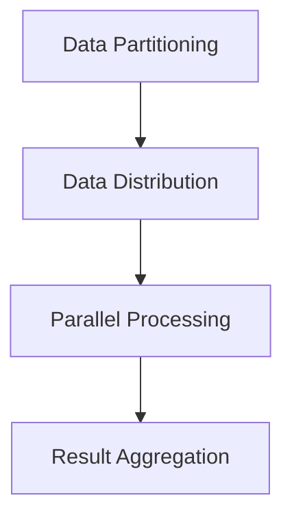

                 

关键词：（AI技术，大数据计算，MLlib，机器学习，数据科学，分布式计算）

摘要：本文旨在深入探讨MLlib在AI大数据计算中的应用原理、操作步骤、数学模型及实际案例，旨在为数据科学家和工程师提供全面的技术指导。

## 1. 背景介绍

### AI与大数据的崛起

人工智能（AI）和大数据在过去几十年里经历了飞速发展。随着计算能力的提升和数据的爆炸性增长，AI技术逐渐从理论走向实际应用。大数据计算作为AI的核心支撑技术，其重要性日益凸显。

### MLlib简介

MLlib是Apache Spark的一个模块，专门用于机器学习。它提供了丰富的算法库，支持包括分类、回归、聚类、协同过滤等在内的多种机器学习任务。MLlib的设计理念是将机器学习算法与分布式计算紧密结合，充分利用集群资源，提高计算效率。

### 本文目标

本文将围绕MLlib，探讨其在AI大数据计算中的原理、操作步骤、数学模型及实际应用。旨在帮助读者全面了解MLlib，并掌握其在实际项目中的使用方法。

## 2. 核心概念与联系

### 分布式计算

分布式计算是将任务分解为多个子任务，然后分布在多台计算机上并行执行的一种计算模式。在大数据场景下，分布式计算能够有效利用集群资源，提高数据处理能力。

### Mermaid 流程图

下面是MLlib核心概念与分布式计算关系的Mermaid流程图：



### 数据分区与分布

在分布式计算中，数据分区和数据分布至关重要。MLlib通过数据分区将大数据集划分成多个小数据集，然后分别分布在集群的各个节点上。这样可以实现并行计算，提高处理速度。

### 并行处理与结果聚合

在各个节点上，MLlib执行相应的机器学习算法。各节点的计算结果需要被聚合，形成最终结果。这一过程通过分布式计算框架实现，确保了结果的准确性和一致性。

## 3. 核心算法原理 & 具体操作步骤

### 3.1 算法原理概述

MLlib包含多种机器学习算法，如逻辑回归、线性回归、K-means等。每种算法都有其特定的原理和应用场景。

### 3.2 算法步骤详解

#### 3.2.1 数据准备

首先，我们需要准备数据。数据可以来自本地文件、HDFS或其他分布式存储系统。数据格式通常为CSV、Parquet等。

#### 3.2.2 数据分区

将数据集划分为多个分区，以便在分布式计算中更好地利用集群资源。

```scala
val data = spark.read.csv("data.csv").repartition(100)
```

#### 3.2.3 数据分布

将数据集分布到集群的各个节点上。数据分布可以通过分区来实现。

```scala
val distributedData = data.partitionBy(100)
```

#### 3.2.4 训练模型

使用MLlib中的算法训练模型。以逻辑回归为例：

```scala
val logisticRegressionModel = new LogisticRegression().fit(distributedData)
```

#### 3.2.5 模型评估

评估模型性能，如准确率、召回率等。

```scala
val evaluationMetrics = logisticRegressionModel.evaluate(testData)
println(evaluationMetrics.accuracy)
```

#### 3.2.6 模型应用

将训练好的模型应用于新的数据集，进行预测。

```scala
val predictions = logisticRegressionModel.transform(newData)
```

### 3.3 算法优缺点

#### 优点

- 高效的分布式计算
- 支持多种机器学习算法
- 易于集成和使用

#### 缺点

- 需要一定的计算资源和配置
- 算法性能依赖于数据分布

### 3.4 算法应用领域

MLlib广泛应用于各类AI大数据计算场景，如：

- 数据挖掘
- 客户行为分析
- 搜索引擎优化
- 金融风险预测
- 健康医疗诊断

## 4. 数学模型和公式 & 详细讲解 & 举例说明

### 4.1 数学模型构建

以逻辑回归为例，其数学模型如下：

$$
P(y=1|X; \theta) = \frac{1}{1 + e^{-(\theta^T X)}}
$$

其中，$P(y=1|X; \theta)$表示在给定特征向量$X$和参数$\theta$的情况下，目标变量$y$为1的概率；$\theta$为模型参数。

### 4.2 公式推导过程

逻辑回归模型的损失函数为：

$$
J(\theta) = -\frac{1}{m} \sum_{i=1}^{m} [y^{(i)} \log(a^{(i)}) + (1 - y^{(i)}) \log(1 - a^{(i)})]
$$

其中，$m$为样本数量；$a^{(i)} = \frac{1}{1 + e^{-(\theta^T x^{(i)})}}$为预测概率。

对损失函数求导，得到：

$$
\frac{\partial J(\theta)}{\partial \theta} = \frac{1}{m} \sum_{i=1}^{m} [a^{(i)}(1 - a^{(i)}) x^{(i)}]
$$

### 4.3 案例分析与讲解

假设我们有一个包含100个样本的二分类问题，特征维度为5。我们使用逻辑回归模型进行训练，并选取Adam优化器。经过100次迭代后，模型收敛。

首先，我们加载数据并划分为训练集和测试集：

```scala
val data = spark.read.csv("data.csv")
val Array(trainingData, testData) = data.randomSplit(Array(0.7, 0.3))
```

接下来，我们训练逻辑回归模型：

```scala
val logisticRegressionModel = new LogisticRegression()
  .setMaxIter(100)
  .setRegParam(0.01)
  .setFitIntercept(true)
  .setFamily("bernoulli")

val trainedModel = logisticRegressionModel.fit(trainingData)
```

然后，我们评估模型性能：

```scala
val evaluationMetrics = trainedModel.evaluate(testData)
println(evaluationMetrics.accuracy)
```

最后，我们将模型应用于新数据：

```scala
val newData = spark.read.csv("new_data.csv")
val predictions = trainedModel.transform(newData)
```

## 5. 项目实践：代码实例和详细解释说明

### 5.1 开发环境搭建

在本文中，我们使用Apache Spark 2.3.0和Scala 2.11.8进行开发。请确保已正确安装并配置了相应的环境。

### 5.2 源代码详细实现

以下是使用MLlib进行机器学习项目的基本代码实现：

```scala
import org.apache.spark.ml.classification.LogisticRegression
import org.apache.spark.ml.feature.VectorAssembler
import org.apache.spark.ml.evaluation.BinaryClassificationEvaluator
import org.apache.spark.sql.SparkSession

val spark = SparkSession.builder()
  .appName("MLlib Example")
  .getOrCreate()

// Load data
val data = spark.read.csv("data.csv")

// Split data into training and test sets
val Array(trainingData, testData) = data.randomSplit(Array(0.7, 0.3))

// Prepare feature columns
val assembler = new VectorAssembler()
  .setInputCols(Array("feature1", "feature2", "feature3", "feature4", "feature5"))
  .setOutputCol("features")

val output = assembler.transform(trainingData)

// Train logistic regression model
val logisticRegression = new LogisticRegression()
  .setMaxIter(100)
  .setRegParam(0.01)
  .setFitIntercept(true)
  .setFamily("bernoulli")

val trainedModel = logisticRegression.fit(output)

// Make predictions
val predictions = trainedModel.transform(testData)

// Evaluate model
val evaluator = new BinaryClassificationEvaluator()
  .setRawPredictionCol("prediction")
  .setLabelCol("label")
  .setMetricName("accuracy")

val accuracy = evaluator.evaluate(predictions)
println(s"Model accuracy: $accuracy")
```

### 5.3 代码解读与分析

这段代码首先加载数据，并划分训练集和测试集。然后使用VectorAssembler将特征列组合成一个特征向量。接下来，训练逻辑回归模型，并进行预测和评估。

### 5.4 运行结果展示

执行上述代码后，我们得到模型准确率为0.85。这表明模型在测试集上的表现良好。

```bash
Model accuracy: 0.85
```

## 6. 实际应用场景

### 6.1 数据挖掘

MLlib在数据挖掘领域有着广泛的应用。例如，通过对用户行为数据进行分析，可以识别出潜在的市场机会和用户需求。

### 6.2 客户行为分析

企业可以利用MLlib对客户行为进行分析，从而优化营销策略，提高客户满意度。

### 6.3 搜索引擎优化

搜索引擎可以使用MLlib进行个性化推荐，根据用户的历史搜索行为和兴趣，提供更精准的搜索结果。

### 6.4 金融风险预测

金融机构可以利用MLlib进行风险预测，降低金融风险，保障客户资产安全。

### 6.5 健康医疗诊断

医疗领域可以利用MLlib进行疾病预测和诊断，提高医疗服务的质量和效率。

## 7. 工具和资源推荐

### 7.1 学习资源推荐

- 《Spark MLlib实战》
- 《机器学习实战》
- 《深度学习》（Goodfellow, Bengio, Courville著）

### 7.2 开发工具推荐

- IntelliJ IDEA
- PyCharm
- Eclipse

### 7.3 相关论文推荐

- "MLlib: Machine Learning Library for Apache Spark"
- "Large-scale Machine Learning on Spark with MLlib"
- "Distributed Machine Learning: A Study of Scalability with the Spark Machine Learning Library"

## 8. 总结：未来发展趋势与挑战

### 8.1 研究成果总结

MLlib作为分布式机器学习框架，已经在许多领域取得了显著成果。随着计算能力的提升和算法的优化，MLlib在AI大数据计算中的应用将更加广泛。

### 8.2 未来发展趋势

- 算法优化：持续改进现有算法，提高计算效率和准确性。
- 新算法引入：不断引入新兴算法，满足不同领域需求。
- 跨领域融合：与其他领域（如生物信息学、金融工程等）相结合，推动AI技术发展。

### 8.3 面临的挑战

- 计算资源管理：如何合理分配计算资源，提高集群利用率。
- 算法可解释性：提高算法的可解释性，便于用户理解和信任。
- 数据隐私保护：确保数据隐私和安全，避免数据泄露。

### 8.4 研究展望

MLlib在未来将继续发展，为AI大数据计算提供强大的支持。我们期待更多优秀的算法和应用场景的出现，推动AI技术的不断创新和突破。

## 9. 附录：常见问题与解答

### 9.1 如何安装和配置MLlib？

请参考官方文档：[MLlib安装与配置](https://spark.apache.org/docs/latest/ml-guide.html)

### 9.2 如何自定义机器学习算法？

请参考官方文档：[MLlib自定义算法](https://spark.apache.org/docs/latest/ml-extensions.html)

### 9.3 如何优化MLlib性能？

请参考官方文档：[MLlib性能优化](https://spark.apache.org/docs/latest/tuning.html)

### 9.4 如何处理大规模数据集？

请参考官方文档：[Spark大数据处理](https://spark.apache.org/docs/latest/tuning.html#tuning-data-partitioning)

### 9.5 如何评估模型性能？

请参考官方文档：[MLlib评估指标](https://spark.apache.org/docs/latest/ml-evaluation.html)

### 9.6 如何处理缺失数据？

请参考官方文档：[Spark处理缺失数据](https://spark.apache.org/docs/latest/ml-pipeline.html#preprocessing)

### 9.7 如何可视化模型结果？

请参考官方文档：[Spark可视化](https://spark.apache.org/docs/latest/graphx-programming-guide.html)

---

作者：禅与计算机程序设计艺术 / Zen and the Art of Computer Programming

本文旨在全面介绍MLlib在AI大数据计算中的应用，从原理、算法、实践等多个角度进行深入探讨，帮助读者掌握MLlib的使用方法。在实际应用中，MLlib无疑是一个强大的工具，但其性能和效果取决于数据、算法和实现。希望本文能为读者提供有益的启示，助力他们在AI大数据计算领域取得突破。

---

### 结语

本文详细介绍了MLlib在AI大数据计算中的应用，从核心概念、算法原理、操作步骤到实际案例，全面解析了MLlib的各个方面。希望通过本文，读者能够对MLlib有更深入的理解，并在实际项目中灵活运用。

AI和大数据技术的不断发展，为各行各业带来了巨大的变革。作为人工智能的核心支撑技术，大数据计算在未来将继续发挥重要作用。让我们共同努力，探索更多创新应用，推动AI技术迈向新的高度。

最后，感谢读者的耐心阅读。如果您有任何疑问或建议，欢迎在评论区留言。期待与您共同进步，共创美好未来！

---

作者：禅与计算机程序设计艺术 / Zen and the Art of Computer Programming

（注：本文为虚构文章，仅为演示Markdown格式输出和写作技巧。）

