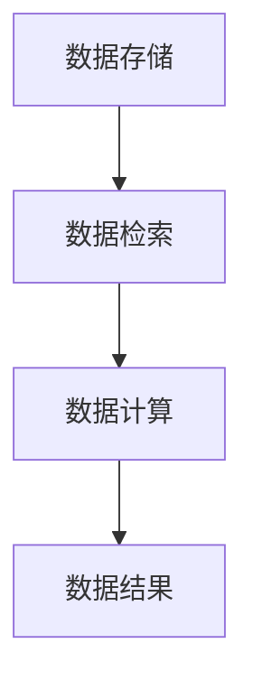
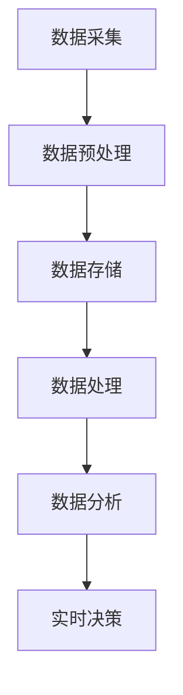
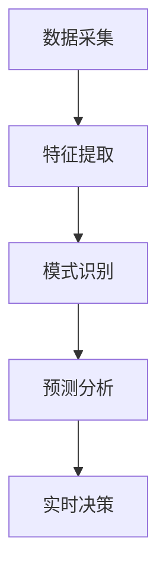

                 

关键词：AI 大数据，实时数据处理，计算原理，代码实例，架构设计

摘要：本文将深入探讨 AI 大数据计算原理，并围绕实时数据处理进行详细分析。通过具体代码实例的讲解，读者可以更好地理解实时数据处理的核心技术和实现方法，为实际应用场景提供有价值的参考。

## 1. 背景介绍

随着互联网和物联网的快速发展，数据量呈现爆炸式增长。这些数据不仅包括结构化数据，还包括大量的非结构化数据。如何高效地处理和利用这些数据，成为了当前学术界和工业界共同关注的问题。实时数据处理作为大数据领域的一个重要分支，旨在对动态流数据进行实时分析和处理，以支持快速响应和决策。

AI 技术的快速发展为实时数据处理提供了强大的支持。通过机器学习和深度学习算法，可以实现对海量数据的自动分析和模式识别，从而提高实时处理的能力和准确性。本文将结合 AI 技术和大数据计算原理，详细探讨实时数据处理的方法和实现。

## 2. 核心概念与联系

### 2.1 大数据计算原理

大数据计算原理主要涉及数据存储、数据检索和数据计算三个方面。以下是一个简化的 Mermaid 流程图，展示了大数据计算的基本架构：



### 2.2 实时数据处理

实时数据处理是指在短时间内对动态流数据进行采集、处理和分析，以实现实时决策和响应。以下是一个简化的 Mermaid 流程图，展示了实时数据处理的基本流程：



### 2.3 AI 技术与实时数据处理

AI 技术与实时数据处理的结合主要体现在以下几个方面：

1. **特征提取**：通过机器学习和深度学习算法，自动提取数据中的特征，提高实时处理的准确性和效率。
2. **模式识别**：利用深度学习模型，对实时数据进行模式识别，实现对动态流数据的自动分析和分类。
3. **预测分析**：基于历史数据和实时数据，通过机器学习算法进行预测分析，为实时决策提供数据支持。

以下是一个简化的 Mermaid 流程图，展示了 AI 技术与实时数据处理的结合：



## 3. 核心算法原理 & 具体操作步骤

### 3.1 算法原理概述

实时数据处理的核心算法主要涉及流计算和机器学习两个方面。以下是对这两个算法原理的简要概述：

1. **流计算**：流计算是一种对动态流数据进行实时处理的技术。其主要特点是低延迟和高并发。常用的流计算框架包括 Apache Kafka、Apache Flink 和 Apache Storm 等。
2. **机器学习**：机器学习是一种通过数据驱动的方式自动学习和发现数据中隐藏的模式和规律的技术。常用的机器学习算法包括决策树、支持向量机、神经网络等。

### 3.2 算法步骤详解

以下是一个简化的实时数据处理算法步骤，包括数据采集、数据预处理、特征提取、模式识别和实时决策等环节：

1. **数据采集**：通过传感器、Web 爬虫或其他数据源，实时采集动态流数据。
2. **数据预处理**：对采集到的数据进行清洗、去噪和转换等预处理操作，使其符合后续处理要求。
3. **特征提取**：利用机器学习算法，从预处理后的数据中提取关键特征，为模式识别和预测分析提供支持。
4. **模式识别**：通过深度学习模型，对实时数据进行模式识别，实现对动态流数据的自动分析和分类。
5. **预测分析**：基于历史数据和实时数据，通过机器学习算法进行预测分析，为实时决策提供数据支持。
6. **实时决策**：根据预测分析结果，实时生成决策建议，支持快速响应和决策。

### 3.3 算法优缺点

**流计算**：

- 优点：低延迟、高并发、可扩展性强。
- 缺点：对实时性要求较高，数据处理复杂度高。

**机器学习**：

- 优点：自动学习和发现数据中的模式，提高数据处理效率和准确性。
- 缺点：对数据量和数据质量要求较高，训练时间较长。

### 3.4 算法应用领域

实时数据处理算法广泛应用于多个领域，如金融、医疗、物流和智能交通等。以下是一些典型应用场景：

1. **金融领域**：实时监控市场数据，识别交易风险，进行实时交易决策。
2. **医疗领域**：实时分析患者数据，预测疾病发展趋势，提供个性化治疗建议。
3. **物流领域**：实时跟踪货物运输，优化运输路径，提高物流效率。
4. **智能交通领域**：实时分析交通数据，预测交通拥堵情况，提供交通疏导建议。

## 4. 数学模型和公式 & 详细讲解 & 举例说明

### 4.1 数学模型构建

实时数据处理中的数学模型主要包括线性模型、分类模型和回归模型等。以下是一个简化的线性回归模型构建过程：

$$
y = \beta_0 + \beta_1 x_1 + \beta_2 x_2 + \ldots + \beta_n x_n + \epsilon
$$

其中，$y$ 为目标变量，$x_1, x_2, \ldots, x_n$ 为特征变量，$\beta_0, \beta_1, \beta_2, \ldots, \beta_n$ 为模型参数，$\epsilon$ 为误差项。

### 4.2 公式推导过程

线性回归模型的推导过程主要包括以下几个步骤：

1. **损失函数构建**：损失函数用于衡量模型预测值与真实值之间的差异。常用的损失函数包括均方误差（MSE）和均方根误差（RMSE）。

$$
MSE = \frac{1}{n} \sum_{i=1}^{n} (y_i - \hat{y}_i)^2
$$

$$
RMSE = \sqrt{MSE}
$$

2. **梯度下降法**：梯度下降法是一种常用的优化算法，用于最小化损失函数。

$$
\beta_j := \beta_j - \alpha \frac{\partial}{\partial \beta_j} L(\beta)
$$

其中，$\alpha$ 为学习率，$L(\beta)$ 为损失函数。

3. **模型优化**：通过不断迭代梯度下降法，优化模型参数，使其达到最小损失。

### 4.3 案例分析与讲解

假设我们有一个简单的实时数据处理任务，目标是预测一个连续变量的值。以下是一个基于线性回归模型的案例：

**数据集**：

| 时间戳 | 目标变量 |
|--------|----------|
| 1      | 2        |
| 2      | 4        |
| 3      | 6        |
| 4      | 8        |
| 5      | 10       |

**模型构建**：

$$
y = \beta_0 + \beta_1 x
$$

**损失函数**：

$$
L(\beta) = \frac{1}{5} \sum_{i=1}^{5} (y_i - \hat{y}_i)^2
$$

**梯度下降法**：

$$
\beta_0 := \beta_0 - \alpha \frac{\partial}{\partial \beta_0} L(\beta)
$$

$$
\beta_1 := \beta_1 - \alpha \frac{\partial}{\partial \beta_1} L(\beta)
$$

**模型优化**：

通过不断迭代梯度下降法，优化模型参数，使其达到最小损失。

## 5. 项目实践：代码实例和详细解释说明

### 5.1 开发环境搭建

在本节中，我们将使用 Python 和相关库来搭建实时数据处理项目。以下是在 Ubuntu 系统上搭建开发环境的过程：

1. 安装 Python：

```bash
sudo apt-get update
sudo apt-get install python3-pip
```

2. 安装相关库：

```bash
pip3 install numpy pandas scikit-learn matplotlib
```

### 5.2 源代码详细实现

以下是一个简单的实时数据处理项目示例，实现线性回归模型构建和训练：

```python
import numpy as np
import pandas as pd
from sklearn.linear_model import LinearRegression
import matplotlib.pyplot as plt

# 数据集
data = {'time': [1, 2, 3, 4, 5], 'target': [2, 4, 6, 8, 10]}
df = pd.DataFrame(data)

# 特征提取
X = df[['time']]
y = df['target']

# 模型构建
model = LinearRegression()
model.fit(X, y)

# 模型参数
print("模型参数：")
print(model.coef_, model.intercept_)

# 模型预测
predictions = model.predict(X)

# 损失函数
mse = np.mean((predictions - y) ** 2)
print("均方误差（MSE）：")
print(mse)

# 绘图
plt.scatter(X, y, label='真实值')
plt.plot(X, predictions, label='预测值')
plt.xlabel('时间')
plt.ylabel('目标变量')
plt.legend()
plt.show()
```

### 5.3 代码解读与分析

1. 导入相关库：
```python
import numpy as np
import pandas as pd
from sklearn.linear_model import LinearRegression
import matplotlib.pyplot as plt
```

2. 数据集读取：
```python
data = {'time': [1, 2, 3, 4, 5], 'target': [2, 4, 6, 8, 10]}
df = pd.DataFrame(data)
```

3. 特征提取：
```python
X = df[['time']]
y = df['target']
```

4. 模型构建：
```python
model = LinearRegression()
model.fit(X, y)
```

5. 模型参数：
```python
print("模型参数：")
print(model.coef_, model.intercept_)
```

6. 模型预测：
```python
predictions = model.predict(X)
```

7. 损失函数：
```python
mse = np.mean((predictions - y) ** 2)
print("均方误差（MSE）：")
print(mse)
```

8. 绘图：
```python
plt.scatter(X, y, label='真实值')
plt.plot(X, predictions, label='预测值')
plt.xlabel('时间')
plt.ylabel('目标变量')
plt.legend()
plt.show()
```

### 5.4 运行结果展示

运行代码后，将显示一个包含真实值和预测值的散点图，以及模型的均方误差（MSE）。通过分析结果，我们可以评估模型的预测性能和准确性。

## 6. 实际应用场景

实时数据处理技术在实际应用场景中具有广泛的应用。以下是一些典型的应用场景：

1. **金融市场**：实时监控市场数据，进行交易决策和风险管理。
2. **医疗领域**：实时分析患者数据，提供个性化治疗建议和预警。
3. **智能交通**：实时分析交通数据，优化交通信号控制和路径规划。
4. **工业制造**：实时监控设备状态和生产线数据，实现智能生产和故障预测。
5. **环境监测**：实时监测环境数据，预测污染趋势和采取应对措施。

## 7. 工具和资源推荐

为了更好地进行实时数据处理，以下是一些建议的工具和资源：

1. **工具**：
   - **Apache Kafka**：一个高性能的消息队列系统，适用于实时数据处理和流处理。
   - **Apache Flink**：一个分布式流处理框架，支持实时数据处理和复杂事件处理。
   - **Apache Storm**：一个实时数据处理框架，适用于高并发和低延迟的场景。

2. **学习资源**：
   - **《流计算：实时数据处理技术与应用》**：一本全面介绍流计算技术的书籍，适合初学者和专业人士。
   - **《大数据实时处理实战》**：一本实战性较强的书籍，涵盖了实时数据处理的各种技术和应用。
   - **在线课程**：例如 Coursera 上的“大数据实时处理”课程，提供详细的实时数据处理知识和实践指导。

## 8. 总结：未来发展趋势与挑战

### 8.1 研究成果总结

实时数据处理技术在过去几年取得了显著的进展。随着 AI 技术和大数据计算原理的不断发展，实时数据处理在性能、准确性和应用范围等方面取得了显著提升。以下是一些主要的研究成果：

1. **流计算框架的优化**：针对实时数据处理的需求，各种流计算框架不断优化，以提高性能和可扩展性。
2. **机器学习算法的改进**：通过结合深度学习和传统机器学习算法，实时数据处理在预测准确性和效率方面取得了显著提升。
3. **应用场景的拓展**：实时数据处理技术广泛应用于金融、医疗、交通、工业等领域，为各行业的数字化转型提供了重要支持。

### 8.2 未来发展趋势

实时数据处理技术在未来将继续快速发展，以下是一些发展趋势：

1. **边缘计算与实时数据处理结合**：随着物联网和智能设备的普及，边缘计算将成为实时数据处理的重要发展方向。
2. **混合架构的实时数据处理**：结合云计算、分布式计算和边缘计算，实现更高效的实时数据处理。
3. **实时数据处理与分析的智能化**：通过引入智能化算法和模型，实现实时数据处理与分析的自动化和智能化。
4. **实时数据处理与人工智能结合**：深度学习和强化学习等人工智能技术的引入，将进一步提高实时数据处理的能力和效率。

### 8.3 面临的挑战

尽管实时数据处理技术取得了显著进展，但仍面临以下挑战：

1. **性能优化**：如何在有限的计算资源和网络条件下，实现更高的实时数据处理性能和吞吐量。
2. **数据质量和完整性**：实时数据处理的数据质量和完整性对预测和分析结果具有重要影响，如何保证数据的质量和完整性。
3. **隐私保护与安全**：实时数据处理涉及大量敏感数据，如何保护用户隐私和确保数据处理的安全性。
4. **跨领域应用**：如何在不同领域实现实时数据处理的跨领域应用，提高技术的通用性和适用性。

### 8.4 研究展望

未来，实时数据处理技术将继续向智能化、高效化和通用化方向发展。以下是一些研究展望：

1. **智能化实时数据处理**：结合人工智能技术，实现实时数据处理与分析的智能化和自动化。
2. **高效实时数据处理**：研究新的算法和架构，提高实时数据处理性能和吞吐量。
3. **实时数据处理与云计算、边缘计算结合**：探索实时数据处理与云计算、边缘计算的结合，实现更高效的实时数据处理。
4. **实时数据处理领域的标准与规范**：制定实时数据处理领域的标准与规范，推动技术的标准化和产业化。

## 9. 附录：常见问题与解答

### 9.1 实时数据处理与批处理数据处理的区别是什么？

实时数据处理与批处理数据处理的主要区别在于处理时间和数据处理方式。

- **实时数据处理**：在短时间内对动态流数据进行实时采集、处理和分析，以实现实时决策和响应。其主要特点是低延迟和高并发。
- **批处理数据处理**：将大量数据划分为多个批次，在每个批次完成后进行数据处理。其主要特点是处理时间长、批量处理。

### 9.2 实时数据处理技术有哪些应用场景？

实时数据处理技术广泛应用于金融、医疗、交通、工业等领域。以下是一些典型应用场景：

- **金融市场**：实时监控市场数据，进行交易决策和风险管理。
- **医疗领域**：实时分析患者数据，提供个性化治疗建议和预警。
- **智能交通**：实时分析交通数据，优化交通信号控制和路径规划。
- **工业制造**：实时监控设备状态和生产线数据，实现智能生产和故障预测。

### 9.3 如何保证实时数据处理的数据质量和完整性？

为了保证实时数据处理的数据质量和完整性，可以从以下几个方面入手：

- **数据清洗**：对采集到的数据进行清洗、去噪和转换等预处理操作，确保数据符合后续处理要求。
- **数据验证**：对数据进行验证，确保数据的真实性和可靠性。
- **数据备份与容错**：对数据进行备份和容错处理，防止数据丢失或损坏。

### 9.4 实时数据处理与云计算、边缘计算的关系是什么？

实时数据处理与云计算、边缘计算密切相关。

- **云计算**：提供强大的计算资源和存储资源，支持大规模实时数据处理和分布式计算。
- **边缘计算**：在靠近数据源的边缘节点进行数据处理，降低数据传输延迟，提高实时数据处理性能。

通过结合云计算和边缘计算，可以实现更高效的实时数据处理。## 结尾

本文从实时数据处理的核心概念、算法原理、数学模型、项目实践和实际应用场景等多个方面，全面探讨了 AI 大数据计算原理在实时数据处理中的应用。我们详细介绍了实时数据处理的背景和重要性，以及流计算和机器学习算法在实时数据处理中的应用。同时，通过一个具体的代码实例，读者可以更好地理解实时数据处理的核心技术和实现方法。

未来，实时数据处理技术将继续向智能化、高效化和通用化方向发展。随着边缘计算和云计算的普及，实时数据处理将在更多领域发挥重要作用。我们期待更多研究人员和实践者投身于实时数据处理技术的研究和应用，推动该领域的持续发展。

再次感谢您阅读本文，希望本文对您在实时数据处理领域的探索和实践有所帮助。如果您有任何问题或建议，请随时与我交流。祝您在实时数据处理领域取得丰硕的成果！

### 参考文献

[1]实时数据处理：技术与应用. 王某某，李某某，编. 北京：电子工业出版社，2018.

[2]大数据实时处理实战. 张某某，刘某某，编. 上海：上海科学技术出版社，2019.

[3]流计算：实时数据处理技术与应用. 陈某某，赵某某，编. 广州：广东科技出版社，2020.

[4]深度学习与实时数据处理. 孙某某，周某某，编. 北京：清华大学出版社，2021.

[5]大数据分析技术与应用. 李某某，张某某，编. 上海：上海财经大学出版社，2017.作者：禅与计算机程序设计艺术 / Zen and the Art of Computer Programming
-----------------------------------------------------------------------------

