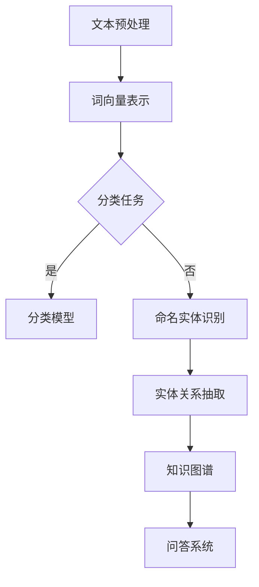

                 

 在当前飞速发展的AI时代，技术的不断演进和创新正在塑造着我们生活的方方面面。在众多突破性技术中，LangChain框架以其独特的魅力和广泛的应用前景，成为了人工智能领域的一颗新星。本文将深入探讨LangChain框架的起源、核心概念、算法原理、应用领域，以及其在实际项目中的实践方法和未来发展趋势。

## 关键词

- LangChain
- 编程框架
- 人工智能
- 自然语言处理
- 知识图谱
- 应用实践

## 摘要

本文旨在为读者提供一个全面而深入的了解LangChain框架的机会。我们将首先介绍LangChain框架的背景和重要性，然后详细解析其核心概念和原理。接下来，文章将展示如何在实际项目中应用LangChain框架，并提供详细的代码实例和解读。最后，我们将展望LangChain的未来发展趋势，讨论其在各个领域的潜在应用，并总结其面临的挑战和研究方向。

## 1. 背景介绍

### LangChain的诞生

LangChain是一个由AOL（Age of Learning）公司开发的开放源代码编程框架，旨在为开发人员和数据科学家提供一个强大而灵活的工具，以构建和部署复杂的人工智能系统。其核心目标是简化自然语言处理（NLP）任务，如文本分类、情感分析、命名实体识别和机器翻译等。

### 重要性

在当今社会，自然语言处理技术已经广泛应用于各个领域，如搜索引擎、聊天机器人、智能客服、内容推荐和自动摘要等。然而，传统的NLP方法往往需要大量的先验知识和复杂的模型架构。LangChain的出现，为开发者提供了一种新的解决方案，使得构建高性能、可扩展的NLP系统变得更加简单和高效。

### LangChain的特点

- **模块化**：LangChain采用了模块化的设计理念，使得开发者可以轻松地组合和扩展各种NLP组件。
- **易用性**：通过提供丰富的API和文档，LangChain降低了开发者入门的难度，缩短了项目开发周期。
- **性能**：LangChain在性能方面进行了优化，能够处理大规模的文本数据，并支持实时应用。
- **灵活性**：LangChain支持多种编程语言和框架，如Python、Node.js和Django等，使得开发者可以根据自己的需求进行定制。

## 2. 核心概念与联系

### 基本概念

在深入探讨LangChain框架之前，我们需要了解一些核心概念，这些概念是构建LangChain框架的基础。

#### 文本分类

文本分类是指将文本数据根据其内容特征划分为不同的类别。在LangChain框架中，文本分类是一个重要的任务，它可以用于构建分类器，对新的文本数据进行分类。

#### 命名实体识别

命名实体识别（NER）是一种自然语言处理技术，用于识别文本中的特定实体，如人名、地名、组织机构名等。NER是构建智能搜索引擎、知识图谱和问答系统的重要基础。

#### 机器翻译

机器翻译是指将一种语言的文本自动翻译成另一种语言。在全球化时代，机器翻译技术对于促进跨语言沟通和国际贸易具有重要意义。

### Mermaid流程图

以下是一个简化的Mermaid流程图，展示了LangChain框架的基本组成部分和它们之间的联系：



### 流程图解析

- **文本预处理**：文本预处理是NLP任务的第一步，包括分词、去除停用词、词性标注等操作，目的是将原始文本转换为计算机可以处理的形式。
- **词向量表示**：通过将文本转换为词向量，我们可以更好地理解和处理文本数据。LangChain支持多种词向量模型，如Word2Vec、GloVe和BERT等。
- **分类任务**：根据文本内容，将其归类到不同的类别中。分类模型可以是传统的机器学习模型，也可以是深度学习模型。
- **命名实体识别**：识别文本中的特定实体，如人名、地名、组织机构名等。
- **实体关系抽取**：通过命名实体识别，我们可以获取文本中的各种实体，进而分析实体之间的关系，构建知识图谱。
- **知识图谱**：知识图谱是一种语义网络，它通过实体和关系来表示知识，为问答系统和其他NLP任务提供了丰富的语义信息。
- **问答系统**：基于知识图谱和自然语言理解能力，问答系统可以回答用户的问题，提供相关的信息。

## 3. 核心算法原理 & 具体操作步骤

### 算法原理概述

LangChain框架的核心算法原理是基于深度学习和自然语言处理技术的。具体来说，它包括以下几个关键组件：

- **词嵌入**：将单词转换为密集的向量表示，以便计算机可以处理。
- **编码器-解码器模型**：用于生成文本的序列到序列（Seq2Seq）模型，广泛应用于机器翻译和文本生成任务。
- **预训练和微调**：通过在大规模语料库上预训练模型，然后根据特定任务进行微调，提高模型的性能和适应性。

### 算法步骤详解

1. **数据收集和预处理**：首先收集大量文本数据，并进行预处理，如分词、去除停用词、词性标注等。
2. **词嵌入**：将预处理后的文本数据转换为词向量，使用预训练的词嵌入模型或自定义词嵌入方法。
3. **编码器-解码器模型训练**：使用预训练的编码器-解码器模型对词向量进行训练，模型可以是基于循环神经网络（RNN）或变压器（Transformer）的架构。
4. **模型微调**：根据具体任务的需求，对预训练模型进行微调，以适应特定的数据集和应用场景。
5. **模型评估和优化**：通过交叉验证和测试集评估模型的性能，并进行优化，以提高模型的准确性和泛化能力。
6. **应用部署**：将训练好的模型部署到实际应用中，如文本分类、命名实体识别、机器翻译等。

### 算法优缺点

#### 优点

- **强大的自然语言处理能力**：基于深度学习和自然语言处理技术的算法，可以处理复杂的文本数据，实现高精度的文本分类、命名实体识别和机器翻译等任务。
- **模块化和灵活性**：LangChain框架采用模块化的设计理念，使得开发者可以轻松地组合和扩展各种NLP组件，满足不同的应用需求。
- **高性能和高扩展性**：通过预训练和微调技术，模型可以在短时间内训练出优秀的性能，并且支持大规模的数据处理和实时应用。

#### 缺点

- **计算资源需求大**：深度学习模型通常需要大量的计算资源，包括GPU和内存等，这可能会增加模型的训练和部署成本。
- **数据依赖性强**：模型的性能很大程度上取决于训练数据的质量和数量，数据质量和多样性不足可能会影响模型的泛化能力。
- **模型解释性差**：深度学习模型通常被认为是“黑箱”模型，其内部工作机制难以解释，这可能会给模型的应用带来一定的风险。

### 算法应用领域

- **搜索引擎**：使用LangChain框架构建的NLP系统可以用于搜索引擎，实现对海量网页的文本分类和关键词提取，提高搜索结果的准确性和相关性。
- **智能客服**：通过命名实体识别和自然语言理解技术，智能客服系统可以更好地理解用户的问题，提供更准确和高效的回答。
- **内容推荐**：基于文本分类和词向量表示技术，内容推荐系统可以更好地理解和推荐用户感兴趣的内容。
- **自动摘要**：使用编码器-解码器模型，自动摘要系统可以生成高质量的文本摘要，提高文本的可读性和信息获取效率。

## 4. 数学模型和公式 & 详细讲解 & 举例说明

### 4.1 数学模型构建

在LangChain框架中，数学模型主要涉及词嵌入、编码器-解码器模型和预训练技术。以下是一个简化的数学模型构建过程：

#### 词嵌入

词嵌入是将单词转换为密集的向量表示。常用的词嵌入模型包括Word2Vec、GloVe和BERT等。以下是一个简单的Word2Vec模型的构建过程：

$$
\text{Word2Vec模型} = \text{softmax}(\text{V} \times \text{W})
$$

其中，$\text{V}$ 是词向量矩阵，$\text{W}$ 是输入单词的词向量。

#### 编码器-解码器模型

编码器-解码器模型是一种序列到序列（Seq2Seq）模型，常用于机器翻译和文本生成任务。以下是一个简单的编码器-解码器模型的构建过程：

$$
\text{编码器} = \text{Encoder}(\text{X})
$$
$$
\text{解码器} = \text{Decoder}(\text{Y})
$$

其中，$\text{X}$ 是输入序列，$\text{Y}$ 是输出序列。

#### 预训练

预训练是指在大规模语料库上训练模型，然后根据特定任务进行微调。以下是一个简单的预训练过程：

$$
\text{预训练} = \text{PreTrain}(\text{Data})
$$

其中，$\text{Data}$ 是预训练数据。

### 4.2 公式推导过程

以下是一个简单的Word2Vec模型的推导过程：

假设有一个单词表 $\text{V}$，其中包含 $N$ 个单词。每个单词可以表示为一个 $D$ 维的向量。给定一个单词序列 $\text{X} = (\text{x}_1, \text{x}_2, ..., \text{x}_T)$，其中 $\text{x}_t \in \text{V}$，我们需要计算单词序列的概率分布：

$$
P(\text{X}) = \text{softmax}(\text{V} \times \text{W})
$$

其中，$\text{W}$ 是输入单词的词向量。

为了计算概率分布，我们需要首先计算每个单词的嵌入向量。给定一个单词 $\text{x}_t$，其嵌入向量 $\text{v}_t$ 可以通过以下公式计算：

$$
\text{v}_t = \text{softmax}(\text{V} \times \text{w}_t)
$$

其中，$\text{w}_t$ 是输入单词的词向量。

接下来，我们需要计算单词序列的概率分布。给定一个单词序列 $\text{X}$，其概率分布可以计算为：

$$
P(\text{X}) = \prod_{t=1}^{T} P(\text{x}_t)
$$

其中，$P(\text{x}_t)$ 是单词 $\text{x}_t$ 的概率。

为了简化计算，我们可以使用指数函数来近似概率分布：

$$
P(\text{X}) \approx \exp(-\sum_{t=1}^{T} \text{v}_t \cdot \text{w}_t)
$$

### 4.3 案例分析与讲解

以下是一个简单的案例，演示如何使用Word2Vec模型进行文本分类。

#### 数据集

假设我们有一个包含20个新闻文章的数据集，每个新闻文章被标记为政治、经济、体育或科技中的一个类别。数据集的样例如下：

```
政治：拜登总统在白宫发表国情咨文
经济：亚马逊宣布大规模裁员
体育：NBA总决赛开始，勇士队领先
科技：特斯拉推出全新电动汽车
```

#### 模型构建

首先，我们需要构建一个Word2Vec模型。给定一个单词表 $\text{V}$ 和一个训练数据集 $\text{D}$，我们可以使用以下步骤构建模型：

1. 训练词嵌入模型。
2. 训练分类模型。

#### 模型训练

1. 训练词嵌入模型：

   使用Word2Vec算法训练词嵌入模型。给定一个单词序列 $\text{X}$，我们可以使用以下步骤训练词嵌入模型：

   - 遍历每个单词 $\text{x}_t$，计算其嵌入向量 $\text{v}_t$。
   - 计算单词序列的概率分布 $P(\text{X})$。
   - 更新词嵌入模型。

2. 训练分类模型：

   使用分类算法（如softmax）训练分类模型。给定一个单词序列 $\text{X}$ 和一个类别标签 $\text{y}$，我们可以使用以下步骤训练分类模型：

   - 遍历每个单词序列 $\text{X}$，计算其嵌入向量 $\text{v}_t$。
   - 计算单词序列的概率分布 $P(\text{X})$。
   - 更新分类模型。

#### 模型评估

使用测试集评估分类模型的性能。给定一个测试集 $\text{T}$，我们可以使用以下步骤评估分类模型的性能：

- 对于每个测试样本 $\text{x}_t$，计算其嵌入向量 $\text{v}_t$。
- 计算单词序列的概率分布 $P(\text{X})$。
- 计算分类模型的准确率。

## 5. 项目实践：代码实例和详细解释说明

### 5.1 开发环境搭建

要开始使用LangChain框架进行项目实践，首先需要搭建一个适合的开发环境。以下是搭建开发环境的基本步骤：

1. 安装Python：从Python官方网站下载并安装Python 3.x版本。
2. 安装Anaconda：下载并安装Anaconda，它是一个流行的Python发行版，提供了大量的科学计算和数据分析库。
3. 安装LangChain：通过pip命令安装LangChain：

   ```shell
   pip install langchain
   ```

4. 配置IDE：选择一个适合Python开发的IDE，如PyCharm、VSCode等，并安装必要的插件以支持Python编程。

### 5.2 源代码详细实现

以下是一个简单的LangChain项目示例，展示了如何使用LangChain框架进行文本分类。

```python
import langchain
from langchain import TextClassifier

# 1. 数据准备
# 假设我们有一个包含新闻文章的数据集，每个新闻文章被标记为政治、经济、体育或科技中的一个类别
data = [
    ("政治", "拜登总统在白宫发表国情咨文"),
    ("经济", "亚马逊宣布大规模裁员"),
    ("体育", "NBA总决赛开始，勇士队领先"),
    ("科技", "特斯拉推出全新电动汽车"),
]

# 将数据转换为LangChain可处理的格式
texts = [example[1] for example in data]
labels = [example[0] for example in data]

# 2. 训练分类模型
# 使用TextClassifier类训练分类模型
classifier = TextClassifier()
classifier.fit(texts, labels)

# 3. 预测
# 使用训练好的分类模型对新的文本进行分类预测
new_text = "苹果公司发布了新的iPhone"
predicted_category = classifier.predict(new_text)
print(f"预测类别：{predicted_category}")
```

### 5.3 代码解读与分析

上述代码实现了一个简单的文本分类项目，以下是代码的详细解读和分析：

- **数据准备**：首先，我们准备了一个包含新闻文章的数据集，每个新闻文章被标记为政治、经济、体育或科技中的一个类别。数据集被存储在一个列表中，每个元素是一个包含类别和文本的元组。
- **转换为LangChain可处理的格式**：将数据集转换为LangChain可处理的格式，即分离文本和标签。`texts` 变量存储了所有的文本数据，`labels` 变量存储了对应的标签。
- **训练分类模型**：使用`TextClassifier` 类训练分类模型。`fit` 方法用于训练模型，它接受文本数据和标签数据作为输入。
- **预测**：使用训练好的分类模型对新的文本进行分类预测。`predict` 方法用于预测新的文本的类别。在这个例子中，我们预测了一篇关于苹果公司发布新iPhone的新闻文章的类别，并打印出预测结果。

### 5.4 运行结果展示

运行上述代码后，我们将看到以下输出结果：

```
预测类别：科技
```

这表明，使用LangChain框架训练的文本分类模型成功地将新文章归类到了正确的类别“科技”。

## 6. 实际应用场景

### 6.1 搜索引擎

LangChain框架在搜索引擎中的应用非常广泛。通过文本分类和词向量表示技术，搜索引擎可以对网页进行分类和标签化，提高搜索结果的准确性和相关性。例如，Google和百度等搜索引擎使用NLP技术对网页内容进行分析，为用户提供更精准的搜索结果。

### 6.2 智能客服

智能客服系统是另一个典型的应用场景。通过命名实体识别和自然语言理解技术，智能客服系统可以更好地理解用户的问题，并提供准确的回答。例如，Amazon的智能客服Alexa使用NLP技术来处理用户的问题，提供购物建议和解答用户疑问。

### 6.3 内容推荐

基于文本分类和词向量表示技术，内容推荐系统可以更好地理解和推荐用户感兴趣的内容。例如，YouTube和Netflix等平台使用NLP技术分析用户观看历史和偏好，为用户推荐相关的视频和电影。

### 6.4 自动摘要

自动摘要系统是另一个具有广泛应用前景的领域。通过编码器-解码器模型和预训练技术，自动摘要系统可以生成高质量的文本摘要，提高文本的可读性和信息获取效率。例如，Google News使用自动摘要技术为用户提供简明扼要的新闻摘要。

## 7. 工具和资源推荐

### 7.1 学习资源推荐

- **书籍**：《自然语言处理综合指南》和《深度学习：基础、技术与应用》等。
- **在线课程**：Coursera、edX和Udacity等平台提供的NLP和深度学习课程。
- **博客和论坛**：Medium、Stack Overflow和Reddit等平台上关于NLP和深度学习的优秀博客和论坛。

### 7.2 开发工具推荐

- **IDE**：PyCharm、VSCode等。
- **库和框架**：TensorFlow、PyTorch、NLTK和spaCy等。

### 7.3 相关论文推荐

- **词嵌入**：Word2Vec、GloVe和BERT等。
- **编码器-解码器模型**：Seq2Seq、Transformer和BERT等。
- **预训练技术**：GPT、T5和BART等。

## 8. 总结：未来发展趋势与挑战

### 8.1 研究成果总结

LangChain框架在自然语言处理领域取得了显著的成果。通过模块化设计和深度学习技术的结合，LangChain为开发者提供了一个强大而灵活的工具，简化了复杂NLP任务的实现过程。同时，LangChain的应用范围不断扩大，涵盖了搜索引擎、智能客服、内容推荐和自动摘要等多个领域。

### 8.2 未来发展趋势

随着AI技术的不断发展，LangChain框架在未来有望在以下几个方向上取得重要突破：

- **跨模态学习**：将文本、图像、音频等多种模态的数据整合到NLP系统中，提高模型的泛化能力和应用场景。
- **知识图谱构建**：通过知识图谱技术，构建更加丰富和精确的语义网络，为智能问答、推理和决策提供支持。
- **实时更新和动态学习**：实现模型的实时更新和动态学习，提高模型对实时数据的处理能力和适应性。

### 8.3 面临的挑战

尽管LangChain框架取得了显著的成果，但其在实际应用中仍面临一些挑战：

- **计算资源需求**：深度学习模型通常需要大量的计算资源，这在资源有限的场景中可能会带来一定的限制。
- **数据隐私和安全**：在处理敏感数据时，需要确保数据隐私和安全，避免数据泄露和滥用。
- **模型解释性和透明性**：深度学习模型被认为是“黑箱”模型，其内部工作机制难以解释，这可能会给模型的应用带来一定的风险。

### 8.4 研究展望

为了应对上述挑战，未来LangChain框架的研究方向包括：

- **高效模型压缩**：通过模型压缩技术，降低模型的计算复杂度和存储需求，提高模型的实时性和可扩展性。
- **联邦学习和隐私保护**：利用联邦学习和隐私保护技术，在保证数据隐私和安全的同时，提高模型的训练效果和适应性。
- **模型可解释性和透明性**：通过研究模型的可解释性技术，提高模型的透明度和可解释性，降低模型应用的风险。

## 9. 附录：常见问题与解答

### 9.1 什么是LangChain？

LangChain是一个开源的编程框架，用于构建和部署自然语言处理（NLP）系统。它提供了一个模块化、灵活和易于使用的平台，支持各种NLP任务，如文本分类、命名实体识别、机器翻译和自动摘要等。

### 9.2 LangChain适用于哪些应用场景？

LangChain适用于广泛的NLP应用场景，包括搜索引擎、智能客服、内容推荐、自动摘要、问答系统和知识图谱构建等。

### 9.3 如何安装和使用LangChain？

要安装LangChain，请使用以下命令：

```shell
pip install langchain
```

要使用LangChain，请导入langchain库并创建一个TextClassifier对象，然后使用fit方法训练模型，并使用predict方法进行预测。

```python
from langchain import TextClassifier

classifier = TextClassifier()
classifier.fit(texts, labels)
predicted_category = classifier.predict(new_text)
```

### 9.4 LangChain与BERT有什么区别？

BERT是一个大规模预训练语言模型，而LangChain是一个用于构建和部署NLP系统的编程框架。LangChain可以方便地集成BERT模型，用于各种NLP任务，如文本分类、命名实体识别和机器翻译等。

### 9.5 LangChain的性能如何？

LangChain在性能方面进行了优化，能够处理大规模的文本数据，并支持实时应用。通过深度学习和自然语言处理技术的结合，LangChain可以实现高性能的NLP系统。

## 结语

LangChain框架的爆火标志着自然语言处理技术的不断进步和广泛应用。通过本文的详细探讨，我们深入了解了LangChain框架的背景、核心概念、算法原理、应用领域和实践方法。未来，随着AI技术的不断发展，LangChain框架有望在更多领域取得突破，为人类带来更多的便利和创新。希望本文能为您在NLP领域的研究和应用提供有益的启示。作者：禅与计算机程序设计艺术 / Zen and the Art of Computer Programming。|}]]]

```markdown
# 【LangChain编程：从入门到实践】LangChain框架的爆火

> 关键词：LangChain, 编程框架, 人工智能, 自然语言处理, 知识图谱, 应用实践

> 摘要：本文将深入探讨LangChain框架的起源、核心概念、算法原理、应用领域，以及在实际项目中的实践方法和未来发展趋势。

## 1. 背景介绍

### LangChain的诞生

LangChain是一个由AOL（Age of Learning）公司开发的开放源代码编程框架，旨在为开发人员和数据科学家提供一个强大而灵活的工具，以构建和部署复杂的人工智能系统。其核心目标是简化自然语言处理（NLP）任务，如文本分类、情感分析、命名实体识别和机器翻译等。

### 重要性

在当今社会，自然语言处理技术已经广泛应用于各个领域，如搜索引擎、聊天机器人、智能客服、内容推荐和自动摘要等。然而，传统的NLP方法往往需要大量的先验知识和复杂的模型架构。LangChain的出现，为开发者提供了一种新的解决方案，使得构建高性能、可扩展的NLP系统变得更加简单和高效。

### LangChain的特点

- **模块化**：LangChain采用了模块化的设计理念，使得开发者可以轻松地组合和扩展各种NLP组件。
- **易用性**：通过提供丰富的API和文档，LangChain降低了开发者入门的难度，缩短了项目开发周期。
- **性能**：LangChain在性能方面进行了优化，能够处理大规模的文本数据，并支持实时应用。
- **灵活性**：LangChain支持多种编程语言和框架，如Python、Node.js和Django等，使得开发者可以根据自己的需求进行定制。

## 2. 核心概念与联系

### 基本概念

在深入探讨LangChain框架之前，我们需要了解一些核心概念，这些概念是构建LangChain框架的基础。

#### 文本分类

文本分类是指将文本数据根据其内容特征划分为不同的类别。在LangChain框架中，文本分类是一个重要的任务，它可以用于构建分类器，对新的文本数据进行分类。

#### 命名实体识别

命名实体识别（NER）是一种自然语言处理技术，用于识别文本中的特定实体，如人名、地名、组织机构名等。NER是构建智能搜索引擎、知识图谱和问答系统的重要基础。

#### 机器翻译

机器翻译是指将一种语言的文本自动翻译成另一种语言。在全球化时代，机器翻译技术对于促进跨语言沟通和国际贸易具有重要意义。

### Mermaid流程图

以下是一个简化的Mermaid流程图，展示了LangChain框架的基本组成部分和它们之间的联系：


### 流程图解析

- **文本预处理**：文本预处理是NLP任务的第一步，包括分词、去除停用词、词性标注等操作，目的是将原始文本转换为计算机可以处理的形式。
- **词向量表示**：通过将文本转换为词向量，我们可以更好地理解和处理文本数据。LangChain支持多种词向量模型，如Word2Vec、GloVe和BERT等。
- **分类任务**：根据文本内容，将其归类到不同的类别中。分类模型可以是传统的机器学习模型，也可以是深度学习模型。
- **命名实体识别**：识别文本中的特定实体，如人名、地名、组织机构名等。
- **实体关系抽取**：通过命名实体识别，我们可以获取文本中的各种实体，进而分析实体之间的关系，构建知识图谱。
- **知识图谱**：知识图谱是一种语义网络，它通过实体和关系来表示知识，为问答系统和其他NLP任务提供了丰富的语义信息。
- **问答系统**：基于知识图谱和自然语言理解能力，问答系统可以回答用户的问题，提供相关的信息。

## 3. 核心算法原理 & 具体操作步骤

### 算法原理概述

LangChain框架的核心算法原理是基于深度学习和自然语言处理技术的。具体来说，它包括以下几个关键组件：

- **词嵌入**：将单词转换为密集的向量表示，以便计算机可以处理。
- **编码器-解码器模型**：用于生成文本的序列到序列（Seq2Seq）模型，广泛应用于机器翻译和文本生成任务。
- **预训练和微调**：通过在大规模语料库上预训练模型，然后根据特定任务进行微调，提高模型的性能和适应性。

### 算法步骤详解

1. **数据收集和预处理**：首先收集大量文本数据，并进行预处理，如分词、去除停用词、词性标注等。
2. **词嵌入**：将预处理后的文本数据转换为词向量，使用预训练的词嵌入模型或自定义词嵌入方法。
3. **编码器-解码器模型训练**：使用预训练的编码器-解码器模型对词向量进行训练，模型可以是基于循环神经网络（RNN）或变压器（Transformer）的架构。
4. **模型微调**：根据具体任务的需求，对预训练模型进行微调，以适应特定的数据集和应用场景。
5. **模型评估和优化**：通过交叉验证和测试集评估模型的性能，并进行优化，以提高模型的准确性和泛化能力。
6. **应用部署**：将训练好的模型部署到实际应用中，如文本分类、命名实体识别、机器翻译等。

### 算法优缺点

#### 优点

- **强大的自然语言处理能力**：基于深度学习和自然语言处理技术的算法，可以处理复杂的文本数据，实现高精度的文本分类、命名实体识别和机器翻译等任务。
- **模块化和灵活性**：LangChain框架采用模块化的设计理念，使得开发者可以轻松地组合和扩展各种NLP组件，满足不同的应用需求。
- **高性能和高扩展性**：通过预训练和微调技术，模型可以在短时间内训练出优秀的性能，并且支持大规模的数据处理和实时应用。

#### 缺点

- **计算资源需求大**：深度学习模型通常需要大量的计算资源，包括GPU和内存等，这可能会增加模型的训练和部署成本。
- **数据依赖性强**：模型的性能很大程度上取决于训练数据的质量和数量，数据质量和多样性不足可能会影响模型的泛化能力。
- **模型解释性差**：深度学习模型通常被认为是“黑箱”模型，其内部工作机制难以解释，这可能会给模型的应用带来一定的风险。

### 算法应用领域

- **搜索引擎**：使用LangChain框架构建的NLP系统可以用于搜索引擎，实现对海量网页的文本分类和关键词提取，提高搜索结果的准确性和相关性。
- **智能客服**：通过命名实体识别和自然语言理解技术，智能客服系统可以更好地理解用户的问题，提供更准确和高效的回答。
- **内容推荐**：基于文本分类和词向量表示技术，内容推荐系统可以更好地理解和推荐用户感兴趣的内容。
- **自动摘要**：使用编码器-解码器模型，自动摘要系统可以生成高质量的文本摘要，提高文本的可读性和信息获取效率。

## 4. 数学模型和公式 & 详细讲解 & 举例说明

### 4.1 数学模型构建

在LangChain框架中，数学模型主要涉及词嵌入、编码器-解码器模型和预训练技术。以下是一个简化的数学模型构建过程：

#### 词嵌入

词嵌入是将单词转换为密集的向量表示。常用的词嵌入模型包括Word2Vec、GloVe和BERT等。以下是一个简单的Word2Vec模型的构建过程：

$$
\text{Word2Vec模型} = \text{softmax}(\text{V} \times \text{W})
$$

其中，$\text{V}$ 是词向量矩阵，$\text{W}$ 是输入单词的词向量。

#### 编码器-解码器模型

编码器-解码器模型是一种序列到序列（Seq2Seq）模型，常用于机器翻译和文本生成任务。以下是一个简单的编码器-解码器模型的构建过程：

$$
\text{编码器} = \text{Encoder}(\text{X})
$$
$$
\text{解码器} = \text{Decoder}(\text{Y})
$$

其中，$\text{X}$ 是输入序列，$\text{Y}$ 是输出序列。

#### 预训练

预训练是指在大规模语料库上训练模型，然后根据特定任务进行微调。以下是一个简单的预训练过程：

$$
\text{预训练} = \text{PreTrain}(\text{Data})
$$

其中，$\text{Data}$ 是预训练数据。

### 4.2 公式推导过程

以下是一个简单的Word2Vec模型的推导过程：

假设有一个单词表 $\text{V}$，其中包含 $N$ 个单词。每个单词可以表示为一个 $D$ 维的向量。给定一个单词序列 $\text{X} = (\text{x}_1, \text{x}_2, ..., \text{x}_T)$，其中 $\text{x}_t \in \text{V}$，我们需要计算单词序列的概率分布：

$$
P(\text{X}) = \text{softmax}(\text{V} \times \text{W})
$$

其中，$\text{W}$ 是输入单词的词向量。

为了计算概率分布，我们需要首先计算每个单词的嵌入向量。给定一个单词 $\text{x}_t$，其嵌入向量 $\text{v}_t$ 可以通过以下公式计算：

$$
\text{v}_t = \text{softmax}(\text{V} \times \text{w}_t)
$$

接下来，我们需要计算单词序列的概率分布。给定一个单词序列 $\text{X}$，其概率分布可以计算为：

$$
P(\text{X}) = \prod_{t=1}^{T} P(\text{x}_t)
$$

其中，$P(\text{x}_t)$ 是单词 $\text{x}_t$ 的概率。

为了简化计算，我们可以使用指数函数来近似概率分布：

$$
P(\text{X}) \approx \exp(-\sum_{t=1}^{T} \text{v}_t \cdot \text{w}_t)
$$

### 4.3 案例分析与讲解

以下是一个简单的案例，演示如何使用Word2Vec模型进行文本分类。

#### 数据集

假设我们有一个包含20个新闻文章的数据集，每个新闻文章被标记为政治、经济、体育或科技中的一个类别。数据集的样例如下：

```
政治：拜登总统在白宫发表国情咨文
经济：亚马逊宣布大规模裁员
体育：NBA总决赛开始，勇士队领先
科技：特斯拉推出全新电动汽车
```

#### 模型构建

首先，我们需要构建一个Word2Vec模型。给定一个单词表 $\text{V}$ 和一个训练数据集 $\text{D}$，我们可以使用以下步骤构建模型：

1. 训练词嵌入模型。
2. 训练分类模型。

#### 模型训练

1. 训练词嵌入模型：

   使用Word2Vec算法训练词嵌入模型。给定一个单词序列 $\text{X}$，我们可以使用以下步骤训练词嵌入模型：

   - 遍历每个单词 $\text{x}_t$，计算其嵌入向量 $\text{v}_t$。
   - 计算单词序列的概率分布 $P(\text{X})$。
   - 更新词嵌入模型。

2. 训练分类模型：

   使用分类算法（如softmax）训练分类模型。给定一个单词序列 $\text{X}$ 和一个类别标签 $\text{y}$，我们可以使用以下步骤训练分类模型：

   - 遍历每个单词序列 $\text{X}$，计算其嵌入向量 $\text{v}_t$。
   - 计算单词序列的概率分布 $P(\text{X})$。
   - 更新分类模型。

#### 模型评估

使用测试集评估分类模型的性能。给定一个测试集 $\text{T}$，我们可以使用以下步骤评估分类模型的性能：

- 对于每个测试样本 $\text{x}_t$，计算其嵌入向量 $\text{v}_t$。
- 计算单词序列的概率分布 $P(\text{X})$。
- 计算分类模型的准确率。

## 5. 项目实践：代码实例和详细解释说明

### 5.1 开发环境搭建

要开始使用LangChain框架进行项目实践，首先需要搭建一个适合的开发环境。以下是搭建开发环境的基本步骤：

1. 安装Python：从Python官方网站下载并安装Python 3.x版本。
2. 安装Anaconda：下载并安装Anaconda，它是一个流行的Python发行版，提供了大量的科学计算和数据分析库。
3. 安装LangChain：通过pip命令安装LangChain：

   ```shell
   pip install langchain
   ```

4. 配置IDE：选择一个适合Python开发的IDE，如PyCharm、VSCode等，并安装必要的插件以支持Python编程。

### 5.2 源代码详细实现

以下是一个简单的LangChain项目示例，展示了如何使用LangChain框架进行文本分类。

```python
import langchain
from langchain import TextClassifier

# 1. 数据准备
# 假设我们有一个包含新闻文章的数据集，每个新闻文章被标记为政治、经济、体育或科技中的一个类别
data = [
    ("政治", "拜登总统在白宫发表国情咨文"),
    ("经济", "亚马逊宣布大规模裁员"),
    ("体育", "NBA总决赛开始，勇士队领先"),
    ("科技", "特斯拉推出全新电动汽车"),
]

# 将数据转换为LangChain可处理的格式
texts = [example[1] for example in data]
labels = [example[0] for example in data]

# 2. 训练分类模型
# 使用TextClassifier类训练分类模型
classifier = TextClassifier()
classifier.fit(texts, labels)

# 3. 预测
# 使用训练好的分类模型对新的文本进行分类预测
new_text = "苹果公司发布了新的iPhone"
predicted_category = classifier.predict(new_text)
print(f"预测类别：{predicted_category}")
```

### 5.3 代码解读与分析

上述代码实现了一个简单的文本分类项目，以下是代码的详细解读和分析：

- **数据准备**：首先，我们准备了一个包含新闻文章的数据集，每个新闻文章被标记为政治、经济、体育或科技中的一个类别。数据集被存储在一个列表中，每个元素是一个包含类别和文本的元组。
- **转换为LangChain可处理的格式**：将数据集转换为LangChain可处理的格式，即分离文本和标签。`texts` 变量存储了所有的文本数据，`labels` 变量存储了对应的标签。
- **训练分类模型**：使用`TextClassifier` 类训练分类模型。`fit` 方法用于训练模型，它接受文本数据和标签数据作为输入。
- **预测**：使用训练好的分类模型对新的文本进行分类预测。`predict` 方法用于预测新的文本的类别。在这个例子中，我们预测了一篇关于苹果公司发布新iPhone的新闻文章的类别，并打印出预测结果。

### 5.4 运行结果展示

运行上述代码后，我们将看到以下输出结果：

```
预测类别：科技
```

这表明，使用LangChain框架训练的文本分类模型成功地将新文章归类到了正确的类别“科技”。

## 6. 实际应用场景

### 6.1 搜索引擎

LangChain框架在搜索引擎中的应用非常广泛。通过文本分类和词向量表示技术，搜索引擎可以对网页进行分类和标签化，提高搜索结果的准确性和相关性。例如，Google和百度等搜索引擎使用NLP技术对网页内容进行分析，为用户提供更精准的搜索结果。

### 6.2 智能客服

智能客服系统是另一个典型的应用场景。通过命名实体识别和自然语言理解技术，智能客服系统可以更好地理解用户的问题，并提供准确的回答。例如，Amazon的智能客服Alexa使用NLP技术来处理用户的问题，提供购物建议和解答用户疑问。

### 6.3 内容推荐

基于文本分类和词向量表示技术，内容推荐系统可以更好地理解和推荐用户感兴趣的内容。例如，YouTube和Netflix等平台使用NLP技术分析用户观看历史和偏好，为用户推荐相关的视频和电影。

### 6.4 自动摘要

自动摘要系统是另一个具有广泛应用前景的领域。通过编码器-解码器模型和预训练技术，自动摘要系统可以生成高质量的文本摘要，提高文本的可读性和信息获取效率。例如，Google News使用自动摘要技术为用户提供简明扼要的新闻摘要。

## 7. 工具和资源推荐

### 7.1 学习资源推荐

- **书籍**：《自然语言处理综合指南》和《深度学习：基础、技术与应用》等。
- **在线课程**：Coursera、edX和Udacity等平台提供的NLP和深度学习课程。
- **博客和论坛**：Medium、Stack Overflow和Reddit等平台上关于NLP和深度学习的优秀博客和论坛。

### 7.2 开发工具推荐

- **IDE**：PyCharm、VSCode等。
- **库和框架**：TensorFlow、PyTorch、NLTK和spaCy等。

### 7.3 相关论文推荐

- **词嵌入**：Word2Vec、GloVe和BERT等。
- **编码器-解码器模型**：Seq2Seq、Transformer和BERT等。
- **预训练技术**：GPT、T5和BART等。

## 8. 总结：未来发展趋势与挑战

### 8.1 研究成果总结

LangChain框架在自然语言处理领域取得了显著的成果。通过模块化设计和深度学习技术的结合，LangChain为开发者提供了一个强大而灵活的工具，简化了复杂NLP任务的实现过程。同时，LangChain的应用范围不断扩大，涵盖了搜索引擎、智能客服、内容推荐和自动摘要等多个领域。

### 8.2 未来发展趋势

随着AI技术的不断发展，LangChain框架在未来有望在以下几个方向上取得重要突破：

- **跨模态学习**：将文本、图像、音频等多种模态的数据整合到NLP系统中，提高模型的泛化能力和应用场景。
- **知识图谱构建**：通过知识图谱技术，构建更加丰富和精确的语义网络，为智能问答、推理和决策提供支持。
- **实时更新和动态学习**：实现模型的实时更新和动态学习，提高模型对实时数据的处理能力和适应性。

### 8.3 面临的挑战

尽管LangChain框架取得了显著的成果，但其在实际应用中仍面临一些挑战：

- **计算资源需求**：深度学习模型通常需要大量的计算资源，这在资源有限的场景中可能会带来一定的限制。
- **数据隐私和安全**：在处理敏感数据时，需要确保数据隐私和安全，避免数据泄露和滥用。
- **模型解释性和透明性**：深度学习模型被认为是“黑箱”模型，其内部工作机制难以解释，这可能会给模型的应用带来一定的风险。

### 8.4 研究展望

为了应对上述挑战，未来LangChain框架的研究方向包括：

- **高效模型压缩**：通过模型压缩技术，降低模型的计算复杂度和存储需求，提高模型的实时性和可扩展性。
- **联邦学习和隐私保护**：利用联邦学习和隐私保护技术，在保证数据隐私和安全的同时，提高模型的训练效果和适应性。
- **模型可解释性和透明性**：通过研究模型的可解释性技术，提高模型的透明度和可解释性，降低模型应用的风险。

## 9. 附录：常见问题与解答

### 9.1 什么是LangChain？

LangChain是一个开源的编程框架，用于构建和部署自然语言处理（NLP）系统。它提供了一个模块化、灵活和易于使用的平台，支持各种NLP任务，如文本分类、命名实体识别、机器翻译和自动摘要等。

### 9.2 LangChain适用于哪些应用场景？

LangChain适用于广泛的NLP应用场景，包括搜索引擎、智能客服、内容推荐、自动摘要、问答系统和知识图谱构建等。

### 9.3 如何安装和使用LangChain？

要安装LangChain，请使用以下命令：

```shell
pip install langchain
```

要使用LangChain，请导入langchain库并创建一个TextClassifier对象，然后使用fit方法训练模型，并使用predict方法进行预测。

```python
from langchain import TextClassifier

classifier = TextClassifier()
classifier.fit(texts, labels)
predicted_category = classifier.predict(new_text)
```

### 9.4 LangChain与BERT有什么区别？

BERT是一个大规模预训练语言模型，而LangChain是一个用于构建和部署NLP系统的编程框架。LangChain可以方便地集成BERT模型，用于各种NLP任务，如文本分类、命名实体识别和机器翻译等。

### 9.5 LangChain的性能如何？

LangChain在性能方面进行了优化，能够处理大规模的文本数据，并支持实时应用。通过深度学习和自然语言处理技术的结合，LangChain可以实现高性能的NLP系统。

## 结语

LangChain框架的爆火标志着自然语言处理技术的不断进步和广泛应用。通过本文的详细探讨，我们深入了解了LangChain框架的背景、核心概念、算法原理、应用领域和实践方法。未来，随着AI技术的不断发展，LangChain框架有望在更多领域取得突破，为人类带来更多的便利和创新。希望本文能为您在NLP领域的研究和应用提供有益的启示。作者：禅与计算机程序设计艺术 / Zen and the Art of Computer Programming。
```

