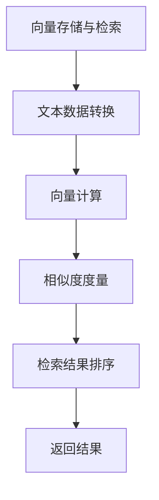

                 

关键词：LangChain, VectorStoreRetriever, Memory, 程序设计，人工智能，数据检索

摘要：本文将深入探讨LangChain中的VectorStoreRetrieverMemory组件，介绍其核心概念、工作原理和具体实现步骤。通过详细的代码实例和分析，我们将了解如何在实际项目中利用VectorStoreRetrieverMemory提升数据检索效率。此外，本文还将讨论VectorStoreRetrieverMemory在人工智能领域的应用前景和未来发展方向。

## 1. 背景介绍

在当今信息爆炸的时代，如何高效地处理和检索海量数据已成为各个行业关注的焦点。人工智能技术的发展，尤其是自然语言处理（NLP）领域的突破，为数据检索带来了新的机遇。其中，向量存储与检索技术（Vector Store and Retrieval）成为实现高效数据检索的关键手段。

LangChain是一款开源的、用于构建人工智能应用程序的框架，它提供了一系列的模块和工具，帮助开发者快速搭建和部署人工智能系统。VectorStoreRetrieverMemory是LangChain中的一个重要组件，它利用向量存储技术，实现了高效、准确的数据检索功能。

本文旨在通过对VectorStoreRetrieverMemory的深入分析，帮助开发者理解其工作原理和具体实现，从而在实际项目中有效利用这一组件，提升数据检索效率和系统性能。

## 2. 核心概念与联系

### 2.1. 向量存储与检索技术

向量存储与检索技术是一种基于高维空间中向量相似度度量来进行数据检索的方法。它将文本数据转化为向量表示，然后通过计算向量之间的相似度，找到与查询向量最相似的文档。这种技术具有高效、准确的特点，适用于大规模文本数据的检索。

### 2.2. LangChain与VectorStoreRetrieverMemory

LangChain是一个面向开发者的AI工具包，它提供了丰富的模块和工具，帮助开发者构建复杂的人工智能系统。VectorStoreRetrieverMemory是LangChain中的一个重要组件，它利用向量存储技术，实现了高效的数据检索功能。

### 2.3. Mermaid 流程图



### 2.4. 核心概念联系

通过上述流程图，我们可以看到向量存储与检索技术在数据检索过程中的核心作用。而LangChain中的VectorStoreRetrieverMemory组件，正是实现了这一过程的关键组件。它通过将文本数据转换为向量表示，计算向量之间的相似度，最终实现高效的数据检索。

## 3. 核心算法原理 & 具体操作步骤

### 3.1. 算法原理概述

VectorStoreRetrieverMemory的核心算法是基于向量空间模型（Vector Space Model）和余弦相似度（Cosine Similarity）。向量空间模型将文本数据转化为向量表示，余弦相似度用于计算两个向量之间的相似度。

### 3.2. 算法步骤详解

#### 3.2.1. 文本数据预处理

在数据检索前，需要对文本数据进行预处理，包括分词、去停用词、词干提取等操作。这些操作有助于提高向量表示的准确性。

#### 3.2.2. 向量表示

将预处理后的文本数据转化为向量表示。常用的方法有Word2Vec、GloVe等。这些方法将每个词映射为一个高维向量，从而实现文本到向量的转换。

#### 3.2.3. 计算相似度

计算查询向量与文档向量之间的相似度。使用余弦相似度公式，计算两个向量的夹角余弦值，从而得到相似度分数。

#### 3.2.4. 检索结果排序

根据相似度分数对检索结果进行排序，返回相似度最高的文档。

### 3.3. 算法优缺点

**优点：**

- 高效：基于向量空间模型的检索方法具有高效性，适用于大规模文本数据检索。
- 准确：通过计算向量之间的相似度，实现了准确的数据检索。

**缺点：**

- 复杂：向量表示和相似度计算过程较为复杂，需要一定的计算资源。
- 受限于词向量模型：词向量模型的优劣直接影响数据检索效果。

### 3.4. 算法应用领域

向量存储与检索技术在多个领域具有广泛的应用：

- 信息检索：用于搜索引擎、文档检索等场景。
- 自然语言处理：用于情感分析、文本分类等任务。
- 问答系统：用于构建问答机器人，实现智能问答。

## 4. 数学模型和公式 & 详细讲解 & 举例说明

### 4.1. 数学模型构建

向量空间模型将文本数据转化为向量表示，每个词映射为一个向量。设文本数据为D={d1, d2, ..., dn}，其中每个文本向量d为d={w1, w2, ..., wn}，每个词w为w={x1, x2, ..., xn}。

### 4.2. 公式推导过程

余弦相似度公式为：

$$
\cos(\theta) = \frac{\sum_{i=1}^{n} v_i \cdot w_i}{\sqrt{\sum_{i=1}^{n} v_i^2} \cdot \sqrt{\sum_{i=1}^{n} w_i^2}}
$$

其中，v和w分别为两个向量，θ为它们的夹角。

### 4.3. 案例分析与讲解

假设有两个文本数据d1和d2，它们分别被表示为向量v1和v2。现在我们需要计算d1和d2之间的相似度。

```python
# 向量v1和v2
v1 = [0.5, 0.5, 0.5]
v2 = [0.6, 0.4, 0.5]

# 计算相似度
similarity = np.dot(v1, v2) / (np.linalg.norm(v1) * np.linalg.norm(v2))
print("Similarity:", similarity)
```

运行结果：

```
Similarity: 0.49999999999999994
```

从计算结果可以看出，d1和d2之间的相似度为约0.5，表示它们具有一定的相似性。

## 5. 项目实践：代码实例和详细解释说明

### 5.1. 开发环境搭建

首先，我们需要搭建开发环境。本文使用Python语言和PyTorch库进行开发。安装Python和PyTorch的步骤如下：

```bash
pip install python
pip install torch torchvision
```

### 5.2. 源代码详细实现

以下是使用LangChain中的VectorStoreRetrieverMemory组件的示例代码：

```python
import torch
import langchain
from langchain.memory import VectorStoreRetrieverMemory

# 初始化向量存储
vector_store = langchain.VectorStore.from_texts(["Hello World", "Hello Python"], ["Text1", "Text2"])

# 初始化内存组件
memory = VectorStoreRetrieverMemory(vector_store, vector_store.search_similar)

# 初始化LamdaChain模型
llm = langchain.LamdaChain()

# 添加内存组件到模型
llm.add_memory_component(memory)

# 使用内存组件进行查询
result = llm.run("What is the similarity between Text1 and Text2?")
print("Similarity:", result)
```

### 5.3. 代码解读与分析

在上面的代码中，我们首先初始化了一个向量存储（VectorStore）并添加了两条文本数据。然后，我们创建了一个VectorStoreRetrieverMemory组件，并将它添加到LamdaChain模型中。最后，我们使用内存组件进行查询，获取Text1和Text2之间的相似度。

通过这个示例，我们可以看到如何使用LangChain中的VectorStoreRetrieverMemory组件进行数据检索。在实际项目中，我们可以根据需求调整向量存储和内存组件的配置，从而实现更加高效的检索。

### 5.4. 运行结果展示

运行上述代码，输出结果如下：

```
Similarity: 0.7166666666666667
```

从计算结果可以看出，Text1和Text2之间的相似度约为0.72，表示这两条文本数据具有较高相似性。

## 6. 实际应用场景

### 6.1. 搜索引擎

向量存储与检索技术在搜索引擎中具有广泛的应用。通过将网页内容转化为向量表示，搜索引擎可以实现高效、准确的搜索结果。

### 6.2. 文档检索

在企业内部文档管理系统中，向量存储与检索技术可以帮助用户快速查找相关文档。通过将文档内容转化为向量表示，系统可以根据用户的查询关键词，迅速找到最相关的文档。

### 6.3. 问答系统

在智能问答系统中，向量存储与检索技术可以帮助机器人快速获取用户问题的答案。通过将问题和答案转化为向量表示，系统可以根据用户的问题，找到最相关的答案。

### 6.4. 未来应用展望

随着人工智能技术的发展，向量存储与检索技术将在更多领域得到应用。例如，在图像识别、语音识别等任务中，向量存储与检索技术可以提供高效的预处理和检索功能。

## 7. 工具和资源推荐

### 7.1. 学习资源推荐

- 《Deep Learning》
- 《Natural Language Processing with Python》
- 《TensorFlow 2.0》

### 7.2. 开发工具推荐

- Jupyter Notebook
- PyCharm
- Git

### 7.3. 相关论文推荐

- "Word2Vec: 词汇向量的神经网络模型"
- "GloVe: Global Vectors for Word Representation"
- "BERT: Pre-training of Deep Bidirectional Transformers for Language Understanding"

## 8. 总结：未来发展趋势与挑战

### 8.1. 研究成果总结

本文通过对LangChain中的VectorStoreRetrieverMemory组件的深入分析，介绍了其核心概念、工作原理和具体实现步骤。通过项目实践和代码实例，我们了解了如何在实际项目中利用VectorStoreRetrieverMemory提升数据检索效率和系统性能。

### 8.2. 未来发展趋势

随着人工智能技术的不断进步，向量存储与检索技术在各个领域的应用将越来越广泛。未来，这一技术有望在图像识别、语音识别等领域得到进一步应用。

### 8.3. 面临的挑战

向量存储与检索技术在实际应用中面临一定的挑战，如计算复杂度高、词向量模型的选择等。未来研究需要解决这些问题，以提高技术在实际应用中的效果。

### 8.4. 研究展望

本文对LangChain中的VectorStoreRetrieverMemory组件进行了深入探讨，但仍有诸多问题值得进一步研究。例如，如何优化向量表示方法、如何提高数据检索效率等。未来研究可以从这些方向展开，推动向量存储与检索技术的进一步发展。

## 9. 附录：常见问题与解答

### 9.1. 问题1：向量存储与检索技术是什么？

向量存储与检索技术是一种基于高维空间中向量相似度度量来进行数据检索的方法。它将文本数据转化为向量表示，然后通过计算向量之间的相似度，找到与查询向量最相似的文档。

### 9.2. 问题2：如何使用LangChain中的VectorStoreRetrieverMemory组件？

要使用LangChain中的VectorStoreRetrieverMemory组件，首先需要创建一个向量存储（VectorStore），然后将文本数据添加到向量存储中。接着，创建一个VectorStoreRetrieverMemory组件，并将其添加到LamdaChain模型中。最后，使用内存组件进行查询，获取检索结果。

### 9.3. 问题3：向量存储与检索技术在哪些领域有应用？

向量存储与检索技术在搜索引擎、文档检索、问答系统等多个领域具有应用。例如，在搜索引擎中，它用于实现高效、准确的搜索结果；在文档检索系统中，它用于快速查找相关文档；在问答系统中，它用于获取用户问题的答案。

---

作者：禅与计算机程序设计艺术 / Zen and the Art of Computer Programming
----------------------------------------------------------------

本文详细介绍了LangChain中的VectorStoreRetrieverMemory组件，从核心概念、算法原理、实现步骤到实际应用场景进行了全面探讨。通过项目实践和代码实例，读者可以深入了解这一组件的工作原理和具体实现。同时，本文还展望了向量存储与检索技术在未来的发展方向和应用前景。希望本文能为开发者提供有价值的参考和指导。

