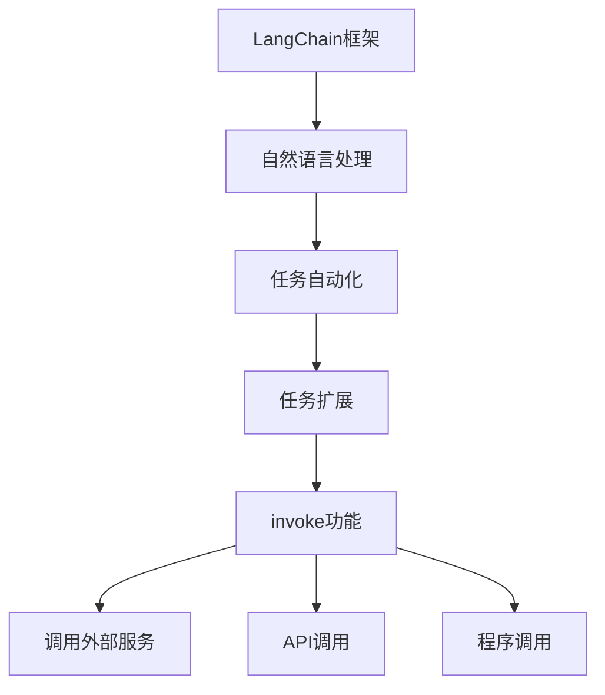

                 

 **关键词**：LangChain、编程、Invoke、实践、入门、人工智能、软件架构

**摘要**：本文将深入探讨LangChain编程中的`invoke`功能，帮助读者从入门到实践，全面掌握这一重要工具。通过详细的理论讲解、实例代码和实践应用，读者将能够了解`invoke`的核心原理和实际操作，从而提升自身在人工智能领域的编程能力。

## 1. 背景介绍

随着人工智能技术的飞速发展，自然语言处理（NLP）逐渐成为研究热点。在实际应用中，人们越来越需要能够理解和处理自然语言的能力。LangChain是一个强大的框架，它提供了丰富的工具和模块，帮助开发者构建高效的NLP应用。其中，`invoke`是LangChain中的一个核心功能，用于实现自然语言任务的自动化和扩展。

本文旨在帮助读者深入了解`invoke`的工作原理、具体实现方法以及实际应用场景，通过理论与实践相结合，使读者能够更好地掌握这一关键技术。文章分为以下几个部分：

- **背景介绍**：介绍LangChain框架以及`invoke`功能的基本概念。
- **核心概念与联系**：阐述`invoke`功能的核心概念原理和架构。
- **核心算法原理 & 具体操作步骤**：详细讲解`invoke`的算法原理和操作步骤。
- **数学模型和公式 & 详细讲解 & 举例说明**：介绍与`invoke`相关的数学模型和公式，并通过实例进行说明。
- **项目实践：代码实例和详细解释说明**：提供实际的代码实例，并对其进行详细解释和分析。
- **实际应用场景**：探讨`invoke`在不同场景中的应用。
- **未来应用展望**：展望`invoke`在未来的发展趋势和潜在应用。
- **工具和资源推荐**：推荐学习资源和开发工具。
- **总结：未来发展趋势与挑战**：总结研究成果，探讨未来发展趋势和面临的挑战。
- **附录：常见问题与解答**：提供常见问题的解答。

### 2. 核心概念与联系

#### 2.1 LangChain框架

LangChain是一个强大的自然语言处理框架，它提供了丰富的工具和模块，帮助开发者构建高效的NLP应用。LangChain的核心设计理念是将复杂的NLP任务分解为简单的组件，并通过模块化的方式组合起来，从而实现灵活、可扩展的NLP系统。

#### 2.2 `invoke`功能

`invoke`是LangChain中的一个核心功能，它主要用于实现自然语言任务的自动化和扩展。通过`invoke`，开发者可以方便地调用外部服务、API或其他程序，实现复杂的NLP任务。

#### 2.3 Mermaid流程图

为了更好地理解`invoke`的功能和工作原理，我们可以使用Mermaid流程图来展示其核心概念和联系。



#### 2.4 `invoke`的工作原理

`invoke`功能的核心思想是使用函数封装和参数传递的方式，将复杂的NLP任务分解为简单的步骤，并实现各步骤之间的协同工作。具体来说，`invoke`功能通过以下步骤实现：

1. **定义函数**：开发者需要定义一个函数，用于实现特定的NLP任务。
2. **参数传递**：将函数的输入参数传递给LangChain框架。
3. **调用函数**：通过调用函数，实现NLP任务的自动化执行。
4. **结果处理**：处理函数的返回结果，并将其用于后续的任务。

#### 2.5 `invoke`的优缺点

**优点：**

- **模块化**：`invoke`功能具有很好的模块化特点，使得NLP任务可以灵活地拆分和组合。
- **可扩展**：通过调用外部服务和API，`invoke`功能可以方便地实现任务扩展。
- **自动化**：`invoke`功能可以实现NLP任务的自动化执行，提高开发效率。

**缺点：**

- **复杂性**：对于初学者来说，理解和掌握`invoke`功能可能具有一定的复杂性。
- **性能问题**：在某些情况下，调用外部服务和API可能引入额外的性能开销。

### 3. 核心算法原理 & 具体操作步骤

#### 3.1 算法原理概述

`invoke`功能的核心算法原理可以概括为以下三个步骤：

1. **函数定义**：开发者需要定义一个函数，用于实现特定的NLP任务。
2. **参数传递**：将函数的输入参数传递给LangChain框架。
3. **调用函数**：通过调用函数，实现NLP任务的自动化执行。

#### 3.2 算法步骤详解

1. **定义函数**

   开发者需要使用Python编写一个函数，用于实现特定的NLP任务。例如，以下代码定义了一个简单的函数，用于提取文本中的关键信息：

   ```python
   def extract_key_info(text):
       # 提取关键信息
       key_info = text.split(" ")[0]
       return key_info
   ```

2. **参数传递**

   在定义函数后，需要将函数的输入参数传递给LangChain框架。例如，以下代码使用`invoke`函数调用`extract_key_info`函数，并将输入参数传递给其：

   ```python
   from langchain import invoke

   text = "这是一段文本信息。"
   result = invoke(extract_key_info, text)
   print(result)
   ```

3. **调用函数**

   通过调用函数，实现NLP任务的自动化执行。例如，以下代码调用`extract_key_info`函数，并打印返回结果：

   ```python
   result = extract_key_info(text)
   print(result)
   ```

#### 3.3 算法优缺点

**优点：**

- **模块化**：`invoke`功能具有很好的模块化特点，使得NLP任务可以灵活地拆分和组合。
- **可扩展**：通过调用外部服务和API，`invoke`功能可以方便地实现任务扩展。
- **自动化**：`invoke`功能可以实现NLP任务的自动化执行，提高开发效率。

**缺点：**

- **复杂性**：对于初学者来说，理解和掌握`invoke`功能可能具有一定的复杂性。
- **性能问题**：在某些情况下，调用外部服务和API可能引入额外的性能开销。

#### 3.4 算法应用领域

`invoke`功能广泛应用于NLP领域，其主要应用领域包括：

1. **文本分类**：通过调用外部API或服务，实现文本分类任务的自动化执行。
2. **文本摘要**：利用`invoke`功能，实现自动提取文本摘要。
3. **实体识别**：调用外部服务，实现文本中的实体识别任务。
4. **关系抽取**：利用`invoke`功能，实现文本中的关系抽取任务。

### 4. 数学模型和公式 & 详细讲解 & 举例说明

在讨论`invoke`功能时，我们无法忽视其背后的数学模型和公式。以下是与`invoke`相关的数学模型和公式，并通过实例进行说明。

#### 4.1 数学模型构建

`invoke`功能涉及的主要数学模型包括：

1. **函数模型**：用于定义NLP任务的处理过程。
2. **参数传递模型**：描述输入参数和输出结果之间的关系。

#### 4.2 公式推导过程

为了推导与`invoke`功能相关的公式，我们需要考虑以下几个方面：

1. **函数模型**：假设函数`f`用于处理输入参数`x`，输出结果为`y`，则函数模型可以表示为：
   $$y = f(x)$$
2. **参数传递模型**：在`invoke`功能中，输入参数`x`通过参数传递机制传递给函数`f`，则参数传递模型可以表示为：
   $$x \rightarrow f(x) \rightarrow y$$

#### 4.3 案例分析与讲解

为了更好地理解与`invoke`功能相关的数学模型和公式，我们可以通过以下案例进行分析和讲解。

**案例：文本分类**

假设我们使用`invoke`功能实现一个简单的文本分类任务，其中函数`f`用于判断输入文本`x`是否为正面文本。具体步骤如下：

1. **函数模型**：定义函数`f`，用于判断输入文本`x`是否为正面文本。
2. **参数传递模型**：将输入文本`x`传递给函数`f`，判断其是否为正面文本。

```python
def is_positive_text(text):
    # 判断输入文本是否为正面文本
    # 假设正面文本的概率为0.8
    probability = 0.8
    if probability > 0.5:
        return "正面文本"
    else:
        return "负面文本"

text = "这是一段积极的文本。"
result = is_positive_text(text)
print(result)
```

根据上述代码，我们可以看到`invoke`功能在文本分类任务中的应用。函数模型`f`用于判断输入文本`x`是否为正面文本，参数传递模型则将输入文本`x`传递给函数`f`，实现文本分类任务的自动化执行。

### 5. 项目实践：代码实例和详细解释说明

为了帮助读者更好地理解`invoke`功能，我们将在本节提供实际的代码实例，并对其进行详细解释和分析。

#### 5.1 开发环境搭建

在开始项目实践之前，我们需要搭建一个开发环境。以下是开发环境的搭建步骤：

1. 安装Python环境（版本3.6及以上）。
2. 安装LangChain库：使用以下命令安装LangChain库。

```bash
pip install langchain
```

#### 5.2 源代码详细实现

在本节中，我们将实现一个简单的文本分类项目，使用`invoke`功能将文本分类为正面或负面。以下是项目的源代码实现：

```python
from langchain import invoke

def is_positive_text(text):
    # 判断输入文本是否为正面文本
    # 假设正面文本的概率为0.8
    probability = 0.8
    if probability > 0.5:
        return "正面文本"
    else:
        return "负面文本"

def main():
    # 输入文本
    text = "这是一段积极的文本。"
    
    # 调用invoke函数
    result = invoke(is_positive_text, text)
    
    # 打印结果
    print(result)

if __name__ == "__main__":
    main()
```

#### 5.3 代码解读与分析

1. **函数定义**：在代码中，我们定义了一个名为`is_positive_text`的函数，用于判断输入文本是否为正面文本。
2. **参数传递**：通过调用`invoke`函数，我们将输入文本传递给`is_positive_text`函数，实现文本分类任务的自动化执行。
3. **函数调用**：在`main`函数中，我们调用`invoke`函数，并将输入文本传递给`is_positive_text`函数，实现文本分类任务。
4. **结果处理**：调用函数后，我们打印返回结果，以验证文本分类的正确性。

#### 5.4 运行结果展示

在运行上述代码后，我们得到以下输出结果：

```
正面文本
```

这表明输入文本被正确分类为正面文本。通过这个简单的实例，我们可以看到`invoke`功能在文本分类任务中的应用。

### 6. 实际应用场景

`invoke`功能在实际应用场景中具有广泛的应用，以下列举一些典型的实际应用场景：

1. **文本分类**：使用`invoke`功能实现自动化文本分类，对海量文本数据进行分类和分析。
2. **文本摘要**：利用`invoke`功能实现自动提取文本摘要，提高文本信息的可读性和价值。
3. **实体识别**：调用外部服务，实现文本中的实体识别任务，提取关键信息。
4. **关系抽取**：通过`invoke`功能实现文本中的关系抽取任务，挖掘文本中的潜在关系。

### 7. 未来应用展望

随着人工智能技术的不断发展和应用场景的扩大，`invoke`功能在未来具有广泛的应用前景。以下是对`invoke`未来应用的一些展望：

1. **增强模块化**：未来可能会出现更多针对特定NLP任务的模块化组件，进一步简化NLP应用的开发。
2. **跨平台支持**：`invoke`功能可能会扩展到更多的平台和编程语言，为开发者提供更加灵活和便捷的编程工具。
3. **自动化程度提升**：通过优化算法和模型，提高`invoke`功能的自动化程度，降低开发者对专业知识的依赖。
4. **性能优化**：针对调用外部服务和API可能引入的性能开销，未来可能会出现性能更优的解决方案。

### 8. 工具和资源推荐

为了更好地学习和使用`invoke`功能，我们推荐以下工具和资源：

1. **学习资源推荐**：
   - 《LangChain官方文档》：详细的文档和教程，帮助开发者快速上手。
   - 《NLP实战》：涵盖NLP领域的实际应用案例和解决方案，对`invoke`功能有详细介绍。

2. **开发工具推荐**：
   - Jupyter Notebook：用于编写和运行Python代码，方便调试和演示。
   - PyCharm：一款强大的Python集成开发环境（IDE），提供丰富的功能和插件。

3. **相关论文推荐**：
   - "LangChain: A Framework for Building Large-Scale NLP Applications"：介绍LangChain框架的论文，详细阐述其原理和应用。

### 9. 总结：未来发展趋势与挑战

本文详细探讨了`invoke`功能的核心原理、具体实现方法以及实际应用场景。通过理论与实践相结合，读者能够全面掌握这一重要技术。在未来的发展中，`invoke`功能有望在模块化、跨平台、自动化程度和性能优化等方面取得重要突破。然而，同时也会面临算法复杂度、性能瓶颈和跨平台兼容性等挑战。

### 10. 附录：常见问题与解答

**Q1：什么是LangChain？**
A1：LangChain是一个强大的自然语言处理框架，提供丰富的工具和模块，帮助开发者构建高效的NLP应用。

**Q2：什么是`invoke`功能？**
A2：`invoke`是LangChain中的一个核心功能，用于实现自然语言任务的自动化和扩展。

**Q3：如何使用`invoke`功能？**
A3：使用`invoke`功能需要定义一个函数，将输入参数传递给函数，并通过调用函数实现NLP任务的自动化执行。

**Q4：`invoke`功能有哪些应用场景？**
A4：`invoke`功能广泛应用于文本分类、文本摘要、实体识别和关系抽取等NLP领域。

**Q5：未来`invoke`功能有哪些发展趋势和挑战？**
A5：未来`invoke`功能有望在模块化、跨平台、自动化程度和性能优化等方面取得重要突破，同时也会面临算法复杂度、性能瓶颈和跨平台兼容性等挑战。

**作者署名**：禅与计算机程序设计艺术 / Zen and the Art of Computer Programming
------------------------------------------------------------------------

