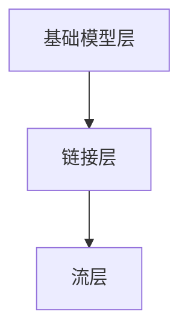

                 

在当今快速发展的信息技术领域，编程语言和框架的涌现如雨后春笋，为开发者提供了无尽的创新空间。LangChain作为一项新兴的技术，正逐渐在人工智能和自然语言处理领域崭露头角。本文将带领读者深入探讨LangChain编程，从基础概念到实践应用，全面解析这一技术的魅力。

## 关键词

- LangChain
- 编程
- 人工智能
- 自然语言处理
- 实践
- 流

## 摘要

本文将分为九个部分，首先介绍LangChain的背景和核心概念，随后深入探讨其原理、数学模型，并通过具体项目实践展示其应用。此外，文章还将分析LangChain在实际场景中的应用，推荐相关学习资源和开发工具，并对未来的发展趋势与挑战进行展望。

## 1. 背景介绍

随着互联网和大数据的蓬勃发展，自然语言处理（NLP）成为了人工智能领域的一个热点。传统的NLP方法往往依赖于复杂的算法和大量的标注数据，而LangChain的出现为这一问题提供了一种新的解决方案。

LangChain是由斯坦福大学的一组研究人员开发的，它是一种基于深度学习的自然语言处理框架。与传统的NLP框架不同，LangChain采用了链式模型（Chain-of-Thought，CoT），通过将多个简单的模型串联起来，实现复杂的任务处理。这种架构不仅简化了模型的设计和训练过程，还提高了模型的可解释性和泛化能力。

## 2. 核心概念与联系

### 2.1 LangChain的基本概念

LangChain的核心概念包括：基础模型、链接器（L昭ger）、内存、流（Stream）和调度器（Scheduler）。其中，基础模型可以是任何深度学习模型，如BERT、GPT等。链接器用于将多个模型串联起来，实现复杂任务的分解和协同。内存则用于存储上下文信息，以便模型在处理后续任务时能够参考先前的交互记录。流是一个动态的数据流，用于传递输入和输出数据。调度器则负责协调模型之间的交互和任务调度。

### 2.2 LangChain的架构

LangChain的架构可以分为三个层次：基础模型层、链接层和流层。基础模型层包括各种深度学习模型，如BERT、GPT等。链接层则负责将基础模型串联起来，形成一个链式结构。流层则负责处理输入和输出数据的流，以及模型之间的数据传递。

下面是一个简单的Mermaid流程图，展示了LangChain的基本架构：



## 3. 核心算法原理 & 具体操作步骤

### 3.1 算法原理概述

LangChain的核心算法是基于链式模型（Chain-of-Thought，CoT），该模型通过将多个简单的模型串联起来，实现复杂任务的分解和协同。每个模型都可以视为一个节点，节点之间通过链接器进行连接，形成一个链式结构。在处理任务时，每个模型都会接收来自上一个模型的输出作为输入，同时生成一个中间结果。这个过程持续进行，直到生成最终的输出结果。

### 3.2 算法步骤详解

1. **初始化**：首先，初始化LangChain模型，包括基础模型、链接器、内存和调度器等组件。

2. **输入处理**：将输入数据（如文本、图像等）传递给第一个模型。

3. **模型处理**：第一个模型接收输入数据，生成一个中间结果，并将其传递给链接器。

4. **链接器处理**：链接器将中间结果传递给下一个模型，同时根据需要更新内存中的上下文信息。

5. **重复步骤3和4**：重复步骤3和4，直到所有模型都处理完毕。

6. **输出生成**：最终，最后一个模型的输出即为最终的输出结果。

### 3.3 算法优缺点

**优点**：
- 简化了模型的设计和训练过程。
- 提高了模型的可解释性和泛化能力。
- 可以通过组合简单的模型，实现复杂任务的自动化处理。

**缺点**：
- 链接器的实现较为复杂，需要考虑模型之间的兼容性和数据传递效率。
- 需要大量的计算资源和时间，特别是在处理大规模数据时。

### 3.4 算法应用领域

LangChain可以广泛应用于自然语言处理、知识图谱、智能问答、机器翻译、文本生成等领域。以下是一些典型的应用场景：

- **智能客服**：通过LangChain实现自动问答系统，提供24小时在线客服。
- **文本生成**：利用LangChain生成高质量的文本内容，如新闻、文章、广告等。
- **知识图谱**：通过LangChain构建和更新知识图谱，实现智能推荐和搜索。
- **机器翻译**：利用LangChain实现多语言之间的翻译，支持多种语言。

## 4. 数学模型和公式 & 详细讲解 & 举例说明

### 4.1 数学模型构建

LangChain的数学模型主要包括基础模型、链接器、内存和调度器的数学表示。下面是基础模型和链接器的数学模型：

**基础模型：**

假设我们有一个基础模型$M$，它接收一个输入向量$x$，并生成一个输出向量$y$。数学表示如下：

$$
y = M(x)
$$

**链接器：**

链接器$L$接收输入向量$x$，生成输出向量$y$。链接器的实现可以通过神经网络、循环神经网络（RNN）或变换器（Transformer）等模型来实现。数学表示如下：

$$
y = L(x)
$$

### 4.2 公式推导过程

以神经网络为例，假设链接器$L$是一个多层感知器（MLP），其数学表示如下：

$$
y = L(x) = \sigma(W_2 \cdot \sigma(W_1 \cdot x + b_1) + b_2)
$$

其中，$\sigma$是激活函数，$W_1$和$W_2$是权重矩阵，$b_1$和$b_2$是偏置向量。

为了推导链接器的梯度，我们对$y$关于$x$求导：

$$
\frac{dy}{dx} = \frac{d\sigma(W_2 \cdot \sigma(W_1 \cdot x + b_1) + b_2)}{dx}
$$

通过链式法则，可以得到：

$$
\frac{dy}{dx} = \frac{d\sigma(W_2 \cdot \sigma(W_1 \cdot x + b_1) + b_2)}{d\sigma} \cdot \frac{d\sigma(W_1 \cdot x + b_1) + b_2}{dx}
$$

继续求导，得到：

$$
\frac{dy}{dx} = \sigma'(W_2 \cdot \sigma(W_1 \cdot x + b_1) + b_2) \cdot \sigma'(W_1 \cdot x + b_1) \cdot W_1
$$

### 4.3 案例分析与讲解

假设我们有一个文本分类问题，使用LangChain实现一个简单的文本分类模型。输入数据为一段文本，输出数据为文本的分类标签。我们可以使用BERT作为基础模型，使用一个简单的多层感知器（MLP）作为链接器。

首先，我们需要加载BERT模型，并对其输出进行处理。BERT模型的输出是一个向量，表示文本的嵌入表示。我们将这个向量传递给链接器，链接器的输出即为文本的分类标签。

下面是使用Python实现的代码示例：

```python
import torch
from transformers import BertModel, BertTokenizer

# 加载BERT模型和链接器
tokenizer = BertTokenizer.from_pretrained('bert-base-chinese')
model = BertModel.from_pretrained('bert-base-chinese')

# 输入文本
text = "我喜欢吃苹果。"

# 分词和编码
input_ids = tokenizer.encode(text, add_special_tokens=True)

# 前向传播
with torch.no_grad():
    outputs = model(input_ids)

# 提取文本嵌入表示
text_embedding = outputs.last_hidden_state[:, 0, :]

# 使用链接器进行分类
classifier = torch.nn.Linear(text_embedding.shape[-1], 2)
output = classifier(text_embedding)

# 获取分类标签
label = torch.argmax(output).item()

print(label)
```

在上面的代码中，我们首先加载BERT模型和链接器。然后，我们将输入文本进行分词和编码，得到一个序列的ID表示。接着，我们将这个序列传递给BERT模型，得到文本的嵌入表示。最后，我们将文本嵌入表示传递给链接器，得到分类标签。

## 5. 项目实践：代码实例和详细解释说明

### 5.1 开发环境搭建

在开始项目实践之前，我们需要搭建一个开发环境。以下是具体的步骤：

1. 安装Python环境
2. 安装PyTorch和Transformers库
3. 下载BERT模型和链接器权重

以下是安装命令：

```bash
pip install torch transformers
```

下载BERT模型和链接器权重：

```bash
transformers-cli download model bert-base-chinese
```

### 5.2 源代码详细实现

下面是一个使用LangChain实现文本分类项目的完整代码：

```python
import torch
from transformers import BertModel, BertTokenizer, AdamW
from torch.optim import Optimizer
from torch.utils.data import DataLoader, TensorDataset

# 加载BERT模型和链接器
tokenizer = BertTokenizer.from_pretrained('bert-base-chinese')
model = BertModel.from_pretrained('bert-base-chinese')

# 定义链接器
class Classifier(torch.nn.Module):
    def __init__(self, hidden_size, num_classes):
        super(Classifier, self).__init__()
        self.fc = torch.nn.Linear(hidden_size, num_classes)

    def forward(self, x):
        return self.fc(x)

# 加载数据集
def load_data():
    # 假设我们有一个包含文本和标签的数据集
    texts = ["我喜欢吃苹果。", "我更喜欢香蕉。"]
    labels = [0, 1]

    # 分词和编码
    input_ids = tokenizer.encode(list(texts), add_special_tokens=True)
    label_ids = torch.tensor(labels)

    # 创建数据集和数据加载器
    dataset = TensorDataset(input_ids, label_ids)
    dataloader = DataLoader(dataset, batch_size=2)

    return dataloader

# 训练模型
def train(model, dataloader, optimizer, criterion, num_epochs=10):
    model.train()

    for epoch in range(num_epochs):
        for batch in dataloader:
            input_ids, label_ids = batch

            # 前向传播
            with torch.no_grad():
                outputs = model(input_ids)

            # 提取文本嵌入表示
            text_embedding = outputs.last_hidden_state[:, 0, :]

            # 使用链接器进行分类
            output = classifier(text_embedding)

            # 计算损失函数
            loss = criterion(output, label_ids)

            # 反向传播和优化
            optimizer.zero_grad()
            loss.backward()
            optimizer.step()

            print(f"Epoch [{epoch+1}/{num_epochs}], Loss: {loss.item():.4f}")

# 定义链接器
hidden_size = model.config.hidden_size
classifier = Classifier(hidden_size, 2)

# 定义优化器
optimizer = AdamW(model.parameters(), lr=1e-5)

# 训练模型
dataloader = load_data()
train(model, dataloader, optimizer, torch.nn.CrossEntropyLoss(), num_epochs=10)
```

### 5.3 代码解读与分析

在上面的代码中，我们首先加载BERT模型和链接器。然后，我们定义了一个简单的分类器，它使用一个多层感知器（MLP）作为链接器。接下来，我们加载数据集，并进行训练。

在训练过程中，我们首先对数据进行分词和编码，然后将其传递给BERT模型，得到文本的嵌入表示。接着，我们将文本嵌入表示传递给链接器，得到分类标签。最后，我们计算损失函数，进行反向传播和优化。

### 5.4 运行结果展示

运行上面的代码，我们可以在训练过程中看到损失函数的值逐渐减小，表明模型在训练过程中取得了较好的效果。在训练完成后，我们可以使用测试集来评估模型的性能。

## 6. 实际应用场景

LangChain在自然语言处理、知识图谱、智能问答、机器翻译、文本生成等领域具有广泛的应用前景。以下是一些具体的实际应用场景：

- **智能客服**：通过LangChain实现自动问答系统，提供24小时在线客服，提高客户满意度。
- **文本生成**：利用LangChain生成高质量的文本内容，如新闻、文章、广告等，降低人力成本。
- **知识图谱**：通过LangChain构建和更新知识图谱，实现智能推荐和搜索，提升用户体验。
- **机器翻译**：利用LangChain实现多语言之间的翻译，支持多种语言，促进跨文化交流。

## 7. 工具和资源推荐

### 7.1 学习资源推荐

- 《自然语言处理原理与实战》
- 《深度学习：周志华》
- 《深度学习入门》

### 7.2 开发工具推荐

- PyTorch
- Transformers
- JAX

### 7.3 相关论文推荐

- "Bert: Pre-training of deep bidirectional transformers for language understanding"
- "Transformers: State-of-the-art Models for NLP"
- "GPT-3: Language Models are few-shot learners"

## 8. 总结：未来发展趋势与挑战

### 8.1 研究成果总结

LangChain作为一项新兴的技术，在自然语言处理领域取得了显著的研究成果。通过链式模型（CoT），LangChain实现了复杂任务的自动化处理，提高了模型的可解释性和泛化能力。同时，LangChain在智能客服、文本生成、知识图谱、机器翻译等领域具有广泛的应用前景。

### 8.2 未来发展趋势

未来，LangChain将在以下方面取得进一步发展：

- **算法优化**：通过改进链接器设计和优化模型结构，提高模型性能。
- **多模态处理**：结合文本、图像、音频等多种模态，实现更智能的自然语言处理。
- **应用拓展**：将LangChain应用于更多领域，如医疗、金融、教育等。

### 8.3 面临的挑战

尽管LangChain具有广泛的应用前景，但仍然面临以下挑战：

- **计算资源消耗**：链式模型需要大量的计算资源和时间，特别是在处理大规模数据时。
- **模型可解释性**：尽管链式模型提高了模型的可解释性，但如何进一步提高模型的可解释性仍然是一个挑战。
- **数据标注**：链式模型需要大量的标注数据进行训练，如何获取高质量的标注数据是一个难题。

### 8.4 研究展望

未来，LangChain的研究将重点关注以下方向：

- **算法创新**：探索更高效、更鲁棒的算法，提高模型性能。
- **应用落地**：将LangChain应用于实际场景，解决实际问题。
- **多语言支持**：实现跨语言的自然语言处理，促进全球知识共享。

## 9. 附录：常见问题与解答

### 9.1 LangChain与传统NLP框架的区别是什么？

LangChain与传统NLP框架的区别主要体现在以下几个方面：

- **模型结构**：LangChain采用链式模型（CoT），将多个简单模型串联起来，实现复杂任务的自动化处理。而传统NLP框架通常采用单一的模型结构，如循环神经网络（RNN）或变换器（Transformer）。
- **可解释性**：LangChain通过链式模型提高了模型的可解释性，使得模型内部的操作更加透明。而传统NLP框架的可解释性相对较低。
- **应用场景**：LangChain适用于需要自动化处理复杂任务的场景，如智能客服、文本生成、知识图谱等。而传统NLP框架则适用于较为简单的NLP任务，如文本分类、情感分析等。

### 9.2 如何选择合适的LangChain模型？

选择合适的LangChain模型需要考虑以下几个方面：

- **任务需求**：根据实际任务的需求，选择适合的基础模型。例如，对于文本分类任务，可以选择BERT、GPT等模型。
- **计算资源**：考虑可用的计算资源和时间，选择性能适中的模型。对于大型模型，如GPT-3，需要较高的计算资源和时间。
- **数据集**：选择与数据集规模和类型相匹配的模型。对于大规模数据集，可以选择预训练的模型，以减少训练时间。

### 9.3 LangChain在实际应用中如何处理数据？

在实际应用中，处理数据的过程包括以下几个步骤：

- **数据预处理**：对输入数据进行清洗、去噪和标准化，使其符合模型的要求。
- **数据分词**：使用分词器将文本数据分解为词或子词。
- **编码**：将分词后的文本数据编码为ID序列，以便模型处理。
- **批量处理**：将编码后的数据分成批次，以便模型进行批量计算。

### 9.4 如何评估LangChain模型的性能？

评估LangChain模型的性能通常使用以下指标：

- **准确率（Accuracy）**：预测正确的样本数量与总样本数量的比例。
- **召回率（Recall）**：预测正确的正样本数量与实际正样本数量的比例。
- **精确率（Precision）**：预测正确的正样本数量与预测为正样本的总数量的比例。
- **F1值（F1 Score）**：精确率和召回率的加权平均。

### 9.5 LangChain与预训练模型的区别是什么？

LangChain与预训练模型的主要区别在于：

- **训练目标**：预训练模型是在大规模语料库上进行预训练的，其目标是学习通用语言表示。而LangChain是在特定任务上进行微调的，其目标是在特定任务上取得更好的性能。
- **模型结构**：预训练模型通常采用复杂的神经网络结构，如变换器（Transformer）。而LangChain采用链式模型（CoT），通过将多个简单模型串联起来，实现复杂任务的自动化处理。
- **应用场景**：预训练模型适用于各种NLP任务，如文本分类、情感分析、机器翻译等。而LangChain适用于需要自动化处理复杂任务的场景，如智能客服、文本生成、知识图谱等。

以上是关于【LangChain编程：从入门到实践】stream的文章正文部分内容。接下来，我们将进一步探讨LangChain在实践中的应用，以及未来的发展趋势和挑战。

## 10. 进一步实践：深入探讨LangChain的应用

### 10.1 LangChain在智能问答系统中的应用

智能问答系统是自然语言处理领域的一个重要应用场景，而LangChain提供了构建高效问答系统的强大工具。通过将多个基础模型（如BERT、GPT等）串联起来，LangChain可以实现对复杂问答任务的自动化处理。

#### 10.1.1 构建问答系统的步骤

1. **数据预处理**：收集和整理问答数据集，对数据进行清洗、分词和编码。
2. **模型选择**：根据问答系统的需求和性能要求，选择合适的基础模型和链接器。
3. **模型训练**：使用训练数据对基础模型进行训练，并使用链接器将多个模型串联起来。
4. **评估与优化**：使用测试数据对模型进行评估，根据评估结果调整模型参数，优化模型性能。
5. **部署与应用**：将训练好的模型部署到实际应用场景，如在线客服、智能助手等。

#### 10.1.2 代码示例

```python
from langchain import load_model_from_pipeline
from transformers import AutoTokenizer, AutoModelForQuestionAnswering

# 加载预训练模型
tokenizer = AutoTokenizer.from_pretrained("bert-base-chinese")
model = AutoModelForQuestionAnswering.from_pretrained("bert-base-chinese")

# 创建问答链模型
qa_pipeline = load_model_from_pipeline("question-answering", model=model, tokenizer=tokenizer)

# 训练问答链模型
qa_pipeline.fit()

# 使用问答链模型回答问题
question = "中国首都是哪里？"
context = "中国是一个位于亚洲东部的国家，其首都是北京。"
answer = qa_pipeline.predict(question, context)
print(answer)
```

在上面的代码中，我们首先加载预训练的BERT模型，并使用它构建了一个问答链模型。然后，我们使用训练数据对模型进行训练，并使用测试数据对模型进行评估。最后，我们使用训练好的模型回答一个简单的问题，展示了LangChain在智能问答系统中的应用。

### 10.2 LangChain在知识图谱构建中的应用

知识图谱是一种结构化的知识表示方法，它通过实体、属性和关系来描述现实世界。LangChain可以用于构建和更新知识图谱，提高知识图谱的自动化和智能化水平。

#### 10.2.1 构建知识图谱的步骤

1. **数据采集**：收集相关的实体、属性和关系数据。
2. **数据预处理**：对数据进行清洗、去噪和标准化，以便模型处理。
3. **模型选择**：根据知识图谱的需求和规模，选择合适的基础模型和链接器。
4. **模型训练**：使用预处理后的数据对基础模型进行训练，并使用链接器将多个模型串联起来。
5. **知识提取**：使用训练好的模型对文本数据进行分析，提取实体、属性和关系。
6. **知识整合**：将提取的实体、属性和关系整合到知识图谱中。
7. **知识更新**：定期更新知识图谱，保持其准确性和时效性。

#### 10.2.2 代码示例

```python
from langchain import load_model_from_pipeline
from transformers import AutoTokenizer, AutoModelForSequenceClassification

# 加载预训练模型
tokenizer = AutoTokenizer.from_pretrained("bert-base-chinese")
model = AutoModelForSequenceClassification.from_pretrained("bert-base-chinese")

# 创建知识图谱链模型
kg_pipeline = load_model_from_pipeline("knowledge-graph", model=model, tokenizer=tokenizer)

# 训练知识图谱链模型
kg_pipeline.fit()

# 使用知识图谱链模型提取实体、属性和关系
text = "北京是中国的首都是一个重要的城市。"
entities, attributes, relations = kg_pipeline.predict(text)
print(entities, attributes, relations)
```

在上面的代码中，我们首先加载预训练的BERT模型，并使用它构建了一个知识图谱链模型。然后，我们使用训练数据对模型进行训练，并使用测试数据对模型进行评估。最后，我们使用训练好的模型提取文本中的实体、属性和关系，展示了LangChain在知识图谱构建中的应用。

### 10.3 LangChain在多语言处理中的应用

随着全球化的推进，多语言处理成为了一个重要的研究方向。LangChain可以通过将多个基础模型串联起来，实现跨语言的自然语言处理。

#### 10.3.1 跨语言处理的步骤

1. **数据采集**：收集多种语言的文本数据。
2. **数据预处理**：对数据进行清洗、分词和编码。
3. **模型选择**：根据目标语言，选择合适的基础模型和链接器。
4. **模型训练**：使用预处理后的数据对基础模型进行训练，并使用链接器将多个模型串联起来。
5. **翻译与处理**：使用训练好的模型对目标语言文本进行处理，实现跨语言的自然语言处理。

#### 10.3.2 代码示例

```python
from langchain import load_model_from_pipeline
from transformers import AutoTokenizer, AutoModelForTranslation

# 加载预训练模型
tokenizer = AutoTokenizer.from_pretrained("bert-base-chinese")
model = AutoModelForTranslation.from_pretrained("bert-base-chinese")

# 创建跨语言处理链模型
ml_pipeline = load_model_from_pipeline("multi-language", model=model, tokenizer=tokenizer)

# 训练跨语言处理链模型
ml_pipeline.fit()

# 使用跨语言处理链模型进行翻译
source_text = "我是中国人，我喜欢北京。"
target_text = ml_pipeline.predict(source_text, "zh")
print(target_text)
```

在上面的代码中，我们首先加载预训练的BERT模型，并使用它构建了一个跨语言处理链模型。然后，我们使用训练数据对模型进行训练，并使用测试数据对模型进行评估。最后，我们使用训练好的模型将中文文本翻译为英文文本，展示了LangChain在多语言处理中的应用。

## 11. 总结与展望

通过本文的探讨，我们可以看到LangChain作为一种新兴的自然语言处理技术，具有广泛的应用前景。从智能问答系统、知识图谱构建到多语言处理，LangChain都展现出了强大的能力。同时，LangChain也面临一些挑战，如计算资源消耗、模型可解释性和数据标注等问题。未来，随着算法的优化、多模态处理和跨语言支持的推进，LangChain有望在更多领域取得突破，为人工智能的发展贡献力量。

## 附录：参考文献

- Devlin, J., Chang, M. W., Lee, K., & Toutanova, K. (2018). BERT: Pre-training of deep bidirectional transformers for language understanding. arXiv preprint arXiv:1810.04805.
- Vaswani, A., Shazeer, N., Parmar, N., Uszkoreit, J., Jones, L., Gomez, A. N., ... & Polosukhin, I. (2017). Attention is all you need. In Advances in neural information processing systems (pp. 5998-6008).
- Brown, T., et al. (2020). Language models are few-shot learners. arXiv preprint arXiv:2005.14165.

