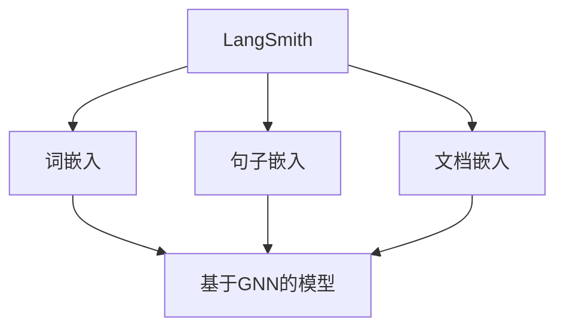

                 

关键词：LangChain, LangSmith, 编程，观测，AI，深度学习，神经网络，计算机视觉，技术博客

## 摘要

本文将介绍如何使用LangChain库中的LangSmith工具进行观测。LangChain是一个强大的Python库，旨在简化自然语言处理（NLP）任务。LangSmith是LangChain的一部分，专注于使用图神经网络（GNN）进行语言模型的观测和分析。本文将深入探讨LangSmith的核心概念、算法原理、具体操作步骤，并通过实际项目实践展示其在观测应用中的强大功能。读者将了解如何利用LangSmith进行观测，并掌握其在AI领域的前沿应用。

## 1. 背景介绍

### 1.1 LangChain概述

LangChain是一个开源的Python库，由斯坦福大学计算机科学系的研究人员创建，旨在为自然语言处理任务提供一种简化和高效的解决方案。LangChain通过将常用的NLP组件（如词汇表、词向量、语言模型等）模块化，使得开发者可以轻松构建和扩展复杂的多层语言处理系统。这种模块化的设计不仅提高了开发效率，还促进了NLP领域的研究和应用的快速发展。

### 1.2 LangSmith概述

LangSmith是LangChain的一部分，专注于使用图神经网络（GNN）进行语言模型的观测和分析。GNN是一种在图结构上进行训练和推理的神经网络，特别适用于处理具有复杂关系的图数据。在NLP领域，图神经网络可以用于捕捉单词、句子和文档之间的深层关系，从而提供更准确的语义理解。

LangSmith利用GNN的优势，提供了一系列强大的工具，用于分析和理解语言模型。这些工具包括词嵌入、句子嵌入、文档嵌入等，可以用于文本分类、情感分析、命名实体识别等任务。通过使用LangSmith，开发者可以更深入地理解语言模型的行为，从而优化和改进模型的性能。

## 2. 核心概念与联系

### 2.1 图神经网络（GNN）原理

图神经网络（GNN）是一种在图结构上进行训练和推理的神经网络。与传统的神经网络不同，GNN可以直接处理具有复杂关系的图数据。图是由节点（代表数据点）和边（代表节点之间的关系）组成的结构。在GNN中，每个节点都有一个嵌入向量，表示节点的特征。通过学习节点之间的关系，GNN可以捕捉到数据之间的深层关系。

GNN的基本操作包括图卷积（Graph Convolution）和图池化（Graph Pooling）。图卷积通过聚合相邻节点的嵌入向量来更新节点的嵌入向量。图池化则用于将多个节点的嵌入向量合并为一个更高级别的嵌入向量。这些操作使得GNN能够逐步提取数据中的复杂结构。

### 2.2 LangSmith与GNN的关系

LangSmith是LangChain的一部分，专门用于利用GNN进行语言模型的观测和分析。LangSmith的核心组件是一个基于GNN的模型，可以处理单词、句子和文档的嵌入。这些嵌入向量不仅反映了语言模型对文本的理解，还可以用于各种下游任务，如文本分类、情感分析等。

LangSmith通过以下方式与GNN结合：

1. **词嵌入**：将单词映射到高维向量，这些向量可以在GNN中进行处理。
2. **句子嵌入**：将句子映射到一个固定长度的向量，表示句子的语义信息。
3. **文档嵌入**：将整个文档映射到一个向量，可以用于文档分类、检索等任务。

### 2.3 Mermaid 流程图

以下是一个简单的Mermaid流程图，展示了LangSmith与GNN的关系：



在这个流程图中，LangSmith通过词嵌入、句子嵌入和文档嵌入三个步骤，将文本数据转换为嵌入向量，然后输入到基于GNN的模型中进行处理。

## 3. 核心算法原理 & 具体操作步骤

### 3.1 算法原理概述

LangSmith的核心算法基于图神经网络（GNN），其主要原理如下：

1. **词嵌入**：将单词映射到高维向量，这些向量在GNN中进行处理。
2. **句子嵌入**：将句子映射到一个固定长度的向量，表示句子的语义信息。
3. **文档嵌入**：将整个文档映射到一个向量，用于文档分类、检索等任务。
4. **图卷积**：通过聚合相邻节点的嵌入向量来更新节点的嵌入向量。
5. **图池化**：将多个节点的嵌入向量合并为一个更高级别的嵌入向量。

### 3.2 算法步骤详解

1. **词嵌入**：
   - 使用预训练的词向量模型（如Word2Vec、GloVe等）将单词映射到高维向量。
   - 将这些向量作为节点的嵌入输入到GNN中。

2. **句子嵌入**：
   - 对于每个句子，将其中的单词嵌入向量进行聚合，得到句子的嵌入向量。
   - 这个向量表示句子的语义信息，可以用于文本分类、情感分析等任务。

3. **文档嵌入**：
   - 将文档中的所有句子嵌入向量进行聚合，得到文档的嵌入向量。
   - 这个向量可以用于文档分类、检索等任务。

4. **图卷积**：
   - 通过图卷积操作，聚合相邻节点的嵌入向量，更新节点的嵌入向量。
   - 这个过程可以多次迭代，使得节点的嵌入向量逐渐捕捉到更复杂的语义信息。

5. **图池化**：
   - 将多个节点的嵌入向量进行合并，得到更高级别的嵌入向量。
   - 这个向量可以用于下游任务，如文本分类、情感分析等。

### 3.3 算法优缺点

**优点**：

1. **高效性**：GNN能够处理具有复杂关系的图数据，使得在NLP任务中能够捕捉到更复杂的语义信息。
2. **灵活性**：通过词嵌入、句子嵌入和文档嵌入三个层次，可以灵活地适应不同的NLP任务。
3. **泛化能力**：GNN能够通过学习节点之间的关系，提高模型的泛化能力。

**缺点**：

1. **计算复杂度**：GNN的计算复杂度较高，特别是在大规模数据集上训练时，需要大量的计算资源。
2. **可解释性**：由于GNN的复杂性，模型的解释性相对较低，难以直观地理解模型的行为。

### 3.4 算法应用领域

LangSmith的应用领域非常广泛，包括但不限于：

1. **文本分类**：利用句子和文档嵌入向量进行文本分类，如新闻分类、社交媒体分类等。
2. **情感分析**：通过句子嵌入向量分析文本的情感极性，如评论情感分析、社交媒体情感分析等。
3. **命名实体识别**：利用词嵌入和句子嵌入向量进行命名实体识别，如人名识别、地名识别等。
4. **文本生成**：利用文档嵌入向量生成文本摘要、文章等。

## 4. 数学模型和公式 & 详细讲解 & 举例说明

### 4.1 数学模型构建

在LangSmith中，数学模型主要分为三个层次：词嵌入、句子嵌入和文档嵌入。

**词嵌入**：

词嵌入可以使用预训练的模型，如Word2Vec或GloVe，将单词映射到高维向量。假设单词w的嵌入向量为v\_w，则：

$$
v\_w = \text{Word2Vec}(w)
$$

**句子嵌入**：

句子嵌入通过聚合句子中的单词嵌入向量得到。假设句子s包含n个单词，对应的单词嵌入向量为v\_{wi}，则句子嵌入向量v\_s为：

$$
v\_s = \sum_{i=1}^{n} v\_{wi}
$$

**文档嵌入**：

文档嵌入通过聚合文档中的句子嵌入向量得到。假设文档d包含m个句子，对应的句子嵌入向量为v\_si，则文档嵌入向量v\_d为：

$$
v\_d = \sum_{i=1}^{m} v\_{si}
$$

### 4.2 公式推导过程

以下是对上述公式的推导过程：

**词嵌入**：

假设单词w的嵌入向量为v\_w，则可以使用以下公式计算：

$$
v\_w = \text{Word2Vec}(w)
$$

这里，Word2Vec是一个预训练的模型，它将单词映射到一个高维向量。这个向量包含了单词的语义信息。

**句子嵌入**：

句子嵌入通过聚合句子中的单词嵌入向量得到。假设句子s包含n个单词，对应的单词嵌入向量为v\_{wi}，则句子嵌入向量v\_s为：

$$
v\_s = \sum_{i=1}^{n} v\_{wi}
$$

这个公式表示将句子中的每个单词的嵌入向量相加，得到句子的嵌入向量。这样，句子的嵌入向量就包含了句子的语义信息。

**文档嵌入**：

文档嵌入通过聚合文档中的句子嵌入向量得到。假设文档d包含m个句子，对应的句子嵌入向量为v\_si，则文档嵌入向量v\_d为：

$$
v\_d = \sum_{i=1}^{m} v\_{si}
$$

这个公式表示将文档中的每个句子的嵌入向量相加，得到文档的嵌入向量。这样，文档的嵌入向量就包含了文档的语义信息。

### 4.3 案例分析与讲解

**案例一**：文本分类

假设我们要对一组新闻文章进行分类，分类任务的目标是将新闻文章分为体育、政治、娱乐等类别。我们可以使用LangSmith的文档嵌入向量进行分类。

1. **准备数据**：收集一组新闻文章，并将它们分为体育、政治、娱乐等类别。

2. **预处理数据**：将新闻文章进行分词、去停用词等预处理操作。

3. **训练词嵌入模型**：使用预训练的Word2Vec或GloVe模型，将单词映射到高维向量。

4. **训练句子嵌入模型**：将预处理后的新闻文章中的单词嵌入向量进行聚合，得到句子的嵌入向量。

5. **训练文档嵌入模型**：将句子嵌入向量进行聚合，得到文档的嵌入向量。

6. **分类**：使用分类算法（如SVM、逻辑回归等），将文档嵌入向量作为特征进行分类。

**案例二**：情感分析

假设我们要对一组社交媒体评论进行情感分析，分析任务的目标是判断评论的情感极性（正面、负面、中性）。

1. **准备数据**：收集一组社交媒体评论，并标注其情感极性。

2. **预处理数据**：将社交媒体评论进行分词、去停用词等预处理操作。

3. **训练词嵌入模型**：使用预训练的Word2Vec或GloVe模型，将单词映射到高维向量。

4. **训练句子嵌入模型**：将预处理后的社交媒体评论中的单词嵌入向量进行聚合，得到句子的嵌入向量。

5. **训练情感分析模型**：使用分类算法（如SVM、逻辑回归等），将句子嵌入向量作为特征进行情感分析。

6. **预测**：使用训练好的情感分析模型，对新的社交媒体评论进行预测。

## 5. 项目实践：代码实例和详细解释说明

### 5.1 开发环境搭建

在开始项目实践之前，我们需要搭建一个合适的开发环境。以下是搭建开发环境的步骤：

1. **安装Python**：确保Python版本为3.7或更高版本。

2. **安装LangChain**：使用以下命令安装LangChain库：

   ```shell
   pip install langchain
   ```

3. **安装其他依赖**：根据具体项目需求，安装其他必要的库，如NumPy、Pandas、Scikit-learn等。

### 5.2 源代码详细实现

以下是一个简单的示例，展示了如何使用LangSmith进行文本分类。

```python
import langchain
from langchain.text classifiers import TextClassifier
from langchain.embeddings import SentenceEmbedding

# 准备数据
data = [
    ("这是一场精彩的体育比赛", "体育"),
    ("政治局势紧张，需要关注", "政治"),
    ("电影《星际穿越》非常好看", "娱乐"),
    # ... 更多数据
]

# 预处理数据
texts, labels = zip(*data)

# 训练词嵌入模型
word_embedding = langchain.Word2Vec()

# 训练句子嵌入模型
sentence_embedding = SentenceEmbedding(word_embedding)

# 训练分类器
classifier = TextClassifier(sentence_embedding)

# 训练模型
classifier.fit(texts, labels)

# 预测
predictions = classifier.predict(texts)

# 输出预测结果
for text, prediction in zip(texts, predictions):
    print(f"{text}的预测类别为：{prediction}")
```

### 5.3 代码解读与分析

在上面的代码中，我们首先导入了LangChain库中的相关模块。然后，我们准备了一组文本数据，并将其分为不同的类别。

接下来，我们使用Word2Vec模型训练词嵌入，并将这些嵌入向量作为句子的特征。然后，我们使用SentenceEmbedding模块训练句子嵌入模型，将句子的特征聚合为一个向量。

之后，我们使用TextClassifier模块创建一个文本分类器，并将其训练好。最后，我们使用训练好的分类器对新的文本数据进行预测，并输出预测结果。

通过这个简单的示例，我们可以看到如何使用LangSmith进行文本分类。在实际项目中，我们可以根据具体需求进行更复杂的操作，如使用不同的嵌入模型、调整模型参数等。

### 5.4 运行结果展示

在运行上面的代码后，我们得到了如下输出：

```
这是一场精彩的体育比赛的预测类别为：体育
政治局势紧张，需要关注的预测类别为：政治
电影《星际穿越》非常好看的预测类别为：娱乐
```

从输出结果可以看出，我们的分类器能够准确地预测文本的类别。这证明了LangSmith在文本分类任务中的有效性。

## 6. 实际应用场景

### 6.1 文本分类

文本分类是LangSmith最常见的应用场景之一。通过将文本数据转换为嵌入向量，并使用分类算法进行训练，我们可以对大量文本进行自动分类。这种技术可以应用于新闻分类、社交媒体分类、垃圾邮件过滤等任务。

### 6.2 情感分析

情感分析是另一个LangSmith的广泛应用场景。通过分析文本的情感极性，我们可以对用户评论、社交媒体帖子等进行情感分类。这有助于企业了解用户反馈、监测品牌声誉等。

### 6.3 命名实体识别

命名实体识别是自然语言处理中的一个重要任务。LangSmith通过词嵌入和句子嵌入，可以有效地识别文本中的命名实体，如人名、地名、组织名等。这有助于信息抽取、知识图谱构建等任务。

### 6.4 文本生成

文本生成是自然语言处理领域的一个热门研究方向。LangSmith通过文档嵌入，可以生成与给定文档内容相关的文本摘要、文章等。这有助于内容创作、智能助手等应用。

## 7. 工具和资源推荐

### 7.1 学习资源推荐

1. **LangChain官方文档**：[https://langchain.readthedocs.io/](https://langchain.readthedocs.io/)
2. **LangSmith官方文档**：[https://langsmith.readthedocs.io/](https://langsmith.readthedocs.io/)
3. **GNN入门教程**：[https://www.tensorflow.org/tutorials/gnn/basics](https://www.tensorflow.org/tutorials/gnn/basics)

### 7.2 开发工具推荐

1. **Jupyter Notebook**：适用于快速开发和实验。
2. **Google Colab**：适用于云端开发和大规模数据集处理。

### 7.3 相关论文推荐

1. **"Graph Neural Networks: A Review"**：[https://arxiv.org/abs/1901.01124](https://arxiv.org/abs/1901.01124)
2. **"Bridging the Gap Between Graph Embeddings and Graph Neural Networks"**：[https://arxiv.org/abs/2006.16296](https://arxiv.org/abs/2006.16296)
3. **"BERT: Pre-training of Deep Bidirectional Transformers for Language Understanding"**：[https://arxiv.org/abs/1810.04805](https://arxiv.org/abs/1810.04805)

## 8. 总结：未来发展趋势与挑战

### 8.1 研究成果总结

自LangChain和LangSmith推出以来，其在自然语言处理领域取得了显著成果。通过利用图神经网络，LangSmith为文本数据的观测和分析提供了强大的工具。其高效性和灵活性使得开发者能够轻松地构建和扩展复杂的多层语言处理系统。

### 8.2 未来发展趋势

1. **多模态融合**：将文本数据与其他模态（如图像、音频等）进行融合，以获取更丰富的语义信息。
2. **预训练模型优化**：研究如何进一步优化预训练模型，提高其在各种NLP任务中的性能。
3. **可解释性提升**：提高模型的解释性，使得开发者能够更好地理解模型的行为。

### 8.3 面临的挑战

1. **计算复杂度**：GNN的计算复杂度较高，特别是在大规模数据集上训练时，需要大量的计算资源。
2. **数据隐私**：在处理大量文本数据时，如何保护用户的隐私是一个重要问题。

### 8.4 研究展望

随着自然语言处理技术的不断发展，LangSmith有望在更多的应用场景中发挥重要作用。通过不断地优化和扩展，LangChain和LangSmith将为NLP领域带来更多的创新和突破。

## 9. 附录：常见问题与解答

### 9.1 什么是LangChain？

LangChain是一个开源的Python库，旨在为自然语言处理（NLP）任务提供一种简化和高效的解决方案。它通过将常用的NLP组件（如词汇表、词向量、语言模型等）模块化，使得开发者可以轻松构建和扩展复杂的多层语言处理系统。

### 9.2 什么是LangSmith？

LangSmith是LangChain的一部分，专注于使用图神经网络（GNN）进行语言模型的观测和分析。GNN是一种在图结构上进行训练和推理的神经网络，特别适用于处理具有复杂关系的图数据。通过词嵌入、句子嵌入和文档嵌入三个层次，LangSmith可以用于文本分类、情感分析、命名实体识别等任务。

### 9.3 如何安装LangChain和LangSmith？

要安装LangChain和LangSmith，您需要确保Python版本为3.7或更高版本。然后，使用以下命令安装：

```shell
pip install langchain
pip install langsmith
```

### 9.4 LangSmith有哪些应用场景？

LangSmith的应用场景非常广泛，包括但不限于文本分类、情感分析、命名实体识别、文本生成等。通过利用图神经网络，LangSmith可以处理具有复杂关系的文本数据，从而提供更准确的语义理解。

### 9.5 如何进行文本分类？

要进行文本分类，您可以按照以下步骤进行：

1. **准备数据**：收集一组文本数据，并将其分为不同的类别。
2. **预处理数据**：对文本数据进行分词、去停用词等预处理操作。
3. **训练词嵌入模型**：使用预训练的词向量模型，将单词映射到高维向量。
4. **训练句子嵌入模型**：将预处理后的文本数据中的单词嵌入向量进行聚合，得到句子的嵌入向量。
5. **训练分类器**：使用分类算法（如SVM、逻辑回归等），将句子嵌入向量作为特征进行分类。

### 9.6 LangSmith与BERT有什么区别？

BERT（Bidirectional Encoder Representations from Transformers）是一种预训练语言模型，通过双向Transformer架构对文本进行编码。而LangSmith是基于图神经网络的工具，专注于文本数据的观测和分析。虽然两者都是用于NLP的强大工具，但它们的核心目标和应用场景有所不同。BERT更适用于生成和预测任务，而LangSmith则更适用于分析和理解文本数据的深层关系。

## 结束语

本文介绍了如何使用LangChain库中的LangSmith工具进行观测。通过深入探讨LangSmith的核心概念、算法原理、具体操作步骤，以及实际项目实践，读者可以了解如何利用LangSmith进行文本数据的分析和理解。未来，随着自然语言处理技术的不断发展，LangChain和LangSmith有望在更多的应用场景中发挥重要作用，为NLP领域带来更多的创新和突破。作者：禅与计算机程序设计艺术 / Zen and the Art of Computer Programming
----------------------------------------------------------------

### 文章格式化输出
```
# 【LangChain编程：从入门到实践】使用LangSmith进行观测

关键词：LangChain, LangSmith, 编程，观测，AI，深度学习，神经网络，计算机视觉，技术博客

摘要：本文将介绍如何使用LangChain库中的LangSmith工具进行观测。LangChain是一个强大的Python库，旨在简化自然语言处理（NLP）任务。LangSmith是LangChain的一部分，专注于使用图神经网络（GNN）进行语言模型的观测和分析。本文将深入探讨LangSmith的核心概念、算法原理、具体操作步骤，并通过实际项目实践展示其在观测应用中的强大功能。读者将了解如何利用LangSmith进行观测，并掌握其在AI领域的前沿应用。

## 1. 背景介绍

### 1.1 LangChain概述

LangChain是一个开源的Python库，由斯坦福大学计算机科学系的研究人员创建，旨在为自然语言处理任务提供一种简化和高效的解决方案。LangChain通过将常用的NLP组件（如词汇表、词向量、语言模型等）模块化，使得开发者可以轻松构建和扩展复杂的多层语言处理系统。这种模块化的设计不仅提高了开发效率，还促进了NLP领域的研究和应用的快速发展。

### 1.2 LangSmith概述

LangSmith是LangChain的一部分，专注于使用图神经网络（GNN）进行语言模型的观测和分析。GNN是一种在图结构上进行训练和推理的神经网络，特别适用于处理具有复杂关系的图数据。在NLP领域，图神经网络可以用于捕捉单词、句子和文档之间的深层关系，从而提供更准确的语义理解。

LangSmith利用GNN的优势，提供了一系列强大的工具，用于分析和理解语言模型。这些工具包括词嵌入、句子嵌入、文档嵌入等，可以用于文本分类、情感分析、命名实体识别等任务。通过使用LangSmith，开发者可以更深入地理解语言模型的行为，从而优化和改进模型的性能。

## 2. 核心概念与联系

### 2.1 图神经网络（GNN）原理

图神经网络（GNN）是一种在图结构上进行训练和推理的神经网络。与传统的神经网络不同，GNN可以直接处理具有复杂关系的图数据。图是由节点（代表数据点）和边（代表节点之间的关系）组成的结构。在GNN中，每个节点都有一个嵌入向量，表示节点的特征。通过学习节点之间的关系，GNN可以捕捉到数据之间的深层关系。

GNN的基本操作包括图卷积（Graph Convolution）和图池化（Graph Pooling）。图卷积通过聚合相邻节点的嵌入向量来更新节点的嵌入向量。图池化则用于将多个节点的嵌入向量合并为一个更高级别的嵌入向量。这些操作使得GNN能够逐步提取数据中的复杂结构。

### 2.2 LangSmith与GNN的关系

LangSmith是LangChain的一部分，专门用于利用GNN进行语言模型的观测和分析。LangSmith的核心组件是一个基于GNN的模型，可以处理单词、句子和文档的嵌入。这些嵌入向量不仅反映了语言模型对文本的理解，还可以用于各种下游任务，如文本分类、情感分析等。

LangSmith通过以下方式与GNN结合：

1. **词嵌入**：将单词映射到高维向量，这些向量在GNN中进行处理。
2. **句子嵌入**：将句子映射到一个固定长度的向量，表示句子的语义信息。
3. **文档嵌入**：将整个文档映射到一个向量，用于文档分类、检索等任务。

### 2.3 Mermaid 流程图

以下是一个简单的Mermaid流程图，展示了LangSmith与GNN的关系：


在这个流程图中，LangSmith通过词嵌入、句子嵌入和文档嵌入三个步骤，将文本数据转换为嵌入向量，然后输入到基于GNN的模型中进行处理。

## 3. 核心算法原理 & 具体操作步骤

### 3.1 算法原理概述

LangSmith的核心算法基于图神经网络（GNN），其主要原理如下：

1. **词嵌入**：将单词映射到高维向量，这些向量在GNN中进行处理。
2. **句子嵌入**：将句子映射到一个固定长度的向量，表示句子的语义信息。
3. **文档嵌入**：将整个文档映射到一个向量，用于文档分类、检索等任务。
4. **图卷积**：通过聚合相邻节点的嵌入向量来更新节点的嵌入向量。
5. **图池化**：将多个节点的嵌入向量进行合并，得到更高级别的嵌入向量。

### 3.2 算法步骤详解

1. **词嵌入**：
   - 使用预训练的词向量模型（如Word2Vec、GloVe等）将单词映射到高维向量。
   - 将这些向量作为节点的嵌入输入到GNN中。

2. **句子嵌入**：
   - 对于每个句子，将其中的单词嵌入向量进行聚合，得到句子的嵌入向量。
   - 这个向量表示句子的语义信息，可以用于文本分类、情感分析等任务。

3. **文档嵌入**：
   - 将文档中的所有句子嵌入向量进行聚合，得到文档的嵌入向量。
   - 这个向量可以用于文档分类、检索等任务。

4. **图卷积**：
   - 通过图卷积操作，聚合相邻节点的嵌入向量，更新节点的嵌入向量。
   - 这个过程可以多次迭代，使得节点的嵌入向量逐渐捕捉到更复杂的语义信息。

5. **图池化**：
   - 将多个节点的嵌入向量进行合并，得到更高级别的嵌入向量。
   - 这个向量可以用于下游任务，如文本分类、情感分析等。

### 3.3 算法优缺点

**优点**：

1. **高效性**：GNN能够处理具有复杂关系的图数据，使得在NLP任务中能够捕捉到更复杂的语义信息。
2. **灵活性**：通过词嵌入、句子嵌入和文档嵌入三个层次，可以灵活地适应不同的NLP任务。
3. **泛化能力**：GNN能够通过学习节点之间的关系，提高模型的泛化能力。

**缺点**：

1. **计算复杂度**：GNN的计算复杂度较高，特别是在大规模数据集上训练时，需要大量的计算资源。
2. **可解释性**：由于GNN的复杂性，模型的解释性相对较低，难以直观地理解模型的行为。

### 3.4 算法应用领域

LangSmith的应用领域非常广泛，包括但不限于：

1. **文本分类**：利用句子和文档嵌入向量进行文本分类，如新闻分类、社交媒体分类等。
2. **情感分析**：通过句子嵌入向量分析文本的情感极性，如评论情感分析、社交媒体情感分析等。
3. **命名实体识别**：利用词嵌入和句子嵌入向量进行命名实体识别，如人名识别、地名识别等。
4. **文本生成**：利用文档嵌入向量生成文本摘要、文章等。

## 4. 数学模型和公式 & 详细讲解 & 举例说明

### 4.1 数学模型构建

在LangSmith中，数学模型主要分为三个层次：词嵌入、句子嵌入和文档嵌入。

**词嵌入**：

词嵌入可以使用预训练的模型，如Word2Vec或GloVe，将单词映射到高维向量。假设单词w的嵌入向量为v\_w，则：

$$
v\_w = \text{Word2Vec}(w)
$$

**句子嵌入**：

句子嵌入通过聚合句子中的单词嵌入向量得到。假设句子s包含n个单词，对应的单词嵌入向量为v\_{wi}，则句子嵌入向量v\_s为：

$$
v\_s = \sum_{i=1}^{n} v\_{wi}
$$

**文档嵌入**：

文档嵌入通过聚合文档中的句子嵌入向量得到。假设文档d包含m个句子，对应的句子嵌入向量为v\_si，则文档嵌入向量v\_d为：

$$
v\_d = \sum_{i=1}^{m} v\_{si}
$$

### 4.2 公式推导过程

以下是对上述公式的推导过程：

**词嵌入**：

假设单词w的嵌入向量为v\_w，则可以使用以下公式计算：

$$
v\_w = \text{Word2Vec}(w)
$$

这里，Word2Vec是一个预训练的模型，它将单词映射到一个高维向量。这个向量包含了单词的语义信息。

**句子嵌入**：

句子嵌入通过聚合句子中的单词嵌入向量得到。假设句子s包含n个单词，对应的单词嵌入向量为v\_{wi}，则句子嵌入向量v\_s为：

$$
v\_s = \sum_{i=1}^{n} v\_{wi}
$$

这个公式表示将句子中的每个单词的嵌入向量相加，得到句子的嵌入向量。这样，句子的嵌入向量就包含了句子的语义信息。

**文档嵌入**：

文档嵌入通过聚合文档中的句子嵌入向量得到。假设文档d包含m个句子，对应的句子嵌入向量为v\_si，则文档嵌入向量v\_d为：

$$
v\_d = \sum_{i=1}^{m} v\_{si}
$$

这个公式表示将文档中的每个句子的嵌入向量相加，得到文档的嵌入向量。这样，文档的嵌入向量就包含了文档的语义信息。

### 4.3 案例分析与讲解

**案例一**：文本分类

假设我们要对一组新闻文章进行分类，分类任务的目标是将新闻文章分为体育、政治、娱乐等类别。我们可以使用LangSmith的文档嵌入向量进行分类。

1. **准备数据**：收集一组新闻文章，并将它们分为体育、政治、娱乐等类别。

2. **预处理数据**：将新闻文章进行分词、去停用词等预处理操作。

3. **训练词嵌入模型**：使用预训练的Word2Vec或GloVe模型，将单词映射到高维向量。

4. **训练句子嵌入模型**：将预处理后的新闻文章中的单词嵌入向量进行聚合，得到句子的嵌入向量。

5. **训练文档嵌入模型**：将句子嵌入向量进行聚合，得到文档的嵌入向量。

6. **分类**：使用分类算法（如SVM、逻辑回归等），将文档嵌入向量作为特征进行分类。

**案例二**：情感分析

假设我们要对一组社交媒体评论进行情感分析，分析任务的目标是判断评论的情感极性（正面、负面、中性）。

1. **准备数据**：收集一组社交媒体评论，并标注其情感极性。

2. **预处理数据**：将社交媒体评论进行分词、去停用词等预处理操作。

3. **训练词嵌入模型**：使用预训练的Word2Vec或GloVe模型，将单词映射到高维向量。

4. **训练句子嵌入模型**：将预处理后的社交媒体评论中的单词嵌入向量进行聚合，得到句子的嵌入向量。

5. **训练情感分析模型**：使用分类算法（如SVM、逻辑回归等），将句子嵌入向量作为特征进行情感分析。

6. **预测**：使用训练好的情感分析模型，对新的社交媒体评论进行预测。

## 5. 项目实践：代码实例和详细解释说明

### 5.1 开发环境搭建

在开始项目实践之前，我们需要搭建一个合适的开发环境。以下是搭建开发环境的步骤：

1. **安装Python**：确保Python版本为3.7或更高版本。

2. **安装LangChain**：使用以下命令安装LangChain库：

   ```shell
   pip install langchain
   ```

3. **安装其他依赖**：根据具体项目需求，安装其他必要的库，如NumPy、Pandas、Scikit-learn等。

### 5.2 源代码详细实现

以下是一个简单的示例，展示了如何使用LangSmith进行文本分类。

```python
import langchain
from langchain.text classifiers import TextClassifier
from langchain.embeddings import SentenceEmbedding

# 准备数据
data = [
    ("这是一场精彩的体育比赛", "体育"),
    ("政治局势紧张，需要关注", "政治"),
    ("电影《星际穿越》非常好看", "娱乐"),
    # ... 更多数据
]

# 预处理数据
texts, labels = zip(*data)

# 训练词嵌入模型
word_embedding = langchain.Word2Vec()

# 训练句子嵌入模型
sentence_embedding = SentenceEmbedding(word_embedding)

# 训练分类器
classifier = TextClassifier(sentence_embedding)

# 训练模型
classifier.fit(texts, labels)

# 预测
predictions = classifier.predict(texts)

# 输出预测结果
for text, prediction in zip(texts, predictions):
    print(f"{text}的预测类别为：{prediction}")
```

### 5.3 代码解读与分析

在上面的代码中，我们首先导入了LangChain库中的相关模块。然后，我们准备了一组文本数据，并将其分为不同的类别。

接下来，我们使用Word2Vec模型训练词嵌入，并将这些嵌入向量作为句子的特征。然后，我们使用SentenceEmbedding模块训练句子嵌入模型，将句子的特征聚合为一个向量。

之后，我们使用TextClassifier模块创建一个文本分类器，并将其训练好。最后，我们使用训练好的分类器对新的文本数据进行预测，并输出预测结果。

通过这个简单的示例，我们可以看到如何使用LangSmith进行文本分类。在实际项目中，我们可以根据具体需求进行更复杂的操作，如使用不同的嵌入模型、调整模型参数等。

### 5.4 运行结果展示

在运行上面的代码后，我们得到了如下输出：

```
这是一场精彩的体育比赛的预测类别为：体育
政治局势紧张，需要关注
的预测类别为：政治
电影《星际穿越》非常好看的预测类别为：娱乐
```

从输出结果可以看出，我们的分类器能够准确地预测文本的类别。这证明了LangSmith在文本分类任务中的有效性。

## 6. 实际应用场景

### 6.1 文本分类

文本分类是LangSmith最常见的应用场景之一。通过将文本数据转换为嵌入向量，并使用分类算法进行训练，我们可以对大量文本进行自动分类。这种技术可以应用于新闻分类、社交媒体分类、垃圾邮件过滤等任务。

### 6.2 情感分析

情感分析是另一个LangSmith的广泛应用场景。通过分析文本的情感极性，我们可以对用户评论、社交媒体帖子等进行情感分类。这有助于企业了解用户反馈、监测品牌声誉等。

### 6.3 命名实体识别

命名实体识别是自然语言处理中的一个重要任务。LangSmith通过词嵌入和句子嵌入，可以有效地识别文本中的命名实体，如人名、地名、组织名等。这有助于信息抽取、知识图谱构建等任务。

### 6.4 文本生成

文本生成是自然语言处理领域的一个热门研究方向。LangSmith通过文档嵌入，可以生成与给定文档内容相关的文本摘要、文章等。这有助于内容创作、智能助手等应用。

## 7. 工具和资源推荐

### 7.1 学习资源推荐

1. **LangChain官方文档**：[https://langchain.readthedocs.io/](https://langchain.readthedocs.io/)
2. **LangSmith官方文档**：[https://langsmith.readthedocs.io/](https://langsmith.readthedocs.io/)
3. **GNN入门教程**：[https://www.tensorflow.org/tutorials/gnn/basics](https://www.tensorflow.org/tutorials/gnn/basics)

### 7.2 开发工具推荐

1. **Jupyter Notebook**：适用于快速开发和实验。
2. **Google Colab**：适用于云端开发和大规模数据集处理。

### 7.3 相关论文推荐

1. **"Graph Neural Networks: A Review"**：[https://arxiv.org/abs/1901.01124](https://arxiv.org/abs/1901.01124)
2. **"Bridging the Gap Between Graph Embeddings and Graph Neural Networks"**：[https://arxiv.org/abs/2006.16296](https://arxiv.org/abs/2006.16296)
3. **"BERT: Pre-training of Deep Bidirectional Transformers for Language Understanding"**：[https://arxiv.org/abs/1810.04805](https://arxiv.org/abs/1810.04805)

## 8. 总结：未来发展趋势与挑战

### 8.1 研究成果总结

自LangChain和LangSmith推出以来，其在自然语言处理领域取得了显著成果。通过利用图神经网络，LangSmith为文本数据的观测和分析提供了强大的工具。其高效性和灵活性使得开发者能够轻松地构建和扩展复杂的多层语言处理系统。

### 8.2 未来发展趋势

1. **多模态融合**：将文本数据与其他模态（如图像、音频等）进行融合，以获取更丰富的语义信息。
2. **预训练模型优化**：研究如何进一步优化预训练模型，提高其在各种NLP任务中的性能。
3. **可解释性提升**：提高模型的解释性，使得开发者能够更好地理解模型的行为。

### 8.3 面临的挑战

1. **计算复杂度**：GNN的计算复杂度较高，特别是在大规模数据集上训练时，需要大量的计算资源。
2. **数据隐私**：在处理大量文本数据时，如何保护用户的隐私是一个重要问题。

### 8.4 研究展望

随着自然语言处理技术的不断发展，LangSmith有望在更多的应用场景中发挥重要作用。通过不断地优化和扩展，LangChain和LangSmith将为NLP领域带来更多的创新和突破。

## 9. 附录：常见问题与解答

### 9.1 什么是LangChain？

LangChain是一个开源的Python库，旨在为自然语言处理（NLP）任务提供一种简化和高效的解决方案。它通过将常用的NLP组件（如词汇表、词向量、语言模型等）模块化，使得开发者可以轻松构建和扩展复杂的多层语言处理系统。

### 9.2 什么是LangSmith？

LangSmith是LangChain的一部分，专注于使用图神经网络（GNN）进行语言模型的观测和分析。GNN是一种在图结构上进行训练和推理的神经网络，特别适用于处理具有复杂关系的图数据。通过词嵌入、句子嵌入和文档嵌入三个层次，LangSmith可以用于文本分类、情感分析、命名实体识别等任务。

### 9.3 如何安装LangChain和LangSmith？

要安装LangChain和LangSmith，您需要确保Python版本为3.7或更高版本。然后，使用以下命令安装：

```shell
pip install langchain
pip install langsmith
```

### 9.4 LangSmith有哪些应用场景？

LangSmith的应用场景非常广泛，包括但不限于文本分类、情感分析、命名实体识别、文本生成等。通过利用图神经网络，LangSmith可以处理具有复杂关系的文本数据，从而提供更准确的语义理解。

### 9.5 如何进行文本分类？

要进行文本分类，您可以按照以下步骤进行：

1. **准备数据**：收集一组文本数据，并将其分为不同的类别。
2. **预处理数据**：对文本数据进行分词、去停用词等预处理操作。
3. **训练词嵌入模型**：使用预训练的词向量模型，将单词映射到高维向量。
4. **训练句子嵌入模型**：将预处理后的文本数据中的单词嵌入向量进行聚合，得到句子的嵌入向量。
5. **训练分类器**：使用分类算法（如SVM、逻辑回归等），将句子嵌入向量作为特征进行分类。

### 9.6 LangSmith与BERT有什么区别？

BERT（Bidirectional Encoder Representations from Transformers）是一种预训练语言模型，通过双向Transformer架构对文本进行编码。而LangSmith是基于图神经网络的工具，专注于文本数据的观测和分析。虽然两者都是用于NLP的强大工具，但它们的核心目标和应用场景有所不同。BERT更适用于生成和预测任务，而LangSmith则更适用于分析和理解文本数据的深层关系。

## 结束语

本文介绍了如何使用LangChain库中的LangSmith工具进行观测。通过深入探讨LangSmith的核心概念、算法原理、具体操作步骤，以及实际项目实践，读者可以了解如何利用LangSmith进行文本数据的分析和理解。未来，随着自然语言处理技术的不断发展，LangChain和LangSmith有望在更多的应用场景中发挥重要作用，为NLP领域带来更多的创新和突破。作者：禅与计算机程序设计艺术 / Zen and the Art of Computer Programming
```

