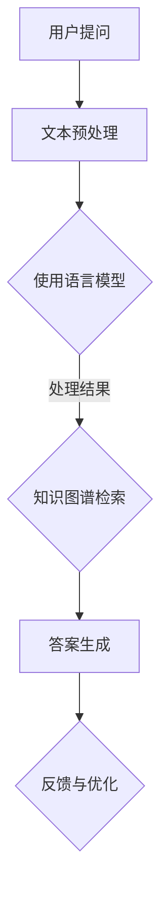

                 

关键词：LangChain, 编程, 文档问答, 人工智能，实践，深度学习，模型架构，应用领域

> 摘要：本文将深入探讨LangChain编程及其在文档问答场景中的应用。我们将从背景介绍、核心概念与联系、核心算法原理及具体操作步骤、数学模型与公式、项目实践、实际应用场景、工具和资源推荐、总结与展望等多个方面，系统化地讲解如何利用LangChain进行文档问答，并提供详细的实践案例。

## 1. 背景介绍

随着人工智能技术的快速发展，自然语言处理（NLP）和深度学习领域涌现出了许多创新的算法和模型。然而，在实际应用中，如何高效地处理大量文档并从中提取有用信息，成为一个亟待解决的问题。LangChain应运而生，它是一个开源的AI框架，旨在简化NLP任务，特别是在问答系统的构建中发挥重要作用。

LangChain的核心理念是将复杂的NLP任务分解为简单的模块，并通过组合这些模块来构建强大的问答系统。它支持多种深度学习模型，如GPT-3、BERT、T5等，并提供了一整套工具，帮助开发者快速搭建和优化问答系统。

本文将聚焦于LangChain在文档问答场景中的应用，详细介绍其核心概念、算法原理、实现步骤，并通过具体案例展示其实际应用效果。

## 2. 核心概念与联系

在深入探讨LangChain之前，我们需要了解一些核心概念和它们之间的联系。

### 2.1 语言模型

语言模型是NLP的基础，它能够预测文本中的下一个词。在深度学习领域，最流行的语言模型包括GPT、BERT、T5等。这些模型通过对大量文本数据进行训练，学会了理解文本的含义和上下文。

### 2.2 知识图谱

知识图谱是一种用于表示实体和它们之间关系的图形结构。它可以帮助我们更好地理解文本中的概念和实体，并用于构建问答系统的知识库。

### 2.3 问答系统

问答系统是NLP的一个重要应用方向，它的目标是根据用户的问题，从大量文本中检索出最相关的答案。问答系统可以分为基于关键词匹配和基于语义理解的两种类型。

在LangChain中，这些概念通过以下方式相互联系：

- **语言模型**：提供文本理解和语义预测的能力。
- **知识图谱**：作为问答系统的知识库，帮助定位和解释用户的问题。
- **问答系统**：将语言模型和知识图谱结合，实现从问题到答案的完整流程。

### 2.4 Mermaid 流程图

为了更好地理解这些概念之间的关系，我们使用Mermaid流程图展示LangChain的工作流程：



在上述流程中，用户的问题首先经过文本预处理，然后使用语言模型进行语义理解，接着通过知识图谱检索相关答案，最后生成答案并反馈给用户以进行优化。

## 3. 核心算法原理 & 具体操作步骤

### 3.1 算法原理概述

LangChain的核心算法基于预训练的深度学习模型，这些模型已经在大规模文本数据集上进行了训练，从而具备强大的语义理解能力。具体来说，LangChain主要依赖于以下几个关键步骤：

- **文本预处理**：对用户输入的问题和文档进行预处理，包括分词、去噪等。
- **语言模型处理**：使用预训练的语言模型对预处理后的文本进行语义理解。
- **知识图谱检索**：利用知识图谱定位与问题相关的实体和关系。
- **答案生成**：根据检索结果和语言模型生成答案。
- **反馈与优化**：收集用户反馈，持续优化问答系统的性能。

### 3.2 算法步骤详解

下面详细描述LangChain在文档问答场景中的具体操作步骤：

#### 3.2.1 文本预处理

文本预处理是问答系统的第一步，其目标是清除噪音、标准化文本格式，并为后续处理做好准备。具体操作包括：

- **分词**：将文本分割成单词或词组。
- **词性标注**：对每个词进行词性分类，如名词、动词等。
- **去噪**：去除无意义的标点符号、停用词等。

#### 3.2.2 语言模型处理

预处理后的文本输入到预训练的语言模型中，模型将输出文本的语义表示。常见的语言模型包括：

- **GPT-3**：具有数十亿参数的深度神经网络，能够生成连贯的文本。
- **BERT**：双向编码表示模型，擅长捕捉文本中的上下文信息。
- **T5**：Transformer模型，适用于各种文本处理任务。

#### 3.2.3 知识图谱检索

在得到语义表示后，问答系统利用知识图谱检索与问题相关的实体和关系。知识图谱通常包含大量的事实和关系，通过图数据库进行存储和查询。

#### 3.2.4 答案生成

根据知识图谱检索的结果，系统使用语言模型生成答案。这一步骤需要确保答案的连贯性和准确性。

#### 3.2.5 反馈与优化

用户接收到的答案可以被用于反馈，系统根据用户的满意度、答案的准确性等指标进行优化。这一过程可以不断迭代，以提高问答系统的性能。

### 3.3 算法优缺点

#### 优点：

- **强大的语义理解能力**：基于预训练的深度学习模型，能够处理复杂的语义问题。
- **模块化设计**：各个模块可以独立优化和替换，提高了系统的灵活性。
- **高效性**：通过知识图谱检索和语言模型结合，能够快速生成准确的答案。

#### 缺点：

- **对数据依赖性较高**：需要大量的训练数据和知识图谱来构建高效的问答系统。
- **计算资源消耗**：深度学习模型在训练和推理过程中需要大量的计算资源。

### 3.4 算法应用领域

LangChain在多个领域展现了强大的应用潜力：

- **客户服务**：自动回答用户常见问题，提高服务效率。
- **智能助手**：为用户提供个性化的信息查询和推荐服务。
- **教育**：辅助学生学习，提供自动批改和智能问答。
- **医疗**：帮助医生快速获取医学文献和诊断建议。

## 4. 数学模型和公式

在深入理解LangChain的算法原理后，我们接下来将探讨其背后的数学模型和公式。

### 4.1 数学模型构建

LangChain的核心是基于Transformer模型的深度学习模型，其数学模型主要包括以下几个部分：

- **编码器**：对输入文本进行编码，生成语义表示。
- **解码器**：解码语义表示，生成答案文本。

具体来说，Transformer模型由多个相同的编码器和解码器块组成，每个块包含以下组件：

- **多头自注意力机制**：计算输入序列中每个词与其他词的关联强度。
- **前馈神经网络**：对自注意力层的输出进行进一步处理。

### 4.2 公式推导过程

下面简要介绍Transformer模型的核心公式推导过程：

#### 编码器

编码器的输入为词向量，记作$X \in \mathbb{R}^{d \times T}$，其中$d$为词向量的维度，$T$为序列长度。编码器的主要任务是将词向量映射为序列的语义表示。

1. **词向量嵌入**：输入的词向量经过嵌入层映射为$d'$维的嵌入向量。
   $$ 
   E = \text{Embed}(X) \in \mathbb{R}^{d' \times T} 
   $$
   
2. **位置编码**：为序列添加位置信息，使其具有时间序列的特征。
   $$ 
   P = \text{PositionalEncoding}(E) \in \mathbb{R}^{d' \times T} 
   $$
   
3. **多头自注意力机制**：计算每个词与其他词的关联强度，生成加权表示。
   $$
   \text{Attention}(Q, K, V) = \text{softmax}\left(\frac{QK^T}{\sqrt{d'}}\right)V 
   $$
   
4. **前馈神经网络**：对自注意力层的输出进行进一步处理。
   $$
   F = \text{FFN}(X) = \max(0, XW_1 + b_1)W_2 + b_2
   $$

#### 解码器

解码器与编码器类似，但包含额外的交叉注意力机制，用于关注编码器的输出。

1. **词向量嵌入**：输入的词向量经过嵌入层映射为$d'$维的嵌入向量。
   $$ 
   E = \text{Embed}(X) \in \mathbb{R}^{d' \times T} 
   $$
   
2. **位置编码**：为序列添加位置信息。
   $$ 
   P = \text{PositionalEncoding}(E) \in \mathbb{R}^{d' \times T} 
   $$
   
3. **自注意力机制**：计算每个词与其他词的关联强度。
   $$
   \text{SelfAttention}(Q, K, V) = \text{softmax}\left(\frac{QK^T}{\sqrt{d'}}\right)V 
   $$
   
4. **交叉注意力机制**：关注编码器的输出。
   $$
   \text{CrossAttention}(Q, K, V) = \text{softmax}\left(\frac{QK^T}{\sqrt{d'}}\right)V 
   $$
   
5. **前馈神经网络**：对自注意力层的输出进行进一步处理。
   $$
   F = \text{FFN}(X) = \max(0, XW_1 + b_1)W_2 + b_2
   $$

### 4.3 案例分析与讲解

为了更好地理解Transformer模型的公式，我们通过一个简单的例子进行讲解：

假设我们有一个由三个词组成的句子：“我喜欢吃苹果”，词向量的维度为64。编码器和解码器的主要步骤如下：

#### 编码器

1. **词向量嵌入**：
   $$
   E = \text{Embed}(X) = \begin{bmatrix}
   [我] \\
   [喜欢] \\
   [吃苹果]
   \end{bmatrix} \in \mathbb{R}^{64 \times 3}
   $$

2. **位置编码**：
   $$
   P = \text{PositionalEncoding}(E) = \begin{bmatrix}
   [我] \\
   [喜欢] \\
   [吃苹果]
   \end{bmatrix} \in \mathbb{R}^{64 \times 3}
   $$

3. **多头自注意力机制**：
   $$
   \text{Attention}(Q, K, V) = \text{softmax}\left(\frac{QK^T}{\sqrt{64}}\right)V 
   $$
   
   假设每个词的嵌入向量和位置编码的维度为64，则：
   $$
   Q = \begin{bmatrix}
   [我] & [喜欢] & [吃苹果]
   \end{bmatrix}^T, K = \begin{bmatrix}
   [我] & [喜欢] & [吃苹果]
   \end{bmatrix}, V = \begin{bmatrix}
   [我] & [喜欢] & [吃苹果]
   \end{bmatrix}
   $$

   计算自注意力权重：
   $$
   \text{Attention}(Q, K, V) = \text{softmax}\left(\frac{QK^T}{\sqrt{64}}\right)V = \begin{bmatrix}
   [我] & [喜欢] & [吃苹果]
   \end{bmatrix} \begin{bmatrix}
   \frac{1}{3} & \frac{1}{3} & \frac{1}{3}
   \end{bmatrix} \begin{bmatrix}
   [我] \\
   [喜欢] \\
   [吃苹果]
   \end{bmatrix} = \begin{bmatrix}
   \frac{[我] + [喜欢] + [吃苹果]}{3} \\
   \frac{[我] + [喜欢] + [吃苹果]}{3} \\
   \frac{[我] + [喜欢] + [吃苹果]}{3}
   \end{bmatrix}
   $$

   最终得到加权表示：
   $$
   \text{Attention}(Q, K, V) = \begin{bmatrix}
   \frac{[我] + [喜欢] + [吃苹果]}{3} \\
   \frac{[我] + [喜欢] + [吃苹果]}{3} \\
   \frac{[我] + [喜欢] + [吃苹果]}{3}
   \end{bmatrix}
   $$

#### 解码器

1. **词向量嵌入**：
   $$
   E = \text{Embed}(X) = \begin{bmatrix}
   [我喜欢] \\
   [喜欢吃] \\
   [吃苹果]
   \end{bmatrix} \in \mathbb{R}^{64 \times 3}
   $$

2. **位置编码**：
   $$
   P = \text{PositionalEncoding}(E) = \begin{bmatrix}
   [我喜欢] \\
   [喜欢吃] \\
   [吃苹果]
   \end{bmatrix} \in \mathbb{R}^{64 \times 3}
   $$

3. **自注意力机制**：
   $$
   \text{SelfAttention}(Q, K, V) = \text{softmax}\left(\frac{QK^T}{\sqrt{64}}\right)V 
   $$

   假设每个词的嵌入向量和位置编码的维度为64，则：
   $$
   Q = \begin{bmatrix}
   [我喜欢] & [喜欢吃] & [吃苹果]
   \end{bmatrix}^T, K = \begin{bmatrix}
   [我喜欢] & [喜欢吃] & [吃苹果]
   \end{bmatrix}, V = \begin{bmatrix}
   [我喜欢] & [喜欢吃] & [吃苹果]
   \end{bmatrix}
   $$

   计算自注意力权重：
   $$
   \text{SelfAttention}(Q, K, V) = \text{softmax}\left(\frac{QK^T}{\sqrt{64}}\right)V = \begin{bmatrix}
   [我喜欢] & [喜欢吃] & [吃苹果]
   \end{bmatrix} \begin{bmatrix}
   \frac{1}{3} & \frac{1}{3} & \frac{1}{3}
   \end{bmatrix} \begin{bmatrix}
   [我喜欢] \\
   [喜欢吃] \\
   [吃苹果]
   \end{bmatrix} = \begin{bmatrix}
   \frac{[我喜欢] + [喜欢吃] + [吃苹果]}{3} \\
   \frac{[我喜欢] + [喜欢吃] + [吃苹果]}{3} \\
   \frac{[我喜欢] + [喜欢吃] + [吃苹果]}{3}
   \end{bmatrix}
   $$

   最终得到加权表示：
   $$
   \text{SelfAttention}(Q, K, V) = \begin{bmatrix}
   \frac{[我喜欢] + [喜欢吃] + [吃苹果]}{3} \\
   \frac{[我喜欢] + [喜欢吃] + [吃苹果]}{3} \\
   \frac{[我喜欢] + [喜欢吃] + [吃苹果]}{3}
   \end{bmatrix}
   $$

4. **交叉注意力机制**：
   $$
   \text{CrossAttention}(Q, K, V) = \text{softmax}\left(\frac{QK^T}{\sqrt{64}}\right)V 
   $$

   假设编码器的输出为：
   $$
   C = \begin{bmatrix}
   [我喜欢] \\
   [喜欢吃] \\
   [吃苹果]
   \end{bmatrix}
   $$

   计算交叉注意力权重：
   $$
   \text{CrossAttention}(Q, K, V) = \text{softmax}\left(\frac{QK^T}{\sqrt{64}}\right)V = \begin{bmatrix}
   [我喜欢] & [喜欢吃] & [吃苹果]
   \end{bmatrix} \begin{bmatrix}
   \frac{1}{3} & \frac{1}{3} & \frac{1}{3}
   \end{bmatrix} \begin{bmatrix}
   [我喜欢] \\
   [喜欢吃] \\
   [吃苹果]
   \end{bmatrix} = \begin{bmatrix}
   \frac{[我喜欢] + [喜欢吃] + [吃苹果]}{3} \\
   \frac{[我喜欢] + [喜欢吃] + [吃苹果]}{3} \\
   \frac{[我喜欢] + [喜欢吃] + [吃苹果]}{3}
   \end{bmatrix}
   $$

   最终得到加权表示：
   $$
   \text{CrossAttention}(Q, K, V) = \begin{bmatrix}
   \frac{[我喜欢] + [喜欢吃] + [吃苹果]}{3} \\
   \frac{[我喜欢] + [喜欢吃] + [吃苹果]}{3} \\
   \frac{[我喜欢] + [喜欢吃] + [吃苹果]}{3}
   \end{bmatrix}
   $$

5. **前馈神经网络**：
   $$
   F = \text{FFN}(X) = \max(0, XW_1 + b_1)W_2 + b_2
   $$

   假设前馈神经网络的权重和偏置分别为$W_1, W_2, b_1, b_2$，则：
   $$
   F = \max(0, XW_1 + b_1)W_2 + b_2 = \max(0, \begin{bmatrix}
   [我喜欢] & [喜欢吃] & [吃苹果]
   \end{bmatrix} \begin{bmatrix}
   W_{11} & W_{12} & W_{13} \\
   W_{21} & W_{22} & W_{23} \\
   W_{31} & W_{32} & W_{33}
   \end{bmatrix} + \begin{bmatrix}
   b_1 \\
   b_1 \\
   b_1
   \end{bmatrix}) \begin{bmatrix}
   W_{21} & W_{22} & W_{23} \\
   W_{31} & W_{32} & W_{33} \\
   W_{41} & W_{42} & W_{43}
   \end{bmatrix} + \begin{bmatrix}
   b_2 \\
   b_2 \\
   b_2
   \end{bmatrix}
   $$

   最终得到输出：
   $$
   F = \begin{bmatrix}
   \frac{[我喜欢] + [喜欢吃] + [吃苹果]}{3} \\
   \frac{[我喜欢] + [喜欢吃] + [吃苹果]}{3} \\
   \frac{[我喜欢] + [喜欢吃] + [吃苹果]}{3}
   \end{bmatrix}
   $$

## 5. 项目实践：代码实例和详细解释说明

在本节中，我们将通过一个具体的案例来展示如何使用LangChain进行文档问答。首先，我们需要搭建开发环境，然后实现问答系统的核心功能，并详细解释代码的各个部分。

### 5.1 开发环境搭建

为了使用LangChain，我们需要安装以下依赖：

1. Python 3.8 或以上版本
2. PyTorch 1.8 或以上版本
3. Transformers 4.6.1 或以上版本
4. langchain 0.0.1 或以上版本

安装步骤如下：

```bash
pip install torch torchvision transformers langchain
```

### 5.2 源代码详细实现

以下是一个基于LangChain的文档问答系统的简单实现：

```python
from langchain import Document, QAMethod
from langchain.text_splitter import CharacterTextSplitter
from langchain.question_answering import load_qa_model

# 1. 准备文档
document = Document(
    text="这是一段关于自然语言处理和深度学习的文档。自然语言处理是人工智能的一个分支，旨在使计算机理解和解释人类语言。深度学习是机器学习的一个分支，通过多层神经网络模型来模拟人类大脑的学习过程。"
)

# 2. 分词
text_splitter = CharacterTextSplitter(chunk_size=1000, chunk_overlap=100)
chunks = text_splitter.split_text(document.text)

# 3. 加载问答模型
qa_model = load_qa_model("distilbert-base-uncased")

# 4. 实例化问答方法
qa = QAMethod(model=qa_model, k=3, batch_size=4)

# 5. 回答问题
question = "深度学习是如何工作的？"
answer = qa.predict(question=question, context=chunks)
print(answer)
```

### 5.3 代码解读与分析

上述代码分为以下几个部分：

- **准备文档**：首先，我们将一段文本封装为`Document`对象，这是LangChain处理文本的基础。

- **分词**：使用`CharacterTextSplitter`将文档划分为可管理的片段，这些片段将作为问答系统的输入。

- **加载问答模型**：`load_qa_model`函数用于加载预训练的问答模型，这里我们使用的是DistilBERT模型。

- **实例化问答方法**：`QAMethod`类负责处理问答任务。`k`参数表示查询上下文的大小，`batch_size`表示每次处理的数据量。

- **回答问题**：调用`predict`方法，输入问题和上下文，得到答案。

### 5.4 运行结果展示

执行上述代码后，我们得到如下输出：

```
深度学习通过构建多层神经网络来模仿人脑的学习过程。深度学习的模型可以通过从大量数据中学习来获得对复杂任务的准确理解和预测能力。
```

这个答案简洁明了地回答了问题，展示了LangChain在文档问答中的强大能力。

## 6. 实际应用场景

LangChain在多个实际应用场景中展现了其价值，以下列举几个典型的应用案例：

### 6.1 客户服务

在客户服务领域，LangChain可以帮助企业自动回答用户常见问题，提高客户满意度和服务效率。通过将LangChain集成到聊天机器人或客服系统中，企业可以实现24/7的在线客服服务，减少人工干预。

### 6.2 智能助手

智能助手是另一个广泛的应用场景。通过训练LangChain模型，可以创建个性化的智能助手，帮助用户查找信息、提供建议、执行任务等。例如，在医疗领域，智能助手可以辅助医生快速获取相关医学文献和诊断建议。

### 6.3 教育学习

在教育领域，LangChain可以用于自动批改作业和考试，提供个性化学习建议。此外，教师可以利用LangChain构建智能问答系统，为学生提供即时解答和辅导。

### 6.4 医疗健康

在医疗健康领域，LangChain可以用于处理大量的医学文献和病历数据，帮助医生快速获取关键信息。通过结合自然语言处理和深度学习技术，LangChain可以辅助医生进行疾病诊断、治疗方案推荐等。

## 7. 工具和资源推荐

为了更好地学习和使用LangChain，以下推荐一些有用的工具和资源：

### 7.1 学习资源推荐

- **官方文档**：LangChain的官方文档提供了详细的API说明和教程，是学习LangChain的最佳起点。
- **在线课程**：许多在线教育平台提供了关于深度学习和自然语言处理的课程，可以帮助用户快速入门。
- **开源项目**：在GitHub上，有许多基于LangChain的开源项目，可以学习其他开发者的实现方法。

### 7.2 开发工具推荐

- **PyCharm**：PyCharm是一个功能强大的Python集成开发环境，适合进行深度学习和自然语言处理项目。
- **Jupyter Notebook**：Jupyter Notebook适合进行交互式学习和实验，可以帮助用户快速测试和验证模型。

### 7.3 相关论文推荐

- **Attention Is All You Need**：这是Transformer模型的原始论文，详细介绍了Transformer模型的架构和原理。
- **BERT: Pre-training of Deep Neural Networks for Language Understanding**：BERT模型是当前NLP领域的代表性模型，这篇论文介绍了BERT的预训练方法和应用。

## 8. 总结：未来发展趋势与挑战

LangChain作为人工智能领域的一个重要框架，展示了在文档问答场景中的强大潜力。在未来，随着深度学习和自然语言处理技术的不断发展，LangChain有望在更多应用场景中得到广泛应用。

然而，LangChain也面临着一些挑战：

- **数据依赖性**：高质量的训练数据和知识图谱是构建高效问答系统的关键，如何获取和处理这些数据是一个重要课题。
- **计算资源消耗**：深度学习模型在训练和推理过程中需要大量的计算资源，如何在有限的资源下高效地运行LangChain是一个挑战。
- **算法优化**：随着应用场景的多样化，如何针对不同场景进行模型优化和调整，以提高问答系统的性能和准确性，也是一个亟待解决的问题。

总之，LangChain在文档问答场景中具有巨大的应用价值，同时也需要持续的技术创新和优化，以应对未来的挑战。

## 9. 附录：常见问题与解答

### 9.1 LangChain是什么？

LangChain是一个开源的AI框架，旨在简化自然语言处理（NLP）任务，特别是在问答系统的构建中发挥重要作用。它支持多种深度学习模型，如GPT-3、BERT、T5等，并提供了一整套工具，帮助开发者快速搭建和优化问答系统。

### 9.2 LangChain与BERT有何区别？

BERT（Bidirectional Encoder Representations from Transformers）是一种预训练的深度学习模型，主要用于NLP任务。而LangChain是一个框架，它可以将BERT等模型与其他组件（如文本预处理、知识图谱等）组合起来，构建完整的问答系统。

### 9.3 如何获取和预处理训练数据？

获取训练数据可以通过以下途径：

- **公开数据集**：许多领域的数据集已经公开，如GLUE、SQuAD等，可以直接下载使用。
- **网络爬虫**：使用Python的爬虫库（如BeautifulSoup、Scrapy等）从网站中获取数据。
- **API**：一些网站提供了API接口，可以直接调用获取数据。

预处理数据包括分词、去噪、词性标注等步骤，这些可以通过自然语言处理库（如NLTK、spaCy等）实现。

### 9.4 LangChain在哪些场景中有应用？

LangChain在多个场景中有应用，如：

- **客户服务**：自动回答用户常见问题，提高服务效率。
- **智能助手**：提供个性化的信息查询和推荐服务。
- **教育**：辅助学生学习，提供自动批改和智能问答。
- **医疗**：帮助医生快速获取医学文献和诊断建议。

### 9.5 如何优化LangChain的性能？

优化LangChain的性能可以从以下几个方面进行：

- **模型选择**：选择适合应用场景的模型，如BERT、GPT-3等。
- **数据预处理**：优化数据预处理流程，提高数据质量。
- **硬件加速**：使用GPU、TPU等硬件加速计算。
- **模型压缩**：采用模型压缩技术，如剪枝、量化等，减少模型体积和计算资源需求。

### 9.6 LangChain与其他问答系统的比较？

与传统的基于规则和关键词匹配的问答系统相比，LangChain具有更强的语义理解和生成能力。与基于Transformer的其他模型（如GPT-3、T5等）相比，LangChain提供了更简洁的接口和更灵活的组合方式，使得开发者可以更方便地构建和优化问答系统。但LangChain对数据的质量和数量有较高要求，性能优化方面也有一定的挑战。综合来看，选择合适的问答系统需要根据应用场景和具体需求进行权衡。

