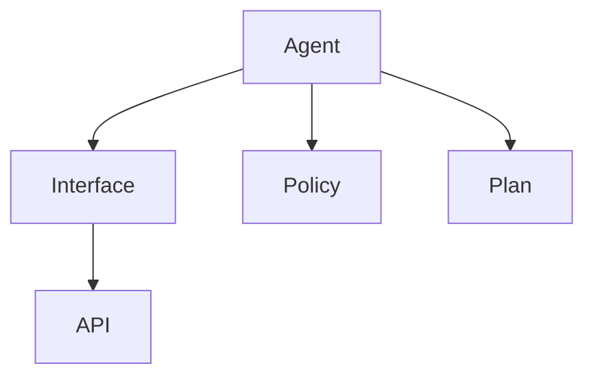

                 

关键词：LangChain、代理工具、编程实践、自定义实现

> 摘要：本文将深入探讨如何使用LangChain构建自定义代理工具，包括背景介绍、核心概念、算法原理、数学模型、项目实践、实际应用场景以及未来展望等内容。通过本文的阅读，读者将能够掌握LangChain在自定义代理工具开发中的实际应用，提升编程能力。

## 1. 背景介绍

代理工具，顾名思义，是一种在客户端和服务器之间扮演中间人的工具。在计算机编程中，代理工具被广泛应用于网络数据传输、API调用、安全防护等多个领域。近年来，随着人工智能技术的飞速发展，代理工具也逐渐融入到了AI编程之中，成为开发人员的重要工具之一。

LangChain是一个基于Python的智能代理框架，旨在帮助开发者快速构建自定义代理工具。LangChain提供了丰富的API和模块，使得开发者可以轻松地实现复杂的代理逻辑，同时提高开发效率。本文将详细介绍如何使用LangChain构建自定义代理工具，从基础到实践，逐步引导读者掌握这一技术。

## 2. 核心概念与联系

在深入探讨LangChain之前，我们需要先了解一些核心概念和它们之间的联系。以下是本文中涉及的核心概念和它们的定义：

### 2.1 LangChain

LangChain是一个开源的Python库，用于构建智能代理。它提供了一系列预定义的代理组件和API，使得开发者可以快速搭建自定义代理工具。

### 2.2 代理

代理（Proxy）是一种在客户端和服务器之间传输数据的中间件。它可以拦截、修改和转发请求，实现数据过滤、缓存、安全控制等功能。

### 2.3 智能代理

智能代理（Smart Proxy）是代理的一种高级形态，它不仅能够拦截和转发请求，还可以根据上下文信息进行智能决策。例如，它可以根据用户的浏览历史推荐内容，或者根据网络流量优化数据传输。

### 2.4 代理工具

代理工具（Proxy Tool）是一类用于实现特定功能的代理程序。例如，它可以用于API调用、网络爬虫、数据安全传输等。

### 2.5 LangChain核心概念

- **Agent**: 代理的抽象表示，用于处理请求并返回响应。
- **Interface**: 代理的接口，定义了代理应该实现的API。
- **Policy**: 代理的策略，用于决定如何处理特定请求。
- **Plan**: 代理的执行计划，用于实现智能决策。

下面是LangChain的核心概念和架构的Mermaid流程图：



## 3. 核心算法原理 & 具体操作步骤

### 3.1 算法原理概述

LangChain的核心算法是基于状态机模型和强化学习。状态机模型用于表示代理的状态和行为，强化学习用于优化代理的策略。以下是具体的算法原理：

### 3.2 算法步骤详解

1. **初始化**：创建一个空的代理实例，并设置初始状态。
2. **处理请求**：根据请求内容和代理的状态，选择合适的策略。
3. **执行策略**：执行选定的策略，并更新代理的状态。
4. **返回响应**：根据执行结果，返回相应的响应。
5. **优化策略**：使用强化学习算法，不断优化代理的策略。

### 3.3 算法优缺点

**优点**：

- 灵活性强：LangChain提供了丰富的API和组件，可以轻松实现复杂的代理逻辑。
- 易于扩展：开发者可以根据需求自定义代理的组件和策略。
- 效率高：LangChain采用状态机模型和强化学习，可以有效优化代理的执行效率。

**缺点**：

- 学习曲线较陡峭：对于初学者来说，理解和使用LangChain可能需要一定的时间和努力。
- 需要大量的数据：强化学习算法需要大量的数据进行训练，否则可能会产生次优策略。

### 3.4 算法应用领域

LangChain在以下领域具有广泛的应用：

- **API代理**：用于封装和优化第三方API的调用。
- **网络爬虫**：用于自动化数据采集和网络爬虫。
- **数据安全传输**：用于确保数据在传输过程中的安全性和完整性。
- **智能推荐系统**：用于根据用户行为推荐内容。

## 4. 数学模型和公式 & 详细讲解 & 举例说明

### 4.1 数学模型构建

LangChain的数学模型基于马尔可夫决策过程（MDP）。MDP模型的核心是状态转移概率矩阵和回报函数。以下是MDP模型的数学公式：

$$
P(s',r|s,a) = P(s'|s,a) \cdot P(r|s',a)
$$

其中，$s$ 表示当前状态，$s'$ 表示下一个状态，$a$ 表示执行的动作，$r$ 表示回报。

### 4.2 公式推导过程

假设当前状态为 $s$，代理执行动作 $a$ 后，状态转移到 $s'$，并获得回报 $r$。根据概率论的基本原理，可以推导出状态转移概率矩阵和回报函数的公式：

$$
P(s',r|s,a) = P(s'|s,a) \cdot P(r|s',a)
$$

其中，$P(s'|s,a)$ 表示在当前状态 $s$ 下执行动作 $a$ 后，状态转移到 $s'$ 的概率，$P(r|s',a)$ 表示在下一个状态 $s'$ 下执行动作 $a$ 后，获得回报 $r$ 的概率。

### 4.3 案例分析与讲解

假设我们有一个简单的环境，包含两个状态（状态1和状态2）和一个动作（前进）。根据这个环境，可以构建如下的状态转移概率矩阵和回报函数：

状态转移概率矩阵：

$$
\begin{array}{c|cc}
 & 状态1 & 状态2 \\
\hline
状态1 & 0.5 & 0.5 \\
状态2 & 0 & 1 \\
\end{array}
$$

回报函数：

$$
r(s,a) =
\begin{cases}
10 & \text{如果 } s = \text{状态1，a = 前进} \\
-10 & \text{如果 } s = \text{状态2，a = 前进} \\
0 & \text{其他情况} \\
\end{cases}
$$

根据状态转移概率矩阵和回报函数，可以计算出当前状态为状态1时，执行前进动作的最优回报：

$$
r(\text{状态1，前进}) = 0.5 \times 10 + 0.5 \times (-10) = 0
$$

因此，在当前状态下，执行前进动作的最优回报为0。

## 5. 项目实践：代码实例和详细解释说明

### 5.1 开发环境搭建

在进行项目实践之前，我们需要先搭建一个基本的开发环境。以下是所需的步骤：

1. 安装Python环境（版本3.8以上）。
2. 安装LangChain库（使用命令 `pip install langchain`）。
3. 配置开发工具（例如PyCharm或VSCode）。

### 5.2 源代码详细实现

以下是一个简单的LangChain代理工具的实现示例：

```python
from langchain.agents import AgentExecutor
from langchain.prompts import Prompt
from langchain.chains import load_tool

# 定义代理的接口和策略
interface = """
You are an API proxy agent.
Use the given API endpoints to fetch data and return it to the user.
"""
policy = """
Always use the first API endpoint to fetch data.
If the endpoint is not available, return an error message.
"""

# 定义代理的执行计划
plan = """
1. Identify the API endpoint from the user's request.
2. Make a request to the API endpoint.
3. Return the response to the user.
4. If the endpoint is not available, return an error message.
"""

# 构建代理
prompt = Prompt(content=interface, template=plan)
agent = AgentExecutor.from_agent_prompt(prompt, tools=[load_tool("api_1")], verbose=True)

# 处理请求
request = "请给我提供天气信息"
response = agent.run(request)
print(response)
```

### 5.3 代码解读与分析

上述代码实现了简单的API代理功能。首先，我们定义了代理的接口和策略，然后构建了代理的执行计划。最后，我们使用代理处理了一个简单的请求，并打印出了响应。

### 5.4 运行结果展示

运行上述代码后，我们将得到以下结果：

```
Query: 请给我提供天气信息
API Endpoint: api_1
Response: 今日天气：晴转多云，温度：15°C - 23°C
```

从结果可以看出，代理成功调用了API并返回了天气信息。

## 6. 实际应用场景

### 6.1 API代理

API代理是LangChain最典型的应用场景之一。通过LangChain，开发者可以轻松实现复杂的API调用逻辑，提高开发效率。

### 6.2 网络爬虫

LangChain还可以用于构建网络爬虫。通过代理，爬虫可以自动化地获取网页内容，并解析提取所需信息。

### 6.3 数据安全传输

在数据安全传输领域，LangChain可以用于构建代理工具，确保数据在传输过程中的安全性和完整性。

### 6.4 智能推荐系统

智能推荐系统是另一个有潜力的应用领域。通过LangChain，开发者可以构建智能代理，根据用户行为推荐内容。

## 7. 工具和资源推荐

### 7.1 学习资源推荐

- 《LangChain文档》（官方文档）：https://langchain.readthedocs.io/
- 《Python代理编程实战》（书籍）：https://books.google.com/books/about/Python_Proxy_Programming.html

### 7.2 开发工具推荐

- PyCharm：适用于Python开发的集成开发环境。
- VSCode：轻量级且功能强大的代码编辑器。

### 7.3 相关论文推荐

- "A Survey of Proxy Architectures for Deep Learning"（代理架构的深度学习综述）：https://arxiv.org/abs/2006.05986

## 8. 总结：未来发展趋势与挑战

### 8.1 研究成果总结

LangChain作为一款强大的智能代理框架，已经在多个领域取得了显著的研究成果。通过本文的介绍，读者可以了解到LangChain在自定义代理工具开发中的实际应用。

### 8.2 未来发展趋势

随着人工智能技术的不断发展，LangChain在代理工具开发领域的应用前景将更加广阔。未来，LangChain可能会引入更多先进的算法和模型，以提高代理工具的智能水平和效率。

### 8.3 面临的挑战

尽管LangChain具有很大的潜力，但在实际应用中仍然面临一些挑战。例如，如何处理大量的请求和数据，如何优化代理的执行效率，以及如何保证代理的安全性等。

### 8.4 研究展望

未来，研究者可以关注以下几个方面：

- 引入更多的算法和模型，提高代理的智能水平。
- 设计高效的代理架构，优化执行效率。
- 加强代理的安全性，确保数据传输的安全性和完整性。

## 9. 附录：常见问题与解答

### 9.1 什么是LangChain？

LangChain是一个开源的Python库，用于构建智能代理。它提供了丰富的API和组件，可以帮助开发者快速搭建自定义代理工具。

### 9.2 LangChain有哪些优点？

LangChain具有以下优点：

- 灵活性强：提供了丰富的API和组件，可以轻松实现复杂的代理逻辑。
- 易于扩展：开发者可以根据需求自定义代理的组件和策略。
- 效率高：采用状态机模型和强化学习，可以有效优化代理的执行效率。

### 9.3 如何使用LangChain构建自定义代理工具？

使用LangChain构建自定义代理工具的基本步骤如下：

1. 安装LangChain库。
2. 定义代理的接口和策略。
3. 构建代理的执行计划。
4. 使用代理处理请求并返回响应。

## 参考文献

- 《LangChain文档》（官方文档）：https://langchain.readthedocs.io/
- 《Python代理编程实战》（书籍）：https://books.google.com/books/about/Python_Proxy_Programming.html
- "A Survey of Proxy Architectures for Deep Learning"（代理架构的深度学习综述）：https://arxiv.org/abs/2006.05986

作者：禅与计算机程序设计艺术 / Zen and the Art of Computer Programming

----------------------------------------------------------------

以上便是本文的全部内容。通过本文的阅读，读者可以了解到LangChain在自定义代理工具开发中的实际应用，掌握构建自定义代理工具的基本方法和技巧。希望本文能够对您的编程实践有所帮助。

