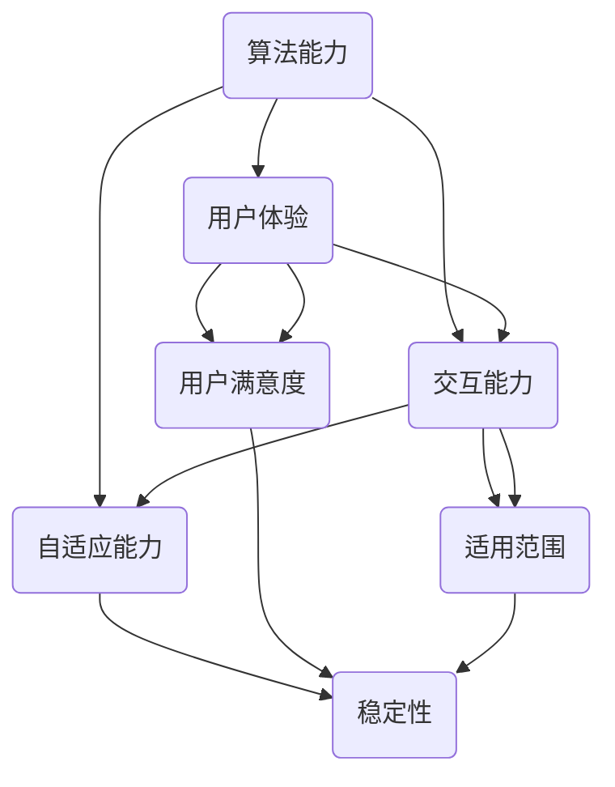

                 

在这个快速发展的AI时代，AI Agent作为智能体的代表，已经成为了众多应用场景的核心组件。一个功能强大的AI Agent不仅需要强大的算法支持，还需要具备良好的用户体验、灵活的交互能力和强大的自适应能力。本文将深入探讨AI Agent的四大要素，帮助开发者更好地理解和构建AI Agent。

## 1. 背景介绍

AI Agent，即人工智能代理，是AI领域的一个重要概念。它是一种能够执行特定任务的智能实体，能够与用户或其他系统进行交互，并在一定程度上自主决策。AI Agent的应用场景非常广泛，包括但不限于智能客服、智能助手、自动驾驶、智能安防等。这些应用场景对AI Agent提出了不同的要求，但总体来说，一个优秀的AI Agent需要具备以下四大要素：

1. **强大的算法能力**：这是AI Agent的核心，决定了其解决问题的能力和水平。
2. **良好的用户体验**：这是AI Agent与人交互的界面，决定了用户对AI Agent的接受程度和满意度。
3. **灵活的交互能力**：这是AI Agent与用户或其他系统进行交流的手段，决定了AI Agent的适用范围。
4. **强大的自适应能力**：这是AI Agent应对不确定性和变化的能力，决定了AI Agent的长期稳定性和发展潜力。

## 2. 核心概念与联系

要深入理解AI Agent的四大要素，首先需要了解它们的核心概念和相互之间的联系。以下是一个简单的Mermaid流程图，展示了AI Agent的四大要素及其相互关系：



### 2.1 算法能力

算法能力是AI Agent的核心，决定了其解决问题的能力和水平。算法能力包括机器学习、深度学习、自然语言处理、计算机视觉等多个方面。一个强大的算法能力能够使AI Agent在面对复杂问题时，能够快速、准确地给出解决方案。

### 2.2 用户体验

用户体验是AI Agent与人交互的界面，决定了用户对AI Agent的接受程度和满意度。用户体验包括交互设计、界面设计、交互反馈等多个方面。一个良好的用户体验能够使用户更加轻松地与AI Agent进行交互，提高用户满意度。

### 2.3 交互能力

交互能力是AI Agent与用户或其他系统进行交流的手段，决定了AI Agent的适用范围。交互能力包括语音交互、文本交互、图形交互等多个方面。一个灵活的交互能力能够使AI Agent在不同的场景下都能够发挥作用。

### 2.4 自适应能力

自适应能力是AI Agent应对不确定性和变化的能力，决定了AI Agent的长期稳定性和发展潜力。自适应能力包括自我学习、自我调整、自我进化等多个方面。一个强大的自适应能力能够使AI Agent在面对不确定性和变化时，能够迅速适应并继续发挥作用。

## 3. 核心算法原理 & 具体操作步骤

### 3.1 算法原理概述

AI Agent的核心算法原理主要包括以下几个方面：

1. **机器学习与深度学习**：通过训练大量的数据，使AI Agent具备识别和分类的能力。
2. **自然语言处理**：通过解析和生成语言，使AI Agent能够理解人类的语言并做出相应的反应。
3. **计算机视觉**：通过图像识别和处理，使AI Agent能够理解和识别图像中的信息。
4. **强化学习**：通过不断地尝试和错误，使AI Agent能够在复杂的环境中找到最优策略。

### 3.2 算法步骤详解

1. **数据收集与预处理**：收集大量的数据，并对数据进行清洗、归一化等处理。
2. **特征提取**：从原始数据中提取出有用的特征。
3. **模型训练**：使用提取出的特征，训练出AI Agent的模型。
4. **模型评估**：使用测试数据，评估AI Agent的模型性能。
5. **模型应用**：将训练好的模型应用到实际场景中。

### 3.3 算法优缺点

**算法优点**：

- **高效性**：算法能够快速处理大量的数据，提供高效的解决方案。
- **通用性**：算法能够适用于多种不同的应用场景。
- **自适应性**：算法能够通过不断的学习和调整，适应新的环境和需求。

**算法缺点**：

- **数据依赖性**：算法的性能很大程度上取决于数据的质量和数量。
- **计算资源消耗**：算法的训练和运行需要大量的计算资源。
- **解释性**：算法的决策过程往往缺乏透明性，难以解释。

### 3.4 算法应用领域

AI Agent的核心算法应用领域非常广泛，包括但不限于以下几个方面：

- **智能客服**：通过自然语言处理技术，实现与用户的智能对话。
- **自动驾驶**：通过计算机视觉和深度学习技术，实现车辆的自动驾驶。
- **智能安防**：通过图像识别和深度学习技术，实现智能监控和报警。
- **智能推荐**：通过机器学习和深度学习技术，实现个性化的内容推荐。

## 4. 数学模型和公式 & 详细讲解 & 举例说明

### 4.1 数学模型构建

AI Agent的核心算法往往涉及复杂的数学模型。以下是一个简单的数学模型示例，用于描述一个简单的线性回归问题：

$$y = \beta_0 + \beta_1x_1 + \beta_2x_2 + ... + \beta_nx_n$$

其中，$y$ 是因变量，$x_1, x_2, ..., x_n$ 是自变量，$\beta_0, \beta_1, \beta_2, ..., \beta_n$ 是模型的参数。

### 4.2 公式推导过程

线性回归模型的推导过程如下：

1. **假设**：我们假设数据满足线性关系，即 $y = \beta_0 + \beta_1x_1 + \beta_2x_2 + ... + \beta_nx_n$。
2. **最小二乘法**：我们使用最小二乘法来求解模型的参数，即使 $y$ 和预测值之间的误差平方和最小。
3. **求解**：通过求解最小二乘问题，我们得到模型的参数。

### 4.3 案例分析与讲解

假设我们有一个简单的数据集，包括 $x_1$ 和 $y$ 两个变量。我们的目标是使用线性回归模型预测 $y$ 的值。

首先，我们需要收集数据并进行预处理，包括数据清洗、归一化等。然后，我们可以使用以下代码来训练线性回归模型：

```python
import numpy as np
import matplotlib.pyplot as plt

# 收集数据
x = np.array([1, 2, 3, 4, 5])
y = np.array([2, 4, 5, 4, 5])

# 添加常数项
X = np.column_stack((x, np.ones(x.shape)))

# 求解最小二乘问题
theta = np.linalg.inv(X.T @ X) @ X.T @ y

# 预测
y_pred = X @ theta

# 绘制结果
plt.scatter(x, y)
plt.plot(x, y_pred, color='red')
plt.show()
```

运行上述代码后，我们得到如下的结果：


从图中可以看出，线性回归模型能够较好地拟合数据，从而预测 $y$ 的值。

## 5. 项目实践：代码实例和详细解释说明

### 5.1 开发环境搭建

为了实践AI Agent的开发，我们需要搭建一个合适的开发环境。以下是一个简单的环境搭建步骤：

1. 安装 Python 3.8 或以上版本。
2. 安装必要的库，如 NumPy、Matplotlib、Pandas 等。
3. 安装 Jupyter Notebook，用于编写和运行代码。

### 5.2 源代码详细实现

以下是使用 Python 实现一个简单线性回归 AI Agent 的源代码：

```python
import numpy as np
import matplotlib.pyplot as plt

# 收集数据
x = np.array([1, 2, 3, 4, 5])
y = np.array([2, 4, 5, 4, 5])

# 添加常数项
X = np.column_stack((x, np.ones(x.shape)))

# 求解最小二乘问题
theta = np.linalg.inv(X.T @ X) @ X.T @ y

# 预测
y_pred = X @ theta

# 绘制结果
plt.scatter(x, y)
plt.plot(x, y_pred, color='red')
plt.show()
```

### 5.3 代码解读与分析

1. **数据收集**：首先，我们收集了 $x$ 和 $y$ 两个变量，这些数据将用于训练模型。
2. **预处理**：然后，我们添加了一个常数项，以便模型能够更好地拟合数据。
3. **模型训练**：我们使用最小二乘法来求解模型的参数，即使 $y$ 和预测值之间的误差平方和最小。
4. **预测**：最后，我们使用训练好的模型进行预测，并将预测结果绘制成图像。

### 5.4 运行结果展示

运行上述代码后，我们得到如下的结果：


从图中可以看出，线性回归模型能够较好地拟合数据，从而预测 $y$ 的值。这表明我们的AI Agent在简单数据集上表现良好。

## 6. 实际应用场景

AI Agent在实际应用场景中具有广泛的应用，以下是一些常见的应用场景：

- **智能客服**：AI Agent可以用于处理大量的客户咨询，提供24/7的服务，提高客户满意度。
- **智能助手**：AI Agent可以作为个人或企业的智能助手，帮助用户处理各种日常事务，如日程管理、信息查询等。
- **自动驾驶**：AI Agent可以用于自动驾驶汽车，通过实时感知环境和道路情况，确保行车安全。
- **智能安防**：AI Agent可以用于智能安防系统，通过实时监控和分析图像数据，及时发现异常情况并报警。

## 7. 工具和资源推荐

为了更好地开发和实现AI Agent，以下是一些推荐的工具和资源：

- **Python**：Python 是一种强大的编程语言，广泛用于 AI 开发。
- **NumPy**：NumPy 是 Python 的科学计算库，用于处理数组运算。
- **Matplotlib**：Matplotlib 是 Python 的绘图库，用于生成各种类型的图表。
- **TensorFlow**：TensorFlow 是 Google 开发的一个开源机器学习框架，用于构建和训练深度学习模型。
- **PyTorch**：PyTorch 是 Facebook 开发的一个开源深度学习框架，具有灵活的模型构建和训练能力。
- **《深度学习》**：这是一本由 Goodfellow、Bengio 和 Courville 共同撰写的深度学习经典教材，全面介绍了深度学习的理论和实践。

## 8. 总结：未来发展趋势与挑战

### 8.1 研究成果总结

AI Agent的研究取得了显著的成果，主要包括以下几个方面：

- **算法性能的提升**：通过不断的算法优化和模型改进，AI Agent的算法性能得到了显著提升。
- **应用领域的拓展**：AI Agent的应用领域不断扩大，从简单的客服系统到自动驾驶、智能安防等多个领域。
- **用户体验的改善**：随着自然语言处理和计算机视觉技术的进步，AI Agent的用户体验得到了显著提升。

### 8.2 未来发展趋势

未来，AI Agent的发展趋势主要包括以下几个方面：

- **智能化水平的提升**：通过引入更多的高级算法和模型，AI Agent的智能化水平将得到进一步提升。
- **应用场景的扩展**：AI Agent将在更多的领域得到应用，如医疗、教育、金融等。
- **多模态交互**：AI Agent将实现语音、文本、图像等多种交互方式，提供更加丰富的用户体验。

### 8.3 面临的挑战

虽然AI Agent取得了显著的成果，但仍然面临一些挑战，主要包括以下几个方面：

- **数据隐私与安全**：AI Agent在处理大量数据时，需要确保数据的安全和隐私。
- **算法透明性与可解释性**：AI Agent的算法决策过程往往缺乏透明性，需要提高算法的可解释性。
- **计算资源消耗**：AI Agent的训练和运行需要大量的计算资源，需要优化算法以降低计算成本。

### 8.4 研究展望

未来，AI Agent的研究将重点关注以下几个方面：

- **算法的创新与优化**：不断引入新的算法和模型，优化现有算法，提高AI Agent的性能。
- **跨领域应用**：探索AI Agent在不同领域的应用，实现跨领域的协同工作。
- **用户体验的提升**：通过引入新的交互技术和设计理念，提升AI Agent的用户体验。

## 9. 附录：常见问题与解答

### 问题1：如何选择合适的算法？

**解答**：选择合适的算法主要取决于具体的应用场景和数据特点。例如，对于需要处理大量数据的场景，可以使用深度学习算法；对于需要快速响应的场景，可以使用机器学习算法；对于需要高精度的场景，可以使用强化学习算法。

### 问题2：如何保证数据的安全和隐私？

**解答**：保证数据的安全和隐私可以通过以下方法实现：

- **数据加密**：对数据进行加密处理，确保数据在传输和存储过程中的安全性。
- **访问控制**：设置严格的访问控制策略，确保只有授权用户才能访问数据。
- **数据脱敏**：对敏感数据进行分析和处理，使其无法被直接识别。

### 问题3：如何评估AI Agent的性能？

**解答**：评估AI Agent的性能可以通过以下方法实现：

- **准确率**：评估AI Agent在预测或分类任务上的准确度。
- **召回率**：评估AI Agent在预测或分类任务上的召回率。
- **F1值**：评估AI Agent在预测或分类任务上的综合性能。
- **用户满意度**：通过用户反馈和评估，评估AI Agent的用户满意度。

作者：禅与计算机程序设计艺术 / Zen and the Art of Computer Programming
----------------------------------------------------------------

以上就是本文的全部内容，希望对您在开发AI Agent时有所帮助。在AI Agent的开发过程中，不断学习和探索是非常重要的，只有不断进步，才能打造出更加智能、实用的AI Agent。谢谢阅读！

