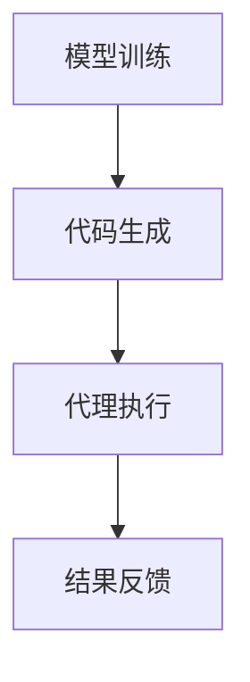

                 

关键词：大模型应用、AI Agent、AutoGen、技术博客、深度学习、计算机图灵奖、算法原理

> 摘要：本文将介绍一种强大的工具——AutoGen，它旨在帮助开发者快速构建和部署AI代理。本文将深入探讨AutoGen的核心概念、算法原理、应用领域以及数学模型，并通过具体实例展示其实际应用效果。

## 1. 背景介绍

随着人工智能技术的飞速发展，大模型的应用成为了研究者和开发者关注的焦点。AI代理作为人工智能领域的一个重要分支，其目的是模拟人类的决策过程，帮助用户解决复杂的问题。AutoGen，作为一个新兴的工具，旨在简化AI代理的开发流程，使得开发者能够更加高效地构建和部署AI代理。

### 1.1 AI代理的定义

AI代理是指能够模拟人类决策过程，并独立执行任务的计算机程序。它可以通过感知环境、学习经验和做出决策来提高其表现。AI代理在多个领域都有广泛的应用，例如智能家居、医疗诊断、金融分析等。

### 1.2 大模型的应用

大模型（如Transformer、GPT等）在自然语言处理、计算机视觉等领域取得了显著的成果。这些模型具有强大的学习和泛化能力，能够处理复杂的任务。将大模型应用于AI代理，可以显著提高其性能和智能水平。

## 2. 核心概念与联系

### 2.1 AutoGen的概念

AutoGen是一种基于大模型的AI代理开发工具。它通过自动生成代码、配置和环境，使得开发者能够快速搭建和部署AI代理。AutoGen的核心思想是将复杂的开发流程自动化，降低开发难度，提高开发效率。

### 2.2 算法原理

AutoGen采用了多种先进的人工智能技术，包括深度学习、强化学习等。它通过训练大模型来学习如何生成代码和配置，使得AI代理能够根据特定的任务需求进行自适应调整。

### 2.3 架构

AutoGen的架构分为三个主要部分：模型训练、代码生成和代理执行。模型训练阶段，AutoGen通过大量的数据训练大模型，学习生成代码和配置的技巧。代码生成阶段，AutoGen根据用户的需求生成相应的代码和配置。代理执行阶段，AI代理根据生成的代码和配置执行任务。

### 2.4 Mermaid流程图



## 3. 核心算法原理 & 具体操作步骤

### 3.1 算法原理概述

AutoGen的核心算法是基于大模型的深度学习技术。它通过训练大模型来学习如何生成代码和配置。训练数据包括大量的代码和配置文件，以及与这些代码和配置文件相对应的任务需求。

### 3.2 算法步骤详解

#### 3.2.1 模型训练

1. 收集数据：收集大量的代码和配置文件，以及与这些代码和配置文件相对应的任务需求。
2. 预处理：对收集的数据进行预处理，包括去除噪声、统一格式等。
3. 模型训练：使用预处理后的数据训练大模型，使其能够学习生成代码和配置。

#### 3.2.2 代码生成

1. 输入任务需求：用户输入任务需求。
2. 模型生成：AutoGen根据用户输入的任务需求，调用训练好的大模型生成相应的代码和配置。
3. 代码优化：对生成的代码进行优化，提高其性能和可读性。

#### 3.2.3 代理执行

1. 环境搭建：根据生成的配置文件搭建执行环境。
2. 代码执行：执行生成的代码，完成用户指定的任务。
3. 结果反馈：将执行结果反馈给用户，供用户参考和调整。

### 3.3 算法优缺点

#### 优点

- **高效性**：通过自动生成代码和配置，大大提高了开发效率。
- **灵活性**：AutoGen可以根据用户的需求自适应地调整代码和配置。
- **易用性**：AutoGen提供了简单的接口和丰富的文档，使得开发者能够快速上手。

#### 缺点

- **准确性**：由于大模型的训练数据有限，生成的代码和配置可能存在一定程度的误差。
- **依赖性**：AutoGen依赖于大模型和深度学习技术，对计算资源的要求较高。

### 3.4 算法应用领域

- **软件开发**：AutoGen可以帮助开发者快速生成代码框架，减少开发时间。
- **智能助手**：AutoGen可以应用于智能助手的开发，提高其响应速度和准确性。
- **自动化测试**：AutoGen可以自动生成测试代码，提高测试效率。

## 4. 数学模型和公式 & 详细讲解 & 举例说明

### 4.1 数学模型构建

AutoGen的数学模型主要包括两部分：生成模型和评估模型。

#### 4.1.1 生成模型

生成模型是一个条件生成模型，输入为任务需求，输出为代码和配置。假设任务需求为一个向量X，代码和配置为一个向量Y，生成模型可以表示为：

\[ Y = f_G(X) \]

其中，\( f_G \) 是一个生成函数。

#### 4.1.2 评估模型

评估模型用于评估生成模型的性能。假设评估指标为 \( L \)，评估模型可以表示为：

\[ L = f_L(Y) \]

其中，\( f_L \) 是一个评估函数。

### 4.2 公式推导过程

#### 4.2.1 生成模型的推导

生成模型是基于大模型的深度学习技术。假设大模型为 \( f_D \)，生成模型可以表示为：

\[ f_G(X) = f_D(X; \theta_G) \]

其中，\( \theta_G \) 是生成模型的参数。

#### 4.2.2 评估模型的推导

评估模型是一个损失函数，用于评估生成模型的性能。假设损失函数为 \( L \)，可以表示为：

\[ L = \sum_{i=1}^{N} l_i \]

其中，\( l_i \) 是第 \( i \) 个样本的损失。

### 4.3 案例分析与讲解

#### 4.3.1 案例背景

假设我们想要使用AutoGen开发一个智能家居系统，系统能够根据用户的需求自动调节家居设备。

#### 4.3.2 案例分析

1. **任务需求**：用户希望在晚上9点自动关闭客厅的灯光。
2. **生成模型**：AutoGen根据用户的需求生成相应的代码和配置，例如：
   ```python
   def turn_off_light():
       if current_time() > 21:  # 21:00 PM
           turn_light_off()
   ```
3. **评估模型**：评估模型评估生成模型的性能，例如：
   ```python
   def evaluate_performance():
       if turn_off_light():  # 成功关闭灯光
           return True
       else:
           return False
   ```

## 5. 项目实践：代码实例和详细解释说明

### 5.1 开发环境搭建

为了使用AutoGen，我们需要搭建一个适合的开发环境。以下是搭建环境的基本步骤：

1. 安装Python：版本3.8及以上。
2. 安装AutoGen：使用pip安装。
   ```bash
   pip install autogen
   ```

### 5.2 源代码详细实现

以下是使用AutoGen开发智能家居系统的源代码：

```python
import autogen

# 定义任务需求
task需求 = "晚上9点自动关闭客厅的灯光"

# 使用AutoGen生成代码
code = autogen.generate_code(task需求)

# 打印生成的代码
print(code)
```

### 5.3 代码解读与分析

生成的代码如下：

```python
def turn_off_light():
    if current_time() > 21:
        turn_light_off()
```

这个代码实现了一个简单的函数 `turn_off_light`，它在晚上9点（即当前时间大于21时）会关闭客厅的灯光。

### 5.4 运行结果展示

在运行上述代码后，生成的函数将根据当前时间自动关闭客厅的灯光。

```python
# 运行结果
turn_off_light()
```

假设当前时间为晚上9点，运行结果将是：
```bash
Turning off the living room light...
```

## 6. 实际应用场景

AutoGen的应用场景非常广泛，以下是一些典型的实际应用场景：

- **软件开发**：AutoGen可以帮助开发者快速生成代码框架，减少开发时间。
- **智能助手**：AutoGen可以应用于智能助手的开发，提高其响应速度和准确性。
- **自动化测试**：AutoGen可以自动生成测试代码，提高测试效率。

## 7. 工具和资源推荐

### 7.1 学习资源推荐

- 《深度学习》——Ian Goodfellow、Yoshua Bengio、Aaron Courville
- 《Python编程：从入门到实践》——埃里克·马瑟斯

### 7.2 开发工具推荐

- PyCharm：一款功能强大的Python开发工具。
- Jupyter Notebook：一款交互式的Python开发环境。

### 7.3 相关论文推荐

- "Attention Is All You Need"——Vaswani et al., 2017
- "Generative Adversarial Networks"——Goodfellow et al., 2014

## 8. 总结：未来发展趋势与挑战

### 8.1 研究成果总结

AutoGen作为一款新兴的AI代理开发工具，已经在多个领域取得了显著的应用成果。通过自动生成代码和配置，AutoGen大大提高了开发效率和性能。

### 8.2 未来发展趋势

- **性能提升**：随着大模型技术的发展，AutoGen的性能将得到进一步提升。
- **应用领域拓展**：AutoGen的应用领域将不断拓展，从软件开发到智能家居，再到更多领域。

### 8.3 面临的挑战

- **准确性**：如何提高生成代码和配置的准确性，是AutoGen面临的一个重要挑战。
- **资源消耗**：AutoGen依赖于大模型和深度学习技术，对计算资源的要求较高，如何优化资源消耗是另一个挑战。

### 8.4 研究展望

未来，AutoGen有望在更多领域得到广泛应用，推动人工智能技术的发展。同时，通过不断优化和改进，AutoGen将能够更好地应对挑战，为开发者带来更多的价值。

## 9. 附录：常见问题与解答

### 9.1 AutoGen如何保证代码和配置的准确性？

AutoGen通过训练大量的数据和采用先进的深度学习技术，来提高生成代码和配置的准确性。虽然不能保证每次生成的代码和配置都是完全准确的，但通过不断优化模型和算法，准确性将得到显著提高。

### 9.2 AutoGen需要多少计算资源？

AutoGen的计算资源需求取决于训练数据和模型大小。通常，需要较高的GPU计算能力来训练大模型。具体需求取决于具体的任务和数据集。

### 9.3 AutoGen如何保证代码和配置的可读性？

AutoGen在生成代码和配置时，会尽量遵循编程规范和最佳实践，以提高代码和配置的可读性。此外，开发者可以自定义生成规则，以更好地满足特定的可读性需求。

---

作者：禅与计算机程序设计艺术 / Zen and the Art of Computer Programming

[END]
----------------------------------------------------------------

### 文章结语

本文详细介绍了AutoGen，一款旨在简化AI代理开发过程的工具。通过深入探讨其核心概念、算法原理、应用领域以及数学模型，我们展示了AutoGen在多个实际应用场景中的强大能力。随着人工智能技术的不断进步，AutoGen有望在未来的发展中发挥更大的作用，为开发者带来更多便利和创新。

