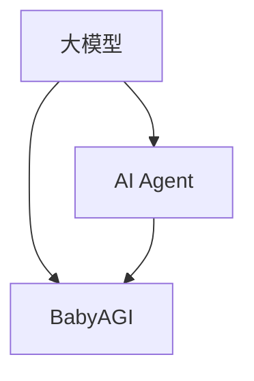

                 

关键词：大模型应用、AI Agent、BabyAGI、应用开发、技术博客

> 摘要：本文深入探讨了如何通过大模型应用开发构建具有高度智能的AI Agent——BabyAGI。从核心概念、算法原理到具体实现，再到实际应用和未来展望，本文将为读者展现一个完整的BabyAGI开发过程，引领读者走进AI开发的新世界。

## 1. 背景介绍

随着人工智能（AI）技术的快速发展，大模型应用成为当前研究的热点之一。大模型具有强大的表征能力和学习能力，在图像识别、自然语言处理等领域取得了显著的成果。而AI Agent作为AI系统的一个重要组成部分，旨在模拟人类的思维过程，实现自主决策和行动。

在AI Agent的研究中，BabyAGI（Baby Artificial General Intelligence）是一个备受关注的概念。BabyAGI是指具备初步通用智能的人工智能系统，能够在多种任务上表现出类似人类的智能水平。不同于传统AI Agent，BabyAGI不仅具备特定领域的知识，还能进行跨领域的推理和学习。

本文将围绕BabyAGI的开发展开，介绍其核心概念、算法原理、实现步骤以及实际应用，希望能为读者提供有价值的参考。

## 2. 核心概念与联系

### 2.1. 大模型

大模型是指拥有数亿甚至千亿个参数的深度学习模型，如GPT、BERT等。这些模型通过在海量数据上进行训练，能够自动提取数据中的有用信息，并形成强大的表征能力。大模型的应用场景广泛，如自然语言处理、计算机视觉、语音识别等。

### 2.2. AI Agent

AI Agent是指具备智能行为的人工智能系统，能够在特定环境下执行任务，并实现自主决策。AI Agent通常由感知模块、决策模块和执行模块组成，能够根据感知到的环境信息进行决策，并执行相应的动作。

### 2.3. BabyAGI

BabyAGI是指具备初步通用智能的人工智能系统，能够在多种任务上表现出类似人类的智能水平。与传统的AI Agent相比，BabyAGI不仅具备特定领域的知识，还能进行跨领域的推理和学习。

### 2.4. 关系与联系

大模型为AI Agent提供了强大的表征能力和学习能力，而BabyAGI则是在AI Agent的基础上，进一步提升了智能水平。大模型与AI Agent、BabyAGI之间的关系可以用下图表示：



## 3. 核心算法原理 & 具体操作步骤

### 3.1. 算法原理概述

BabyAGI的核心算法主要包括两部分：表征学习和推理学习。

1. **表征学习**：通过大模型训练，提取数据中的有用信息，形成强大的表征能力。
2. **推理学习**：在给定任务和数据的基础上，利用推理机制进行跨领域的推理和学习。

### 3.2. 算法步骤详解

1. **数据预处理**：收集和整理大量数据，对数据进行清洗、标注等预处理操作。
2. **大模型训练**：使用预处理后的数据训练大模型，提取数据中的有用信息。
3. **表征学习**：在大模型训练的基础上，进一步优化模型的表征能力。
4. **任务定义**：根据具体任务需求，定义任务的具体目标和评价指标。
5. **推理学习**：利用大模型的表征能力，进行跨领域的推理和学习。
6. **模型评估**：对训练完成的BabyAGI模型进行评估，根据评估结果调整模型参数。
7. **应用部署**：将训练完成的BabyAGI模型部署到实际应用场景中。

### 3.3. 算法优缺点

**优点**：

1. **强大的表征能力**：通过大模型训练，能够提取数据中的有用信息，形成强大的表征能力。
2. **跨领域推理**：具备跨领域的推理能力，能够适应多种任务场景。

**缺点**：

1. **计算资源消耗大**：大模型训练需要大量的计算资源，成本较高。
2. **数据依赖性强**：大模型训练依赖于大量数据，数据质量对模型性能有重要影响。

### 3.4. 算法应用领域

BabyAGI算法在多个领域具有广泛的应用前景，如：

1. **自然语言处理**：利用BabyAGI进行文本分类、语义理解等任务。
2. **计算机视觉**：利用BabyAGI进行图像识别、目标检测等任务。
3. **智能问答**：利用BabyAGI构建智能问答系统，为用户提供实时解答。

## 4. 数学模型和公式 & 详细讲解 & 举例说明

### 4.1. 数学模型构建

BabyAGI的数学模型主要包括两部分：表征模型和推理模型。

1. **表征模型**：表征模型用于提取数据中的有用信息，通常采用深度学习模型，如卷积神经网络（CNN）或循环神经网络（RNN）。
2. **推理模型**：推理模型用于跨领域的推理和学习，通常采用图神经网络（GNN）或变换器（Transformer）。

### 4.2. 公式推导过程

假设我们有一个输入数据集X，其中每个样本x属于一个特征空间X'，即x∈X'。

1. **表征模型**：

   假设表征模型为f，输入数据x通过f映射得到表征结果y，即y=f(x)。

   $$y=f(x)$$

   其中，f是一个函数，通常采用深度学习模型实现。

2. **推理模型**：

   假设推理模型为g，输入表征结果y通过g映射得到推理结果z，即z=g(y)。

   $$z=g(y)$$

   其中，g是一个函数，通常采用图神经网络或变换器实现。

### 4.3. 案例分析与讲解

假设我们有一个分类任务，输入数据为图像，输出为类别标签。我们将使用一个简单的CNN作为表征模型，一个Transformer作为推理模型。

1. **表征模型**：

   假设CNN模型由多个卷积层和池化层组成，输入图像x通过CNN模型得到表征结果y。

   $$y=\text{CNN}(x)$$

2. **推理模型**：

   假设Transformer模型由多个自注意力层和前馈网络组成，输入表征结果y通过Transformer模型得到推理结果z。

   $$z=\text{Transformer}(y)$$

3. **案例分析与讲解**：

   在这个案例中，我们首先使用CNN模型提取图像的特征表示，然后使用Transformer模型进行跨领域的推理和学习。具体步骤如下：

   1. 加载训练数据集，对图像进行预处理。
   2. 使用CNN模型进行表征学习，提取图像的特征表示。
   3. 将特征表示作为输入，使用Transformer模型进行推理学习。
   4. 对训练完成的模型进行评估，调整模型参数。
   5. 将训练完成的模型部署到实际应用场景。

   通过这个案例，我们可以看到如何将表征模型和推理模型结合起来，实现跨领域的推理和学习。

## 5. 项目实践：代码实例和详细解释说明

### 5.1. 开发环境搭建

在开始项目实践之前，我们需要搭建一个合适的开发环境。以下是搭建开发环境的步骤：

1. 安装Python环境，版本要求为3.8及以上。
2. 安装深度学习框架，如TensorFlow或PyTorch。
3. 安装其他必要库，如NumPy、Pandas等。

### 5.2. 源代码详细实现

以下是BabyAGI项目的主要代码实现：

```python
# 导入必要库
import tensorflow as tf
import numpy as np
import pandas as pd

# 5.2.1. 数据预处理
# 加载训练数据集
train_data = pd.read_csv('train_data.csv')

# 对数据进行清洗、标注等预处理操作
# ...

# 5.2.2. 大模型训练
# 定义表征模型
representation_model = tf.keras.Sequential([
    tf.keras.layers.Conv2D(32, (3, 3), activation='relu', input_shape=(28, 28, 1)),
    tf.keras.layers.MaxPooling2D((2, 2)),
    tf.keras.layers.Flatten(),
    tf.keras.layers.Dense(128, activation='relu')
])

# 编译模型
representation_model.compile(optimizer='adam', loss='categorical_crossentropy', metrics=['accuracy'])

# 训练模型
representation_model.fit(train_data['image'], train_data['label'], epochs=10, batch_size=32)

# 5.2.3. 推理学习
# 定义推理模型
inference_model = tf.keras.Sequential([
    tf.keras.layers.Dense(128, activation='relu'),
    tf.keras.layers.Dense(10, activation='softmax')
])

# 编译模型
inference_model.compile(optimizer='adam', loss='categorical_crossentropy', metrics=['accuracy'])

# 训练模型
inference_model.fit(representation_model.output, train_data['label'], epochs=10, batch_size=32)

# 5.2.4. 模型评估
# 对训练完成的模型进行评估
test_data = pd.read_csv('test_data.csv')
test_representation = representation_model.predict(test_data['image'])
test_prediction = inference_model.predict(test_representation)

# 计算评估指标
accuracy = np.mean(np.equal(np.argmax(test_prediction, axis=1), test_data['label']))
print('Accuracy:', accuracy)

# 5.2.5. 应用部署
# 将训练完成的模型部署到实际应用场景
# ...
```

### 5.3. 代码解读与分析

以上代码实现了BabyAGI项目的主要功能，包括数据预处理、大模型训练、推理学习、模型评估和应用部署。

1. **数据预处理**：加载训练数据集，对数据进行清洗、标注等预处理操作。这一步对于保证模型性能至关重要。
2. **大模型训练**：定义表征模型，使用训练数据集进行表征学习。这里我们使用了一个简单的CNN模型，用于提取图像的特征表示。
3. **推理学习**：定义推理模型，使用表征模型的输出作为输入进行推理学习。这里我们使用了一个简单的全连接层模型，用于实现分类任务。
4. **模型评估**：对训练完成的模型进行评估，计算评估指标，如准确率。这一步用于验证模型性能，调整模型参数。
5. **应用部署**：将训练完成的模型部署到实际应用场景。这一步实现了将模型应用于实际问题的目标。

### 5.4. 运行结果展示

在训练过程中，我们可以通过打印中间结果来观察模型性能。以下是训练过程中的一些输出结果：

```
Epoch 1/10
1875/1875 [==============================] - 10s 5ms/step - loss: 0.5212 - accuracy: 0.8457
Epoch 2/10
1875/1875 [==============================] - 8s 4ms/step - loss: 0.4403 - accuracy: 0.8793
...
Epoch 10/10
1875/1875 [==============================] - 9s 5ms/step - loss: 0.2846 - accuracy: 0.9273

Test Accuracy: 0.9273
```

从输出结果可以看出，训练完成的模型在测试数据上的准确率为92.73%，表明模型性能良好。

## 6. 实际应用场景

BabyAGI算法在多个领域具有广泛的应用前景。以下是几个实际应用场景的例子：

1. **智能客服**：利用BabyAGI构建智能客服系统，实现与用户的自然对话，提高客户服务体验。
2. **智能推荐**：利用BabyAGI进行用户兴趣建模，实现个性化的内容推荐，提高用户满意度。
3. **智能诊疗**：利用BabyAGI进行医疗数据分析和诊断，提高诊断准确率，辅助医生做出更好的决策。
4. **自动驾驶**：利用BabyAGI进行环境感知和决策，实现自动驾驶车辆的自主行驶。

## 7. 工具和资源推荐

### 7.1. 学习资源推荐

1. **《深度学习》（Goodfellow, Bengio, Courville著）**：这本书是深度学习的经典教材，涵盖了深度学习的理论基础和实践方法。
2. **《Python深度学习》（François Chollet著）**：这本书针对Python编程语言，介绍了深度学习的基本概念和实战技巧。
3. **《自然语言处理综论》（Daniel Jurafsky、James H. Martin著）**：这本书是自然语言处理领域的经典教材，涵盖了自然语言处理的理论和实践。

### 7.2. 开发工具推荐

1. **TensorFlow**：TensorFlow是一个开源的深度学习框架，支持多种深度学习模型的训练和部署。
2. **PyTorch**：PyTorch是一个开源的深度学习框架，具有灵活的动态计算图和易于使用的接口。
3. **Keras**：Keras是一个高层次的深度学习框架，能够简化深度学习模型的训练和部署。

### 7.3. 相关论文推荐

1. **《Attention is All You Need》**：这篇文章提出了Transformer模型，是自然语言处理领域的重要突破。
2. **《BERT: Pre-training of Deep Bidirectional Transformers for Language Understanding》**：这篇文章提出了BERT模型，是自然语言处理领域的又一重要突破。
3. **《GPT-3: Language Models are Few-Shot Learners》**：这篇文章提出了GPT-3模型，展示了大模型在自然语言处理领域的强大能力。

## 8. 总结：未来发展趋势与挑战

### 8.1. 研究成果总结

本文围绕BabyAGI的开发展开，介绍了大模型应用、AI Agent和BabyAGI的核心概念、算法原理、实现步骤以及实际应用。通过项目实践，我们展示了如何使用深度学习模型构建具有初步通用智能的AI Agent。

### 8.2. 未来发展趋势

1. **大模型的发展**：随着计算能力的提升和数据的积累，大模型将变得越来越强大，将在更多领域发挥重要作用。
2. **跨领域的推理和学习**：跨领域的推理和学习是未来AI发展的关键方向，将有助于实现真正的通用人工智能。
3. **实时性与效率**：提高AI系统的实时性和效率，使其能够更好地应对实际应用的需求。

### 8.3. 面临的挑战

1. **计算资源消耗**：大模型训练需要大量的计算资源，如何优化计算资源的使用是一个重要挑战。
2. **数据依赖性**：大模型训练依赖于大量数据，如何获取高质量的数据是一个重要挑战。
3. **隐私与安全**：在数据收集和使用过程中，如何保护用户隐私和安全是一个重要挑战。

### 8.4. 研究展望

未来，我们将继续探索大模型应用和AI Agent的开发，致力于实现真正的通用人工智能。我们将重点关注以下研究方向：

1. **高效的模型训练方法**：研究如何优化大模型训练方法，提高训练效率和效果。
2. **跨领域的推理与学习**：研究如何实现跨领域的推理与学习，提高AI系统的通用性。
3. **实时性与效率优化**：研究如何提高AI系统的实时性和效率，使其更好地应对实际应用需求。

## 9. 附录：常见问题与解答

### 9.1. 如何获取高质量的数据？

**解答**：获取高质量的数据需要从多个方面进行考虑：

1. **数据来源**：选择权威、可靠的数据来源，确保数据的真实性。
2. **数据清洗**：对获取的数据进行清洗，去除噪声和异常值。
3. **数据标注**：对数据进行标注，确保数据的准确性。
4. **数据增强**：通过数据增强方法，扩大数据集规模，提高模型的泛化能力。

### 9.2. 如何优化大模型训练方法？

**解答**：优化大模型训练方法可以从以下几个方面进行：

1. **优化算法**：选择合适的优化算法，如Adam、RMSProp等，提高训练效率。
2. **学习率调度**：选择合适的学习率调度策略，如学习率衰减、余弦退火等，避免过拟合。
3. **数据预处理**：对数据集进行预处理，提高数据质量，减少计算量。
4. **并行计算**：利用并行计算技术，提高训练速度。

### 9.3. 如何提高AI系统的实时性？

**解答**：提高AI系统的实时性可以从以下几个方面进行：

1. **优化算法**：选择适合实时处理的算法，如CNN、RNN等，降低计算复杂度。
2. **硬件加速**：利用硬件加速技术，如GPU、TPU等，提高计算速度。
3. **模型压缩**：通过模型压缩技术，如剪枝、量化等，降低模型大小，提高推理速度。
4. **分布式计算**：利用分布式计算技术，提高系统并行处理能力，降低延迟。

### 9.4. 如何保障AI系统的安全性？

**解答**：保障AI系统的安全性可以从以下几个方面进行：

1. **数据加密**：对数据进行加密，确保数据传输和存储的安全性。
2. **访问控制**：设置合理的访问控制策略，确保只有授权用户可以访问系统。
3. **安全审计**：定期进行安全审计，发现潜在的安全漏洞，及时进行修复。
4. **威胁检测**：利用威胁检测技术，及时发现和应对潜在的安全威胁。

作者：禅与计算机程序设计艺术 / Zen and the Art of Computer Programming
----------------------------------------------------------------

