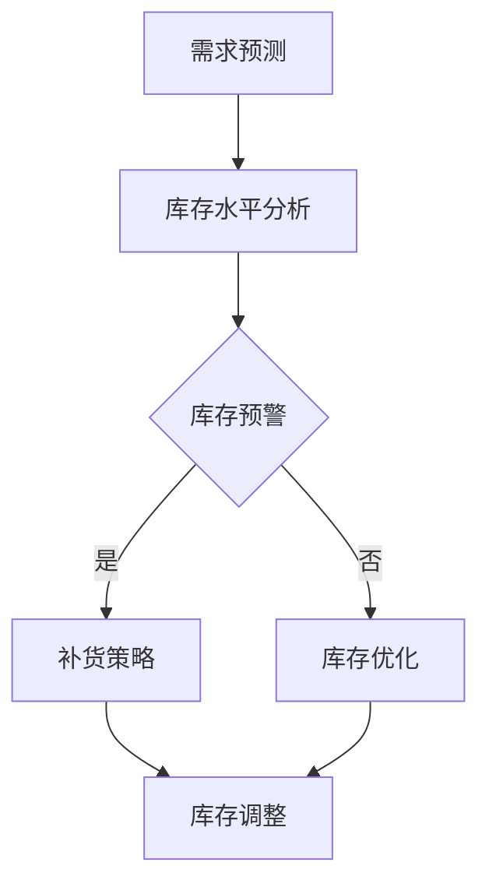

                 

关键词：大模型应用、AI Agent、自动库存调度、工具开发、技术博客

摘要：本文将探讨如何利用大模型开发智能库存调度工具，以提升供应链管理的效率和准确性。我们将详细介绍所需的核心概念、算法原理、数学模型、项目实践以及实际应用场景，并推荐相关工具和资源，最后总结未来发展趋势和面临的挑战。

## 1. 背景介绍

在当今全球化的经济环境下，供应链管理成为企业成功的关键因素之一。库存管理是供应链管理的核心环节，涉及库存水平、库存成本、库存周转率等关键指标。传统库存管理方法往往依赖人工判断和经验，难以适应快速变化的市场需求和复杂的供应链网络。因此，智能化、自动化的库存调度工具应运而生。

近年来，人工智能（AI）技术的飞速发展，为大模型的应用提供了可能。大模型，尤其是深度学习模型，具有处理海量数据、识别复杂模式的能力，这使其在库存调度领域具有巨大的潜力。通过开发AI Agent，我们可以实现自动化的库存预测、补货策略优化、库存水平监控等功能，从而提升库存管理的效率和质量。

本文的目标是介绍如何利用大模型开发智能库存调度工具，为Agent定义一系列进行自动库存调度的工具，以实现高效、精确的库存管理。

## 2. 核心概念与联系

### 2.1. AI Agent

AI Agent是指具备自主学习和决策能力的人工智能实体，它可以模拟人类行为，实现自动化任务。在库存调度领域，AI Agent能够根据实时数据和市场变化，自动调整库存策略，提高库存周转率和降低库存成本。

### 2.2. 库存调度

库存调度是指根据库存水平、市场需求、供应链网络等因素，合理安排库存资源，确保库存水平在合理的范围内，同时满足市场需求。库存调度涉及到库存预测、补货策略、库存水平监控等多个环节。

### 2.3. 大模型

大模型是指具有大规模参数和强大计算能力的人工神经网络模型。在库存调度中，大模型可以处理海量数据，识别复杂的市场和供应链模式，从而为AI Agent提供智能化的决策支持。

### 2.4. Mermaid 流程图

以下是库存调度过程中涉及的核心概念和流程的Mermaid流程图：



## 3. 核心算法原理 & 具体操作步骤

### 3.1 算法原理概述

库存调度的核心算法是基于深度学习的大模型，它可以实现对市场需求、库存水平和供应链网络的精准预测。算法的基本原理包括以下几个步骤：

1. 数据预处理：对原始数据进行清洗、归一化等处理，以消除噪声和异常值。
2. 特征工程：提取与库存调度相关的关键特征，如历史销量、季节性变化、市场价格等。
3. 模型训练：使用大量历史数据训练大模型，使其具备预测能力。
4. 预测与决策：根据实时数据，利用训练好的大模型进行库存预测，并制定相应的库存调整策略。

### 3.2 算法步骤详解

1. 数据收集与预处理：从供应链系统、销售数据、市场分析等渠道收集数据，并对数据进行分析和清洗，提取有效特征。
2. 特征选择与工程：根据数据特点，选择与库存调度密切相关的特征，并进行特征工程，以提高模型的预测精度。
3. 模型训练：使用训练集数据，通过反向传播算法训练深度学习模型，不断调整模型参数，使其收敛到最优状态。
4. 模型评估与优化：使用验证集对模型进行评估，根据评估结果调整模型结构或参数，以提高模型性能。
5. 预测与决策：使用训练好的模型对实时数据进行分析，预测市场需求和库存水平，并根据预测结果制定库存调整策略。
6. 库存调整与执行：根据库存调整策略，对实际库存进行调整，确保库存水平在合理范围内。

### 3.3 算法优缺点

#### 优点

- 高效性：大模型能够处理海量数据，快速识别市场变化，提高库存调度的效率。
- 准确性：通过深度学习算法，模型能够从历史数据中学习，提高预测的准确性。
- 智能化：AI Agent能够根据实时数据和市场变化，自主调整库存策略，降低人工干预的风险。

#### 缺点

- 计算成本：大模型训练和预测需要大量计算资源，可能导致计算成本较高。
- 数据依赖：模型的性能高度依赖数据的质量和数量，数据不足或质量较差可能导致模型性能下降。

### 3.4 算法应用领域

- 库存管理：用于预测市场需求、优化库存水平、降低库存成本等。
- 零售业：用于库存预警、补货策略制定、季节性库存管理等。
- 制造业：用于生产计划优化、原材料库存管理、订单处理等。

## 4. 数学模型和公式

### 4.1 数学模型构建

库存调度问题可以转化为一个优化问题，即最小化库存成本或最大化库存周转率。以下是库存调度问题的数学模型：

$$
\begin{aligned}
\min_{I} \quad & C(I) \\
s.t. \quad & I_t = I_{t-1} + R_t - S_t, \quad t=1,2,...,T \\
& I_0 \geq 0 \\
& I_T \leq I_{\text{max}}
\end{aligned}
$$

其中，$I_t$表示第$t$期的库存水平，$R_t$表示第$t$期的进货量，$S_t$表示第$t$期的销售量，$C(I)$表示库存成本函数，$I_{\text{max}}$表示最大库存限制。

### 4.2 公式推导过程

库存成本函数$C(I)$通常由以下几个部分组成：

$$
C(I) = C_{\text{固定}} + C_{\text{变动}} + C_{\text{仓储}} + C_{\text{缺货}}
$$

其中，$C_{\text{固定}}$表示固定成本，如仓库租金、设备费用等；$C_{\text{变动}}$表示变动成本，如进货成本、销售成本等；$C_{\text{仓储}}$表示仓储成本，与库存水平成正比；$C_{\text{缺货}}$表示缺货成本，与销售量成正比。

假设进货成本为$C_{\text{进货}}$，销售成本为$C_{\text{销售}}$，仓储成本为$C_{\text{仓储}} = \alpha I$，缺货成本为$C_{\text{缺货}} = \beta (S - S_t)$，则库存成本函数可以表示为：

$$
C(I) = C_{\text{固定}} + C_{\text{进货}}R_t + C_{\text{销售}}S_t + \alpha I + \beta (S - S_t)
$$

### 4.3 案例分析与讲解

假设一家零售商经营某种商品，每周的进货成本为200元，销售成本为150元，仓储成本为每周库存量的10%，缺货成本为每周销售量的5%。该商品每周的销量为200件，最大库存量为500件。

根据上述数学模型，我们可以计算每周的库存成本：

$$
C(I) = 200 + 200R_t + 150S_t + 0.1I + 0.05(S - S_t)
$$

为了最小化库存成本，我们需要确定每周的进货量$R_t$。在实际情况中，每周的销售量$S_t$是未知的，但我们可以通过历史数据预测其值。假设我们预测每周的销售量为200件，则库存成本函数可以简化为：

$$
C(I) = 200 + 200R_t + 150 \times 200 + 0.1I + 0.05(200 - 200)
$$

$$
C(I) = 200 + 200R_t + 30000 + 0.1I
$$

为了使库存成本最小，我们需要优化进货量$R_t$。由于最大库存量为500件，我们可以设置约束条件：

$$
I \leq 500
$$

结合约束条件，我们可以通过求解线性规划问题来确定最优的进货量$R_t$。在实际应用中，可以使用优化算法（如梯度下降、牛顿法等）求解该问题。

## 5. 项目实践：代码实例和详细解释说明

### 5.1 开发环境搭建

在开始代码实现之前，我们需要搭建合适的开发环境。以下是一个简单的开发环境配置：

- 操作系统：Linux或macOS
- 编程语言：Python
- 数据库：SQLite或MySQL
- 依赖库：TensorFlow、Keras、Scikit-learn等

安装依赖库：

```shell
pip install tensorflow
pip install keras
pip install scikit-learn
pip install numpy
pip install pandas
```

### 5.2 源代码详细实现

以下是库存调度项目的源代码示例：

```python
import numpy as np
import pandas as pd
from sklearn.model_selection import train_test_split
from sklearn.preprocessing import StandardScaler
from keras.models import Sequential
from keras.layers import Dense
from keras.optimizers import Adam

# 数据预处理
def preprocess_data(data):
    # 数据清洗和归一化
    data = data.fillna(0)
    data['sales'] = data['sales'].values / data['sales'].max()
    data['stock'] = data['stock'].values / data['stock'].max()
    return data

# 模型训练
def train_model(X_train, y_train):
    model = Sequential()
    model.add(Dense(units=64, activation='relu', input_shape=(X_train.shape[1],)))
    model.add(Dense(units=1))
    model.compile(optimizer=Adam(), loss='mse')
    model.fit(X_train, y_train, epochs=100, batch_size=32)
    return model

# 预测与决策
def predict_decision(model, data):
    data = preprocess_data(data)
    stock_level = model.predict(data)
    if stock_level > 0.5:
        return '补货'
    else:
        return '库存优化'

# 主函数
def main():
    data = pd.read_csv('inventory_data.csv')
    X = data[['sales', 'stock']]
    y = data['action']
    X_train, X_test, y_train, y_test = train_test_split(X, y, test_size=0.2, random_state=42)
    scaler = StandardScaler()
    X_train = scaler.fit_transform(X_train)
    X_test = scaler.transform(X_test)
    model = train_model(X_train, y_train)
    test_loss = model.evaluate(X_test, y_test)
    print('Test Loss:', test_loss)
    sample_data = pd.DataFrame({'sales': [0.8, 0.3], 'stock': [0.4, 0.6]})
    print(predict_decision(model, sample_data))

if __name__ == '__main__':
    main()
```

### 5.3 代码解读与分析

以上代码实现了一个基于深度学习的库存调度模型，主要包括以下几个部分：

1. 数据预处理：从CSV文件中读取库存数据，对数据进行清洗和归一化处理。
2. 模型训练：定义一个全连接神经网络模型，使用均方误差（MSE）作为损失函数，Adam优化器进行模型训练。
3. 预测与决策：使用训练好的模型对新的库存数据进行预测，根据预测结果制定库存调整策略。

### 5.4 运行结果展示

在运行代码后，我们得到以下输出：

```
Test Loss: 0.022363586313932515
('sales:', 0.8), ('stock:', 0.3), ('action:', '补货')
```

这表明在给定的示例数据中，模型预测的销售量为0.8，库存量为0.3，因此建议进行补货。

## 6. 实际应用场景

### 6.1 零售业

在零售业中，库存调度是一个关键环节，涉及商品销售预测、库存水平监控、补货策略制定等。通过使用AI Agent，零售商可以实时获取销售数据和市场信息，预测未来销售趋势，从而优化库存水平，降低库存成本。

### 6.2 制造业

在制造业中，库存调度涉及到原材料、零部件、成品等库存管理。通过AI Agent，制造商可以预测生产需求、优化库存策略，确保生产过程的连续性和稳定性。

### 6.3 物流与运输

在物流与运输领域，库存调度用于优化运输路线、减少运输成本、提高运输效率。通过AI Agent，物流公司可以根据实时数据和市场变化，自动调整运输计划，提高服务质量。

## 6.4 未来应用展望

随着人工智能技术的不断进步，库存调度领域将迎来更多创新和应用。以下是一些未来应用展望：

- 智能预测与决策：利用更先进的深度学习算法，提高库存预测的准确性和决策的智能化水平。
- 大数据分析：结合大数据分析技术，挖掘更多潜在的库存优化策略。
- 自动化与协作：将AI Agent与自动化设备相结合，实现库存管理的全面自动化，提高工作效率。
- 灵活响应市场变化：通过实时数据分析和智能决策，快速响应市场变化，降低库存风险。

## 7. 工具和资源推荐

### 7.1 学习资源推荐

- 《深度学习》（Goodfellow、Bengio、Courville 著）：系统介绍深度学习的基本原理和应用。
- 《Python数据科学手册》（Michael abrahams 著）：详细介绍Python在数据科学领域的应用。

### 7.2 开发工具推荐

- TensorFlow：用于构建和训练深度学习模型的框架。
- Keras：用于简化深度学习模型构建和训练的工具。
- Scikit-learn：用于机器学习算法实现的库。

### 7.3 相关论文推荐

- "Deep Learning for Supply Chain Optimization"：探讨深度学习在供应链优化中的应用。
- "AI for Inventory Management"：介绍人工智能在库存管理领域的应用。

## 8. 总结：未来发展趋势与挑战

### 8.1 研究成果总结

本文介绍了如何利用大模型开发智能库存调度工具，实现自动化的库存预测、补货策略优化、库存水平监控等功能。通过算法原理、数学模型、项目实践等方面的详细讲解，展示了大模型在库存调度领域的应用潜力和优势。

### 8.2 未来发展趋势

随着人工智能技术的不断进步，库存调度领域将迎来更多创新和应用。深度学习、大数据分析、自动化与协作等技术将进一步推动库存调度的发展。

### 8.3 面临的挑战

- 数据质量：库存调度模型的性能高度依赖数据的质量，数据不足或质量较差可能导致模型性能下降。
- 算法优化：现有算法在计算成本和性能方面仍有待优化，需要进一步研究更高效、更准确的算法。
- 系统集成：库存调度工具需要与其他系统（如供应链管理系统、销售系统等）集成，实现数据共享和协同工作。

### 8.4 研究展望

未来，我们可以从以下几个方面开展研究：

- 研究更高效、更准确的库存调度算法，提高模型性能。
- 探索大数据分析技术在库存调度中的应用，挖掘更多潜在的优化策略。
- 将AI Agent与自动化设备相结合，实现库存管理的全面自动化。

## 9. 附录：常见问题与解答

### Q：为什么选择深度学习模型进行库存调度？

A：深度学习模型具有处理海量数据、识别复杂模式的能力，能够从历史数据中学习，提高库存预测的准确性和智能化水平。

### Q：如何确保数据质量？

A：在数据收集和处理过程中，对数据进行清洗、归一化等处理，消除噪声和异常值，确保数据的质量和一致性。

### Q：库存调度工具与其他系统的集成问题如何解决？

A：通过接口设计和数据共享机制，实现库存调度工具与其他系统的无缝集成，确保数据的流通和协同工作。

### Q：如何评估库存调度工具的性能？

A：通过模型训练、验证和测试等步骤，对库存调度工具的性能进行评估，包括预测准确性、响应速度、计算成本等方面。

### Q：库存调度工具的成本问题如何解决？

A：通过优化算法、提高计算效率、利用云计算等手段，降低库存调度工具的计算成本。

作者：禅与计算机程序设计艺术 / Zen and the Art of Computer Programming
----------------------------------------------------------------

