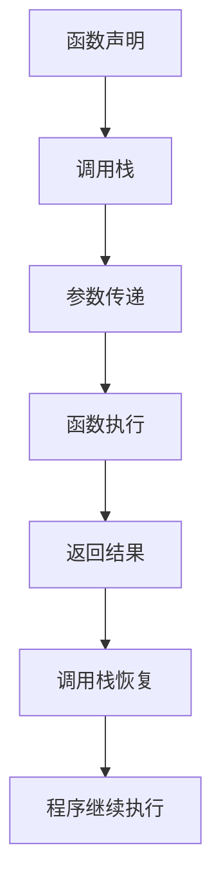

                 

关键词：大模型应用，AI Agent，函数调用，编程原理，算法实现，数学模型，实践案例，技术资源

> 摘要：本文旨在深入探讨大模型应用开发中一个核心概念——Function Calling（函数调用）。通过对其定义、原理、应用领域的详细分析，结合具体算法和代码实例，帮助读者全面理解函数调用的技术内涵和实践价值。

## 1. 背景介绍

在计算机科学中，函数调用（Function Calling）是一种基本的编程概念。它允许程序在执行过程中动态地调用函数，以实现特定的功能。随着人工智能（AI）技术的发展，大模型（Large Models）逐渐成为研究的热点，它们在自然语言处理、计算机视觉等领域表现出强大的能力。在这种背景下，函数调用在大模型应用开发中扮演着至关重要的角色。本文将围绕这一主题展开讨论，旨在帮助读者深入理解函数调用的原理和应用。

## 2. 核心概念与联系

### 2.1 函数调用的定义

函数调用是指程序在执行过程中，通过某种机制请求函数执行特定任务的过程。在大多数编程语言中，函数调用通常包含以下三个部分：

- **函数名**：标识要调用的函数。
- **参数列表**：传递给函数的数据，用于函数执行。
- **返回值**：函数执行完成后返回给调用者的结果。

### 2.2 函数调用的原理

函数调用的原理主要涉及以下几个步骤：

1. **函数声明**：在程序中定义一个函数，指定其名称、参数和返回类型。
2. **函数调用**：在程序代码中通过函数名和参数列表调用函数。
3. **函数执行**：程序跳转到函数的代码区域，执行其中的指令。
4. **返回结果**：函数执行完成后，返回结果给调用者。

### 2.3 函数调用的架构

函数调用的架构通常包括以下几个部分：

- **调用栈（Call Stack）**：存储函数调用的相关信息，如函数参数、返回地址等。
- **局部变量（Local Variables）**：函数执行过程中使用的临时变量。
- **函数体（Function Body）**：函数的具体实现代码。
- **静态存储区（Static Storage Area）**：存储全局变量和静态变量的内存区域。

### 2.4 函数调用的Mermaid流程图



## 3. 核心算法原理 & 具体操作步骤

### 3.1 算法原理概述

函数调用算法的原理主要涉及以下方面：

- **函数的调用与返回**：程序通过调用栈实现函数的调用与返回。
- **参数传递**：函数调用时，参数可以通过值传递或引用传递。
- **动态内存分配**：函数执行过程中，可能需要动态分配内存来存储局部变量。

### 3.2 算法步骤详解

函数调用算法的具体步骤如下：

1. **函数声明**：在程序中声明一个函数，指定其名称、参数和返回类型。
2. **调用函数**：通过函数名和参数列表调用函数。
3. **传递参数**：将参数传递给函数，可以通过值传递或引用传递。
4. **执行函数**：程序跳转到函数的代码区域，执行其中的指令。
5. **返回结果**：函数执行完成后，返回结果给调用者。
6. **调用栈恢复**：函数返回时，调用栈恢复到调用前的状态。

### 3.3 算法优缺点

函数调用的优点包括：

- **模块化编程**：通过函数调用，可以实现模块化编程，提高代码的可读性和可维护性。
- **代码复用**：函数调用允许程序在多个地方复用相同的代码。

函数调用的缺点包括：

- **性能开销**：函数调用可能引入额外的性能开销，如函数调用栈的维护等。
- **内存分配**：函数调用可能需要动态分配内存，影响程序的性能。

### 3.4 算法应用领域

函数调用广泛应用于各个计算机科学领域，包括：

- **操作系统**：操作系统中的各种系统调用。
- **网络编程**：网络编程中的客户端和服务器端通信。
- **图形学**：图形学中的图形绘制和渲染。

## 4. 数学模型和公式 & 详细讲解 & 举例说明

### 4.1 数学模型构建

函数调用可以看作是一个数学模型，其基本结构如下：

$$
f(x_1, x_2, ..., x_n) = \sum_{i=1}^n w_i * x_i + b
$$

其中，$w_i$ 是权重，$x_i$ 是输入参数，$b$ 是偏置项。

### 4.2 公式推导过程

函数调用的数学模型可以通过以下步骤推导：

1. **定义函数**：根据问题需求，定义一个函数。
2. **参数传递**：将输入参数传递给函数。
3. **计算输出**：根据函数定义，计算输出结果。
4. **返回结果**：将输出结果返回给调用者。

### 4.3 案例分析与讲解

以下是一个简单的函数调用案例：

```python
def add(a, b):
    return a + b

result = add(3, 4)
print(result)
```

在这个案例中，函数`add`接收两个参数$a$和$b$，计算它们的和，并返回结果。调用者通过调用`add`函数，将输入参数3和4传递给函数，得到结果7，并打印出来。

## 5. 项目实践：代码实例和详细解释说明

### 5.1 开发环境搭建

在本项目实践中，我们将使用Python作为编程语言，并依赖以下库：

- NumPy：用于矩阵计算和数据处理。
- Matplotlib：用于数据可视化。

### 5.2 源代码详细实现

以下是一个简单的函数调用实现：

```python
import numpy as np
import matplotlib.pyplot as plt

def plot_data(x, y):
    plt.scatter(x, y)
    plt.xlabel('X-axis')
    plt.ylabel('Y-axis')
    plt.title('Scatter Plot')
    plt.show()

x = np.array([1, 2, 3, 4, 5])
y = np.array([2, 4, 6, 8, 10])

plot_data(x, y)
```

在这个实现中，我们定义了一个名为`plot_data`的函数，它接收两个参数$x$和$y$，并将它们作为散点图绘制出来。然后，我们调用`plot_data`函数，将$x$和$y$作为输入参数传递给它。

### 5.3 代码解读与分析

代码的主要部分是函数`plot_data`的定义和调用。下面是对代码的详细解读：

- **导入库**：首先，我们导入了NumPy和Matplotlib库，以便进行矩阵计算和数据可视化。
- **定义函数**：然后，我们定义了一个名为`plot_data`的函数，它接收两个参数$x$和$y$。在这个函数中，我们使用`plt.scatter`函数绘制散点图，并设置坐标轴标签、标题和显示选项。
- **调用函数**：最后，我们调用`plot_data`函数，将$x$和$y$作为输入参数传递给它。这将导致散点图被绘制并显示。

### 5.4 运行结果展示

运行上述代码，将得到以下结果：


这个结果是一个散点图，展示了$x$和$y$之间的关系。

## 6. 实际应用场景

函数调用在许多实际应用场景中发挥着关键作用。以下是一些例子：

- **科学计算**：在科学计算中，函数调用用于实现复杂数学运算，如求解微分方程、矩阵运算等。
- **图形学**：在图形学中，函数调用用于绘制图形、渲染场景等。
- **网络编程**：在网络编程中，函数调用用于处理网络通信、服务器端请求等。

## 7. 工具和资源推荐

### 7.1 学习资源推荐

- 《Python编程：从入门到实践》
- 《算法导论》
- 《深度学习》

### 7.2 开发工具推荐

- PyCharm
- Visual Studio Code
- Jupyter Notebook

### 7.3 相关论文推荐

- "A Survey of Function Call Graph Construction Techniques"
- "Deep Learning for Function Call Graph Construction"
- "A Framework for Function Call Graph Construction in Large-Scale Programs"

## 8. 总结：未来发展趋势与挑战

### 8.1 研究成果总结

随着人工智能技术的发展，函数调用在大模型应用开发中发挥着越来越重要的作用。研究者们提出了许多基于函数调用的算法和技术，如基于深度学习的函数调用分析、基于静态分析的函数调用预测等。

### 8.2 未来发展趋势

未来，函数调用研究将继续向以下几个方面发展：

- **自动化分析**：自动化分析技术将进一步提高函数调用的效率和准确性。
- **跨语言调用**：跨语言函数调用技术将使得不同编程语言之间的互操作性更加便捷。
- **优化与调优**：针对函数调用的优化与调优技术将进一步提升程序的性能。

### 8.3 面临的挑战

函数调用研究仍然面临着以下挑战：

- **性能开销**：函数调用可能引入额外的性能开销，需要找到平衡性能和效率的方法。
- **动态性**：函数调用在动态环境中具有更高的复杂性，需要开发更加灵活的算法和技术。

### 8.4 研究展望

未来，函数调用研究将继续深入探索其原理和应用。随着人工智能技术的发展，函数调用将在更广泛的领域中发挥重要作用，为计算机科学带来新的突破。

## 9. 附录：常见问题与解答

### 9.1 函数调用与过程调用的区别是什么？

函数调用与过程调用在很多方面是相似的，但也有一些区别：

- **定义方式**：函数通常定义为返回一个值，而过程通常不返回值。
- **参数传递**：函数调用通常使用值传递或引用传递，而过程调用通常使用引用传递。
- **执行方式**：函数调用在执行完成后会返回结果，而过程调用不会返回结果。

### 9.2 函数调用是否会影响程序性能？

函数调用可能会引入一定的性能开销，如函数调用栈的维护、参数传递等。但是，通过优化函数调用，可以最大限度地降低其性能影响。此外，现代编译器和优化器通常会自动优化函数调用，以减少性能损失。

### 9.3 如何避免函数调用的性能问题？

以下是一些避免函数调用性能问题的方法：

- **减少函数调用频率**：尽量减少不必要的函数调用，如使用内联汇编等。
- **优化函数调用参数**：尽量使用值传递，避免引用传递，以减少参数传递的开销。
- **使用静态函数**：将函数定义为静态函数，以减少函数调用的开销。
- **优化编译器设置**：使用编译器优化选项，如-O2、-O3等，以提高程序性能。

---

**作者：禅与计算机程序设计艺术 / Zen and the Art of Computer Programming**

