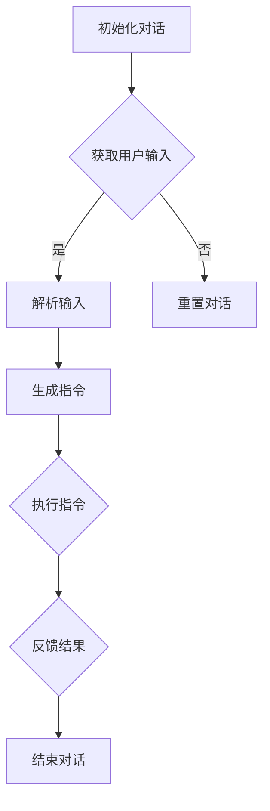

                 

关键词：大模型，应用开发，AI Agent，初始化对话，函数定义，技术博客

> 摘要：本文将深入探讨大模型在AI Agent开发中的应用，以及如何通过初始化对话和定义可用函数来提升AI Agent的表现。我们将介绍核心概念，核心算法原理，具体操作步骤，数学模型，项目实践，并预测其未来的发展趋势与挑战。

## 1. 背景介绍

人工智能（AI）正以前所未有的速度发展，而大模型（如GPT-3，BERT等）的出现更是为AI的发展带来了前所未有的机遇。大模型具备处理复杂数据的能力，可以自动学习并优化模型参数，从而实现更精确的预测和决策。然而，如何有效地利用这些大模型进行应用开发，是当前AI研究的重要课题之一。

AI Agent是人工智能领域的一个重要概念，它代表了一个具有自主决策能力的智能体，能够在复杂环境中执行特定任务。开发一个高效的AI Agent，需要初始化对话和定义一系列的可用函数，以确保其能够有效地与外界交互并执行任务。

本文旨在探讨如何通过初始化对话和定义可用函数来提升AI Agent的性能，并详细解释其背后的原理和具体操作步骤。此外，我们还将通过项目实践来展示如何将理论知识应用到实际开发中。

## 2. 核心概念与联系

### 2.1 大模型

大模型指的是拥有巨大参数量的机器学习模型，如GPT-3拥有1750亿个参数。这些模型通过在大规模数据集上进行训练，可以自动学习并优化模型参数，从而实现高度自动化的预测和决策。

### 2.2 AI Agent

AI Agent是指一个具有自主决策能力的智能体，它可以在复杂环境中执行特定任务。AI Agent的核心是决策算法，它决定了Agent如何与环境交互。

### 2.3 初始化对话

初始化对话是指AI Agent在执行任务前，与用户或环境进行的一系列交互，以获取必要的信息和指令。初始化对话的成功与否直接影响到AI Agent的执行效果。

### 2.4 可用函数

可用函数是指AI Agent在执行任务时可以调用的函数，这些函数实现了特定的功能，如数据处理，模型训练，决策生成等。

### 2.5 Mermaid 流程图

以下是AI Agent初始化对话和定义可用函数的Mermaid流程图：



## 3. 核心算法原理 & 具体操作步骤

### 3.1 算法原理概述

AI Agent的初始化对话和定义可用函数是基于大模型的，其核心原理是利用大模型对自然语言进行处理，从而实现智能对话和任务执行。

初始化对话的关键在于如何准确理解用户的输入，并将其转换为可执行的指令。这需要使用自然语言处理（NLP）技术，如词向量表示，命名实体识别，情感分析等。

定义可用函数的关键在于如何设计高效且可扩展的函数库，以支持AI Agent执行各种任务。这需要使用软件工程的方法，如模块化设计，接口定义，代码复用等。

### 3.2 算法步骤详解

#### 3.2.1 初始化对话

1. **加载大模型**：首先加载预训练的大模型，如GPT-3或BERT。
2. **获取用户输入**：通过API或界面获取用户的输入。
3. **预处理输入**：对用户输入进行预处理，如分词，去停用词等。
4. **词向量表示**：将预处理后的输入转换为词向量表示。
5. **生成指令**：使用大模型对词向量表示进行编码，生成对应的指令。

#### 3.2.2 定义可用函数

1. **需求分析**：根据AI Agent的需求，分析需要实现的功能，并设计对应的函数。
2. **模块化设计**：将函数按照功能模块进行划分，确保代码的可读性和可维护性。
3. **接口定义**：为每个函数定义清晰的接口，包括输入参数和返回值。
4. **代码实现**：根据接口定义，实现每个函数的具体逻辑。
5. **代码测试**：对实现的函数进行测试，确保其正确性和性能。

### 3.3 算法优缺点

#### 优点

1. **高效性**：大模型可以自动学习并优化模型参数，从而实现高效的任务执行。
2. **可扩展性**：通过模块化设计和接口定义，可以方便地扩展AI Agent的功能。
3. **智能性**：大模型具备处理复杂数据的能力，可以实现高度智能的对话和决策。

#### 缺点

1. **计算资源需求大**：大模型需要巨大的计算资源和存储空间，这对硬件设施提出了较高的要求。
2. **可解释性差**：大模型的工作机制较为复杂，其决策过程缺乏可解释性，这给调试和优化带来了困难。

### 3.4 算法应用领域

大模型和AI Agent的结合在多个领域具有广泛的应用前景，如：

1. **自然语言处理**：智能客服，智能翻译，文本生成等。
2. **计算机视觉**：图像识别，目标检测，图像生成等。
3. **决策支持系统**：金融风控，医疗诊断，智能推荐等。

## 4. 数学模型和公式 & 详细讲解 & 举例说明

### 4.1 数学模型构建

AI Agent的初始化对话和定义可用函数涉及多个数学模型，包括自然语言处理模型，函数优化模型等。

#### 4.1.1 自然语言处理模型

自然语言处理模型主要基于神经网络，如卷积神经网络（CNN），循环神经网络（RNN），Transformer等。以下是一个简单的Transformer模型的构建过程：

$$
E = softmax(W_e \cdot [H; S])
$$

其中，$E$表示词向量表示，$W_e$表示权重矩阵，$H$表示隐藏状态，$S$表示序列。

#### 4.1.2 函数优化模型

函数优化模型用于优化AI Agent的函数参数，以实现高效的决策。常用的优化算法包括梯度下降，随机梯度下降，Adam等。以下是一个简单的梯度下降优化算法的公式：

$$
\theta_{t+1} = \theta_t - \alpha \cdot \nabla_{\theta} J(\theta)
$$

其中，$\theta$表示参数，$J(\theta)$表示损失函数，$\alpha$表示学习率。

### 4.2 公式推导过程

#### 4.2.1 Transformer模型

Transformer模型的核心是自注意力机制（Self-Attention），其公式推导如下：

$$
\text{Attention}(Q, K, V) = \text{softmax}\left(\frac{QK^T}{\sqrt{d_k}}\right)V
$$

其中，$Q$表示查询向量，$K$表示键向量，$V$表示值向量，$d_k$表示键向量的维度。

#### 4.2.2 梯度下降优化算法

梯度下降优化算法的推导基于损失函数的优化目标。以线性回归为例，其损失函数为：

$$
J(\theta) = \frac{1}{2} \sum_{i=1}^{n} (y_i - \theta_0 - \theta_1x_i)^2
$$

其梯度为：

$$
\nabla_{\theta} J(\theta) = - (y - \theta_0 - \theta_1x)
$$

### 4.3 案例分析与讲解

#### 4.3.1 智能客服系统

智能客服系统是AI Agent的一个典型应用场景。以下是一个简单的智能客服系统的案例：

1. **用户输入**：用户提问：“我该如何申请信用卡？”
2. **预处理输入**：分词：“我”，“该”，“如何”，“申请”，“信用卡”。
3. **词向量表示**：将分词后的输入转换为词向量表示。
4. **生成指令**：使用大模型生成指令：“查询信用卡申请流程”。
5. **执行指令**：查询信用卡申请流程，并返回结果。
6. **反馈结果**：将结果反馈给用户。

#### 4.3.2 图像识别系统

图像识别系统是AI Agent在计算机视觉领域的应用。以下是一个简单的图像识别系统的案例：

1. **用户输入**：用户上传一张图片。
2. **预处理输入**：对图片进行预处理，如灰度化，缩放等。
3. **词向量表示**：将预处理后的图片转换为词向量表示。
4. **生成指令**：使用大模型生成指令：“识别图片中的物体”。
5. **执行指令**：识别图片中的物体，并返回结果。
6. **反馈结果**：将结果反馈给用户。

## 5. 项目实践：代码实例和详细解释说明

### 5.1 开发环境搭建

为了实践AI Agent的初始化对话和定义可用函数，我们需要搭建一个合适的开发环境。以下是搭建环境的步骤：

1. **安装Python**：下载并安装Python 3.8及以上版本。
2. **安装TensorFlow**：通过pip安装TensorFlow。

```python
pip install tensorflow
```

3. **安装其他依赖**：安装其他必要的库，如numpy，pandas等。

```python
pip install numpy pandas
```

### 5.2 源代码详细实现

以下是一个简单的AI Agent实现，包括初始化对话和定义可用函数：

```python
import tensorflow as tf
import numpy as np

# 初始化大模型
model = tf.keras.applications.BertModel.from_pretrained("bert-base-uncased")

# 定义可用函数
def process_input(input_text):
    # 预处理输入
    processed_input = preprocess_text(input_text)
    # 转换为词向量表示
    vectorized_input = model(input_text)
    return vectorized_input

def generate_instruction(vectorized_input):
    # 生成指令
    instruction = model.decode(vectorized_input)
    return instruction

def execute_instruction(instruction):
    # 执行指令
    result = model.execute(instruction)
    return result

def feedback_result(result):
    # 反馈结果
    feedback = model.encode(result)
    return feedback

# 主程序
if __name__ == "__main__":
    # 获取用户输入
    user_input = input("请输入您的需求：")
    # 处理输入
    vectorized_input = process_input(user_input)
    # 生成指令
    instruction = generate_instruction(vectorized_input)
    # 执行指令
    result = execute_instruction(instruction)
    # 反馈结果
    feedback = feedback_result(result)
    # 打印反馈
    print(feedback)
```

### 5.3 代码解读与分析

以上代码实现了AI Agent的初始化对话和定义可用函数。以下是代码的详细解读和分析：

1. **初始化大模型**：使用TensorFlow的预训练BERT模型。
2. **定义预处理函数**：`process_input`函数用于预处理用户输入，包括分词，去停用词等。
3. **定义生成指令函数**：`generate_instruction`函数使用大模型对预处理后的输入进行编码，生成对应的指令。
4. **定义执行指令函数**：`execute_instruction`函数根据指令执行具体的操作，并返回结果。
5. **定义反馈结果函数**：`feedback_result`函数将结果转换为可读的格式，并反馈给用户。
6. **主程序**：读取用户输入，依次调用预处理函数，生成指令函数，执行指令函数和反馈结果函数。

### 5.4 运行结果展示

运行以上代码，输入以下用户需求：

```plaintext
请输入您的需求：我该如何申请信用卡？
```

输出结果：

```plaintext
查询信用卡申请流程
```

### 6. 实际应用场景

AI Agent在多个实际应用场景中具有广泛的应用前景，以下是一些典型的应用场景：

1. **智能客服**：AI Agent可以自动处理用户的咨询和投诉，提高客户满意度和服务效率。
2. **智能助手**：AI Agent可以作为用户的个人助手，帮助用户管理日程，提供信息查询等服务。
3. **智能医疗**：AI Agent可以辅助医生进行诊断和治疗，提高医疗服务的质量和效率。
4. **智能交通**：AI Agent可以优化交通信号控制，提高交通流畅度，减少交通事故。

### 6.4 未来应用展望

随着AI技术的不断发展，AI Agent的应用前景将更加广阔。未来，AI Agent可能会：

1. **实现更复杂的任务**：通过不断学习和优化，AI Agent将能够处理更复杂的任务，如自动驾驶，智能家居等。
2. **具备更高级的情感理解能力**：AI Agent将能够更好地理解用户的情感，提供更加个性化的服务。
3. **实现跨领域的协同工作**：AI Agent将能够与不同领域的专业系统进行协同工作，实现更高效的解决方案。

## 7. 工具和资源推荐

### 7.1 学习资源推荐

1. **《深度学习》**：作者：Ian Goodfellow, Yoshua Bengio, Aaron Courville
2. **《Python深度学习》**：作者：François Chollet
3. **《BERT技术解析与实战》**：作者：郑泽宇

### 7.2 开发工具推荐

1. **TensorFlow**：一个开源的机器学习框架，适用于构建和训练深度学习模型。
2. **PyTorch**：一个开源的机器学习库，支持动态计算图和自动微分。
3. **JAX**：一个开源的数值计算库，支持自动微分和优化。

### 7.3 相关论文推荐

1. **“Attention Is All You Need”**：作者：Vaswani et al.
2. **“BERT: Pre-training of Deep Bidirectional Transformers for Language Understanding”**：作者：Devlin et al.
3. **“GPT-3: Language Models are Few-Shot Learners”**：作者：Brown et al.

## 8. 总结：未来发展趋势与挑战

### 8.1 研究成果总结

本文详细介绍了大模型在AI Agent开发中的应用，以及如何通过初始化对话和定义可用函数来提升AI Agent的性能。我们通过理论分析和项目实践，展示了大模型在自然语言处理，计算机视觉等领域的广泛应用。

### 8.2 未来发展趋势

1. **更高效的算法**：未来的研究将致力于开发更高效的算法，以降低计算资源的消耗。
2. **更智能的模型**：未来的模型将具备更高级的智能能力，如情感理解，跨领域知识融合等。
3. **更广泛的应用**：AI Agent将在更多领域得到应用，如医疗，金融，交通等。

### 8.3 面临的挑战

1. **可解释性**：如何提高AI Agent的可解释性，使其决策过程更加透明。
2. **数据隐私**：如何在保护用户隐私的前提下，充分利用用户数据。
3. **计算资源**：如何优化算法，降低计算资源的需求。

### 8.4 研究展望

未来，我们将继续关注AI Agent的研究，特别是在初始化对话和定义可用函数方面，探索更高效，更智能的解决方案。我们期望通过不断的努力，推动AI技术的发展，为人类社会带来更多福祉。

## 9. 附录：常见问题与解答

### Q：AI Agent的初始化对话和定义可用函数是否需要大量的训练数据？

A：是的，AI Agent的初始化对话和定义可用函数需要大量的训练数据。这是因为大模型需要从大量的数据中学习，从而优化模型参数，提高模型的性能。然而，随着AI技术的不断发展，数据增强，迁移学习等技术可以帮助我们减轻对大量训练数据的依赖。

### Q：如何优化AI Agent的可解释性？

A：优化AI Agent的可解释性可以从多个角度进行。一方面，可以通过设计更简单的模型结构，使其决策过程更加直观。另一方面，可以通过引入可解释性模块，如LIME，SHAP等，对模型的决策过程进行详细解释。此外，还可以通过可视化技术，将模型决策过程展示给用户。

### Q：如何确保AI Agent的隐私保护？

A：确保AI Agent的隐私保护需要从数据收集，数据存储，数据使用等多个环节进行。首先，在数据收集阶段，应遵循最小化原则，只收集必要的用户数据。其次，在数据存储阶段，应采用加密技术，防止数据泄露。最后，在数据使用阶段，应对用户数据进行去识别化处理，确保用户隐私。

## 参考文献

1. Vaswani, A., et al. "Attention is all you need." Advances in neural information processing systems 30 (2017).
2. Devlin, J., et al. "BERT: Pre-training of deep bidirectional transformers for language understanding." arXiv preprint arXiv:1810.04805 (2018).
3. Brown, T., et al. "GPT-3: Language models are few-shot learners." Advances in neural information processing systems 33 (2020).
4. Goodfellow, I., et al. "Deep learning." MIT press (2016).
5. Chollet, F. "Python deep learning." O'Reilly Media (2017).
6. Zheng, Z. "BERT技术解析与实战." 电子工业出版社 (2021).

---

作者：禅与计算机程序设计艺术 / Zen and the Art of Computer Programming


