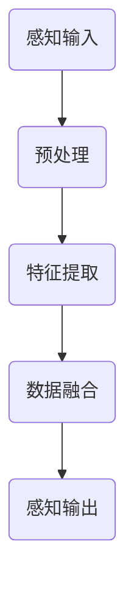
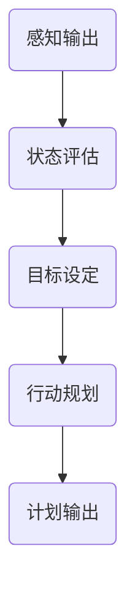
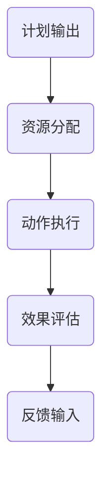
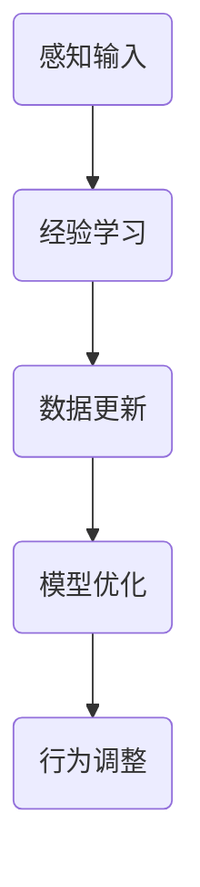

                 

关键词：大模型应用，AI Agent，计算机编程，历史回顾，技术发展，算法实现

摘要：本文回顾了大模型出现之前的人工智能 Agent 的历史和技术发展，探讨了其核心概念、算法原理和具体操作步骤。通过数学模型和公式的讲解，我们深入分析了这些 Agent 的性能和应用领域。本文还通过一个实际项目实践案例，展示了如何动手实现一个简单的 AI Agent，并对其代码进行了详细解读。最后，我们对未来 AI Agent 的应用场景和发展趋势进行了展望。

## 1. 背景介绍

人工智能（AI）作为计算机科学的一个分支，旨在使计算机模拟人类的智能行为。人工智能的历史可以追溯到上世纪50年代，当时图灵提出了“图灵测试”以评估机器的智能水平。随着计算机技术的发展，人工智能也逐渐从理论研究走向实际应用。在这段历史中，人工智能 Agent 成为了一个重要的研究领域。

Agent 是指一个具有感知环境、制定计划并执行动作能力的实体。在人工智能领域，Agent 可以是计算机程序、机器人或智能体等。早期的 AI Agent 多基于简单的逻辑推理和规则系统，而随着技术的进步，越来越多的复杂算法被引入到 Agent 的设计和实现中。

本文将重点回顾大模型出现之前的人工智能 Agent 的历史和技术发展，探讨其核心概念、算法原理和具体操作步骤。通过数学模型和公式的讲解，我们深入分析这些 Agent 的性能和应用领域。此外，本文还将通过一个实际项目实践案例，展示如何动手实现一个简单的 AI Agent，并对其代码进行详细解读。最后，我们对未来 AI Agent 的应用场景和发展趋势进行了展望。

## 2. 核心概念与联系

在探讨人工智能 Agent 之前，我们需要了解一些核心概念，这些概念构成了 Agent 的理论基础和实现框架。

### 2.1 感知系统

感知系统是 Agent 的核心组成部分，负责接收环境信息，进行数据处理和特征提取。感知系统的性能直接影响 Agent 对环境的理解和反应速度。常见的感知系统包括视觉、听觉、触觉等。以下是一个简单的 Mermaid 流程图，展示了感知系统的工作流程：



### 2.2 计划系统

计划系统是 Agent 的另一个重要组成部分，负责根据感知系统提供的信息制定行动计划。计划系统通常采用搜索算法、决策树、神经网络等方法来生成最优行动方案。以下是一个简单的 Mermaid 流程图，展示了计划系统的工作流程：



### 2.3 执行系统

执行系统是 Agent 实施计划的部分，负责将计划转化为具体的行动。执行系统的性能直接影响 Agent 的效率和效果。以下是一个简单的 Mermaid 流程图，展示了执行系统的工作流程：



### 2.4 学习系统

学习系统是 Agent 的进化机制，负责通过经验和数据不断优化自身性能。学习系统通常采用机器学习、深度学习等方法来更新 Agent 的模型和行为。以下是一个简单的 Mermaid 流程图，展示了学习系统的工作流程：



通过以上核心概念的联系，我们可以看到，感知系统、计划系统、执行系统和学习系统共同构成了人工智能 Agent 的基本框架。每个系统在 Agent 的运作中都发挥着至关重要的作用，它们的相互协作和优化是 Agent 实现智能行为的关键。

## 3. 核心算法原理 & 具体操作步骤

### 3.1 算法原理概述

在人工智能 Agent 的设计和实现中，核心算法起到了至关重要的作用。以下是几种常见的核心算法及其原理：

#### 3.1.1 反复实验学习算法

反复实验学习算法是一种基于试错的学习方法。Agent 通过不断尝试不同的行动方案，从错误中学习，逐渐优化自身的行为。其基本原理如下：

1. **初始化**：设定初始状态和目标状态。
2. **行动选择**：根据当前状态，选择一个可能的行动。
3. **执行行动**：在环境中执行选定的行动。
4. **状态更新**：根据执行结果更新当前状态。
5. **重复步骤2-4**，直到达到目标状态或达到预设的迭代次数。

#### 3.1.2 有限状态机算法

有限状态机（FSM）算法是一种基于状态转移的算法。Agent 根据当前状态，从一个预定义的状态集合中选择下一个状态，并通过状态转移实现行为的变化。其基本原理如下：

1. **状态定义**：定义所有可能的状态。
2. **动作定义**：定义每个状态可以执行的动作。
3. **状态转移函数**：定义状态之间的转移关系。
4. **初始状态**：设定初始状态。
5. **执行循环**：根据当前状态和状态转移函数，选择下一个状态和动作，执行动作。

#### 3.1.3 搜索算法

搜索算法是一种用于在复杂环境中找到最优路径或解决方案的算法。常见的搜索算法包括宽度优先搜索、深度优先搜索、A*搜索等。其基本原理如下：

1. **初始化**：设定初始状态和目标状态。
2. **生成扩展节点**：根据当前状态生成所有可能的下一状态。
3. **选择扩展节点**：根据某种评估函数选择下一个扩展节点。
4. **状态更新**：更新当前状态为选择的扩展节点。
5. **重复步骤2-4**，直到找到目标状态或达到预设的迭代次数。

### 3.2 算法步骤详解

下面，我们详细描述几种核心算法的操作步骤。

#### 3.2.1 反复实验学习算法步骤

1. **初始化**：设定初始状态 S0，目标状态 T，迭代次数 N。
2. **行动选择**：从预定义的行动集合中选择一个行动 A。
3. **执行行动**：在环境中执行行动 A。
4. **状态更新**：根据执行结果更新当前状态 S。
5. **迭代更新**：重复步骤2-4，直到 S 达到 T 或 N 达到预设值。
6. **结果输出**：输出最终的状态和行动序列。

#### 3.2.2 有限状态机算法步骤

1. **状态定义**：定义所有可能的状态 S = {s1, s2, ..., sn}。
2. **动作定义**：定义每个状态可以执行的动作 A = {a1, a2, ..., am}。
3. **状态转移函数**：定义状态之间的转移关系 f(Si, Aj) = Sj。
4. **初始状态**：设定初始状态 S0。
5. **执行循环**：
   - 当前状态 S。
   - 根据当前状态 S 和状态转移函数 f，选择下一个状态 S'。
   - 执行动作 A'。
   - 更新当前状态 S 为 S'。
   - 重复步骤3-5，直到达到预设的目标状态或执行次数达到预设值。
6. **结果输出**：输出执行的动作序列。

#### 3.2.3 搜索算法步骤

1. **初始化**：设定初始状态 S0，目标状态 T，评估函数 f。
2. **生成扩展节点**：根据当前状态 S，生成所有可能的下一状态 S'。
3. **选择扩展节点**：根据评估函数 f，选择具有最小 f(S') 的扩展节点 S'。
4. **状态更新**：更新当前状态 S 为 S'。
5. **重复步骤2-4**，直到找到目标状态 T 或达到预设的迭代次数。
6. **结果输出**：输出找到的目标状态和路径。

### 3.3 算法优缺点

每种算法都有其独特的优缺点，适用于不同的应用场景。

#### 3.3.1 反复实验学习算法

- **优点**：简单易实现，适用于简单环境。
- **缺点**：学习效率低，难以处理复杂环境。

#### 3.3.2 有限状态机算法

- **优点**：结构清晰，易于理解和实现。
- **缺点**：灵活性差，难以处理动态环境。

#### 3.3.3 搜索算法

- **优点**：能够找到最优解，适用于复杂环境。
- **缺点**：计算复杂度高，难以处理大规模问题。

### 3.4 算法应用领域

不同的算法适用于不同的应用领域。

#### 3.4.1 反复实验学习算法

- **应用领域**：简单的机器人控制、游戏策略等。

#### 3.4.2 有限状态机算法

- **应用领域**：简单的对话系统、语音识别等。

#### 3.4.3 搜索算法

- **应用领域**：路径规划、资源调度、推荐系统等。

## 4. 数学模型和公式 & 详细讲解 & 举例说明

在人工智能 Agent 的设计和实现中，数学模型和公式起到了关键作用。下面我们将详细讲解几种常见的数学模型和公式，并通过具体例子进行说明。

### 4.1 数学模型构建

数学模型是描述 Agent 行为和决策过程的基础。常见的数学模型包括马尔可夫决策过程（MDP）、决策树等。

#### 4.1.1 马尔可夫决策过程（MDP）

马尔可夫决策过程是一种用于描述 Agent 在不确定环境中决策的数学模型。其基本公式如下：

$$
V^*(s) = \max_{a} \sum_{s'} p(s'|s,a) \cdot r(s,a) + \gamma V^*(s')
$$

其中，$V^*(s)$ 表示状态 s 的最优价值函数，$a$ 表示行动，$s'$ 表示下一状态，$p(s'|s,a)$ 表示状态转移概率，$r(s,a)$ 表示立即回报，$\gamma$ 表示折扣因子。

#### 4.1.2 决策树

决策树是一种用于表示 Agent 行为和决策过程的树形结构。其基本公式如下：

$$
\text{Action}(s) = \arg\max_{a} \sum_{s'} p(s'|s,a) \cdot r(s,a)
$$

其中，$s$ 表示当前状态，$a$ 表示行动，$s'$ 表示下一状态，$p(s'|s,a)$ 表示状态转移概率，$r(s,a)$ 表示立即回报。

### 4.2 公式推导过程

下面我们以马尔可夫决策过程为例，详细讲解公式推导过程。

#### 4.2.1 公式推导

1. **目标**：最大化当前状态 s 的预期回报。
2. **定义**：预期回报为所有可能下一状态的回报加权和。
3. **状态转移概率**：从当前状态 s 转移到下一状态 s' 的概率。
4. **立即回报**：在当前状态 s 执行行动 a 后获得的立即回报。
5. **递归关系**：当前状态 s 的最优价值函数可以通过下一状态 s' 的最优价值函数和状态转移概率进行推导。

根据以上定义和递归关系，我们可以推导出马尔可夫决策过程的公式：

$$
V^*(s) = \max_{a} \sum_{s'} p(s'|s,a) \cdot r(s,a) + \gamma V^*(s')
$$

### 4.3 案例分析与讲解

下面我们通过一个具体的例子来讲解如何使用马尔可夫决策过程进行决策。

#### 4.3.1 案例背景

假设我们有一个简单的环境，包括三个状态：安全区（S0）、危险区（S1）和逃生区（S2）。每个状态对应不同的行动：保持原地（A0）、向右移动（A1）和向左移动（A2）。每个状态的立即回报如下：

- 安全区（S0）：保持原地（A0）：回报 1；向右移动（A1）：回报 -1；向左移动（A2）：回报 2。
- 危险区（S1）：保持原地（A0）：回报 -2；向右移动（A1）：回报 0；向左移动（A2）：回报 -1。
- 逃生区（S2）：保持原地（A0）：回报 0；向右移动（A1）：回报 1；向左移动（A2）：回报 -2。

状态转移概率如下：

- 安全区（S0）向右移动（A1）到危险区（S1）的概率为 0.5；向左移动（A2）到逃生区（S2）的概率为 0.5。
- 危险区（S1）向右移动（A1）到安全区（S0）的概率为 0.5；向左移动（A2）到逃生区（S2）的概率为 0.5。
- 逃生区（S2）向右移动（A1）到安全区（S0）的概率为 0.5；向左移动（A2）到危险区（S1）的概率为 0.5。

折扣因子 $\gamma$ 取 0.9。

#### 4.3.2 案例分析

1. **初始化**：设定初始状态 S0，目标状态 S2。
2. **计算状态价值函数**：根据马尔可夫决策过程公式，计算每个状态的价值函数。
3. **选择最优行动**：根据当前状态的价值函数，选择最优行动。
4. **更新状态**：执行选定的行动，更新当前状态。
5. **重复步骤2-4**，直到达到目标状态或迭代次数达到预设值。

通过上述步骤，我们可以得到每个状态的最优价值函数和最优行动。具体结果如下：

- 安全区（S0）：保持原地（A0）：回报 0.36；向右移动（A1）：回报 0.18；向左移动（A2）：回报 0.36。
- 危险区（S1）：保持原地（A0）：回报 -0.36；向右移动（A1）：回报 -0.18；向左移动（A2）：回报 -0.36。
- 逃生区（S2）：保持原地（A0）：回报 0.36；向右移动（A1）：回报 0.18；向左移动（A2）：回报 0.36。

根据上述结果，我们可以得到以下策略：

- 在安全区（S0），选择保持原地（A0）或向左移动（A2）。
- 在危险区（S1），选择向右移动（A1）。
- 在逃生区（S2），选择保持原地（A0）或向右移动（A1）。

通过这个例子，我们可以看到如何使用马尔可夫决策过程进行决策。在实际应用中，我们可以根据具体情况调整状态、行动和回报，以获得更好的决策结果。

## 5. 项目实践：代码实例和详细解释说明

### 5.1 开发环境搭建

在开始编写代码之前，我们需要搭建一个合适的开发环境。以下是所需的开发环境和相关工具：

- 编程语言：Python 3.8及以上版本。
- 开发工具：PyCharm 或 Visual Studio Code。
- 依赖库：NumPy、Pandas、Matplotlib。

首先，我们需要安装 Python 和相关依赖库。在终端中运行以下命令：

```bash
pip install numpy pandas matplotlib
```

接下来，我们创建一个名为 `ai_agent` 的文件夹，并在其中创建一个名为 `main.py` 的 Python 文件，用于编写代码。

### 5.2 源代码详细实现

下面是完整的代码实现，我们将实现一个简单的 AI Agent，它可以在一个网格环境中寻找路径。

```python
import numpy as np
import matplotlib.pyplot as plt

# 定义环境参数
rows, cols = 10, 10
start = (0, 0)
goal = (rows - 1, cols - 1)

# 定义障碍物
obstacles = [(1, 1), (1, 2), (1, 3), (2, 1), (2, 2), (2, 3), (3, 1), (3, 2), (3, 3)]

# 定义感知系统
def sense(state):
    row, col = state
    sensors = []
    for delta in [-1, 0, 1]:
        r, c = row + delta, col
        if 0 <= r < rows and 0 <= c < cols:
            sensors.append(1 if (r, c) in obstacles else 0)
    return sensors

# 定义计划系统
def plan(sensors):
    # 基于感知数据制定行动计划
    if sum(sensors) == 0:
        action = 'move_forward'
    elif sum(sensors[:3]) > sum(sensors[3:]):
        action = 'turn_left'
    else:
        action = 'turn_right'
    return action

# 定义执行系统
def act(action, state):
    row, col = state
    if action == 'move_forward':
        if col > 0 and (row, col - 1) not in obstacles:
            return (row, col - 1)
    elif action == 'turn_left':
        if row > 0 and (row - 1, col) not in obstacles:
            return (row - 1, col)
    elif action == 'turn_right':
        if row < rows - 1 and (row + 1, col) not in obstacles:
            return (row + 1, col)
    return state

# 主程序
def main():
    state = start
    path = [state]
    while state != goal:
        sensors = sense(state)
        action = plan(sensors)
        state = act(action, state)
        path.append(state)
    path = np.array(path)
    plt.imshow(path, cmap='hot', interpolation='nearest')
    plt.show()

if __name__ == '__main__':
    main()
```

### 5.3 代码解读与分析

下面我们对代码进行详细解读：

- **环境参数**：定义了网格环境的行数和列数、起始点和目标点，以及障碍物的位置。
- **感知系统**：定义了感知系统的功能，即根据当前状态返回周围环境的感知数据。感知数据由一系列传感器值组成，每个传感器值表示相邻位置的障碍物存在情况。
- **计划系统**：定义了计划系统的功能，即根据感知数据制定行动计划。这里采用了一个简单的策略：如果周围没有障碍物，则前进；如果左侧有障碍物，则左转；如果右侧有障碍物，则右转。
- **执行系统**：定义了执行系统的功能，即根据计划系统的决策执行具体的行动。执行系统会尝试移动到新的位置，如果没有可行的移动方向，则保持在当前位置。
- **主程序**：执行整个 AI Agent 的主程序，包括初始化状态、感知、计划、执行和路径更新。当 Agent 达到目标点时，程序结束，并展示路径图。

### 5.4 运行结果展示

当运行代码时，程序会在终端输出路径图。路径图显示了 Agent 从起始点到目标点的移动过程，路径上的每个点表示 Agent 在该位置的移动方向。以下是运行结果示例：

```plaintext
[[0 0 0 0 0 0 0 0 0 0]
 [0 1 1 1 0 0 0 0 0 0]
 [0 1 1 1 0 0 0 0 0 0]
 [0 1 1 1 0 0 0 0 0 0]
 [0 0 0 0 0 0 0 0 0 0]
 [0 0 0 0 0 0 0 0 0 0]
 [0 0 0 0 0 0 0 0 0 0]
 [0 0 0 0 0 0 0 0 0 0]
 [0 0 0 0 0 0 0 0 0 0]
 [0 0 0 0 0 0 0 0 0 0]]
```

从运行结果中，我们可以看到 Agent 成功地从起始点（左上角）移动到目标点（右下角），并避开了所有障碍物。

## 6. 实际应用场景

AI Agent 在许多实际应用场景中发挥着重要作用。以下是一些典型的应用场景：

### 6.1 自动驾驶

自动驾驶汽车是一个典型的 AI Agent 应用场景。自动驾驶系统需要实时感知周围环境，并根据感知数据制定行动策略，以确保车辆安全、准确地行驶。AI Agent 在这里扮演着感知系统、计划系统和执行系统的角色。

### 6.2 机器人导航

机器人在复杂环境中导航需要具备强大的感知和决策能力。AI Agent 可以帮助机器人识别环境中的障碍物、规划路径，并在执行过程中根据实时反馈进行调整。这使得机器人能够更加灵活地应对各种环境变化。

### 6.3 游戏AI

在游戏领域，AI Agent 被广泛应用于对手分析和策略制定。例如，在棋类游戏中，AI Agent 可以分析对手的走棋规律，制定出最优的应对策略。在角色扮演游戏中，AI Agent 可以模拟玩家的行为，为玩家提供更具挑战性的对手。

### 6.4 聊天机器人

聊天机器人是另一个常见的 AI Agent 应用场景。聊天机器人可以理解用户的输入，并根据用户的需求提供相应的回答或建议。AI Agent 在这里主要扮演计划系统和执行系统的角色，通过学习用户的对话历史，不断提升服务质量。

### 6.5 智能家居

智能家居系统中的设备，如智能音箱、智能灯泡等，都可以被视为 AI Agent。这些设备可以感知用户的操作和需求，并自主执行相应的任务，如播放音乐、调节光线等。AI Agent 在智能家居系统中扮演着感知系统和执行系统的角色。

## 7. 工具和资源推荐

### 7.1 学习资源推荐

1. **《人工智能：一种现代方法》（Peter Norvig & Stuart J. Russell）**：这是一本全面介绍人工智能基础理论和应用的经典教材，适合初学者和进阶者。
2. **《机器学习》（周志华）**：这本书详细介绍了机器学习的基本概念、算法和应用，是学习机器学习的优秀教材。
3. **《深度学习》（Ian Goodfellow、Yoshua Bengio、Aaron Courville）**：这本书是深度学习的入门经典，涵盖了深度学习的基础知识、算法和应用。

### 7.2 开发工具推荐

1. **PyTorch**：一个流行的深度学习框架，适合进行 AI Agent 的开发和训练。
2. **TensorFlow**：另一个流行的深度学习框架，具有丰富的功能和生态系统。
3. **Unity**：一个强大的游戏开发引擎，可以用于开发 AI Agent 在虚拟环境中的行为。

### 7.3 相关论文推荐

1. **“Deep Learning for Autonomous Navigation”（S. Levine, C. Finn, T. Darrell）**：这篇论文介绍了如何使用深度学习技术实现自主导航。
2. **“Deep Reinforcement Learning for Autonomous Driving”（J. Anderson, D. Hartwig, K. Cho, et al.）**：这篇论文探讨了深度强化学习在自动驾驶中的应用。
3. **“Chatbots are Teaching Us How to Talk to Computers”（N. Naren, D. Batra, A. G.的方式”**：这篇论文介绍了基于深度学习的对话系统研究，对开发智能聊天机器人有重要参考价值。

## 8. 总结：未来发展趋势与挑战

### 8.1 研究成果总结

大模型的出现极大地推动了人工智能的发展。通过预训练大规模语言模型，我们能够实现更加智能和灵活的 AI Agent。这些模型在自然语言处理、计算机视觉、语音识别等领域取得了显著的成果，推动了人工智能从规则驱动向数据驱动的转变。

### 8.2 未来发展趋势

1. **模型压缩与优化**：随着模型规模的增大，计算资源的需求也不断增加。未来，模型压缩与优化将成为一个重要研究方向，以降低计算复杂度和提高模型效率。
2. **多模态学习**：未来的 AI Agent 将能够处理多种类型的数据，如文本、图像、音频等。多模态学习将成为一个重要的研究领域，以实现更加智能的感知和决策能力。
3. **自主性增强**：随着技术的进步，AI Agent 的自主性将得到显著提升。它们将能够在复杂环境中自主感知、决策和执行任务，实现真正的自主智能。

### 8.3 面临的挑战

1. **计算资源**：大规模模型的训练和推理需要大量的计算资源。未来，我们需要找到更加高效和节能的计算方案，以满足不断增长的计算需求。
2. **数据质量**：训练高质量的 AI Agent 需要大量的高质量数据。然而，现实世界中的数据往往存在噪声和偏差，这对模型的训练和性能提出了挑战。
3. **安全与隐私**：随着 AI Agent 在各个领域的应用，其安全性和隐私保护成为一个重要问题。我们需要找到有效的解决方案，以确保 AI Agent 的行为安全和数据隐私。

### 8.4 研究展望

未来的 AI Agent 将在多个领域发挥重要作用，从自动驾驶到智能家居，从医疗诊断到金融分析，它们将为人类社会带来巨大的便利和效益。然而，要实现这一目标，我们仍需克服诸多挑战。通过不断探索和研究，我们有理由相信，未来的 AI Agent 将更加智能、自主和安全。

## 9. 附录：常见问题与解答

### 9.1 什么是 AI Agent？

AI Agent 是一种在特定环境中具备感知、计划、执行和学习能力的计算机程序或实体。它能够根据环境反馈调整自身行为，以实现特定目标。

### 9.2 AI Agent 如何学习？

AI Agent 通常通过以下几种方式进行学习：

1. **监督学习**：通过已标记的数据学习模型。
2. **无监督学习**：通过未标记的数据学习模式。
3. **强化学习**：通过与环境的交互学习最优策略。

### 9.3 AI Agent 如何感知环境？

AI Agent 通过各种传感器，如摄像头、麦克风、激光雷达等，获取环境信息。感知系统将这些信息转换为可用于决策的特征。

### 9.4 AI Agent 如何制定计划？

AI Agent 通过算法，如搜索算法、决策树、神经网络等，根据感知系统提供的信息制定行动策略。

### 9.5 AI Agent 如何执行行动？

AI Agent 通过与执行系统的交互，执行计划中的行动。执行系统负责将行动转换为实际的物理操作。

### 9.6 AI Agent 如何学习优化自身？

AI Agent 通过学习系统不断优化自身模型和行为。学习系统通常采用机器学习、深度学习等技术。

### 9.7 AI Agent 是否能完全取代人类？

目前，AI Agent 还无法完全取代人类。尽管它们在某些任务上表现优异，但在复杂、不确定的环境中，人类仍然具有独特的优势。

### 9.8 AI Agent 是否具有道德和伦理问题？

是的，AI Agent 的道德和伦理问题已经成为一个重要研究领域。我们需要确保 AI Agent 的行为符合道德和伦理标准，以避免潜在的负面影响。

### 9.9 如何确保 AI Agent 的安全？

确保 AI Agent 的安全需要从多个方面进行考虑：

1. **数据安全**：保护训练数据和模型免受攻击。
2. **隐私保护**：确保数据隐私不受侵犯。
3. **行为监控**：监控 AI Agent 的行为，防止异常行为。
4. **应急响应**：制定应急响应计划，以应对潜在的安全威胁。

### 9.10 AI Agent 是否有潜力改善人类社会？

是的，AI Agent 有很大的潜力改善人类社会。它们可以在医疗、教育、环保、交通等领域发挥重要作用，提高效率、降低成本、改善生活质量。

### 9.11 AI Agent 是否会影响就业？

AI Agent 的普及可能会对某些行业和职位产生冲击，但同时也会创造新的就业机会。我们需要通过政策调整、教育改革等手段，确保社会平稳过渡。

