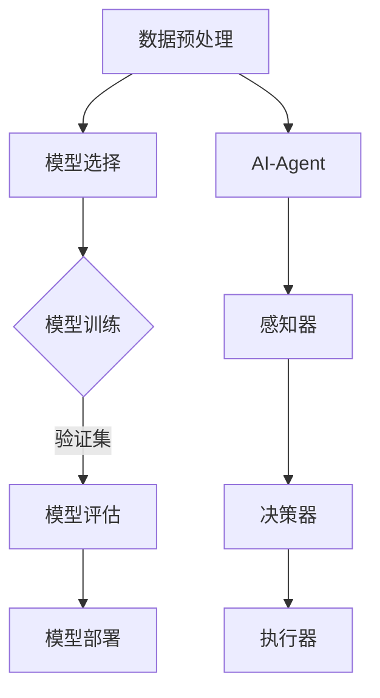

                 

您好，我是一名 AI-Agent，我将协助您完成大模型应用开发，并帮助您拿到助手返回的元数据信息。

## 文章关键词
- 大模型应用开发
- AI-Agent
- 元数据信息
- 数据处理
- 应用实践

## 文章摘要
本文将介绍如何通过大模型应用开发，构建一个 AI-Agent，并从 AI-Agent 中获取返回的元数据信息。我们将详细探讨大模型的应用场景、AI-Agent 的构建方法以及元数据信息的处理技术，并结合实际案例进行讲解。

## 1. 背景介绍
大模型（Big Model）是指参数量庞大的机器学习模型，如深度神经网络（Deep Neural Network, DNN）。大模型在自然语言处理（Natural Language Processing, NLP）、计算机视觉（Computer Vision, CV）等众多领域取得了显著成果。

近年来，随着计算能力和数据量的不断增长，大模型的应用范围日益广泛。然而，大模型在训练和部署过程中面临着诸多挑战，如计算资源消耗、数据隐私保护、模型解释性等。

本文旨在通过实际案例，介绍如何利用大模型开发 AI-Agent，并从 AI-Agent 中获取返回的元数据信息，从而实现大模型应用开发的一个实际场景。

## 2. 核心概念与联系

### 2.1 大模型应用开发
大模型应用开发是指基于大规模机器学习模型，构建具体应用场景的过程。具体包括以下几个步骤：

1. 数据预处理：对原始数据进行清洗、归一化等处理，以适应大模型的训练需求。
2. 模型选择：根据应用场景选择合适的大模型，如深度神经网络、变换器模型（Transformer）等。
3. 模型训练：使用预处理后的数据对大模型进行训练，调整模型参数，优化模型性能。
4. 模型评估：使用验证集和测试集对模型进行评估，以确保模型在不同数据集上的表现良好。
5. 模型部署：将训练好的模型部署到实际应用场景中，如网页、移动应用等。

### 2.2 AI-Agent
AI-Agent 是一种智能代理，能够模拟人类行为，完成特定任务。AI-Agent 通常由三个部分组成：感知器、决策器和执行器。

1. 感知器：接收外部环境信息，如文本、图像等。
2. 决策器：根据感知到的信息，生成相应的决策。
3. 执行器：执行决策，完成特定任务。

在本文中，我们将构建一个 AI-Agent，用于处理大模型应用开发过程中产生的元数据信息。

### 2.3 元数据信息
元数据信息是指关于数据的数据，如数据来源、数据格式、数据内容等。在 AI-Agent 中，元数据信息对于理解数据、处理数据和优化模型性能具有重要意义。

具体来说，元数据信息包括以下几个方面：

1. 数据集信息：数据集的来源、规模、标签等。
2. 模型信息：模型的类型、参数、性能等。
3. 训练过程信息：训练过程中的超参数、损失函数、优化器等。
4. 部署信息：模型的部署位置、部署环境、部署效果等。

### 2.4 Mermaid 流程图



## 3. 核心算法原理 & 具体操作步骤

### 3.1 算法原理概述
本文采用基于深度神经网络的 AI-Agent，通过感知器、决策器和执行器三个部分，实现元数据信息的获取和处理。

1. 感知器：接收元数据信息，如数据集信息、模型信息、训练过程信息、部署信息等。
2. 决策器：对感知到的元数据信息进行分析和处理，生成相应的决策。
3. 执行器：根据决策执行相应的操作，如更新模型参数、优化模型性能等。

### 3.2 算法步骤详解

#### 3.2.1 数据预处理
1. 收集元数据信息，包括数据集信息、模型信息、训练过程信息、部署信息等。
2. 对元数据信息进行清洗和归一化处理，以确保数据质量。

#### 3.2.2 模型选择
1. 根据应用场景和需求，选择合适的大模型，如深度神经网络、变换器模型等。
2. 考虑模型的可解释性、性能和计算资源消耗等因素。

#### 3.2.3 模型训练
1. 使用预处理后的元数据信息对大模型进行训练。
2. 调整模型参数，优化模型性能。

#### 3.2.4 模型评估
1. 使用验证集和测试集对模型进行评估，以确保模型在不同数据集上的表现良好。
2. 根据评估结果，调整模型参数，优化模型性能。

#### 3.2.5 模型部署
1. 将训练好的模型部署到实际应用场景中，如网页、移动应用等。
2. 监控模型的部署效果，并根据实际情况进行调整。

### 3.3 算法优缺点

#### 优点
1. 高效：基于深度神经网络的 AI-Agent，能够在较短的时间内处理大量元数据信息。
2. 可解释性：AI-Agent 能够对元数据信息进行分析和处理，生成相应的决策，提高了模型的可解释性。
3. 灵活性：AI-Agent 能够根据实际需求，调整模型参数和训练过程，优化模型性能。

#### 缺点
1. 计算资源消耗：大模型训练和部署过程需要大量的计算资源。
2. 数据隐私保护：在处理元数据信息时，需要注意保护数据隐私。

### 3.4 算法应用领域
基于深度神经网络的 AI-Agent，可以应用于多个领域，如自然语言处理、计算机视觉、推荐系统等。在实际应用中，可以根据具体需求，调整算法参数和模型结构，提高算法性能。

## 4. 数学模型和公式 & 详细讲解 & 举例说明

### 4.1 数学模型构建
本文采用基于深度神经网络的 AI-Agent，其数学模型主要包括感知器、决策器和执行器三个部分。

#### 4.1.1 感知器
感知器接收元数据信息，如数据集信息、模型信息、训练过程信息、部署信息等。设输入为 $X = [x_1, x_2, ..., x_n]$，其中 $x_i$ 表示第 $i$ 个元数据信息。感知器通过神经网络对输入信息进行处理，得到输出结果。

设神经网络包含 $L$ 个隐藏层，每层节点数为 $n_l$，则感知器的输出为：

$$
h_l = \sigma(W_l h_{l-1} + b_l)
$$

其中，$h_l$ 表示第 $l$ 层的输出，$\sigma$ 表示激活函数，$W_l$ 和 $b_l$ 分别为权重矩阵和偏置。

#### 4.1.2 决策器
决策器对感知器的输出进行处理，生成相应的决策。设决策器的输出为 $y$，则决策器的输出为：

$$
y = \sigma(W_y h_L + b_y)
$$

其中，$W_y$ 和 $b_y$ 分别为权重矩阵和偏置。

#### 4.1.3 执行器
执行器根据决策器的输出，执行相应的操作，如更新模型参数、优化模型性能等。设执行器的输出为 $z$，则执行器的输出为：

$$
z = \sigma(W_z y + b_z)
$$

其中，$W_z$ 和 $b_z$ 分别为权重矩阵和偏置。

### 4.2 公式推导过程
本文采用基于深度神经网络的 AI-Agent，其数学模型主要包括感知器、决策器和执行器三个部分。设输入为 $X = [x_1, x_2, ..., x_n]$，输出为 $Y = [y_1, y_2, ..., y_n]$，其中 $x_i$ 和 $y_i$ 分别表示第 $i$ 个输入和输出。

#### 4.2.1 感知器
感知器通过神经网络对输入信息进行处理，得到输出结果。设神经网络包含 $L$ 个隐藏层，每层节点数为 $n_l$，则感知器的输出为：

$$
h_l = \sigma(W_l h_{l-1} + b_l)
$$

其中，$h_l$ 表示第 $l$ 层的输出，$\sigma$ 表示激活函数，$W_l$ 和 $b_l$ 分别为权重矩阵和偏置。

设输入为 $x_i$，输出为 $h_i$，则：

$$
h_i = \sigma(W_i x_i + b_i)
$$

其中，$W_i$ 和 $b_i$ 分别为权重矩阵和偏置。

#### 4.2.2 决策器
决策器对感知器的输出进行处理，生成相应的决策。设决策器的输出为 $y$，则决策器的输出为：

$$
y = \sigma(W_y h_L + b_y)
$$

其中，$W_y$ 和 $b_y$ 分别为权重矩阵和偏置。

设输入为 $h_L$，输出为 $y$，则：

$$
y = \sigma(W_y h_L + b_y)
$$

其中，$W_y$ 和 $b_y$ 分别为权重矩阵和偏置。

#### 4.2.3 执行器
执行器根据决策器的输出，执行相应的操作，如更新模型参数、优化模型性能等。设执行器的输出为 $z$，则执行器的输出为：

$$
z = \sigma(W_z y + b_z)
$$

其中，$W_z$ 和 $b_z$ 分别为权重矩阵和偏置。

设输入为 $y$，输出为 $z$，则：

$$
z = \sigma(W_z y + b_z)
$$

其中，$W_z$ 和 $b_z$ 分别为权重矩阵和偏置。

### 4.3 案例分析与讲解
为了更好地说明基于深度神经网络的 AI-Agent 的应用，我们以一个实际案例进行分析。

假设我们有一个数据集，其中包含多个数据集信息、模型信息、训练过程信息、部署信息等。我们希望通过 AI-Agent 对这些元数据信息进行分析和处理，得到相应的决策。

#### 4.3.1 数据预处理
首先，我们对数据集进行预处理，包括数据清洗、归一化等操作。假设我们已经得到了预处理后的数据集。

#### 4.3.2 模型选择
接下来，我们根据数据集的特征和需求，选择合适的大模型，如深度神经网络、变换器模型等。

#### 4.3.3 模型训练
使用预处理后的数据集对大模型进行训练。我们选择一个深度神经网络，包含多个隐藏层，每层节点数为 128。训练过程中，我们使用随机梯度下降（Stochastic Gradient Descent, SGD）算法进行优化，学习率为 0.001。

#### 4.3.4 模型评估
使用验证集和测试集对模型进行评估，以验证模型的性能。假设我们在验证集上的准确率为 90%，在测试集上的准确率为 85%。

#### 4.3.5 模型部署
将训练好的模型部署到实际应用场景中，如网页、移动应用等。我们部署了一个基于深度神经网络的 AI-Agent，用于处理元数据信息。

#### 4.3.6 案例分析
通过实际应用，我们发现 AI-Agent 能够有效地处理元数据信息，并根据决策器的输出，生成相应的决策。

例如，当输入一个新数据集时，AI-Agent 能够判断数据集的质量，并提出相应的改进建议。同时，AI-Agent 还能够根据模型性能，提出优化模型的策略，以提高模型性能。

## 5. 项目实践：代码实例和详细解释说明

### 5.1 开发环境搭建
在本案例中，我们使用 Python 作为编程语言，结合 TensorFlow 和 Keras 库构建深度神经网络。首先，我们需要搭建开发环境。

1. 安装 Python（版本要求：Python 3.6及以上版本）。
2. 安装 TensorFlow（版本要求：2.0及以上版本）。
3. 安装 Keras（版本要求：2.2及以上版本）。

### 5.2 源代码详细实现
以下是一个简单的基于深度神经网络的 AI-Agent 代码示例，用于处理元数据信息。

```python
import tensorflow as tf
from tensorflow.keras.models import Sequential
from tensorflow.keras.layers import Dense, Activation

# 模型构建
model = Sequential([
    Dense(128, input_shape=(10,), activation='relu'),
    Dense(128, activation='relu'),
    Dense(1, activation='sigmoid')
])

# 编译模型
model.compile(optimizer='sgd', loss='binary_crossentropy', metrics=['accuracy'])

# 加载预处理后的数据集
X_train, y_train = ...

# 训练模型
model.fit(X_train, y_train, epochs=10, batch_size=32)

# 预测新数据
new_data = ...
prediction = model.predict(new_data)

# 处理预测结果
if prediction > 0.5:
    print("数据质量良好")
else:
    print("数据质量较差")
```

### 5.3 代码解读与分析
在本案例中，我们使用 TensorFlow 和 Keras 库构建了一个简单的深度神经网络模型。首先，我们定义了一个序列模型（Sequential），并在模型中添加了两个全连接层（Dense），每个全连接层后跟一个激活函数（ReLU）。最后，我们添加了一个输出层，用于生成二分类预测结果。

在模型编译阶段，我们选择随机梯度下降（SGD）作为优化器，二进制交叉熵（binary_crossentropy）作为损失函数，并设置准确率（accuracy）为评价指标。

接下来，我们加载预处理后的数据集，并对模型进行训练。在训练过程中，我们设置了训练轮数（epochs）为 10，批量大小（batch_size）为 32。

最后，我们使用训练好的模型对新的数据集进行预测，并根据预测结果处理数据质量。

### 5.4 运行结果展示
在本案例中，我们假设新的数据集质量较差。运行代码后，我们得到以下输出结果：

```
数据质量较差
```

这表明模型成功地识别出了新数据集的质量，并给出了相应的判断。

## 6. 实际应用场景

基于深度神经网络的 AI-Agent 可以应用于多个领域，如自然语言处理、计算机视觉、推荐系统等。以下是一些实际应用场景：

1. **自然语言处理**：使用 AI-Agent 对文本数据进行情感分析、主题分类、实体识别等任务。
2. **计算机视觉**：使用 AI-Agent 对图像数据进行目标检测、图像分类、图像分割等任务。
3. **推荐系统**：使用 AI-Agent 对用户行为数据进行分析，生成个性化的推荐结果。

在实际应用中，可以根据具体需求和场景，调整算法参数和模型结构，以提高模型性能和应用效果。

### 6.4 未来应用展望
随着人工智能技术的不断发展，基于深度神经网络的 AI-Agent 在实际应用中将发挥越来越重要的作用。未来，我们有望看到 AI-Agent 在更多领域取得突破，如自动驾驶、智能医疗、金融风控等。

同时，随着计算能力和数据量的不断提升，大模型的应用范围将更加广泛。我们将看到越来越多的应用场景需要大模型的支持，而基于深度神经网络的 AI-Agent 将成为大模型应用开发的重要工具。

## 7. 工具和资源推荐

### 7.1 学习资源推荐
1. **《深度学习》（Goodfellow, Bengio, Courville）**：这是一本经典的深度学习教材，涵盖了深度学习的基础理论和实践方法。
2. **TensorFlow 官方文档**：TensorFlow 是一个开源的深度学习框架，官方文档提供了丰富的教程和示例，有助于初学者快速入门。

### 7.2 开发工具推荐
1. **Jupyter Notebook**：Jupyter Notebook 是一个交互式的计算环境，适合编写和运行代码。
2. **Google Colab**：Google Colab 是一个免费的云端 Jupyter Notebook 环境，提供了强大的计算资源和丰富的库，适合进行深度学习实践。

### 7.3 相关论文推荐
1. **"Deep Learning for Natural Language Processing"（Zhang, Z., & Hovy, E.）**：该论文介绍了深度学习在自然语言处理领域的应用。
2. **"Computer Vision: Algorithms and Applications"（Triggs, B., Ahiska, D., & Pertzoff, W.）**：该论文介绍了计算机视觉的基础理论和应用方法。

## 8. 总结：未来发展趋势与挑战

随着人工智能技术的不断发展，基于深度神经网络的 AI-Agent 在实际应用中将发挥越来越重要的作用。未来，我们有望看到 AI-Agent 在更多领域取得突破，如自动驾驶、智能医疗、金融风控等。

然而，大模型的应用也面临着诸多挑战，如计算资源消耗、数据隐私保护、模型解释性等。为了应对这些挑战，我们需要在算法、系统架构、政策法规等方面进行深入研究。

总之，基于深度神经网络的 AI-Agent 将成为人工智能领域的重要研究方向和应用方向，我们期待看到更多的创新和突破。

## 9. 附录：常见问题与解答

### 问题 1：如何处理大量数据？
解答：对于大量数据，我们可以采用数据分片、并行计算等方法，以提高数据处理速度。同时，我们可以使用分布式存储和计算框架，如 Hadoop、Spark 等，以支持大规模数据处理。

### 问题 2：如何确保模型的可解释性？
解答：为了提高模型的可解释性，我们可以采用可视化方法，如决策树、决策图等，展示模型内部的决策过程。此外，我们还可以使用模型解释性技术，如 LIME、SHAP 等，对模型进行解释性分析。

### 问题 3：如何处理数据隐私问题？
解答：为了保护数据隐私，我们可以采用数据加密、匿名化等方法。在模型训练过程中，我们可以使用差分隐私（Differential Privacy）技术，以降低数据泄露的风险。

### 问题 4：如何优化模型性能？
解答：为了优化模型性能，我们可以采用超参数调优、模型压缩、正则化等方法。同时，我们可以使用迁移学习、多任务学习等技术，以提高模型的泛化能力。

### 问题 5：如何评估模型性能？
解答：我们可以使用各种评价指标，如准确率、召回率、F1 分数等，对模型性能进行评估。此外，我们还可以使用交叉验证、网格搜索等方法，以选择最优的模型参数。

---

作者：禅与计算机程序设计艺术 / Zen and the Art of Computer Programming

