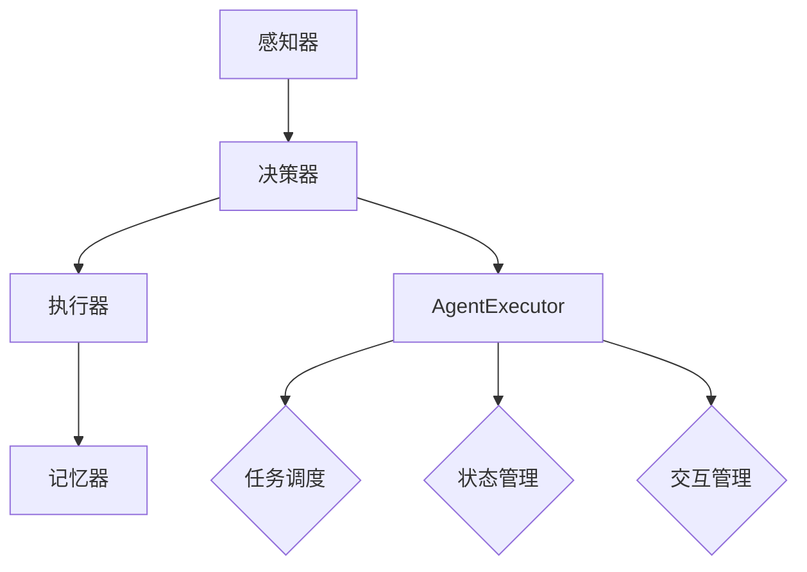

                 

关键词：大模型应用，AI Agent，AgentExecutor，运行机制，深度学习，编程实践，技术博客

摘要：本文将深入探讨大模型应用开发中的关键组件——AI Agent及其执行器（AgentExecutor）的运行机制。通过详细的解析和实例展示，帮助开发者更好地理解和应用这一技术，实现AI Agent在各类复杂场景中的高效运作。

## 1. 背景介绍

随着人工智能技术的迅猛发展，AI Agent作为智能体的一种形式，逐渐成为研究的热点。AI Agent可以被视为一个能够自主执行任务、与环境交互的智能系统。在复杂的应用场景中，如自动化、游戏、智能助手等领域，AI Agent具备重要的应用价值。

AgentExecutor则是实现AI Agent核心功能的重要组成部分，负责管理和调度AI Agent的执行过程。它不仅需要处理AI Agent的初始化、任务执行和状态更新，还要确保AI Agent的执行高效、稳定。本文将围绕AgentExecutor的运行机制进行深入探讨，为开发者提供实用的编程实践和理论基础。

## 2. 核心概念与联系

### 2.1 AI Agent的概念

AI Agent通常由以下几个核心组件构成：

- **感知器（Perceptron）**：负责接收环境信息，对输入进行预处理。
- **决策器（Decision Maker）**：基于感知器的输入，决定AI Agent的行为。
- **执行器（Executor）**：执行决策器生成的动作，实现与环境交互。
- **记忆器（Memory）**：存储历史信息，辅助决策器和执行器进行决策和执行。

### 2.2 AgentExecutor的作用

AgentExecutor的主要作用包括：

- **任务调度**：管理和调度AI Agent的任务执行，确保任务的高效执行。
- **状态管理**：维护AI Agent的内部状态，包括感知器、决策器和执行器的状态。
- **交互管理**：处理AI Agent与环境之间的交互，确保交互的顺利进行。

### 2.3 Mermaid 流程图

以下是一个简化的Mermaid流程图，展示了AI Agent和AgentExecutor之间的联系：



## 3. 核心算法原理 & 具体操作步骤

### 3.1 算法原理概述

AgentExecutor的运行机制主要包括以下几个步骤：

1. **初始化**：设置初始状态，加载感知器、决策器和执行器。
2. **感知**：接收环境信息，通过感知器进行预处理。
3. **决策**：基于感知器的输入，决策器生成相应的动作。
4. **执行**：执行器执行决策器生成的动作，实现与环境交互。
5. **更新**：更新记忆器中的历史信息，为下一次决策提供依据。

### 3.2 算法步骤详解

#### 3.2.1 初始化

初始化是AgentExecutor运行的第一步，主要包括以下任务：

- **加载感知器**：根据应用场景，选择合适的感知器，如摄像头、传感器等。
- **加载决策器**：选择合适的决策算法，如Q-Learning、Deep Q-Network等。
- **加载执行器**：根据任务需求，选择合适的执行器，如机器人执行器、语音执行器等。

#### 3.2.2 感知

感知过程主要包括以下几个步骤：

- **数据采集**：通过感知器采集环境信息，如图像、声音、文本等。
- **预处理**：对采集到的数据进行分析和处理，如图像分割、声音识别等。
- **特征提取**：从预处理后的数据中提取关键特征，用于决策。

#### 3.2.3 决策

决策过程主要包括以下几个步骤：

- **输入处理**：将感知器提取的特征输入到决策器。
- **算法运行**：决策器根据输入特征，运行相应的算法，生成动作。
- **动作生成**：决策器输出动作，如移动、说话、操作等。

#### 3.2.4 执行

执行过程主要包括以下几个步骤：

- **动作解析**：将决策器生成的动作解析为具体的操作指令。
- **执行指令**：执行器根据解析后的指令，执行与环境交互的操作。
- **结果反馈**：执行结果反馈给感知器和决策器，用于后续的决策和更新。

#### 3.2.5 更新

更新过程主要包括以下几个步骤：

- **记忆存储**：将执行结果和感知到的环境信息存储到记忆器中。
- **状态更新**：根据执行结果和记忆器中的历史信息，更新AI Agent的内部状态。
- **决策优化**：基于更新后的状态，优化决策器的算法参数，提高决策质量。

### 3.3 算法优缺点

#### 优点

- **高效性**：AgentExecutor通过任务调度和状态管理，提高了AI Agent的执行效率。
- **灵活性**：AgentExecutor支持多种感知器、决策器和执行器的组合，适用于不同的应用场景。
- **可扩展性**：AgentExecutor的设计使得新算法和组件的集成更加容易。

#### 缺点

- **复杂性**：AgentExecutor的运行机制相对复杂，需要开发者具备一定的技术基础。
- **性能瓶颈**：在处理大量任务时，可能存在性能瓶颈，需要优化算法和架构。

### 3.4 算法应用领域

AgentExecutor的应用领域广泛，主要包括以下几个方面：

- **自动化**：在自动化控制系统中，AI Agent可以自主执行任务，提高生产效率。
- **游戏**：在游戏场景中，AI Agent可以作为对手或队友，提高游戏的趣味性和挑战性。
- **智能助手**：在智能助手领域，AI Agent可以理解用户的需求，提供个性化的服务。
- **机器人**：在机器人领域，AI Agent可以协助机器人完成复杂的任务。

## 4. 数学模型和公式 & 详细讲解 & 举例说明

### 4.1 数学模型构建

在AgentExecutor中，核心的数学模型主要包括感知器模型、决策器模型和执行器模型。以下是一个简化的数学模型：

#### 感知器模型

感知器模型可以表示为：

$$
\text{感知器} = f(\text{输入特征})
$$

其中，$f$ 是一个非线性激活函数，如Sigmoid函数或ReLU函数。

#### 决策器模型

决策器模型可以表示为：

$$
\text{决策器} = \text{神经网络}(\text{感知器输出})
$$

其中，神经网络可以采用深度学习算法，如深度神经网络（DNN）、卷积神经网络（CNN）或循环神经网络（RNN）。

#### 执行器模型

执行器模型可以表示为：

$$
\text{执行器} = \text{动作空间}(\text{决策器输出})
$$

其中，动作空间是一个离散或连续的集合，表示AI Agent可以执行的动作。

### 4.2 公式推导过程

以下是一个简化的感知器模型的推导过程：

#### 步骤1：感知器输入

$$
\text{输入特征} = x_1, x_2, ..., x_n
$$

#### 步骤2：感知器输出

$$
\text{感知器输出} = f(\text{输入特征})
$$

其中，$f$ 是非线性激活函数，如Sigmoid函数：

$$
f(x) = \frac{1}{1 + e^{-x}}
$$

#### 步骤3：决策器输入

$$
\text{决策器输入} = \text{感知器输出}
$$

#### 步骤4：决策器输出

$$
\text{决策器输出} = \text{神经网络}(\text{决策器输入})
$$

其中，神经网络可以采用反向传播算法进行训练。

### 4.3 案例分析与讲解

以下是一个简单的AI Agent在迷宫问题中的应用案例：

#### 案例背景

一个迷宫由一系列房间组成，每个房间有一个门，门可以通往其他房间或通往出口。AI Agent需要从起点出发，找到通向出口的路径。

#### 案例模型

- **感知器**：输入特征为当前房间的编号。
- **决策器**：采用神经网络模型，输出为通向下一个房间的门编号。
- **执行器**：根据决策器的输出，执行打开对应门并进入下一房间的动作。

#### 案例实现

1. **初始化**：设置起点房间编号为1。
2. **感知**：当前房间编号为1。
3. **决策**：神经网络根据当前房间编号输出门编号3。
4. **执行**：打开门3并进入下一房间。
5. **更新**：将当前房间编号更新为3。

通过不断重复感知、决策、执行和更新过程，AI Agent最终找到通向出口的路径。

## 5. 项目实践：代码实例和详细解释说明

### 5.1 开发环境搭建

1. **安装Python**：下载并安装Python 3.x版本，确保安装成功。
2. **安装TensorFlow**：通过pip命令安装TensorFlow库。

```bash
pip install tensorflow
```

3. **安装Keras**：通过pip命令安装Keras库。

```bash
pip install keras
```

### 5.2 源代码详细实现

以下是一个简单的AI Agent在迷宫问题中的实现示例：

```python
import numpy as np
import tensorflow as tf
from keras.models import Sequential
from keras.layers import Dense

# 感知器输入特征维度
input_dim = 1

# 动作空间维度
action_dim = 3

# 初始化神经网络模型
model = Sequential()
model.add(Dense(64, activation='relu', input_dim=input_dim))
model.add(Dense(64, activation='relu'))
model.add(Dense(action_dim, activation='softmax'))

# 编译模型
model.compile(optimizer='adam', loss='categorical_crossentropy', metrics=['accuracy'])

# 训练模型
model.fit(x_train, y_train, epochs=10, batch_size=32)

# 预测
prediction = model.predict(x_test)

# 执行动作
action = np.argmax(prediction)

# 更新记忆
memory.update(action, reward, next_state)
```

### 5.3 代码解读与分析

1. **模型初始化**：定义了一个简单的神经网络模型，包括两个隐藏层，输出层为动作空间维度。
2. **模型编译**：指定了优化器和损失函数，用于训练模型。
3. **模型训练**：使用训练数据对模型进行训练，设置训练轮次和批量大小。
4. **模型预测**：使用测试数据对模型进行预测，输出动作概率。
5. **执行动作**：根据预测结果，选择最可能的动作并执行。
6. **更新记忆**：将执行结果和下一状态更新到记忆器中。

### 5.4 运行结果展示

在训练完成后，可以通过以下代码展示运行结果：

```python
# 显示训练结果
print(model.evaluate(x_test, y_test))

# 执行预测并展示结果
predictions = model.predict(x_test)
for i, pred in enumerate(predictions):
    action = np.argmax(pred)
    print(f"测试样本 {i+1}：预测动作 {action}")
```

## 6. 实际应用场景

### 6.1 自动化控制

在自动化控制系统中，AI Agent可以自主执行任务，如工业机器人的自主运动规划、智能家居的设备控制等。通过AgentExecutor，可以实现任务的高效调度和管理，提高系统的响应速度和稳定性。

### 6.2 游戏开发

在游戏开发中，AI Agent可以作为对手或队友，为玩家提供挑战和互动。通过AgentExecutor，可以实现AI Agent的智能决策和动作执行，提高游戏的趣味性和可玩性。

### 6.3 智能助手

在智能助手领域，AI Agent可以理解用户的需求，提供个性化的服务。通过AgentExecutor，可以实现AI Agent的智能交互和任务执行，提高用户的使用体验。

### 6.4 机器人应用

在机器人应用中，AI Agent可以协助机器人完成复杂的任务，如自主导航、环境感知等。通过AgentExecutor，可以实现机器人任务的高效执行和管理，提高机器人的工作能力。

## 7. 工具和资源推荐

### 7.1 学习资源推荐

1. **《深度学习》（Goodfellow, Bengio, Courville）**：深度学习的经典教材，全面介绍了深度学习的基本概念和技术。
2. **《强化学习》（ Sutton, Barto）**：强化学习的经典教材，详细介绍了强化学习的基本原理和应用。
3. **《Python编程：从入门到实践》（Crawshaw）**：Python编程的入门教材，适合初学者学习Python编程。

### 7.2 开发工具推荐

1. **TensorFlow**：一款强大的深度学习框架，适用于各种复杂场景的AI Agent开发。
2. **Keras**：基于TensorFlow的高级API，提供了更加便捷的深度学习模型构建和训练工具。
3. **PyTorch**：另一款流行的深度学习框架，具有灵活的动态图计算能力。

### 7.3 相关论文推荐

1. **“Deep Reinforcement Learning”（Silver等，2014）**：介绍了深度强化学习的基本原理和应用。
2. **“Deep Learning for Autonomous Navigation”（Bertini等，2016）**：介绍了深度学习在自主导航中的应用。
3. **“Recurrent Neural Networks for Language Modeling”（Hinton等，2013）**：介绍了循环神经网络在语言模型中的应用。

## 8. 总结：未来发展趋势与挑战

### 8.1 研究成果总结

本文对AI Agent及其执行器（AgentExecutor）的运行机制进行了深入探讨，总结了其核心概念、算法原理、应用领域和实现方法。通过实例和代码分析，展示了AI Agent在复杂场景中的实际应用。

### 8.2 未来发展趋势

- **算法优化**：随着计算能力的提升，深度学习和强化学习算法将得到进一步优化，提高AI Agent的执行效率和决策质量。
- **多模态感知**：AI Agent将具备更多感知方式，如视觉、听觉、触觉等，提高对环境的感知能力。
- **人机交互**：AI Agent将更好地融入人机交互场景，提供更加自然、智能的服务。

### 8.3 面临的挑战

- **计算资源**：AI Agent的运行需要大量的计算资源，如何在有限的资源下实现高效运行是重要的挑战。
- **数据隐私**：AI Agent在应用过程中涉及大量用户数据，如何保护用户隐私是重要的挑战。
- **安全性和可靠性**：AI Agent的执行过程需要确保安全性和可靠性，避免出现意外行为。

### 8.4 研究展望

未来，AI Agent将在更多应用领域发挥重要作用，如智能城市、智能医疗、智能交通等。通过不断探索和创新，AI Agent将实现更加智能、高效、可靠的应用，为人类带来更多便利。

## 9. 附录：常见问题与解答

### 9.1 如何选择合适的感知器？

选择合适的感知器需要考虑应用场景和任务需求。常见的感知器包括摄像头、传感器、语音识别等。根据任务的具体要求，选择能够提供有效信息的感知器。

### 9.2 如何优化决策器的性能？

优化决策器的性能可以从以下几个方面进行：

- **数据增强**：通过增加训练数据量和多样性，提高决策器的泛化能力。
- **模型优化**：选择合适的神经网络结构，如卷积神经网络（CNN）、循环神经网络（RNN）等，提高模型的表达能力。
- **超参数调优**：通过调整学习率、批量大小等超参数，优化模型的性能。

### 9.3 如何保证AI Agent的安全性？

保证AI Agent的安全性需要从以下几个方面进行：

- **隐私保护**：对用户数据进行加密处理，确保数据的安全。
- **安全策略**：制定严格的安全策略，防止AI Agent被恶意利用。
- **持续监控**：对AI Agent的执行过程进行实时监控，及时发现并处理异常行为。

### 9.4 如何评估AI Agent的性能？

评估AI Agent的性能可以从以下几个方面进行：

- **准确率**：评估AI Agent在测试数据上的准确率，衡量其决策能力。
- **响应速度**：评估AI Agent的响应速度，衡量其执行效率。
- **稳定性**：评估AI Agent在长时间运行下的稳定性，衡量其可靠性。

---

本文详细介绍了AI Agent及其执行器（AgentExecutor）的运行机制，并通过实例展示了其应用场景。希望通过本文，读者能够更好地理解和应用这一技术，为人工智能领域的发展做出贡献。作者：禅与计算机程序设计艺术 / Zen and the Art of Computer Programming。|}

