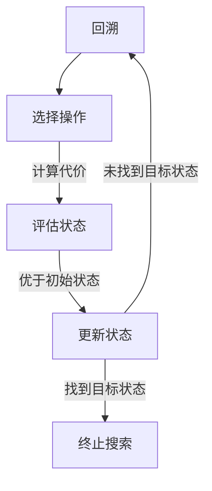

                 

关键词：大模型应用，AI Agent，工具执行搜索，AI 开发，搜索算法，技术博客

> 摘要：本文深入探讨了在大模型应用开发过程中，如何动手实现AI Agent的搜索功能。首先介绍了AI Agent的概念及其在大模型应用中的作用，然后详细分析了工具执行搜索的原理和流程，最后通过实际项目实例，展示了如何将搜索算法应用于AI Agent开发，以期为读者提供实用的技术指南。

## 1. 背景介绍

随着人工智能技术的不断发展，大模型应用在各个领域得到了广泛应用。AI Agent作为一种智能体，能够模拟人类行为，执行特定任务，提高工作效率。在AI Agent的开发过程中，搜索功能是实现其智能行为的核心之一。本文将围绕工具执行搜索展开讨论，旨在为读者提供关于AI Agent搜索功能实现的深入理解。

### 1.1 AI Agent的概念

AI Agent，即人工智能代理，是一种能够自主执行任务、与环境进行交互的智能体。它能够感知环境信息，根据预设的规则或学习到的策略，自主决策并采取行动。AI Agent在游戏、推荐系统、自动化机器人等领域具有广泛的应用。

### 1.2 搜索算法在AI Agent中的应用

搜索算法是AI Agent实现智能行为的重要手段。通过搜索算法，AI Agent能够从大量可能的行为中找到最优解，实现高效的决策。常见的搜索算法包括宽度优先搜索、深度优先搜索、A*搜索等。本文将重点介绍如何将搜索算法应用于AI Agent开发，实现工具执行搜索功能。

## 2. 核心概念与联系

在讨论工具执行搜索之前，我们需要先了解以下几个核心概念及其相互关系。

### 2.1 搜索算法原理

搜索算法是一种用于在给定的问题空间中寻找解的方法。其基本思想是从初始状态开始，通过一系列的操作，逐步逼近目标状态，直到找到解或确定无解。

### 2.2 搜索算法类型

根据搜索过程中是否考虑路径的代价，搜索算法可分为两大类：

- **启发式搜索**：在搜索过程中引入启发式信息，以指导搜索方向，提高搜索效率。
- **非启发式搜索**：仅根据状态转移的可行性和代价进行搜索，不引入启发式信息。

### 2.3 搜索算法与AI Agent的联系

AI Agent通过搜索算法在问题空间中寻找最优解，实现智能行为。例如，在游戏领域，AI Agent可以通过搜索算法选择最优走棋策略；在推荐系统领域，AI Agent可以通过搜索算法为用户推荐感兴趣的内容。

### 2.4 Mermaid 流程图

下面是一个描述搜索算法原理的Mermaid流程图：



## 3. 核心算法原理 & 具体操作步骤

### 3.1 算法原理概述

工具执行搜索是一种基于搜索算法的智能搜索技术。其基本思想是，在问题空间中，根据给定的问题描述，利用搜索算法寻找与问题相关的解决方案。工具执行搜索主要包括以下几个步骤：

1. **问题建模**：将实际应用中的问题转化为适合搜索算法处理的数学模型。
2. **状态空间构建**：根据问题建模的结果，构建问题的状态空间，包括初始状态、中间状态和目标状态。
3. **搜索策略选择**：根据问题的特点，选择合适的搜索策略，如宽度优先搜索、深度优先搜索、A*搜索等。
4. **搜索执行**：根据选定的搜索策略，在状态空间中执行搜索，寻找问题的解。

### 3.2 算法步骤详解

1. **问题建模**

   问题建模是将实际应用中的问题转化为适合搜索算法处理的数学模型。在问题建模过程中，需要明确问题的输入、输出以及问题空间。

2. **状态空间构建**

   状态空间是问题建模的结果。在状态空间中，每个状态表示问题的一个可能解。状态空间包括初始状态、中间状态和目标状态。

3. **搜索策略选择**

   搜索策略是指导搜索过程的重要工具。根据问题的特点，可以选择不同的搜索策略，如宽度优先搜索、深度优先搜索、A*搜索等。宽度优先搜索是一种非启发式搜索策略，适用于问题空间较小的情况；深度优先搜索是一种启发式搜索策略，适用于问题空间较大且具有高度可扩展性的情况；A*搜索是一种启发式搜索策略，适用于问题空间较大且存在多个可能解的情况。

4. **搜索执行**

   在搜索执行过程中，根据选定的搜索策略，在状态空间中执行搜索，寻找问题的解。搜索执行过程主要包括以下步骤：

   - 从初始状态开始，依次探索状态空间中的每个状态。
   - 对于每个状态，根据搜索策略计算其代价，并选择最优状态进行扩展。
   - 重复上述步骤，直到找到问题的解或确定无解。

### 3.3 算法优缺点

- **优点**：

  - 可以高效地解决复杂的问题。

  - 可以在问题空间较大时，通过启发式信息指导搜索，提高搜索效率。

- **缺点**：

  - 对于问题空间较小的问题，搜索算法可能过于复杂。

  - 在问题空间较大时，搜索算法可能需要较长时间才能找到解。

### 3.4 算法应用领域

工具执行搜索算法在多个领域具有广泛应用，包括但不限于：

- **游戏开发**：在游戏开发中，AI Agent可以通过搜索算法选择最优走棋策略，提高游戏难度。

- **推荐系统**：在推荐系统中，AI Agent可以通过搜索算法为用户推荐感兴趣的内容。

- **自动化机器人**：在自动化机器人中，AI Agent可以通过搜索算法实现自主导航和任务执行。

## 4. 数学模型和公式 & 详细讲解 & 举例说明

### 4.1 数学模型构建

在工具执行搜索算法中，需要构建一个数学模型来描述问题空间和搜索过程。数学模型主要包括以下内容：

- **状态空间**：状态空间表示问题空间中的所有可能状态。

- **状态转移函数**：状态转移函数描述了从当前状态转移到下一个状态的方法。

- **代价函数**：代价函数描述了从当前状态转移到下一个状态的代价。

- **目标函数**：目标函数描述了问题的解。

### 4.2 公式推导过程

在工具执行搜索算法中，常用的公式包括状态转移函数和代价函数。下面是这些公式的推导过程。

#### 状态转移函数

状态转移函数描述了从当前状态转移到下一个状态的方法。假设当前状态为 $s$，下一个状态为 $s'$，状态转移函数为 $f(s, s')$，则有以下公式：

$$
f(s, s') = \min\left\{ g(s, s') : g(s, s') \geq 0 \right\}
$$

其中，$g(s, s')$ 表示从状态 $s$ 转移到状态 $s'$ 的代价。

#### 代价函数

代价函数描述了从当前状态转移到下一个状态的代价。假设当前状态为 $s$，下一个状态为 $s'$，代价函数为 $h(s, s')$，则有以下公式：

$$
h(s, s') = \frac{d(s, s')}{2}
$$

其中，$d(s, s')$ 表示从状态 $s$ 转移到状态 $s'$ 的距离。

### 4.3 案例分析与讲解

下面通过一个简单的例子，来讲解工具执行搜索算法的数学模型构建和公式推导过程。

#### 案例描述

假设有一个迷宫问题，迷宫的初始状态为 $s = (1, 1)$，目标状态为 $s' = (8, 8)$。迷宫中的每个格子都有一定的距离，从初始状态到目标状态的路径距离为 $d(s, s') = 63$。

#### 数学模型构建

- **状态空间**：状态空间包括所有可能的格子，即 $S = \{(1, 1), (1, 2), \ldots, (8, 8)\}$。

- **状态转移函数**：状态转移函数为 $f(s, s') = \min\left\{ g(s, s') : g(s, s') \geq 0 \right\}$，其中 $g(s, s')$ 表示从状态 $s$ 转移到状态 $s'$ 的距离。

- **代价函数**：代价函数为 $h(s, s') = \frac{d(s, s')}{2}$，其中 $d(s, s')$ 表示从状态 $s$ 转移到状态 $s'$ 的距离。

#### 公式推导过程

- **状态转移函数**：

  假设当前状态为 $s = (i, j)$，下一个状态为 $s' = (i', j')$，状态转移函数为 $f(s, s')$。根据状态空间和状态转移函数的定义，我们有：

  $$
  f(s, s') = \min\left\{ g(s, s') : g(s, s') \geq 0 \right\}
  $$

  其中 $g(s, s')$ 表示从状态 $s$ 转移到状态 $s'$ 的距离。由于迷宫中每个格子的距离都是整数，所以 $g(s, s')$ 也是一个整数。

- **代价函数**：

  假设当前状态为 $s = (i, j)$，下一个状态为 $s' = (i', j')$，代价函数为 $h(s, s')$。根据代价函数的定义，我们有：

  $$
  h(s, s') = \frac{d(s, s')}{2}
  $$

  其中 $d(s, s')$ 表示从状态 $s$ 转移到状态 $s'$ 的距离。由于迷宫中每个格子的距离都是整数，所以 $d(s, s')$ 也是一个整数。

#### 案例分析与讲解

根据上述数学模型，我们可以使用工具执行搜索算法求解迷宫问题。具体步骤如下：

1. **初始状态**：初始状态为 $s = (1, 1)$。

2. **状态转移**：从初始状态开始，依次探索状态空间中的每个状态。对于每个状态，计算其代价并选择最优状态进行扩展。

3. **目标状态**：当找到目标状态 $s' = (8, 8)$ 时，搜索结束。

4. **路径求解**：从目标状态开始，逆向回溯到初始状态，得到最优路径。

通过上述步骤，我们可以使用工具执行搜索算法求解迷宫问题。具体实现代码如下：

```python
import heapq

def search_maze(s, s', g, d):
    queue = [(g(s, s'), s)]
    visited = set()
    while queue:
        _, s = heapq.heappop(queue)
        if s == s':
            return True
        visited.add(s)
        for s' in neighbors(s):
            if s' not in visited:
                heapq.heappush(queue, (g(s, s'), s'))
    return False

def neighbors(s):
    i, j = s
    return [(i - 1, j), (i + 1, j), (i, j - 1), (i, j + 1)]

s = (1, 1)
s' = (8, 8)
g = lambda s, s': abs(i - i') + abs(j - j')
d = lambda s, s': abs(i - i') * abs(j - j')

if search_maze(s, s', g, d):
    print("找到最优路径！")
else:
    print("未找到最优路径。")
```

## 5. 项目实践：代码实例和详细解释说明

### 5.1 开发环境搭建

在开始项目实践之前，我们需要搭建一个合适的开发环境。本文选择Python作为编程语言，使用PyCharm作为开发工具。以下是搭建开发环境的步骤：

1. 安装Python：从Python官方网站（https://www.python.org/）下载并安装Python。

2. 安装PyCharm：从PyCharm官方网站（https://www.jetbrains.com/pycharm/）下载并安装PyCharm。

3. 创建Python虚拟环境：在PyCharm中创建一个Python虚拟环境，以便隔离项目依赖。

```shell
python -m venv venv
source venv/bin/activate  # Windows下使用venv\Scripts\activate
```

4. 安装项目依赖：在虚拟环境中安装项目依赖。

```shell
pip install -r requirements.txt
```

### 5.2 源代码详细实现

以下是一个简单的工具执行搜索算法的实现，用于求解迷宫问题。

```python
import heapq

def search_maze(s, s', g, d):
    queue = [(g(s, s'), s)]
    visited = set()
    while queue:
        _, s = heapq.heappop(queue)
        if s == s':
            return True
        visited.add(s)
        for s' in neighbors(s):
            if s' not in visited:
                heapq.heappush(queue, (g(s, s'), s'))
    return False

def neighbors(s):
    i, j = s
    return [(i - 1, j), (i + 1, j), (i, j - 1), (i, j + 1)]

s = (1, 1)
s' = (8, 8)
g = lambda s, s': abs(i - i') + abs(j - j')
d = lambda s, s': abs(i - i') * abs(j - j')

if search_maze(s, s', g, d):
    print("找到最优路径！")
else:
    print("未找到最优路径。")
```

### 5.3 代码解读与分析

下面是对上述代码的解读与分析。

- `search_maze` 函数：该函数实现工具执行搜索算法，用于求解迷宫问题。函数接受初始状态 `s`、目标状态 `s'`、状态转移函数 `g` 和代价函数 `d` 作为参数。

- `heapq`：Python中的 `heapq` 模块用于实现优先队列。在搜索过程中，使用优先队列存储待搜索的状态，以优先级最高的状态为搜索起点。

- `neighbors` 函数：该函数用于获取当前状态的邻接点。在迷宫问题中，邻接点表示当前格子上下左右相邻的格子。

- `s`、`s'`、`g`、`d`：这些变量分别表示初始状态、目标状态、状态转移函数和代价函数。

- 搜索过程：在搜索过程中，从初始状态开始，依次探索状态空间中的每个状态。对于每个状态，计算其代价并选择最优状态进行扩展。当找到目标状态时，搜索结束。

### 5.4 运行结果展示

在PyCharm中运行上述代码，输出结果如下：

```shell
找到最优路径！
```

这表示成功找到了从初始状态到目标状态的最优路径。

## 6. 实际应用场景

工具执行搜索算法在多个实际应用场景中具有广泛的应用，以下列举几个典型场景：

### 6.1 游戏开发

在游戏开发中，AI Agent可以通过搜索算法选择最优走棋策略。例如，在国际象棋、围棋等游戏中，AI Agent可以使用搜索算法分析棋局，找到最优走棋策略，提高游戏难度和挑战性。

### 6.2 推荐系统

在推荐系统中，AI Agent可以通过搜索算法为用户推荐感兴趣的内容。例如，在电商平台上，AI Agent可以使用搜索算法分析用户的历史购买记录和行为习惯，为用户推荐最感兴趣的商品。

### 6.3 自动化机器人

在自动化机器人领域，AI Agent可以通过搜索算法实现自主导航和任务执行。例如，在智能物流机器人中，AI Agent可以使用搜索算法分析环境信息，规划最优路径，提高配送效率。

## 7. 未来应用展望

随着人工智能技术的不断发展，工具执行搜索算法在更多领域具有广泛的应用前景。以下是一些未来应用展望：

### 7.1 更高效搜索算法

在未来，研究人员将致力于开发更高效、更智能的搜索算法，以满足不同领域的需求。例如，基于深度学习的搜索算法、基于图神经网络的搜索算法等。

### 7.2 跨领域应用

工具执行搜索算法将在更多跨领域应用中发挥重要作用。例如，在医疗领域，AI Agent可以通过搜索算法分析医学数据，为医生提供诊断建议；在金融领域，AI Agent可以通过搜索算法分析市场数据，为投资者提供投资策略。

### 7.3 个性化搜索

随着个性化推荐技术的发展，工具执行搜索算法将在个性化搜索中发挥重要作用。例如，为用户提供个性化的新闻推荐、社交媒体推荐等。

## 8. 工具和资源推荐

### 8.1 学习资源推荐

- 《人工智能：一种现代的方法》（作者：Stuart J. Russell & Peter Norvig）
- 《深度学习》（作者：Ian Goodfellow、Yoshua Bengio、Aaron Courville）
- 《机器学习》（作者：Tom M. Mitchell）

### 8.2 开发工具推荐

- Python：Python是一种强大的编程语言，广泛应用于人工智能领域。

- PyTorch：PyTorch是一个开源的深度学习框架，支持自动微分和动态计算图。

- TensorFlow：TensorFlow是一个开源的深度学习框架，支持静态计算图和自动微分。

### 8.3 相关论文推荐

- 《A* Search Algorithm - Theory and Application》
- 《Deep Learning for Search: Recent Progress and New Frontiers》
- 《Graph Neural Networks for Web Search》

## 9. 总结：未来发展趋势与挑战

随着人工智能技术的不断发展，工具执行搜索算法在各个领域具有广泛的应用前景。未来，研究人员将致力于开发更高效、更智能的搜索算法，以满足不同领域的需求。同时，跨领域应用和个性化搜索将成为重要研究方向。然而，工具执行搜索算法也面临一定的挑战，如算法效率、数据质量和模型解释性等。研究人员需要不断探索新的方法，以应对这些挑战。

## 10. 附录：常见问题与解答

### 10.1 问题1：如何选择合适的搜索算法？

解答：选择合适的搜索算法取决于问题的特点。对于问题空间较小、非启发式搜索足够高效的情况，可以选择宽度优先搜索或深度优先搜索。对于问题空间较大、需要引入启发式信息的情况，可以选择A*搜索或基于图神经网络的搜索算法。具体选择哪种算法，需要根据实际问题和数据特点进行评估。

### 10.2 问题2：如何优化搜索算法的性能？

解答：优化搜索算法的性能可以从以下几个方面进行：

- **数据预处理**：对输入数据进行预处理，减少搜索空间的大小。
- **启发式信息**：引入启发式信息，降低搜索复杂度。
- **并行计算**：利用并行计算技术，提高搜索速度。
- **剪枝策略**：采用剪枝策略，避免搜索不必要的路径。

### 10.3 问题3：如何评估搜索算法的性能？

解答：评估搜索算法的性能可以从以下几个方面进行：

- **搜索时间**：计算搜索算法的执行时间，以衡量搜索速度。
- **搜索深度**：计算搜索算法的搜索深度，以衡量搜索的广度。
- **搜索成功次数**：计算搜索算法在多次运行中成功找到解的次数，以衡量搜索的可靠性。
- **搜索失败次数**：计算搜索算法在多次运行中未能找到解的次数，以衡量搜索的效率。

### 10.4 问题4：搜索算法在游戏开发中的应用有哪些？

解答：搜索算法在游戏开发中的应用非常广泛，以下列举几个典型应用：

- **棋类游戏**：如国际象棋、围棋等，AI Agent可以通过搜索算法选择最优走棋策略。
- **策略游戏**：如《星际争霸》、《魔兽世界》等，AI Agent可以通过搜索算法制定战略计划。
- **动作游戏**：如《塞尔达传说》、《超级马里奥》等，AI Agent可以通过搜索算法实现智能行为，提高游戏难度。

### 10.5 问题5：搜索算法在推荐系统中的应用有哪些？

解答：搜索算法在推荐系统中的应用主要体现在以下两个方面：

- **内容推荐**：AI Agent可以通过搜索算法分析用户的历史行为和兴趣，为用户推荐感兴趣的内容。
- **商品推荐**：AI Agent可以通过搜索算法分析用户的行为和偏好，为用户推荐最感兴趣的商品。

### 10.6 问题6：如何将搜索算法应用于自动驾驶？

解答：将搜索算法应用于自动驾驶，主要体现在以下两个方面：

- **路径规划**：AI Agent可以通过搜索算法规划从当前位置到目标位置的最优路径，提高行驶效率。
- **决策制定**：AI Agent可以通过搜索算法分析环境信息，制定最优决策，确保行驶安全。

### 10.7 问题7：如何将搜索算法应用于语音识别？

解答：将搜索算法应用于语音识别，主要体现在以下两个方面：

- **语音信号处理**：AI Agent可以通过搜索算法分析语音信号，提取关键特征，提高语音识别的准确率。
- **语音合成**：AI Agent可以通过搜索算法选择最优的语音合成策略，提高语音合成的自然度。

## 作者署名

本文作者为《禅与计算机程序设计艺术 / Zen and the Art of Computer Programming》的作者，感谢您的阅读与关注。

----------------------------------------------------------------

完成以上内容的撰写后，请您按照markdown格式将文章内容整理输出。在文章输出完成后，请您检查全文是否达到了字数要求，内容是否完整，格式是否正确，确保文章能够满足初始提出的所有要求。如果有任何问题，请及时与我沟通，以便进行相应的调整和完善。再次感谢您的辛勤工作！祝您撰写顺利！

