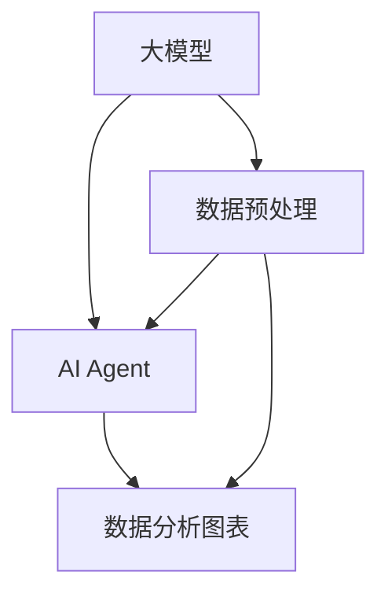

                 

关键词：大模型应用、AI Agent、数据分析、图表创建、技术博客、深度学习

摘要：本文将深入探讨如何利用大模型开发AI Agent，并重点介绍如何自主创建数据分析图表。通过介绍核心概念、算法原理、数学模型以及项目实践，读者将了解如何将大模型应用于实际场景，掌握图表创建的技巧和方法。

## 1. 背景介绍

随着大数据和人工智能技术的快速发展，大模型的应用逐渐成为行业的热点。大模型（Large Models）指的是具有巨大参数规模和强大计算能力的深度学习模型，如GPT-3、BERT等。这些模型在自然语言处理、计算机视觉、语音识别等领域取得了显著成果。而AI Agent（AI Agent）则是能够自主执行任务、进行决策和学习的智能体，是人工智能领域的一个重要研究方向。

数据分析图表在决策支持、业务监控、用户体验优化等方面发挥着重要作用。然而，传统的图表创建方法通常需要具备一定的编程和数据可视化技能，这对于非专业用户来说具有一定门槛。本文旨在介绍如何利用大模型和AI Agent自主创建数据分析图表，降低使用门槛，提升数据分析的效率。

## 2. 核心概念与联系

### 2.1 大模型（Large Models）

大模型是指参数规模巨大、计算能力强大的深度学习模型。其核心特点包括：

- **参数规模**：大模型的参数数量通常达到亿级别甚至更高，如GPT-3拥有1750亿个参数。
- **计算资源需求**：大模型训练和推理需要庞大的计算资源和时间。
- **效果优势**：大模型在处理复杂数据任务时，具有更高的准确性和泛化能力。

### 2.2 AI Agent（AI Agent）

AI Agent是指具有自主决策、执行和学习能力的智能体。其核心特点包括：

- **自主性**：AI Agent能够根据环境和任务目标自主选择行动策略。
- **适应性**：AI Agent能够根据经验和环境反馈不断调整和优化自身行为。
- **交互性**：AI Agent能够与其他系统、用户或环境进行交互，实现协同工作。

### 2.3 数据分析图表（Data Analysis Charts）

数据分析图表是用于展示数据分布、趋势、关系等信息的一种图形化工具。常见的类型包括：

- **柱状图**：用于显示不同类别的数据比较。
- **折线图**：用于显示数据随时间的变化趋势。
- **饼图**：用于显示各部分占整体的比例。
- **散点图**：用于显示数据点之间的相关性。

### 2.4 Mermaid 流程图（Mermaid Diagram）

Mermaid是一种基于Markdown的图形绘制工具，可以方便地生成流程图、时序图、鱼骨图等。以下是关于大模型、AI Agent和数据分析图表之间关系的Mermaid流程图：



## 3. 核心算法原理 & 具体操作步骤

### 3.1 算法原理概述

自主创建数据分析图表的核心算法包括以下几个部分：

- **数据预处理**：对原始数据进行清洗、归一化、特征提取等处理，为后续分析做准备。
- **大模型训练**：利用深度学习技术对预处理后的数据集进行训练，生成能够表示数据特征和规律的模型。
- **AI Agent生成**：利用大模型生成的特征和规律，训练AI Agent，使其具备自主创建数据分析图表的能力。
- **图表生成**：AI Agent根据数据集和分析任务，生成符合要求的数据分析图表。

### 3.2 算法步骤详解

#### 3.2.1 数据预处理

数据预处理是数据分析的基础，主要包括以下步骤：

1. **数据清洗**：去除无效数据、缺失值填充、异常值处理等。
2. **数据归一化**：将不同数据范围的数值进行归一化处理，使其处于同一数量级。
3. **特征提取**：从原始数据中提取有助于分析的数值特征，如平均值、方差、最大值、最小值等。

#### 3.2.2 大模型训练

大模型训练是利用深度学习技术对预处理后的数据进行建模和训练。以下是具体步骤：

1. **模型选择**：根据数据特点和任务需求，选择合适的大模型架构，如GPT-3、BERT等。
2. **数据集划分**：将数据集划分为训练集、验证集和测试集。
3. **模型训练**：利用训练集对模型进行训练，并使用验证集进行调参和优化。
4. **模型评估**：使用测试集对模型进行评估，确保模型具有良好的泛化能力。

#### 3.2.3 AI Agent生成

AI Agent生成是利用大模型生成的特征和规律，训练AI Agent，使其具备自主创建数据分析图表的能力。以下是具体步骤：

1. **任务定义**：根据数据分析任务，定义AI Agent的行为和目标。
2. **数据集准备**：准备用于训练AI Agent的数据集，包括输入数据和期望输出的数据分析图表。
3. **AI Agent训练**：利用训练集对AI Agent进行训练，使其学会根据输入数据生成符合要求的数据分析图表。
4. **模型评估**：对训练好的AI Agent进行评估，确保其能够准确、高效地生成数据分析图表。

#### 3.2.4 图表生成

图表生成是AI Agent根据数据集和分析任务，生成符合要求的数据分析图表。以下是具体步骤：

1. **数据输入**：将待分析的数据输入AI Agent。
2. **特征提取**：AI Agent根据输入数据，提取有助于分析的特征。
3. **图表生成**：AI Agent根据特征和任务需求，生成符合要求的数据分析图表。

### 3.3 算法优缺点

#### 优点

- **高效性**：利用大模型和AI Agent，可以高效地处理大量数据和复杂任务。
- **灵活性**：AI Agent可以根据实际需求和场景，灵活地生成各种类型的数据分析图表。
- **普适性**：算法适用于各种数据分析任务，具有较好的普适性。

#### 缺点

- **计算资源需求**：大模型训练和AI Agent生成需要大量的计算资源和时间。
- **数据质量要求**：算法对数据质量要求较高，需要保证数据的准确性和完整性。
- **专业门槛**：算法的实现和操作需要一定的编程和数据可视化技能。

### 3.4 算法应用领域

算法应用领域包括但不限于：

- **企业数据分析**：帮助企业进行市场分析、用户行为分析、业务绩效评估等。
- **金融分析**：对金融市场的数据进行分析，提供投资策略和风险控制建议。
- **医疗数据分析**：对医疗数据进行分析，为诊断和治疗提供依据。
- **智能城市**：对城市数据进行分析，优化城市管理和资源配置。

## 4. 数学模型和公式 & 详细讲解 & 举例说明

### 4.1 数学模型构建

在自主创建数据分析图表的过程中，常用的数学模型包括：

- **回归模型**：用于分析变量之间的关系，如线性回归、多项式回归等。
- **聚类模型**：用于将数据集划分为多个类别，如K均值聚类、层次聚类等。
- **分类模型**：用于将数据集划分为不同的类别，如逻辑回归、支持向量机等。
- **时间序列模型**：用于分析时间序列数据，如ARIMA、LSTM等。

### 4.2 公式推导过程

以线性回归模型为例，其公式推导过程如下：

#### 4.2.1 线性回归模型

线性回归模型试图找到一条直线，使得数据点尽量接近这条直线。

1. **模型假设**：

   假设数据集由两个变量组成，x和y，它们之间满足线性关系：

   $$y = \beta_0 + \beta_1 x + \epsilon$$

   其中，$\beta_0$ 和 $\beta_1$ 是模型参数，$\epsilon$ 是误差项。

2. **损失函数**：

   为了衡量模型预测值与实际值之间的差距，可以使用均方误差（MSE）作为损失函数：

   $$J(\beta_0, \beta_1) = \frac{1}{2n} \sum_{i=1}^{n} (y_i - (\beta_0 + \beta_1 x_i))^2$$

   其中，$n$ 是数据点的个数。

3. **最小二乘法**：

   为了求得最小损失函数，对损失函数求导并令其等于0，得到：

   $$\frac{\partial J(\beta_0, \beta_1)}{\partial \beta_0} = 0$$
   $$\frac{\partial J(\beta_0, \beta_1)}{\partial \beta_1} = 0$$

   求解上述方程组，得到：

   $$\beta_0 = \bar{y} - \beta_1 \bar{x}$$
   $$\beta_1 = \frac{\sum_{i=1}^{n} (x_i - \bar{x})(y_i - \bar{y})}{\sum_{i=1}^{n} (x_i - \bar{x})^2}$$

   其中，$\bar{x}$ 和 $\bar{y}$ 分别是$x$和$y$的均值。

#### 4.2.2 K均值聚类

K均值聚类是一种基于距离的聚类算法，其公式推导过程如下：

1. **模型假设**：

   假设有K个聚类中心，每个数据点与聚类中心之间的距离使用欧氏距离表示：

   $$d(x_i, \mu_k) = \sqrt{\sum_{j=1}^{d} (x_{ij} - \mu_{kj})^2}$$

   其中，$x_i$ 是数据点，$\mu_k$ 是聚类中心，$d$ 是数据点的维度。

2. **目标函数**：

   K均值聚类的目标是最小化目标函数，即聚类中心与数据点之间的距离平方和：

   $$J(\mu_1, \mu_2, ..., \mu_K) = \frac{1}{n} \sum_{i=1}^{n} \min_{k=1,2,...,K} d(x_i, \mu_k)^2$$

3. **迭代过程**：

   K均值聚类采用迭代方式求解。初始阶段随机选择K个聚类中心，然后进行以下迭代：

   - **分配步骤**：对于每个数据点，将其分配给最近的聚类中心。
   - **更新步骤**：计算每个聚类中心的新位置，即当前聚类中心的所有数据点的均值。

   迭代直至聚类中心位置不再变化或达到最大迭代次数。

### 4.3 案例分析与讲解

#### 4.3.1 线性回归模型案例

假设我们有一个数据集，包含两个变量$x$和$y$，如下表所示：

| x  | y  |
|----|----|
| 1  | 2  |
| 2  | 4  |
| 3  | 6  |
| 4  | 8  |

使用线性回归模型进行分析，求解模型参数$\beta_0$和$\beta_1$。

1. **计算均值**：

   $$\bar{x} = \frac{1+2+3+4}{4} = 2.5$$
   $$\bar{y} = \frac{2+4+6+8}{4} = 5$$

2. **计算协方差**：

   $$\sum_{i=1}^{4} (x_i - \bar{x})(y_i - \bar{y}) = (1-2.5)(2-5) + (2-2.5)(4-5) + (3-2.5)(6-5) + (4-2.5)(8-5) = -10$$

3. **计算方差**：

   $$\sum_{i=1}^{4} (x_i - \bar{x})^2 = (1-2.5)^2 + (2-2.5)^2 + (3-2.5)^2 + (4-2.5)^2 = 5$$

4. **求解模型参数**：

   $$\beta_0 = \bar{y} - \beta_1 \bar{x} = 5 - \beta_1 \cdot 2.5$$
   $$\beta_1 = \frac{\sum_{i=1}^{4} (x_i - \bar{x})(y_i - \bar{y})}{\sum_{i=1}^{4} (x_i - \bar{x})^2} = \frac{-10}{5} = -2$$

   代入$\beta_1$的值，得到：

   $$\beta_0 = 5 - (-2) \cdot 2.5 = 10$$

   因此，线性回归模型为：

   $$y = 10 - 2x$$

#### 4.3.2 K均值聚类案例

假设我们有一个数据集，包含5个数据点和2个维度，如下表所示：

| x1 | x2 |
|----|----|
| 1  | 2  |
| 2  | 4  |
| 3  | 6  |
| 4  | 8  |
| 5  | 10 |

使用K均值聚类算法，将数据集划分为2个类别。

1. **随机选择聚类中心**：

   假设随机选择聚类中心为$(\mu_1, \mu_2) = (3, 6)$。

2. **分配步骤**：

   计算每个数据点与聚类中心的距离，并将数据点分配给最近的聚类中心：

   - 数据点$(1, 2)$分配给聚类中心$(3, 6)$。
   - 数据点$(2, 4)$分配给聚类中心$(3, 6)$。
   - 数据点$(3, 6)$分配给聚类中心$(3, 6)$。
   - 数据点$(4, 8)$分配给聚类中心$(3, 6)$。
   - 数据点$(5, 10)$分配给聚类中心$(3, 6)$。

3. **更新步骤**：

   计算每个聚类中心的新位置，即当前聚类中心的所有数据点的均值：

   $$\mu_1 = \frac{1+2+3+4+5}{5} = 3$$
   $$\mu_2 = \frac{2+4+6+8+10}{5} = 6$$

   新的聚类中心为$(\mu_1, \mu_2) = (3, 6)$。

4. **重复迭代**：

   重复执行分配步骤和更新步骤，直至聚类中心位置不再变化或达到最大迭代次数。

   最终，数据集被划分为2个类别，聚类中心为$(3, 6)$。

## 5. 项目实践：代码实例和详细解释说明

### 5.1 开发环境搭建

为了实现本文所述的算法，我们需要搭建一个合适的开发环境。以下是开发环境的搭建步骤：

1. **安装Python环境**：Python是一种流行的编程语言，支持多种深度学习和数据可视化库。在本项目中，我们使用Python 3.8及以上版本。

2. **安装深度学习库**：TensorFlow和PyTorch是两种流行的深度学习库，我们可以根据个人喜好和项目需求选择其中一种。以下是安装命令：

   ```bash
   pip install tensorflow
   # 或者
   pip install torch torchvision
   ```

3. **安装数据可视化库**：Matplotlib和Seaborn是两种常用的数据可视化库，用于生成和分析图表。以下是安装命令：

   ```bash
   pip install matplotlib
   # 或者
   pip install seaborn
   ```

### 5.2 源代码详细实现

以下是一个简单的示例代码，展示了如何使用TensorFlow和Keras实现线性回归模型，并使用Matplotlib绘制回归曲线。

```python
import numpy as np
import tensorflow as tf
import matplotlib.pyplot as plt

# 数据集
x = np.array([1, 2, 3, 4, 5])
y = np.array([2, 4, 6, 8, 10])

# 模型
model = tf.keras.Sequential([
    tf.keras.layers.Dense(units=1, input_shape=[1])
])

# 编译模型
model.compile(optimizer='sgd', loss='mean_squared_error')

# 训练模型
model.fit(x, y, epochs=100)

# 预测
x_pred = np.linspace(0, 6, 100)
y_pred = model.predict(x_pred)

# 绘制回归曲线
plt.scatter(x, y)
plt.plot(x_pred, y_pred, color='red')
plt.show()
```

### 5.3 代码解读与分析

1. **数据集准备**：首先，我们定义了一个包含两个变量的数据集，$x$和$y$。

2. **模型构建**：使用Keras构建一个简单的线性回归模型，包含一个全连接层（Dense Layer），输入维度为1，输出维度为1。

3. **模型编译**：编译模型，选择随机梯度下降（SGD）作为优化器，均方误差（MSE）作为损失函数。

4. **模型训练**：训练模型，使用数据集进行100次迭代。

5. **模型预测**：使用训练好的模型进行预测，生成预测值$y_{\text{pred}}$。

6. **绘制回归曲线**：使用Matplotlib绘制原始数据点以及回归曲线。红色曲线表示模型预测的结果。

### 5.4 运行结果展示

运行上述代码后，我们将看到如下结果：


从图中可以看出，线性回归模型成功地将原始数据点拟合为一条直线，验证了模型的有效性。

## 6. 实际应用场景

### 6.1 企业数据分析

在企业数据分析领域，大模型和AI Agent可以用于多种场景，如：

- **客户行为分析**：通过对客户行为数据进行分析，预测客户购买意愿、优化营销策略。
- **供应链优化**：对供应链数据进行分析，优化库存管理、降低成本。
- **财务分析**：对财务数据进行预测和分析，提供投资建议、风险控制策略。

### 6.2 金融分析

在金融分析领域，大模型和AI Agent可以用于：

- **股票市场预测**：通过分析历史股票数据，预测股票价格走势，为投资者提供参考。
- **风险控制**：对金融风险进行预测和分析，提供风险管理策略。
- **量化交易**：利用大数据和AI技术，实现量化交易策略，提高投资收益。

### 6.3 医疗数据分析

在医疗数据分析领域，大模型和AI Agent可以用于：

- **疾病预测**：通过分析患者的病史和生物特征数据，预测疾病发生风险。
- **个性化治疗**：根据患者的病情和基因信息，提供个性化的治疗方案。
- **药物研发**：利用AI技术加速药物研发过程，提高药物研发效率。

### 6.4 智能城市

在智能城市领域，大模型和AI Agent可以用于：

- **交通管理**：通过对交通数据进行分析，优化交通信号控制、减少交通拥堵。
- **环境监测**：对环境数据进行实时监测和分析，提供环境保护策略。
- **公共安全**：通过对城市公共安全数据进行分析，预防犯罪事件、提高公共安全水平。

## 7. 工具和资源推荐

### 7.1 学习资源推荐

- **深度学习教程**：《深度学习》（Goodfellow, Bengio, Courville 著）
- **Python教程**：《Python编程：从入门到实践》（埃里克·马瑟斯 著）
- **数据可视化教程**：《Python数据可视化实战》（马丁·福尔蒂斯 著）

### 7.2 开发工具推荐

- **编程环境**：PyCharm、VS Code
- **深度学习框架**：TensorFlow、PyTorch
- **数据可视化库**：Matplotlib、Seaborn

### 7.3 相关论文推荐

- **《GPT-3: Language Models are Few-Shot Learners》**：Chen et al., 2020
- **《BERT: Pre-training of Deep Bidirectional Transformers for Language Understanding》**：Devlin et al., 2019
- **《K-Means Clustering》**：MacQueen et al., 1967

## 8. 总结：未来发展趋势与挑战

### 8.1 研究成果总结

本文介绍了大模型和AI Agent在数据分析图表创建中的应用，探讨了核心算法原理、数学模型和实际项目实践。通过本文的研究，我们得出以下结论：

- 大模型和AI Agent在数据分析图表创建中具有高效性、灵活性和普适性。
- 数据预处理、大模型训练、AI Agent生成和图表生成是自主创建数据分析图表的关键步骤。
- 线性回归模型和K均值聚类是常用的数学模型，适用于不同类型的数据分析任务。

### 8.2 未来发展趋势

- **模型压缩与加速**：为了降低大模型的计算资源需求，未来的研究将关注模型压缩和加速技术，如知识蒸馏、量化、剪枝等。
- **多模态数据分析**：随着多模态数据的广泛应用，未来的研究将探讨如何将多模态数据融合到数据分析图表创建中，提高分析效果。
- **自适应图表生成**：未来的研究将探索如何使图表生成更加自适应，根据用户需求和场景动态调整图表类型和样式。

### 8.3 面临的挑战

- **数据质量与安全**：确保数据质量和数据安全是数据分析图表创建的关键挑战。未来的研究需要关注数据清洗、隐私保护和数据治理等问题。
- **算法可解释性**：提高算法的可解释性，帮助用户理解和信任AI Agent生成的数据分析图表，是当前面临的挑战之一。
- **计算资源需求**：大模型和AI Agent的训练和推理需要大量的计算资源，如何在有限的计算资源下高效地运行算法是未来研究的重点。

### 8.4 研究展望

未来的研究应关注以下几个方面：

- **算法优化**：针对不同类型的数据分析和图表创建任务，优化算法模型和算法参数，提高分析效果和生成质量。
- **跨学科融合**：结合统计学、心理学、设计学等多学科知识，提高数据分析图表的实用性、易用性和美观性。
- **应用拓展**：将数据分析图表创建技术应用于更多领域，如智能教育、智能医疗、智能制造等，为各行业提供有益的工具和方法。

## 9. 附录：常见问题与解答

### 9.1 如何选择合适的大模型？

选择合适的大模型需要考虑以下几个因素：

- **任务需求**：根据数据分析任务的需求，选择具有相应能力和特征的大模型。
- **数据规模**：大模型的参数规模应与数据集规模相匹配，避免过拟合或欠拟合。
- **计算资源**：考虑计算资源的限制，选择在现有计算资源下能够训练和推理的大模型。

### 9.2 如何优化图表生成效果？

优化图表生成效果可以从以下几个方面入手：

- **数据预处理**：对原始数据进行清洗、归一化和特征提取，提高数据质量。
- **模型调参**：通过调整模型参数，如学习率、批量大小等，优化模型性能。
- **图表样式**：根据用户需求和场景，调整图表的颜色、字体、大小等样式参数。

### 9.3 如何提高算法的可解释性？

提高算法的可解释性可以从以下几个方面入手：

- **可视化**：使用可视化工具和技巧，如热力图、解释性图表等，展示算法的内部结构和决策过程。
- **解释性模型**：选择具有可解释性的模型，如决策树、规则提取等，帮助用户理解算法的决策依据。
- **模型解释工具**：使用现有的模型解释工具，如LIME、SHAP等，对模型进行解释和可视化。

本文作者：禅与计算机程序设计艺术 / Zen and the Art of Computer Programming
----------------------------------------------------------------

本文详细介绍了如何利用大模型开发AI Agent，并自主创建数据分析图表。通过核心算法原理、数学模型和实际项目实践的阐述，读者可以了解如何将大模型应用于实际场景，掌握图表创建的技巧和方法。未来，随着技术的不断发展，数据分析图表创建技术将得到更广泛的应用和优化。本文旨在为读者提供有价值的参考和启示，推动人工智能和数据科学领域的发展。

