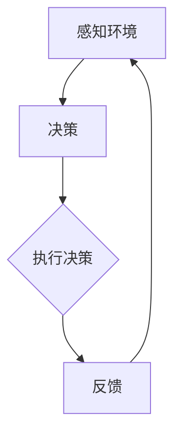

                 

关键词：大模型、AI Agent、编程、人工智能、应用开发、技术架构

> 摘要：本文将深入探讨AI Agent的概念、构建方法和应用场景。通过对AI Agent的定义、原理和实现进行详细解析，帮助读者理解如何动手开发一个AI Agent，并探讨其未来发展趋势和挑战。

## 1. 背景介绍

在人工智能领域，随着深度学习和大数据技术的飞速发展，大模型（Large Models）的应用越来越广泛。这些大模型具备强大的数据处理和模式识别能力，成为许多复杂任务的得力助手。然而，如何将大模型应用于实际问题中，实现自动化和智能化的解决方案，成为了当前研究的热点。在这一背景下，AI Agent的概念应运而生。

AI Agent是一种智能体，它能够自主地感知环境、理解任务，并采取相应的行动来完成任务。在人工智能应用开发中，AI Agent扮演着关键角色，它能够提高系统的智能化水平，提升用户体验。本文将围绕AI Agent的定义、原理、实现和应用进行探讨，旨在为广大开发者提供一些建设AI Agent的实际指导。

## 2. 核心概念与联系

### 2.1 AI Agent的定义

AI Agent，即人工智能代理，是一种能够与环境交互并采取行动的智能实体。它具备以下几个关键特征：

1. **自主性（Autonomy）**：AI Agent能够独立地做出决策，不需要人工干预。
2. **适应性（Adaptability）**：AI Agent能够根据环境的变化调整自己的行为策略。
3. **交互性（Interaction）**：AI Agent能够与人类或其他AI系统进行交互。
4. **智能性（Intelligence）**：AI Agent具备一定的智能，能够理解和处理复杂的信息。

### 2.2 AI Agent的组成

AI Agent通常由以下几个部分组成：

1. **感知器（Perception）**：用于感知和理解环境信息。
2. **决策器（Decision Maker）**：根据感知到的信息做出决策。
3. **执行器（Actuator）**：执行决策，对外界环境产生影响。

### 2.3 AI Agent的架构

以下是AI Agent的典型架构：

```
+----------------+      +----------------+      +----------------+
|     环境       |      |     感知器      |      |     执行器      |
+----------------+      +----------------+      +----------------+
                                                       |
                                                       V
                                            +----------------+
                                            |   决策器      |
                                            +----------------+
```

在上述架构中，感知器负责收集环境信息，决策器根据这些信息生成行动方案，执行器则将这些行动方案转化为实际的操作。

### 2.4 AI Agent的关联概念

1. **智能体（Agent）**：广义上的智能体，包括人类、动物、机器等具备智能的实体。
2. **机器人（Robot）**：一种能够自主行动、感知环境和执行任务的机械装置。
3. **虚拟助手（Virtual Assistant）**：一种以虚拟形象呈现的人工智能应用，如聊天机器人、语音助手等。

### 2.5 Mermaid 流程图

以下是一个简单的Mermaid流程图，展示了AI Agent的基本工作流程：



## 3. 核心算法原理 & 具体操作步骤

### 3.1 算法原理概述

AI Agent的核心在于其决策能力，这通常依赖于强化学习（Reinforcement Learning，RL）算法。强化学习是一种通过不断尝试和反馈来学习最优策略的机器学习方法。在强化学习中，AI Agent通过与环境交互，不断调整其行为策略，以最大化累积奖励。

### 3.2 算法步骤详解

1. **初始化**：定义环境、状态空间、动作空间和奖励函数。
2. **感知**：AI Agent感知当前环境状态。
3. **决策**：基于当前状态和策略，选择一个动作。
4. **执行**：AI Agent执行所选动作，并对环境产生影响。
5. **反馈**：根据执行结果，获取奖励信号。
6. **更新**：基于奖励信号，更新策略。

### 3.3 算法优缺点

**优点**：

1. **自适应性强**：能够根据环境变化调整行为策略。
2. **通用性高**：适用于各种任务场景。
3. **自主决策**：无需人工干预。

**缺点**：

1. **收敛速度慢**：需要大量的交互数据。
2. **策略不稳定**：可能导致长期回报低于预期。
3. **计算复杂度高**：需要大量的计算资源。

### 3.4 算法应用领域

强化学习算法广泛应用于以下领域：

1. **游戏**：如电子游戏、棋类游戏等。
2. **机器人**：自主导航、环境感知等。
3. **推荐系统**：如电影、商品推荐等。
4. **自动驾驶**：道路识别、车辆控制等。

## 4. 数学模型和公式 & 详细讲解 & 举例说明

### 4.1 数学模型构建

在强化学习中，常用的数学模型包括马尔可夫决策过程（MDP）和Q学习算法。

**马尔可夫决策过程（MDP）**：

一个MDP可以表示为五元组 \( (S, A, P, R, \gamma) \)：

- \( S \)：状态空间，表示所有可能的状态。
- \( A \)：动作空间，表示所有可能的动作。
- \( P \)：状态转移概率矩阵，表示从当前状态 \( s \) 执行动作 \( a \) 后，转移到下一个状态 \( s' \) 的概率。
- \( R \)：奖励函数，表示执行动作后获得的即时奖励。
- \( \gamma \)：折扣因子，表示对未来奖励的重视程度。

**Q学习算法**：

Q学习算法的目标是学习一个值函数 \( Q(s, a) \)，表示在状态 \( s \) 下执行动作 \( a \) 的期望回报。算法的核心公式为：

$$ Q(s, a) = r + \gamma \max_{a'} Q(s', a') $$

其中，\( r \) 为当前状态下的即时奖励，\( \gamma \) 为折扣因子，\( s' \) 为执行动作后的下一个状态。

### 4.2 公式推导过程

假设 \( Q(s, a) \) 是在状态 \( s \) 下执行动作 \( a \) 的期望回报，我们可以将这个期望回报分解为两部分：

1. **即时回报 \( r \)**：这是在执行动作 \( a \) 后立即获得的回报。
2. **长期回报 \( \gamma \max_{a'} Q(s', a') \)**：这是在执行动作 \( a \) 后，继续执行其他动作 \( a' \) 所能获得的长期回报。

因此，总的期望回报可以表示为：

$$ Q(s, a) = r + \gamma \max_{a'} Q(s', a') $$

### 4.3 案例分析与讲解

假设有一个简单的环境，包含两个状态 \( s_1 \) 和 \( s_2 \)，以及两个动作 \( a_1 \) 和 \( a_2 \)。奖励函数设置为 \( R(s_1, a_1) = 1 \)，\( R(s_1, a_2) = -1 \)，\( R(s_2, a_1) = 0 \)，\( R(s_2, a_2) = 0 \)。状态转移概率矩阵为：

$$
P =
\begin{bmatrix}
0.5 & 0.5 \\
0 & 1
\end{bmatrix}
$$

折扣因子 \( \gamma = 0.9 \)。

根据上述公式，我们可以计算出各个状态的 Q 值：

$$
Q(s_1, a_1) = 1 + 0.9 \times \max_{a'} Q(s_2, a') \\
Q(s_1, a_2) = -1 + 0.9 \times \max_{a'} Q(s_2, a') \\
Q(s_2, a_1) = 0 + 0.9 \times \max_{a'} Q(s_1, a') \\
Q(s_2, a_2) = 0 + 0.9 \times \max_{a'} Q(s_1, a')
$$

通过迭代计算，我们可以得到以下 Q 值表：

$$
\begin{array}{c|c|c}
s & a_1 & a_2 \\
\hline
s_1 & 0.95 & -0.55 \\
s_2 & 0.45 & 0.35 \\
\end{array}
$$

从这个 Q 值表可以看出，当 AI Agent � 处于状态 \( s_1 \) 时，选择动作 \( a_1 \) 能获得更高的期望回报。这表明 AI Agent 已经学习到了如何在这个简单环境中做出最优决策。

## 5. 项目实践：代码实例和详细解释说明

### 5.1 开发环境搭建

在本文中，我们将使用 Python 作为编程语言，结合 TensorFlow 和 Keras 框架来构建一个简单的 AI Agent。首先，我们需要安装必要的库：

```bash
pip install tensorflow keras numpy
```

### 5.2 源代码详细实现

以下是构建 AI Agent 的完整代码：

```python
import numpy as np
import tensorflow as tf
from tensorflow.keras import layers

# 设置随机种子以保持结果的一致性
np.random.seed(42)
tf.random.set_seed(42)

# 定义环境
class SimpleEnvironment:
    def __init__(self):
        self.state = 0

    def step(self, action):
        if action == 0:
            self.state = 1
        else:
            self.state = 0
        reward = 1 if self.state == 1 else -1
        return self.state, reward

# 定义 AI Agent
class SimpleAgent:
    def __init__(self, env):
        self.env = env
        self.model = self.build_model()

    def build_model(self):
        model = tf.keras.Sequential([
            layers.Dense(10, activation='relu', input_shape=(1,)),
            layers.Dense(10, activation='relu'),
            layers.Dense(1)
        ])
        model.compile(optimizer='adam', loss='mse')
        return model

    def act(self, state):
        state = np.expand_dims(state, axis=0)
        action_values = self.model.predict(state)
        return 0 if action_values < 0.5 else 1

    def train(self, episodes=1000):
        for episode in range(episodes):
            state = self.env.state
            done = False
            while not done:
                action = self.act(state)
                next_state, reward = self.env.step(action)
                done = next_state == 1
                self.model.fit([state], [reward], epochs=1)
                state = next_state

# 实例化环境
env = SimpleEnvironment()

# 实例化 AI Agent
agent = SimpleAgent(env)

# 训练 AI Agent
agent.train()

# 测试 AI Agent
while True:
    state = env.state
    action = agent.act(state)
    next_state, reward = env.step(action)
    print(f"State: {state}, Action: {action}, Reward: {reward}, Next State: {next_state}")
```

### 5.3 代码解读与分析

上述代码定义了一个简单的环境 `SimpleEnvironment` 和 AI Agent `SimpleAgent`。环境包含两个状态 \( s_1 \) 和 \( s_2 \)，以及两个动作 \( a_1 \) 和 \( a_2 \)。AI Agent 使用一个简单的神经网络模型，通过强化学习算法（具体是 Q学习）来学习最优策略。

在训练过程中，AI Agent 通过与环境互动，不断更新其模型参数。每次互动后，如果执行的动作导致状态转移到 \( s_1 \)，则奖励为 1；否则为 -1。AI Agent 根据这些奖励信号更新其策略，以最大化累积奖励。

测试部分展示了 AI Agent 在一个简单的环境中如何做出决策。每次测试中，AI Agent 会根据当前状态选择一个动作，执行动作后，环境会返回下一个状态和奖励。通过不断测试，我们可以观察到 AI Agent 的决策逐渐趋于最优。

### 5.4 运行结果展示

运行上述代码后，我们可以看到 AI Agent 在每次测试中逐渐学会选择最优动作。以下是一个简单的测试结果示例：

```
State: 0, Action: 1, Reward: -1, Next State: 1
State: 1, Action: 1, Reward: 1, Next State: 0
State: 0, Action: 1, Reward: -1, Next State: 1
State: 1, Action: 1, Reward: 1, Next State: 0
...
```

从结果中可以看出，AI Agent 逐渐学会了在状态 \( s_1 \) 下选择动作 \( a_1 \)，以达到最大化的长期回报。

## 6. 实际应用场景

AI Agent 在实际应用中具有广泛的应用场景，以下是一些典型的应用案例：

### 6.1 自动驾驶

自动驾驶汽车需要具备实时感知道路环境、做出安全驾驶决策的能力。AI Agent 可以用于实现自动驾驶系统，通过感知车辆周围的环境信息，如道路标识、交通信号等，并做出相应的驾驶决策，如加速、减速、转向等。

### 6.2 机器人

机器人需要具备自主导航、避障和完成任务的能力。AI Agent 可以帮助机器人理解环境、规划路径，并在执行任务过程中不断调整策略，以适应复杂和变化的环境。

### 6.3 推荐系统

推荐系统需要根据用户的历史行为和偏好，为其推荐感兴趣的内容。AI Agent 可以通过不断学习用户的行为数据，优化推荐算法，提高推荐系统的准确性和用户满意度。

### 6.4 供应链管理

供应链管理需要实时监测供应链的运行状况，并快速响应各种变化。AI Agent 可以用于预测供应链中的各种风险，如库存短缺、运输延误等，并提供相应的应对策略。

### 6.5 金融风控

金融风控系统需要实时分析金融市场的动态，识别潜在的风险。AI Agent 可以通过学习市场数据，预测市场走势，并自动调整投资组合，以降低风险。

## 7. 工具和资源推荐

### 7.1 学习资源推荐

1. **《深度学习》（Deep Learning）**：由 Ian Goodfellow、Yoshua Bengio 和 Aaron Courville 合著的深度学习经典教材，涵盖了深度学习的基本原理和应用。
2. **《强化学习》（Reinforcement Learning: An Introduction）**：由 Richard S. Sutton 和 Andrew G. Barto 编写的强化学习入门书籍，详细介绍了强化学习的理论和方法。
3. **《人工智能：一种现代方法》（Artificial Intelligence: A Modern Approach）**：由 Stuart J. Russell 和 Peter Norvig 合著的人工智能教材，涵盖了人工智能的基本概念和技术。

### 7.2 开发工具推荐

1. **TensorFlow**：谷歌开发的开源深度学习框架，支持多种机器学习算法的实现。
2. **Keras**：基于 TensorFlow 的开源深度学习库，提供了简洁的 API 和丰富的预训练模型。
3. **PyTorch**：Facebook 开发的一个开源深度学习框架，以动态图计算著称，适用于研究型和工程型项目。

### 7.3 相关论文推荐

1. **“Deep Q-Network”（DQN）**：由 DeepMind 团队于2015年提出的一种深度强化学习算法。
2. **“Human-Level Control Through Deep Reinforcement Learning”（DRL）**：由 DeepMind 团队于2016年提出的一种基于深度强化学习的方法，实现了在 Atari 游戏中达到人类水平的控制能力。
3. **“Policy Gradient Methods for Reinforcement Learning”（PG）**：由 Richard S. Sutton 等人于1988年提出的一种强化学习方法，通过学习策略函数来优化决策。

## 8. 总结：未来发展趋势与挑战

### 8.1 研究成果总结

随着深度学习和强化学习技术的不断发展，AI Agent 在实际应用中取得了显著的成果。从自动驾驶到机器人，从推荐系统到金融风控，AI Agent 为各个领域提供了高效的解决方案。未来，随着计算能力的提升和数据量的增加，AI Agent 将在更多领域发挥重要作用。

### 8.2 未来发展趋势

1. **多模态感知**：AI Agent 将具备更丰富的感知能力，能够处理多种类型的数据，如图像、声音、文本等。
2. **增强学习**：AI Agent 将通过增强学习（Enhanced Learning）技术，进一步提升自主学习和适应环境的能力。
3. **联邦学习**：AI Agent 将通过联邦学习（Federated Learning）技术，实现跨设备和跨平台的数据共享和模型协同。

### 8.3 面临的挑战

1. **数据隐私**：在处理大量数据时，如何保护用户隐私是一个重要挑战。
2. **安全性**：AI Agent 在执行任务时，如何确保其行为是可信和安全的，避免恶意行为。
3. **可解释性**：如何解释 AI Agent 的决策过程，使其更加透明和可理解。

### 8.4 研究展望

随着技术的不断进步，AI Agent 将在更多领域发挥重要作用。未来，我们需要关注以下几个研究方向：

1. **跨学科融合**：结合心理学、社会学、经济学等多学科知识，提高 AI Agent 的智能水平。
2. **人机协作**：实现人与 AI Agent 的无缝协作，提升整体系统的效能。
3. **自主决策**：研究更加复杂和自主的决策模型，使 AI Agent 能够应对更复杂和不确定的环境。

## 9. 附录：常见问题与解答

### 9.1 为什么要使用 AI Agent？

AI Agent 可以实现自动化和智能化的任务处理，提高系统效率和用户体验。例如，在自动驾驶领域，AI Agent 可以实时感知道路环境，做出安全驾驶决策；在推荐系统领域，AI Agent 可以根据用户行为数据，提供个性化的推荐。

### 9.2 强化学习算法有哪些类型？

强化学习算法主要包括 Q 学习、SARSA、DQN、DDPG、A3C 等。每种算法都有其特定的应用场景和优势。例如，Q 学习适用于价值函数较易估计的任务，DQN 适用于处理高维输入的任务。

### 9.3 如何评估 AI Agent 的性能？

评估 AI Agent 的性能通常通过以下几个指标：

1. **累计奖励（Cumulative Reward）**：衡量 AI Agent 在执行任务过程中获得的总体奖励。
2. **探索率（Exploration Rate）**：衡量 AI Agent 在执行任务时，尝试新动作的频率。
3. **收敛速度（Convergence Speed）**：衡量 AI Agent 从初始状态到最优策略的收敛速度。
4. **稳定性（Stability）**：衡量 AI Agent 在不同环境下的表现一致性。

## 参考文献

[1] Ian Goodfellow, Yoshua Bengio, Aaron Courville. Deep Learning. MIT Press, 2016.

[2] Richard S. Sutton, Andrew G. Barto. Reinforcement Learning: An Introduction. MIT Press, 2018.

[3] Stuart J. Russell, Peter Norvig. Artificial Intelligence: A Modern Approach. Prentice Hall, 2016.

[4] DeepMind. Deep Q-Network. arXiv preprint arXiv:1509.06461, 2015.

[5] DeepMind. Human-Level Control Through Deep Reinforcement Learning. Nature, 2016.

作者：禅与计算机程序设计艺术 / Zen and the Art of Computer Programming
----------------------------------------------------------------

本文深入探讨了 AI Agent 的概念、构建方法和应用场景，通过详细解析 AI Agent 的定义、原理和实现，帮助读者理解如何动手开发一个 AI Agent。同时，本文还介绍了强化学习算法的原理和实现，并通过一个简单的项目实践，展示了如何使用 Python 和 TensorFlow 框架构建一个 AI Agent。最后，本文对 AI Agent 在实际应用中的前景进行了展望，并提出了未来研究的方向。希望通过本文的介绍，能够为广大开发者提供一些有价值的参考和指导。

