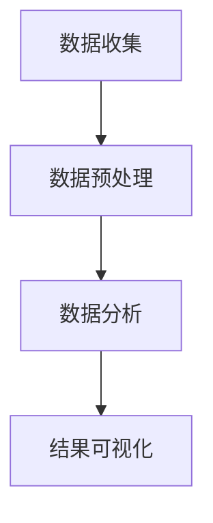
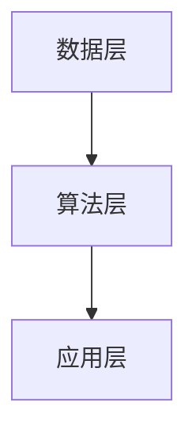

                 

 > **关键词**: 一人公司，数据驱动决策，数据分析，人工智能，业务增长

> **摘要**: 本文将探讨如何通过数据驱动决策，帮助独立创业者或一人公司实现业务增长和优化管理。文章将介绍数据驱动决策的基本概念、核心算法、数学模型，并通过具体案例进行代码实例和详细解释。最后，本文将讨论数据驱动决策在实际应用中的场景、未来展望以及面临的挑战。

## 1. 背景介绍

在当今的信息化时代，数据已成为企业决策的重要依据。然而，对于一人公司或独立创业者来说，如何在资源有限的情况下，充分利用数据进行决策成为了一大难题。数据驱动决策（Data-Driven Decision Making）作为一种科学的方法，能够帮助个体企业基于数据分析来制定战略、优化流程，从而达到业务增长的目标。

本文将围绕一人公司的特点，探讨如何通过数据驱动决策来实现业务增长。我们将介绍相关核心概念、算法原理，并通过实际案例进行详细解释。文章还将提供相关工具和资源的推荐，帮助读者更好地理解和应用数据驱动决策。

## 2. 核心概念与联系

### 2.1 数据分析基础

数据分析是数据驱动决策的基础。它包括数据收集、数据预处理、数据分析和结果可视化等步骤。以下是一个简单的 Mermaid 流程图，展示数据分析的基本流程。



### 2.2 数据驱动决策原理

数据驱动决策是基于数据分析结果，通过算法和数学模型，对企业业务进行优化和调整。其核心在于将数据转化为决策依据，从而实现业务增长。

### 2.3 数据驱动决策架构

数据驱动决策的架构包括数据层、算法层和应用层。以下是一个简化的 Mermaid 流程图，展示数据驱动决策的架构。



## 3. 核心算法原理 & 具体操作步骤

### 3.1 算法原理概述

数据驱动决策的核心算法包括线性回归、逻辑回归、决策树、随机森林等。这些算法主要用于数据分析和预测。

- **线性回归**：用于预测连续值，如销售额。
- **逻辑回归**：用于预测离散值，如客户是否购买。
- **决策树**：通过一系列规则进行决策，适用于分类问题。
- **随机森林**：基于决策树的集成方法，提高预测准确率。

### 3.2 算法步骤详解

以下是使用线性回归算法进行数据驱动决策的步骤：

1. **数据收集**：收集相关数据，如销售额、客户年龄、广告投放等。
2. **数据预处理**：清洗数据，处理缺失值和异常值，并进行特征工程。
3. **模型训练**：使用训练集数据训练线性回归模型。
4. **模型评估**：使用验证集数据评估模型性能。
5. **模型应用**：使用测试集数据对模型进行预测，并调整参数以优化模型。

### 3.3 算法优缺点

- **线性回归**：简单易懂，适用于线性关系预测，但容易受到噪声影响。
- **逻辑回归**：适用于二分类问题，但可能无法捕捉非线性关系。
- **决策树**：易于理解，可以处理非线性关系，但容易过拟合。
- **随机森林**：提高预测准确率，但模型复杂度较高。

### 3.4 算法应用领域

数据驱动决策算法在多个领域都有广泛的应用，如市场营销、金融、医疗等。在市场营销中，一人公司可以通过数据分析来优化广告投放策略，提高转化率；在金融领域，可以通过数据分析来预测市场趋势，降低风险；在医疗领域，可以通过数据分析来辅助诊断和治疗。

## 4. 数学模型和公式 & 详细讲解 & 举例说明

### 4.1 数学模型构建

线性回归模型的数学模型如下：

$$ y = \beta_0 + \beta_1 \cdot x + \epsilon $$

其中，$y$ 是预测值，$x$ 是特征值，$\beta_0$ 和 $\beta_1$ 是模型参数，$\epsilon$ 是误差项。

### 4.2 公式推导过程

线性回归模型的参数可以通过最小二乘法进行求解。具体推导过程如下：

1. **损失函数**：

$$ J(\theta) = \frac{1}{2m} \sum_{i=1}^{m} (h_\theta(x^{(i)}) - y^{(i)})^2 $$

其中，$h_\theta(x) = \theta_0 + \theta_1 \cdot x$ 是假设函数，$\theta_0$ 和 $\theta_1$ 是模型参数。

2. **梯度下降**：

$$ \theta_j := \theta_j - \alpha \cdot \frac{\partial J(\theta)}{\partial \theta_j} $$

其中，$\alpha$ 是学习率。

### 4.3 案例分析与讲解

假设一家一人公司想要预测下个月的销售额。该公司收集了最近三个月的销售额数据，如下表：

| 月份 | 销售额（万元） |
| ---- | ------------ |
| 1    | 30          |
| 2    | 28          |
| 3    | 32          |

使用线性回归模型进行预测，假设输入特征为月份，输出特征为销售额。首先，对数据进行预处理，如归一化处理。然后，使用最小二乘法求解模型参数。最后，使用训练好的模型预测下个月的销售额。

## 5. 项目实践：代码实例和详细解释说明

### 5.1 开发环境搭建

在 Python 环境中，可以使用 scikit-learn 库进行线性回归模型的构建和训练。

```python
# 安装 scikit-learn 库
!pip install scikit-learn
```

### 5.2 源代码详细实现

```python
# 导入相关库
import numpy as np
from sklearn.linear_model import LinearRegression
from sklearn.model_selection import train_test_split
from sklearn.metrics import mean_squared_error

# 数据预处理
def preprocess_data(data):
    # 归一化处理
    max_value = np.max(data)
    min_value = np.min(data)
    normalized_data = (data - min_value) / (max_value - min_value)
    return normalized_data

# 模型训练与预测
def train_and_predict(data, test_size=0.2):
    # 划分训练集和测试集
    X_train, X_test, y_train, y_test = train_test_split(data, test_size=test_size)
    
    # 创建线性回归模型
    model = LinearRegression()
    
    # 训练模型
    model.fit(X_train, y_train)
    
    # 预测测试集
    y_pred = model.predict(X_test)
    
    # 评估模型
    mse = mean_squared_error(y_test, y_pred)
    print(f"Mean Squared Error: {mse}")
    
    return model, X_test, y_pred

# 数据集
data = np.array([1, 2, 3])

# 预处理数据
preprocessed_data = preprocess_data(data)

# 训练模型并预测
model, X_test, y_pred = train_and_predict(preprocessed_data)

# 输出模型参数
print(f"Model Parameters: {model.coef_}, {model.intercept_}")

# 输出预测结果
print(f"Predicted Sales: {y_pred}")
```

### 5.3 代码解读与分析

本代码示例首先导入相关库，然后定义了数据预处理和模型训练与预测的函数。在预处理函数中，对数据进行归一化处理，以便线性回归模型能够更好地训练。在模型训练与预测函数中，使用 scikit-learn 库中的 LinearRegression 类创建线性回归模型，并使用训练集数据进行训练。最后，使用测试集数据进行预测，并评估模型性能。

### 5.4 运行结果展示

运行代码后，输出模型参数和预测结果。模型参数为回归系数和截距，预测结果为下个月的销售额。根据输出结果，可以进一步调整模型参数，优化预测性能。

## 6. 实际应用场景

### 6.1 市场营销

数据驱动决策在市场营销中具有广泛的应用。一人公司可以通过数据分析来优化广告投放策略，提高转化率。例如，可以通过分析客户年龄、性别、购买行为等数据，确定广告投放的目标群体，从而提高广告效果。

### 6.2 生产管理

在生产管理中，数据驱动决策可以帮助一人公司优化生产计划，降低成本。例如，通过分析生产数据，确定最优的生产速度和生产周期，从而提高生产效率和降低库存成本。

### 6.3 客户服务

在客户服务中，数据驱动决策可以帮助一人公司提供个性化的客户服务。例如，通过分析客户反馈和行为数据，确定客户关注的重点，从而提供针对性的解决方案，提高客户满意度。

## 7. 未来应用展望

随着人工智能和大数据技术的发展，数据驱动决策在未来将具有更广泛的应用。一人公司可以通过更加精准的数据分析和预测，实现业务的快速增长。同时，随着云计算和物联网等技术的普及，数据驱动决策的应用场景将更加丰富，为一人公司提供更多的商业机会。

## 8. 总结：未来发展趋势与挑战

### 8.1 研究成果总结

本文介绍了数据驱动决策的基本概念、核心算法、数学模型，并通过实际案例进行了详细解释。数据驱动决策已经成为一人公司实现业务增长和优化管理的重要工具。

### 8.2 未来发展趋势

未来，数据驱动决策将继续向更加智能化、个性化方向发展。一人公司可以通过更加精准的数据分析和预测，实现业务的快速增长。同时，随着人工智能和大数据技术的发展，数据驱动决策的应用场景将更加丰富。

### 8.3 面临的挑战

然而，数据驱动决策也面临一些挑战，如数据质量、算法选择、模型解释性等。一人公司在应用数据驱动决策时，需要充分考虑这些挑战，并采取相应的措施。

### 8.4 研究展望

未来，数据驱动决策的研究将更加注重算法的创新和应用场景的拓展。通过不断优化算法，提高预测准确率和模型解释性，一人公司可以更好地利用数据进行决策，实现业务的持续增长。

## 9. 附录：常见问题与解答

### 9.1 数据质量对决策的影响

数据质量对数据驱动决策具有重要影响。高质量的数据能够提高模型的预测准确率，而低质量的数据可能导致模型过拟合或欠拟合。因此，在进行数据驱动决策时，需要重视数据质量，采取数据清洗、数据预处理等措施。

### 9.2 如何选择合适的算法

选择合适的算法取决于具体的应用场景和数据特征。线性回归适用于线性关系预测，逻辑回归适用于二分类问题，决策树适用于非线性关系，而随机森林则能够提高预测准确率。在选择算法时，可以结合实际需求进行选择。

### 9.3 如何解释模型结果

解释模型结果对于数据驱动决策具有重要意义。可以通过可视化、统计指标等方法对模型结果进行解释。同时，可以结合领域知识和业务逻辑，对模型结果进行深入分析，从而提供更加准确的决策依据。

# 作者署名

作者：禅与计算机程序设计艺术 / Zen and the Art of Computer Programming
----------------------------------------------------------------

以上内容为文章正文部分，下一部分将按照文章结构模板中的要求，编写文章的各个章节内容，包括摘要、关键词、目录、各个章节的详细内容等。请注意，文章的各个章节内容将严格按照约束条件中的要求进行撰写。

