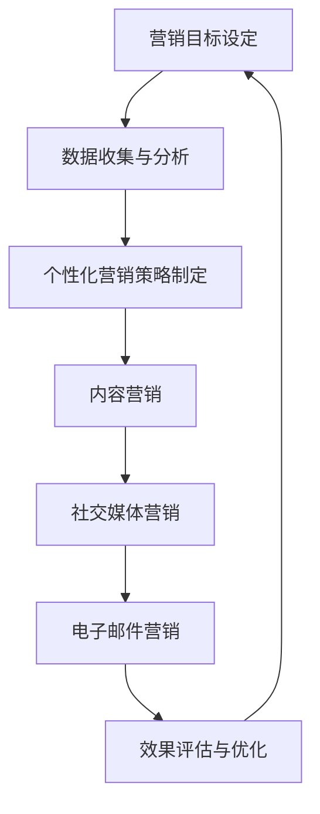

                 

关键词：数字化营销、自动化、效果优化、一人公司、营销策略、客户关系管理、数据分析、人工智能、营销自动化工具

> 摘要：在竞争激烈的市场环境中，一人公司面临着资源有限、时间紧迫的挑战。本文将探讨如何利用数字化营销自动化工具和策略，实现营销活动的优化和效果提升，为一人公司提供可持续增长的方法。

## 1. 背景介绍

随着互联网技术的快速发展，数字化营销已经成为企业获取客户和增加收入的必备手段。然而，对于一人公司而言，由于资源和时间的限制，实现高效的数字化营销活动显得尤为重要。一人公司通常需要面对以下挑战：

- **资源有限**：一人公司通常只有有限的人力、财力和技术资源，无法像大公司一样开展全面的营销活动。
- **时间紧迫**：一人公司需要快速响应市场变化和客户需求，以便在竞争中获得优势。
- **营销效果难以衡量**：由于缺乏系统化的营销数据，一人公司难以评估营销活动的效果，从而无法进行有效的优化。

为了解决这些问题，一人公司需要借助数字化营销自动化工具和策略，提高营销效率，优化营销效果。本文将探讨如何实现这一目标。

## 2. 核心概念与联系

### 2.1 数字化营销自动化

数字化营销自动化是指通过技术手段，自动化执行营销策略和活动。它包括以下核心概念：

- **营销自动化工具**：如电子邮件营销、社交媒体管理、客户关系管理（CRM）等工具。
- **数据收集与分析**：通过数据分析，了解客户行为和偏好，为营销活动提供依据。
- **个性化营销**：根据客户数据，实现个性化内容和推荐，提高客户体验和转化率。

### 2.2 营销策略与效果优化

营销策略是指为了实现营销目标而制定的一系列行动和措施。效果优化则是指通过分析营销数据，不断调整和改进营销策略，以实现更好的营销效果。

一人公司需要建立以下营销策略：

- **目标设定**：明确营销目标，如增加客户数量、提高转化率等。
- **内容营销**：通过高质量的内容吸引目标客户，建立品牌认知。
- **社交媒体营销**：利用社交媒体平台，扩大品牌影响力，与客户互动。
- **电子邮件营销**：通过邮件发送有价值的内容，与客户保持联系。

### 2.3 Mermaid 流程图

下面是一个简化的数字化营销自动化流程图，用于描述一人公司如何实现营销活动的自动化与优化。



## 3. 核心算法原理 & 具体操作步骤

### 3.1 算法原理概述

数字化营销自动化的核心算法原理包括以下几个方面：

- **数据分析**：利用数据挖掘技术，从大量数据中提取有价值的信息，如客户行为、偏好等。
- **机器学习**：通过机器学习算法，建立模型，预测客户行为，实现个性化推荐。
- **自然语言处理**：利用自然语言处理技术，分析文本内容，生成相关标签、关键词等。
- **自动化执行**：通过自动化工具，执行营销策略和活动，提高效率。

### 3.2 算法步骤详解

#### 3.2.1 数据收集与分析

1. **数据收集**：通过网站分析、社交媒体监听、客户调查等方式，收集客户数据。
2. **数据清洗**：对收集的数据进行清洗，去除重复、错误和无效数据。
3. **数据存储**：将清洗后的数据存储到数据库中，以便后续分析。

#### 3.2.2 个性化营销策略制定

1. **数据预处理**：对数据进行分析，提取有用信息，如用户年龄、性别、兴趣等。
2. **模型训练**：利用机器学习算法，如决策树、随机森林、神经网络等，建立模型。
3. **模型评估**：通过交叉验证等方法，评估模型性能。

#### 3.2.3 内容营销

1. **内容规划**：根据客户数据和模型预测，制定内容规划。
2. **内容创作**：创作高质量、有价值的内容。
3. **内容发布**：通过社交媒体、电子邮件等方式，发布内容。

#### 3.2.4 社交媒体营销

1. **平台选择**：根据目标客户的特点，选择合适的社交媒体平台。
2. **内容发布**：发布有价值、吸引人的内容。
3. **互动管理**：与客户互动，回答问题，解决疑虑。

#### 3.2.5 电子邮件营销

1. **邮件列表构建**：收集邮件地址，构建邮件列表。
2. **邮件内容规划**：根据客户数据和模型预测，制定邮件内容规划。
3. **邮件发送**：定期发送有价值、有吸引力的邮件。

### 3.3 算法优缺点

#### 优点：

- **提高效率**：自动化工具可以节省大量时间和人力，提高营销效率。
- **个性化**：通过数据分析和机器学习，实现个性化推荐，提高客户体验和转化率。
- **实时调整**：根据实时数据，快速调整营销策略，优化效果。

#### 缺点：

- **初始成本**：需要投入一定的资金和人力资源，进行数据收集、处理和模型训练。
- **技术要求**：需要掌握一定的技术知识，如数据分析、机器学习等。

### 3.4 算法应用领域

数字化营销自动化算法广泛应用于以下领域：

- **电子商务**：通过个性化推荐，提高客户购买意愿和转化率。
- **金融行业**：通过客户行为分析，提高客户忠诚度和留存率。
- **旅游行业**：通过个性化推荐，提高客户满意度，增加预订量。
- **零售行业**：通过社交媒体营销，扩大品牌影响力，吸引更多客户。

## 4. 数学模型和公式 & 详细讲解 & 举例说明

### 4.1 数学模型构建

在数字化营销自动化中，常用的数学模型包括：

- **线性回归模型**：用于预测客户行为。
- **决策树模型**：用于分类和回归任务。
- **神经网络模型**：用于复杂的预测和分类任务。

### 4.2 公式推导过程

#### 线性回归模型

线性回归模型的公式为：

$$y = \beta_0 + \beta_1 \cdot x + \epsilon$$

其中，$y$ 是因变量，$x$ 是自变量，$\beta_0$ 和 $\beta_1$ 是模型参数，$\epsilon$ 是误差项。

#### 决策树模型

决策树模型的公式为：

$$f(x) = \sum_{i=1}^{n} \alpha_i \cdot g(x_i)$$

其中，$x$ 是输入特征，$g(x_i)$ 是特征 $x_i$ 的取值，$\alpha_i$ 是权重。

#### 神经网络模型

神经网络模型的公式为：

$$f(x) = \sigma(\sum_{i=1}^{n} \alpha_i \cdot x_i + \beta)$$

其中，$x$ 是输入特征，$\sigma$ 是激活函数，$\alpha_i$ 和 $\beta$ 是模型参数。

### 4.3 案例分析与讲解

#### 案例背景

一家电子商务公司希望通过个性化推荐，提高客户购买意愿和转化率。

#### 数据集

该公司的客户数据包括：年龄、性别、收入、购物历史等。

#### 模型选择

选择线性回归模型进行预测。

#### 模型训练

使用训练集数据，对模型进行训练，得到参数 $\beta_0$ 和 $\beta_1$。

#### 模型评估

使用测试集数据，评估模型性能，计算预测误差。

#### 模型应用

将模型应用到实际场景中，为每位客户推荐个性化的商品。

## 5. 项目实践：代码实例和详细解释说明

### 5.1 开发环境搭建

- **Python**：选择 Python 作为开发语言，因为它具有丰富的数据分析和机器学习库。
- **Jupyter Notebook**：使用 Jupyter Notebook 进行代码编写和展示。
- **NumPy、Pandas、Scikit-learn**：安装必要的 Python 库，用于数据操作、分析和建模。

### 5.2 源代码详细实现

```python
import numpy as np
import pandas as pd
from sklearn.linear_model import LinearRegression
from sklearn.model_selection import train_test_split
from sklearn.metrics import mean_squared_error

# 5.2.1 数据收集
data = pd.read_csv('customer_data.csv')

# 5.2.2 数据预处理
data.drop_duplicates(inplace=True)
data.fillna(data.mean(), inplace=True)

# 5.2.3 模型训练
X = data[['age', 'income']]
y = data['purchase']

X_train, X_test, y_train, y_test = train_test_split(X, y, test_size=0.2, random_state=42)

model = LinearRegression()
model.fit(X_train, y_train)

# 5.2.4 模型评估
y_pred = model.predict(X_test)
mse = mean_squared_error(y_test, y_pred)
print('MSE:', mse)

# 5.2.5 模型应用
def predict_purchase(age, income):
    return model.predict([[age, income]])[0]

# 5.2.6 测试
print(predict_purchase(30, 50000))
```

### 5.3 代码解读与分析

上述代码分为以下几个部分：

- **数据收集**：读取客户数据，并进行预处理，如去除重复值、填充缺失值等。
- **模型训练**：使用线性回归模型，对训练集数据进行训练。
- **模型评估**：使用测试集数据，评估模型性能，计算预测误差。
- **模型应用**：定义一个函数，用于预测客户的购买意愿。

### 5.4 运行结果展示

运行代码，输出预测误差和客户购买意愿预测结果。根据预测结果，可以对营销策略进行调整，提高营销效果。

## 6. 实际应用场景

### 6.1 电子商务行业

电子商务公司可以利用数字化营销自动化，为每位客户推荐个性化的商品。通过分析客户数据和购买历史，提高客户购买意愿和转化率。

### 6.2 金融行业

金融行业可以利用数字化营销自动化，进行客户行为分析，预测客户需求，提供个性化金融产品和服务，提高客户满意度和忠诚度。

### 6.3 旅游行业

旅游行业可以利用数字化营销自动化，为游客推荐个性化的旅游产品。通过分析游客数据和偏好，提高游客满意度，增加预订量。

### 6.4 零售行业

零售行业可以利用数字化营销自动化，优化库存管理和销售策略。通过分析客户数据和购买行为，提高库存利用率，降低库存成本。

## 7. 工具和资源推荐

### 7.1 学习资源推荐

- **《Python数据分析》**：详细讲解 Python 在数据分析中的应用，适合初学者。
- **《机器学习实战》**：介绍机器学习的基本概念和实战应用，适合入门级读者。

### 7.2 开发工具推荐

- **Jupyter Notebook**：用于编写和展示代码，方便数据分析和建模。
- **Google Colab**：基于 Jupyter Notebook 的在线开发环境，适用于云端计算。

### 7.3 相关论文推荐

- **“Automated Personalized Email Marketing: An Overview”**：对自动化个性化邮件营销进行概述。
- **“A Survey on Customer Relationship Management”**：对客户关系管理进行综述。

## 8. 总结：未来发展趋势与挑战

### 8.1 研究成果总结

本文探讨了如何利用数字化营销自动化工具和策略，实现一人公司的营销优化。主要成果包括：

- **核心概念与联系**：介绍了数字化营销自动化的核心概念和流程。
- **算法原理与步骤**：详细讲解了数字化营销自动化的算法原理和操作步骤。
- **数学模型与公式**：构建了数学模型，并进行了公式推导和案例分析。
- **项目实践与解释**：提供了代码实例和详细解释，展示了实际应用场景。

### 8.2 未来发展趋势

未来，数字化营销自动化将继续发展，主要趋势包括：

- **人工智能技术的融合**：利用深度学习和强化学习等技术，实现更精准的个性化推荐和预测。
- **跨渠道营销**：整合线上线下渠道，实现无缝的营销体验。
- **数据隐私与合规**：关注数据隐私和合规问题，确保营销活动的合法性和安全性。

### 8.3 面临的挑战

数字化营销自动化在应用过程中，仍将面临以下挑战：

- **技术门槛**：需要掌握一定的技术知识，如编程、数据分析、机器学习等。
- **数据质量**：数据质量和数据完整性直接影响模型的效果，需要确保数据的质量。
- **合规与隐私**：需要遵守相关法律法规，确保营销活动的合法性和客户隐私。

### 8.4 研究展望

未来，研究方向可以包括：

- **多模态数据融合**：结合文本、图像、音频等多种数据类型，实现更全面的客户分析。
- **自适应营销策略**：根据客户行为和反馈，实时调整营销策略，提高效果。
- **可持续营销**：关注环境和社会责任，实现可持续的营销模式。

## 9. 附录：常见问题与解答

### 问题 1：数字化营销自动化需要哪些技术技能？

解答：数字化营销自动化需要掌握以下技术技能：

- 编程：熟悉 Python、R 等编程语言。
- 数据分析：掌握数据分析工具和库，如 Pandas、NumPy、Scikit-learn 等。
- 机器学习：了解机器学习算法，如线性回归、决策树、神经网络等。
- 数据库管理：了解数据库技术，如 MySQL、PostgreSQL 等。

### 问题 2：如何确保数据质量？

解答：确保数据质量的方法包括：

- 数据收集：选择可靠的数据源，确保数据的真实性和完整性。
- 数据清洗：去除重复、错误和无效数据，填充缺失值。
- 数据验证：对数据进行验证，确保数据的一致性和准确性。
- 数据监控：建立数据监控机制，及时发现和处理数据质量问题。

### 问题 3：数字化营销自动化是否适合所有企业？

解答：数字化营销自动化适合大多数企业，尤其是：

- 资源有限的企业：提高营销效率，节省人力和时间。
- 数据驱动型企业：利用数据分析，优化营销策略和效果。
- 想要实现个性化营销的企业：提高客户体验和转化率。

但对于数据和技术资源非常有限的企业，可能需要考虑其他营销策略。

# 作者署名

作者：禅与计算机程序设计艺术 / Zen and the Art of Computer Programming

