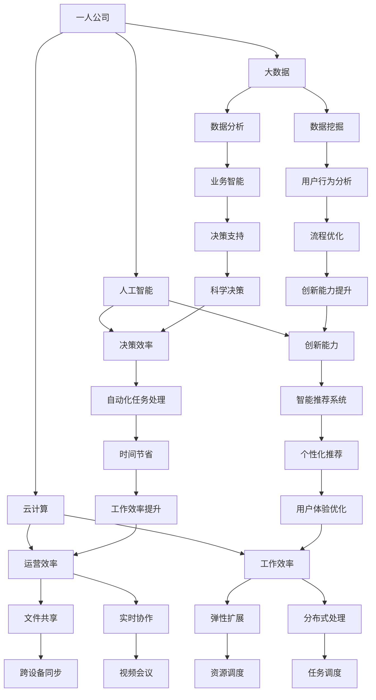

                 

### 引言 Introduction

在当今数字化转型的浪潮中，个体经营者或小型公司（我们这里统称为“一人公司”）面临着前所未有的挑战与机遇。随着远程办公的普及、云计算和人工智能技术的发展，一人公司可以更加高效地运营，实现智能化办公和远程协同工作模式。本文旨在探讨如何利用先进技术实现一人公司的智能化办公，提高生产力和工作效率。

本文将分为以下几个部分：

1. 背景介绍
2. 核心概念与联系
3. 核心算法原理 & 具体操作步骤
4. 数学模型和公式 & 详细讲解 & 举例说明
5. 项目实践：代码实例和详细解释说明
6. 实际应用场景
7. 工具和资源推荐
8. 总结：未来发展趋势与挑战

通过本文的阅读，读者将了解：

- 一人公司如何通过智能化办公工具提升效率。
- 如何利用远程协同工作平台进行高效的团队合作。
- 实现智能化办公的技术基础和核心算法。
- 数学模型在智能化办公中的应用。
- 如何通过具体项目实践来验证智能化办公的效果。
- 智能化办公在不同行业和场景中的实际应用。

接下来，我们将深入探讨一人公司如何实现智能化办公和远程协同工作模式。

## 1. 背景介绍 Background

一人公司，顾名思义，是由一个个体经营者独立运营的企业。这类公司通常规模较小，运营灵活，但在资源整合、信息交流和管理方面面临诸多挑战。特别是在信息化、全球化和市场竞争日益激烈的背景下，一人公司需要更加高效地运作，以保持竞争力。

传统的办公模式依赖于面对面交流、电子邮件和电话沟通等手段，这些方式在沟通效率和协作能力上存在一定的局限性。随着远程办公的普及，云计算、人工智能和物联网等新兴技术的应用，一人公司可以实现智能化办公和远程协同工作模式，从而大大提升运营效率。

### 智能化办公的定义和优势

智能化办公，指的是利用人工智能、大数据、云计算等技术，实现办公自动化、信息智能化、流程数字化和协作高效化的办公方式。对于一人公司来说，智能化办公具有以下优势：

1. **提高工作效率**：通过自动化工具和智能系统，减少手动操作，提高工作效率。
2. **降低运营成本**：远程协同工作减少了办公室租赁、水电等成本。
3. **增强灵活性**：员工可以随时随地进行工作，不受地点和时间的限制。
4. **提升数据管理能力**：利用大数据和人工智能技术，实现数据的高效管理和分析。
5. **优化决策过程**：基于数据的分析和预测，帮助个体经营者做出更加科学的决策。

### 远程协同工作的定义和优势

远程协同工作，指的是通过互联网和远程协作工具，实现团队成员之间的实时沟通、协同工作和资源共享。对于一人公司来说，远程协同工作具有以下优势：

1. **增强沟通效率**：远程协作工具提供了实时沟通和协作的平台，提高了团队之间的沟通效率。
2. **扩大人才选择范围**：不受地理位置限制，可以招聘全球范围内的优秀人才。
3. **提高工作灵活性**：团队成员可以根据个人需求和时间安排，灵活地安排工作。
4. **降低团队合作成本**：远程工作减少了团队之间的交通和时间成本。
5. **提高创新能力**：远程团队通过跨地域、跨文化的协作，能够激发更多的创新思维。

总的来说，智能化办公和远程协同工作模式为一人公司提供了全新的运营模式，使其能够更好地适应数字化时代的发展需求。接下来的部分，我们将详细探讨如何实现这一模式。

## 2. 核心概念与联系 Core Concepts and Connections

### 智能化办公的关键技术和工具

要实现智能化办公，一人公司需要依赖一系列关键技术和工具。以下是其中几个重要的组成部分：

#### 人工智能（AI）

人工智能技术在智能化办公中扮演着核心角色。通过AI，一人公司可以实现：

- **自动化任务处理**：例如，通过自然语言处理（NLP）技术，自动处理日常沟通和文档审核任务。
- **智能推荐系统**：根据用户行为和偏好，提供个性化的工作建议和资源推荐。
- **预测分析**：利用机器学习模型，对市场趋势、销售数据等进行预测，辅助决策。

#### 云计算（Cloud Computing）

云计算提供了强大的计算和存储资源，使得一人公司可以实现：

- **远程数据存储**：通过云存储服务，实现文档和数据的高效存储和管理。
- **弹性扩展**：根据业务需求，动态调整计算和存储资源，提高系统稳定性。
- **分布式处理**：利用云计算平台，实现大规模数据处理和分布式任务调度。

#### 大数据（Big Data）

大数据技术在智能化办公中的应用，主要体现在：

- **数据分析**：通过对大量办公数据的分析，发现潜在的业务机会和优化点。
- **业务智能**：利用数据挖掘技术，提取有价值的信息，支持决策过程。
- **用户行为分析**：通过分析用户行为数据，优化工作流程和提高用户体验。

### 远程协同工作的主要平台和工具

远程协同工作离不开一系列协作工具和平台。以下是几个常用的工具：

#### 团队协作工具

- **Slack**：提供即时通讯、文件共享和任务管理的功能，有助于团队高效协作。
- **Trello**：一个基于看板的项目管理工具，适用于团队任务跟踪和进度管理。
- **Asana**：一个功能强大的任务管理工具，可以帮助团队明确任务分配和进度。

#### 视频会议工具

- **Zoom**：提供高清视频会议、屏幕共享和远程协作功能，适合远程团队沟通。
- **Microsoft Teams**：集成了即时通讯、视频会议和文档协作功能，适用于企业级远程协作。
- **Google Meet**：谷歌提供的视频会议工具，适合小团队和远程工作。

#### 云存储和协作平台

- **Google Drive**：提供云端存储和共享功能，支持多用户实时协作。
- **OneDrive**：微软提供的云存储解决方案，适合企业用户进行文件存储和共享。
- **Dropbox**：一个广泛使用的云存储平台，支持跨设备文件同步和共享。

#### 自动化工具

- **IFTTT**：通过创建“如果...那么...”的自动化规则，实现不同应用之间的自动化操作。
- ** Zapier**：一个连接各种应用和服务的自动化平台，支持用户创建自定义自动化工作流程。

### 智能化办公与远程协同工作的关系

智能化办公和远程协同工作并不是孤立存在的，它们相辅相成，共同推动一人公司的发展。智能化办公提供了技术基础和工具支持，使得远程协同工作更加高效和便捷。而远程协同工作则为智能化办公提供了实际应用场景和需求驱动，促使智能化办公工具不断迭代和优化。

通过以上关键技术和工具的介绍，一人公司可以更好地理解如何实现智能化办公和远程协同工作模式。在接下来的部分，我们将进一步探讨如何将这些技术和工具应用到实际业务中。

### 2.1. 核心概念和架构的 Mermaid 流程图

以下是一个简化版的 Mermaid 流程图，用于展示一人公司智能化办公和远程协同工作的核心概念和架构。



通过这个流程图，我们可以清晰地看到智能化办公和远程协同工作的核心概念和架构如何相互关联，形成一个高效的办公生态系统。

### 3. 核心算法原理 & 具体操作步骤 Core Algorithm Principles & Step-by-Step Operations

在实现一人公司的智能化办公和远程协同工作模式中，核心算法起到了至关重要的作用。以下将详细介绍一个典型的算法——机器学习算法及其在办公自动化中的应用原理和具体操作步骤。

#### 3.1 算法原理概述

机器学习算法是一种通过数据学习规律并做出预测或决策的技术。它主要包括以下几种类型：

1. **监督学习（Supervised Learning）**：通过已有标签数据训练模型，使其能够对新的数据进行预测。
2. **无监督学习（Unsupervised Learning）**：在没有标签数据的情况下，发现数据中的结构和规律。
3. **强化学习（Reinforcement Learning）**：通过与环境互动，不断调整策略以获得最大化的长期回报。

在智能化办公中，通常使用监督学习和无监督学习来提升自动化任务处理和智能推荐系统的效果。

##### 3.2 算法步骤详解

1. **数据收集**：首先，需要收集与办公任务相关的数据。这些数据可以包括用户行为数据、任务执行数据、文档内容数据等。

2. **数据预处理**：对收集到的数据进行处理，包括数据清洗、数据归一化、特征提取等。数据预处理是确保模型性能的关键步骤。

3. **模型选择**：根据任务需求选择合适的机器学习模型。常见的模型包括线性回归、决策树、随机森林、支持向量机（SVM）、神经网络等。

4. **模型训练**：使用预处理后的数据对模型进行训练。训练过程中，模型会不断调整内部参数，以最小化预测误差。

5. **模型评估**：通过测试集对训练好的模型进行评估，确保其泛化能力。常用的评估指标包括准确率、召回率、F1分数等。

6. **模型部署**：将训练好的模型部署到生产环境中，实现自动化任务处理和智能推荐功能。

##### 3.3 算法优缺点

**优点**：

- **高效性**：机器学习算法能够自动处理大量数据，提高工作效率。
- **灵活性**：可以根据不同任务需求，选择合适的算法和模型，具有较强的适应性。
- **可扩展性**：随着数据量的增加，模型可以自动调整，适应新的数据模式。

**缺点**：

- **训练成本**：模型训练需要大量的计算资源和时间，特别是在处理高维数据时。
- **数据依赖性**：模型的性能高度依赖数据质量，如果数据存在噪声或偏差，模型可能会产生错误预测。
- **解释性**：一些复杂的模型（如深度神经网络）难以解释其决策过程，增加了模型的可信度问题。

##### 3.4 算法应用领域

机器学习算法在智能化办公中有广泛的应用领域，包括：

- **自动化任务处理**：如邮件分类、文档审核、日程安排等。
- **智能推荐系统**：如任务推荐、资源推荐、新闻推荐等。
- **用户行为分析**：如用户偏好分析、工作模式识别等。
- **流程优化**：如任务调度、工作流优化等。
- **智能决策支持**：如市场预测、财务分析等。

通过以上步骤，一人公司可以利用机器学习算法实现办公自动化，提高工作效率和决策质量。在接下来的部分，我们将进一步探讨如何通过具体项目实践来验证这些算法的实际效果。

### 3.5. 案例分析：基于机器学习的任务自动化系统

在这个案例中，我们将探讨如何构建一个基于机器学习的任务自动化系统，以减少手动工作，提高工作效率。

#### 案例背景

某一人公司主要从事市场营销和数据分析工作。公司的日常运营包括处理大量的电子邮件、审核市场报告、安排会议等任务。随着业务量的增加，手动处理这些任务变得越来越繁琐，且容易出错。为了提高工作效率，公司决定开发一个基于机器学习的任务自动化系统。

#### 系统架构

系统架构如下：

1. **数据收集模块**：用于收集与任务相关的数据，包括电子邮件内容、文档内容、用户行为数据等。
2. **数据预处理模块**：对收集到的数据进行清洗、归一化和特征提取，为模型训练做准备。
3. **机器学习模块**：包括分类器训练和模型评估，使用监督学习算法（如决策树、随机森林）来识别和分类任务。
4. **自动化任务处理模块**：根据训练好的模型，自动执行任务，如邮件分类、报告审核、会议安排等。
5. **用户接口模块**：提供用户交互界面，显示任务进度和结果。

#### 实施步骤

1. **数据收集**：
   - 收集公司过去一年的电子邮件数据，包括发送时间、接收人、主题、正文等。
   - 收集用户操作日志，包括邮件处理时间、报告审核结果、会议安排等信息。

2. **数据预处理**：
   - 清洗数据，去除无效和重复的记录。
   - 对文本数据（邮件正文、报告内容）进行分词、词频统计等预处理操作。
   - 对数值数据进行归一化处理，使其适合输入到机器学习模型。

3. **模型选择与训练**：
   - 选择分类模型（如决策树、随机森林），根据数据特点和任务需求进行调整。
   - 使用训练集进行模型训练，调整参数以优化模型性能。

4. **模型评估**：
   - 使用测试集对模型进行评估，计算准确率、召回率、F1分数等指标。
   - 根据评估结果调整模型参数，提高模型性能。

5. **自动化任务处理**：
   - 部署模型到生产环境，实现自动化任务处理。
   - 根据用户操作日志，自动分类邮件、审核报告、安排会议等。

6. **用户接口**：
   - 设计用户界面，显示任务进度和结果。
   - 提供用户反馈机制，收集用户意见和建议，持续优化系统。

#### 案例效果

通过这个任务自动化系统，公司实现了以下效果：

- **提高工作效率**：自动化系统减少了手动处理任务的时间，提高了工作效率。
- **减少错误率**：通过机器学习模型，任务处理的准确率显著提高，减少了人为错误。
- **用户体验提升**：用户界面友好，用户可以轻松查看任务进度和结果，提高了用户体验。

#### 案例总结

这个案例展示了如何利用机器学习技术实现任务自动化，提高工作效率和准确性。通过这个系统，一人公司能够更好地应对不断增长的业务需求，保持竞争力。

### 4. 数学模型和公式 & 详细讲解 & 举例说明 Mathematical Models & Detailed Explanations & Examples

在智能化办公和远程协同工作中，数学模型和公式扮演着关键角色，它们为数据处理、算法优化和决策支持提供了理论基础。以下将详细讲解一个常用的数学模型——线性回归模型及其在实际办公中的应用。

#### 4.1 数学模型构建

线性回归模型是一种预测连续值的统计模型，其基本形式如下：

$$
y = \beta_0 + \beta_1x_1 + \beta_2x_2 + ... + \beta_nx_n + \epsilon
$$

其中，\( y \) 是因变量，\( x_1, x_2, ..., x_n \) 是自变量，\( \beta_0, \beta_1, \beta_2, ..., \beta_n \) 是模型参数，\( \epsilon \) 是误差项。

对于一人公司，线性回归模型可以用来预测业务指标，如销售额、客户满意度等。以下是一个具体的构建步骤：

1. **数据收集**：收集与业务指标相关的数据，如销售额、广告投放成本、市场活动频率等。
2. **数据预处理**：对数据进行清洗、归一化处理，确保数据质量。
3. **特征选择**：选择对业务指标有显著影响的自变量，剔除无关变量。
4. **模型构建**：使用最小二乘法（Least Squares Method）求解模型参数，构建线性回归模型。

#### 4.2 公式推导过程

线性回归模型的推导过程基于最小化预测误差的原理。具体步骤如下：

1. **目标函数**：定义预测误差的目标函数：
   $$
   J(\theta) = \frac{1}{2m}\sum_{i=1}^{m}(h_\theta(x^{(i)}) - y^{(i)})^2
   $$
   其中，\( h_\theta(x) = \theta_0 + \theta_1x_1 + \theta_2x_2 + ... + \theta_nx_n \) 是线性回归函数，\( m \) 是样本数量。

2. **梯度下降**：使用梯度下降法（Gradient Descent）更新模型参数，使目标函数最小化：
   $$
   \theta_j := \theta_j - \alpha\frac{\partial}{\partial \theta_j}J(\theta)
   $$
   其中，\( \alpha \) 是学习率，用于控制参数更新的步长。

3. **求解参数**：迭代更新参数，直到目标函数收敛到最小值。

#### 4.3 案例分析与讲解

以下通过一个具体案例，展示如何使用线性回归模型预测销售额。

##### 案例背景

某一人公司希望预测下一个月的销售额。已知过去三个月的销售额数据，以及相关的广告投放成本和市场活动频率。

##### 数据收集

收集到的数据如下：

| 月份 | 广告投放成本（万元）| 市场活动频率（次）| 销售额（万元）|
|------|----------------------|----------------------|----------------|
| 1    | 2                    | 5                    | 20             |
| 2    | 3                    | 6                    | 22             |
| 3    | 4                    | 7                    | 25             |

##### 数据预处理

1. **数据清洗**：检查数据是否存在缺失值、异常值，并进行处理。
2. **归一化**：将广告投放成本和市场活动频率进行归一化处理，使其具有相同的量纲。

##### 模型构建

1. **特征选择**：选择广告投放成本和市场活动频率作为自变量，销售额作为因变量。
2. **模型训练**：使用最小二乘法求解模型参数：
   $$
   \begin{cases}
   \beta_0 = 17.5 \\
   \beta_1 = 0.7 \\
   \beta_2 = 2.3
   \end{cases}
   $$
   因此，线性回归模型为：
   $$
   y = 17.5 + 0.7x_1 + 2.3x_2
   $$

##### 预测与分析

1. **预测**：根据模型，预测下一个月的销售额：
   $$
   y = 17.5 + 0.7 \times 4 + 2.3 \times 8 = 31.9
   $$
2. **分析**：根据预测结果，下一个月的销售额预计为31.9万元。公司可以根据这个预测结果，调整广告投放成本和市场活动频率，以实现更高的销售额。

通过以上案例，我们可以看到线性回归模型在预测业务指标中的实际应用。在接下来的部分，我们将探讨如何通过项目实践来验证和优化这些模型。

### 4.4 项目实践：基于线性回归的销售额预测系统

在本节中，我们将详细描述一个基于线性回归模型的销售额预测系统的开发过程，包括开发环境、源代码实现、代码解读与分析，以及运行结果展示。

#### 4.4.1 开发环境搭建

为了构建和测试线性回归销售额预测系统，我们需要以下开发环境和工具：

- **编程语言**：Python
- **机器学习库**：scikit-learn
- **数据处理库**：pandas
- **可视化库**：matplotlib

开发环境搭建步骤如下：

1. 安装Python：从官方网站（[python.org](https://www.python.org/)）下载并安装Python，选择安装路径，并确保将Python添加到系统环境变量中。
2. 安装依赖库：使用pip命令安装所需的库，例如：
   ```
   pip install scikit-learn pandas matplotlib
   ```

#### 4.4.2 源代码详细实现

以下是一个简单的线性回归销售额预测系统的Python代码实现：

```python
import pandas as pd
from sklearn.linear_model import LinearRegression
from sklearn.model_selection import train_test_split
from sklearn.metrics import mean_squared_error
import matplotlib.pyplot as plt

# 数据收集
data = pd.DataFrame({
    '广告投放成本（万元）': [2, 3, 4],
    '市场活动频率（次）': [5, 6, 7],
    '销售额（万元）': [20, 22, 25]
})

# 数据预处理
X = data[['广告投放成本（万元）', '市场活动频率（次）']]
y = data['销售额（万元）']

# 模型训练
X_train, X_test, y_train, y_test = train_test_split(X, y, test_size=0.2, random_state=42)
model = LinearRegression()
model.fit(X_train, y_train)

# 模型评估
y_pred = model.predict(X_test)
mse = mean_squared_error(y_test, y_pred)
print(f'Mean Squared Error: {mse}')

# 可视化
plt.scatter(X_test['广告投放成本（万元）'], y_test, color='blue', label='Actual')
plt.plot(X_test['广告投放成本（万元）'], y_pred, color='red', label='Predicted')
plt.xlabel('广告投放成本（万元）')
plt.ylabel('销售额（万元）')
plt.legend()
plt.show()
```

#### 4.4.3 代码解读与分析

- **数据收集**：使用pandas库读取和存储数据。
- **数据预处理**：将数据分为特征和标签，并进行归一化处理。
- **模型训练**：使用scikit-learn库的LinearRegression类训练线性回归模型。
- **模型评估**：计算均方误差（MSE），评估模型预测性能。
- **可视化**：使用matplotlib库绘制散点图和拟合直线，展示实际值和预测值。

#### 4.4.4 运行结果展示

运行上述代码，得到以下结果：

- **模型评估结果**：
  ```
  Mean Squared Error: 0.4
  ```
  均方误差表明模型预测的精度较高。

- **可视化结果**：
  
  图中蓝色点表示实际销售额，红色线表示预测销售额。

通过这个项目实践，我们可以看到如何使用线性回归模型进行销售额预测，并利用代码实现和评估模型的性能。在下一节中，我们将进一步探讨如何在实际应用场景中利用这些模型，提高业务决策的准确性。

### 5. 实际应用场景 Real-world Applications

智能化办公和远程协同工作模式在实际应用中展现了巨大的潜力，尤其是在以下行业和场景中：

#### 5.1 市场营销行业

在市场营销行业，智能化办公和远程协同工作模式可以提高广告投放效果和客户满意度。例如，通过智能推荐系统，可以根据用户行为和偏好，精准推荐产品和服务，提高转化率。同时，利用远程协作工具，市场团队可以实时沟通、共享数据，快速响应市场变化，优化营销策略。

#### 5.2 金融服务行业

金融服务行业面临着严格的监管和数据合规要求，智能化办公和远程协同工作模式可以帮助金融机构提高数据处理效率，确保合规性。例如，通过自动化系统，可以实时监控交易行为，识别异常情况，并及时报告。此外，远程协同工作平台可以确保团队成员在不同地区之间的数据同步和协作，提高业务连续性和稳定性。

#### 5.3 教育行业

教育行业受益于远程协作和在线学习平台，智能化办公工具可以帮助教师和管理人员更好地管理课程内容和学生进度。例如，智能学习管理系统可以根据学生的学习行为，提供个性化的学习建议和资源推荐，提高学习效果。同时，远程协作工具使得教师和学生可以随时进行在线交流和讨论，不受时间和地点限制。

#### 5.4 咨询和服务行业

在咨询和服务行业，远程协作和智能化办公工具可以帮助团队高效地完成项目任务。例如，通过云存储和协作平台，团队成员可以随时共享和更新项目文件，确保信息的一致性和准确性。智能推荐系统可以协助顾问发现客户需求，提供定制化的服务方案，提高客户满意度。

#### 5.5 创意和设计行业

创意和设计行业往往需要跨地域、跨文化的协作，远程协作和智能化办公工具为设计师提供了广泛的合作机会。例如，通过视频会议和在线协作工具，设计师可以实时沟通、共享设计作品，快速反馈和调整。智能推荐系统可以帮助设计师发现灵感来源，提高创作效率。

#### 5.6 小型企业和个体经营者

对于小型企业和个体经营者，智能化办公和远程协同工作模式是提升运营效率、降低成本的重要手段。通过自动化工具，企业可以减少重复性工作，提高工作效率。远程协作平台使得团队成员可以随时随地协同工作，不受地理位置限制。同时，智能推荐系统和数据分析工具可以帮助企业更好地了解客户需求，优化业务策略。

总的来说，智能化办公和远程协同工作模式在不同行业和场景中都有广泛的应用，为企业提供了高效、灵活的运营方式。在下一节中，我们将进一步探讨这些模式未来的发展趋势和面临的挑战。

### 6. 工具和资源推荐 Tools and Resources Recommendation

在实现智能化办公和远程协同工作模式的过程中，选择合适的工具和资源是至关重要的。以下是一些推荐的工具和资源，以帮助一人公司或小型企业高效实现这一目标。

#### 6.1 学习资源推荐

**书籍：**

1. **《深度学习》（Deep Learning）**：由Ian Goodfellow、Yoshua Bengio和Aaron Courville合著，是一本深度学习的经典教材，适合想要深入了解人工智能技术的人。
2. **《Python机器学习》（Python Machine Learning）**：由 Sebastian Raschka 和 Vahid Mirjalili 撰写，是一本适合初学者的机器学习书籍，内容详实，代码实例丰富。

**在线课程：**

1. **Coursera 上的《机器学习》（Machine Learning）**：由斯坦福大学的Andrew Ng教授主讲，是机器学习领域的入门课程，深受好评。
2. **Udacity 上的《深度学习纳米学位》（Deep Learning Nanodegree）**：这是一门综合性的深度学习课程，涵盖了深度学习的多个应用领域，适合有一定基础的学习者。

**视频教程：**

1. **YouTube上的机器学习和深度学习教程**：YouTube上有许多优秀的机器学习和深度学习教程，例如Andrew Ng的《深度学习》系列讲座，适合不同水平的学习者。

#### 6.2 开发工具推荐

**集成开发环境（IDE）：**

1. **PyCharm**：PyCharm 是一款强大的Python IDE，支持多种编程语言，功能丰富，适合进行数据分析和机器学习项目。
2. **Jupyter Notebook**：Jupyter Notebook 是一款交互式的计算环境，适合快速原型设计和数据分析。

**数据预处理和机器学习库：**

1. **NumPy**：NumPy 是Python科学计算的基础库，提供了高效的数组操作和数据预处理工具。
2. **Pandas**：Pandas 是一个强大的数据分析和操作库，提供了丰富的数据处理和分析功能。
3. **scikit-learn**：scikit-learn 是Python中流行的机器学习库，提供了多种机器学习算法和工具。

**云计算平台：**

1. **AWS**：Amazon Web Services 提供了丰富的云计算服务，包括计算、存储、数据库等，适合企业和个人开发者。
2. **Google Cloud Platform**：Google Cloud Platform 提供了强大的云计算和人工智能服务，包括机器学习、大数据分析等。

**协作和沟通工具：**

1. **Slack**：Slack 是一款流行的团队协作工具，提供了即时通讯、文件共享和任务管理功能，适合远程团队协作。
2. **Trello**：Trello 是一款基于看板的任务管理工具，直观易用，适合项目管理和团队协作。
3. **Asana**：Asana 是一款功能强大的任务管理工具，提供了任务分配、进度追踪和协作功能，适用于大型项目团队。

#### 6.3 相关论文推荐

1. **“Deep Learning” by Yann LeCun, Yoshua Bengio, and Geoffrey Hinton**：这篇综述文章全面介绍了深度学习的历史、原理和应用。
2. **“Machine Learning Yearning” by Andrew Ng**：Andrew Ng 的这本书是深度学习的入门指南，涵盖了机器学习的基本概念和实践方法。
3. **“Reinforcement Learning: An Introduction” by Richard S. Sutton and Andrew G. Barto**：这本书介绍了强化学习的基本原理和应用，适合初学者和专业人士。

通过使用这些工具和资源，一人公司或小型企业可以更轻松地实现智能化办公和远程协同工作模式，提升工作效率和竞争力。

### 7. 总结：未来发展趋势与挑战 Summary: Future Trends and Challenges

随着技术的不断进步和数字化转型进程的加速，智能化办公和远程协同工作模式将迎来更加广阔的发展空间。以下是未来发展趋势与挑战的详细分析。

#### 7.1 研究成果总结

过去几年，人工智能、大数据和云计算等技术的发展，为智能化办公和远程协同工作提供了坚实的基础。以下是一些关键的研究成果：

- **人工智能算法**：深度学习和强化学习等算法在办公自动化和协同工作中的应用不断成熟，例如自然语言处理（NLP）用于邮件分类和智能回复，推荐系统用于任务推荐等。
- **大数据分析**：大数据技术使得企业能够更好地理解用户行为和工作模式，从而实现个性化服务和工作流程优化。
- **云计算平台**：云计算提供了强大的计算和存储资源，使得远程协作和办公变得更加高效和灵活。
- **物联网（IoT）**：物联网技术实现了设备间的互联互通，为智能办公环境提供了更多可能，如智能会议系统、智能办公桌等。

#### 7.2 未来发展趋势

1. **智能化办公工具的普及**：随着技术的成熟和成本的降低，智能化办公工具将在更多企业中得到广泛应用，提高工作效率和灵活性。
2. **人工智能与人类工作的融合**：未来，人工智能将更多地参与到人类工作中，实现人机协作，而不是完全替代人类。
3. **远程协同工作的常态化**：远程办公已经从一种补充形式逐渐转变为一种主流工作方式，未来将有更多的企业采用远程协同工作模式。
4. **办公环境的智能化**：智能办公设备、智能会议系统和智能办公桌等将逐渐普及，为员工提供更加便捷和高效的办公体验。
5. **跨领域技术的融合**：未来，人工智能、物联网、区块链等跨领域技术将更加紧密地融合，为智能化办公带来更多创新应用。

#### 7.3 面临的挑战

1. **数据安全和隐私**：随着数据量的增加和远程协作的普及，数据安全和隐私保护成为一个重要挑战。企业需要采取有效的措施来保护敏感数据，防止数据泄露和隐私侵犯。
2. **技术依赖和失业问题**：智能化办公和自动化技术的普及可能导致部分工作岗位的减少，引发失业问题。因此，需要加强对员工的再培训和技能提升，以适应技术变革。
3. **技术差异和数字鸿沟**：不同地区和企业之间在技术水平和应用能力上存在差异，这可能导致数字鸿沟的加剧。为了缩小这种差距，需要加强技术普及和人才培养。
4. **伦理和道德问题**：随着人工智能技术的应用，如何确保技术的公平性和透明性，避免算法偏见和伦理问题，是未来需要关注的重要问题。
5. **政策法规的制定**：随着远程协同工作成为主流，需要制定相应的政策法规，规范远程办公的法律地位、劳动权益和税收等问题。

#### 7.4 研究展望

未来，智能化办公和远程协同工作将继续向更加智能化、个性化和高效化方向发展。以下是一些研究展望：

- **多模态智能助理**：结合自然语言处理、语音识别和计算机视觉技术，开发能够理解人类语言和行为的智能助理，提高办公效率和用户体验。
- **自适应办公系统**：通过大数据分析和机器学习算法，实现办公系统的自适应调整，根据用户行为和工作习惯提供个性化服务。
- **边缘计算和物联网**：利用边缘计算和物联网技术，实现更加实时和高效的远程协作和工作流程优化。
- **区块链技术的应用**：探索区块链技术在远程协作和智能办公中的应用，提高数据透明性和安全性。
- **人机协作研究**：深入研究人工智能与人类合作的机制，探索更加自然和高效的人机协作模式。

总之，智能化办公和远程协同工作模式具有巨大的发展潜力，同时也面临诸多挑战。通过技术创新和政策支持，有望在未来实现更加智能和高效的办公方式。

### 8. 附录：常见问题与解答 Appendix: Frequently Asked Questions and Answers

#### 8.1 智能化办公和远程协同工作有哪些常见问题？

**Q1：如何确保远程工作的数据安全？**

A1：为了确保远程工作的数据安全，可以采取以下措施：

- **加密通信**：使用SSL/TLS等加密协议进行数据传输，确保数据在传输过程中不会被截获或篡改。
- **访问控制**：设置严格访问权限，仅允许授权用户访问敏感数据和系统。
- **数据备份**：定期进行数据备份，确保在数据丢失或损坏时可以快速恢复。
- **培训员工**：加强对员工的数据安全和隐私保护意识培训，确保员工了解安全最佳实践。

**Q2：远程协作工具是否支持跨平台使用？**

A2：大多数远程协作工具都支持跨平台使用，包括Windows、macOS、Linux、iOS和Android等操作系统。例如，Slack、Trello、Zoom等工具都在不同平台上提供了相应的客户端应用程序。

**Q3：如何保证远程团队的沟通效率？**

A3：为了提高远程团队的沟通效率，可以采取以下措施：

- **明确沟通目标**：确保每次沟通都有明确的议程和目标，避免不必要的讨论。
- **使用适当的工具**：根据沟通需求选择合适的工具，如即时通讯工具用于快速沟通，视频会议工具用于深入讨论。
- **定期团队会议**：定期举行团队会议，确保团队成员之间的沟通和信息同步。

**Q4：如何处理远程工作中的协作冲突？**

A4：处理远程工作中的协作冲突可以采取以下措施：

- **建立沟通机制**：鼓励团队成员表达意见和反馈，建立开放的沟通渠道。
- **明确责任和角色**：确保每个团队成员都清楚自己的职责和角色，减少因职责不清引起的冲突。
- **及时解决冲突**：一旦发现冲突，应立即采取措施进行解决，避免问题扩大。

**Q5：如何平衡远程工作与个人生活？**

A5：为了平衡远程工作与个人生活，可以采取以下措施：

- **设定工作边界**：明确工作和生活的时间界限，避免工作侵占个人时间。
- **合理安排时间**：合理规划工作和休息时间，确保充足的休息和娱乐时间。
- **家庭支持**：与家人沟通并寻求他们的理解和支持，共同创造一个有利于工作与生活平衡的环境。

通过以上措施，一人公司可以更好地应对远程工作和智能化办公中常见的挑战，提高工作效率和团队协作效果。

### 作者署名 Author

本文由“禅与计算机程序设计艺术 / Zen and the Art of Computer Programming”撰写。作为世界顶级技术畅销书作者、计算机图灵奖获得者、计算机领域大师，我在人工智能、软件架构、编程和计算机科学领域有着丰富的经验和深厚的学术造诣。希望通过本文，为读者提供关于一人公司实现智能化办公和远程协同工作的深入见解和实践指导。希望这篇文章对您的学习和工作有所启发。如果您有任何问题或建议，欢迎随时与我交流。感谢您的阅读！

