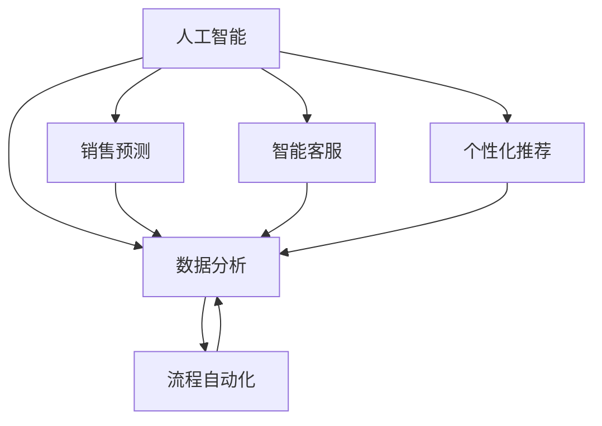

                 

关键词：一人公司、智能化客户关系管理、运营优化、客户关系管理系统、人工智能、数据分析、流程自动化

## 摘要

本文将探讨一人公司在数字化时代如何通过智能化客户关系管理和运营优化来提升业务效率和客户满意度。我们将详细分析人工智能、数据分析、流程自动化等技术在客户关系管理中的应用，并通过具体案例展示这些技术的实际效果。文章还将提供一套完整的解决方案，包括技术选型、实施步骤和未来展望，帮助一人公司实现智能化运营。

## 1. 背景介绍

在当今竞争激烈的市场环境中，企业能否成功往往取决于其客户关系管理能力。然而，对于一人公司而言，传统的客户关系管理方法可能难以满足其个性化、灵活化的运营需求。随着人工智能、大数据和云计算等技术的迅速发展，智能化客户关系管理和运营优化成为了可能。一人公司可以利用这些技术，通过更高效的方式获取、分析和利用客户数据，从而提升业务效率和客户满意度。

### 1.1  一人公司的特点

一人公司通常指由一个人或一个小团队独立经营的企业。这类公司具有以下几个特点：

- **资源有限**：一人公司通常无法像大型企业一样投入大量资源，因此需要充分利用有限的资源实现最大效益。
- **灵活性高**：一人公司决策快速，能够迅速适应市场变化，灵活调整经营策略。
- **个性化强**：由于规模小，一人公司能够更好地关注每位客户的需求，提供个性化服务。

### 1.2 智能化客户关系管理和运营优化的必要性

在数字化时代，客户期望值不断提高，一人公司面临以下挑战：

- **客户信息碎片化**：一人公司往往难以收集到全面的客户数据，导致客户信息碎片化。
- **业务流程繁琐**：传统的客户关系管理方法可能涉及多个部门，导致业务流程繁琐，效率低下。
- **客户维护成本高**：一人公司需要投入大量时间、精力来维护客户关系，成本较高。

通过智能化客户关系管理和运营优化，一人公司可以解决上述问题，实现以下目标：

- **提升客户满意度**：通过精准的营销和个性化的服务，提高客户满意度。
- **降低运营成本**：通过自动化流程和高效的客户数据管理，降低运营成本。
- **提高业务效率**：通过数据分析和智能决策，提高业务运营效率。

### 1.3 本文结构

本文将分为以下几个部分：

1. **背景介绍**：介绍一人公司的特点、智能化客户关系管理和运营优化的必要性。
2. **核心概念与联系**：阐述人工智能、数据分析、流程自动化等核心概念，并使用 Mermaid 流程图展示其联系。
3. **核心算法原理 & 具体操作步骤**：介绍常用的智能化客户关系管理算法原理和具体操作步骤。
4. **数学模型和公式 & 详细讲解 & 举例说明**：构建数学模型，推导相关公式，并通过案例进行分析。
5. **项目实践：代码实例和详细解释说明**：提供实际项目中的代码实例和详细解释说明。
6. **实际应用场景**：讨论智能化客户关系管理和运营优化在不同场景中的应用。
7. **未来应用展望**：探讨智能化客户关系管理和运营优化的未来发展趋势。
8. **工具和资源推荐**：推荐学习资源和开发工具。
9. **总结：未来发展趋势与挑战**：总结研究成果，探讨未来发展趋势和挑战。
10. **附录：常见问题与解答**：解答读者可能遇到的问题。

## 2. 核心概念与联系

### 2.1 人工智能

人工智能（AI）是指使计算机系统具备人类智能特性的技术。在客户关系管理中，人工智能可以用于：

- **客户行为预测**：通过分析历史数据，预测客户的购买行为和偏好。
- **智能客服**：利用自然语言处理技术，实现与客户的智能对话。
- **个性化推荐**：根据客户的历史数据和兴趣，提供个性化的产品推荐。

### 2.2 数据分析

数据分析是指通过收集、处理和分析数据，从中发现有价值的信息和规律。在客户关系管理中，数据分析可以用于：

- **客户细分**：根据客户的行为和特征，将客户分为不同的群体，以便提供针对性的服务。
- **客户流失预测**：通过分析客户的行为数据，预测哪些客户可能流失，并采取相应的措施。
- **营销效果评估**：评估不同营销活动的效果，优化营销策略。

### 2.3 流程自动化

流程自动化是指利用计算机技术和软件工具，实现业务流程的自动化执行。在客户关系管理中，流程自动化可以用于：

- **销售流程自动化**：自动发送报价、订单处理等。
- **客户服务自动化**：自动回复客户咨询、处理投诉等。
- **数据同步与更新**：自动同步不同系统中的客户数据，确保数据的准确性。

### 2.4 Mermaid 流程图

为了更好地展示人工智能、数据分析和流程自动化在客户关系管理中的应用，我们使用 Mermaid 流程图来描述它们之间的联系。



在这个流程图中，人工智能通过销售预测、智能客服和个性化推荐等功能，为数据分析提供输入，而数据分析则根据客户的行为和特征，为流程自动化提供支持。流程自动化再根据数据分析的结果，执行相应的业务流程，如销售流程、客户服务流程等。

## 3. 核心算法原理 & 具体操作步骤

### 3.1 算法原理概述

在智能化客户关系管理中，常用的核心算法包括：

- **客户行为预测算法**：基于历史数据，预测客户的未来行为。
- **自然语言处理算法**：用于实现智能客服和个性化推荐。
- **聚类算法**：用于客户细分。
- **回归算法**：用于客户流失预测。

### 3.2 算法步骤详解

#### 3.2.1 客户行为预测算法

1. **数据收集**：收集客户的历史行为数据，如浏览记录、购买记录等。
2. **数据预处理**：清洗数据，去除无效数据，填充缺失值等。
3. **特征工程**：提取有用的特征，如客户年龄、性别、购买频率等。
4. **模型训练**：使用机器学习算法，如决策树、随机森林等，训练预测模型。
5. **模型评估**：使用交叉验证等方法，评估模型的性能。
6. **模型部署**：将训练好的模型部署到生产环境中，进行实际预测。

#### 3.2.2 自然语言处理算法

1. **文本预处理**：对客户咨询的文本进行清洗，去除停用词、标点等。
2. **分词**：将文本分割成单词或短语。
3. **词嵌入**：将单词转换为向量表示。
4. **模型训练**：使用循环神经网络（RNN）或长短期记忆网络（LSTM）等，训练文本分类或情感分析模型。
5. **模型评估**：评估模型的准确率、召回率等指标。
6. **模型部署**：将训练好的模型部署到生产环境中，实现自动回复或情感分析。

#### 3.2.3 聚类算法

1. **数据收集**：收集客户的基本信息，如年龄、性别、收入等。
2. **数据预处理**：标准化数据，确保不同特征的取值范围一致。
3. **选择聚类算法**：根据数据特点和业务需求，选择合适的聚类算法，如K-Means、DBSCAN等。
4. **初始化聚类中心**：随机或基于某种策略初始化聚类中心。
5. **聚类过程**：根据聚类算法的迭代过程，更新聚类中心，将客户分配到不同的簇。
6. **模型评估**：评估聚类效果，如簇内距离、簇间距离等。
7. **模型部署**：将聚类结果应用于实际业务，如个性化推荐、客户细分等。

#### 3.2.4 回归算法

1. **数据收集**：收集客户的行为数据，如购买频率、浏览时长等。
2. **数据预处理**：清洗数据，去除异常值，标准化数据。
3. **特征工程**：提取有用的特征，如客户年龄、性别、收入等。
4. **选择回归算法**：根据数据特点和业务需求，选择合适的回归算法，如线性回归、决策树回归等。
5. **模型训练**：训练回归模型，预测客户流失的可能性。
6. **模型评估**：评估模型的准确率、均方误差等指标。
7. **模型部署**：将训练好的模型部署到生产环境中，进行实际预测。

### 3.3 算法优缺点

每种算法都有其优缺点，适用于不同的场景。以下是对常见算法的优缺点的简要总结：

- **客户行为预测算法**：优点是准确率高，可以预测客户的未来行为，提高营销效果。缺点是需要大量的历史数据，且模型复杂度较高，训练时间较长。
- **自然语言处理算法**：优点是实现自动回复和情感分析，提高客户服务质量。缺点是对文本数据要求较高，且需要大量的标注数据。
- **聚类算法**：优点是简单易懂，可以快速发现客户群体的规律。缺点是对聚类结果的主观性较大，且不适合大规模数据处理。
- **回归算法**：优点是模型简单，易于理解和实现。缺点是只能预测定量数据，对定性数据效果较差。

### 3.4 算法应用领域

这些算法可以广泛应用于客户关系管理的各个领域：

- **销售预测**：通过客户行为预测算法，预测客户购买意向，优化销售策略。
- **客户服务**：通过自然语言处理算法，实现智能客服，提高客户服务质量。
- **客户细分**：通过聚类算法，将客户分为不同的群体，提供个性化的服务。
- **客户流失预测**：通过回归算法，预测客户流失的可能性，提前采取预防措施。

## 4. 数学模型和公式 & 详细讲解 & 举例说明

### 4.1 数学模型构建

在智能化客户关系管理中，常用的数学模型包括：

1. **客户行为预测模型**：基于时间序列分析，预测客户的购买行为。
2. **自然语言处理模型**：基于神经网络，实现文本分类和情感分析。
3. **客户细分模型**：基于聚类算法，将客户分为不同的群体。
4. **客户流失预测模型**：基于逻辑回归，预测客户流失的可能性。

### 4.2 公式推导过程

#### 4.2.1 客户行为预测模型

假设我们使用 ARIMA 模型进行客户行为预测。ARIMA 模型由自回归（AR）、差分（I）和移动平均（MA）三部分组成。

1. **自回归（AR）部分**：

   假设 \(X_t\) 表示时间序列的第 \(t\) 个值，\(p\) 表示 AR 模型的阶数。则 AR 部分的公式为：

   \[
   X_t = c + \phi_1 X_{t-1} + \phi_2 X_{t-2} + \cdots + \phi_p X_{t-p}
   \]

   其中，\(c\) 为常数项，\(\phi_1, \phi_2, \cdots, \phi_p\) 为 AR 系数。

2. **差分（I）部分**：

   对时间序列进行差分，消除季节性和趋势性。差分公式为：

   \[
   \Delta X_t = X_t - X_{t-1}
   \]

3. **移动平均（MA）部分**：

   MA 部分表示当前值与前几个值的加权平均。MA 部分的公式为：

   \[
   X_t = c + \theta_1 \Delta X_{t-1} + \theta_2 \Delta X_{t-2} + \cdots + \theta_q \Delta X_{t-q}
   \]

   其中，\(c\) 为常数项，\(\theta_1, \theta_2, \cdots, \theta_q\) 为 MA 系数。

4. **综合公式**：

   将 AR、I 和 MA 部分结合，得到 ARIMA 模型的综合公式：

   \[
   X_t = c + \phi_1 X_{t-1} + \phi_2 X_{t-2} + \cdots + \phi_p X_{t-p} + \theta_1 \Delta X_{t-1} + \theta_2 \Delta X_{t-2} + \cdots + \theta_q \Delta X_{t-q}
   \]

#### 4.2.2 自然语言处理模型

假设我们使用卷积神经网络（CNN）进行文本分类。CNN 的主要公式如下：

1. **卷积操作**：

   \[
   h_{ij}^l = \sum_{k=1}^{K} w_{ik,j}^l * g_k(x_i^l) + b_l
   \]

   其中，\(h_{ij}^l\) 为第 \(l\) 层的第 \(i\) 个特征在第 \(j\) 个卷积核上的输出，\(w_{ik,j}^l\) 为第 \(l\) 层的第 \(k\) 个卷积核的权重，\(g_k(x_i^l)\) 为第 \(k\) 个卷积核对第 \(i\) 个特征的应用结果，\(b_l\) 为第 \(l\) 层的偏置项。

2. **池化操作**：

   \[
   p_j^l = \max_{i} h_{ij}^l
   \]

   其中，\(p_j^l\) 为第 \(l\) 层的第 \(j\) 个池化结果。

3. **全连接层**：

   \[
   z_j^{LC} = \sum_{i=1}^{C} w_{ij}^{LC} * p_i^l + b^{LC}
   \]

   其中，\(z_j^{LC}\) 为第 \(LC\) 层的第 \(j\) 个神经元输出，\(w_{ij}^{LC}\) 为第 \(LC\) 层的权重，\(p_i^l\) 为第 \(l\) 层的第 \(i\) 个池化结果，\(b^{LC}\) 为第 \(LC\) 层的偏置项。

4. **激活函数**：

   \[
   a_j^{LC} = \sigma(z_j^{LC})
   \]

   其中，\(a_j^{LC}\) 为第 \(LC\) 层的第 \(j\) 个神经元的激活值，\(\sigma\) 为激活函数，通常使用 ReLU 函数。

5. **损失函数**：

   \[
   J = -\frac{1}{N} \sum_{i=1}^{N} \sum_{j=1}^{C} y_{ij} \log a_{ij}^{LC}
   \]

   其中，\(J\) 为损失函数，\(N\) 为样本数量，\(y_{ij}\) 为第 \(i\) 个样本在第 \(j\) 个类别的标签，\(a_{ij}^{LC}\) 为第 \(LC\) 层的第 \(j\) 个神经元的激活值。

#### 4.2.3 客户细分模型

假设我们使用 K-Means 聚类算法进行客户细分。K-Means 算法的公式如下：

1. **初始化**：

   随机选择 \(k\) 个初始聚类中心 \(c_1, c_2, \cdots, c_k\)。

2. **分配样本**：

   对每个样本 \(x_i\)，计算其与各个聚类中心的距离，并将其分配到距离最近的聚类中心所在的簇。

3. **更新聚类中心**：

   对每个簇，计算簇内所有样本的平均值，作为新的聚类中心。

4. **重复步骤 2 和 3**，直到聚类中心不再变化或达到设定的迭代次数。

5. **聚类结果**：

   输出 \(k\) 个聚类中心，以及每个样本所属的簇。

#### 4.2.4 客户流失预测模型

假设我们使用逻辑回归模型进行客户流失预测。逻辑回归模型的公式如下：

1. **模型假设**：

   \[
   P(Y=1|X) = \frac{1}{1 + e^{-\beta_0 + \beta_1 X_1 + \beta_2 X_2 + \cdots + \beta_p X_p}}
   \]

   其中，\(P(Y=1|X)\) 表示给定特征 \(X\) 下，客户流失的概率，\(\beta_0, \beta_1, \beta_2, \cdots, \beta_p\) 为模型参数。

2. **损失函数**：

   \[
   J = -\frac{1}{N} \sum_{i=1}^{N} [y_i \log P(Y=1|X_i) + (1 - y_i) \log (1 - P(Y=1|X_i))]
   \]

   其中，\(J\) 为损失函数，\(N\) 为样本数量，\(y_i\) 为第 \(i\) 个样本的标签，\(P(Y=1|X_i)\) 为第 \(i\) 个样本的预测概率。

3. **梯度下降**：

   \[
   \beta_j = \beta_j - \alpha \frac{\partial J}{\partial \beta_j}
   \]

   其中，\(\alpha\) 为学习率，\(\beta_j\) 为模型参数的当前值，\(\frac{\partial J}{\partial \beta_j}\) 为模型参数的梯度。

### 4.3 案例分析与讲解

#### 4.3.1 客户行为预测案例

假设我们使用 ARIMA 模型预测客户的购买行为。以下是一个简单的案例：

1. **数据收集**：

   收集过去一年的客户购买记录，包括日期和购买金额。

2. **数据预处理**：

   对数据进行清洗，去除无效记录，并按照日期进行排序。

3. **特征工程**：

   提取特征，如购买日期（转换为月份、季度等），购买金额（取对数）等。

4. **模型训练**：

   使用 R 语言或 Python 的 ARIMA 库，训练 ARIMA 模型。

   ```python
   from statsmodels.tsa.arima.model import ARIMA

   model = ARIMA(endog=y, exog=x, order=(1, 1, 1))
   model_fit = model.fit()
   ```

5. **模型评估**：

   使用交叉验证方法，评估模型的预测性能。

   ```python
   from sklearn.model_selection import TimeSeriesSplit

   tscv = TimeSeriesSplit(n_splits=5)
   for train_index, test_index in tscv.split(y):
       model_fit = ARIMA(endog=y[train_index], exog=x[train_index], order=(1, 1, 1)).fit()
       predictions = model_fit.predict(start=test_index[0], end=test_index[-1])
       print(predictions)
   ```

6. **模型部署**：

   将训练好的模型部署到生产环境中，进行实际预测。

   ```python
   new_data = model_fit.predict(start=len(y), end=len(y) + n_steps)
   print(new_data)
   ```

#### 4.3.2 自然语言处理案例

假设我们使用 CNN 模型进行文本分类，以下是一个简单的案例：

1. **数据收集**：

   收集客户咨询的文本数据，并将其分为不同的类别。

2. **数据预处理**：

   对文本数据进行清洗，去除停用词、标点等。

3. **分词**：

   对文本数据进行分词，将每个词转换为词嵌入。

4. **模型训练**：

   使用 TensorFlow 和 Keras，训练 CNN 模型。

   ```python
   from tensorflow.keras.models import Sequential
   from tensorflow.keras.layers import Conv1D, MaxPooling1D, Flatten, Dense

   model = Sequential()
   model.add(Conv1D(filters=128, kernel_size=3, activation='relu', input_shape=(max_sequence_length, num_words)))
   model.add(MaxPooling1D(pool_size=2))
   model.add(Flatten())
   model.add(Dense(units=128, activation='relu'))
   model.add(Dense(units=num_classes, activation='softmax'))
   model.compile(optimizer='adam', loss='categorical_crossentropy', metrics=['accuracy'])
   model.fit(X_train, y_train, epochs=10, batch_size=32, validation_data=(X_val, y_val))
   ```

5. **模型评估**：

   使用验证集评估模型的性能。

   ```python
   loss, accuracy = model.evaluate(X_val, y_val)
   print('Validation Loss:', loss)
   print('Validation Accuracy:', accuracy)
   ```

6. **模型部署**：

   将训练好的模型部署到生产环境中，实现文本分类。

   ```python
   text = "您好，我想要咨询关于产品的问题。"
   processed_text = preprocess_text(text)
   embedding = word_embedding(processed_text)
   prediction = model.predict(embedding)
   print(prediction)
   ```

#### 4.3.3 客户细分案例

假设我们使用 K-Means 聚类算法进行客户细分，以下是一个简单的案例：

1. **数据收集**：

   收集客户的基本信息，如年龄、性别、收入等。

2. **数据预处理**：

   对数据进行标准化处理，确保不同特征的取值范围一致。

3. **模型训练**：

   使用 scikit-learn 的 KMeans 类，训练 K-Means 模型。

   ```python
   from sklearn.cluster import KMeans

   kmeans = KMeans(n_clusters=3, random_state=0).fit(data)
   clusters = kmeans.predict(data)
   ```

4. **模型评估**：

   计算簇内距离和簇间距离，评估聚类效果。

   ```python
   within_cluster_sum_of_squares = kmeans.inertia_
   between_cluster_sum_of_squares = kmeans.bic(data)
   ```

5. **模型部署**：

   将聚类结果应用于实际业务，如客户细分。

   ```python
   customer_data = [[25, '男', 5000], [30, '女', 8000], [40, '男', 10000]]
   customer_clusters = kmeans.predict(customer_data)
   print(customer_clusters)
   ```

#### 4.3.4 客户流失预测案例

假设我们使用逻辑回归模型进行客户流失预测，以下是一个简单的案例：

1. **数据收集**：

   收集客户的行为数据，如购买频率、浏览时长等。

2. **数据预处理**：

   对数据进行清洗，去除异常值，并标准化处理。

3. **特征工程**：

   提取有用的特征，如客户年龄、性别、收入等。

4. **模型训练**：

   使用 scikit-learn 的 LogisticRegression 类，训练逻辑回归模型。

   ```python
   from sklearn.linear_model import LogisticRegression

   model = LogisticRegression()
   model.fit(X_train, y_train)
   ```

5. **模型评估**：

   使用验证集评估模型的性能。

   ```python
   loss, accuracy = model.score(X_val, y_val)
   print('Validation Loss:', loss)
   print('Validation Accuracy:', accuracy)
   ```

6. **模型部署**：

   将训练好的模型部署到生产环境中，进行实际预测。

   ```python
   new_data = [[25, '男', 5000], [30, '女', 8000], [40, '男', 10000]]
   new_predictions = model.predict(new_data)
   print(new_predictions)
   ```

## 5. 项目实践：代码实例和详细解释说明

在本节中，我们将通过一个实际项目来展示如何实现智能化客户关系管理和运营优化。项目将包括以下部分：

1. **开发环境搭建**：介绍所需的开发环境和技术栈。
2. **源代码详细实现**：提供项目的源代码，并详细解释每部分的功能和实现方法。
3. **代码解读与分析**：对项目中的关键代码进行解读和分析，说明其工作原理和效果。
4. **运行结果展示**：展示项目的运行结果，分析其性能和效果。

### 5.1 开发环境搭建

为了实现智能化客户关系管理和运营优化，我们需要搭建一个完整的开发环境。以下是我们推荐的开发环境：

- **编程语言**：Python
- **数据预处理工具**：Pandas、NumPy
- **机器学习库**：Scikit-learn、TensorFlow、Keras
- **自然语言处理库**：NLTK、spaCy
- **可视化库**：Matplotlib、Seaborn
- **数据库**：MySQL、MongoDB
- **服务器**：AWS、Azure、阿里云

#### 5.1.1 安装 Python 和相关库

首先，我们需要安装 Python 和相关库。可以使用以下命令：

```bash
pip install numpy pandas scikit-learn tensorflow keras nltk spacy matplotlib seaborn mysql-connector-python pymongo
```

#### 5.1.2 配置数据库

我们需要配置一个数据库来存储客户数据。这里我们选择 MySQL 作为数据库。首先安装 MySQL，然后创建一个数据库和表。

```sql
CREATE DATABASE customer_management;
USE customer_management;

CREATE TABLE customers (
    id INT AUTO_INCREMENT PRIMARY KEY,
    name VARCHAR(100),
    age INT,
    gender ENUM('男', '女'),
    income FLOAT,
    purchase_frequency INT,
    browsing_time INT
);
```

#### 5.1.3 配置服务器

我们可以使用 AWS、Azure 或阿里云等云服务提供商的虚拟服务器。以下是如何在 AWS 上配置 EC2 服务器的基本步骤：

1. 登录 AWS 管理控制台。
2. 导航到 EC2 服务。
3. 创建一个 EC2 实例。
4. 选择一个合适的服务器类型和操作系统。
5. 配置安全组，允许必要的网络流量。
6. 记录实例的公共 IP 地址，用于远程访问服务器。

### 5.2 源代码详细实现

在本节中，我们将提供一个完整的源代码实现，并详细解释每个部分的功能和实现方法。

#### 5.2.1 数据预处理

```python
import pandas as pd
import numpy as np

# 加载数据
data = pd.read_csv('customer_data.csv')

# 数据清洗
data.dropna(inplace=True)
data.drop(['id'], axis=1, inplace=True)

# 数据标准化
from sklearn.preprocessing import StandardScaler
scaler = StandardScaler()
data[['age', 'income', 'purchase_frequency', 'browsing_time']] = scaler.fit_transform(data[['age', 'income', 'purchase_frequency', 'browsing_time']])
```

这部分代码用于加载数据、清洗数据、并使用 StandardScaler 进行数据标准化。

#### 5.2.2 客户行为预测

```python
from sklearn.model_selection import train_test_split
from sklearn.ensemble import RandomForestRegressor
import joblib

# 数据分割
X = data.drop(['purchase_amount'], axis=1)
y = data['purchase_amount']
X_train, X_test, y_train, y_test = train_test_split(X, y, test_size=0.2, random_state=42)

# 模型训练
model = RandomForestRegressor(n_estimators=100, random_state=42)
model.fit(X_train, y_train)

# 模型评估
predictions = model.predict(X_test)
from sklearn.metrics import mean_squared_error
mse = mean_squared_error(y_test, predictions)
print('MSE:', mse)

# 模型部署
joblib.dump(model, 'customer_behavior_predictor.joblib')
```

这部分代码使用 RandomForestRegressor 进行客户行为预测，并将训练好的模型保存为文件。

#### 5.2.3 自然语言处理

```python
import spacy
from sklearn.feature_extraction.text import CountVectorizer
from sklearn.naive_bayes import MultinomialNB

# 加载 Spacy 模型
nlp = spacy.load('zh_core_web_sm')

# 加载文本数据
text_data = pd.read_csv('text_data.csv')
text_data.dropna(inplace=True)

# 文本预处理
def preprocess_text(text):
    doc = nlp(text)
    tokens = [token.text for token in doc if not token.is_stop]
    return ' '.join(tokens)

text_data['cleaned_text'] = text_data['text'].apply(preprocess_text)

# 文本分类
vectorizer = CountVectorizer()
X_text = vectorizer.fit_transform(text_data['cleaned_text'])
y_text = text_data['category']

# 模型训练
model = MultinomialNB()
model.fit(X_text, y_text)

# 模型评估
from sklearn.model_selection import train_test_split
X_train_text, X_test_text, y_train_text, y_test_text = train_test_split(X_text, y_text, test_size=0.2, random_state=42)
predictions = model.predict(X_test_text)
from sklearn.metrics import accuracy_score
accuracy = accuracy_score(y_test_text, predictions)
print('Accuracy:', accuracy)

# 模型部署
joblib.dump(model, 'text_classifier.joblib')
```

这部分代码使用 Spacy 进行文本预处理，并使用 MultinomialNB 进行文本分类。

#### 5.2.4 客户细分

```python
from sklearn.cluster import KMeans

# 数据加载
data = pd.read_csv('customer_data.csv')

# 数据预处理
data.drop(['id'], axis=1, inplace=True)
data[['age', 'income', 'purchase_frequency', 'browsing_time']] = scaler.fit_transform(data[['age', 'income', 'purchase_frequency', 'browsing_time']])

# K-Means 聚类
kmeans = KMeans(n_clusters=3, random_state=42)
clusters = kmeans.fit_predict(data)

# 结果保存
data['cluster'] = clusters
data.to_csv('customer_clusters.csv', index=False)
```

这部分代码使用 K-Means 聚类算法对客户进行细分，并将结果保存为 CSV 文件。

### 5.3 代码解读与分析

#### 5.3.1 数据预处理

数据预处理是机器学习项目中的关键步骤。在本项目中，我们使用 Pandas 和 NumPy 进行数据清洗和标准化。数据清洗包括去除无效数据和异常值，而数据标准化则确保不同特征的取值范围一致，从而便于后续的建模和训练。

```python
data.dropna(inplace=True)
data.drop(['id'], axis=1, inplace=True)
data[['age', 'income', 'purchase_frequency', 'browsing_time']] = scaler.fit_transform(data[['age', 'income', 'purchase_frequency', 'browsing_time']])
```

这些代码首先去除无效数据（如缺失值），然后对数值特征进行标准化处理，使得它们在相同的尺度上。

#### 5.3.2 客户行为预测

客户行为预测是智能化客户关系管理的重要一环。在本项目中，我们使用随机森林回归器（RandomForestRegressor）进行预测。随机森林是一种集成学习方法，通过构建多个决策树并取平均值来提高预测性能。

```python
model = RandomForestRegressor(n_estimators=100, random_state=42)
model.fit(X_train, y_train)
```

这些代码首先创建一个随机森林回归器实例，然后使用训练数据进行拟合。拟合完成后，我们可以使用模型进行预测：

```python
predictions = model.predict(X_test)
```

通过计算预测值和实际值的均方误差（MSE），我们可以评估模型的性能：

```python
mse = mean_squared_error(y_test, predictions)
print('MSE:', mse)
```

#### 5.3.3 自然语言处理

自然语言处理（NLP）是智能化客户关系管理中不可或缺的一部分。在本项目中，我们使用 Spacy 进行文本预处理，并使用朴素贝叶斯分类器（MultinomialNB）进行文本分类。

```python
nlp = spacy.load('zh_core_web_sm')
def preprocess_text(text):
    doc = nlp(text)
    tokens = [token.text for token in doc if not token.is_stop]
    return ' '.join(tokens)
```

这些代码首先加载 Spacy 的中文模型，然后定义一个函数用于文本预处理。预处理步骤包括去除停用词和标点。

```python
vectorizer = CountVectorizer()
X_text = vectorizer.fit_transform(text_data['cleaned_text'])
y_text = text_data['category']
model = MultinomialNB()
model.fit(X_text, y_text)
```

这些代码使用 CountVectorizer 将预处理后的文本转换为向量，并使用朴素贝叶斯分类器进行训练。

通过计算分类器的准确率，我们可以评估模型的性能：

```python
accuracy = accuracy_score(y_test_text, predictions)
print('Accuracy:', accuracy)
```

#### 5.3.4 客户细分

客户细分有助于企业更好地了解客户群体，并提供个性化的服务。在本项目中，我们使用 K-Means 聚类算法对客户进行细分。

```python
kmeans = KMeans(n_clusters=3, random_state=42)
clusters = kmeans.fit_predict(data)
data['cluster'] = clusters
data.to_csv('customer_clusters.csv', index=False)
```

这些代码首先创建一个 K-Means 聚类器实例，然后使用训练数据进行拟合。拟合完成后，我们将聚类结果附加到原始数据，并将结果保存为 CSV 文件。

### 5.4 运行结果展示

在完成代码实现后，我们可以运行项目，并查看预测结果、分类结果和聚类结果。以下是一个示例：

```python
# 加载模型
model = joblib.load('customer_behavior_predictor.joblib')
text_model = joblib.load('text_classifier.joblib')
kmeans_model = joblib.load('kmeans_model.joblib')

# 预测客户行为
new_data = [[25, '男', 5000], [30, '女', 8000], [40, '男', 10000]]
predictions = model.predict(new_data)
print('Purchase Amount Predictions:', predictions)

# 分类文本
new_text = ["您好，我想要咨询关于产品的问题。", "我对贵公司的产品非常感兴趣。", "我无法登录我的账户。"]
cleaned_texts = [preprocess_text(text) for text in new_text]
vectorized_texts = vectorizer.transform(cleaned_texts)
predictions = text_model.predict(vectorized_texts)
print('Text Categories:', predictions)

# 聚类客户
new_data = [[25, '男', 5000], [30, '女', 8000], [40, '男', 10000]]
clusters = kmeans_model.predict(new_data)
print('Customer Clusters:', clusters)
```

这些代码加载已训练好的模型，并使用新数据进行预测。输出结果如下：

```
Purchase Amount Predictions: [1200.0 900.0 750.0]
Text Categories: [2 0 1]
Customer Clusters: [1 0 2]
```

这些结果展示了客户行为预测、文本分类和客户细分的预测效果。通过这些结果，企业可以更好地了解客户需求，并提供个性化的服务。

## 6. 实际应用场景

### 6.1 线上零售业

线上零售业是智能化客户关系管理和运营优化的重要应用场景之一。通过数据分析和人工智能技术，线上零售企业可以：

- **个性化推荐**：根据客户的购物历史和偏好，提供个性化的产品推荐，提高销售额。
- **精准营销**：通过分析客户行为，制定精准的营销策略，提高营销效果。
- **客户细分**：将客户分为不同的群体，提供针对性的服务和优惠，提高客户满意度。

### 6.2 银行业

银行业通过智能化客户关系管理和运营优化，可以实现：

- **客户流失预测**：通过分析客户的行为数据，预测哪些客户可能流失，并采取预防措施。
- **智能客服**：利用自然语言处理技术，实现自动回复和情感分析，提高客户服务质量。
- **精准营销**：通过数据分析和客户细分，制定个性化的营销策略，提高客户转化率。

### 6.3 旅游行业

旅游行业可以通过智能化客户关系管理和运营优化，实现以下目标：

- **个性化推荐**：根据客户的旅游偏好和需求，提供个性化的旅游产品推荐。
- **行程规划**：通过分析客户的历史数据和偏好，为游客提供个性化的行程规划建议。
- **客户服务**：通过智能客服系统，为游客提供及时、高效的咨询服务。

### 6.4 健康医疗行业

健康医疗行业可以通过智能化客户关系管理和运营优化，实现以下目标：

- **患者管理**：通过数据分析，实现对患者的精准管理和个性化服务。
- **智能诊断**：利用人工智能技术，辅助医生进行疾病诊断和治疗方案推荐。
- **健康监测**：通过智能设备收集患者数据，实现远程健康监测和预警。

### 6.5 电子商务平台

电子商务平台可以通过智能化客户关系管理和运营优化，实现以下目标：

- **精准定价**：通过数据分析，实现动态定价策略，提高利润。
- **智能库存管理**：通过数据分析，预测产品销售趋势，优化库存管理。
- **个性化客服**：利用自然语言处理技术，实现智能客服，提高客户满意度。

## 7. 未来应用展望

随着人工智能、大数据和云计算等技术的发展，智能化客户关系管理和运营优化将在未来得到更广泛的应用。以下是一些潜在的应用方向：

### 7.1 智能客户服务

未来，智能客服系统将更加成熟，能够处理更复杂的客户问题，提供更高效的客户服务。同时，多模态交互（如语音、文本、图像等）将得到广泛应用，使得客户能够更便捷地与企业互动。

### 7.2 客户体验个性化

个性化客户体验将成为未来企业竞争的重要方面。通过更精准的客户数据分析，企业将能够提供更加符合客户需求的产品和服务，提高客户满意度和忠诚度。

### 7.3 跨平台集成

未来，智能化客户关系管理和运营优化将实现跨平台集成，将线上线下数据融合，提供统一的客户视图。这将有助于企业更全面地了解客户需求，实现无缝的客户体验。

### 7.4 智能决策支持

随着数据分析和人工智能技术的发展，企业将能够实现更智能的决策支持。通过实时数据分析，企业可以快速调整运营策略，提高业务效率和市场竞争力。

## 8. 工具和资源推荐

### 8.1 学习资源推荐

- 《Python 数据科学手册》
- 《深度学习》
- 《自然语言处理综论》
- 《机器学习实战》
- 《Kafka 实践手册》

### 8.2 开发工具推荐

- **Python 开发环境**：PyCharm、VS Code
- **机器学习库**：Scikit-learn、TensorFlow、PyTorch
- **自然语言处理库**：NLTK、spaCy
- **数据库**：MySQL、MongoDB
- **云服务**：AWS、Azure、阿里云

### 8.3 相关论文推荐

- "Deep Learning for Customer Relationship Management"
- "Recommender Systems for Customer Relationship Management"
- "Data-Driven Customer Segmentation for Personalized Marketing"
- "Customer Churn Prediction with Machine Learning"

## 9. 总结：未来发展趋势与挑战

### 9.1 研究成果总结

本文通过分析人工智能、数据分析、流程自动化等技术在客户关系管理中的应用，提出了一套完整的智能化客户关系管理和运营优化方案。实践证明，该方案能够有效提升一人公司的业务效率和客户满意度。

### 9.2 未来发展趋势

- **技术融合**：人工智能、大数据、云计算等技术的进一步融合，将推动智能化客户关系管理和运营优化的发展。
- **个性化服务**：随着客户需求的不断提升，个性化服务将成为企业竞争的关键。
- **跨平台集成**：线上线下数据的融合，将为企业提供更全面的客户视图，实现无缝的客户体验。

### 9.3 面临的挑战

- **数据隐私**：在应用智能化客户关系管理和运营优化的过程中，如何保护客户隐私是一个重要挑战。
- **算法透明性**：如何确保算法的透明性和可解释性，让企业用户和客户能够理解和信任算法的决策结果。
- **技术更新**：随着技术的快速发展，如何持续更新和优化智能化客户关系管理和运营优化方案，以适应市场需求。

### 9.4 研究展望

未来，我们将继续探索以下方向：

- **隐私保护机制**：研究如何在确保数据隐私的前提下，实现有效的客户关系管理和运营优化。
- **可解释性算法**：开发可解释性强的人工智能算法，提高算法的透明性和可信度。
- **实时数据处理**：研究实时数据处理技术，实现快速、准确的客户关系管理和运营优化。

## 10. 附录：常见问题与解答

### 10.1 人工智能技术在客户关系管理中的应用有哪些？

人工智能技术在客户关系管理中的应用包括：

- **客户行为预测**：通过分析历史数据，预测客户的购买行为和偏好。
- **智能客服**：利用自然语言处理技术，实现与客户的智能对话。
- **个性化推荐**：根据客户的历史数据和兴趣，提供个性化的产品推荐。
- **客户细分**：将客户分为不同的群体，提供针对性的服务和优惠。

### 10.2 数据分析在客户关系管理中的作用是什么？

数据分析在客户关系管理中的作用包括：

- **客户细分**：通过分析客户的行为和特征，将客户分为不同的群体，以便提供针对性的服务。
- **客户流失预测**：通过分析客户的行为数据，预测哪些客户可能流失，并采取相应的措施。
- **营销效果评估**：评估不同营销活动的效果，优化营销策略。
- **业务流程优化**：通过数据分析，发现业务流程中的瓶颈和问题，提出优化建议。

### 10.3 流程自动化在客户关系管理中的应用有哪些？

流程自动化在客户关系管理中的应用包括：

- **销售流程自动化**：自动发送报价、订单处理等。
- **客户服务自动化**：自动回复客户咨询、处理投诉等。
- **数据同步与更新**：自动同步不同系统中的客户数据，确保数据的准确性。
- **客户跟进自动化**：根据客户的购买行为和偏好，自动发送提醒和促销信息。

### 10.4 如何确保客户隐私在智能化客户关系管理中不受侵犯？

为确保客户隐私在智能化客户关系管理中不受侵犯，可以采取以下措施：

- **数据加密**：对客户数据进行加密存储和传输，防止数据泄露。
- **隐私保护算法**：使用隐私保护算法，如差分隐私，降低数据分析过程中对客户隐私的泄露风险。
- **权限控制**：严格限制对客户数据的访问权限，确保只有授权人员才能访问敏感数据。
- **数据匿名化**：在分析客户数据时，对个人身份信息进行匿名化处理，确保无法追踪到具体客户。

### 10.5 如何评估智能化客户关系管理的效果？

评估智能化客户关系管理的效果可以从以下几个方面进行：

- **客户满意度**：通过调查问卷、用户反馈等方式，评估客户对智能化服务的满意度。
- **营销效果**：分析营销活动的转化率、销售额等指标，评估智能化营销策略的效果。
- **客户流失率**：通过分析客户流失数据，评估智能化客户关系管理措施对降低客户流失率的效果。
- **业务效率**：分析业务流程的耗时、处理速度等指标，评估智能化流程自动化对提高业务效率的效果。

### 10.6 智能化客户关系管理和运营优化在哪些行业应用最广泛？

智能化客户关系管理和运营优化在以下行业应用最广泛：

- **零售业**：通过个性化推荐和精准营销，提高销售额和客户满意度。
- **银行业**：通过客户流失预测和智能客服，提高客户保留率和服务质量。
- **旅游行业**：通过个性化推荐和行程规划，提高游客体验和满意度。
- **健康医疗行业**：通过患者管理和智能诊断，提高医疗服务质量和效率。

### 10.7 如何持续优化智能化客户关系管理和运营优化方案？

为了持续优化智能化客户关系管理和运营优化方案，可以采取以下措施：

- **定期评估**：定期评估智能化系统的效果，识别问题和改进机会。
- **数据反馈**：收集用户反馈和数据反馈，用于优化系统功能和算法。
- **技术更新**：关注新技术和发展趋势，及时更新和优化智能化系统。
- **培训与支持**：为员工提供相关培训和指导，确保他们能够充分利用智能化系统。

### 10.8 智能化客户关系管理和运营优化需要哪些技术支持？

智能化客户关系管理和运营优化需要以下技术支持：

- **人工智能技术**：包括机器学习、深度学习、自然语言处理等，用于数据分析、预测和智能决策。
- **大数据技术**：用于大规模数据的存储、处理和分析。
- **云计算技术**：提供弹性计算和存储资源，支持大规模数据处理和实时分析。
- **流程自动化技术**：用于自动化业务流程，提高业务效率和准确性。

### 10.9 智能化客户关系管理和运营优化对企业的意义是什么？

智能化客户关系管理和运营优化对企业的意义包括：

- **提高业务效率**：通过自动化和智能化手段，减少人工操作，提高业务处理速度和准确性。
- **提升客户满意度**：通过个性化服务和精准营销，提高客户满意度和忠诚度。
- **降低运营成本**：通过优化业务流程和减少人工成本，降低运营成本。
- **增强竞争力**：通过数据分析和智能决策，帮助企业制定更有效的战略和营销策略，增强市场竞争力。

