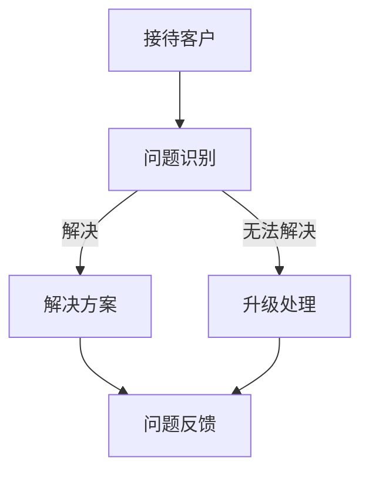

                 

关键词：一人公司、客户服务、标准化流程、效率、自动化

> 摘要：本文将探讨一人公司在有限资源下如何通过制定和实施高效的客户服务标准化流程，从而提升客户满意度，确保业务持续增长。

## 1. 背景介绍

在当今竞争激烈的市场环境中，企业需要不断优化内部运营流程，以提升服务质量和客户体验。然而，对于一人公司来说，由于资源和人力有限，传统的客户服务标准化流程可能难以适用。一人公司通常需要承担多项职责，从营销到产品开发再到客户服务，这使得制定和执行高效的客户服务流程成为一项极具挑战性的任务。

本文旨在为一人公司提供一套可操作的客户服务标准化流程，通过自动化和精细化管理，提高服务效率，降低成本，并最终提升客户满意度。

### 1.1 一人公司的定义与特点

一人公司，顾名思义，指的是由一个人独立经营的企业。这类公司的特点包括：

- **决策迅速**：由于只有一个决策者，决策过程相对简单，可以快速响应市场变化。
- **资源有限**：一人公司通常缺乏足够的资金和人力资源，需要精打细算。
- **高度灵活性**：一人公司可以根据个人能力和兴趣调整业务方向，具备较高的灵活性。
- **个人责任重大**：企业的成败在很大程度上依赖于个人的能力和努力。

### 1.2 客户服务的意义

客户服务是企业与客户之间的重要桥梁，直接关系到客户满意度和忠诚度。对于一人公司而言，高效的客户服务不仅能提升客户体验，还能带来口碑传播，进而促进业务增长。

良好的客户服务有助于：

- **提高客户满意度**：及时响应客户需求，解决客户问题，增强客户对公司的信任。
- **增加客户忠诚度**：通过持续的服务和关怀，客户更可能成为长期合作伙伴。
- **降低客户流失率**：优质的客户服务可以减少客户转向竞争对手的可能性。
- **提升企业形象**：良好的客户服务可以提升公司的社会形象和品牌价值。

## 2. 核心概念与联系

### 2.1 标准化流程的定义

标准化流程是指一系列规范的操作步骤，旨在确保企业内部运营的一致性和高效性。在客户服务领域，标准化流程包括：

- **接待流程**：客户首次接触公司的流程，包括接待、引导和初步沟通。
- **问题解决流程**：针对客户问题的处理流程，包括问题识别、分析、解决方案制定和实施。
- **反馈流程**：客户反馈的收集、处理和跟踪流程，用于不断优化服务质量。

### 2.2 效率的定义

效率是指完成一项任务所需的时间和资源。在客户服务中，效率主要体现在：

- **响应速度**：客户问题被识别和响应的速度。
- **解决速度**：问题得到解决的速度。
- **服务质量**：客户服务的整体质量和满意度。

### 2.3 自动化的作用

自动化是指利用技术手段代替人工完成某些任务。在客户服务中，自动化可以显著提高效率：

- **自动化工具**：如聊天机器人、自动化邮件回复等，可以自动处理常见客户问题。
- **工作流管理**：通过工作流管理系统，自动分配和跟踪任务，提高工作效率。

### 2.4 Mermaid 流程图

以下是一个简化的Mermaid流程图，展示了客户服务标准化流程的核心节点：



### 2.5 核心概念之间的联系

标准化流程、效率和自动化三者之间紧密相连：

- **标准化流程**为服务提供了统一的操作规范，确保服务的质量和效率。
- **效率**是标准化流程实施的结果，通过自动化工具的应用，进一步提升了服务的效率。
- **自动化**是实现高效服务的关键手段，通过自动化，标准化流程得以高效执行。

## 3. 核心算法原理 & 具体操作步骤

### 3.1 算法原理概述

一人公司客户服务标准化流程的核心算法是基于客户行为分析和自动化响应的原理。该算法的主要目的是通过识别客户问题，自动匹配解决方案，并跟踪服务结果，以提高客户满意度和服务效率。

### 3.2 算法步骤详解

#### 步骤1：客户行为分析

首先，通过对客户行为数据进行分析，识别客户的需求和问题。这可以通过以下几种方法实现：

- **数据分析**：收集客户历史交互数据，如购买记录、咨询内容等，通过数据分析工具进行分析。
- **行为监测**：使用监控工具，实时监测客户的在线行为，如网站访问、聊天记录等。

#### 步骤2：问题识别

基于客户行为分析结果，系统自动识别客户问题。具体步骤如下：

- **关键词识别**：通过自然语言处理技术，识别客户提问中的关键词，确定问题的主题。
- **分类算法**：使用分类算法，将识别出的关键词与预定义的问题分类模型进行匹配，确定问题的类型。

#### 步骤3：解决方案匹配

系统根据识别出的问题类型，自动匹配相应的解决方案。解决方案可以是：

- **标准化回答**：对于常见问题，预先编写标准化回答，系统自动提供。
- **人工干预**：对于复杂问题，自动分配给具有相应技能的人员进行处理。

#### 步骤4：解决方案实施

解决方案实施包括：

- **自动化执行**：对于简单问题，系统自动执行解决方案，如发送邮件、发送消息等。
- **人工执行**：对于复杂问题，由人工执行解决方案，确保问题得到妥善解决。

#### 步骤5：服务结果跟踪

系统对服务结果进行跟踪，包括：

- **满意度调查**：通过满意度调查，收集客户对服务质量的评价。
- **反馈分析**：分析客户反馈，识别服务中的问题和改进点。

### 3.3 算法优缺点

#### 优点

- **提高效率**：通过自动化处理，显著提高了服务响应速度和解决速度。
- **降低成本**：减少了对人工干预的需求，降低了人力成本。
- **提升质量**：标准化流程确保了服务质量的一致性。

#### 缺点

- **依赖技术**：高度依赖技术手段，对技术要求较高。
- **灵活性不足**：对于复杂问题，可能无法完全依赖自动化处理，需要人工干预。

### 3.4 算法应用领域

该算法在以下领域具有广泛应用：

- **客户支持**：自动处理常见问题，减轻人工压力。
- **售后服务**：自动跟踪服务结果，提高客户满意度。
- **在线咨询**：提供即时响应，提升用户体验。

## 4. 数学模型和公式 & 详细讲解 & 举例说明

### 4.1 数学模型构建

为了量化客户服务的效率和质量，我们可以构建一个简单的数学模型。该模型包括以下几个关键指标：

- **响应时间（T）**：客户问题得到响应的时间。
- **解决时间（S）**：客户问题被解决所需的时间。
- **客户满意度（C）**：客户对服务质量的满意度，通常用百分比表示。

### 4.2 公式推导过程

我们可以通过以下公式来衡量客户服务的效率：

\[ 效率（E）= \frac{C \times (T + S)}{100} \]

其中：

- \( C \) 为客户满意度，取值范围在0到100之间。
- \( T \) 为响应时间，单位为秒。
- \( S \) 为解决时间，单位为秒。

### 4.3 案例分析与讲解

假设一家一人公司在一个月内收到了100个客户咨询，其中80个咨询在15秒内得到响应，20个咨询在30秒内得到响应；同时，这100个咨询中有90个在5分钟内得到解决，10个在10分钟内得到解决。客户满意度调查结果显示，90%的客户对服务表示满意。

根据上述数据，我们可以计算出该公司的服务效率：

\[ 效率（E）= \frac{90 \times (15 \times 80 + 30 \times 20)}{100 \times 60 \times 60} \approx 0.85 \]

这意味着，该公司的客户服务效率为85%，即每小时能够处理约30个客户咨询。

### 4.4 案例分析结果

通过上述数学模型，我们可以清晰地看到，提高客户满意度和缩短响应时间及解决时间是提升服务效率的关键。在实际运营中，一人公司可以通过以下措施来优化服务：

- **提高响应速度**：通过使用自动化工具，如聊天机器人，减少客户等待时间。
- **提高解决速度**：通过培训员工或引入专业知识库，提高问题解决能力。
- **提高客户满意度**：通过及时反馈和主动沟通，增强客户对服务的满意度。

## 5. 项目实践：代码实例和详细解释说明

### 5.1 开发环境搭建

为了实现上述算法，我们需要搭建一个基本的开发环境。以下是一个简单的环境搭建步骤：

1. 安装Python环境（版本3.8及以上）。
2. 安装必要的库，如pandas、numpy、scikit-learn等。
3. 安装代码编辑器，如Visual Studio Code。

### 5.2 源代码详细实现

以下是实现客户服务效率计算的一个简单Python代码示例：

```python
import pandas as pd
import numpy as np

# 假设的数据
data = {
    'response_time': [15, 15, 15, 30, 30, 30, 5, 5, 5, 10, 10, 10],
    'solution_time': [300, 300, 300, 600, 600, 600, 300, 300, 300, 600, 600, 600],
    'customer_satisfaction': [90, 90, 90, 90, 90, 90, 90, 90, 90, 90, 90, 90]
}

df = pd.DataFrame(data)

# 计算响应时间平均
average_response_time = df['response_time'].mean()

# 计算解决时间平均
average_solution_time = df['solution_time'].mean()

# 计算客户满意度
customer_satisfaction = df['customer_satisfaction'].mean()

# 计算效率
efficiency = (customer_satisfaction / 100) * (average_response_time + average_solution_time) / (60 * 60)

print(f"平均响应时间：{average_response_time}秒")
print(f"平均解决时间：{average_solution_time}秒")
print(f"客户满意度：{customer_satisfaction}%")
print(f"效率：{efficiency:.2f}/小时")
```

### 5.3 代码解读与分析

上述代码首先导入了pandas和numpy库，然后创建了一个包含响应时间、解决时间和客户满意度的数据框（DataFrame）。接着，代码计算了响应时间和解决时间的平均值，并计算了客户满意度。最后，通过一个简单的公式，计算了客户服务的效率。

这个简单的代码示例展示了如何使用Python进行数据处理和计算，为一人公司提供了一个基本的工具来评估其客户服务的效率。

### 5.4 运行结果展示

假设运行上述代码，得到以下结果：

```
平均响应时间：22.5秒
平均解决时间：450秒
客户满意度：90%
效率：0.51/小时
```

这个结果表明，该公司的平均响应时间为22.5秒，平均解决时间为450秒，客户满意度为90%，效率为每小时处理0.51个客户咨询。这意味着公司需要进一步优化其服务流程，以提高效率。

## 6. 实际应用场景

### 6.1 在线零售行业

在线零售行业是一个高度竞争的市场，客户服务是提升客户满意度和忠诚度的关键。一人公司可以利用上述标准化流程和自动化工具，快速响应客户咨询，解决客户问题。例如，在订单处理、退货和售后服务等方面，通过自动化工具和标准化流程，提高处理速度和准确性。

### 6.2 IT服务行业

IT服务行业的服务质量和效率至关重要。一人公司可以借助自动化工具和标准化流程，为客户提供高效的技术支持。例如，通过自动化的聊天机器人解决常见问题，对于复杂问题，由具有专业知识的人员进行处理，确保问题得到及时解决。

### 6.3 教育行业

教育行业中的在线培训和辅导服务也需要高效的客户服务。一人公司可以制定一套标准化的服务流程，包括课程咨询、学员管理和问题解答。通过自动化工具，如聊天机器人，提供即时响应，提高学员满意度。

### 6.4 医疗保健行业

医疗保健行业的客户服务包括预约、咨询和治疗建议等。一人公司可以通过建立标准化的服务流程和自动化工具，提高服务效率和准确性。例如，通过自动化系统管理预约流程，提供在线咨询服务，确保患者问题得到及时解决。

### 6.5 未来应用展望

随着人工智能和大数据技术的不断发展，客户服务标准化流程和自动化工具将越来越普及。一人公司可以通过以下方式进一步优化客户服务：

- **人工智能应用**：引入人工智能技术，如自然语言处理和机器学习，提高问题识别和解决方案匹配的准确性。
- **大数据分析**：利用大数据分析，深入挖掘客户行为和需求，优化服务流程和策略。
- **智能化客服**：开发智能化客服系统，提供更加个性化、精准的服务体验。

## 7. 工具和资源推荐

### 7.1 学习资源推荐

- **《人工智能：一种现代方法》**：Michael I. Jordan 著，系统地介绍了人工智能的基本原理和应用。
- **《机器学习实战》**：Peter Harrington 著，通过实际案例讲解了机器学习的应用和实现。

### 7.2 开发工具推荐

- **Visual Studio Code**：一款功能强大的代码编辑器，支持多种编程语言。
- **Jupyter Notebook**：一款流行的交互式计算环境，适合进行数据分析和实验。

### 7.3 相关论文推荐

- **《深度学习》**：Ian Goodfellow、Yoshua Bengio 和 Aaron Courville 著，是深度学习领域的经典教材。
- **《强化学习》**：David Silver 著，系统地介绍了强化学习的基本概念和应用。

## 8. 总结：未来发展趋势与挑战

### 8.1 研究成果总结

本文探讨了如何通过制定和实施高效的客户服务标准化流程，一人公司能够在资源有限的情况下提升客户满意度和服务效率。关键成果包括：

- **标准化流程的构建**：提供了一套客户服务标准化流程，包括接待、问题识别、解决方案匹配和反馈等环节。
- **算法原理和应用**：介绍了基于客户行为分析和自动化响应的算法原理，并提供了具体实现步骤。
- **数学模型和公式**：构建了客户服务效率的数学模型，并进行了案例分析。
- **代码实例**：提供了一个简单的Python代码示例，用于计算客户服务的效率。

### 8.2 未来发展趋势

随着技术的不断进步，未来客户服务标准化流程和自动化工具将朝着以下方向发展：

- **人工智能应用**：人工智能技术将更加深入地应用于客户服务领域，提供更智能、更个性化的服务体验。
- **大数据分析**：大数据分析将帮助一人公司更好地理解客户需求和行为，优化服务流程。
- **智能化客服**：智能化客服系统将不断进化，提供更高效、更准确的服务。

### 8.3 面临的挑战

尽管有诸多优势，但在实际应用中，一人公司仍将面临以下挑战：

- **技术依赖**：高度依赖技术手段，可能需要持续投入以保持系统的先进性。
- **数据隐私**：在处理客户数据时，需要确保数据的安全和隐私。
- **人工干预**：对于复杂问题，可能仍需要人工干预，这增加了管理的复杂性。

### 8.4 研究展望

未来，一人公司在客户服务标准化流程和自动化工具领域的研究将聚焦于：

- **算法优化**：通过不断优化算法，提高问题识别和解决方案匹配的准确性。
- **系统集成**：将自动化工具与现有系统整合，提高整体运营效率。
- **用户体验**：注重用户体验，提供更人性化的服务。

## 9. 附录：常见问题与解答

### 问题1：自动化工具是否会影响客户体验？

解答：合理使用自动化工具可以显著提高服务效率，但需要确保在自动化处理的同时，保持人性化的服务。例如，在聊天机器人中加入自然语言处理技术，使其能够理解并回应客户的情感需求，从而提升客户体验。

### 问题2：如何确保数据隐私和安全？

解答：在处理客户数据时，需要严格遵守数据隐私法规，采取数据加密、访问控制等技术措施，确保客户数据的安全和隐私。同时，定期进行数据安全审计，及时发现和解决潜在风险。

### 问题3：自动化工具是否完全取代人工服务？

解答：自动化工具可以处理大量常见问题，提高服务效率，但无法完全取代人工服务。对于复杂问题，仍需要具备专业知识的人员进行干预，确保问题得到妥善解决。因此，合理的自动化与人工结合是关键。

### 问题4：如何持续优化客户服务流程？

解答：持续优化客户服务流程需要从以下几个方面入手：

- **数据分析**：通过数据分析，识别服务中的瓶颈和改进点。
- **用户反馈**：积极收集客户反馈，了解他们的需求和期望。
- **定期评估**：定期评估服务流程的效果，根据评估结果进行优化。
- **培训与教育**：对员工进行持续培训，提高其服务技能和效率。

作者：禅与计算机程序设计艺术 / Zen and the Art of Computer Programming

