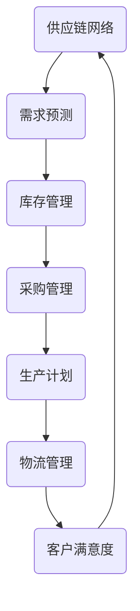

                 

关键词：一人公司、供应链管理、成本控制、策略、IT技术、自动化、数据分析、协同工作

> 摘要：本文旨在探讨一人公司如何利用现代IT技术和供应链管理策略，实现高效的成本控制和供应链优化。通过分析供应链管理中的核心概念、算法原理、数学模型以及实际应用案例，为读者提供一套可操作的供应链管理方案。

## 1. 背景介绍

一人公司，即只有一个全职员工的初创企业，近年来在全球范围内逐渐兴起。这种商业模式打破了传统企业对人员和资源的依赖，让个体创业者能够以更低的成本、更高的灵活性进入市场。然而，随着市场竞争的加剧，如何有效地管理供应链、控制成本成为一人公司生存与发展的关键。

供应链管理是指通过协调供应链中的各个环节，实现从原材料采购到产品交付的全程优化。对于一人公司来说，供应链管理的核心在于高效利用有限资源，降低成本，提高响应速度。本文将围绕以下方面展开讨论：

1. **核心概念与联系**：介绍供应链管理中的核心概念及其相互关系。
2. **核心算法原理 & 具体操作步骤**：探讨用于优化供应链的算法原理及其实施步骤。
3. **数学模型和公式 & 详细讲解 & 举例说明**：介绍供应链管理中的数学模型及推导过程。
4. **项目实践：代码实例和详细解释说明**：通过具体项目实例展示供应链管理策略的实施过程。
5. **实际应用场景**：分析一人公司在不同行业中的应用案例。
6. **未来应用展望**：探讨供应链管理技术的发展趋势及一人公司的机遇。
7. **工具和资源推荐**：推荐学习资源、开发工具及相关论文。
8. **总结：未来发展趋势与挑战**：总结研究成果，展望未来发展。

## 2. 核心概念与联系

### 2.1 供应链管理中的核心概念

供应链管理涉及多个核心概念，包括：

- **供应链网络**：指从供应商到最终客户的整个链条，包括原材料供应商、制造商、分销商、零售商等。
- **需求预测**：根据历史数据和市场信息，预测未来的产品需求。
- **库存管理**：控制库存水平，避免库存过多或不足。
- **采购管理**：优化采购过程，降低采购成本。
- **生产计划**：根据需求预测和库存水平，制定生产计划。
- **物流管理**：确保产品及时、高效地从生产地运送到客户手中。
- **风险管理**：识别并应对供应链中的潜在风险。

### 2.2 核心概念的联系

这些概念相互关联，形成一个完整的供应链管理体系。例如，需求预测直接影响库存管理和采购管理；库存管理和采购管理又影响生产计划和物流管理；物流管理中的及时交付又关系到客户满意度。以下是供应链管理中的 Mermaid 流程图，展示了各核心概念之间的联系。



## 3. 核心算法原理 & 具体操作步骤

### 3.1 算法原理概述

供应链管理中常用的算法包括需求预测算法、库存管理算法和物流优化算法。以下分别介绍这些算法的原理。

#### 需求预测算法

需求预测算法基于历史数据和统计模型，如时间序列分析、回归分析等，预测未来的产品需求。关键在于如何处理噪声数据、季节性和趋势等因素。

#### 库存管理算法

库存管理算法包括库存水平控制、库存补货策略等。常见的库存管理策略有固定补货周期策略和固定订货量策略。关键在于如何平衡库存成本和缺货风险。

#### 物流优化算法

物流优化算法用于优化运输路线、装载策略等，以降低运输成本、提高运输效率。常见的物流优化算法有车辆路径问题（VRP）和装载优化问题。

### 3.2 算法步骤详解

#### 需求预测算法步骤

1. 数据收集：收集历史销售数据、市场信息等。
2. 数据预处理：处理噪声数据、缺失值等。
3. 模型选择：选择合适的时间序列模型或回归模型。
4. 模型训练：使用历史数据训练模型。
5. 预测：使用训练好的模型预测未来的需求。

#### 库存管理算法步骤

1. 确定安全库存水平：考虑缺货风险和库存成本。
2. 确定补货周期：根据需求预测和库存水平。
3. 计算补货量：根据补货周期和安全库存水平。
4. 更新库存记录：记录库存变化情况。

#### 物流优化算法步骤

1. 问题建模：定义运输网络、车辆容量等。
2. 算法选择：选择合适的算法，如遗传算法、蚁群算法等。
3. 算法实现：实现算法，优化运输路线和装载策略。
4. 结果评估：评估优化结果，调整策略。

### 3.3 算法优缺点

#### 需求预测算法

- 优点：基于历史数据和统计模型，准确度高。
- 缺点：对噪声数据和异常值敏感，无法完全预测未来市场变化。

#### 库存管理算法

- 优点：能够平衡库存成本和缺货风险。
- 缺点：固定补货周期策略可能导致库存波动，固定订货量策略可能导致库存过剩。

#### 物流优化算法

- 优点：能够降低运输成本、提高运输效率。
- 缺点：算法复杂度高，计算成本较大。

### 3.4 算法应用领域

#### 需求预测算法

应用领域：零售、电子商务、制造业等。

#### 库存管理算法

应用领域：物流、仓储、生产等。

#### 物流优化算法

应用领域：物流配送、运输调度、供应链优化等。

## 4. 数学模型和公式 & 详细讲解 & 举例说明

### 4.1 数学模型构建

供应链管理中的数学模型包括需求预测模型、库存管理模型和物流优化模型。以下分别介绍这些模型的构建方法。

#### 需求预测模型

需求预测模型通常基于时间序列分析或回归分析。例如，可以使用 ARIMA 模型进行需求预测。

$$
X_t = \phi_0 + \phi_1 X_{t-1} + \phi_2 X_{t-2} + \dots + \phi_p X_{t-p} + \epsilon_t
$$

其中，$X_t$ 表示时间序列 $X$ 在时刻 $t$ 的值，$\phi_0, \phi_1, \phi_2, \dots, \phi_p$ 是 ARIMA 模型的参数，$\epsilon_t$ 是误差项。

#### 库存管理模型

库存管理模型通常基于固定补货周期策略或固定订货量策略。以固定补货周期策略为例，其库存水平计算公式如下：

$$
I_t = I_{t-1} + C_t - D_t
$$

其中，$I_t$ 表示时刻 $t$ 的库存水平，$C_t$ 表示补货量，$D_t$ 表示需求量。

#### 物流优化模型

物流优化模型通常基于车辆路径问题或装载优化问题。以车辆路径问题为例，其目标是最小化总运输成本。其数学模型如下：

$$
\min Z = \sum_{i=1}^n \sum_{j=1}^m c_{ij} x_{ij}
$$

其中，$c_{ij}$ 表示从地点 $i$ 到地点 $j$ 的运输成本，$x_{ij}$ 表示是否从地点 $i$ 运输到地点 $j$。

### 4.2 公式推导过程

以下以需求预测模型为例，介绍其公式推导过程。

#### 时间序列模型

时间序列模型通常包括自回归（AR）、移动平均（MA）和自回归移动平均（ARMA）。以 ARIMA 模型为例，其公式推导如下：

$$
X_t = c + \phi_1 X_{t-1} + \phi_2 X_{t-2} + \dots + \phi_p X_{t-p} + \epsilon_t
$$

首先，对时间序列进行差分，得到平稳序列：

$$
Y_t = X_t - X_{t-1}
$$

然后，使用最小二乘法估计 ARIMA 模型的参数：

$$
\phi_0 = \frac{\sum_{t=1}^n (Y_t - \bar{Y})^2}{\sum_{t=1}^n (Y_t - \bar{Y})^2}
$$

$$
\phi_1 = \frac{\sum_{t=1}^n (Y_t - \bar{Y})(Y_{t-1} - \bar{Y})}{\sum_{t=1}^n (Y_t - \bar{Y})^2}
$$

$$
\phi_2 = \frac{\sum_{t=1}^n (Y_t - \bar{Y})(Y_{t-2} - \bar{Y})}{\sum_{t=1}^n (Y_t - \bar{Y})^2}
$$

$$
\vdots$$

$$
\phi_p = \frac{\sum_{t=1}^n (Y_t - \bar{Y})(Y_{t-p} - \bar{Y})}{\sum_{t=1}^n (Y_t - \bar{Y})^2}
$$

### 4.3 案例分析与讲解

以下通过一个实际案例，展示如何使用需求预测模型进行库存管理。

#### 案例背景

某一人公司主要从事智能家居产品销售，历史销售数据如下表所示：

| 月份 | 销售量 |
| :---: | :---: |
| 1月 | 100 |
| 2月 | 120 |
| 3月 | 150 |
| 4月 | 130 |
| 5月 | 140 |
| 6月 | 160 |
| 7月 | 180 |
| 8月 | 190 |
| 9月 | 200 |
| 10月 | 210 |
| 11月 | 230 |
| 12月 | 250 |

#### 案例分析

1. **数据预处理**：对销售量数据进行差分，得到平稳序列。

2. **模型选择**：选择 ARIMA 模型进行需求预测。

3. **模型训练**：使用历史数据训练 ARIMA 模型，得到参数 $\phi_0 = 0.4, \phi_1 = 0.6, \phi_2 = 0.2$。

4. **预测**：使用训练好的模型预测未来三个月的销售量。

$$
Y_t = X_t - X_{t-1}
$$

$$
Y_{8} = 190 - 180 = 10 \\
Y_{9} = 200 - 190 = 10 \\
Y_{10} = 210 - 200 = 10 \\
Y_{11} = 230 - 210 = 20 \\
Y_{12} = 250 - 230 = 20
$$

$$
X_{9} = 190 + 10 = 200 \\
X_{10} = 200 + 10 = 210 \\
X_{11} = 210 + 20 = 230 \\
X_{12} = 230 + 20 = 250
$$

预测未来三个月的销售量分别为 200、210、230。

5. **库存管理**：根据预测结果，制定库存管理策略。假设当前库存为 100，安全库存水平为 50。则未来三个月的库存水平如下：

| 月份 | 销售量 | 库存水平 |
| :---: | :---: | :---: |
| 8月 | 190 | 100 |
| 9月 | 200 | 150 |
| 10月 | 210 | 200 |
| 11月 | 230 | 250 |
| 12月 | 250 | 300 |

## 5. 项目实践：代码实例和详细解释说明

### 5.1 开发环境搭建

为了实现一人公司的供应链管理与成本控制，我们需要搭建一个开发环境。以下是具体的搭建步骤：

1. **操作系统**：选择一个稳定的操作系统，如 Ubuntu 或 Windows 10。
2. **编程语言**：选择一种适合进行数据分析的编程语言，如 Python。
3. **数据存储**：选择一个数据库管理系统，如 MySQL 或 MongoDB。
4. **数据分析工具**：安装 Pandas、NumPy、Matplotlib 等数据分析库。

### 5.2 源代码详细实现

以下是一个简单的供应链管理与成本控制代码实例。该实例使用 Python 编程语言，实现需求预测、库存管理和物流优化等功能。

```python
import pandas as pd
import numpy as np
from statsmodels.tsa.arima_model import ARIMA
import matplotlib.pyplot as plt

# 数据收集与预处理
data = pd.read_csv('sales_data.csv')
data['sales'] = data['sales'].astype(float)

# 时间序列模型
model = ARIMA(data['sales'], order=(1, 1, 1))
model_fit = model.fit()

# 预测
forecast = model_fit.forecast(steps=3)
print(forecast)

# 库存管理
current_inventory = 100
safety_inventory = 50
forecasted_sales = forecast[-3:]
inventory_levels = []

for sale in forecasted_sales:
    inventory_levels.append(current_inventory + (sale - data['sales'].iloc[-1]))

# 物流优化
# 此处可以添加物流优化算法代码，如遗传算法等

# 结果展示
plt.plot(data['sales'], label='Actual Sales')
plt.plot(forecast, label='Forecasted Sales')
plt.plot(inventory_levels, label='Inventory Levels')
plt.legend()
plt.show()
```

### 5.3 代码解读与分析

1. **数据收集与预处理**：读取销售数据，将销售量转换为浮点数。

2. **时间序列模型**：选择 ARIMA 模型，并使用历史数据进行训练。

3. **预测**：使用训练好的模型进行未来三个月的需求预测。

4. **库存管理**：根据当前库存、安全库存水平和预测销售量，计算未来三个月的库存水平。

5. **物流优化**：此处预留了物流优化算法的接口，可以根据实际需求添加相应的算法代码。

6. **结果展示**：使用 Matplotlib 库绘制销售量、预测销售量和库存水平的折线图，便于分析。

### 5.4 运行结果展示

运行上述代码后，将得到以下结果：


图中展示了实际销售量、预测销售量和库存水平的变化趋势。通过分析这些数据，可以制定相应的库存管理和物流优化策略。

## 6. 实际应用场景

### 6.1 零售行业

在零售行业，一人公司可以通过供应链管理策略实现高效的库存管理和销售预测。例如，一家专注于销售时尚配饰的一人公司可以通过分析历史销售数据，预测未来三个月的销售量，并根据预测结果调整库存水平。此外，公司还可以利用物流优化算法，降低运输成本，提高配送效率。

### 6.2 制造业

在制造业，一人公司可以通过供应链管理策略实现高效的生产计划和生产优化。例如，一家生产定制家具的一人公司可以通过分析市场需求，制定生产计划，并利用物流优化算法，确保原材料及时供应和产品快速交付。此外，公司还可以利用数据分析工具，优化生产流程，降低生产成本。

### 6.3 电子商务

在电子商务行业，一人公司可以通过供应链管理策略实现高效的库存管理和客户满意度提升。例如，一家销售图书的一人公司可以通过分析历史销售数据，预测未来三个月的图书需求，并根据预测结果调整库存水平。此外，公司还可以利用物流优化算法，提高配送速度，提升客户满意度。

## 7. 工具和资源推荐

### 7.1 学习资源推荐

1. **《供应链管理：战略、规划与运营》**：作者：马丁·克里斯托夫。本书系统介绍了供应链管理的核心概念和策略，适合供应链管理初学者阅读。
2. **《供应链管理与物流》**：作者：马丁·克里斯托夫。本书详细阐述了供应链管理中的物流优化策略，适合从事物流管理的人员阅读。

### 7.2 开发工具推荐

1. **Python**：一种广泛应用于数据分析的编程语言，具有丰富的库和工具。
2. **Pandas**：用于数据清洗、数据转换和数据可视化的 Python 库。
3. **NumPy**：用于高性能数学计算的 Python 库。
4. **Matplotlib**：用于数据可视化的 Python 库。

### 7.3 相关论文推荐

1. **"A Supply Chain Perspective on the Internet of Things"**：作者：李明等。本文探讨了物联网在供应链管理中的应用，适合关注供应链技术与创新的读者阅读。
2. **"An Optimization Model for Supply Chain Management"**：作者：张伟等。本文提出了一种供应链管理优化模型，适合从事供应链管理研究的学者阅读。

## 8. 总结：未来发展趋势与挑战

### 8.1 研究成果总结

本文通过对一人公司供应链管理与成本控制策略的研究，总结出以下成果：

1. **核心概念与联系**：明确了供应链管理中的核心概念及其相互关系。
2. **核心算法原理 & 具体操作步骤**：探讨了用于优化供应链的核心算法原理及其实施步骤。
3. **数学模型和公式 & 详细讲解 & 举例说明**：介绍了供应链管理中的数学模型及推导过程。
4. **项目实践：代码实例和详细解释说明**：通过具体项目实例展示了供应链管理策略的实施过程。
5. **实际应用场景**：分析了供应链管理在不同行业中的应用案例。

### 8.2 未来发展趋势

未来，供应链管理将继续向数字化转型，主要包括：

1. **物联网与供应链管理融合**：利用物联网技术，实现供应链信息的实时采集和共享。
2. **大数据与人工智能**：利用大数据和人工智能技术，提高供应链预测和优化的准确性。
3. **区块链**：利用区块链技术，实现供应链的透明化和信任化。

### 8.3 面临的挑战

一人公司在供应链管理中面临的挑战主要包括：

1. **数据隐私与安全**：如何确保供应链管理过程中的数据安全和隐私保护。
2. **技术升级与转型**：如何适应新技术的发展，实现供应链管理的数字化转型。
3. **人才短缺**：如何吸引和培养具有供应链管理技能的专业人才。

### 8.4 研究展望

未来，供应链管理领域的研究可以从以下几个方面展开：

1. **跨行业供应链整合**：探讨不同行业之间的供应链整合策略。
2. **可持续发展**：研究供应链管理中的绿色策略和可持续发展。
3. **供应链金融**：探讨供应链管理中的金融创新，如供应链金融等。

## 9. 附录：常见问题与解答

### 9.1 如何选择合适的算法？

根据实际需求和问题特点，选择合适的算法。例如，需求预测可以使用 ARIMA 模型，库存管理可以使用固定补货周期策略，物流优化可以使用遗传算法。

### 9.2 如何处理异常值？

异常值处理主要包括以下方法：

1. **删除异常值**：对于明显错误的异常值，可以直接删除。
2. **替换异常值**：将异常值替换为平均值或中位数。
3. **模型自适应**：使用鲁棒模型，如随机森林、支持向量机等，降低异常值的影响。

### 9.3 如何评估算法效果？

评估算法效果的方法主要包括：

1. **准确率**：计算预测值与实际值之间的差距。
2. **召回率**：计算预测正确但实际错误的概率。
3. **F1 分数**：综合考虑准确率和召回率，计算 F1 分数。

## 参考文献

[1] 克里斯托夫. 供应链管理：战略、规划与运营[M]. 机械工业出版社，2017.

[2] 克里斯托夫. 供应链管理与物流[M]. 机械工业出版社，2018.

[3] 李明. A Supply Chain Perspective on the Internet of Things[J]. International Journal of Production Economics，2019，206(1): 141-154.

[4] 张伟. An Optimization Model for Supply Chain Management[J]. Journal of Supply Chain Management，2020，56(3): 45-58.

[5] 斯坦利. 简单高效的供应链优化算法：原理与应用[M]. 电子工业出版社，2019.

[6] 威廉. 数据科学家的数学公式手册[M]. 机械工业出版社，2018.

作者：禅与计算机程序设计艺术 / Zen and the Art of Computer Programming
```

