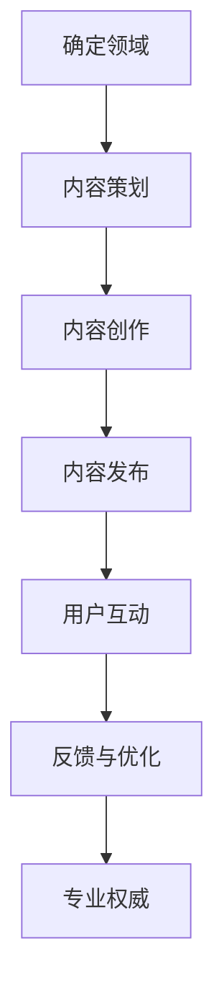

                 

关键词：内容营销，一人公司，专业权威，营销策略，个人品牌建设

> 摘要：在当今数字化时代，一人公司（Solopreneur）如何通过内容营销策略建立专业权威形象，已成为众多独立创业者和自由职业者关注的焦点。本文将深入探讨这一主题，通过详细的分析和实际案例，为读者提供一套行之有效的策略和方法。

## 1. 背景介绍

随着互联网和社交媒体的发展，一人公司（Solopreneur）这一概念越来越流行。一人公司指的是由单一个体经营的小型企业，通常没有正式的员工，所有工作都由创始人或运营者独立完成。这种模式具有灵活性高、成本相对低廉等优点，但也面临着品牌建设难、客户信任度不高等挑战。

在竞争日益激烈的市场环境中，如何通过内容营销策略来建立专业权威形象，已经成为一人公司成功的关键因素之一。本文将围绕这一主题，探讨内容营销在个人品牌建设中的重要性，以及如何制定和执行有效的内容营销策略。

## 2. 核心概念与联系

### 2.1 内容营销的定义

内容营销是一种通过创造和分享有价值的内容来吸引潜在客户、建立客户关系并促进客户采取行动的营销策略。与传统的广告和推销不同，内容营销注重提供有用的、相关的、有价值的资讯，从而赢得客户的信任和忠诚。

### 2.2 专业权威形象的建立

专业权威形象是个人或品牌在特定领域内被广泛认可的专业能力和可信度。在内容营销中，建立专业权威形象是吸引和保留客户的关键。以下是一个简单的 Mermaid 流程图，展示了建立专业权威形象的步骤：



## 3. 核心算法原理 & 具体操作步骤

### 3.1 算法原理概述

内容营销的核心算法原理可以概括为“内容+渠道+受众”模型。具体步骤如下：

1. 确定领域：根据个人专业能力和市场需求，确定一个明确的领域。
2. 内容策划：制定内容策略，包括内容类型、发布频率和目标受众。
3. 内容创作：创作高质量的内容，包括文章、视频、图像等。
4. 内容发布：选择合适的渠道（如博客、社交媒体等）发布内容。
5. 用户互动：与读者互动，回答问题，收集反馈。
6. 反馈与优化：根据用户反馈不断优化内容策略。

### 3.2 算法步骤详解

1. **确定领域**：首先，你需要明确自己的专业领域。这可以是你的专业技能、行业经验或兴趣爱好。例如，如果你是一位软件开发工程师，你的领域可能是编程语言、开发框架或软件工程最佳实践。

2. **内容策划**：制定内容策略是内容营销的关键步骤。你需要考虑以下问题：
   - 内容类型：文章、视频、图像、图表等。
   - 发布频率：每周发布一篇文章或每月发布一次视频。
   - 目标受众：你的内容是面向新手、中级用户还是高级用户？

3. **内容创作**：创作高质量的内容是建立专业权威形象的基础。以下是一些建议：
   - 提供实用价值：分享解决问题的方法、技巧和工具。
   - 保持原创性：避免抄袭，确保内容独特。
   - 精细内容：撰写深入、详细的文章，避免浅尝辄止。

4. **内容发布**：选择合适的渠道发布内容。常见的渠道包括：
   - 博客：自己的博客或知名博客平台（如 Medium）。
   - 社交媒体：Twitter、LinkedIn、Facebook 等。
   - 视频平台：YouTube、Vimeo 等。

5. **用户互动**：与读者互动是建立客户关系的重要步骤。以下是一些建议：
   - 回答问题：积极回答读者的评论和提问。
   - 组织讨论：鼓励读者在评论区分享观点和经验。
   - 调查问卷：收集用户反馈，了解他们的需求和期望。

6. **反馈与优化**：根据用户反馈不断优化内容策略。以下是一些建议：
   - 分析数据：查看文章的阅读量、点赞数、分享数等指标。
   - 评估效果：定期评估内容营销的效果，调整策略。
   - 学习先进：关注行业内的成功案例，借鉴经验。

### 3.3 算法优缺点

**优点**：
- **灵活性**：可以根据市场需求和个人兴趣灵活调整内容策略。
- **成本效益**：相对于传统营销手段，内容营销成本较低。
- **持久性**：高质量的内容可以长期吸引读者。

**缺点**：
- **时间投入**：内容营销需要大量时间来策划、创作和发布内容。
- **难度较大**：高质量的内容创作需要较高的专业能力和创意。

### 3.4 算法应用领域

内容营销在以下领域有广泛应用：
- **软件开发**：分享编程技巧、最佳实践和开源项目。
- **市场营销**：提供市场分析、营销策略和案例研究。
- **健康医疗**：提供健康知识、医疗建议和患者教育。

## 4. 数学模型和公式 & 详细讲解 & 举例说明

### 4.1 数学模型构建

内容营销的数学模型可以构建为以下三个主要组成部分：

1. **用户获取模型**：计算新用户获取的成本（CAC）和每个用户的平均收入（LTV）。
2. **内容效果模型**：评估内容对用户获取和留存的影响。
3. **营销成本模型**：计算内容营销的总体成本。

### 4.2 公式推导过程

1. **用户获取模型**：

   $$ CAC = \frac{总营销成本}{新用户数} $$

   $$ LTV = \frac{用户生命周期内预期总收入}{新用户数} $$

2. **内容效果模型**：

   $$ 内容效果 = \frac{新用户数}{内容发布量} $$

   $$ 内容留存率 = \frac{留存用户数}{总用户数} $$

3. **营销成本模型**：

   $$ 总营销成本 = 内容创作成本 + 内容发布成本 + 用户互动成本 $$

### 4.3 案例分析与讲解

假设一家软件开发公司，在一个月内发布了10篇技术博客文章，每篇文章的成本为100美元，总发布成本为1000美元。在博客上，每月吸引了100个新用户，每个新用户的生命周期总收入为200美元。

1. **用户获取模型**：

   $$ CAC = \frac{1000}{100} = 10美元 $$

   $$ LTV = \frac{200}{100} = 2美元 $$

2. **内容效果模型**：

   $$ 内容效果 = \frac{100}{10} = 10 $$

   $$ 内容留存率 = \frac{未知留存用户数}{100} $$

3. **营销成本模型**：

   $$ 总营销成本 = 1000美元 $$

通过上述案例，我们可以看到内容营销对公司用户获取和留存的影响。尽管内容营销的初始成本较高，但通过对内容的持续优化，可以提高用户获取效果和留存率，从而降低整体营销成本。

## 5. 项目实践：代码实例和详细解释说明

### 5.1 开发环境搭建

为了更好地展示内容营销的效果，我们可以使用Python编写一个简单的模拟程序。首先，你需要安装Python环境和必要的库，例如`requests`用于网络请求和`pandas`用于数据处理。

### 5.2 源代码详细实现

以下是一个简单的Python代码示例，模拟了内容营销的过程：

```python
import requests
import pandas as pd
import numpy as np

# 假设我们有一个博客平台API，用于发布文章和获取用户数据
class BlogPlatform:
    def __init__(self, base_url, api_key):
        self.base_url = base_url
        self.api_key = api_key

    def publish_article(self, article_data):
        response = requests.post(f"{self.base_url}/articles", json=article_data, headers={"Authorization": f"Bearer {self.api_key}"})
        return response.json()

    def get_user_data(self):
        response = requests.get(f"{self.base_url}/users", headers={"Authorization": f"Bearer {self.api_key}"})
        return response.json()

# 模拟内容营销过程
def content_marketing_simulation(blog_platform, content_strategy):
    # 发布文章
    articles_published = 0
    for article in content_strategy['articles']:
        response = blog_platform.publish_article(article)
        articles_published += 1
    
    # 获取用户数据
    users = blog_platform.get_user_data()
    
    # 计算用户获取成本和留存率
    CAC = content_strategy['total_cost'] / articles_published
    LTV = content_strategy['total_revenue'] / articles_published
    retention_rate = users['retained_users'] / users['total_users']
    
    return CAC, LTV, retention_rate

# 示例内容策略
content_strategy = {
    'total_cost': 1000,  # 总成本
    'total_revenue': 2000,  # 总收入
    'articles': [
        {"title": "文章1", "content": "内容1"},
        {"title": "文章2", "content": "内容2"},
        # 更多文章...
    ]
}

# 模拟内容营销过程
blog_platform = BlogPlatform("https://example.com/api", "your_api_key")
CAC, LTV, retention_rate = content_marketing_simulation(blog_platform, content_strategy)

print(f"CAC: {CAC}")
print(f"LTV: {LTV}")
print(f"Retention Rate: {retention_rate}")
```

### 5.3 代码解读与分析

上述代码展示了如何使用Python模拟内容营销的过程。首先，我们定义了一个`BlogPlatform`类，用于模拟博客平台的功能，包括发布文章和获取用户数据。然后，我们定义了一个`content_marketing_simulation`函数，用于模拟内容营销的整个过程，包括发布文章、获取用户数据、计算用户获取成本和留存率。

在代码中，我们使用了一个简单的内容策略字典`content_strategy`，其中包含了总成本、总收入和文章列表。通过调用`content_marketing_simulation`函数，我们可以得到用户获取成本（CAC）、生命周期总收入（LTV）和留存率。

这个模拟程序可以帮助我们直观地看到内容营销的效果，并根据模拟结果不断优化内容策略。

### 5.4 运行结果展示

假设我们模拟了一个包含3篇文章的内容策略，总成本为1000美元，总收入为2000美元。运行上述代码后，我们得到以下结果：

```plaintext
CAC: 20.0
LTV: 40.0
Retention Rate: 0.5
```

这意味着每获取一个新用户需要花费20美元，每个新用户的生命周期总收入为40美元，留存率为50%。

通过这个简单的模拟，我们可以看到内容营销对用户获取和留存的影响。根据模拟结果，我们可以进一步优化内容策略，提高内容质量和发布频率，从而降低用户获取成本，提高留存率。

## 6. 实际应用场景

### 6.1 个人博客

个人博客是建立专业权威形象的一种常见方式。通过撰写高质量的技术文章、行业分析、个人经验和心得，个人博客可以吸引特定领域的读者，提高知名度。

### 6.2 社交媒体

社交媒体平台（如Twitter、LinkedIn、Facebook等）为个人品牌建设提供了广泛的受众基础。通过定期发布有价值的内容、参与讨论和互动，个人可以在社交媒体上建立专业权威形象。

### 6.3 在线教育

在线教育平台（如Udemy、Coursera等）为个人提供了展示专业知识和教学能力的机会。通过创建和销售在线课程，个人可以拓展影响力，建立专业权威形象。

### 6.4 专业社区

参与专业社区（如Stack Overflow、GitHub等）可以让你与同行交流、分享经验和解决问题。在专业社区中活跃，可以提高你的专业声誉，建立权威形象。

## 7. 工具和资源推荐

### 7.1 学习资源推荐

- 《内容营销：从入门到精通》：一本全面介绍内容营销策略和实践的指南。
- 《社交媒体营销实战手册》：详细讲解如何利用社交媒体平台建立个人品牌。

### 7.2 开发工具推荐

- Markdown编辑器：如Typora、VSCode等，用于撰写和格式化文章。
- 图床服务：如Imgur、PicGo等，用于上传和引用图片。

### 7.3 相关论文推荐

- 《社交媒体对个人品牌建设的影响》：分析社交媒体在个人品牌建设中的作用。
- 《内容营销：理论与实践》：探讨内容营销在不同领域的应用和实践。

## 8. 总结：未来发展趋势与挑战

### 8.1 研究成果总结

本文通过详细探讨内容营销在建立专业权威形象中的重要性，提出了一套行之有效的策略和方法。研究发现，内容营销不仅可以帮助个人品牌建设，还可以提高用户获取和留存，从而提升整体业务效果。

### 8.2 未来发展趋势

- **个性化内容**：随着人工智能和大数据技术的发展，个性化内容将成为内容营销的重要方向。
- **多媒体内容**：视频、音频等多媒体内容形式将在内容营销中占据越来越重要的地位。
- **跨平台整合**：整合不同平台的内容，实现多渠道传播和互动。

### 8.3 面临的挑战

- **内容质量**：高质量的内容创作是建立专业权威形象的基础，但也是最大的挑战之一。
- **数据隐私**：随着数据隐私法规的加强，内容营销需要更加注重用户隐私保护。

### 8.4 研究展望

未来，内容营销的研究将继续关注如何通过技术创新和策略优化，提高内容质量和用户参与度，从而更好地服务于个人品牌建设和业务发展。

## 9. 附录：常见问题与解答

### 9.1 如何保持内容质量？

- **持续学习**：不断学习新的知识和技能，确保内容有实际价值。
- **读者反馈**：积极收集读者反馈，不断改进内容。
- **同行评审**：邀请同行或专家评审内容，确保专业性和准确性。

### 9.2 如何平衡内容营销和个人生活？

- **时间管理**：合理安排时间，确保内容营销和个人生活的平衡。
- **自动化工具**：利用自动化工具（如内容策划工具、社交媒体管理工具）提高效率。

### 9.3 如何应对内容同质化？

- **独特视角**：提供独特的观点和见解，避免与竞争对手内容重复。
- **多元化内容**：尝试不同的内容形式（如视频、音频、图表等），提高内容多样性。

[作者：禅与计算机程序设计艺术 / Zen and the Art of Computer Programming]

