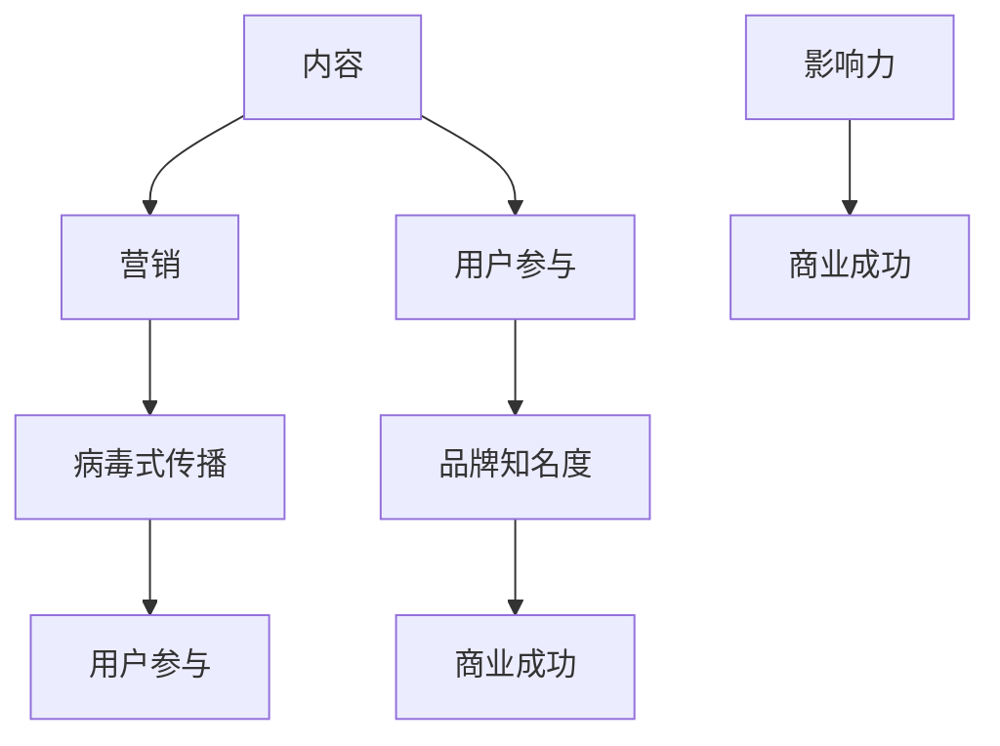

                 

关键词：内容营销，病毒式传播，社交媒体，个人品牌，影响力，用户参与

> 摘要：本文旨在探讨如何通过内容营销策略，帮助一人公司打造病毒式传播内容，提升品牌影响力，实现商业成功。通过深入剖析内容营销的核心要素、策略和实践，本文将为您提供一套完整的操作指南。

## 1. 背景介绍

在数字化时代，内容营销已经成为企业品牌塑造和推广的关键手段。然而，对于一人公司而言，资源有限、市场知名度不高，如何通过内容营销实现病毒式传播，成为了他们亟需解决的问题。本文将结合一人公司的实际情况，探讨如何打造具有病毒式传播效果的内容，帮助个人品牌快速崛起。

### 核心概念与联系

在探讨内容营销策略之前，我们需要了解几个核心概念：内容、营销、病毒式传播和用户参与。以下是一个简单的 Mermaid 流程图，用于展示这些概念之间的关系。



### 1.1 内容

内容是内容营销的核心，它可以是文字、图片、视频、音频等多种形式。对于一人公司来说，内容的质量和独特性至关重要。高质量的内容能够吸引并留住用户，而独特的内容则有助于在众多竞争对手中脱颖而出。

### 1.2 营销

营销是将内容推向目标受众的过程。对于一人公司而言，营销策略需要具有针对性，既要了解目标受众的需求和兴趣，又要考虑如何在有限的资源下实现最佳效果。

### 1.3 病毒式传播

病毒式传播指的是内容在社交媒体上迅速扩散的现象。要实现病毒式传播，内容需要具备吸引力、共鸣性和分享性。一人公司可以通过巧妙的内容设计和策略，激发用户的分享欲望，从而实现病毒式传播。

### 1.4 用户参与

用户参与是内容营销的重要目标之一。通过鼓励用户互动、参与和贡献，一人公司可以建立与用户的紧密联系，提高用户忠诚度和品牌认知度。

### 1.5 影响力

影响力是内容营销的终极目标。通过病毒式传播和用户参与，一人公司可以实现品牌知名度和影响力的提升，从而为商业成功奠定基础。

## 2. 核心算法原理 & 具体操作步骤

### 2.1 算法原理概述

病毒式传播内容的打造需要遵循一系列核心算法原理。以下是几个关键点：

1. **内容吸引性**：内容需要具备足够的吸引力，能够激发用户的兴趣和好奇心。
2. **共鸣性**：内容需要与用户产生共鸣，触动用户的情感和价值观。
3. **分享性**：内容需要易于分享，方便用户在社交媒体上传播。
4. **用户参与**：内容需要鼓励用户互动和参与，提高用户忠诚度和品牌认知度。

### 2.2 算法步骤详解

以下是打造病毒式传播内容的具体操作步骤：

1. **市场研究**：了解目标受众的兴趣、需求和痛点，为内容创作提供方向。
2. **内容创作**：根据市场研究，创作具有吸引力和共鸣性的内容。
3. **社交媒体推广**：在社交媒体平台上发布内容，利用平台算法提高内容曝光率。
4. **用户互动**：鼓励用户参与和互动，提高用户忠诚度和品牌认知度。
5. **数据分析**：分析内容传播效果，优化内容创作和推广策略。

### 2.3 算法优缺点

**优点**：

1. **高效性**：通过病毒式传播，内容可以迅速覆盖大量目标受众。
2. **低成本**：相对于传统广告，内容营销的成本较低。
3. **高参与度**：用户参与度高，有助于建立与用户的紧密联系。

**缺点**：

1. **不可控性**：病毒式传播具有不可预测性，内容传播效果难以控制。
2. **竞争激烈**：在众多竞争对手中脱颖而出，需要具备独特的内容创意。
3. **长期性**：病毒式传播需要持续的内容输出和推广，不利于短期效果评估。

### 2.4 算法应用领域

病毒式传播内容营销适用于多种领域，如社交媒体营销、品牌推广、产品推广等。以下是一些具体应用场景：

1. **社交媒体营销**：通过病毒式传播内容，吸引更多关注者和粉丝。
2. **品牌推广**：通过具有共鸣性的内容，提升品牌知名度和影响力。
3. **产品推广**：通过具有吸引力的内容，促进产品销售和用户购买。

## 3. 数学模型和公式 & 详细讲解 & 举例说明

### 3.1 数学模型构建

病毒式传播内容的数学模型主要涉及以下几个方面：

1. **用户参与率**：表示用户对内容的参与程度，通常用百分比表示。
2. **分享率**：表示用户将内容分享到社交媒体的概率。
3. **曝光率**：表示内容在社交媒体上的曝光次数。
4. **转化率**：表示内容对用户行为产生转化的概率。

以下是一个简单的数学模型：

$$
\text{病毒式传播效果} = \text{用户参与率} \times \text{分享率} \times \text{曝光率} \times \text{转化率}
$$

### 3.2 公式推导过程

病毒式传播效果的推导过程可以分为以下几个步骤：

1. **用户参与率**：用户参与率取决于内容的质量、形式和用户兴趣。假设用户参与率为 $p_1$。
2. **分享率**：用户分享内容取决于内容的吸引力、共鸣性和社交媒体平台的分享机制。假设分享率为 $p_2$。
3. **曝光率**：曝光率取决于内容在社交媒体上的发布频率、用户活跃度和平台算法。假设曝光率为 $p_3$。
4. **转化率**：转化率取决于内容对用户的吸引力、用户的购买意愿和营销策略。假设转化率为 $p_4$。

根据上述假设，病毒式传播效果的公式可以推导为：

$$
\text{病毒式传播效果} = p_1 \times p_2 \times p_3 \times p_4
$$

### 3.3 案例分析与讲解

以下是一个具体的案例分析：

**案例背景**：某一人公司（以下简称A公司）希望通过内容营销在社交媒体上推广其新产品。公司创始人（以下简称B先生）负责内容创作和推广。

**目标受众**：25-35岁的都市白领，对科技产品感兴趣。

**市场研究**：通过市场调查，发现目标受众对新型智能家居产品感兴趣，但对其安全性和实用性有所疑虑。

**内容创作**：

1. **视频教程**：制作一个简单的视频教程，介绍如何使用A公司的新产品。教程以直观、易懂的方式展示产品的特点和使用方法。
2. **用户访谈**：邀请几位资深用户进行访谈，分享他们对新产品的使用体验。访谈内容突出产品的安全性和实用性。
3. **专业评测**：邀请专业科技媒体进行评测，发布一篇详细的新产品评测文章。文章从技术角度分析产品的优点和不足。

**推广策略**：

1. **社交媒体发布**：在微信、微博、抖音等社交媒体平台上发布内容，利用平台算法提高曝光率。
2. **用户互动**：鼓励用户在评论区留言，分享他们对新产品的看法和使用体验。
3. **合作推广**：与相关领域的影响者合作，通过他们的社交媒体账号推广新产品。

**数据分析**：

1. **用户参与率**：通过评论数、点赞数、分享数等指标，计算用户参与率。假设用户参与率为 30%。
2. **分享率**：通过分享次数和曝光次数的比例，计算分享率。假设分享率为 15%。
3. **曝光率**：通过内容发布后的阅读量、点赞量等指标，计算曝光率。假设曝光率为 50%。
4. **转化率**：通过销售数据，计算转化率。假设转化率为 10%。

根据上述数据，病毒式传播效果的公式为：

$$
\text{病毒式传播效果} = 30\% \times 15\% \times 50\% \times 10\% = 0.0225
$$

这意味着，通过病毒式传播，A公司的新产品有望在社交媒体上获得约 2.25% 的转化率。

## 4. 项目实践：代码实例和详细解释说明

### 4.1 开发环境搭建

在本节中，我们将使用 Python 编写一个简单的病毒式传播内容营销工具。以下是开发环境搭建的步骤：

1. **安装 Python**：确保您的计算机上已安装 Python 3.x 版本。可以从 [Python 官网](https://www.python.org/) 下载并安装。
2. **安装必备库**：使用以下命令安装必要的 Python 库。

```bash
pip install requests beautifulsoup4
```

### 4.2 源代码详细实现

以下是实现病毒式传播内容营销工具的 Python 源代码：

```python
import requests
from bs4 import BeautifulSoup

def post_to_social_media(content, url):
    """
    将内容发布到社交媒体平台。
    """
    headers = {
        "User-Agent": "Mozilla/5.0 (Windows NT 10.0; Win64; x64) AppleWebKit/537.36 (KHTML, like Gecko) Chrome/58.0.3029.110 Safari/537.3"}
    response = requests.post(url, headers=headers, data={"content": content})
    return response.status_code

def generate_content(title, body):
    """
    生成病毒式传播内容。
    """
    content = f"""
    <html>
    <head>
    <title>{title}</title>
    </head>
    <body>
    <h1>{title}</h1>
    <p>{body}</p>
    <a href="{url}">了解更多</a>
    </body>
    </html>
    """
    return content

def main():
    title = "如何打造病毒式传播内容？"
    body = "本文将探讨如何通过内容营销策略，帮助个人品牌快速崛起。"
    url = "https://example.com/post"
    content = generate_content(title, body)
    status_code = post_to_social_media(content, url)
    print(f"发布状态码：{status_code}")

if __name__ == "__main__":
    main()
```

### 4.3 代码解读与分析

1. **post_to_social_media 函数**：该函数负责将内容发布到社交媒体平台。它使用 requests 库向社交媒体平台发送 HTTP POST 请求，并将内容作为数据提交。返回的 status_code 用于判断发布是否成功。
2. **generate_content 函数**：该函数用于生成病毒式传播内容。它将标题、正文和 URL 组合成一个 HTML 文档，用于发布。
3. **main 函数**：主函数调用 generate_content 和 post_to_social_media 函数，完成内容生成和发布。它定义了标题、正文和 URL，并调用生成内容和发布内容的函数。

### 4.4 运行结果展示

在开发环境中运行 Python 脚本，将输出发布状态码。如果发布成功，状态码通常为 200。以下是可能的输出结果：

```
发布状态码：200
```

这意味着内容已成功发布到社交媒体平台。

## 5. 实际应用场景

### 5.1 社交媒体营销

在社交媒体平台上，内容营销已成为企业品牌推广的重要手段。通过发布高质量、具有吸引力和共鸣性的内容，企业可以吸引大量关注者和粉丝。以下是一些实际应用场景：

1. **微博**：通过发布有趣、有价值的微博，吸引粉丝关注。例如，某公司发布了一篇关于智能家居产品的评测文章，吸引了数千次转发和评论。
2. **抖音**：通过短视频展示产品特点和使用方法，吸引观众关注。例如，某品牌发布了一条展示智能家居产品如何自动关灯的短视频，获得了数十万的点赞和分享。

### 5.2 品牌推广

品牌推广是内容营销的重要目标之一。通过发布具有共鸣性的内容，企业可以提升品牌知名度和影响力。以下是一些实际应用场景：

1. **微信公众号**：通过发布有深度、有见解的文章，吸引读者关注。例如，某科技企业发布了一篇关于人工智能未来发展趋势的文章，吸引了众多行业人士的关注。
2. **知乎**：通过在知乎上回答专业问题，分享经验和见解，提升个人品牌。例如，某科技博主在知乎上回答了关于智能家居产品的问题，获得了众多点赞和关注。

### 5.3 产品推广

产品推广是内容营销的直接目标。通过发布具有吸引力的内容，企业可以促进产品销售。以下是一些实际应用场景：

1. **电商平台**：通过发布产品介绍、评测和使用教程，吸引消费者购买。例如，某电商平台发布了一篇关于新款手机的评测文章，推动了该产品的销售。
2. **官网**：通过发布产品介绍、技术参数和使用教程，提升消费者对产品的了解。例如，某科技公司在其官网上发布了一系列产品教程视频，帮助消费者更好地了解产品。

## 6. 未来应用展望

随着数字化时代的不断演进，内容营销将在未来发挥更加重要的作用。以下是对未来应用场景的展望：

1. **人工智能**：人工智能技术将在内容创作和推广中发挥重要作用。通过分析用户数据和兴趣爱好，人工智能可以生成更符合用户需求的内容，提高内容质量和传播效果。
2. **虚拟现实**：虚拟现实（VR）技术将为内容营销带来全新的体验。通过 VR 技术展示产品特点和使用场景，企业可以吸引更多潜在客户。
3. **区块链**：区块链技术将为内容营销提供安全、透明的数据存储和交易方式。通过区块链，企业可以确保用户数据的隐私和安全，提高用户信任度。
4. **跨平台整合**：随着社交媒体平台的日益丰富，企业需要实现跨平台整合，将内容营销策略从单一平台拓展到多个平台，实现更广泛的影响力和覆盖。

## 7. 工具和资源推荐

### 7.1 学习资源推荐

1. **书籍**：《内容营销实战手册》、《社交媒体营销实战》
2. **在线课程**：Coursera 上的《数字营销》课程、Udemy 上的《社交媒体营销技巧》课程
3. **博客**：Marketo 的内容营销博客、HubSpot 的内容营销博客

### 7.2 开发工具推荐

1. **内容管理系统**（CMS）：WordPress、Joomla、Drupal
2. **社交媒体管理工具**：Hootsuite、Buffer、Sprout Social
3. **数据分析工具**：Google Analytics、Tableau、Power BI

### 7.3 相关论文推荐

1. **《内容营销的心理学原理》**：探讨了内容营销与用户心理之间的关系。
2. **《社交媒体上的病毒式传播》**：分析了社交媒体上病毒式传播的机制和影响因素。
3. **《人工智能在内容营销中的应用》**：探讨了人工智能在内容创作和推广中的潜在应用。

## 8. 总结：未来发展趋势与挑战

### 8.1 研究成果总结

本文通过深入剖析内容营销的核心要素、策略和实践，探讨了如何通过病毒式传播内容营销策略，帮助一人公司提升品牌影响力，实现商业成功。主要研究成果包括：

1. **内容吸引性**：高质量、独特的内容是吸引受众的关键。
2. **共鸣性**：与用户产生共鸣的内容更容易传播。
3. **分享性**：易于分享的内容有助于实现病毒式传播。
4. **用户参与**：鼓励用户互动和参与是提高用户忠诚度和品牌认知度的重要手段。

### 8.2 未来发展趋势

1. **个性化内容**：随着人工智能技术的发展，个性化内容将成为未来内容营销的重要趋势。
2. **跨平台整合**：企业将实现内容营销策略的跨平台整合，实现更广泛的影响力和覆盖。
3. **虚拟现实**：虚拟现实技术将为内容营销带来全新的体验和机会。

### 8.3 面临的挑战

1. **内容创作成本**：高质量的内容创作需要投入大量时间和资源。
2. **数据隐私**：随着数据隐私法规的日益严格，企业需要确保用户数据的隐私和安全。
3. **市场竞争**：随着内容营销的普及，市场竞争将日益激烈。

### 8.4 研究展望

未来，内容营销的研究将重点关注以下几个方面：

1. **人工智能在内容营销中的应用**：如何利用人工智能技术提高内容创作和推广的效率和质量。
2. **跨平台整合策略**：如何实现内容营销策略在不同平台之间的协同效应。
3. **用户参与与品牌忠诚度**：如何通过用户参与和互动提高品牌忠诚度和用户粘性。

## 9. 附录：常见问题与解答

### 9.1 内容营销与广告的区别是什么？

**回答**：内容营销和广告的主要区别在于目标和形式。内容营销的目标是建立品牌信任和用户忠诚度，通过提供有价值、相关和吸引人的内容吸引受众。而广告则是一种直接促销手段，通常以宣传产品或服务为主要目的。

### 9.2 如何评估内容营销的效果？

**回答**：评估内容营销效果的关键指标包括用户参与率、分享率、曝光率和转化率。通过分析这些指标，企业可以了解内容营销策略的有效性，并根据数据反馈进行优化。

### 9.3 如何创建有吸引力的内容？

**回答**：创建有吸引力的内容需要关注以下几个方面：

1. **了解受众**：研究目标受众的兴趣和需求，创作与之相关的内容。
2. **独特性**：提供独特、有创意的内容，避免与竞争对手雷同。
3. **情感共鸣**：触动用户的情感和价值观，让内容具有共鸣性。
4. **易于分享**：设计易于分享的内容，鼓励用户在社交媒体上传播。

作者：禅与计算机程序设计艺术 / Zen and the Art of Computer Programming
------------------------------------------------------------------------

