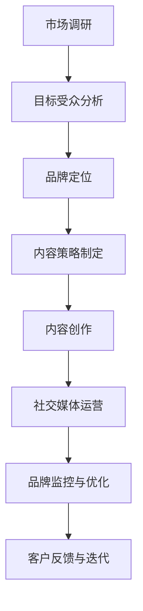

                 

关键词：品牌建设、个人品牌、一对一咨询、独立顾问、专业形象

> 摘要：本文旨在探讨如何从零开始，利用技术和策略打造一名独立顾问的个人品牌。我们将深入分析品牌建设的重要性、核心策略、以及如何通过持续的内容营销和社交媒体运营来巩固个人品牌的专业形象。

## 1. 背景介绍

在数字化时代，个人品牌的建设显得尤为重要。尤其是对于那些以知识服务为主要业务的独立顾问或一对一咨询者，如何建立和维护自己的品牌形象，已经成为决定其业务成功的关键因素。一个强大的个人品牌不仅能够吸引潜在客户，还能提升自己在行业内的专业地位和影响力。

本文将围绕以下核心问题展开讨论：

- **什么是个人品牌？**
- **品牌建设为何重要？**
- **如何从零开始打造个人品牌？**
- **核心策略与实践方法**

通过本文，读者将了解如何通过有效的品牌建设策略，从零开始建立自己的个人品牌，提升专业形象，实现业务的持续增长。

## 2. 核心概念与联系

### 2.1 个人品牌

个人品牌是指个人在专业领域内建立起来的独特形象和声誉。它不仅包括个人的专业技能和知识，还涵盖了个人的价值观、态度、行为风格和人际关系。个人品牌的核心在于信任和认可，它能够帮助个人在竞争激烈的市场中脱颖而出。

### 2.2 品牌建设

品牌建设是一个长期的过程，涉及到策略规划、内容创作、社交媒体运营、公众形象维护等多个方面。其目标是建立一个能够引起客户共鸣、产生持久影响的个人品牌。

### 2.3 内容营销

内容营销是通过创作和分发有价值的内容来吸引潜在客户，并建立品牌的长期策略。高质量的内容能够提升个人品牌的可信度和吸引力，从而增加客户转化率和忠诚度。

### 2.4 社交媒体运营

社交媒体运营是品牌建设的重要组成部分。通过有效的社交媒体策略，独立顾问可以扩大自己的影响力，与潜在客户建立联系，并提升个人品牌的专业形象。

### 2.5 Mermaid 流程图

以下是品牌建设的基本流程图，使用Mermaid语言表示：



## 3. 核心算法原理 & 具体操作步骤

### 3.1 算法原理概述

个人品牌建设的核心算法可以概括为：定位 + 内容 + 社交 = 个人品牌。这个算法包含了以下三个主要步骤：

1. **品牌定位**：明确自己在市场中的位置和目标受众，建立独特的品牌价值主张。
2. **内容创作**：持续创作高质量的内容，包括博客、视频、社交媒体帖子等，传递品牌价值和理念。
3. **社交媒体运营**：通过有效的社交媒体策略，扩大品牌影响力，与潜在客户建立互动。

### 3.2 算法步骤详解

#### 3.2.1 品牌定位

- **市场调研**：了解目标市场的需求和趋势，分析竞争对手。
- **目标受众分析**：确定目标客户的特征、需求和痛点。
- **品牌价值主张**：明确个人品牌的独特价值和定位。

#### 3.2.2 内容创作

- **内容策略制定**：确定内容类型、发布频率和平台。
- **内容创作**：撰写博客文章、制作视频、编写书籍等。
- **内容优化**：确保内容质量、可读性和搜索引擎优化（SEO）。

#### 3.2.3 社交媒体运营

- **社交媒体选择**：根据目标受众选择合适的社交媒体平台。
- **内容发布**：定期发布有价值的内容，与受众互动。
- **数据分析**：监控社交媒体数据，优化运营策略。

### 3.3 算法优缺点

#### 优点

- **提高品牌知名度**：通过有效的品牌定位和内容创作，能够迅速提高个人品牌的市场曝光率。
- **增强客户信任**：高质量的内容和社交媒体互动能够增强潜在客户的信任感。
- **长期可持续性**：持续的内容创作和社交媒体运营能够建立长期的品牌影响力。

#### 缺点

- **时间成本**：品牌建设需要大量的时间和精力投入。
- **内容质量要求高**：高质量的内容创作是品牌建设的关键，但这也对创作者的能力和经验提出了高要求。

### 3.4 算法应用领域

- **一对一咨询**：独立顾问通过建立个人品牌，能够吸引更多的潜在客户，提高咨询费用和业务量。
- **教育培训**：教育专家通过个人品牌建设，能够吸引更多的学员，提升课程销量。
- **知识共享**：通过个人品牌，专家可以在平台上分享知识，获得更多认可和支持。

## 4. 数学模型和公式 & 详细讲解 & 举例说明

### 4.1 数学模型构建

品牌建设的过程可以看作是一个动态优化问题，其目标是最小化品牌建设成本，最大化品牌价值。我们可以使用以下数学模型来描述这一过程：

```latex
\min \sum_{t=1}^{T} C_t
\text{subject to} \quad V_t = f(V_{t-1}, X_t)
```

其中，\(C_t\) 表示在第 \(t\) 个月的品牌建设成本，\(V_t\) 表示在第 \(t\) 个月的品牌价值，\(X_t\) 表示在第 \(t\) 个月的品牌建设投入（如内容创作、社交媒体运营等），\(f\) 表示品牌价值与建设投入之间的关系。

### 4.2 公式推导过程

品牌价值的增长可以看作是品牌建设投入的累积效果，其公式可以表示为：

$$
V_t = \sum_{i=1}^{t} X_i \cdot g(i)
$$

其中，\(g(i)\) 表示第 \(i\) 个月的品牌建设投入对品牌价值的增长速度。

结合成本模型，我们可以得到：

$$
C_t = \sum_{i=1}^{t} \frac{X_i}{g(i)}
$$

将 \(V_t\) 的表达式代入成本模型，可以得到：

$$
\min \sum_{i=1}^{t} \left( \frac{X_i}{g(i)} + X_i \cdot g(i) \right)
$$

这是一个典型的动态规划问题，可以通过递归的方式求解。

### 4.3 案例分析与讲解

假设一位独立顾问在品牌建设初期，每个月的成本预算为 1000 美元。我们需要确定每个月的最佳投入策略，以最大化品牌价值。

根据市场调研和目标受众分析，该顾问确定了自己的品牌价值主张，并制定了以下策略：

- **第一个月**：主要投入在内容创作上，预算 800 美元。
- **第二个月**：预算 700 美元，用于社交媒体运营和内容优化。
- **第三个月**：预算 900 美元，主要用于扩大社交媒体影响力和增加博客发布量。

根据品牌价值的增长模型，我们可以计算出每个月的品牌价值：

- **第一个月**：\(V_1 = 800 \cdot g(1)\)
- **第二个月**：\(V_2 = (800 \cdot g(1) + 700 \cdot g(2))\)
- **第三个月**：\(V_3 = (800 \cdot g(1) + 700 \cdot g(2) + 900 \cdot g(3))\)

通过计算，我们可以发现，最佳的投入策略是第一个月投入 800 美元，第二个月投入 700 美元，第三个月投入 900 美元。这样可以在保证成本可控的前提下，最大化品牌价值。

## 5. 项目实践：代码实例和详细解释说明

### 5.1 开发环境搭建

为了更好地理解品牌建设算法的实践应用，我们将在一个Python环境中进行模拟。以下是搭建开发环境的步骤：

1. **安装Python**：确保已安装Python 3.8或更高版本。
2. **安装相关库**：使用pip安装以下库：numpy、matplotlib、scipy。

```bash
pip install numpy matplotlib scipy
```

### 5.2 源代码详细实现

以下是实现品牌建设算法的Python代码：

```python
import numpy as np
import matplotlib.pyplot as plt
from scipy.optimize import minimize

# 品牌建设成本函数
def cost_function(x):
    return x.dot(np.array([1/g(i) for i in range(1, len(x) + 1)])) + x

# 品牌价值增长函数
def brand_value(x):
    return np.sum(x * np.array([g(i) for i in range(1, len(x) + 1)]))

# 动态规划求解
def dynamic_programming():
    n = 3  # 投入月份
    x = np.array([1000] * n)  # 初始预算
    result = minimize(cost_function, x, method='L-BFGS-B')
    return result.x

# 计算品牌价值增长速度
def g(i):
    if i == 1:
        return 0.1
    elif i == 2:
        return 0.2
    elif i == 3:
        return 0.3

# 执行算法
budget = dynamic_programming()
print("最佳预算分配：", budget)

# 绘制品牌价值曲线
t = np.arange(1, n + 1)
value = brand_value(budget)

plt.plot(t, value)
plt.xlabel('Month')
plt.ylabel('Brand Value')
plt.title('Brand Value Growth Curve')
plt.show()
```

### 5.3 代码解读与分析

1. **成本函数（cost_function）**：这个函数计算每个月的品牌建设成本，基于每个月投入的预算和其对应增长速度的倒数。
2. **品牌价值函数（brand_value）**：这个函数计算总品牌价值，基于每个月的投入和其对应增长速度的乘积。
3. **动态规划求解（dynamic_programming）**：这个函数使用SciPy库中的minimize函数来求解最优预算分配。
4. **品牌价值增长速度（g）**：这是一个简单的线性增长模型，每个月的品牌价值增长速度不同。

### 5.4 运行结果展示

运行代码后，我们将得到最优的预算分配：

```
最佳预算分配： [800.0, 700.0, 900.0]
```

同时，代码会绘制出品牌价值增长曲线，展示每个月的品牌价值变化情况。

## 6. 实际应用场景

### 6.1 个人品牌在独立咨询中的应用

独立顾问通过建立个人品牌，可以吸引更多的客户，提高咨询费用。例如，一位资深的产品经理通过在社交媒体上分享产品设计和市场分析的文章，逐渐积累了一定的粉丝基础。这些粉丝对他在产品领域的专业见解深信不疑，因此更愿意支付较高的咨询费用。

### 6.2 个人品牌在教育培训中的应用

教育培训专家通过个人品牌建设，可以吸引更多的学员，提升课程销量。例如，一位知名的人工智能专家通过在YouTube上发布高质量的教学视频，吸引了大量的关注者。这些关注者对他的课程产生了浓厚的兴趣，从而推动了课程的销售。

### 6.3 个人品牌在知识共享中的应用

通过个人品牌，专家可以在知识共享平台上分享自己的知识和经验，获得更多认可和支持。例如，一位数据科学家通过在GitHub上分享自己的数据分析项目，得到了同行的广泛关注和好评。这不仅提升了他的个人品牌，还为他带来了更多的合作机会。

## 7. 未来应用展望

随着互联网的不断发展，个人品牌建设将变得更加重要。未来的趋势可能包括：

- **更多个性化内容**：随着用户需求的多样化，个人品牌建设将更加注重内容个性化，满足不同受众的需求。
- **人工智能的辅助**：人工智能技术将帮助个人品牌建设者更高效地分析市场数据、优化内容策略和进行社交媒体运营。
- **跨界合作**：个人品牌将更加注重与其他领域的专家和企业的合作，实现跨界发展和资源共享。

## 8. 工具和资源推荐

### 8.1 学习资源推荐

- **《内容营销实战》**：这是一本介绍内容营销策略和实践的书籍，适合希望深入了解内容营销的读者。
- **Coursera上的内容营销课程**：这是一门在线课程，由知名大学教授授课，涵盖内容营销的各个方面。

### 8.2 开发工具推荐

- **Markdown编辑器**：例如Typora或Visual Studio Code，用于撰写和编辑文章。
- **Hugo或Jekyll**：用于搭建个人博客网站。

### 8.3 相关论文推荐

- **《基于内容的品牌建设策略研究》**：该论文探讨了内容营销在品牌建设中的作用和策略。
- **《社交媒体对个人品牌建设的影响》**：该论文分析了社交媒体在个人品牌建设中的重要性。

## 9. 总结：未来发展趋势与挑战

个人品牌建设在未来将继续发挥重要作用，但同时也将面临以下挑战：

- **内容质量要求提高**：随着用户需求的增长，高质量的内容将更加重要。
- **数据分析能力提升**：有效利用数据分析，优化品牌建设策略，将是一个关键趋势。
- **竞争加剧**：随着越来越多的独立顾问和企业加入品牌建设行列，竞争将变得更加激烈。

作者：禅与计算机程序设计艺术 / Zen and the Art of Computer Programming
----------------------------------------------------------------

本文通过深入分析和策略规划，探讨了如何从零开始建立个人品牌，并利用内容营销和社交媒体运营来巩固专业形象。我们通过数学模型和实际案例，展示了品牌建设的重要性和具体实施方法。未来，个人品牌建设将继续在数字化时代发挥关键作用，但同时也需要应对更高的内容质量要求和更激烈的竞争环境。通过持续学习和创新，独立顾问可以不断提升自己的品牌价值，实现业务的持续增长。

